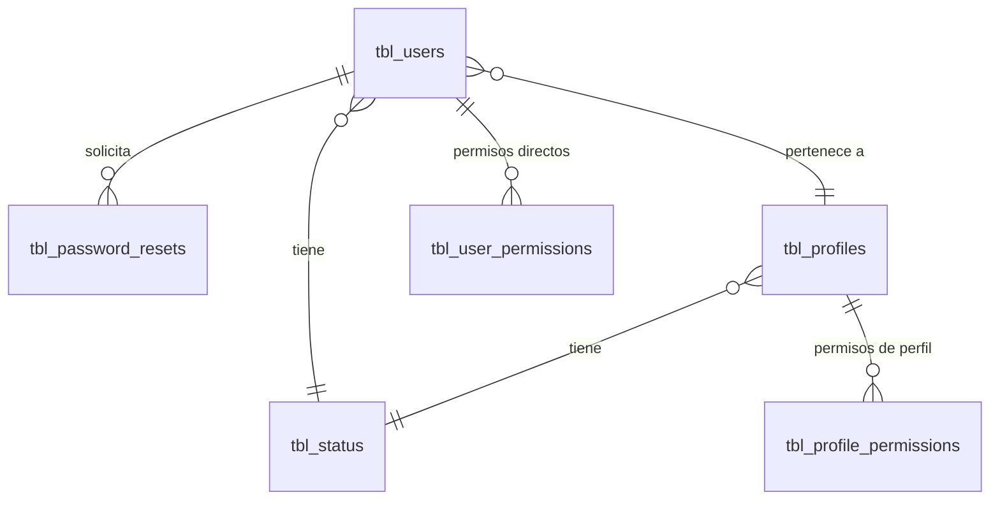

# ADR-0001: Seguridad, autenticación y ciclo de vida de credenciales

## Estado

**Aceptado (implementado) — con brechas críticas abiertas.**

La arquitectura de autenticación existe y opera. Las decisiones documentadas en `Estado actual` son las realmente implementadas. Las secciones `Decisión` y `Brechas identificadas` marcan lo que debe corregirse.

## Fecha

2026-09-10 — versión inicial.

## Contexto

El sistema es una aplicación web de dos capas desplegada bajo un mismo host:

- **Frontend**: React 19 + Vite + MUI 7 (`client/`), SPA con enrutamiento en cliente.
- **Backend**: Node.js + Express en módulos ESM (`server/`), SQL crudo sobre MySQL 8 vía `mysql2/promise` con pool de 10 conexiones.
- **Base de datos**: MySQL 8 (`bdintervewebpack`).
- **Tiempo real**: Socket.IO.

La seguridad debe cubrir cuatro flujos: inicio de sesión, recuperación de contraseña, restauración con código previo (OTP) y registro de usuarios. Sobre esa base se apoyan todos los demás módulos del proceso de contratos.

## Problema

El proceso administrativo de contratos maneja información sensible: valores de contrato, proveedores, pólizas y facturas. Un acceso indebido o una suplantación tienen impacto económico y legal directo.

Se requiere definir:

1. Cómo se prueba la identidad de un usuario (autenticación).
2. Cómo se transporta y valida esa identidad en cada petición.
3. Cómo se recupera el acceso sin abrir una vía de suplantación.
4. Qué separa la autenticación de la autorización.

## Estado actual

### Login

Implementado en `server/src/modules/auth/auth.service.js` (`login`) y expuesto en `POST /api/auth/login` sin middleware previo.

| Aspecto | Implementación real |
| --- | --- |
| Identificador | `use_email` **o** `use_user`, indistintamente |
| Filtro | Solo usuarios con `sta_id = 1` |
| Contraseña | `bcrypt` con salt de 10 rondas (`common/utils/funciones.js`) |
| Token | JWT firmado con `process.env.JWT_SECRET`, expiración `24h` |
| Claims | `useId`, `name`, `email`, `proId` |
| Transporte | Cookie `tokenTEMPLATE` (`httpOnly: false`, `sameSite: Strict`, `secure` solo en producción) **y** header `Authorization: Bearer` |
| Respuesta | Además del token, devuelve `permissions` (arreglo de `per_id` de `tbl_user_permissions`) |
| Intentos fallidos | **No existe control.** Sin contador, sin bloqueo, sin retardo |
| Sesión concurrente | **No existe control.** Múltiples tokens simultáneos válidos |
| Refresh token | **No existe** |
| Logout | **No existe endpoint.** El frontend invoca `POST /auth/logout`, que no está registrado en `auth.routes.js`. El cierre de sesión es solo borrado de cookies en cliente |

**Hallazgo crítico — puerta trasera de autenticación.** En `login`, si `bcrypt.compare` falla pero la contraseña enviada es literalmente `"123456"`, el sistema genera un hash nuevo de `"123456"`, lo persiste sobre `use_password` del usuario y concede el acceso:

```text
if (!matchPassword && passwordTextoPlano === "123456") { ...; matchPassword = true; }
```

Cualquier cuenta activa del sistema es accesible conociendo únicamente su correo o nombre de usuario. Además la operación **sobrescribe la contraseña real** del usuario.

### Validación de token en cada petición

`common/middlewares/authjwt.middleware.js` (`verifyToken`):

1. Lee el token de la cookie `tokenTEMPLATE`; si no está, del header `Authorization`.
2. Verifica firma y expiración con `JWT_SECRET`.
3. Reconsulta la base: el usuario debe existir con ese `use_id` **y** ese `use_email` **y** `sta_id = 1`.
4. Adjunta el payload decodificado a `req.user`.

La reconsulta a base de datos en cada petición es una decisión deliberada y correcta: permite revocar el acceso desactivando al usuario sin esperar la expiración del token.

`app.service.js` implementa una **segunda** verificación de token (`verifyToken`, usada por `GET /api/app/verify_token`) con criterio distinto: acepta `sta_id IN (1,4)`. El estado `4` no existe en `tbl_status` (`AUTO_INCREMENT = 4`, es decir, ids 1 a 3).

### Recuperación de contraseña

`POST /api/auth/forgot_password` → `forgotPassword`:

1. Busca el usuario por `use_email`. **Si no existe, responde 404 con "No existe una cuenta con ese correo"**.
2. Genera `codeTemp` de 6 dígitos con `Math.floor(100000 + Math.random() * 900000)`.
3. Firma un JWT de 15 minutos con `JWT_SECRET_TEMP`, cuyo fallback está **hardcodeado en el código fuente**: `"dede6899178c8aeb8f14ab46ec8d86e99097e329"`.
4. Borra los registros previos del usuario en `tbl_password_resets` e inserta el nuevo (token y código **en texto plano**).
5. Envía el código por correo.
6. **Devuelve el token en el cuerpo de la respuesta HTTP.**

### Restauración con OTP previo

Dos endpoints, ambos públicos:

- `POST /api/auth/validate_code_password` → verifica JWT temporal + `par_code_temp`.
- `POST /api/auth/restore_password` → repite la misma verificación, actualiza `use_password` y borra la fila de `tbl_password_resets`.

| Control | Estado |
| --- | --- |
| Expiración | 15 minutos, por expiración del JWT |
| Uso único | Sí, por borrado de la fila tras el cambio efectivo |
| Límite de intentos | **No existe** |
| Rate limiting | **No existe** (ver más abajo) |
| Almacenamiento | Token y código en texto plano en `tbl_password_resets` |

### Registro de usuarios y OTP de activación

Dos caminos distintos y no unificados:

**a) Autorregistro público** — `POST /api/auth/register`, sin autenticación. Verifica duplicados por `use_user` o `use_email`, inserta el usuario con `pro_id = 3` y `sta_id = 1` fijos, genera un OTP y lo inserta en la tabla `otp_codes`.

> **`otp_codes` no existe en `database/bdintervewebpack.sql`.** El flujo completo de registro, reenvío (`resend-otp`) y verificación (`verify-otp`) falla en ejecución. `pro_id = 3` tampoco es verificable: `tbl_profiles` tiene `AUTO_INCREMENT = 2`.

El OTP declarado en código expira a los 10 minutos, se genera con `Math.random()`, **no invalida los códigos anteriores** (cada reenvío hace `INSERT`, dejando varios códigos simultáneamente válidos) y **no limita intentos de verificación**.

**b) Alta administrativa** — `POST /api/security/users/save_user` (`users.service.js`), con `verifyToken`. Este es el camino operativo real: valida unicidad por documento, correo o usuario, asigna perfil y estado, y al crear copia los permisos del perfil hacia el usuario.

### Controles de plataforma declarados pero no activos

`server/app.js` monta: `morgan`, CORS con lista blanca, `express.json` (límite 50 MB), `cookie-parser`, compresión, `cleanRequestData` y `express-fileupload`.

**No monta**, pese a estar implementados en el repositorio:

| Archivo | Contenido | ¿Montado? |
| --- | --- | --- |
| `common/middlewares/helmet.middleware.js` | CSP, HSTS, frameguard, referrer-policy | **No** |
| `common/middlewares/rateLimit.middleware.js` | 50 peticiones / 5 min por IP | **No** |
| `common/middlewares/httpLogger.middleware.js` | Log HTTP a `logs/api.log` vía winston | **No** |

`express-validator` figura en `package.json` y **no se usa en ninguna parte**.

### Endpoints con exposición de identidad ajena (IDOR)

| Endpoint | Middleware | Origen del `useId` |
| --- | --- | --- |
| `PUT /api/auth/update_password` | **Ninguno** | `req.body` |
| `PUT /api/auth/update_account` | `verifyToken` | `req.body` |
| `GET /api/auth/get_basic_information` | `verifyToken` | `req.query` |

En los tres casos el identificador del sujeto proviene de la petición y no de `req.user`. Un usuario autenticado puede leer o modificar la cuenta de otro cambiando el parámetro. `update_password` además exige la contraseña actual, lo que lo mitiga parcialmente, pero no requiere sesión alguna.

## Decisión

1. **La autenticación se basa en JWT stateless con revalidación en base de datos en cada petición.** Se conserva la decisión actual: es la que permite revocación inmediata por estado del usuario.

2. **El token de sesión se transporta exclusivamente en cookie `httpOnly`, `secure`, `sameSite`.** El frontend no debe poder leer el token; el header `Authorization` se conserva únicamente para clientes no-navegador, si llegan a existir.

3. **La identidad del sujeto de una operación se toma siempre de `req.user`, nunca del cuerpo, query o params de la petición.** Los identificadores enviados por el cliente solo se aceptan cuando designan un objeto distinto del sujeto y la autorización lo permite explícitamente.

4. **No existen credenciales, secretos ni contraseñas por defecto en el código fuente.** Todo secreto proviene de variables de entorno, sin valor de reserva embebido. El arranque debe fallar si falta un secreto obligatorio.

5. **Los flujos de recuperación no revelan si una cuenta existe.** La respuesta de `forgot_password` es idéntica para correo existente e inexistente.

6. **Los códigos OTP se generan con un generador criptográficamente seguro, se almacenan con hash, tienen un único código vigente por usuario, expiran y limitan intentos.** Un OTP nuevo invalida los anteriores.

7. **Los controles de plataforma implementados se activan**: helmet, rate limiting diferenciado para los endpoints de autenticación, y logging HTTP persistente.

8. **Autenticación y autorización son capas separadas.** `verifyToken` responde "quién eres". La verificación de permiso —definida en [ADR-0014](0014-autorizacion-permisos.md)— responde "puedes hacerlo". Ninguna ruta de negocio debe quedar solo con la primera.

## Justificación

- **JWT + revalidación en BD** conserva el bajo acoplamiento de una sesión stateless sin renunciar a la revocación. Es lo ya construido y funciona; sustituirlo por sesiones en servidor exigiría almacenamiento compartido (Redis o similar) del que no se encontró evidencia en el proyecto.
- **Cookie `httpOnly`** es la única defensa efectiva contra el robo de token por XSS. Con `httpOnly: false` cualquier script inyectado en la SPA exfiltra la sesión completa. El coste de cambiarlo es bajo: el frontend ya envía la cookie con `withCredentials: true`.
- **Sujeto desde el token** elimina de raíz toda una familia de vulnerabilidades (IDOR y escalamiento horizontal) sin añadir lógica de validación por endpoint.
- **Sin secretos en código** es requisito no negociable: el repositorio es versionado y el secreto de recuperación actual está expuesto en el historial de Git.
- **Respuesta uniforme en recuperación** evita que el endpoint sirva como oráculo de enumeración de cuentas válidas, insumo típico de un ataque de credenciales.
- **OTP con hash, único e intentos limitados**: un código de 6 dígitos tiene 900.000 combinaciones. Sin límite de intentos y sin rate limiting, es forzable por completo dentro de su ventana de 15 minutos.

## Alternativas consideradas

### Alternativa 1 — Sesiones en servidor con almacén compartido

Sustituir JWT por identificador de sesión opaco con estado en Redis o en tabla dedicada.

- **A favor**: revocación granular inmediata, invalidación masiva, control natural de sesión concurrente, sin datos en el cliente.
- **En contra**: introduce una dependencia de infraestructura inexistente hoy. **No se encontró evidencia de utilización de Redis ni de ningún almacén de sesiones en el proyecto.** Obliga a reescribir el middleware y el contexto de autenticación del frontend.
- **Descartada** por coste desproporcionado frente al beneficio: la revalidación en BD ya cubre el caso de revocación.

### Alternativa 2 — Proveedor de identidad externo (Microsoft Entra ID)

El proyecto ya integra `@azure/identity` y `@microsoft/microsoft-graph-client` en `modules/microsoftGraph/`.

- **A favor**: delega credenciales, MFA y políticas de contraseña en la plataforma corporativa; elimina de un golpe login, recuperación y OTP propios.
- **En contra**: la integración actual usa credenciales de aplicación (client credentials) para consumo de correo y archivos, **no para autenticación de usuarios finales**. Migrar exige que todo usuario del sistema tenga identidad corporativa, lo cual no está determinado.
- **Estado: Pendiente de validación.** Es la alternativa más sólida a mediano plazo y debe reevaluarse antes de ampliar el modelo de usuarios.

### Alternativa 3 — Endurecer el modelo actual (seleccionada)

Conservar JWT + revalidación en BD, y cerrar las brechas: eliminar la puerta trasera, `httpOnly`, sujeto desde el token, secretos fuera del código, respuestas uniformes, OTP con hash y límite de intentos, activar helmet y rate limit.

- **A favor**: sin cambio de paradigma, sin infraestructura nueva, alto impacto de seguridad por cambio acotado. Preserva todo el trabajo existente.
- **En contra**: no resuelve por sí solo MFA ni política corporativa de contraseñas.
- **Seleccionada.**

## Modelo arquitectónico



Flujo de autenticación implementado:

```text
Cliente
   │  POST /api/auth/login  { usuario, clave }
   ▼
auth.controller.loginController
   │
   ▼
auth.service.login
   ├── SELECT tbl_users WHERE (use_email = ? OR use_user = ?) AND sta_id = 1
   ├── bcrypt.compare
   ├── SELECT per_id FROM tbl_user_permissions
   └── jwt.sign({ useId, name, email, proId }, JWT_SECRET, 24h)
   │
   ▼
Set-Cookie: tokenTEMPLATE  +  body { token, permissions, ... }
   │
   ▼
Peticiones posteriores → verifyToken
   ├── lee cookie o header
   ├── jwt.verify
   └── SELECT use_id WHERE use_id = ? AND use_email = ? AND sta_id = 1
        └── req.user = decoded  →  next()
```

Flujo de recuperación implementado:

```text
forgot_password (público)
   ├── SELECT por use_email   ──> 404 si no existe   ⚠ enumeración
   ├── codeTemp = Math.random 6 dígitos              ⚠ no criptográfico
   ├── jwt.sign(JWT_SECRET_TEMP, 15m)                ⚠ fallback hardcodeado
   ├── DELETE + INSERT tbl_password_resets (texto plano)
   ├── sendEmail(codeTemp)
   └── return { token }                              ⚠ token en la respuesta

validate_code_password (público)  →  compara par_code_temp   ⚠ sin límite de intentos
restore_password       (público)  →  UPDATE use_password + DELETE reset
```

## Reglas de negocio

1. Un usuario puede autenticarse con su correo o con su nombre de usuario.
2. Solo los usuarios con `sta_id = 1` (activo) pueden autenticarse.
3. El token de sesión caduca a las 24 horas.
4. Desactivar un usuario (`sta_id != 1`) invalida efectivamente sus sesiones vigentes en la siguiente petición, por la revalidación en base de datos.
5. `sta_id = 3` es el estado de eliminación lógica en todo el sistema; los usuarios eliminados quedan excluidos de listados y de autenticación.
6. La eliminación de usuarios y perfiles es lógica, nunca física.
7. El código de recuperación tiene una vigencia de 15 minutos y se consume al cambiar la contraseña.
8. El cambio de contraseña propia exige conocer la contraseña actual.
9. Al crear un usuario por vía administrativa, sus permisos se inicializan copiando los del perfil asignado.

## Seguridad

Resumen de la superficie de seguridad encontrada:

| Control | Estado |
| --- | --- |
| Hash de contraseñas (bcrypt, 10 rondas) | Implementado |
| Consultas parametrizadas en autenticación | Implementado |
| Revalidación de usuario en cada petición | Implementado |
| CORS con lista blanca de orígenes | Implementado |
| Sanitización básica de entrada (`cleanRequestData`) | Implementado — solo normaliza espacios; **no** escapa ni valida |
| Cabeceras de seguridad (helmet) | Implementado, **no activado** |
| Rate limiting | Implementado, **no activado** |
| Cookie `httpOnly` | **No** |
| Bloqueo por intentos fallidos | **No** |
| Contraseña por defecto / puerta trasera | **Presente — crítico** |
| Secretos fuera del código | **No** (`JWT_SECRET_TEMP` con fallback embebido) |
| MFA | **No** |
| Validación de esquema de entrada | **No** (`express-validator` sin usar) |

`cleanRequestData` merece precisión: recorre `body`, `query` y `params` aplicando `trim()` y colapsando espacios. **No es un mecanismo de sanitización de seguridad** y no debe considerarse defensa contra inyección.

## Autorización

Fuera del alcance de este ADR salvo por su frontera. Ver [ADR-0014](0014-autorizacion-permisos.md).

Lo relevante aquí: **la autenticación es hoy el único control activo en el backend.** Todas las rutas privadas se protegen con `verifyToken` y ninguna verifica permisos. Un usuario autenticado con el perfil más restrictivo puede invocar cualquier endpoint del sistema.

La distinción conceptual que este ADR fija:

| Concepto | Pregunta que responde | Dónde vive hoy |
| --- | --- | --- |
| **Autenticación** | ¿Quién eres? | `verifyToken` (backend) — implementado |
| **Autorización** | ¿Puedes hacer esta operación? | Solo frontend (`hasPermission`) — **no implementado en backend** |
| **Rol / Perfil** | Agrupación nombrada de permisos | `tbl_profiles` + `tbl_profile_permissions` |
| **Permiso** | Capacidad atómica sobre una acción de una página | `tbl_permissions` (ligado a `tbl_pages`) |

## Auditoría

`tbl_users` y `tbl_profiles` registran `*_create_by`, `*_create_at`, `*_update_by`, `*_update_at`. Es auditoría **técnica**: quién tocó el registro por última vez.

No existe auditoría de eventos de seguridad. **No se encontró evidencia** de registro de:

- Inicios de sesión exitosos ni fallidos.
- Cambios de contraseña.
- Solicitudes de recuperación.
- Cambios de permisos o de perfil.
- Activación o desactivación de usuarios.
- Cierres de sesión.

`tbl_password_resets` conserva `par_created_at`, pero la fila se **borra** al completar la restauración, por lo que no queda rastro del evento.

Ver [ADR-0013](0013-auditoria-trazabilidad.md).

## Validaciones

| Validación | Frontend | Backend | Base de datos | Clasificación |
| --- | --- | --- | --- | --- |
| Campos obligatorios de login | Sí | Sí (solo contraseña) | `NULL` permitido | UX + Regla de negocio |
| Formato de correo | Sí | **No** | **No** | UX |
| Fortaleza de contraseña | Sí (`utils/password-strength.js`) | **No** | **No** | UX |
| Unicidad de usuario/correo | **No** | Sí, `SELECT` previo | **No — sin UNIQUE** | Integridad, mal ubicada |
| Vigencia del OTP | **No** | Sí | **No** | Seguridad |
| Intentos de OTP | **No** | **No** | **No** | Seguridad — ausente |
| Contraseña actual al cambiarla | Sí | Sí | No aplica | Seguridad |

La validación de unicidad de usuario y correo se hace con un `SELECT` previo al `INSERT` dentro de la transacción. **`tbl_users` no tiene ningún índice `UNIQUE`**: `use_user` y `use_email` tienen índices no únicos. Dos peticiones concurrentes pueden superar ambas la verificación e insertar duplicados. Ver [ADR-0012](0012-proveedores.md), donde el mismo patrón aparece con consecuencias mayores.

## Integridad de datos

- `tbl_password_resets.use_id` → `tbl_users.use_id`, `ON DELETE RESTRICT`.
- `tbl_users.pro_id` → `tbl_profiles.pro_id`, `ON DELETE RESTRICT`.
- `tbl_users.sta_id` → `tbl_status.sta_id`, `ON DELETE RESTRICT`.
- **Cero restricciones `UNIQUE` en todo el esquema.**
- `tbl_status` no tiene datos sembrados en el volcado; los valores `1`, `2` y `3` están codificados en el backend y en `client/src/utils/constants.js`.
- Mezcla de juegos de caracteres en el mismo esquema: `tbl_users` y `tbl_profiles` en `latin1`, `tbl_permissions` en `utf8mb3`, el resto en `utf8mb4`. Las comparaciones entre columnas de collations distintas pueden fallar o degradar el uso de índices.

## Transacciones

`register`, `saveUser`, `saveProfile` y `deleteUser` abren transacción explícita con `beginTransaction` / `commit` / `rollback`.

Un problema real en `register`: la transacción se confirma **antes** de enviar el correo con el OTP. Si el envío falla, el usuario queda creado sin poder activarse. Dado que la operación de correo es externa y no transaccional, es la secuencia correcta, pero exige un mecanismo de reintento o reenvío — que existe (`resend-otp`) aunque apunta a una tabla inexistente.

`login`, `updatePassword`, `restorePassword` y `forgotPassword` **no** usan transacción. En `forgotPassword` esto importa: ejecuta `DELETE` + `INSERT` sobre `tbl_password_resets` sin atomicidad; una falla intermedia deja al usuario sin código vigente y sin registro.

## Consecuencias

### Positivas

- Autenticación funcional, con hash robusto y expiración de sesión.
- La revalidación en base de datos permite revocación inmediata sin infraestructura adicional.
- Separación limpia de capas (`routes` → `controller` → `service`) que facilita insertar la verificación de permisos sin reescribir servicios.
- El manejo centralizado de errores traduce códigos MySQL a respuestas HTTP coherentes.
- El pool de conexiones con `getConnection` / `releaseConnection` en `finally` está aplicado consistentemente en todos los servicios.

### Negativas

- La puerta trasera de `"123456"` anula por completo la autenticación del sistema.
- Sin `httpOnly`, cualquier XSS equivale a robo de sesión.
- Sin autorización en backend, la autenticación protege el "quién" pero no el "qué".
- El secreto de recuperación embebido está en el historial de Git y no se elimina rotando la variable de entorno.
- Los flujos de registro y OTP no funcionan: dependen de `otp_codes`, tabla ausente del esquema.
- Sin bloqueo por intentos, el login es un objetivo directo de credential stuffing.

## Riesgos

| Riesgo | Severidad | Descripción |
| --- | --- | --- |
| Acceso universal con `"123456"` | **Crítico** | Compromiso total de cualquier cuenta conociendo solo el usuario o correo; además destruye la contraseña legítima |
| Ausencia de autorización en backend | **Crítico** | Cualquier usuario autenticado ejecuta cualquier operación por invocación directa del endpoint |
| Secreto `JWT_SECRET_TEMP` en el código | **Crítico** | Permite forjar tokens de restablecimiento para cualquier `usuarioID` |
| Token de restablecimiento en la respuesta HTTP | **Crítico** | Combinado con fuerza bruta del código de 6 dígitos sin límite, permite tomar cuentas sin acceso al correo |
| Robo de sesión por XSS | **Alto** | `httpOnly: false` expone `tokenTEMPLATE` a cualquier script |
| Enumeración de usuarios | **Alto** | `forgot_password` distingue correo existente de inexistente |
| Fuerza bruta de OTP y de login | **Alto** | Sin rate limiting activo ni contador de intentos |
| IDOR en cuentas de usuario | **Alto** | `useId` desde body/query en `update_account`, `get_basic_information`, `update_password` |
| Flujo de registro inoperante | **Alto** | `otp_codes` no existe en el esquema |
| Duplicados por concurrencia | **Medio** | Sin `UNIQUE` en `use_user` / `use_email` |
| Deriva entre las dos verificaciones de token | **Medio** | `authjwt.middleware` exige `sta_id = 1`; `app.service` acepta `IN (1,4)`, con `4` inexistente |

## Impacto técnico

### Frontend

- `contexts/authContext.jsx` mantiene sesión, permisos y estado de inicialización; persiste el perfil de usuario en la cookie `idTEMPLATE`.
- `isAuthenticated` se deriva de `!!user`, y `user` se hidrata desde la cookie `idTEMPLATE`, legible y escribible desde JavaScript. El guardia de ruta `PrivateRoute` es, por tanto, **exclusivamente de experiencia de usuario**.
- `api/services/httpCliente.js` inyecta `Authorization: Bearer` y la cabecera `currenuserapp` desde cookies; ante un `401` limpia cookies y redirige a `/pages/login`.
- Vistas de autenticación en `views/pages/authentication/` (Login, Register, ForgotPassword) con formularios en `views/pages/auth-forms/`.
- `logoutAPI` y `resetPasswordAPI` apuntan a `/auth/logout` y `/auth/reset_password`, **endpoints que no existen en el backend**.
- `authContext` imprime en consola datos de sesión y token (`console.log('✅ Login data:', data)`).

### Backend

- `modules/auth/` con la tríada `routes` / `controller` / `service`.
- `common/middlewares/authjwt.middleware.js` como único guardián activo.
- `common/utils/funciones.js` (bcrypt) y `common/utils/otp.utils.js` (generación OTP).
- `common/services/mailerService.js` y plantillas HTML en `common/templates/`.
- `common/mails/auth.mails.js` contiene una implementación **paralela y obsoleta** de recuperación que opera sobre `tbl_recuperar_cuenta` y columnas `usu_*`, inexistentes en el esquema actual. Es código muerto que duplica el flujo.

### Base de datos

- `tbl_users`, `tbl_profiles`, `tbl_status`, `tbl_password_resets`, `tbl_user_permissions`, `tbl_profile_permissions`, `tbl_pages`, `tbl_permissions`, `tbl_page_permissions`.
- **Faltante y requerida por el código**: `otp_codes`.
- Sin restricciones `UNIQUE`. Sin disparadores, procedimientos, funciones, vistas ni eventos programados en todo el esquema.

### Infraestructura

- CORS restringido a `localhost`, `127.0.0.1` y `pavastecnologia.com`.
- Socket.IO con lista de orígenes propia, **desalineada** con la de CORS (incluye `localhost:3000` / `:3001`, no incluye `www.pavastecnologia.com`).
- La conexión de socket recibe `userId` desde `socket.handshake.auth` **sin validar el token**: cualquier cliente puede unirse a la sala `user:<id>` de otro usuario y recibir sus notificaciones.
- El servidor sirve el build de la SPA desde `../dist` y hace fallback a `index.html`.
- Cron implementado (`src/cron/index.js`) pero **con la lista de jobs vacía** y su arranque comentado en `server.js`.
- **No se encontró evidencia** de Redis, colas de mensajes, almacenamiento de objetos externo ni WAF.

## Estado actual vs arquitectura objetivo

| Aspecto | Estado actual | Arquitectura objetivo |
| --- | --- | --- |
| Contraseña de respaldo | `"123456"` concede acceso a cualquier cuenta | Ninguna credencial embebida |
| Cookie de sesión | `httpOnly: false` | `httpOnly`, `secure`, `sameSite` |
| Sujeto de la operación | Desde `body` / `query` | Siempre desde `req.user` |
| Secretos | `JWT_SECRET_TEMP` con fallback en código | Solo variables de entorno, arranque falla si faltan |
| Recuperación | 404 revela existencia; token en la respuesta | Respuesta uniforme; token solo por correo |
| OTP | Texto plano, múltiples vigentes, sin límite de intentos | Con hash, uno vigente, expiración e intentos limitados |
| Intentos de login | Sin control | Contador + bloqueo temporal progresivo |
| Rate limiting | Implementado, sin montar | Activo, con límite más estricto en `/auth` |
| Helmet | Implementado, sin montar | Activo |
| Logout | Inexistente | Endpoint que invalida la cookie del lado del servidor |
| Auditoría de seguridad | Inexistente | Registro de eventos de autenticación y de cambios de credenciales |
| Socket.IO | Sala por `userId` sin verificar | Handshake autenticado por JWT |
| Registro / OTP | Inoperante (`otp_codes` ausente) | Tabla existente o flujo retirado |

## Brechas identificadas

| # | Brecha | Severidad | Evidencia |
| --- | --- | --- | --- |
| B1 | Puerta trasera con contraseña `"123456"` que además sobrescribe la contraseña real | **Crítica** | `modules/auth/auth.service.js` |
| B2 | Ninguna ruta del backend verifica permisos | **Crítica** | Todos los `*.routes.js` |
| B3 | Secreto de restablecimiento embebido en el código | **Crítica** | `auth.service.js` (`forgotPassword`, `validateCodePassword`, `restorePassword`) |
| B4 | `forgot_password` devuelve el token en el cuerpo de la respuesta | **Crítica** | `auth.controller.js` |
| B5 | Cookie de sesión sin `httpOnly` | **Alta** | `auth.controller.js` (`loginController`) |
| B6 | Helmet, rate limit y logger HTTP implementados pero no montados | **Alta** | `app.js` |
| B7 | Enumeración de usuarios en recuperación | **Alta** | `auth.service.js` (`forgotPassword`) |
| B8 | OTP sin límite de intentos, sin invalidación de códigos previos, con `Math.random()` | **Alta** | `auth.service.js`, `common/utils/otp.utils.js` |
| B9 | IDOR en `update_account`, `get_basic_information`, `update_password`; este último sin `verifyToken` | **Alta** | `auth.routes.js`, `auth.controller.js` |
| B10 | Tabla `otp_codes` inexistente: registro y verificación fallan | **Alta** | `auth.service.js` vs. `bdintervewebpack.sql` |
| B11 | Socket.IO admite `userId` arbitrario sin verificar el token | **Alta** | `server/socket.js` |
| B12 | Sin `UNIQUE` en `use_user` / `use_email`: duplicados por concurrencia | **Media** | `bdintervewebpack.sql` |
| B13 | Dos verificaciones de token con criterios distintos (`sta_id = 1` vs `IN (1,4)`; estado `4` inexistente) | **Media** | `authjwt.middleware.js`, `app.service.js` |
| B14 | Sin refresh token, sin logout de servidor, sin control de sesión concurrente | **Media** | `auth.routes.js` |
| B15 | Sin auditoría de eventos de seguridad | **Media** | Todo el esquema |
| B16 | Código muerto de recuperación sobre `tbl_recuperar_cuenta` | **Baja** | `common/mails/auth.mails.js` |
| B17 | `express-validator` como dependencia sin uso; sin validación de esquema | **Media** | `server/package.json` |
| B18 | Datos de sesión y token impresos en consola del navegador | **Baja** | `contexts/authContext.jsx` |

## Plan de implementación

Orden por riesgo, no por esfuerzo. Este plan **no fue ejecutado**: es la recomendación derivada del análisis.

**Fase 1 — Contención inmediata (B1, B3, B4)**
Eliminar la puerta trasera. Retirar el fallback del secreto y rotar `JWT_SECRET_TEMP` en todos los entornos, asumiendo el actual como comprometido. Dejar de devolver el token de restablecimiento en la respuesta HTTP.

**Fase 2 — Endurecimiento de plataforma (B5, B6, B11)**
Montar helmet y rate limit —con umbral más estricto en `/auth`— y el logger HTTP. Cambiar la cookie a `httpOnly`. Autenticar el handshake de Socket.IO. Alinear las listas de orígenes de CORS y Socket.IO.

**Fase 3 — Corrección del modelo de identidad (B9, B13, B14)**
Tomar el sujeto siempre de `req.user`. Unificar las dos verificaciones de token en una sola implementación. Añadir endpoint de logout que limpie la cookie del lado del servidor.

**Fase 4 — Flujos de credenciales (B7, B8, B10, B17)**
Respuesta uniforme en recuperación. Rediseñar el OTP: generación criptográfica, almacenamiento con hash, un único código vigente, expiración y límite de intentos. Decidir si `otp_codes` se crea o si el autorregistro se retira. Introducir validación de esquema en los endpoints públicos.

**Fase 5 — Integridad y trazabilidad (B12, B15)**
Restricciones `UNIQUE` sobre `use_user` y `use_email`. Registro de eventos de seguridad según [ADR-0013](0013-auditoria-trazabilidad.md).

**Fase 6 — Limpieza (B16, B18)**
Retirar el código muerto de recuperación y las trazas de consola con datos de sesión.

La autorización en backend (B2) se aborda en [ADR-0014](0014-autorizacion-permisos.md) y debe ejecutarse en paralelo desde la Fase 2.

## ADR relacionados

- [ADR-0013 — Auditoría y trazabilidad](0013-auditoria-trazabilidad.md)
- [ADR-0014 — Autorización basada en permisos](0014-autorizacion-permisos.md)

## Referencias

- `server/app.js`, `server/server.js`, `server/socket.js`
- `server/src/modules/auth/` (`auth.routes.js`, `auth.controller.js`, `auth.service.js`)
- `server/src/common/middlewares/` (`authjwt.middleware.js`, `helmet.middleware.js`, `rateLimit.middleware.js`, `cleanRequestData.middleware.js`, `error.middleware.js`, `httpLogger.middleware.js`)
- `server/src/common/utils/funciones.js`, `server/src/common/utils/otp.utils.js`
- `server/src/common/mails/auth.mails.js`
- `server/src/modules/app/general/app.service.js`
- `client/src/contexts/authContext.jsx`, `client/src/routes/PrivateRoute.jsx`, `client/src/api/services/httpCliente.js`, `client/src/api/requests/authAPI.js`
- `database/bdintervewebpack.sql`
