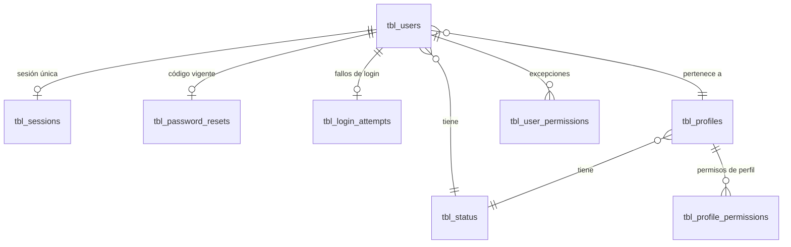

# ADR-0001: Seguridad, autenticación y ciclo de vida de credenciales

## Estado

**Aceptado (implementado).**

La arquitectura de autenticación existe, opera y cierra las 18 brechas identificadas en la versión inicial de este ADR. Queda abierto:

- **MFA**: fuera del alcance de este ADR (ver Alternativa 2, pendiente de validación).

## Fecha

- 2026-09-10 — versión inicial (análisis del estado heredado: brechas B1–B18).
- 2026-09-24 — la capa de datos pasa de `mysql2` (SQL crudo) a Prisma 7.
- 2026-09-24 — se implementan las decisiones 1–8 y se cierran las brechas salvo B15 y MFA. El documento se reescribe para describir el estado real; el estado heredado queda resumido en "Brechas identificadas".
- 2026-09-24 — se cierra B15: los eventos de autenticación se registran en la bitácora `tbl_audit_log` ([ADR-0013](0013-auditoria-trazabilidad.md)).

## Contexto

El sistema es una aplicación web de dos capas desplegada bajo un mismo host:

- **Frontend**: React 19 + Vite + MUI 7 (`client/`), SPA con enrutamiento en cliente.
- **Backend**: Node.js + Express en módulos ESM (`server/`), acceso a datos sobre MySQL 8 vía **Prisma 7** (`server/src/common/configs/prismaClient.js`, cliente singleton con el driver adapter `@prisma/adapter-mariadb`). Ningún service usa SQL crudo; el pool de `mysql2` (`db.config.js`) queda solo para `testConnection` al arrancar `server.js`.
- **Base de datos**: MySQL 8. Esquema base `database/bdtemplate.sql` + migraciones numeradas en `database/migrations/`.
- **Tiempo real**: Socket.IO.

La seguridad cubre tres flujos: inicio de sesión, mantenimiento de la sesión (renovación y cierre) y recuperación de contraseña. El alta de usuarios es exclusivamente administrativa. Sobre esta base se apoyan todos los demás módulos del proceso de contratos.

## Problema

El proceso administrativo de contratos maneja información sensible: valores de contrato, proveedores, pólizas y facturas. Un acceso indebido o una suplantación tienen impacto económico y legal directo.

Se requiere definir:

1. Cómo se prueba la identidad de un usuario (autenticación).
2. Cómo se transporta, valida, renueva y revoca esa identidad.
3. Cómo se recupera el acceso sin abrir una vía de suplantación.
4. Qué separa la autenticación de la autorización.

## Estado actual

### Login

`POST /api/auth/login` → `auth.controller.loginController` → `auth.service.login`. La ruta tiene rate limit estricto (`authRateLimit`) y validación de esquema (`loginSchema`).

| Aspecto | Implementación |
| --- | --- |
| Identificador | `use_email` **o** `use_user`, indistintamente |
| Filtro | Solo usuarios con `sta_id = 1` |
| Contraseña | `bcrypt`, 10 rondas (`common/utils/funciones.js`) |
| Usuario inexistente | Se compara igual contra un hash bcrypt de relleno: misma duración que una contraseña incorrecta |
| Mensaje de error | Único para usuario inexistente, contraseña incorrecta y cuenta bloqueada |
| Intentos fallidos | Contador por cuenta en `tbl_login_attempts`. Cada 5 fallos consecutivos: bloqueo de 15 min, que se duplica en cada bloqueo (30 min, 1 h…) hasta 24 h. Mientras dura, ni la contraseña correcta entra |
| Rate limit por IP | `/api/auth/*`: 10 peticiones fallidas / 15 min. `/api/*`: 50 / 5 min |
| Sesión | Se abre en `tbl_sessions` (ver abajo). **Una sola sesión por usuario**: el login reemplaza cualquier sesión anterior |
| Transporte | Cookies `token` (access) y `refresh_token`, ambas `httpOnly`, `sameSite: Strict`, `secure` en producción. El header `Authorization: Bearer` se acepta para clientes no navegador |
| Respuesta | Datos del usuario y `permissions` (unión perfil + excepciones, ver [ADR-0014](0014-autorizacion-permisos.md)). **Ningún token en el cuerpo** |

### Sesión: access token, refresh token y revocación

Implementado en `common/services/session.service.js` sobre `tbl_sessions` (`database/migrations/0007_create_sessions.sql`).

| Elemento | Implementación |
| --- | --- |
| Access token | JWT firmado con `JWT_SECRET`, vida `JWT_EXPIRES_IN` (15 min por defecto). Claims: `useId`, `name`, `email`, `proId`, `sid` |
| Refresh token | 32 bytes aleatorios (`crypto.randomBytes`), vida `JWT_REFRESH_EXPIRES_IN` (`7d` por defecto, deslizante). En BD solo su SHA-256 |
| Sesión única | `UNIQUE(use_id)` en `tbl_sessions`; login = upsert con un `ses_key` nuevo |
| Renovación | `POST /api/auth/refresh`: rota el refresh token (el anterior deja de servir) y emite un access token nuevo con el mismo `sid` |
| Pestañas concurrentes | Un refresh token recién rotado se acepta 30 s más, y solo emite un access token (no rota de nuevo) |
| Reutilización | Un refresh token rotado presentado fuera de esa ventana se trata como robo: se revoca la sesión |
| Logout | `POST /api/auth/logout` borra la fila de `tbl_sessions` (identificada por el refresh token, o por el `sid` del access token aunque esté vencido) y limpia las cookies |
| Revocación | También al restaurar la contraseña, al cambiar la propia contraseña (se abre una sesión nueva) y cuando un administrador desactiva, elimina o cambia la contraseña de un usuario |
| Sockets | Cada socket se une a la sala `session:<sid>`; revocar la sesión desconecta esos sockets |

### Validación de token en cada petición

`common/middlewares/authjwt.middleware.js` (`verifyToken`), única implementación, usada por todas las rutas privadas (incluida `GET /api/app/verify_token`):

1. Lee el token de la cookie `token`; si no está, del header `Authorization`.
2. Verifica firma y expiración con `JWT_SECRET`.
3. `isSessionActive`: la sesión `sid` debe existir en `tbl_sessions`, no estar vencida, y su usuario debe tener ese `use_email` y `sta_id = 1`. Un JWT sin `sid` se rechaza.
4. Adjunta el payload a `req.user`.

El handshake de Socket.IO (`server/socket.js`) aplica exactamente la misma verificación. La sala de notificaciones (`user:<id>`) sale del token, nunca de lo que envía el cliente.

### Recuperación de contraseña

`POST /api/auth/forgot_password` → `forgotPassword`:

1. Busca un usuario **activo** por `use_email`. Si no existe, no hace nada.
2. Genera un código de 6 dígitos con `crypto.randomInt`.
3. Guarda en `tbl_password_resets` **solo** su HMAC-SHA256 atado al `use_id` (`common/utils/resetCode.utils.js`, clave derivada de `JWT_SECRET`). El upsert sobre `UNIQUE(use_id)` deja un único código vigente y reinicia intentos y vigencia.
4. Envía el código por correo, sin esperar el envío.
5. Responde **siempre lo mismo**, con un piso de 300 ms: no revela si la cuenta existe ni por contenido ni por tiempo.

`POST /api/auth/validate_code_password` y `POST /api/auth/restore_password` (públicos, con rate limit y validación de esquema):

| Control | Estado |
| --- | --- |
| Identificación | Correo + código. Nunca un token que haya viajado por HTTP |
| Expiración | 15 minutos desde `par_created_at` |
| Intentos | 5 por código. El intento se consume con un incremento condicionado **antes** de comparar; agotados, el código se borra |
| Comparación | `crypto.timingSafeEqual` sobre el HMAC |
| Uso único | La restauración borra el código |
| Efectos de restaurar | Cambia la contraseña, borra el código y el bloqueo por intentos (una sola transacción) y revoca la sesión |

### Alta de usuarios

Solo administrativa: `POST /api/security/users/save_user`, con `verifyToken` + `requirePermission` (crear o editar según el body) + `saveUserSchema`. El autorregistro público y su flujo OTP se retiraron del backend y del cliente.

### Controles de plataforma

`server/app.js` monta, en orden: `helmet` (CSP, HSTS, frameguard, referrer-policy), logger HTTP (winston → `logs/api.log`), CORS con allowlist (`cors.config.js`, compartida con Socket.IO), parsers de JSON/urlencoded, `cookie-parser`, compresión, `cleanRequestData`, `express-fileupload`, estáticos de la SPA, `/api` con `defaultRateLimit`, un **404 JSON** para cualquier `/api/*` inexistente, el fallback de la SPA y `errorMiddleware`.

`server.js` no arranca sin `JWT_SECRET`, y registra manejadores de `unhandledRejection` (registrar y seguir) y `uncaughtException` (registrar, cerrar y salir con código 1 para que pm2 reinicie).

### Identidad del sujeto

Toda operación sobre la propia cuenta toma el sujeto de `req.user`: `get_basic_information`, `update_account`, `update_password`, `count_users`, notificaciones, menú y permisos propios, y el autor de la auditoría de documentos (`doc_create_by`/`doc_update_by`).

## Decisión

1. **La autenticación se basa en JWT de vida corta respaldado por una sesión en base de datos.** El access token es stateless en su firma, pero cada petición verifica que su sesión (`sid`) siga viva. Esto permite revocar de inmediato sin esperar la expiración.

2. **La sesión se renueva con un refresh token opaco, rotado en cada uso y guardado solo como hash.** La reutilización de un refresh token ya rotado revoca la sesión.

3. **Un usuario tiene como máximo una sesión viva.** Un login nuevo cierra la anterior.

4. **Los tokens se transportan exclusivamente en cookies `httpOnly`, `secure` y `sameSite: Strict`.** El frontend no puede leerlos; el header `Authorization` queda solo para clientes no navegador.

5. **La identidad del sujeto de una operación se toma siempre de `req.user`, nunca del cuerpo, query o params.** Los identificadores enviados por el cliente solo se aceptan cuando designan un objeto distinto del sujeto y la autorización lo permite explícitamente.

6. **No existen credenciales, secretos ni contraseñas por defecto en el código fuente.** Todo secreto proviene de variables de entorno, sin valor de reserva embebido, y el arranque falla si falta uno obligatorio.

7. **Los flujos de login y recuperación no revelan si una cuenta existe**, ni por contenido ni por tiempo de respuesta.

8. **Los códigos de recuperación se generan con un CSPRNG, se almacenan como HMAC, tienen un único código vigente por usuario, expiran a los 15 minutos y admiten 5 intentos.**

9. **El login se protege en dos capas**: rate limit por IP y bloqueo progresivo por cuenta.

10. **Toda entrada se valida por esquema** (`express-validator`) antes de llegar a la regla de negocio.

11. **Autenticación y autorización son capas separadas.** `verifyToken` responde "quién eres"; `requirePermission` ([ADR-0014](0014-autorizacion-permisos.md)) responde "puedes hacerlo". Una ruta que solo tiene `verifyToken` debe operar únicamente sobre recursos del propio usuario o catálogos no sensibles.

## Justificación

- **JWT corto + sesión en BD** conserva la verificación barata de la firma y agrega revocación inmediata sin infraestructura nueva (no hay Redis ni almacén de sesiones en el proyecto). La consulta por petición ya existía para revalidar el estado del usuario; ahora es la misma consulta, sobre `tbl_sessions`.
- **Refresh token opaco y rotado**: un access token robado sirve como mucho 15 minutos. Un refresh token robado se detecta en cuanto su dueño legítimo o el atacante lo reutilizan. Guardarlo como SHA-256 es suficiente porque tiene 256 bits de entropía.
- **Sesión única** (decisión del área usuaria): acota la exposición a un solo dispositivo y convierte cualquier login no autorizado en un cierre visible de la sesión legítima.
- **Cookie `httpOnly`** es la única defensa efectiva contra el robo de token por XSS.
- **Sujeto desde el token** elimina de raíz toda una familia de vulnerabilidades (IDOR y escalamiento horizontal).
- **HMAC en lugar de hash simple para el código**: 900.000 combinaciones se invierten al instante con SHA-256; el HMAC exige además la clave del servidor, que no vive en la BD.
- **Intentos por código + rate limit + bloqueo por cuenta**: el rate limit por IP se esquiva rotando IPs; los contadores por cuenta y por código no.
- **Validación de esquema**: rechaza en el borde lo que el service nunca debería ver (tipos, rangos, longitudes; por ejemplo, contraseñas de más de 72 caracteres, que bcrypt truncaría en silencio).

## Alternativas consideradas

### Alternativa 1 — Sesiones en servidor con identificador opaco en Redis o tabla

Sustituir JWT por un identificador de sesión opaco consultado en cada petición.

- **A favor**: revocación granular inmediata, sin datos en el cliente.
- **En contra**: exige reescribir el middleware y el cliente, y Redis no existe en el proyecto.
- **Descartada** como sustituto completo. Sin embargo, el diseño seleccionado **toma su ventaja principal**: la sesión vive en `tbl_sessions` y el JWT solo lleva su `sid`.

### Alternativa 2 — Proveedor de identidad externo (Microsoft Entra ID)

- **A favor**: delega credenciales, MFA y políticas de contraseña en la plataforma corporativa.
- **En contra**: exige que todo usuario tenga identidad corporativa, lo cual no está determinado. La integración con Microsoft Graph que existía se retiró del repositorio (no tenía tablas que la respaldaran).
- **Estado: Pendiente de validación.** Es el camino natural para MFA y debe reevaluarse antes de ampliar el modelo de usuarios.

### Alternativa 3 — Endurecer el modelo actual (seleccionada)

Conservar JWT + revalidación en BD y cerrar las brechas: sesión en BD con refresh token rotado, sesión única, `httpOnly`, sujeto desde el token, secretos fuera del código, respuestas uniformes, códigos con HMAC e intentos limitados, bloqueo por cuenta, helmet, rate limit y validación de esquema.

- **A favor**: sin cambio de paradigma ni infraestructura nueva; alto impacto de seguridad con cambios acotados.
- **En contra**: no resuelve MFA ni política corporativa de contraseñas.
- **Seleccionada e implementada.**

## Modelo arquitectónico



Flujo de sesión:

```text
POST /api/auth/login  { usuario, clave }
   ├── authRateLimit → loginSchema → validate
   ├── auth.service.login
   │     ├── tbl_users (activo, por correo o usuario)       ── no existe → bcrypt de relleno → 403
   │     ├── tbl_login_attempts: ¿bloqueada?                 ── sí → 403 (sin comparar)
   │     ├── bcrypt.compare                                  ── falla → +1 fallo (bloqueo cada 5) → 403
   │     └── permisos efectivos (perfil ∪ excepciones)
   └── session.createSession  (upsert tbl_sessions por use_id; desconecta la sesión anterior)
         └── Set-Cookie: token (JWT 15m, sid)  +  refresh_token (opaco 7d)

Petición privada → verifyToken
   ├── cookie token | Authorization: Bearer
   ├── jwt.verify
   └── tbl_sessions: ses_key = sid, no vencida, usuario activo con ese correo → req.user

401 en el cliente → POST /api/auth/refresh (una sola en vuelo) → reintenta la petición
   └── session.refreshSession
         ├── hash vigente   → rota refresh, nuevo access
         ├── hash anterior  → < 30 s: nuevo access sin rotar | ≥ 30 s: revoca sesión → 401
         └── desconocido    → 401 → login

POST /api/auth/logout → revoca sesión (refresh o sid) → limpia cookies
```

Flujo de recuperación:

```text
forgot_password (público)
   ├── tbl_users activo por correo           ── no existe → nada (misma respuesta, piso de 300 ms)
   ├── code = crypto.randomInt(6 dígitos)
   ├── upsert tbl_password_resets: HMAC(code, use_id), intentos = 0
   └── sendEmail(code)  (sin esperar)

validate_code_password / restore_password (públicos)
   ├── código vigente (< 15 min) del usuario activo
   ├── consume intento (par_attempts < 5)    ── agotados → borra código → 400
   ├── timingSafeEqual(HMAC)                 ── no coincide → 400
   └── restore: UPDATE password + DELETE código + DELETE bloqueo (transacción) → revoca sesión
```

## Reglas de negocio

1. Un usuario puede autenticarse con su correo o con su nombre de usuario.
2. Solo los usuarios con `sta_id = 1` (activo) pueden autenticarse, renovar sesión o recuperar su contraseña.
3. El access token caduca a los 15 minutos; la sesión, a los 7 días sin uso (cada renovación la extiende).
4. Un usuario tiene como máximo una sesión viva: iniciar sesión cierra la anterior.
5. Desactivar, eliminar o cambiarle la contraseña a un usuario cierra su sesión de inmediato.
6. `sta_id = 3` es el estado de eliminación lógica en todo el sistema; los usuarios eliminados quedan excluidos de listados y de autenticación.
7. La eliminación de usuarios y perfiles es lógica, nunca física.
8. Cada 5 intentos de login fallidos consecutivos la cuenta se bloquea temporalmente; el bloqueo se duplica en cada ocurrencia, hasta 24 horas.
9. El código de recuperación vale 15 minutos y admite 5 intentos. Pedir uno nuevo invalida el anterior; usarlo lo consume.
10. Restaurar la contraseña levanta el bloqueo por intentos fallidos.
11. El cambio de contraseña propia exige conocer la contraseña actual. Las contraseñas tienen entre 8 y 72 caracteres.
12. Al crear un usuario no se copian permisos: hereda los de su perfil por resolución en cada petición ([ADR-0014](0014-autorizacion-permisos.md)).
13. Los estados base (1 activo, 2 inactivo, 3 eliminado) se siembran por migración (`0010_seed_status.sql`) y tienen ids fijos.

## Seguridad

| Control | Estado |
| --- | --- |
| Hash de contraseñas (bcrypt, 10 rondas) | Implementado |
| Consultas parametrizadas (Prisma) | Implementado |
| Sesión en BD con revocación inmediata | Implementado |
| Access token corto + refresh token rotado con detección de reutilización | Implementado |
| Sesión única por usuario | Implementado |
| Cookies `httpOnly` / `secure` / `sameSite: Strict` | Implementado |
| Secretos solo en variables de entorno | Implementado |
| Respuesta uniforme en login y recuperación (contenido y tiempo) | Implementado |
| Código de recuperación CSPRNG + HMAC + intentos + único | Implementado |
| Rate limiting (general y estricto en `/auth`) | Implementado y activo |
| Bloqueo progresivo por cuenta | Implementado |
| Cabeceras de seguridad (helmet) | Implementado y activo |
| CORS con allowlist (API y Socket.IO) | Implementado |
| Socket.IO con handshake autenticado | Implementado |
| Validación de esquema de entrada | Implementado en todos los módulos |
| 404 JSON en `/api/*` inexistente | Implementado |
| Manejo de `uncaughtException` / `unhandledRejection` | Implementado |
| Sanitización (`cleanRequestData`) | Implementado — solo normaliza espacios; **no** es defensa contra inyección |
| Auditoría de eventos de seguridad | Implementado — bitácora `tbl_audit_log` ([ADR-0013](0013-auditoria-trazabilidad.md)) |
| MFA | **No** — fuera de alcance, ver Alternativa 2 |

## Autorización

Fuera del alcance de este ADR salvo por su frontera. Ver [ADR-0014](0014-autorizacion-permisos.md).

La autorización en backend existe: `requirePermission(perId)` resuelve en cada petición el permiso efectivo (perfil ∪ excepciones individuales) y protege toda ruta que lee o modifica objetos ajenos. Las rutas que solo tienen `verifyToken` operan sobre recursos propios o catálogos no sensibles:

| Ruta | Por qué no exige permiso |
| --- | --- |
| `app/get_menu`, `app/verify_token`, `app/get_permissions_user` | Menú, sesión y permisos del propio usuario (`req.user`) |
| `app/get_profiles`, `app/get_statuses_by_scope` | Catálogos para combos (nombres de perfiles y estados) |
| `app/notifications/*` | El service filtra siempre por `use_id = req.user.useId` |
| `auth/get_basic_information`, `auth/update_account`, `auth/update_password` | Cuenta propia (`req.user`) |
| `security/permissions/get_catalog` | Catálogo estático de `per_id` |

`auth/get_windows_by_profile` recibe un `proId` arbitrario, así que exige `security.users.view`.

| Concepto | Pregunta que responde | Dónde vive |
| --- | --- | --- |
| **Autenticación** | ¿Quién eres? | `verifyToken` + `tbl_sessions` |
| **Autorización** | ¿Puedes hacer esta operación? | `requirePermission` (backend) + `hasPermission` (UX en el frontend) |
| **Rol / Perfil** | Agrupación nombrada de permisos | `tbl_profiles` + `tbl_profile_permissions` |
| **Permiso** | Capacidad atómica sobre una acción | `tbl_permissions` + `common/constants/permissions.constants.js` |

## Auditoría

**Auditoría técnica**: `tbl_users` y `tbl_profiles` registran `*_create_by/at`, `*_update_by/at` y `*_delete_by/at`, con FK a `tbl_users` y el autor siempre tomado de la sesión. El bloqueo de login vive en una tabla aparte (`tbl_login_attempts`) precisamente para no alterar `use_update_at` en cada intento fallido.

**Auditoría funcional de seguridad** (cierra B15): cada evento queda en la bitácora `tbl_audit_log` ([ADR-0013](0013-auditoria-trazabilidad.md)), dentro de la misma transacción que el cambio que lo produce, con IP e identificador de operación:

| Evento | Operación | Autor (`use_id`) |
| --- | --- | --- |
| Login exitoso (indica si cerró otra sesión) | `LOGIN` | El usuario |
| Login fallido (usuario inexistente, contraseña incorrecta o cuenta bloqueada) | `LOGIN_FALLIDO` | Anónimo |
| Bloqueo por intentos | `CUENTA_BLOQUEADA` (misma operación que el fallo que lo dispara) | Anónimo |
| Logout | `LOGOUT` | El dueño de la sesión |
| Reutilización de refresh token | `SESION_REVOCADA` | Anónimo |
| Cambio de la propia contraseña | `CONTRASENA_CAMBIADA` | El usuario |
| Solicitud de recuperación (solo si la cuenta existe) | `RECUPERACION_SOLICITADA` | Anónimo |
| Código de recuperación incorrecto o agotado | `CODIGO_RECUPERACION_FALLIDO` | Anónimo |
| Contraseña restaurada | `CONTRASENA_RESTAURADA` | El usuario |
| Cambios de permisos, perfil o estado de usuarios | `ASIGNAR`, `REVOCAR`, `EDITAR`, `ELIMINAR`, `REACTIVAR` | Quien lo hizo |

Nunca se registran la contraseña, su hash, el código de recuperación, los tokens ni el identificador tecleado en un login fallido.

Siguen existiendo rastros operativos que **no son auditoría** y se sobrescriben: `tbl_sessions` (la sesión vigente), `tbl_login_attempts` (el contador actual) y el log HTTP.

## Validaciones

| Validación | Frontend | Backend | Base de datos | Clasificación |
| --- | --- | --- | --- | --- |
| Campos obligatorios de login | Sí | Sí (`loginSchema`) | — | UX + Regla de negocio |
| Formato de correo | Sí | Sí (`isEmail`) | No | UX + Integridad |
| Longitud de contraseña (8–72) | Parcial (`utils/password-strength.js`) | Sí | No aplica (se guarda el hash) | Seguridad |
| Unicidad de usuario/correo | No | Sí, consulta previa | **Sí — `UNIQUE`** (`use_user`, `use_email`) | Integridad |
| Formato del código (6 dígitos) | Sí | Sí | — | UX + Seguridad |
| Vigencia del código | No | Sí | — | Seguridad |
| Intentos del código | No | Sí (condicionado, atómico) | `par_attempts` | Seguridad |
| Un código vigente por usuario | — | Upsert | **Sí — `UNIQUE(use_id)`** | Integridad |
| Una sesión por usuario | — | Upsert | **Sí — `UNIQUE(use_id)`** | Seguridad |
| Contraseña actual al cambiarla | Sí | Sí | No aplica | Seguridad |
| Esquema de entrada del resto de endpoints | Parcial | Sí (`*.validation.js`) | — | Seguridad + Integridad |

Un duplicado que supere la consulta previa por concurrencia choca contra el índice `UNIQUE` y el `errorMiddleware` lo traduce a 409 (`P2002`).

## Integridad de datos

- `tbl_sessions.use_id`, `tbl_password_resets.use_id`, `tbl_login_attempts.use_id` → `tbl_users.use_id`.
- `tbl_users.pro_id` → `tbl_profiles.pro_id`; `tbl_users.sta_id` → `tbl_status.sta_id`.
- Restricciones `UNIQUE`: `use_user`, `use_email`, `pro_name`, (`pro_id`, `pag_id`), (`per_id`, `pro_id`), (`per_id`, `use_id`), (`use_id`, `pag_id`), y las de este ADR: `tbl_sessions.use_id` / `ses_key` / `ses_refresh_hash`, `tbl_password_resets.use_id`.
- `tbl_status` se siembra con ids fijos 1–3 (`0010_seed_status.sql` y `prisma/seed.js`).

## Transacciones

Se usan `prisma.$transaction(async (tx) => {...})` (interactiva, con rollback si el callback lanza) o `prisma.$transaction([...])` (lote atómico).

- `restorePassword`: lote atómico con el `UPDATE` de la contraseña, el `DELETE` del código y el `DELETE` del bloqueo. La revocación de la sesión va **después**, fuera de la transacción, porque también desconecta sockets y eso no se puede deshacer con un rollback.
- `forgotPassword`: un único upsert (antes era DELETE + INSERT sin transacción).
- Consumo de intentos del código: `updateMany` condicionado (`par_attempts < 5`), atómico sin transacción explícita.
- Rotación del refresh token: `updateMany` condicionado al hash vigente. Si otra petición rotó antes, esta no pisa la rotación ajena.
- `createSession`: upsert por `use_id`.
- `saveUser`, `saveProfile`, `deleteProfile`: transacción interactiva. `deleteUser`: un solo `updateMany` (borrado lógico).

## Consecuencias

### Positivas

- Un token robado sirve como mucho 15 minutos, y un refresh token robado se detecta al reutilizarse.
- El logout, la desactivación y los cambios de contraseña cortan el acceso en la siguiente petición, también en tiempo real (sockets).
- La sesión única hace visible cualquier login no autorizado: la sesión legítima se cierra.
- Ni el login ni la recuperación revelan qué cuentas existen.
- El código de recuperación ya no es forzable por fuerza bruta ni legible desde la BD.
- El acceso a datos se centraliza en un único cliente Prisma: las consultas quedan parametrizadas por construcción y los `orderBy`/`where` que dependen del cliente pasan por mapas fijos.
- La separación de capas (`routes` → `controller` → `service`) permitió incorporar sesión, autorización y validación sin reescribir los servicios.

### Negativas

- Cada petición autenticada hace una consulta a `tbl_sessions` (antes ya consultaba `tbl_users`: el costo no aumenta).
- La sesión única impide usar la aplicación en dos dispositivos a la vez. Es una decisión explícita del área usuaria.
- Todos los usuarios deben volver a iniciar sesión una vez desplegado el cambio: los JWT emitidos antes no tienen `sid`.
- El bloqueo por cuenta puede usarse para bloquear a un usuario legítimo si se conoce su correo o usuario. Lo mitigan el rate limit por IP y la restauración de contraseña, que levanta el bloqueo.
- Sin MFA, una contraseña filtrada sigue dando acceso completo hasta que se detecta.

## Riesgos

| Riesgo | Severidad | Estado |
| --- | --- | --- |
| Compromiso de cuenta por contraseña filtrada | **Alto** | Mitigado parcialmente (bloqueo, sesión única visible). Se cierra con MFA |
| Actividad maliciosa sin rastro auditable | **Medio** | Cerrado — eventos en la bitácora ([ADR-0013](0013-auditoria-trazabilidad.md)). Falta una vista para consultarlos (B16 de ADR-0013) |
| Denegación de servicio a una cuenta por bloqueo | **Bajo** | Aceptado: rate limit por IP + restauración de contraseña |
| Exposición de `JWT_SECRET` | **Crítico si ocurre** | Controlado: solo en variables de entorno. Rotarlo invalida todas las sesiones y los códigos pendientes |
| Configuración de `JWT_EXPIRES_IN` demasiado larga | **Medio** | Controlado por despliegue: el valor recomendado es `15m` |

## Impacto técnico

### Frontend

- `contexts/authContext.jsx`: sesión, permisos y estado de inicialización. La cookie `id` (no httpOnly) es solo un cache del perfil para la UI, nunca la fuente de verdad.
- `api/services/httpCliente.js`: ante un 401, renueva la sesión una vez (`refreshSession`, una sola renovación en vuelo) y reintenta; si falla, limpia el cache y redirige a `/pages/login`.
- `socket/SocketProvider.jsx`: si el handshake es rechazado, renueva la sesión y reconecta (máximo 2 intentos).
- Vistas de autenticación: Login y ForgotPassword. El registro público se retiró.

### Backend

- `modules/auth/`: rutas, controller, service y `auth.validation.js`.
- `common/services/session.service.js`: creación, renovación, verificación y revocación de sesiones.
- `common/middlewares/authjwt.middleware.js`: `verifyToken`.
- `common/utils/resetCode.utils.js`: código de recuperación.
- `common/utils/validation.utils.js` + un `*.validation.js` por módulo.
- `common/middlewares/error.middleware.js`: traduce errores de Prisma y MySQL sin exponer detalle interno.

### Base de datos

- Tablas: `tbl_users`, `tbl_profiles`, `tbl_status`, `tbl_sessions`, `tbl_password_resets`, `tbl_login_attempts`, `tbl_user_permissions`, `tbl_profile_permissions`, `tbl_pages`, `tbl_permissions`, `tbl_page_permissions`, `tbl_user_pages`.
- Migraciones de este ADR: `0007_create_sessions.sql`, `0008_password_resets_hash.sql`, `0009_create_login_attempts.sql`, `0010_seed_status.sql`.

### Infraestructura

- Variables de entorno: `JWT_SECRET` (obligatoria), `JWT_EXPIRES_IN` (`15m`), `JWT_REFRESH_EXPIRES_IN` (`7d`).
- CORS y Socket.IO comparten la allowlist de `common/configs/cors.config.js`.
- pm2 (`ecosystem.config.cjs`) reinicia el proceso tras un `uncaughtException`.
- No hay Redis, colas de mensajes ni WAF; el diseño no los requiere.

## Estado actual vs arquitectura objetivo

| Aspecto | Estado actual | Arquitectura objetivo |
| --- | --- | --- |
| Credenciales embebidas | Ninguna | Ninguna ✅ |
| Cookies de sesión | `httpOnly`, `secure`, `sameSite` | ✅ |
| Sujeto de la operación | Siempre `req.user` | ✅ |
| Secretos | Solo variables de entorno; el arranque falla si falta | ✅ |
| Recuperación | Respuesta uniforme; código solo por correo | ✅ |
| Código de recuperación | CSPRNG, HMAC, único, 15 min, 5 intentos | ✅ |
| Intentos de login | Contador por cuenta + bloqueo progresivo | ✅ |
| Rate limiting | Activo, más estricto en `/auth` | ✅ |
| Helmet | Activo | ✅ |
| Logout | Revoca la sesión en el servidor | ✅ |
| Refresh token / sesión concurrente | Rotado, con detección de reutilización; sesión única | ✅ |
| Socket.IO | Handshake autenticado por JWT + sesión | ✅ |
| Registro / OTP | Retirado; alta solo administrativa | ✅ |
| Validación de esquema | Todos los módulos | ✅ |
| Auditoría de seguridad | Eventos de autenticación en `tbl_audit_log` | ✅ |
| MFA | Inexistente | A evaluar con la Alternativa 2 |

## Brechas identificadas

Brechas encontradas en la versión inicial de este ADR y su resolución:

| # | Brecha | Severidad | Estado | Resolución |
| --- | --- | --- | --- | --- |
| B1 | Contraseña maestra `"123456"` que además sobrescribía la contraseña real | Crítica | ✅ Cerrada | Eliminada de `auth.service.js` |
| B2 | Ninguna ruta del backend verificaba permisos | Crítica | ✅ Cerrada | `requirePermission` en toda ruta sobre objetos ajenos ([ADR-0014](0014-autorizacion-permisos.md)); `get_windows_by_profile` exige `security.users.view` |
| B3 | Secreto de restablecimiento embebido en el código | Crítica | ✅ Cerrada | Sin fallback; `JWT_SECRET_TEMP` retirado; secreto rotado |
| B4 | `forgot_password` devolvía el token en la respuesta | Crítica | ✅ Cerrada | La solicitud se identifica por correo + código; `par_token` eliminado |
| B5 | Cookie de sesión sin `httpOnly` | Alta | ✅ Cerrada | Cookies `token` y `refresh_token` httpOnly |
| B6 | Helmet, rate limit y logger HTTP sin montar | Alta | ✅ Cerrada | Montados en `app.js` |
| B7 | Enumeración de usuarios en recuperación | Alta | ✅ Cerrada | Respuesta y tiempo uniformes; también en el login |
| B8 | Código sin límite de intentos, sin invalidación y con `Math.random()` | Alta | ✅ Cerrada | CSPRNG, HMAC, 5 intentos atómicos, único por usuario |
| B9 | IDOR en `update_account`, `get_basic_information`, `update_password` | Alta | ✅ Cerrada | Sujeto desde `req.user`; también en `count_users` y en la auditoría de documentos |
| B10 | Tabla `otp_codes` inexistente: registro roto | Alta | ✅ Cerrada | Autorregistro retirado de backend y cliente |
| B11 | Socket.IO admitía `userId` arbitrario | Alta | ✅ Cerrada | Handshake autenticado con JWT + sesión |
| B12 | Sin `UNIQUE` en `use_user` / `use_email` | Media | ✅ Cerrada | Índices `UNIQUE` en el esquema |
| B13 | Dos verificaciones de token con criterios distintos | Media | ✅ Cerrada | Un único `verifyToken` |
| B14 | Sin refresh token, sin logout de servidor, sin control de sesión concurrente | Media | ✅ Cerrada | `tbl_sessions`: refresh rotado, logout que revoca, sesión única |
| B15 | Sin auditoría de eventos de seguridad | Media | ✅ Cerrada | Bitácora `tbl_audit_log` ([ADR-0013](0013-auditoria-trazabilidad.md)) |
| B16 | Código muerto de recuperación sobre `tbl_recuperar_cuenta` | Baja | ✅ Cerrada | `common/mails/auth.mails.js` eliminado |
| B17 | Sin validación de esquema | Media | ✅ Cerrada | `*.validation.js` en todos los módulos |
| B18 | Datos de sesión impresos en la consola del navegador | Baja | ✅ Cerrada | Trazas retiradas de `authContext.jsx` |

Otras correcciones de la misma revisión (ver `SECURITY.md`): bloqueo de login por cuenta, retiro de `GET /documents/blob` (SSRF) y `DELETE /documents/temp/:filename` (path traversal sin sesión), 404 JSON en `/api/*`, manejadores de errores de proceso, traducción de errores de Prisma y seed de `tbl_status`.

## Plan de implementación

Las fases 1 a 6 del plan original están **ejecutadas** (la trazabilidad, B15, con las migraciones `0011` a `0013` de [ADR-0013](0013-auditoria-trazabilidad.md)). Queda:

**Fase 7 — MFA (pendiente de validación)**
Decidir entre MFA propio (TOTP) y delegar en un proveedor de identidad (Alternativa 2).

**Despliegue de este cambio**
1. Aplicar las migraciones `0007` a `0010` en orden.
2. Fijar `JWT_EXPIRES_IN=15m` y `JWT_REFRESH_EXPIRES_IN=7d`.
3. Desplegar backend y frontend a la vez: todos los usuarios deberán iniciar sesión de nuevo.

## ADR relacionados

- [ADR-0013 — Auditoría y trazabilidad](0013-auditoria-trazabilidad.md)
- [ADR-0014 — Autorización basada en permisos](0014-autorizacion-permisos.md)

## Referencias

- `server/app.js`, `server/server.js`, `server/socket.js`
- `server/src/modules/auth/` (`auth.routes.js`, `auth.controller.js`, `auth.service.js`, `auth.validation.js`)
- `server/src/common/services/session.service.js`
- `server/src/common/middlewares/` (`authjwt.middleware.js`, `helmet.middleware.js`, `rateLimit.middleware.js`, `validate.middleware.js`, `error.middleware.js`, `httpLogger.middleware.js`, `cleanRequestData.middleware.js`)
- `server/src/common/utils/` (`funciones.js`, `resetCode.utils.js`, `validation.utils.js`)
- `client/src/contexts/authContext.jsx`, `client/src/api/services/httpCliente.js`, `client/src/socket/SocketProvider.jsx`, `client/src/api/requests/authAPI.js`
- `database/bdtemplate.sql`, `database/migrations/0007_create_sessions.sql` a `0010_seed_status.sql`
- `SECURITY.md`
