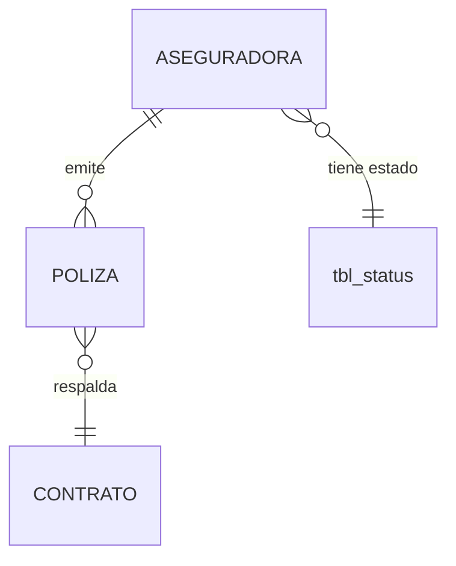

# ADR-0003: Aseguradoras

## Estado

**Propuesto.**

El maestro de aseguradoras **no existe** en el código ni en el esquema. Este ADR documenta la decisión arquitectónica recomendada, derivada del patrón de maestros realmente presente en el proyecto.

## Fecha

2026-09-10 — versión inicial.

## Contexto

Las pólizas que respaldan los contratos son emitidas por compañías aseguradoras. El sistema necesita un catálogo de aseguradoras para asociarlo a cada póliza y para poder analizar la exposición por compañía.

Es un maestro de configuración: pocos registros, cambio infrecuente, alta referencia desde datos operativos. Su característica definitoria es que **las pólizas que lo referencian son documentos contractuales de valor probatorio**, lo que condiciona por completo la política de eliminación.

## Problema

El riesgo específico de un maestro referenciado por documentos contractuales es la **pérdida de información histórica por eliminación**. Si una aseguradora se elimina físicamente, las pólizas emitidas por ella quedan sin emisor identificable, y un expediente de contrato pierde un dato que puede necesitarse años después ante una reclamación.

Se requiere definir:

1. Qué identifica de forma única a una aseguradora.
2. Qué ocurre cuando se intenta eliminar una aseguradora con pólizas asociadas.
3. Qué efecto tiene desactivar una aseguradora sobre los contratos que ya la referencian.
4. Dónde se garantiza la unicidad.

## Estado actual

**No se encontró evidencia de implementación.**

Hechos verificados:

- No existe tabla de aseguradoras en `database/bdintervewebpack.sql`.
- No existe módulo de aseguradoras en `server/src/modules/`.
- No existe vista de aseguradoras en `client/src/views/`.
- No existe entrada de menú en `client/src/menu-items/`.
- No existe tabla de pólizas ni de contratos con la cual relacionarlo.
- No existen permisos de aseguradoras en `client/src/contexts/permissions/permissionsConfig.js`.

Lo que sí existe y define el patrón de referencia:

**Maestros reales en el esquema.** `tbl_reasons` y `tbl_priorities` son maestros simples ya presentes, sin código que los consuma. Su estructura es la que un maestro nuevo debería replicar:

```text
tbl_reasons:  rea_id, rea_name, sta_id, rea_create_by, rea_create_at, rea_update_by, rea_update_at
              FK sta_id → tbl_status,  índice sobre rea_name (no único)
```

**Módulo de referencia CRUD.** `server/src/modules/template/` implementa el patrón completo de un maestro: `get_templates` (selector), `pagination_templates` (listado paginado con filtros), `save_template` (crear y editar en un solo endpoint, discriminando por id) y `delete_template` (eliminación lógica). Opera sobre `tbl_template` y `tbl_estados`, **tablas que no existen en el esquema**, y usa una convención de auditoría en español (`mas_usu_reg`, `mas_usu_act`, `mas_fec_act`) distinta del estándar real del proyecto.

**Componentes de interfaz reutilizables.** `DataTable.jsx`, `FilterPopper.jsx`, `BaseDialog.jsx`, `ConfirmDialog.jsx`, `StatusChip.jsx`, `StatusTabs.jsx`, `TableActions.jsx` y `GenericFormSection.jsx` ya existen y son los que usan `UsersPage` y `ProfilePage`.

**Estados.** `tbl_status` es el catálogo transversal de estados, con `sta_scope` restringido hoy al valor `GENERAL`. La convención aplicada en todo el backend es `1 = activo`, `2 = inactivo`, `3 = eliminado`. `tbl_status` **no tiene datos sembrados** en el volcado.

## Decisión

1. **Aseguradoras es un maestro con dos atributos propios: descripción y estado.** No contiene información de pólizas ni de contratos. La póliza referencia a la aseguradora; la aseguradora no conoce sus pólizas.

2. **La descripción es única entre las aseguradoras no eliminadas, garantizada por restricción de base de datos**, no solo por verificación aplicativa.

3. **No existe eliminación física. La eliminación es lógica** mediante `sta_id = 3`, consistente con el resto del sistema.

4. **Una aseguradora referenciada por al menos una póliza no puede eliminarse, ni siquiera lógicamente.** Solo puede desactivarse.

5. **Desactivar una aseguradora impide su selección en pólizas nuevas y no altera las existentes.** Una póliza vigente emitida por una aseguradora desactivada conserva su emisor y sigue siendo válida.

6. **La clave foránea desde póliza a aseguradora se declara `ON DELETE RESTRICT`**, coherente con las siete claves foráneas ya existentes en el esquema, todas `RESTRICT`.

7. **El estado se toma de `tbl_status`**, no de un campo booleano propio, manteniendo el catálogo transversal.

8. **El maestro sigue el patrón estándar de auditoría** de [ADR-0013](0013-auditoria-trazabilidad.md) y las acciones se controlan por permisos según [ADR-0014](0014-autorizacion-permisos.md).

## Justificación

- **Unicidad en base de datos**: el patrón actual del proyecto verifica unicidad con un `SELECT` previo dentro de la transacción (`saveProfile`, `saveUser`, `saveMasterTemplate`). Ese patrón **no previene duplicados bajo concurrencia**: dos peticiones simultáneas pueden superar ambas la verificación. El esquema actual no tiene ninguna restricción `UNIQUE`, lo que convierte esto en una debilidad sistémica y no en un detalle. Un catálogo con "SEGUROS DEL ESTADO" duplicado fragmenta todo análisis por aseguradora.
- **Eliminación lógica**: es la convención ya establecida y aplicada de forma consistente. Cambiarla para este maestro rompería la uniformidad sin beneficio.
- **Restricción por uso**: una póliza es un documento contractual. Perder la identidad de su emisor destruye información con valor probatorio. Impedir la eliminación es más barato que reconstruir el dato.
- **Desactivar sin afectar lo existente**: separa dos preguntas distintas —"¿se puede usar de aquí en adelante?" y "¿fue válida cuando se usó?"—. Confundirlas obliga a elegir entre no poder retirar una aseguradora del catálogo o corromper el historial.
- **`RESTRICT` en la clave foránea**: `CASCADE` borraría pólizas al borrar una aseguradora, lo que es inadmisible. `SET NULL` dejaría pólizas sin emisor. `RESTRICT` es la única opción coherente con el valor del dato, y es además la que usa todo el esquema actual.

## Alternativas consideradas

### Alternativa 1 — Eliminación física con restricción por clave foránea

Borrar la fila; la base de datos impide hacerlo si hay pólizas asociadas.

- **A favor**: catálogo limpio, sin registros muertos; la integridad la garantiza el motor sin lógica adicional.
- **En contra**: rompe la convención de eliminación lógica del sistema. Una aseguradora sin pólizas aún puede aparecer en auditoría o en documentos exportados. Elimina la posibilidad de recuperar un borrado accidental.
- **Descartada** por inconsistencia con el resto del sistema.

### Alternativa 2 — Solo estado activo/inactivo, sin eliminación

No existe el concepto de eliminar: solo se desactiva.

- **A favor**: el modelo más simple posible; sin ambigüedad entre eliminado e inactivo; sin pérdida de información.
- **En contra**: el catálogo crece indefinidamente con registros creados por error, que no pueden distinguirse de los legítimamente retirados. `sta_id = 3` ya existe como convención transversal, y no usarlo aquí introduce una excepción.
- **Descartada**, aunque es una alternativa razonable si se prioriza la simplicidad.

### Alternativa 3 — Eliminación lógica con restricción por uso (seleccionada)

`sta_id = 3` para eliminar, bloqueado si hay pólizas; desactivación siempre disponible.

- **A favor**: consistente con el sistema; preserva el historial; distingue "retirado del catálogo" de "creado por error"; recuperable.
- **En contra**: exige una verificación de uso antes de eliminar, que la base de datos no aplica por sí sola al tratarse de un `UPDATE` y no de un `DELETE`. La regla vive en el servicio.
- **Seleccionada.**

## Modelo arquitectónico

Modelo propuesto. **Ninguna de estas tablas existe hoy.**



Atributos propuestos para el maestro:

```text
ASEGURADORA
  ├── identificador
  ├── descripción        (única entre no eliminadas)
  ├── sta_id             → tbl_status
  └── auditoría estándar (create_by/at, update_by/at)
```

Estructura de referencia real, para dimensionar la propuesta:

```text
tbl_reasons  (existente, sin uso en código)
  rea_id, rea_name, sta_id,
  rea_create_by, rea_create_at, rea_update_by, rea_update_at
  FK: sta_id → tbl_status  ON DELETE RESTRICT
```

Los nombres definitivos de tabla y columnas se fijarán al implementar. Este ADR no los inventa.

## Reglas de negocio

**No se encontró evidencia en la implementación actual.** Reglas propuestas:

1. Una aseguradora tiene descripción y estado.
2. La descripción es única entre las aseguradoras no eliminadas.
3. Los estados posibles son activo (1), inactivo (2) y eliminado (3).
4. Solo las aseguradoras activas pueden seleccionarse al registrar una póliza.
5. Una aseguradora con pólizas asociadas no puede eliminarse.
6. Desactivar una aseguradora no afecta las pólizas ya emitidas.
7. Una aseguradora desactivada puede reactivarse.
8. La eliminación es lógica y reversible por un usuario con permiso.

## Seguridad

Riesgo bajo por sí mismo: no contiene datos sensibles.

Consideraciones:

- Todas las operaciones exigen sesión válida y el permiso correspondiente en backend.
- Los filtros del listado deben ir parametrizados. **Advertencia preventiva:** los servicios de paginación existentes (`paginationUsers`, `paginationMasterTemplate`, `paginationModuleDocs`) interpolan los filtros del cliente directamente en la cadena SQL. Copiar el módulo `template` como plantilla —que es su propósito declarado— **heredaría una vulnerabilidad de inyección SQL**. El maestro debe implementarse con consultas parametrizadas y lista blanca para el campo de ordenamiento.
- La desactivación de una aseguradora es una acción con impacto operativo: bloquea la emisión de pólizas nuevas con esa compañía. Debe requerir permiso explícito.

## Autorización

Acciones propuestas:

```text
CONSULTAR ASEGURADORAS
CREAR ASEGURADORA
EDITAR ASEGURADORA
ELIMINAR ASEGURADORA
CAMBIAR ESTADO ASEGURADORA
```

**Ninguna existe hoy.** El catálogo actual solo contempla crear, editar, eliminar y asignar permisos sobre perfiles y usuarios.

`CAMBIAR ESTADO` se propone como permiso separado de `EDITAR` porque desactivar tiene consecuencias operativas distintas de corregir un nombre. En los módulos de seguridad existentes el estado es un campo más del formulario de edición; para este maestro la separación se justifica por el impacto.

Ver [ADR-0014](0014-autorizacion-permisos.md).

## Auditoría

**Nivel requerido: auditoría técnica.**

Un maestro de configuración con pocos atributos no justifica bitácora de valores anteriores. Basta con las cuatro columnas estándar.

Excepción: **los cambios de estado sí deben auditarse funcionalmente**, porque determinan si la aseguradora puede usarse. Saber quién desactivó una aseguradora y cuándo es información de gestión relevante.

Requisito heredado de [ADR-0013](0013-auditoria-trazabilidad.md): el autor debe tomarse de `req.user`, no del cuerpo de la petición como hace hoy todo el backend.

## Validaciones

| Validación | Frontend | Backend | Base de datos | Clasificación |
| --- | --- | --- | --- | --- |
| Descripción obligatoria | Propuesta | Propuesta | `NOT NULL` | UX + Integridad |
| Longitud máxima | Propuesta | Propuesta | Tipo de columna | UX + Integridad |
| Descripción única | Propuesta | Propuesta | **`UNIQUE` — obligatorio** | Integridad |
| Estado válido | Propuesta (selector) | Propuesta | FK a `tbl_status` | Integridad |
| Sin pólizas antes de eliminar | Propuesta (aviso) | **Propuesta — obligatoria** | No expresable | Regla de negocio |
| Permiso de la acción | Propuesta | **Propuesta — obligatoria** | No aplica | Seguridad |

La verificación de "sin pólizas antes de eliminar" no puede delegarse a la base de datos porque la eliminación es un `UPDATE` de estado, no un `DELETE`. Es una regla de negocio y vive en el servicio, dentro de la transacción.

## Integridad de datos

Requisitos propuestos:

- `UNIQUE` sobre la descripción, o único parcial sobre las no eliminadas.
- FK a `tbl_status` con `ON DELETE RESTRICT`.
- FK desde póliza a aseguradora con `ON DELETE RESTRICT`.
- Índice sobre la descripción para el filtro del listado.
- Juego de caracteres `utf8mb4` y colación consistente con el resto de tablas nuevas. **Advertencia:** el esquema actual mezcla `latin1`, `utf8mb3` y `utf8mb4`, lo que degrada los `JOIN` entre columnas de colación distinta.

## Transacciones

Las operaciones son de tabla única y no requieren atomicidad multi-tabla. Aun así, la creación y edición deben ejecutarse en transacción por dos razones:

1. La verificación de unicidad y la escritura deben ser atómicas.
2. La escritura de auditoría de cambio de estado ocurre en la misma transacción que el cambio.

Es el patrón ya aplicado en `saveProfile` y `saveMasterTemplate`.

## Consecuencias

### Positivas

- Historial de pólizas íntegro: ninguna queda sin emisor identificable.
- Catálogo controlado, sin duplicados garantizado por el motor.
- Retirar una aseguradora del uso futuro no requiere tocar datos históricos.
- El patrón es replicable a los demás maestros del sistema, lo que reduce el coste de cada uno.

### Negativas

- Una aseguradora usada una sola vez permanece para siempre en la base de datos.
- El listado de administración debe distinguir visualmente activas, inactivas y eliminadas, lo que añade complejidad a la interfaz.
- La restricción de eliminación puede resultar frustrante si se creó por error y ya se usó; el remedio es corregir la descripción, no eliminar.

## Riesgos

| Riesgo | Severidad | Descripción |
| --- | --- | --- |
| Duplicados por concurrencia | **Medio** | Si se replica el patrón de `SELECT` previo sin `UNIQUE`, dos peticiones simultáneas crean duplicados |
| Inyección SQL heredada del patrón `template` | **Alto** | El módulo de referencia interpola filtros sin parametrizar |
| Pérdida de emisor de póliza | **Alto** | Si se permitiera eliminación física o `CASCADE` |
| Aseguradora desactivada con pólizas vigentes | **Bajo** | Situación legítima, pero debe visibilizarse en el listado de pólizas |
| Fragmentación del catálogo | **Medio** | Sin unicidad, el análisis por aseguradora reparte una misma compañía en varios registros |
| Sin permisos que restrinjan la administración | **Medio** | Cualquier usuario autenticado podría administrar el catálogo, dado el estado de ADR-0014 |

## Impacto técnico

### Frontend

- Requiere una vista de listado con `DataTable.jsx` y `FilterPopper.jsx`, un diálogo de creación y edición con `BaseDialog.jsx`, y confirmación de eliminación con `ConfirmDialog.jsx`.
- `StatusChip.jsx` y `StatusTabs.jsx` para la presentación del estado.
- Entrada de menú en `menu-items/` y ruta en `routes/MainRoutes.jsx`.
- Archivo de API en `api/requests/`.
- El patrón a seguir es `views/security/users/UsersPage.jsx`, que ya integra todos estos componentes con control de permisos.

### Backend

- Módulo nuevo con `routes` / `controller` / `service`, siguiendo la estructura de `modules/template/` **pero corrigiendo sus dos defectos**: interpolación de filtros y convención de auditoría en español.
- El selector para formularios de póliza debe devolver solo aseguradoras activas.

### Base de datos

- Tabla nueva, inexistente hoy.
- Requiere que exista primero la entidad póliza para declarar la clave foránea.
- **No existen migraciones versionadas** en el proyecto: el único artefacto de esquema es un volcado de Navicat. Crear tablas nuevas sin adoptar migraciones hace el cambio irreproducible entre entornos.

### Infraestructura

No aplica.

## Estado actual vs arquitectura objetivo

| Aspecto | Estado actual | Arquitectura objetivo |
| --- | --- | --- |
| Tabla | No existe | Maestro con descripción, estado y auditoría |
| Módulo backend | No existe | `routes` / `controller` / `service` parametrizado |
| Vista frontend | No existe | Listado, diálogo y confirmación |
| Unicidad | No aplica | `UNIQUE` en base de datos |
| Eliminación | No aplica | Lógica, bloqueada si hay pólizas |
| Permisos | No existen | Cinco acciones propias |
| Auditoría | No aplica | Técnica + funcional en cambios de estado |

## Brechas identificadas

| # | Brecha | Severidad |
| --- | --- | --- |
| B1 | El maestro no existe en ninguna capa | **Alta** |
| B2 | No existe la entidad póliza con la cual relacionarlo | **Alta** — bloquea la relación |
| B3 | El patrón de maestro disponible (`template`) tiene inyección SQL y convención de auditoría incorrecta | **Alta** — preventiva |
| B4 | Sin restricciones `UNIQUE` en todo el esquema | **Media** |
| B5 | Sin permisos definidos para maestros de configuración | **Media** |
| B6 | Sin migraciones versionadas | **Media** |
| B7 | `tbl_status` sin datos sembrados | **Media** |

## Plan de implementación

Recomendación derivada del análisis. **No fue ejecutada.**

**Fase 0 — Prerrequisitos (B3, B6, B7)**
Corregir o reemplazar el módulo `template` como patrón de referencia antes de replicarlo. Adoptar migraciones versionadas. Sembrar `tbl_status`.

**Fase 1 — Maestro autónomo (B1, B4)**
Crear tabla, módulo backend parametrizado y vista, con `UNIQUE` sobre la descripción desde el inicio.

**Fase 2 — Permisos (B5)**
Definir las cinco acciones y aplicarlas en backend según [ADR-0014](0014-autorizacion-permisos.md).

**Fase 3 — Relación con pólizas (B2)**
Al implementarse el módulo de pólizas: clave foránea `RESTRICT`, verificación de uso antes de eliminar, y selector restringido a activas.

## ADR relacionados

- [ADR-0002 — Dashboard](0002-dashboard.md) — indicadores de estado de póliza
- [ADR-0004 — Constructoras](0004-constructoras.md) — mismo patrón de maestro
- [ADR-0013 — Auditoría y trazabilidad](0013-auditoria-trazabilidad.md)
- [ADR-0014 — Autorización basada en permisos](0014-autorizacion-permisos.md)

## Referencias

- `database/bdintervewebpack.sql` — `tbl_reasons`, `tbl_priorities`, `tbl_status` como patrón estructural
- `server/src/modules/template/` — patrón CRUD de maestro, con las salvedades indicadas
- `client/src/views/security/users/UsersPage.jsx` — patrón de vista de administración
- `client/src/ui-component/extended/` — componentes reutilizables
