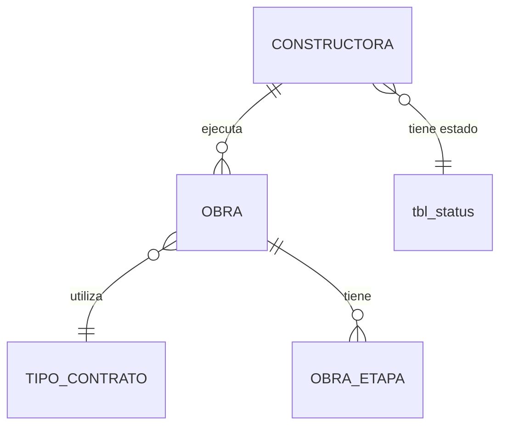

# ADR-0004: Constructoras

## Estado

**Propuesto.**

El maestro de constructoras **no existe** en el código ni en el esquema. Este ADR documenta la decisión arquitectónica recomendada.

## Fecha

2026-09-10 — versión inicial.

## Contexto

Una obra pertenece a una constructora. La constructora es la entidad que ejecuta o promueve la obra, y es un dato de cabecera del expediente: aparece en informes, en documentos contractuales y en cualquier análisis agregado por responsable de ejecución.

Estructuralmente es un maestro idéntico a [ADR-0003](0003-aseguradoras.md): descripción y estado. Lo que lo diferencia es **a qué está atado**. Una aseguradora cuelga de pólizas; una constructora cuelga de **obras**, que son la entidad central del sistema y el punto de anclaje de contratos, proveedores, etapas y responsables.

Esa diferencia importa: el impacto de una eliminación mal resuelta es mucho mayor aquí.

## Problema

Eliminar una constructora que tiene obras asociadas deja huérfano el nodo raíz de todo un árbol de información: obras, sus contratos, sus proveedores asignados, sus pólizas y sus facturas. No es la pérdida de un atributo descriptivo; es la pérdida de la trazabilidad de quién ejecuta un conjunto completo de expedientes.

Se requiere definir:

1. Qué identifica de forma única a una constructora.
2. Qué regla impide eliminarla cuando tiene obras.
3. Si esa regla la aplica la base de datos o el servicio, dado que la eliminación es lógica.
4. Qué efecto tiene desactivarla sobre las obras en ejecución.

## Estado actual

**No se encontró evidencia de implementación.**

Hechos verificados:

- No existe tabla de constructoras en `database/bdintervewebpack.sql`.
- No existe módulo de constructoras en `server/src/modules/`.
- No existe vista ni entrada de menú en el frontend.
- **No existe tabla de obras**, por lo que tampoco existe la relación que este ADR debe gobernar.
- No existen permisos de constructoras en `permissionsConfig.js`.

Respecto a la pregunta explícita de qué reglas impiden hoy eliminar una constructora con obras relacionadas: **no existe ninguna, porque no existe ninguna de las dos entidades.**

Precedente relevante en el código existente. `profiles.service.js` implementa `deleteProfile`, que es el caso más cercano a "maestro con dependientes":

```text
UPDATE tbl_profiles SET sta_id = 3 ...        -- marca eliminado
DELETE FROM tbl_page_permissions WHERE pro_id = ?
```

**No verifica si el perfil tiene usuarios asignados antes de eliminarlo.** Un perfil con usuarios activos puede marcarse como eliminado; los usuarios quedan apuntando a un perfil eliminado, y `paginationUsers` —que hace `JOIN tbl_profiles p ON u.pro_id = p.pro_id AND p.sta_id = 1`— **deja de mostrarlos por completo**. Los usuarios desaparecen del listado sin haber sido eliminados.

Es exactamente el defecto que este ADR debe evitar para constructoras, con consecuencias mayores: en lugar de usuarios invisibles, serían obras invisibles.

## Decisión

1. **Constructoras es un maestro con descripción y estado.** No contiene información de obras.

2. **La descripción es única entre las constructoras no eliminadas, garantizada por restricción de base de datos.**

3. **No existe eliminación física. La eliminación es lógica** mediante `sta_id = 3`.

4. **Una constructora con al menos una obra asociada no puede eliminarse.** La verificación se hace en el servicio, dentro de la transacción, y devuelve un error explícito que nombra el motivo y la cantidad de obras que lo impiden.

5. **Desactivar una constructora impide asociarla a obras nuevas y no afecta a las existentes.** Las obras en ejecución siguen operando con normalidad.

6. **Los listados de obras nunca ocultan una obra por el estado de su constructora.** El `JOIN` a constructora es externo, o no filtra por el estado del maestro. Esta decisión es una respuesta directa al defecto observado en `paginationUsers`.

7. **La relación obra → constructora es N:1 obligatoria**: toda obra pertenece a exactamente una constructora, y la clave foránea es `NOT NULL` con `ON DELETE RESTRICT`.

8. **Auditoría técnica según [ADR-0013](0013-auditoria-trazabilidad.md), permisos según [ADR-0014](0014-autorizacion-permisos.md).**

## Justificación

- **Verificación de uso antes de eliminar**: la base de datos no puede aplicarla, porque la eliminación lógica es un `UPDATE` y las claves foráneas solo actúan sobre `DELETE`. Es una regla que necesariamente vive en el servicio. Omitirla es precisamente lo que produce el defecto de `deleteProfile`.
- **`JOIN` externo en los listados de obra**: el patrón `JOIN maestro ON ... AND maestro.sta_id = 1` presente en `paginationUsers` convierte un cambio de estado del maestro en una desaparición silenciosa de registros operativos. Es un defecto de alto impacto y difícil de diagnosticar: nadie eliminó la obra, simplemente dejó de verse.
- **Relación obligatoria**: una obra sin constructora no tiene sentido de negocio. Permitir `NULL` obligaría a que todo informe y toda agrupación trataran el caso "sin constructora", que no corresponde a ninguna situación real.
- **Error explícito al bloquear**: un mensaje que diga "no se puede eliminar: tiene 14 obras asociadas" permite actuar. Un error genérico obliga a investigar. El backend actual ya traduce errores de integridad referencial a mensajes en `error.middleware.js`, pero con un texto genérico ("Violación de integridad referencial... Contacta a sistemas") que no ayuda al usuario.
- **Unicidad en base de datos**: mismo razonamiento que en [ADR-0003](0003-aseguradoras.md). Sin `UNIQUE`, la verificación por `SELECT` previo no resiste concurrencia, y un catálogo fragmentado rompe todo análisis agregado por constructora.

## Alternativas consideradas

### Alternativa 1 — Permitir eliminar y reasignar las obras

Al eliminar una constructora, solicitar una constructora de destino y reasignar sus obras.

- **A favor**: el catálogo se mantiene limpio; útil ante fusiones empresariales, que ocurren realmente en el sector.
- **En contra**: reescribe información histórica. Una obra ejecutada por una constructora aparecería como ejecutada por otra, alterando el expediente. Es una operación masiva sobre datos operativos disparada desde un maestro de configuración.
- **Descartada** como comportamiento de la eliminación. La reasignación por fusión, si se requiere, debe ser una operación explícita, auditada y con permiso propio — no un efecto secundario de eliminar.

### Alternativa 2 — Eliminación en cascada lógica

Marcar como eliminadas la constructora y todas sus obras.

- **A favor**: consistencia inmediata, sin registros huérfanos.
- **En contra**: destructivo y desproporcionado. Un error al eliminar un registro de configuración haría desaparecer expedientes completos con sus contratos y facturas. Irrecuperable sin intervención directa en base de datos.
- **Descartada.**

### Alternativa 3 — Eliminación lógica bloqueada por uso (seleccionada)

- **A favor**: nada se pierde; el bloqueo es explícito y comprensible; consistente con [ADR-0003](0003-aseguradoras.md) y con la convención del sistema; la desactivación cubre la necesidad real de retirar del uso.
- **En contra**: el catálogo acumula constructoras inactivas. Coste marginal para un maestro de decenas de registros.
- **Seleccionada.**

## Modelo arquitectónico

Modelo propuesto. **Ninguna de estas tablas existe hoy.**



```text
CONSTRUCTORA
  ├── identificador
  ├── descripción        (única entre no eliminadas)
  ├── sta_id             → tbl_status
  └── auditoría estándar

OBRA
  └── constructora_id    NOT NULL, FK ON DELETE RESTRICT
```

Regla de eliminación, expresada como decisión:

```text
Solicitud de eliminar CONSTRUCTORA
   │
   ├── ¿tiene obras asociadas (en cualquier estado, incluidas eliminadas)?
   │       SÍ ──> rechazar con error explícito
   │              "No se puede eliminar: tiene N obras asociadas"
   │
   └── NO ──> UPDATE sta_id = 3 + auditoría
```

Se cuentan **todas** las obras, incluidas las eliminadas lógicamente: una obra eliminada sigue siendo parte del historial y necesita su constructora identificable.

## Reglas de negocio

**No se encontró evidencia en la implementación actual.** Reglas propuestas:

1. Una constructora tiene descripción y estado.
2. La descripción es única entre las constructoras no eliminadas.
3. Toda obra pertenece a exactamente una constructora.
4. Solo las constructoras activas pueden seleccionarse al crear o editar una obra.
5. Una constructora con obras asociadas no puede eliminarse, en ningún estado de esas obras.
6. Desactivar una constructora no afecta las obras existentes ni su operación.
7. Una obra nunca se oculta de los listados por el estado de su constructora.
8. Una constructora desactivada puede reactivarse.
9. Cambiar la constructora de una obra es una modificación del expediente y se audita funcionalmente.

## Seguridad

Riesgo bajo por contenido; relevante por impacto operativo.

- Todas las operaciones exigen sesión y permiso verificados en backend.
- Consultas parametrizadas y lista blanca para el campo de ordenamiento. Advertencia idéntica a la de [ADR-0003](0003-aseguradoras.md): el módulo `template`, patrón de referencia del proyecto, interpola filtros sin parametrizar.
- La desactivación bloquea la creación de obras nuevas con esa constructora: es una acción con consecuencia operativa y requiere permiso explícito.

## Autorización

Acciones propuestas:

```text
CONSULTAR CONSTRUCTORAS
CREAR CONSTRUCTORA
EDITAR CONSTRUCTORA
ELIMINAR CONSTRUCTORA
CAMBIAR ESTADO CONSTRUCTORA
```

**Ninguna existe hoy.** Ver [ADR-0014](0014-autorizacion-permisos.md).

## Auditoría

**Nivel requerido: auditoría técnica** para el maestro.

**Auditoría funcional** para dos eventos:

- Cambio de estado de la constructora, por su efecto sobre la creación de obras.
- **Cambio de constructora en una obra existente**, que se audita en el ADR de obras: es una modificación de la cabecera del expediente y debe conservar el valor anterior.

Ver [ADR-0013](0013-auditoria-trazabilidad.md).

## Validaciones

| Validación | Frontend | Backend | Base de datos | Clasificación |
| --- | --- | --- | --- | --- |
| Descripción obligatoria | Propuesta | Propuesta | `NOT NULL` | UX + Integridad |
| Descripción única | Propuesta | Propuesta | **`UNIQUE` — obligatorio** | Integridad |
| Estado válido | Propuesta (selector) | Propuesta | FK a `tbl_status` | Integridad |
| Constructora obligatoria en obra | Propuesta | Propuesta | `NOT NULL` + FK | Integridad |
| Constructora activa al asignarla a una obra | Propuesta (selector) | **Propuesta — obligatoria** | No expresable | Regla de negocio |
| Sin obras antes de eliminar | Propuesta (aviso) | **Propuesta — obligatoria** | No expresable | Regla de negocio |
| Permiso de la acción | Propuesta | **Propuesta — obligatoria** | No aplica | Seguridad |

Dos validaciones no son expresables en el esquema y deben vivir en el servicio: "constructora activa al asignarla" (una FK no distingue estado) y "sin obras antes de eliminar" (la eliminación es un `UPDATE`).

## Integridad de datos

Requisitos propuestos:

- `UNIQUE` sobre la descripción, o único parcial sobre las no eliminadas.
- FK de constructora a `tbl_status`, `ON DELETE RESTRICT`.
- FK de obra a constructora, `NOT NULL`, `ON DELETE RESTRICT`.
- Índice sobre la descripción para el filtro del listado.
- Índice sobre la constructora en la tabla de obras, necesario tanto para el filtrado de obras como para la verificación de uso al eliminar.
- `utf8mb4` con colación consistente.

## Transacciones

Creación y edición: transacción de tabla única, para atomicidad entre la verificación de unicidad y la escritura.

Eliminación: transacción que agrupa la verificación de uso, el cambio de estado y la escritura de auditoría. El orden importa — verificar dentro de la transacción evita que una obra se cree entre la verificación y el cambio de estado.

## Consecuencias

### Positivas

- Ninguna obra queda sin constructora identificable.
- El bloqueo de eliminación es explícito y accionable, no un error genérico de base de datos.
- La decisión sobre el `JOIN` externo evita el defecto de desaparición silenciosa observado en el módulo de usuarios.
- Patrón idéntico al de [ADR-0003](0003-aseguradoras.md): un solo modelo mental para todos los maestros del sistema.

### Negativas

- El catálogo acumula constructoras inactivas indefinidamente.
- La verificación de uso añade una consulta a cada eliminación.
- No contempla fusiones empresariales, que requerirían una operación de reasignación específica, deliberadamente fuera de alcance.

## Riesgos

| Riesgo | Severidad | Descripción |
| --- | --- | --- |
| Obras huérfanas | **Alto** | Si se omite la verificación de uso, como ocurre hoy en `deleteProfile` |
| Desaparición silenciosa de obras | **Alto** | Si el listado de obras replica el `JOIN ... AND maestro.sta_id = 1` de `paginationUsers` |
| Duplicados por concurrencia | **Medio** | Sin `UNIQUE`, el `SELECT` previo no resiste peticiones simultáneas |
| Inyección SQL heredada del patrón `template` | **Alto** | Preventiva |
| Fragmentación del catálogo | **Medio** | Análisis por constructora repartido entre registros duplicados |
| Sin permisos que restrinjan la administración | **Medio** | Dado el estado de ADR-0014 |

## Impacto técnico

### Frontend

- Vista de listado y diálogo de creación y edición, con los componentes existentes (`DataTable`, `FilterPopper`, `BaseDialog`, `ConfirmDialog`, `StatusChip`).
- Entrada de menú, ruta y archivo de API.
- El diálogo de obra requiere un selector de constructoras activas.
- El mensaje de bloqueo de eliminación debe mostrarse de forma comprensible, indicando la cantidad de obras.

### Backend

- Módulo nuevo con `routes` / `controller` / `service`.
- Un endpoint de selector que devuelva solo constructoras activas.
- Verificación de uso en el servicio de eliminación.

### Base de datos

- Tabla nueva, inexistente hoy.
- Depende de que exista la tabla de obras para declarar la relación.
- Sin migraciones versionadas en el proyecto.

### Infraestructura

No aplica.

## Estado actual vs arquitectura objetivo

| Aspecto | Estado actual | Arquitectura objetivo |
| --- | --- | --- |
| Tabla | No existe | Maestro con descripción, estado y auditoría |
| Relación con obras | No existe | N:1 obligatoria, FK `RESTRICT` |
| Eliminación | No aplica | Lógica, bloqueada si hay obras |
| Verificación de uso | Ausente incluso en el precedente (`deleteProfile`) | Obligatoria en el servicio |
| `JOIN` en listados dependientes | Interno con filtro de estado (`paginationUsers`) | Externo, sin filtrar por estado del maestro |
| Unicidad | No aplica | `UNIQUE` en base de datos |
| Permisos | No existen | Cinco acciones propias |

## Brechas identificadas

| # | Brecha | Severidad |
| --- | --- | --- |
| B1 | El maestro no existe en ninguna capa | **Alta** |
| B2 | No existe la entidad obra con la cual relacionarlo | **Alta** — bloquea la relación |
| B3 | El precedente `deleteProfile` elimina sin verificar dependientes | **Alta** — patrón a no replicar |
| B4 | `paginationUsers` oculta registros por el estado del maestro | **Alta** — patrón a no replicar |
| B5 | Patrón de maestro (`template`) con inyección SQL | **Alta** — preventiva |
| B6 | Sin restricciones `UNIQUE` en todo el esquema | **Media** |
| B7 | Sin permisos definidos para maestros de configuración | **Media** |
| B8 | Sin migraciones versionadas | **Media** |

## Plan de implementación

Recomendación derivada del análisis. **No fue ejecutada.**

**Fase 0 — Prerrequisitos (B5, B8)**
Corregir el patrón de referencia y adoptar migraciones versionadas.

**Fase 1 — Maestro autónomo (B1, B6)**
Tabla, módulo backend parametrizado y vista, con `UNIQUE` desde el inicio.

**Fase 2 — Permisos (B7)**
Definir y aplicar las cinco acciones en backend.

**Fase 3 — Relación con obras (B2, B3, B4)**
Al implementarse [ADR-0011](0011-obras.md): FK obligatoria `RESTRICT`, verificación de uso antes de eliminar, `JOIN` externo en los listados de obra y selector restringido a activas.

## ADR relacionados

- [ADR-0011 — Obras](0011-obras.md) — entidad dependiente
- [ADR-0003 — Aseguradoras](0003-aseguradoras.md) — mismo patrón de maestro
- [ADR-0006 — Tipos de contrato](0006-tipos-contrato.md) — otro maestro referenciado por obra
- [ADR-0013 — Auditoría y trazabilidad](0013-auditoria-trazabilidad.md)
- [ADR-0014 — Autorización basada en permisos](0014-autorizacion-permisos.md)

## Referencias

- `database/bdintervewebpack.sql` — `tbl_reasons`, `tbl_status` como patrón estructural
- `server/src/modules/security/profiles/profiles.service.js` — `deleteProfile`, precedente sin verificación de uso
- `server/src/modules/security/users/users.service.js` — `paginationUsers`, `JOIN` con filtro de estado del maestro
- `server/src/common/middlewares/error.middleware.js` — traducción de errores de integridad referencial
- `server/src/modules/template/` — patrón CRUD, con las salvedades indicadas
