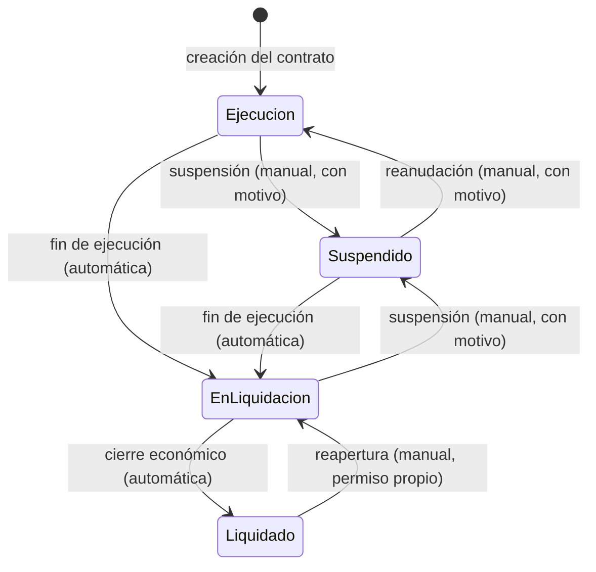
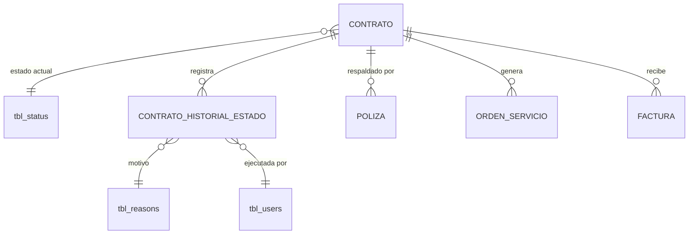

# ADR-0005: Estados de contrato

## Estado

**Reemplazado por [ADR-0017](0017-estados-contrato.md).**

> ⚠️ **Este ADR ya no es la fuente de verdad sobre los estados de contrato.** Se conserva como registro histórico de la decisión inicial.
>
> [ADR-0017](0017-estados-contrato.md) lo sustituye con una decisión más completa, que este documento no podía contemplar porque se escribió antes de conocer el modelo de conceptos contractuales:
>
> - El disparador real de `EN LIQUIDACIÓN` es la **creación del otrosí de liquidación** ([ADR-0016](0016-conceptos-contractuales.md)), no un "fin de ejecución" genérico.
> - La transición a `LIQUIDADO` depende de un **conjunto verificable de condiciones de facturación** (amortización completa, retenido devuelto, factura de liquidación aprobada), no de un único hecho.
> - La suspensión exige **motivo, fecha de suspensión, fecha de levantamiento, condición de levantamiento, observación e informe de interventoría** — atributos ausentes de este ADR.
> - El efecto de la suspensión sobre el **cómputo del plazo contractual** se resuelve en [ADR-0015](0015-contratos.md).

Estado original: *Propuesto*. Los estados de contrato no existen en el código ni en el esquema; tampoco existe la entidad contrato.

## Fecha

2026-09-10 — versión inicial.
2026-09-10 — reemplazado por ADR-0017 tras el análisis del CORE de contratos, pólizas y facturación.

## Contexto

Un contrato administrativo recorre un ciclo de vida con cuatro estados funcionales:

| Estado | Naturaleza | Significado |
| --- | --- | --- |
| **Ejecución** | Automático | El contrato está vigente y se ejecuta con normalidad |
| **En liquidación** | Automático | Terminó la ejecución y está en proceso de cierre económico |
| **Liquidado** | Automático | El cierre económico terminó; el contrato está cerrado |
| **Suspendido** | **Manual** | La ejecución está detenida por decisión administrativa |

La distinción entre automático y manual es la decisión arquitectónica central de este ADR. Un estado automático es **consecuencia** de hechos registrados en el sistema; un estado manual es **causa**: alguien decide y el sistema obedece.

Confundir ambos produce sistemas donde nadie sabe por qué un contrato está en un estado determinado.

## Problema

Sin un modelo explícito de transiciones, los estados terminan gestionándose como un campo más del formulario. Las consecuencias son concretas:

1. **Transiciones imposibles ocurren.** Un contrato liquidado vuelve a ejecución porque alguien editó un selector.
2. **Nadie sabe por qué.** Sin historial, el estado actual no explica cómo se llegó a él.
3. **Los estados automáticos y manuales compiten.** Un proceso recalcula un estado que un usuario fijó a mano, o al revés.
4. **Los efectos colaterales quedan indefinidos.** ¿Se pueden registrar facturas contra un contrato suspendido? ¿Se puede renovar la póliza de uno liquidado?

Se requiere definir qué evento genera cada transición, qué proceso las calcula, quién puede alterarlas manualmente, qué transiciones son inválidas, y qué ocurre con pólizas, órdenes de servicio, facturas y documentos en cada estado.

## Estado actual

**No se encontró evidencia de implementación.**

Hechos verificados:

- **No existe tabla de contratos** en `database/bdintervewebpack.sql`.
- No existe tabla ni catálogo de estados de contrato.
- No existe módulo de contratos en `server/src/modules/`.
- No existe máquina de estados, explícita ni implícita, en ninguna parte del backend.
- No existe historial de estados de ninguna entidad.
- No hay disparadores, procedimientos almacenados, funciones ni eventos programados en toda la base de datos.
- El cron (`server/src/cron/index.js`) está implementado con **la lista de tareas vacía** y su arranque comentado en `server.js`. No hay ningún proceso programado que pudiera calcular estados.

Lo único relacionado con estados en el sistema actual:

**`tbl_status`** es un catálogo transversal con `sta_id`, `sta_name`, `sta_scope`, `sta_order`, `sta_color` y `sta_key`. `sta_scope` es un `enum` que hoy admite **un único valor: `'GENERAL'`**.

Esa columna es arquitectónicamente significativa: fue diseñada para segmentar el catálogo por ámbito. El endpoint `GET /api/app/get_statuses_by_scope` (`app.service.js`) ya consulta por ámbito y permite excluir claves:

```text
SELECT sta_id, sta_name, sta_color FROM tbl_status
WHERE sta_id != 3 AND sta_scope = ? AND sta_key NOT IN (...)
ORDER BY sta_order
```

Es decir: **el mecanismo para catálogos de estado por ámbito existe y está sin usar.** `sta_key` y `sta_color` sugieren, además, la intención de identificar estados por clave simbólica y presentarlos con color propio.

La convención vigente en todo el backend es `1 = activo`, `2 = inactivo`, `3 = eliminado`. `tbl_status` **no tiene datos sembrados** en el volcado.

Una inconsistencia detectada: `app.service.verifyToken` acepta usuarios con `sta_id IN (1,4)`, y el estado `4` no existe (`AUTO_INCREMENT = 4` implica ids 1 a 3). Es evidencia de que los estados codificados numéricamente derivan con el tiempo.

## Decisión

1. **El estado de un contrato es un atributo derivado, no un campo editable libremente.** Solo cambia mediante transiciones explícitas y controladas.

2. **Se implementa una máquina de estados explícita en el backend**, con las transiciones válidas declaradas como dato y no dispersas en condicionales. Una transición no declarada se rechaza.

3. **Se separan dos vías de transición, y no compiten**:

   | Vía | Estados | Disparador |
   | --- | --- | --- |
   | **Automática** | Ejecución, En liquidación, Liquidado | Evento de negocio registrado en el sistema |
   | **Manual** | Suspendido, y su reversión | Acción explícita de un usuario con permiso |

4. **Las transiciones automáticas se disparan por evento, no por proceso programado.** Cuando ocurre el hecho que las causa, la transición se evalúa y se aplica en la misma transacción.

5. **Suspendido es un estado que se superpone al ciclo automático, no un punto del ciclo.** Al suspender se conserva el estado del que se viene; al reanudar se vuelve a él y se reevalúan las condiciones automáticas.

6. **Toda transición se registra en un historial**: estado anterior, estado nuevo, motivo, usuario, fecha y si fue automática o manual. El historial es de solo escritura.

7. **Toda transición manual exige un motivo.** El sistema ya tiene `tbl_reasons`, un maestro de motivos sin uso en el código, que es el candidato natural para tipificarlos.

8. **Los efectos de cada estado sobre las entidades relacionadas se declaran explícitamente**, no se dejan al criterio de cada formulario:

   | Estado | Órdenes de servicio | Facturas | Pólizas | Documentos |
   | --- | --- | --- | --- | --- |
   | Ejecución | Se crean y modifican | Se registran | Se registran y renuevan | Se adjuntan |
   | Suspendido | **Bloqueadas** | **Bloqueadas** | Se registran y renuevan | Se adjuntan |
   | En liquidación | **Bloqueadas** | Se registran (cierre) | Se renuevan | Se adjuntan |
   | Liquidado | **Bloqueadas** | **Bloqueadas** | Solo consulta | Se adjuntan |

   Los documentos siempre pueden adjuntarse: un expediente cerrado sigue recibiendo soportes.

9. **Liquidado es un estado terminal.** Salir de él requiere una acción administrativa específica —reapertura—, con permiso propio, motivo obligatorio y auditoría reforzada. No es una transición ordinaria.

10. **El catálogo de estados de contrato se implementa sobre `tbl_status` con un `sta_scope` propio**, ampliando el `enum` existente, en lugar de crear un catálogo paralelo.

11. **Nunca se compara el estado por su nombre ni por su identificador numérico literal.** Se usa `sta_key`, la columna simbólica que ya existe para ese fin.

## Justificación

- **Máquina de estados explícita**: sin ella, las transiciones válidas quedan implícitas en la interfaz, y la interfaz no es una frontera de control. Declararlas como dato permite verificarlas en backend con un solo punto de decisión, y responder "¿por qué no puedo pasar de aquí a allá?" con precisión.
- **Transición por evento y no por proceso programado**: un proceso nocturno introduce una ventana en la que el estado del sistema es incorrecto. Un contrato que terminó su ejecución a las 9:00 permanecería "en ejecución" hasta la madrugada siguiente, permitiendo operaciones que ya no corresponden. Además, el cron del proyecto está vacío y desactivado: apoyarse en él sería apoyarse en algo que no funciona.
- **Suspendido como superposición**: modelar la suspensión como un punto más del ciclo obliga a decidir a dónde vuelve el contrato al reanudarse, y la única respuesta correcta es "a donde estaba". Guardar el estado previo lo resuelve sin ambigüedad.
- **Historial obligatorio**: el estado actual es un dato; la secuencia de cambios es el expediente. Ante una controversia contractual, la pregunta relevante es cuándo se suspendió y por qué, no en qué estado está hoy.
- **Motivo obligatorio en transiciones manuales**: una suspensión sin motivo registrado es una decisión sin responsable. `tbl_reasons` existe precisamente para esto y no se usa.
- **Efectos declarados**: si cada formulario decide por su cuenta qué permite en cada estado, las reglas divergen. Declararlas en un solo lugar hace que la regla sea consultable y verificable.
- **`sta_key` sobre identificadores numéricos**: el código actual compara `sta_id = 1`, `sta_id != 3`, `sta_id IN (1,4)` con literales dispersos por todo el backend. Ya produjo una inconsistencia real —el estado `4` inexistente—. Una clave simbólica hace el código legible y resistente a que los identificadores difieran entre entornos.
- **Reutilizar `tbl_status`**: la infraestructura de ámbitos ya existe, con endpoint incluido. Crear un catálogo paralelo duplicaría el mecanismo sin motivo.

## Alternativas consideradas

### Alternativa 1 — Estado como campo editable en el formulario

Un selector más en el formulario de contrato, sin restricciones de transición.

- **A favor**: trivial de implementar; es el patrón que ya usan usuarios y perfiles en este sistema.
- **En contra**: permite cualquier transición, incluidas las imposibles. No distingue automático de manual. No deja rastro. Para maestros de configuración es aceptable; para un ciclo de vida contractual es inadmisible.
- **Descartada.**

### Alternativa 2 — Estados calculados en tiempo de consulta

No persistir el estado: derivarlo de fechas y hechos cada vez que se consulta.

- **A favor**: imposible que quede desactualizado; sin transiciones que gestionar; sin riesgo de estados inconsistentes.
- **En contra**: no admite el estado manual —la suspensión no se deriva de ningún dato, es una decisión—. Impide indexar y filtrar por estado con eficiencia. Imposibilita el historial: no hay evento que registrar. Recalcular en cada consulta y en cada indicador del dashboard es costoso.
- **Descartada.** El requisito de un estado manual la excluye por completo.

### Alternativa 3 — Recálculo por proceso programado

Un job periódico revisa todos los contratos y ajusta estados.

- **A favor**: centraliza la lógica en un solo lugar; corrige derivas acumuladas.
- **En contra**: introduce una ventana de inconsistencia entre el hecho y su reflejo. El cron del proyecto está vacío y desactivado, y `startCronJobs` se autoinhibe en desarrollo, lo que haría que el sistema se comportara distinto según el entorno. Un fallo silencioso del job deja todo el sistema con estados incorrectos sin señal visible.
- **Descartada** como mecanismo principal. Es válida como **proceso de conciliación** que detecte y reporte discrepancias, sin corregirlas silenciosamente.

### Alternativa 4 — Máquina de estados explícita, transiciones por evento, con historial (seleccionada)

- **A favor**: transiciones válidas verificables en un punto único; estado siempre coherente con los hechos; convive con el estado manual; historial completo; efectos declarados y consultables.
- **En contra**: más costoso de implementar que un selector. Exige identificar con precisión los eventos que disparan cada transición automática, lo que es una decisión de negocio y no técnica.
- **Seleccionada.**

## Modelo arquitectónico

Máquina de estados propuesta:



Transiciones **inválidas** por declaración explícita:

```text
Liquidado      ──X──> Ejecución       (no se reactiva un contrato cerrado)
Liquidado      ──X──> Suspendido      (no se suspende lo ya cerrado)
Ejecución      ──X──> Liquidado       (no se omite la liquidación)
Suspendido     ──X──> Liquidado       (debe reanudarse o liquidarse primero)
cualquiera     ──X──> el mismo        (una transición sin cambio no se registra)
```

Modelo de datos propuesto. **Ninguna de estas estructuras existe hoy**, salvo `tbl_status` y `tbl_reasons`:



```text
CONTRATO_HISTORIAL_ESTADO  (propuesta)
  ├── contrato
  ├── estado anterior      → tbl_status
  ├── estado nuevo         → tbl_status
  ├── origen               (AUTOMATICA | MANUAL)
  ├── motivo               → tbl_reasons  (obligatorio si MANUAL)
  ├── observación
  ├── usuario              → tbl_users
  └── fecha
```

Flujo de una transición:

```text
Evento (hecho de negocio) o Acción de usuario
   │
   ▼
Servicio de contratos — dentro de una transacción
   ├── ¿el usuario tiene permiso para esta transición?      403 si no
   ├── ¿la transición está declarada como válida?           409 si no
   ├── ¿hay motivo, si es manual?                           400 si no
   ├── UPDATE contrato SET sta_id = <nuevo>
   ├── INSERT historial de estado
   └── COMMIT
```

## Reglas de negocio

**No se encontró evidencia en la implementación actual.** Reglas propuestas:

1. Un contrato se crea en estado Ejecución.
2. Un contrato tiene exactamente un estado vigente.
3. Las transiciones a En liquidación y Liquidado son automáticas y las dispara un hecho de negocio.
4. La transición a Suspendido y su reversión son manuales y exigen permiso y motivo.
5. Al suspender se conserva el estado previo; al reanudar se vuelve a él y se reevalúan las condiciones automáticas.
6. Liquidado es terminal: solo se sale por reapertura, con permiso propio y auditoría reforzada.
7. Una transición no declarada como válida se rechaza con error explícito.
8. Toda transición queda registrada en el historial.
9. Un contrato suspendido no admite órdenes de servicio ni facturas nuevas.
10. Un contrato liquidado no admite órdenes de servicio, facturas ni cambios en sus pólizas.
11. Los documentos pueden adjuntarse en cualquier estado.
12. El estado del contrato no impide su consulta en ningún caso.
13. Un contrato eliminado lógicamente (`sta_id = 3`) queda fuera del ciclo de estados funcionales.

**Pendiente de validación** — decisiones de negocio que este ADR no puede resolver por sí solo:

- Qué hecho concreto dispara "fin de ejecución": ¿el vencimiento del plazo, un acta de terminación registrada, una acción explícita?
- Qué hecho dispara "cierre económico": ¿el pago de la última factura, un acta de liquidación, la conciliación de saldos?
- Si el vencimiento de la póliza afecta el estado del contrato o solo se refleja como alerta en el dashboard.
- Si un contrato suspendido sigue contando plazo.

## Seguridad

Los estados de contrato controlan qué operaciones económicas son admisibles. Manipularlos tiene consecuencia patrimonial directa: pasar un contrato liquidado a ejecución habilitaría facturación sobre un contrato cerrado.

Requisitos:

- Toda transición se verifica en backend. **El selector de estado del formulario no es un control de seguridad.**
- Las transiciones manuales requieren permiso propio, distinto del permiso de editar el contrato.
- La reapertura de un contrato liquidado requiere un permiso separado de la suspensión.
- El bloqueo de operaciones por estado se aplica en el backend de **cada** módulo afectado —órdenes de servicio, facturas—, no solo ocultando botones.
- El historial de estados no admite modificación ni eliminación por ninguna vía expuesta.

## Autorización

Acciones propuestas:

```text
CONSULTAR CONTRATOS
CONSULTAR HISTORIAL DE ESTADOS
SUSPENDER CONTRATO
REANUDAR CONTRATO
REABRIR CONTRATO LIQUIDADO
```

**Ninguna existe hoy.**

Nótese que no hay un permiso genérico de "cambiar estado": cada transición manual es una acción de negocio distinta, con consecuencias distintas, y merece control independiente. Reabrir un contrato liquidado no es lo mismo que suspender uno en ejecución.

Ver [ADR-0014](0014-autorizacion-permisos.md).

## Auditoría

**Nivel requerido: auditoría funcional completa.** Es el caso más exigente de todo el sistema.

Toda transición registra estado anterior, estado nuevo, origen (automática o manual), motivo, observación, usuario y fecha.

Diferencia respecto a la bitácora general de [ADR-0013](0013-auditoria-trazabilidad.md): el historial de estados **no es un registro de auditoría genérico, es información de negocio consultable por el usuario**. Debe tener su propia vista, su propio permiso de consulta y presentarse dentro del expediente del contrato, no en un módulo técnico de auditoría.

Las transiciones automáticas se registran con el usuario que ejecutó la acción que las causó, no con un usuario de sistema: el hecho tiene un responsable.

## Validaciones

| Validación | Frontend | Backend | Base de datos | Clasificación |
| --- | --- | --- | --- | --- |
| Estado inicial en Ejecución | No aplica | Propuesta | Valor por defecto | Regla de negocio |
| Transición declarada como válida | Propuesta (oculta opciones) | **Propuesta — obligatoria** | No expresable | **Regla de negocio + Seguridad** |
| Motivo en transición manual | Propuesta | **Propuesta — obligatoria** | `NOT NULL` condicional | Regla de negocio |
| Permiso de la transición | Propuesta | **Propuesta — obligatoria** | No aplica | Seguridad |
| Bloqueo de operaciones por estado | Propuesta (oculta acciones) | **Propuesta — obligatoria** | No expresable | **Regla de negocio + Seguridad** |
| Estado existe en el catálogo | Propuesta (selector) | Propuesta | FK a `tbl_status` | Integridad |

Las dos validaciones marcadas como "Regla de negocio + Seguridad" son las que no pueden delegarse al frontend bajo ninguna circunstancia: su omisión permite operaciones económicas indebidas.

## Integridad de datos

Requisitos propuestos:

- FK del contrato a `tbl_status`, `NOT NULL`, `ON DELETE RESTRICT`.
- FK del historial a contrato, a los dos estados, al motivo y al usuario.
- Índice sobre contrato y fecha en el historial, para consulta cronológica.
- Índice sobre el estado en la tabla de contratos, para filtros y agregaciones del dashboard.
- Ampliación del `enum` de `sta_scope` en `tbl_status` con el ámbito de contratos.
- Datos semilla versionados de los cuatro estados con su `sta_key`, `sta_order` y `sta_color`.

La restricción de transiciones válidas **no es expresable en el esquema** de forma razonable. Vive en el servicio. Es una limitación aceptada: la alternativa serían disparadores, que el esquema no usa en ninguna parte y que no tienen acceso al usuario de la aplicación.

## Transacciones

La atomicidad es obligatoria y no negociable. Una transición implica al menos dos escrituras:

```text
UPDATE contrato SET estado    → OK
INSERT historial de estado    → ERROR
```

Sin transacción, el contrato cambia de estado sin dejar rastro — el peor resultado posible, porque el sistema parece consistente y no lo es.

Cuando la transición es consecuencia de otro hecho, las tres escrituras van en la misma transacción:

```text
BEGIN
  registrar el hecho de negocio
  UPDATE estado del contrato
  INSERT historial
COMMIT
```

El patrón transaccional del proyecto (`beginTransaction` / `commit` / `rollback` con liberación en `finally`) es adecuado y ya está aplicado consistentemente en los servicios existentes.

## Consecuencias

### Positivas

- El estado del contrato es siempre explicable: el historial dice cuándo cambió, por qué y por quién.
- Las transiciones imposibles quedan bloqueadas por diseño, no por disciplina de la interfaz.
- Automático y manual coexisten sin competir.
- Los efectos de cada estado están declarados en un solo lugar y son consultables.
- Reutiliza `tbl_status`, `sta_scope` y `tbl_reasons`, tres mecanismos ya presentes y sin uso.
- Habilita los indicadores de [ADR-0002](0002-dashboard.md), que dependen de estados fiables.

### Negativas

- Más costoso que un selector de estado.
- Exige decisiones de negocio precisas sobre qué hecho dispara cada transición automática, hoy indefinidas.
- El historial crece de forma sostenida.
- Cada módulo afectado —órdenes de servicio, facturas— debe consultar el estado antes de permitir operaciones, lo que acopla esos módulos a este ADR.
- La reapertura de contratos liquidados añade un camino excepcional que debe mantenerse y vigilarse.

## Riesgos

| Riesgo | Severidad | Descripción |
| --- | --- | --- |
| Estado editable sin control | **Crítico** | Si se implementa como selector libre, un contrato liquidado puede volver a ejecución y recibir facturas |
| Bloqueo de operaciones solo en el frontend | **Crítico** | Ocultar el botón de facturar no impide la invocación directa del endpoint |
| Transición sin historial | **Alto** | Sin transacción, el estado cambia sin rastro |
| Eventos disparadores indefinidos | **Alto** | Sin precisar qué es "fin de ejecución", el estado automático es una suposición |
| Dependencia del cron | **Alto** | El cron está vacío y desactivado; apoyar transiciones en él las haría no ocurrir |
| Estados por identificador numérico literal | **Medio** | Ya produjo el defecto del `sta_id = 4` inexistente |
| Suspensión sin motivo | **Medio** | Una decisión administrativa sin responsable registrado |
| Historial modificable | **Medio** | Si se expone edición, el historial pierde valor probatorio |
| Divergencia entre módulos | **Medio** | Si cada módulo interpreta los efectos del estado por su cuenta |

## Impacto técnico

### Frontend

- Requiere el módulo completo de contratos, inexistente.
- El estado se presenta con `StatusChip.jsx`, usando `sta_color` del catálogo.
- `StatusTabs.jsx` ya existe y es adecuado para filtrar el listado por estado.
- El cambio de estado no es un campo del formulario de edición: es una acción propia, con diálogo de confirmación y captura de motivo.
- Las opciones de transición ofrecidas deben provenir del backend según el estado actual, no calcularse en el cliente.
- Requiere una vista de historial dentro del expediente del contrato.
- `ConfirmDialog.jsx` y `BaseDialog.jsx` son reutilizables.

### Backend

- Requiere el módulo de contratos completo.
- La máquina de estados debe residir en un punto único, consultable por otros módulos.
- Los módulos de órdenes de servicio y facturas deben verificar el estado del contrato antes de permitir escritura.
- `GET /api/app/get_statuses_by_scope` ya existe y sirve para exponer el catálogo por ámbito.
- No debe usarse el cron para transiciones; sí es válido para un proceso de conciliación que reporte discrepancias.

### Base de datos

- Requiere la tabla de contratos y la de historial de estados, inexistentes.
- Requiere ampliar el `enum` de `sta_scope`, hoy limitado a `'GENERAL'`.
- Requiere sembrar y versionar los estados con `sta_key`, `sta_order` y `sta_color`.
- `tbl_reasons` ya existe y es el catálogo de motivos.
- Sin migraciones versionadas en el proyecto.

### Infraestructura

- **No se encontró evidencia** de bus de eventos, colas ni mecanismo de publicación y suscripción. Las transiciones por evento se implementan como llamadas directas dentro de la transacción, no como eventos asíncronos.
- Socket.IO está disponible y podría notificar cambios de estado a los usuarios conectados, con la salvedad de que su handshake no está autenticado (ver [ADR-0001](0001-seguridad.md)).

## Estado actual vs arquitectura objetivo

| Aspecto | Estado actual | Arquitectura objetivo |
| --- | --- | --- |
| Entidad contrato | No existe | Tabla con estado y ciclo de vida |
| Catálogo de estados | `tbl_status` con un solo ámbito, sin datos | `tbl_status` con ámbito de contratos, sembrado |
| Máquina de estados | No existe | Explícita, declarada como dato, verificada en backend |
| Transiciones automáticas | No existen | Por evento, en la misma transacción |
| Transiciones manuales | No existen | Con permiso propio y motivo obligatorio |
| Historial | No existe | Tabla propia, de solo escritura, consultable |
| Efectos por estado | No existen | Declarados y aplicados en backend por cada módulo |
| Identificación del estado | `sta_id` numérico literal en el código | `sta_key` simbólica |
| Motivos | `tbl_reasons` sin uso | Catálogo de motivos de transición |

## Brechas identificadas

| # | Brecha | Severidad |
| --- | --- | --- |
| B1 | No existe la entidad contrato | **Alta** — bloquea todo el módulo |
| B2 | No existe máquina de estados ni historial | **Alta** |
| B3 | Eventos disparadores de las transiciones automáticas sin definir | **Alta** — decisión de negocio pendiente |
| B4 | `tbl_status.sta_scope` limitado a un solo valor | **Media** |
| B5 | `tbl_status` sin datos sembrados ni versionados | **Media** |
| B6 | `tbl_reasons` existe y no se usa | **Baja** |
| B7 | Estados comparados por identificador numérico literal en todo el backend | **Media** |
| B8 | Cron vacío y desactivado | **Baja** — relevante si se pretendiera usar para estados |
| B9 | Sin permisos de transición | **Media** |
| B10 | Sin migraciones versionadas | **Media** |

## Plan de implementación

Recomendación derivada del análisis. **No fue ejecutada.**

**Fase 0 — Decisiones de negocio (B3)**
Precisar con el área usuaria qué hecho dispara "fin de ejecución" y "cierre económico", si el vencimiento de póliza afecta el estado, y si un contrato suspendido cuenta plazo. Sin esto, las transiciones automáticas son una suposición.

**Fase 1 — Catálogo (B4, B5, B6, B7)**
Ampliar `sta_scope`. Sembrar y versionar los cuatro estados con `sta_key` y `sta_color`. Adoptar la comparación por clave simbólica.

**Fase 2 — Entidad y máquina (B1, B2)**
Tabla de contratos, tabla de historial, y la máquina de estados como punto único de decisión, con transiciones declaradas como dato.

**Fase 3 — Permisos (B9)**
Definir las cinco acciones y aplicarlas en backend según [ADR-0014](0014-autorizacion-permisos.md).

**Fase 4 — Efectos por estado**
Aplicar el bloqueo de operaciones en los módulos de órdenes de servicio y facturas, en backend.

**Fase 5 — Interfaz**
Vista de historial en el expediente, acciones de transición con motivo, opciones de transición provistas por el backend.

**Fase 6 — Conciliación**
Proceso programado que detecte y **reporte** discrepancias entre el estado registrado y las condiciones automáticas, sin corregirlas silenciosamente. Requiere activar el cron.

## ADR relacionados

- [ADR-0002 — Dashboard](0002-dashboard.md) — consume los estados como dimensión de análisis
- [ADR-0003 — Aseguradoras](0003-aseguradoras.md) — pólizas afectadas por el estado
- [ADR-0006 — Tipos de contrato](0006-tipos-contrato.md) — configuración del contrato
- [ADR-0011 — Obras](0011-obras.md) — contexto del contrato
- [ADR-0013 — Auditoría y trazabilidad](0013-auditoria-trazabilidad.md)
- [ADR-0014 — Autorización basada en permisos](0014-autorizacion-permisos.md)

## Referencias

- `database/bdintervewebpack.sql` — `tbl_status` (`sta_scope`, `sta_key`, `sta_color`, `sta_order`), `tbl_reasons`
- `server/src/modules/app/general/app.service.js` — `getStatusesByScope`, `verifyToken` con `sta_id IN (1,4)`
- `server/src/cron/index.js`, `server/server.js` — cron vacío y desactivado
- `client/src/ui-component/extended/StatusChip.jsx`, `StatusTabs.jsx`
- `client/src/utils/constants.js` — `STATUS_OPTIONS` con solo dos estados
