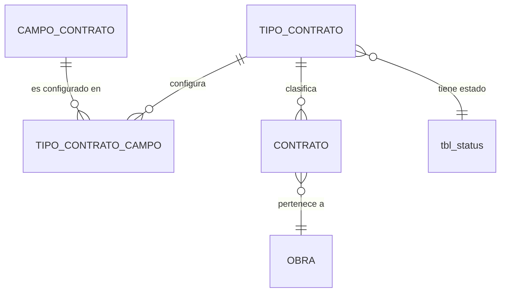

# ADR-0006: Tipos de contrato y configuración de campos

## Estado

**Propuesto.**

El maestro de tipos de contrato **no existe** en el código ni en el esquema. Este ADR documenta la decisión arquitectónica recomendada.

## Fecha

2026-09-10 — versión inicial.

## Contexto

Un tipo de contrato tiene dos atributos: **nombre** y **configuración**. La configuración define qué campos, de entre los disponibles en un contrato, aplican para ese tipo.

Es el único maestro del sistema que no es un simple catálogo: es **metadatos que gobiernan el comportamiento de otro formulario**. Un contrato de materiales no requiere los mismos campos que un contrato de obra mayor o uno de subcontratación, y el sistema debe adaptarse sin multiplicar formularios.

Esto plantea una separación arquitectónica que es el eje de este ADR:

```text
CONFIGURACIÓN DEL TIPO          ≠          INSTANCIA DEL CONTRATO
"qué campos aplican y cómo"                "qué valores tiene este contrato"
cambia rara vez                             cambia con cada contrato
afecta a todos los contratos del tipo       afecta solo a ese contrato
es metadato                                 es dato
```

Confundir ambos niveles es el error de diseño que este ADR previene.

## Problema

Un formulario configurable mal diseñado produce tres fallas específicas:

1. **La configuración se mezcla con los datos.** Si la definición de qué campos aplican se guarda junto al contrato, cada contrato lleva su propia copia y el tipo deja de significar nada.
2. **Cambiar la configuración corrompe lo existente.** Si un campo se marca como no aplicable, ¿qué pasa con los contratos que ya tienen valor en ese campo?
3. **La validación vive solo en el formulario.** Si "obligatorio" se define en la configuración pero solo lo aplica el frontend, el backend acepta contratos incompletos.

Se requiere definir cómo se almacena la configuración, cómo se determina si un campo es obligatorio, visible o aplicable, cómo la consume el formulario de contrato, y qué ocurre al modificar la configuración de un tipo ya utilizado.

## Estado actual

**No se encontró evidencia de implementación.**

Hechos verificados:

- No existe tabla de tipos de contrato en `database/bdintervewebpack.sql`.
- No existe tabla de contratos.
- No existe módulo en `server/src/modules/`.
- No existe vista ni entrada de menú.
- No existe ningún mecanismo de configuración de campos por tipo en el backend.
- No existen permisos asociados en `permissionsConfig.js`.

Lo que sí existe y es determinante para la decisión:

**`client/src/ui-component/extended/GenericFormSection.jsx` es un motor de formularios dirigido por datos, de 1519 líneas.** Recibe un arreglo de descriptores de campo y los renderiza. Soporta cerca de veinticinco tipos:

```text
text        textarea     number      float       currency
date        rangeCalendar  time      year
dropdown    multiselect  treeSelect  socketDropdown  pendingDropdown
checkbox    checkGroup   inputSwitch selectButton
password    upload       groupConcat custom
```

Cada descriptor admite `name`, `label`, `type`, `options`, `disabled`, `placeholder` y propiedades específicas. Se integra con `react-hook-form` mediante `useFormContext` y `Controller`.

**Este hallazgo cambia la viabilidad de la decisión.** La pieza más costosa de un formulario configurable —el renderizador dinámico— ya está construida y en uso. La configuración por tipo de contrato consiste, en el frontend, en producir el arreglo de descriptores que este componente ya sabe consumir.

**`tbl_business_rules`** es la única tabla del esquema con nombre de "reglas de negocio". Su contenido no tiene relación con este ADR: almacena credenciales de integración con Microsoft Graph (`rul_tenant_id`, `rul_client_id`, `rul_client_secret`) y rutas de facturación en SharePoint (`rul_invoicing_site`, `rul_invoicing_library`, `rul_invoice_folder`, `rul_invoice_path`). Es configuración de integración, no de dominio.

Nota de seguridad al margen: esa tabla guarda `rul_client_secret` en texto plano y sin columna de estado.

**Precedente de configuración por registro:** `tbl_users.use_pages` y `tbl_profiles.pro_pages` son `varchar(255)` con listas de identificadores separadas por coma. Es el patrón de "configuración como cadena" que este ADR **descarta explícitamente**, por las razones que se detallan más abajo.

## Decisión

1. **La configuración del tipo de contrato es metadato y vive en su propia estructura relacional, separada de los contratos.** Un contrato referencia su tipo; no copia su configuración.

2. **La configuración se almacena de forma relacional: una fila por campo configurado**, no como cadena serializada ni como documento JSON.

3. **El catálogo de campos configurables es un maestro cerrado, versionado con el código.** Un tipo de contrato no puede inventar campos: solo puede declarar cuáles de los campos existentes en la entidad contrato aplican y bajo qué condiciones. La configuración no crea columnas.

4. **Cada campo configurado tiene tres atributos independientes**, y son tres preguntas distintas:

   | Atributo | Pregunta | Efecto |
   | --- | --- | --- |
   | **Aplica** | ¿Este campo tiene sentido para este tipo? | Si no aplica, no se muestra ni se acepta valor |
   | **Visible** | ¿Se muestra en el formulario? | Un campo puede aplicar y calcularse sin mostrarse |
   | **Obligatorio** | ¿Debe tener valor para guardar? | Solo tiene sentido si aplica |

   La jerarquía es estricta: **no aplica** anula visible y obligatorio. Un campo no aplicable no puede ser obligatorio.

5. **La configuración se resuelve en el backend y se entrega al frontend como parte del contexto del formulario.** El frontend no deduce la configuración: la recibe.

6. **La validación de obligatoriedad se aplica en el backend**, con la misma configuración que el frontend usó para renderizar. Una única fuente, dos consumidores.

7. **Modificar la configuración de un tipo ya utilizado no altera los contratos existentes.** Los valores ya capturados se conservan aunque el campo deje de aplicar.

8. **Un contrato existente con valor en un campo que dejó de aplicar muestra ese valor en modo solo lectura**, marcado como heredado de una configuración anterior. No se oculta ni se borra.

9. **Los cambios de configuración de un tipo se auditan funcionalmente**, con valor anterior y nuevo. Es una decisión que afecta a todos los contratos futuros de ese tipo.

10. **La configuración se versiona.** Un contrato registra con qué versión de configuración fue creado, de modo que su formulario pueda reconstruirse tal como se presentó.

## Justificación

- **Configuración relacional y no serializada**: el proyecto ya tiene el contraejemplo. `use_pages` almacena una lista en un `varchar(255)` y se usa así en `app.service.getMenu`:

  ```text
  WHERE pag_id IN (${ven})
  ```

  Interpolación directa de un campo de datos en la consulta. Es a la vez un vector de inyección SQL, un límite arbitrario de 255 caracteres, un dato sin integridad referencial y algo imposible de consultar con eficiencia. Una configuración de campos serializada repetiría exactamente ese error con más superficie.

- **Catálogo de campos cerrado**: permitir que la configuración cree campos convierte el problema en un constructor de formularios genérico, con almacenamiento clave-valor, sin tipos, sin integridad y sin posibilidad de consultar o agregar por esos campos. Los valores de un contrato —valor inicial, plazo, costo directo— deben ser columnas tipadas, indexables y agregables por el dashboard.

- **Tres atributos independientes**: colapsarlos en uno solo produce ambigüedad inmediata. "Oculto" no dice si el campo no aplica o si se calcula y no se muestra. La diferencia importa: en el primer caso no debe aceptarse valor; en el segundo, sí.

- **Validación en backend con la misma configuración**: es la aplicación directa del principio transversal del sistema. Si "obligatorio" solo lo aplica el frontend, basta una petición directa para crear contratos incompletos. Que ambos lean la misma fuente evita la deriva entre lo que el formulario exige y lo que el servidor acepta.

- **No alterar contratos existentes**: un contrato firmado es un hecho consumado. Cambiar la configuración del tipo es una decisión sobre contratos futuros, no una reescritura del pasado. Borrar valores por un cambio de configuración destruiría información contractual.

- **Mostrar valores heredados en solo lectura**: ocultarlos haría que un dato existente en la base no apareciera en ninguna pantalla — el peor resultado, porque el sistema mentiría por omisión. Mostrarlo marcado explica la inconsistencia en lugar de esconderla.

- **Versionar la configuración**: sin versión, no se puede reconstruir cómo se veía el formulario cuando se creó un contrato de hace dos años. Con expedientes contractuales, esa reconstrucción es parte del expediente.

- **Reutilizar `GenericFormSection`**: existe, está en uso y soporta los tipos necesarios. Construir un renderizador nuevo sería duplicar 1500 líneas ya probadas.

## Alternativas consideradas

### Alternativa 1 — Configuración serializada en una columna

Guardar la configuración como JSON o cadena delimitada en la fila del tipo de contrato.

- **A favor**: una sola columna; flexible; sin tablas adicionales; fácil de leer completo.
- **En contra**: sin integridad referencial —nada garantiza que los campos referenciados existan—; imposible consultar "qué tipos usan este campo" sin recorrer todas las filas; sin restricciones de tipo ni de valor; el precedente del proyecto (`use_pages`) demuestra a qué conduce, incluida la interpolación directa en SQL. MySQL 8 soporta el tipo `JSON` con validación de sintaxis, pero no de esquema ni de referencias.
- **Descartada.**

### Alternativa 2 — Una columna booleana por campo en el maestro de tipos

`aplica_valor_inicial`, `obligatorio_valor_inicial`, `visible_valor_inicial`, y así por cada campo.

- **A favor**: tipado, indexable, consultable, con integridad estructural.
- **En contra**: cada campo nuevo del contrato exige tres columnas más y una migración. Con veinte campos serían sesenta columnas. La tabla se vuelve inmanejable y el esquema cambia por razones de configuración.
- **Descartada** por falta de escalabilidad.

### Alternativa 3 — Almacenamiento clave-valor para los datos del contrato

Además de configurar qué campos aplican, guardar sus valores en una tabla genérica de atributos.

- **A favor**: flexibilidad total; campos nuevos sin migración.
- **En contra**: pierde el tipado —un valor monetario y una fecha quedan como texto—; hace inviables las agregaciones del dashboard; impide índices útiles; convierte cualquier consulta en una serie de uniones. Para un sistema cuyo objeto es el control económico de contratos, es inaceptable.
- **Descartada.** La configuración es dinámica; **los datos del contrato no lo son**.

### Alternativa 4 — Configuración relacional sobre un catálogo cerrado de campos (seleccionada)

Tabla de campos configurables versionada con el código; tabla de configuración con una fila por tipo y campo, con los tres atributos.

- **A favor**: integridad referencial; consultable en ambos sentidos; sin cambios de esquema al reconfigurar; datos del contrato tipados en columnas reales; compatible con `GenericFormSection`; auditable por fila.
- **En contra**: dos tablas más; añadir un campo nuevo al contrato exige migración —lo cual es correcto: un campo nuevo es un cambio del modelo, no configuración.
- **Seleccionada.**

## Modelo arquitectónico

Modelo propuesto. **Ninguna de estas tablas existe hoy.**



Separación de niveles, que es la decisión central:

```text
NIVEL METADATO  —  cambia rara vez, afecta a todo el tipo
┌──────────────────────────────────────────────────┐
│ CAMPO_CONTRATO      catálogo cerrado, versionado │
│   ├── clave simbólica                            │
│   ├── etiqueta                                   │
│   ├── tipo de dato   (alineado con los tipos     │
│   │                   de GenericFormSection)     │
│   └── grupo / sección                            │
│                                                  │
│ TIPO_CONTRATO                                    │
│   ├── nombre  (único entre no eliminados)        │
│   ├── sta_id  → tbl_status                       │
│   ├── versión de configuración                   │
│   └── auditoría estándar                         │
│                                                  │
│ TIPO_CONTRATO_CAMPO   una fila por tipo y campo  │
│   ├── tipo_contrato                              │
│   ├── campo                                      │
│   ├── aplica       (booleano)                    │
│   ├── visible      (booleano)                    │
│   ├── obligatorio  (booleano)                    │
│   ├── orden                                      │
│   └── auditoría estándar                         │
└──────────────────────────────────────────────────┘
                      │
                      │ gobierna
                      ▼
NIVEL DATO  —  cambia con cada contrato
┌──────────────────────────────────────────────────┐
│ CONTRATO                                         │
│   ├── tipo_contrato   FK                         │
│   ├── versión de configuración usada             │
│   ├── valor inicial, plazo, costo directo …      │
│   │      COLUMNAS TIPADAS, no clave-valor        │
│   └── auditoría estándar                         │
└──────────────────────────────────────────────────┘
```

Resolución de los tres atributos, con la jerarquía explícita:

```text
Para cada campo del catálogo, ante un tipo de contrato:

  ¿existe configuración para (tipo, campo)?
      NO  ──> no aplica            (por defecto, restrictivo)
      SÍ
       │
       ├── aplica = false  ──────> no se muestra, no se acepta valor
       │                            visible y obligatorio se ignoran
       │
       └── aplica = true
             ├── visible = false ──> no se muestra, sí puede tener valor
             └── visible = true
                   ├── obligatorio = true  ──> exigido al guardar
                   └── obligatorio = false ──> opcional
```

El valor por defecto es **restrictivo**: la ausencia de configuración significa "no aplica". Un tipo mal configurado produce un formulario vacío, que es un error visible, en lugar de un formulario completo que acepta cualquier cosa, que es un error silencioso.

Flujo de consumo:

```text
Usuario abre el formulario de contrato con tipo = T
   │
   ▼
GET /api/contratos/configuracion?tipo=T
   │
   ▼
Backend resuelve la configuración de T
   └── devuelve descriptores de campo
       [ { name, label, type, required, options, order }, … ]
   │
   ▼
Frontend: GenericFormSection renderiza los descriptores  ← componente ya existente
   │
   ▼
POST /api/contratos   { tipo: T, valores }
   │
   ▼
Backend valida contra LA MISMA configuración
   ├── ¿campo no aplicable con valor?     ──> rechazar
   ├── ¿campo obligatorio sin valor?      ──> rechazar
   └── persistir en columnas tipadas
```

## Reglas de negocio

**No se encontró evidencia en la implementación actual.** Reglas propuestas:

1. Un tipo de contrato tiene nombre, estado y configuración de campos.
2. El nombre es único entre los tipos no eliminados.
3. Todo contrato pertenece a exactamente un tipo de contrato.
4. La configuración solo puede referirse a campos del catálogo cerrado.
5. Un campo no aplicable no se muestra y no admite valor.
6. Un campo no aplicable no puede marcarse como obligatorio.
7. La ausencia de configuración para un campo significa que no aplica.
8. Un campo obligatorio debe tener valor para poder guardar el contrato.
9. Modificar la configuración de un tipo no altera los contratos existentes.
10. Un contrato con valor en un campo que dejó de aplicar conserva y muestra ese valor en solo lectura.
11. Cambiar el tipo de un contrato existente es una operación excepcional, con permiso propio, y no borra valores.
12. Solo los tipos activos pueden seleccionarse al crear un contrato.
13. Un tipo con contratos asociados no puede eliminarse.
14. Los cambios de configuración se auditan funcionalmente.

## Seguridad

La configuración de un tipo determina qué se exige y qué se acepta. Manipularla afecta la validez de todos los contratos futuros de ese tipo.

Requisitos:

- La administración de la configuración exige un permiso propio, distinto del de crear contratos.
- **La validación de obligatoriedad y aplicabilidad se ejecuta en backend.** Un formulario que exige un campo no impide que una petición directa lo omita.
- **El backend debe rechazar valores en campos no aplicables**, no solo ignorarlos. Aceptarlos silenciosamente permitiría poblar campos que la configuración excluye.
- Los descriptores de campo que el backend entrega al frontend son metadatos públicos para usuarios autenticados; no contienen datos sensibles.
- Consultas parametrizadas. Advertencia preventiva: el módulo `template`, patrón de referencia del proyecto, interpola filtros del cliente en la cadena SQL.

## Autorización

Acciones propuestas:

```text
CONSULTAR TIPOS DE CONTRATO
CREAR TIPO DE CONTRATO
EDITAR TIPO DE CONTRATO
ELIMINAR TIPO DE CONTRATO
CONFIGURAR CAMPOS DEL TIPO DE CONTRATO
CAMBIAR ESTADO TIPO DE CONTRATO
```

**Ninguna existe hoy.**

`CONFIGURAR CAMPOS` se separa de `EDITAR` deliberadamente: cambiar el nombre de un tipo es cosmético; cambiar su configuración altera el comportamiento del sistema para todos los contratos futuros de ese tipo. Son decisiones de distinto peso y merecen control independiente.

Existe un precedente de esta separación en el sistema actual: `assignPermission` (`per_id` 4 y 8) es un permiso distinto de `edit` (2 y 6) para perfiles y usuarios, exactamente por el mismo razonamiento.

Ver [ADR-0014](0014-autorizacion-permisos.md).

## Auditoría

**Nivel requerido: auditoría funcional** para la configuración; **técnica** para el nombre y el estado del tipo.

La configuración es una decisión con alcance sobre múltiples contratos. Debe registrarse qué campo cambió, de qué combinación de aplica/visible/obligatorio a cuál, quién y cuándo.

Sin ese registro, ante un contrato al que le falta un dato es imposible determinar si se capturó mal o si el campo no era obligatorio cuando se creó.

La versión de configuración registrada en cada contrato complementa la auditoría: permite reconstruir el formulario tal como se presentó.

Ver [ADR-0013](0013-auditoria-trazabilidad.md).

## Validaciones

| Validación | Frontend | Backend | Base de datos | Clasificación |
| --- | --- | --- | --- | --- |
| Nombre obligatorio | Propuesta | Propuesta | `NOT NULL` | UX + Integridad |
| Nombre único | Propuesta | Propuesta | **`UNIQUE` — obligatorio** | Integridad |
| El campo existe en el catálogo | Propuesta (selector) | Propuesta | FK | Integridad |
| Obligatorio implica aplica | Propuesta | **Propuesta — obligatoria** | `CHECK` | Regla de negocio |
| Campo obligatorio con valor | Propuesta (formulario) | **Propuesta — obligatoria** | No expresable | **Regla de negocio + Seguridad** |
| Sin valor en campo no aplicable | Propuesta (no se muestra) | **Propuesta — obligatoria** | No expresable | **Regla de negocio + Seguridad** |
| Tipo activo al crear un contrato | Propuesta (selector) | Propuesta | No expresable | Regla de negocio |
| Sin contratos antes de eliminar el tipo | Propuesta (aviso) | Propuesta | No expresable | Regla de negocio |
| Permiso de la acción | Propuesta | **Propuesta — obligatoria** | No aplica | Seguridad |

La restricción "obligatorio implica aplica" sí es expresable en el esquema mediante `CHECK`, soportado y aplicado por MySQL 8. Es preferible declararla allí: es una invariante estructural, no una regla circunstancial.

Las dos validaciones marcadas como "Regla de negocio + Seguridad" no admiten delegación al frontend: su omisión permite persistir contratos incompletos o con datos que la configuración excluye.

## Integridad de datos

Requisitos propuestos:

- `UNIQUE` sobre el nombre del tipo, entre los no eliminados.
- `UNIQUE` sobre el par (tipo de contrato, campo) en la tabla de configuración: un campo se configura una sola vez por tipo.
- FK de la configuración al tipo y al campo, `ON DELETE RESTRICT`.
- FK del contrato al tipo, `NOT NULL`, `ON DELETE RESTRICT`.
- `CHECK` que impida `obligatorio = true` con `aplica = false`.
- Índice sobre el campo en la tabla de configuración, para responder "qué tipos usan este campo".
- Catálogo de campos sembrado y versionado con el código, no editable desde la interfaz.

## Transacciones

Guardar la configuración de un tipo afecta varias filas —una por campo— y debe ser atómica. El escenario a evitar:

```text
UPDATE campo A  → OK
UPDATE campo B  → OK
UPDATE campo C  → ERROR
```

Una configuración a medio aplicar produce formularios incoherentes para todos los contratos futuros del tipo.

El patrón adecuado es el ya usado en `permissions.service.updateProfilePermissions`: calcular el diferencial entre el estado actual y el deseado, aplicarlo dentro de una transacción, y confirmar al final. La escritura de auditoría va en la misma transacción.

## Consecuencias

### Positivas

- Separación explícita entre metadato y dato: el tipo define, el contrato instancia.
- Reconfigurar un tipo no requiere cambios de esquema ni despliegue.
- Los datos del contrato permanecen en columnas tipadas, indexables y agregables por el dashboard.
- Reutiliza `GenericFormSection`, ya construido y probado, lo que reduce sustancialmente el coste.
- Los contratos existentes son inmunes a cambios de configuración.
- La versión de configuración permite reconstruir el formulario histórico.
- La configuración es consultable en ambos sentidos: campos de un tipo, y tipos que usan un campo.

### Negativas

- Tres tablas donde una configuración serializada usaría una columna.
- Añadir un campo nuevo al contrato exige migración de esquema y actualización del catálogo.
- La validación debe implementarse dos veces —frontend para la experiencia, backend para la garantía— aunque lea la misma fuente.
- Los valores heredados en solo lectura añaden un estado visual que la interfaz debe explicar.
- El versionado de configuración añade complejidad a la consulta del formulario histórico.

## Riesgos

| Riesgo | Severidad | Descripción |
| --- | --- | --- |
| Configuración serializada | **Alto** | Repetiría el defecto de `use_pages`, incluida la interpolación en SQL |
| Validación solo en el frontend | **Alto** | Permite crear contratos incompletos por petición directa |
| Campos como clave-valor | **Alto** | Destruiría el tipado y haría inviables los indicadores del dashboard |
| Pérdida de datos al reconfigurar | **Alto** | Si un cambio de configuración borrara valores existentes |
| Datos invisibles | **Medio** | Si los valores de campos que dejaron de aplicar se ocultan en lugar de mostrarse marcados |
| Configuración por defecto permisiva | **Medio** | Si la ausencia de configuración significara "aplica", un tipo sin configurar aceptaría cualquier cosa |
| Deriva entre catálogo y columnas | **Medio** | Si el catálogo de campos declara campos sin columna correspondiente |
| Sin auditoría de configuración | **Medio** | Imposible explicar por qué un contrato antiguo no tiene un dato hoy obligatorio |
| Cambio de tipo de un contrato | **Medio** | Si se permite libremente, un contrato puede quedar con campos incoherentes |

## Impacto técnico

### Frontend

- `ui-component/extended/GenericFormSection.jsx` **ya existe** y es el renderizador. La integración consiste en alimentarlo con los descriptores que entrega el backend.
- Los tipos de campo del catálogo deben alinearse con los que el componente soporta: `text`, `textarea`, `number`, `float`, `currency`, `date`, `year`, `dropdown`, `multiselect`, `checkbox`, `inputSwitch`, `upload`, entre otros.
- `react-hook-form` ya es la biblioteca de formularios del proyecto.
- Requiere una vista de administración del tipo con su editor de configuración: una matriz de campos con tres casillas por fila.
- Requiere presentación diferenciada para los valores heredados en solo lectura.
- `BaseDialog.jsx`, `ConfirmDialog.jsx` y `DataTable.jsx` son reutilizables.

### Backend

- Requiere el módulo de tipos de contrato con `routes` / `controller` / `service`.
- Requiere un servicio de resolución de configuración, consumido tanto por el endpoint de formulario como por la validación de guardado — **la misma función en ambos casos**, para que no puedan divergir.
- El patrón de diferencial de `updateProfilePermissions` es directamente aplicable al guardado de la configuración.

### Base de datos

- Tres tablas nuevas, inexistentes hoy.
- El catálogo de campos debe sembrarse y versionarse con el código.
- Requiere `CHECK` constraints, soportados por MySQL 8 y no usados hoy en el esquema.
- Sin migraciones versionadas en el proyecto.

### Infraestructura

No aplica.

## Estado actual vs arquitectura objetivo

| Aspecto | Estado actual | Arquitectura objetivo |
| --- | --- | --- |
| Tipo de contrato | No existe | Maestro con nombre, estado y configuración |
| Configuración | No existe | Relacional, una fila por tipo y campo |
| Precedente de configuración | `use_pages` como CSV interpolado en SQL | Modelo relacional con integridad |
| Catálogo de campos | No existe | Cerrado, versionado con el código |
| Renderizado del formulario | `GenericFormSection` existe, sin uso para esto | Alimentado con descriptores del backend |
| Validación de obligatoriedad | No existe | Backend, con la misma configuración que el frontend |
| Datos del contrato | No existen | Columnas tipadas, nunca clave-valor |
| Cambio de configuración | No aplica | No altera contratos existentes; auditado |
| Versionado | No aplica | El contrato registra la versión con que se creó |

## Brechas identificadas

| # | Brecha | Severidad |
| --- | --- | --- |
| B1 | El maestro y su configuración no existen | **Alta** |
| B2 | No existe la entidad contrato | **Alta** — bloquea el módulo |
| B3 | No existe el catálogo de campos configurables | **Alta** |
| B4 | El precedente de configuración del proyecto (`use_pages`) es un antipatrón con inyección SQL | **Alta** — a no replicar |
| B5 | Sin validación de obligatoriedad en backend | **Alta** |
| B6 | `GenericFormSection` no se usa para formularios configurables | **Baja** — oportunidad no aprovechada |
| B7 | Sin permisos de configuración | **Media** |
| B8 | Sin auditoría de cambios de configuración | **Media** |
| B9 | Sin `CHECK` constraints en el esquema | **Baja** |
| B10 | Sin migraciones versionadas | **Media** |
| B11 | `tbl_business_rules` almacena credenciales en texto plano | **Alta** — ajeno a este ADR, registrado por hallazgo |

## Plan de implementación

Recomendación derivada del análisis. **No fue ejecutada.**

**Fase 0 — Prerrequisitos (B2, B10)**
Requiere la entidad contrato ([ADR-0005](0005-estados-contrato.md)) y migraciones versionadas.

**Fase 1 — Catálogo de campos (B3)**
Definir el conjunto cerrado de campos configurables, alineado con las columnas reales de contrato y con los tipos que soporta `GenericFormSection`. Sembrarlo y versionarlo.

**Fase 2 — Maestro y configuración (B1, B9)**
Tablas de tipo y de configuración, con `UNIQUE` sobre el par y `CHECK` sobre la coherencia de los atributos.

**Fase 3 — Resolución compartida (B5)**
Servicio único de resolución de configuración, consumido por el endpoint de formulario y por la validación de guardado.

**Fase 4 — Interfaz (B6)**
Editor de configuración y formulario de contrato alimentado por descriptores.

**Fase 5 — Permisos y auditoría (B7, B8)**
Separar `CONFIGURAR CAMPOS` de `EDITAR`. Auditar funcionalmente los cambios de configuración.

**Fase 6 — Versionado**
Registrar en cada contrato la versión de configuración con que fue creado.

## ADR relacionados

- [ADR-0005 — Estados de contrato](0005-estados-contrato.md) — ciclo de vida del contrato
- [ADR-0011 — Obras](0011-obras.md) — la obra referencia un tipo de contrato
- [ADR-0013 — Auditoría y trazabilidad](0013-auditoria-trazabilidad.md)
- [ADR-0014 — Autorización basada en permisos](0014-autorizacion-permisos.md)

## Referencias

- `client/src/ui-component/extended/GenericFormSection.jsx` — motor de formularios dirigido por datos
- `client/src/ui-component/extended/Form/` — controles de formulario
- `server/src/modules/app/general/app.service.js` — `getMenu`, antipatrón de configuración serializada
- `server/src/modules/security/permissions/permissions.service.js` — patrón de diferencial transaccional
- `database/bdintervewebpack.sql` — `tbl_business_rules`, `tbl_users.use_pages`, `tbl_profiles.pro_pages`
