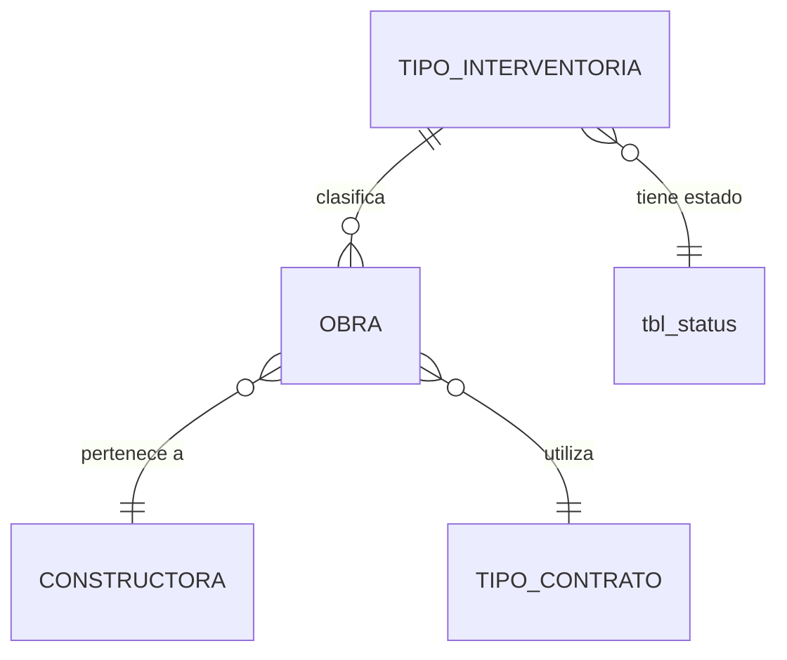

# ADR-0007: Tipo de interventoría

## Estado

**Propuesto.**

El maestro de tipos de interventoría **no existe** en el código ni en el esquema. Este ADR documenta la decisión arquitectónica recomendada.

## Fecha

2026-09-10 — versión inicial.

## Contexto

La interventoría es la función de vigilancia y control sobre la ejecución de una obra o contrato. Su tipo —técnica, administrativa, financiera, integral, u otras clasificaciones según la organización— determina el alcance de esa vigilancia.

Estructuralmente es un maestro de dos atributos: nombre y estado. Comparte el patrón de [ADR-0003](0003-aseguradoras.md) y [ADR-0004](0004-constructoras.md).

Lo que lo distingue es una pregunta que debe resolverse antes de implementarlo: **a qué se asocia el tipo de interventoría**. Es un dato de la obra, del contrato, o de ambos, y la respuesta cambia el modelo.

## Problema

Un maestro de clasificación sin un punto de anclaje definido termina asociado a la entidad equivocada, o a varias sin criterio. Las consecuencias son concretas:

- Si el tipo de interventoría se asocia a la obra pero conceptualmente pertenece al contrato, todos los contratos de una obra comparten forzosamente el mismo tipo.
- Si se asocia a ambos sin regla, dos fuentes distintas responden la misma pregunta y pueden contradecirse.

Se requiere definir el punto de anclaje, la unicidad, el efecto del estado y la política de eliminación.

## Estado actual

**No se encontró evidencia de implementación.**

Hechos verificados:

- No existe tabla de tipos de interventoría en `database/bdintervewebpack.sql`.
- No existe módulo en `server/src/modules/` ni vista en `client/src/views/`.
- No existen las entidades obra ni contrato con las cuales relacionarlo.
- No existen permisos asociados en `permissionsConfig.js`.
- El término "interventoría" no aparece en ningún archivo del repositorio, más allá del nombre del proyecto (`interve_webpack`).

Estructura de referencia disponible: `tbl_reasons` y `tbl_priorities`, maestros ya presentes en el esquema y sin uso en el código, con la forma exacta que este maestro requiere.

## Decisión

1. **Tipo de interventoría es un maestro con nombre y estado.** No contiene información de obras, contratos ni interventores.

2. **El nombre es único entre los tipos no eliminados, garantizado por restricción de base de datos.**

3. **El tipo de interventoría se asocia a la obra**, no al contrato. La interventoría se ejerce sobre la ejecución de la obra, y los contratos que la componen quedan bajo ese mismo alcance de vigilancia.

   **Estado: Pendiente de validación.** Es una decisión de negocio que debe confirmarse con el área usuaria antes de implementar. Si un contrato individual puede tener un tipo de interventoría distinto del de su obra, el anclaje debe moverse al contrato y este ADR debe actualizarse.

4. **La relación es N:1**: una obra tiene un tipo de interventoría; un tipo clasifica muchas obras.

5. **La eliminación es lógica** mediante `sta_id = 3`, y está **bloqueada si el tipo está en uso**.

6. **Desactivar un tipo impide seleccionarlo en obras nuevas y no afecta a las existentes.**

7. **Los listados de obra nunca ocultan una obra por el estado de su tipo de interventoría.** El `JOIN` es externo o no filtra por el estado del maestro.

8. **Auditoría técnica según [ADR-0013](0013-auditoria-trazabilidad.md); permisos según [ADR-0014](0014-autorizacion-permisos.md).**

## Justificación

- **Anclaje en la obra**: la interventoría es una función sobre la ejecución física y administrativa de la obra en su conjunto. Anclarla al contrato multiplicaría el dato sin aportar distinción, salvo que exista el caso real de contratos con vigilancia de tipo distinto dentro de una misma obra. Por eso la decisión se marca como pendiente de validación en lugar de darse por cerrada.
- **Unicidad en base de datos**: el patrón de verificación por `SELECT` previo, usado en todo el backend actual, no resiste concurrencia. El esquema no tiene ninguna restricción `UNIQUE`. Un catálogo de clasificación duplicado invalida toda agrupación por tipo.
- **Bloqueo de eliminación por uso**: es la misma decisión de [ADR-0004](0004-constructoras.md) y por la misma razón. El precedente negativo del proyecto —`deleteProfile`, que elimina un perfil sin verificar si tiene usuarios— muestra el defecto a evitar.
- **`JOIN` externo**: el precedente de `paginationUsers` (`JOIN tbl_profiles p ON u.pro_id = p.pro_id AND p.sta_id = 1`) hace que desactivar un maestro haga desaparecer registros operativos del listado. Aplicado a obras, sería un defecto grave y difícil de diagnosticar.

## Alternativas consideradas

### Alternativa 1 — Tipo de interventoría como valor fijo en el código

Constantes en lugar de tabla, dado que son pocos valores estables.

- **A favor**: sin tabla, sin CRUD, sin mantenimiento; imposible de corromper.
- **En contra**: cambiar la lista exige despliegue. El sistema es un producto de gestión configurable, y los tipos de interventoría varían entre organizaciones. Además rompe la uniformidad: todos los demás maestros son tablas.
- **Descartada.**

### Alternativa 2 — Relación N:M entre obra y tipos de interventoría

Una obra con varios tipos simultáneos.

- **A favor**: cubre el caso de interventoría integral compuesta por varias especialidades.
- **En contra**: complica la agrupación y el reporte —una obra contaría en varias categorías, con el problema de doble conteo descrito en [ADR-0002](0002-dashboard.md)—. **No se encontró evidencia** de que ese caso exista en el alcance funcional descrito, que menciona "tipo de interventoría" en singular.
- **Descartada** por ausencia de requisito. Si aparece, se resuelve con un tipo "Integral" en el catálogo antes que con una relación N:M.

### Alternativa 3 — Maestro simple con relación N:1 a la obra (seleccionada)

- **A favor**: consistente con los demás maestros; agrupación sin ambigüedad; sin doble conteo; configurable sin despliegue.
- **En contra**: no admite tipos múltiples simultáneos, si ese requisito llegara a existir.
- **Seleccionada.**

## Modelo arquitectónico

Modelo propuesto. **Ninguna de estas tablas existe hoy.**



```text
TIPO_INTERVENTORIA
  ├── identificador
  ├── nombre         (único entre no eliminados)
  ├── sta_id         → tbl_status
  └── auditoría estándar

OBRA
  └── tipo_interventoria_id   FK ON DELETE RESTRICT
```

Estructura de referencia real:

```text
tbl_priorities  (existente, sin uso en código)
  pri_id, pri_name,
  pri_create_by, pri_create_at, pri_update_by, pri_update_at
```

Nótese que `tbl_priorities` **no tiene `sta_id`**: es un maestro sin estado. El tipo de interventoría sí lo requiere, por lo que el patrón a seguir es el de `tbl_reasons`, que sí lo incluye.

## Reglas de negocio

**No se encontró evidencia en la implementación actual.** Reglas propuestas:

1. Un tipo de interventoría tiene nombre y estado.
2. El nombre es único entre los tipos no eliminados.
3. Una obra tiene a lo sumo un tipo de interventoría.
4. Solo los tipos activos pueden seleccionarse al crear o editar una obra.
5. Un tipo con obras asociadas no puede eliminarse.
6. Desactivar un tipo no afecta las obras existentes.
7. Una obra nunca se oculta de los listados por el estado de su tipo de interventoría.
8. Un tipo desactivado puede reactivarse.

**Pendiente de validación:** si el tipo de interventoría es obligatorio en la obra o admite ausencia, y si puede diferir entre contratos de una misma obra.

## Seguridad

Riesgo bajo: catálogo de clasificación sin datos sensibles.

- Todas las operaciones exigen sesión y permiso verificados en backend.
- Consultas parametrizadas y lista blanca para el campo de ordenamiento. Advertencia preventiva: el módulo `template`, patrón de referencia del proyecto, interpola filtros del cliente directamente en la cadena SQL.

## Autorización

Acciones propuestas:

```text
CONSULTAR TIPOS DE INTERVENTORÍA
CREAR TIPO DE INTERVENTORÍA
EDITAR TIPO DE INTERVENTORÍA
ELIMINAR TIPO DE INTERVENTORÍA
CAMBIAR ESTADO TIPO DE INTERVENTORÍA
```

**Ninguna existe hoy.** Ver [ADR-0014](0014-autorizacion-permisos.md).

## Auditoría

**Nivel requerido: auditoría técnica.**

Las cuatro columnas estándar bastan para un maestro de clasificación de dos atributos.

Excepción: el **cambio de tipo de interventoría en una obra existente** se audita funcionalmente, en el ADR de obras. Es una modificación del alcance de vigilancia del expediente.

Ver [ADR-0013](0013-auditoria-trazabilidad.md).

## Validaciones

| Validación | Frontend | Backend | Base de datos | Clasificación |
| --- | --- | --- | --- | --- |
| Nombre obligatorio | Propuesta | Propuesta | `NOT NULL` | UX + Integridad |
| Nombre único | Propuesta | Propuesta | **`UNIQUE` — obligatorio** | Integridad |
| Estado válido | Propuesta (selector) | Propuesta | FK a `tbl_status` | Integridad |
| Tipo activo al asignarlo a una obra | Propuesta (selector) | **Propuesta — obligatoria** | No expresable | Regla de negocio |
| Sin obras antes de eliminar | Propuesta (aviso) | **Propuesta — obligatoria** | No expresable | Regla de negocio |
| Permiso de la acción | Propuesta | **Propuesta — obligatoria** | No aplica | Seguridad |

## Integridad de datos

- `UNIQUE` sobre el nombre, entre los no eliminados.
- FK a `tbl_status`, `ON DELETE RESTRICT`.
- FK desde obra al tipo, `ON DELETE RESTRICT`.
- Índice sobre el nombre para el filtro del listado, e índice sobre el tipo en la tabla de obras para la verificación de uso.
- `utf8mb4` con colación consistente. El esquema actual mezcla `latin1`, `utf8mb3` y `utf8mb4`, lo que degrada los `JOIN` entre colaciones distintas.

## Transacciones

Operaciones de tabla única. La transacción se justifica por dos motivos: atomicidad entre la verificación de unicidad y la escritura, y para que la verificación de uso al eliminar no se invalide por una escritura concurrente.

Es el patrón ya aplicado en `saveProfile` y `saveMasterTemplate`.

## Consecuencias

### Positivas

- Clasificación configurable sin despliegue.
- Agrupación de obras por tipo de vigilancia, útil para informes.
- Patrón idéntico al de los demás maestros: un solo modelo mental.
- El historial de obras conserva su clasificación aunque el tipo se retire del uso.

### Negativas

- El catálogo acumula tipos inactivos.
- No admite tipos múltiples por obra.
- El anclaje en la obra es una decisión pendiente de confirmación; si resulta incorrecto, exige migrar la relación al contrato.

## Riesgos

| Riesgo | Severidad | Descripción |
| --- | --- | --- |
| Anclaje incorrecto | **Medio** | Si el tipo pertenece conceptualmente al contrato, la relación debe migrarse |
| Desaparición silenciosa de obras | **Alto** | Si el listado replica el `JOIN ... AND maestro.sta_id = 1` de `paginationUsers` |
| Obras huérfanas | **Medio** | Si se omite la verificación de uso, como en `deleteProfile` |
| Duplicados por concurrencia | **Medio** | Sin `UNIQUE`, el `SELECT` previo no resiste peticiones simultáneas |
| Inyección SQL heredada del patrón `template` | **Alto** | Preventiva |
| Sin permisos que restrinjan la administración | **Medio** | Dado el estado de ADR-0014 |

## Impacto técnico

### Frontend

- Vista de listado y diálogo, con `DataTable.jsx`, `FilterPopper.jsx`, `BaseDialog.jsx`, `ConfirmDialog.jsx` y `StatusChip.jsx`.
- Entrada de menú, ruta y archivo de API.
- El formulario de obra requiere un selector de tipos activos.

### Backend

- Módulo con `routes` / `controller` / `service`, siguiendo `modules/template/` **con las correcciones señaladas**: parametrización de filtros y convención de auditoría estándar.
- Endpoint de selector restringido a activos.
- Verificación de uso en el servicio de eliminación.

### Base de datos

- Tabla nueva, inexistente hoy.
- Depende de que exista la tabla de obras para declarar la relación.
- Sin migraciones versionadas en el proyecto.

### Infraestructura

No aplica.

## Estado actual vs arquitectura objetivo

| Aspecto | Estado actual | Arquitectura objetivo |
| --- | --- | --- |
| Tabla | No existe | Maestro con nombre, estado y auditoría |
| Anclaje | No existe | Obra, N:1 — pendiente de confirmación |
| Unicidad | No aplica | `UNIQUE` en base de datos |
| Eliminación | No aplica | Lógica, bloqueada si está en uso |
| `JOIN` en listados dependientes | Patrón actual filtra por estado del maestro | Externo, sin filtrar |
| Permisos | No existen | Cinco acciones propias |

## Brechas identificadas

| # | Brecha | Severidad |
| --- | --- | --- |
| B1 | El maestro no existe en ninguna capa | **Alta** |
| B2 | No existe la entidad obra con la cual relacionarlo | **Alta** — bloquea la relación |
| B3 | Anclaje obra/contrato sin confirmar | **Media** — decisión de negocio pendiente |
| B4 | Patrón de maestro (`template`) con inyección SQL | **Alta** — preventiva |
| B5 | Precedentes `deleteProfile` y `paginationUsers` como antipatrones | **Alta** — a no replicar |
| B6 | Sin restricciones `UNIQUE` en todo el esquema | **Media** |
| B7 | Sin permisos definidos para maestros de configuración | **Media** |
| B8 | Sin migraciones versionadas | **Media** |

## Plan de implementación

Recomendación derivada del análisis. **No fue ejecutada.**

**Fase 0 — Decisión de negocio (B3)**
Confirmar si el tipo de interventoría pertenece a la obra o al contrato, y si es obligatorio.

**Fase 1 — Maestro autónomo (B1, B6)**
Tabla, módulo backend parametrizado y vista, con `UNIQUE` desde el inicio.

**Fase 2 — Permisos (B7)**
Definir y aplicar las cinco acciones en backend.

**Fase 3 — Relación (B2, B5)**
Al implementarse [ADR-0011](0011-obras.md): FK `RESTRICT`, verificación de uso antes de eliminar, `JOIN` externo en los listados y selector restringido a activos.

## ADR relacionados

- [ADR-0011 — Obras](0011-obras.md) — entidad que lo referencia
- [ADR-0004 — Constructoras](0004-constructoras.md) — mismo patrón y mismas advertencias
- [ADR-0003 — Aseguradoras](0003-aseguradoras.md) — mismo patrón de maestro
- [ADR-0013 — Auditoría y trazabilidad](0013-auditoria-trazabilidad.md)
- [ADR-0014 — Autorización basada en permisos](0014-autorizacion-permisos.md)

## Referencias

- `database/bdintervewebpack.sql` — `tbl_reasons` y `tbl_priorities` como patrón estructural
- `server/src/modules/template/` — patrón CRUD, con las salvedades indicadas
- `server/src/modules/security/profiles/profiles.service.js` — `deleteProfile`, sin verificación de uso
- `server/src/modules/security/users/users.service.js` — `paginationUsers`, `JOIN` con filtro de estado
- `client/src/ui-component/extended/` — componentes reutilizables
