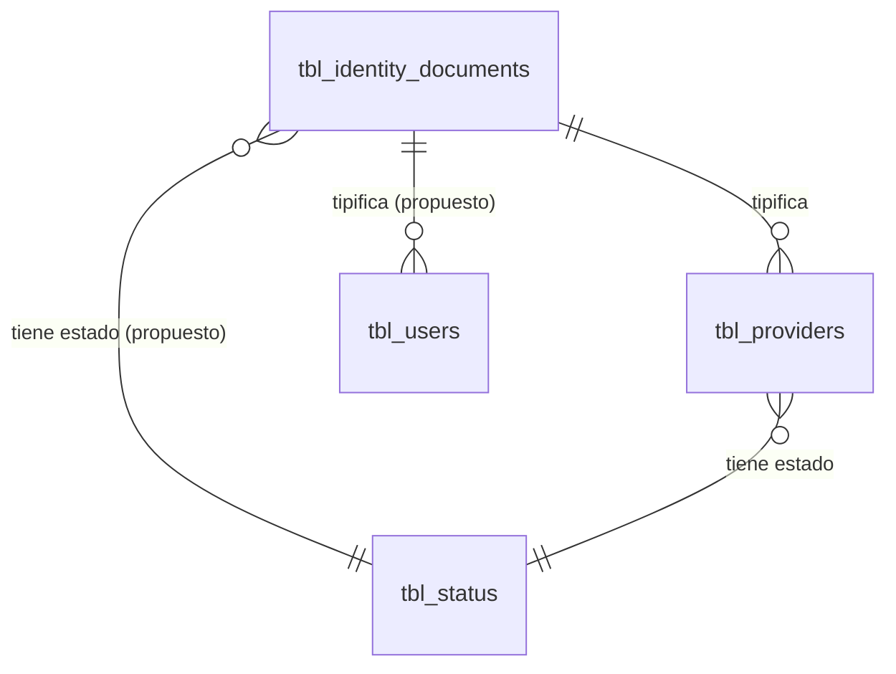

# ADR-0008: Tipo de identificación

## Estado

**Propuesto.**

El maestro de tipos de identificación **no existe en el esquema**, pero **está referenciado por una clave foránea** desde `tbl_providers`. Este ADR documenta la decisión arquitectónica recomendada y registra un defecto de integridad del esquema actual.

## Fecha

2026-09-10 — versión inicial.

## Contexto

Toda persona natural o jurídica registrada en el sistema —proveedores, contratistas, subcontratistas, usuarios— se identifica mediante un documento cuyo tipo determina su formato, su validación y su significado legal: NIT, cédula de ciudadanía, cédula de extranjería, pasaporte, entre otros.

El tipo de identificación es un maestro de dos atributos: nombre y estado. Su particularidad es que **participa en la clave de identidad de otras entidades**: la unicidad de un proveedor se determina por la combinación de tipo de documento y número de documento, no por el número aislado.

## Problema

Hay un error de modelado recurrente que este ADR debe prevenir explícitamente:

> **El tipo de identificación es un catálogo. No contiene información de ninguna persona ni de ningún proveedor.**

Mezclar en el maestro datos que pertenecen a la entidad identificada —número de documento, fecha de expedición, lugar de expedición, imagen del documento— convierte un catálogo de tres o cuatro filas en una tabla de datos personales, rompe la reutilización y duplica información.

Se requiere definir además:

1. Qué tipos son admisibles.
2. Dónde se valida el formato del número de documento.
3. Cómo participa el tipo en la unicidad de un proveedor.
4. Qué ocurre con el defecto de integridad ya presente en el esquema.

## Estado actual

### El defecto: clave foránea a una tabla inexistente

`tbl_providers` declara:

```text
idd_id int NULL DEFAULT NULL COMMENT 'TIPO DE DOCUMENTO',
INDEX tbl_providers_identity_documents (idd_id) USING BTREE,
CONSTRAINT tbl_providers_identity_documents
  FOREIGN KEY (idd_id) REFERENCES tbl_identity_documents (idd_id)
  ON DELETE RESTRICT ON UPDATE RESTRICT
```

**`tbl_identity_documents` no está en `database/bdintervewebpack.sql`.**

Consecuencias verificables:

- El volcado se ejecuta con `SET FOREIGN_KEY_CHECKS = 0` al inicio y `= 1` al final. La tabla se crea, pero **la clave foránea queda declarada contra una tabla ausente**. Restaurar el volcado en un esquema limpio produce una base con una restricción que no puede satisfacerse.
- Cualquier `INSERT` en `tbl_providers` con `idd_id` no nulo fallará una vez restablecida la verificación de claves foráneas.
- El volcado es, por tanto, **incompleto respecto de sus propias restricciones**.

Esto indica que el maestro **existe en el esquema de origen** del que se extrajo el volcado, y que la exportación lo omitió. El nombre real de la tabla y de su clave primaria están confirmados por la restricción: `tbl_identity_documents` y `idd_id`. Los demás atributos son desconocidos.

### Lo demás

- No existe módulo de tipos de identificación en `server/src/modules/`.
- No existe vista ni entrada de menú en el frontend.
- No existen permisos asociados en `permissionsConfig.js`.
- **`tbl_providers` no se referencia en ninguna línea del código**, ni del backend ni del frontend. Es una tabla huérfana. Ver [ADR-0012](0012-proveedores.md).
- `tbl_users.use_identification` es un `varchar(255)` **sin tipo de documento asociado**: el usuario del sistema guarda un número de identificación sin declarar de qué tipo es.

Esa última observación revela una inconsistencia de modelado en el sistema actual: proveedores tienen tipo de documento; usuarios no.

## Decisión

1. **Tipo de identificación es un maestro con nombre y estado.** No contiene, bajo ninguna circunstancia, información de una persona o proveedor concreto: ni número, ni fecha, ni lugar de expedición, ni imagen del documento.

2. **El nombre es único entre los tipos no eliminados, garantizado por restricción de base de datos.**

3. **Se resuelve el defecto del esquema**: la tabla `tbl_identity_documents` debe existir, con el nombre y la clave primaria que la restricción ya declara. Se recupera del esquema de origen o se crea conforme a esa declaración.

4. **El tipo de identificación participa en la identidad del proveedor.** La unicidad de un proveedor se define por la combinación **(tipo de identificación, número de documento)**, no por el número aislado.

   **Estado: Pendiente de validación.** Si el negocio determina que el número de documento es único por sí solo con independencia del tipo, la restricción cambia. Ver [ADR-0012](0012-proveedores.md), donde esta decisión se desarrolla.

5. **El formato del número de documento se valida en frontend y backend**, con reglas asociadas al tipo. La base de datos garantiza la unicidad y la obligatoriedad; el formato es una regla de negocio y no se expresa en el esquema.

6. **La eliminación es lógica** mediante `sta_id = 3` y está **bloqueada si el tipo está en uso** por algún proveedor o entidad identificada.

7. **Desactivar un tipo impide seleccionarlo en registros nuevos y no afecta a los existentes.** Un proveedor registrado con un tipo posteriormente desactivado conserva su identificación intacta.

8. **El tipo de identificación es obligatorio en toda entidad que registre un número de documento**, incluidos los usuarios del sistema. Un número sin tipo es un dato ambiguo.

9. **Auditoría técnica según [ADR-0013](0013-auditoria-trazabilidad.md); permisos según [ADR-0014](0014-autorizacion-permisos.md).**

## Justificación

- **Maestro sin datos personales**: si el maestro guardara el número de documento, habría una fila por persona en lugar de una por tipo, y el catálogo dejaría de ser reutilizable. Es el error que convierte un catálogo de cuatro filas en una tabla de miles. La separación es la misma que [ADR-0012](0012-proveedores.md) establece entre el proveedor y su relación con una obra.
- **Resolver el defecto del esquema antes que cualquier otra cosa**: una restricción declarada contra una tabla ausente no es un detalle cosmético. Hace que el volcado no sea restaurable de forma consistente y que `tbl_providers` sea inutilizable en cuanto se active la verificación de claves foráneas. Es un defecto que bloquea el módulo de proveedores completo.
- **Unicidad por par (tipo, número)**: un mismo número puede existir legítimamente como cédula y como NIT en jurisdicciones donde el NIT de una persona natural deriva de su cédula. Restringir solo por número produciría falsos duplicados y rechazaría registros válidos. El caso contrario —dos proveedores con el mismo tipo y número— es siempre un duplicado real.
- **Formato en la aplicación y no en el esquema**: las reglas de formato varían por tipo y cambian con la normativa. Expresarlas como `CHECK` obligaría a migración ante cada cambio. La unicidad, en cambio, sí pertenece al esquema, porque es una invariante estructural que ninguna capa aplicativa puede garantizar bajo concurrencia.
- **Tipo obligatorio también en usuarios**: `tbl_users.use_identification` sin tipo es un dato que no puede validarse ni comparar de forma fiable. La inconsistencia con proveedores no tiene justificación de diseño.

## Alternativas consideradas

### Alternativa 1 — Tipos fijos en el código

Constantes, dado que la lista de tipos de documento es estable y la fija la normativa.

- **A favor**: sin tabla ni mantenimiento; imposible de corromper; validación de formato junto a la definición del tipo.
- **En contra**: la restricción `tbl_providers_identity_documents` ya declara una tabla; eliminarla sería un cambio estructural con impacto en datos existentes. La normativa cambia y ampliar la lista exigiría despliegue. Rompe la uniformidad con el resto de maestros.
- **Descartada.**

### Alternativa 2 — Maestro con reglas de validación almacenadas

Guardar en la tabla la expresión regular o las reglas de formato de cada tipo.

- **A favor**: cambiar una regla de validación no requiere despliegue; frontend y backend leen la misma fuente.
- **En contra**: una expresión regular editable desde una interfaz de administración es un vector de denegación de servicio por retroceso catastrófico, y un error de configuración puede rechazar todos los registros válidos de un tipo. Requiere validar la expresión antes de aceptarla, lo que añade complejidad considerable.
- **Descartada** en la implementación inicial. Reconsiderable si la volatilidad normativa lo justifica, con validación estricta de la expresión.

### Alternativa 3 — Maestro simple con validación de formato en el código (seleccionada)

- **A favor**: consistente con los demás maestros; catálogo administrable; validación de formato bajo control de versiones y revisable; sin riesgo de configuración maliciosa.
- **En contra**: añadir un tipo con reglas de formato propias requiere despliegue del código de validación, aunque el tipo pueda crearse desde la interfaz. Es una asimetría aceptable.
- **Seleccionada.**

## Modelo arquitectónico

Modelo propuesto. `tbl_identity_documents` está declarada por la restricción existente pero **ausente del volcado**; el resto de entidades no existe.



Separación que este ADR fija:

```text
TIPO DE IDENTIFICACIÓN  —  catálogo, pocas filas
  ├── identificador  (idd_id, confirmado por la restricción)
  ├── nombre         ("NIT", "Cédula de ciudadanía", …)
  ├── estado
  └── auditoría estándar

        NO CONTIENE:
        ✗ número de documento
        ✗ fecha de expedición
        ✗ lugar de expedición
        ✗ imagen del documento
        ✗ ningún dato de una persona concreta

ENTIDAD IDENTIFICADA  —  proveedor, usuario, …
  ├── tipo de identificación   FK  ← aquí vive la referencia al catálogo
  ├── número de documento      ← aquí vive el dato de la persona
  └── …

  UNIQUE (tipo de identificación, número de documento)
```

Estado real de `tbl_providers` respecto de esta decisión:

```text
tbl_providers  (existente, sin código que la use)
  idd_id              int NULL     → FK a tbl_identity_documents  ✓ correcto
  prv_identification  varchar(20)  → número de documento          ✓ correcto
  INDEX prv_identification         → índice NO único              ✗ sin unicidad
```

El modelado de `tbl_providers` es correcto en su separación entre tipo y número. Lo que falta es la tabla referenciada y la restricción de unicidad.

## Reglas de negocio

**No se encontró evidencia de implementación.** Reglas propuestas:

1. Un tipo de identificación tiene nombre y estado.
2. El nombre es único entre los tipos no eliminados.
3. Toda entidad que registre un número de documento debe declarar su tipo.
4. La combinación de tipo y número identifica de forma única a un proveedor.
5. El formato del número se valida según el tipo.
6. Solo los tipos activos pueden seleccionarse en registros nuevos.
7. Un tipo en uso no puede eliminarse.
8. Desactivar un tipo no afecta los registros existentes.
9. Cambiar el tipo de identificación de un proveedor existente es una modificación de su identidad y se audita funcionalmente.

**Pendiente de validación:** qué tipos concretos admite la organización, y si el número de documento debe ser único con independencia del tipo.

## Seguridad

El número de documento es un dato personal identificable. El maestro no lo contiene —esa es precisamente la decisión— pero condiciona cómo se trata.

Requisitos:

- Todas las operaciones sobre el maestro exigen sesión y permiso verificados en backend.
- Los datos de identificación de proveedores y usuarios son información personal: su consulta requiere permiso y su exposición debe limitarse a lo necesario.
- **La auditoría no debe registrar números de documento completos como valores anteriores** si la organización los clasifica como dato sensible. Ver [ADR-0013](0013-auditoria-trazabilidad.md).
- Consultas parametrizadas. Advertencia preventiva: el módulo `template`, patrón de referencia del proyecto, interpola filtros del cliente en la cadena SQL. Un filtro de búsqueda por número de documento construido con ese patrón sería explotable.

## Autorización

Acciones propuestas:

```text
CONSULTAR TIPOS DE IDENTIFICACIÓN
CREAR TIPO DE IDENTIFICACIÓN
EDITAR TIPO DE IDENTIFICACIÓN
ELIMINAR TIPO DE IDENTIFICACIÓN
CAMBIAR ESTADO TIPO DE IDENTIFICACIÓN
```

**Ninguna existe hoy.** Ver [ADR-0014](0014-autorizacion-permisos.md).

## Auditoría

**Nivel requerido: auditoría técnica** para el maestro.

**Auditoría funcional** para el cambio de tipo de identificación en una entidad existente: altera la identidad del proveedor y, con ella, su unicidad.

Precaución específica: si el número de documento se considera dato sensible, la bitácora debe registrar el hecho del cambio sin conservar el valor completo.

Ver [ADR-0013](0013-auditoria-trazabilidad.md).

## Validaciones

| Validación | Frontend | Backend | Base de datos | Clasificación |
| --- | --- | --- | --- | --- |
| Nombre obligatorio | Propuesta | Propuesta | `NOT NULL` | UX + Integridad |
| Nombre único | Propuesta | Propuesta | **`UNIQUE` — obligatorio** | Integridad |
| Tipo obligatorio en la entidad identificada | Propuesta | Propuesta | `NOT NULL` + FK | Integridad |
| Formato del número según el tipo | Propuesta | **Propuesta — obligatoria** | No expresable | Regla de negocio |
| Unicidad de (tipo, número) | Propuesta (aviso) | Propuesta | **`UNIQUE` — obligatorio** | **Integridad** |
| Tipo activo al asignarlo | Propuesta (selector) | Propuesta | No expresable | Regla de negocio |
| Sin uso antes de eliminar | Propuesta (aviso) | **Propuesta — obligatoria** | No expresable | Regla de negocio |
| Permiso de la acción | Propuesta | **Propuesta — obligatoria** | No aplica | Seguridad |

La unicidad de (tipo, número) **debe** estar en la base de datos. Una verificación aplicativa por `SELECT` previo —el patrón usado hoy en todo el backend— no resiste dos peticiones concurrentes. Ver [ADR-0012](0012-proveedores.md), donde este punto es central.

## Integridad de datos

Estado actual y requisitos:

| Elemento | Estado |
| --- | --- |
| `tbl_identity_documents` | **Ausente del volcado, referenciada por FK** |
| `tbl_providers.idd_id` | Presente, `NULL` permitido, con FK a tabla ausente |
| `tbl_providers.prv_identification` | Presente, `varchar(20)`, índice **no único** |
| `UNIQUE (idd_id, prv_identification)` | **Ausente** |
| `tbl_users.use_identification` | Presente, **sin tipo asociado**, índice ausente |

Requisitos propuestos:

- Crear `tbl_identity_documents` con `idd_id` como clave primaria, nombre, `sta_id` y auditoría estándar.
- `UNIQUE` sobre el nombre del tipo.
- `UNIQUE` sobre el par (tipo, número) en cada entidad identificada.
- Hacer `idd_id` obligatorio en `tbl_providers`, previa depuración de valores nulos.
- Añadir tipo de identificación a `tbl_users`.
- `utf8mb4` consistente. `tbl_providers` ya es `utf8mb4_0900_ai_ci`; `tbl_users` es `latin1_swedish_ci`.

## Transacciones

Operaciones de tabla única para el maestro; transacción para atomicidad entre verificación y escritura.

Punto crítico heredado: la creación de un proveedor debe ser atómica respecto de su verificación de unicidad. Con `UNIQUE` en el esquema, el `INSERT` falla con `ER_DUP_ENTRY` y `error.middleware.js` **ya lo traduce** a un `409`. Ese mecanismo existe y funciona; lo que falta es la restricción que lo dispare.

## Consecuencias

### Positivas

- Catálogo reutilizable y sin datos personales.
- La identidad del proveedor queda bien definida por el par (tipo, número).
- Se resuelve un defecto de integridad que hoy hace el volcado no restaurable de forma consistente.
- El manejo de duplicados por `ER_DUP_ENTRY` ya está implementado en el middleware de errores.
- Alinea usuarios con proveedores en el modelado de la identificación.

### Negativas

- Requiere recuperar o reconstruir una tabla ausente, con la incertidumbre de sus atributos originales.
- Hacer `idd_id` obligatorio exige depurar los registros existentes de `tbl_providers` (`AUTO_INCREMENT = 5293` indica unos 5.292 registros en el esquema de origen).
- Las reglas de formato quedan en el código y su cambio exige despliegue.
- Añadir tipo de identificación a `tbl_users` implica migrar datos existentes.

## Riesgos

| Riesgo | Severidad | Descripción |
| --- | --- | --- |
| Clave foránea contra tabla ausente | **Alta** | El volcado no es restaurable de forma consistente; `tbl_providers` es inutilizable con verificación de claves activa |
| Sin unicidad de (tipo, número) | **Alta** | Proveedores duplicados por concurrencia; ver ADR-0012 |
| Datos personales en el maestro | **Media** | Si se modela mal, el catálogo se convierte en tabla de datos personales |
| `idd_id` nulo en registros existentes | **Media** | Proveedores sin tipo de documento, con identidad ambigua |
| Usuarios sin tipo de identificación | **Media** | `use_identification` no es comparable de forma fiable |
| Números de documento en la auditoría | **Media** | Concentración de datos personales en la bitácora |
| Inyección SQL en el filtro por documento | **Alta** | Si se replica el patrón de interpolación del módulo `template` |

## Impacto técnico

### Frontend

- Vista de listado y diálogo, con los componentes existentes.
- Entrada de menú, ruta y archivo de API.
- Los formularios de proveedor y de usuario requieren selector de tipos activos.
- La validación de formato por tipo debe implementarse en el cliente para experiencia de usuario, sin sustituir la del servidor.

### Backend

- Módulo con `routes` / `controller` / `service`.
- Endpoint de selector restringido a activos.
- Validación de formato por tipo, compartida entre creación y edición.
- Verificación de uso en el servicio de eliminación.
- `error.middleware.js` ya traduce `ER_DUP_ENTRY` a `409`; conviene mejorar el mensaje, hoy genérico ("Intento de duplicar un valor único... Contacta a sistemas"), para que indique qué campo está duplicado.

### Base de datos

- **Crear la tabla ausente `tbl_identity_documents`** — prioridad máxima de este ADR.
- `UNIQUE` sobre el par (tipo, número) en `tbl_providers`.
- Depuración de `idd_id` nulos antes de hacerlo obligatorio.
- Sin migraciones versionadas en el proyecto.

### Infraestructura

No aplica.

## Estado actual vs arquitectura objetivo

| Aspecto | Estado actual | Arquitectura objetivo |
| --- | --- | --- |
| Tabla del maestro | **Referenciada por FK, ausente del volcado** | Existente, con nombre, estado y auditoría |
| Módulo backend | No existe | `routes` / `controller` / `service` |
| Vista frontend | No existe | Listado y diálogo |
| `idd_id` en proveedores | `NULL` permitido | Obligatorio |
| Unicidad de (tipo, número) | Ausente; índice no único | `UNIQUE` en base de datos |
| Identificación de usuarios | Número sin tipo | Número con tipo |
| Validación de formato | No existe | Frontend y backend, por tipo |
| Permisos | No existen | Cinco acciones propias |

## Brechas identificadas

| # | Brecha | Severidad |
| --- | --- | --- |
| B1 | `tbl_identity_documents` referenciada por FK y ausente del esquema | **Alta** |
| B2 | Sin `UNIQUE` sobre (tipo, número) en `tbl_providers` | **Alta** |
| B3 | El maestro no existe en backend ni frontend | **Alta** |
| B4 | `tbl_providers.idd_id` admite nulo | **Media** |
| B5 | `tbl_users.use_identification` sin tipo asociado | **Media** |
| B6 | Sin validación de formato por tipo | **Media** |
| B7 | Sin permisos definidos | **Media** |
| B8 | Mensaje genérico ante duplicado en `error.middleware.js` | **Baja** |
| B9 | Sin migraciones versionadas | **Media** |
| B10 | Colaciones divergentes entre `tbl_providers` y `tbl_users` | **Baja** |

## Plan de implementación

Recomendación derivada del análisis. **No fue ejecutada.**

**Fase 1 — Resolver el defecto de integridad (B1)**
Recuperar `tbl_identity_documents` del esquema de origen o crearla conforme a la restricción ya declarada. Sin esto, `tbl_providers` no es utilizable.

**Fase 2 — Integridad de la identidad (B2, B4)**
`UNIQUE` sobre (tipo, número) tras depurar duplicados existentes. Hacer `idd_id` obligatorio tras depurar nulos.

**Fase 3 — Maestro completo (B3, B7)**
Módulo backend parametrizado, vista y permisos.

**Fase 4 — Validación y consistencia (B5, B6, B8, B10)**
Formato por tipo. Añadir tipo de identificación a usuarios. Mejorar el mensaje de duplicado. Unificar colaciones.

**Fase 5 — Sostenimiento (B9)**
Adoptar migraciones versionadas.

## ADR relacionados

- [ADR-0012 — Proveedores](0012-proveedores.md) — consumidor principal; desarrolla la unicidad por documento
- [ADR-0010 — Tipo de proveedor](0010-tipos-proveedor.md) — otro clasificador del proveedor
- [ADR-0001 — Seguridad](0001-seguridad.md) — identificación de usuarios
- [ADR-0013 — Auditoría y trazabilidad](0013-auditoria-trazabilidad.md)
- [ADR-0014 — Autorización basada en permisos](0014-autorizacion-permisos.md)

## Referencias

- `database/bdintervewebpack.sql` — `tbl_providers` (restricción `tbl_providers_identity_documents`), `tbl_users.use_identification`
- `server/src/common/middlewares/error.middleware.js` — traducción de `ER_DUP_ENTRY`
- `server/src/modules/template/` — patrón CRUD, con las salvedades indicadas
- `client/src/ui-component/extended/` — componentes reutilizables
