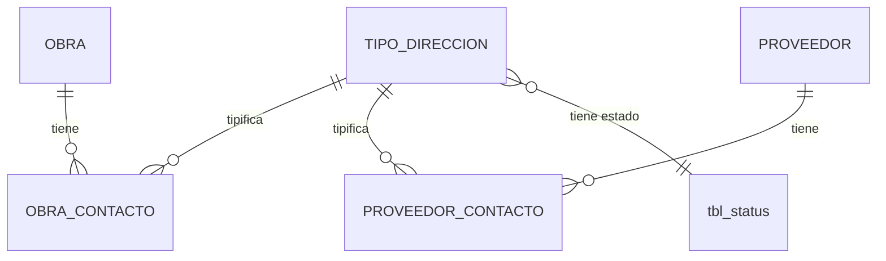

# ADR-0009: Tipo de dirección

## Estado

**Propuesto.**

El maestro de tipos de dirección **no existe** en el código ni en el esquema. Este ADR documenta la decisión arquitectónica recomendada.

## Fecha

2026-09-10 — versión inicial.

## Contexto

Tanto las obras como los proveedores registran información de contacto, y esa información incluye una dirección cuyo tipo la califica: principal, sucursal, correspondencia, facturación, bodega, entre otras.

El tipo de dirección es un maestro de dos atributos —nombre y estado— con una característica que lo distingue de los demás maestros de este sistema: **es compartido por dos entidades distintas**. Aparece en los contactos de obra y en los contactos de proveedor, con la misma semántica.

Esa característica plantea la pregunta arquitectónica de este ADR: si los contactos de obra y de proveedor son estructuras separadas que comparten un catálogo, o una sola estructura compartida.

## Problema

El alcance funcional describe la misma lista de campos de contacto para obra y para proveedor:

```text
Tipo de dirección · Dirección · Teléfono · Celular · Fax · Email · Observaciones
```

Modelar esa estructura dos veces produce duplicación de esquema, de validaciones y de interfaz. Modelarla una sola vez de forma genérica introduce una relación polimórfica sin integridad referencial. Ninguna de las dos opciones es gratuita.

Se requiere definir:

1. El punto de anclaje del catálogo y su cardinalidad.
2. Si existe un tipo con semántica especial, como "principal".
3. Si los contactos de obra y de proveedor comparten estructura.
4. El efecto del estado y la política de eliminación.

## Estado actual

**No se encontró evidencia de implementación.**

Hechos verificados:

- No existe tabla de tipos de dirección en `database/bdintervewebpack.sql`.
- No existe tabla de contactos, ni de obra ni de proveedor.
- No existe módulo en `server/src/modules/` ni vista en `client/src/views/`.
- No existen permisos asociados en `permissionsConfig.js`.

Lo que sí existe y es relevante:

**`tbl_providers` guarda dirección, teléfono y correo como columnas propias**, no como registros de contacto:

```text
prv_address   varchar(255)  COMMENT 'DIRECCIÓN'
prv_phone     varchar(20)   COMMENT 'TELÉFONO'
prv_email     varchar(255)  COMMENT 'EMAIL'
```

Es decir: el esquema actual modela **un solo contacto embebido en la fila del proveedor**, sin tipo de dirección, sin celular, sin fax y sin observaciones. No admite múltiples registros de contacto.

Esto es directamente contradictorio con el alcance funcional, que exige "uno o múltiples registros" de contacto. La estructura actual de `tbl_providers` es insuficiente para el requisito.

**`tbl_documents`** ofrece un precedente de relación polimórfica en el esquema:

```text
doc_type    enum('USERS','PROFILES','PAGINAS','PERMISOS')
doc_id_ref  int  COMMENT 'ID DE LA TABLA REFERENCIADA'
```

Un documento se asocia a una entidad mediante un discriminador y un identificador **sin clave foránea**. Es exactamente el patrón polimórfico que este ADR debe evaluar, y su implementación aquí muestra el coste: `doc_id_ref` no tiene integridad referencial, y el `enum` debe ampliarse con cada entidad nueva —hoy no incluye ni obras ni proveedores—.

## Decisión

1. **Tipo de dirección es un maestro con nombre y estado.** No contiene direcciones ni datos de contacto de nadie.

2. **El nombre es único entre los tipos no eliminados, garantizado por restricción de base de datos.**

3. **Los contactos de obra y los contactos de proveedor son estructuras separadas, con tablas propias, que comparten el catálogo de tipos de dirección.** No se adopta una tabla de contactos polimórfica.

4. **La cardinalidad es 1:N desde la entidad hacia sus contactos**: una obra tiene cero o más contactos; un proveedor tiene cero o más contactos.

5. **Un mismo tipo de dirección puede repetirse dentro de una entidad**, salvo que se designe como principal. Un proveedor puede tener dos bodegas.

6. **La designación de contacto principal es un atributo del contacto, no un tipo del catálogo.** "Principal" no es un tipo de dirección: es una marca sobre uno de los contactos.

7. **A lo sumo un contacto principal por entidad**, garantizado por restricción de base de datos y no solo por lógica aplicativa.

8. **La eliminación del tipo es lógica** mediante `sta_id = 3` y está **bloqueada si el tipo está en uso** por algún contacto.

9. **Desactivar un tipo impide seleccionarlo en contactos nuevos y no afecta a los existentes.**

10. **Auditoría técnica según [ADR-0013](0013-auditoria-trazabilidad.md); permisos según [ADR-0014](0014-autorizacion-permisos.md).**

## Justificación

- **Tablas separadas y no polimórficas**: el precedente de `tbl_documents` en este mismo esquema demuestra el coste del polimorfismo. `doc_id_ref` no tiene clave foránea, por lo que nada impide que apunte a un registro inexistente; y su `enum` discriminador debe modificarse —con `ALTER TABLE`— cada vez que se añade una entidad. Con tablas separadas, cada contacto tiene una clave foránea real, con `ON DELETE` bien definido, y el motor garantiza la integridad sin lógica adicional.
- **Duplicación aceptada deliberadamente**: dos tablas con columnas similares es un coste menor y visible. Una relación sin integridad referencial es un coste mayor e invisible, que se manifiesta como datos huérfanos meses después. La duplicación de estructura no implica duplicación de código: el componente de interfaz y las validaciones se comparten.
- **Principal como atributo y no como tipo**: si "principal" fuera un tipo del catálogo, se perdería la información de qué clase de dirección es la principal —¿es la sede administrativa, la bodega?— y habría que garantizar unicidad sobre un valor concreto del catálogo, que es administrable desde la interfaz y podría eliminarse. Como atributo booleano, la restricción es estructural y el tipo sigue describiendo la naturaleza de la dirección.
- **Unicidad del principal en la base de datos**: MySQL 8 admite índices únicos sobre columnas generadas, lo que permite expresar "a lo sumo uno con principal = verdadero por entidad". Delegarlo a la aplicación repetiría el patrón de verificación por `SELECT` previo que no resiste concurrencia, presente hoy en todo el backend.
- **Repetición de tipo permitida**: restringir a un contacto por tipo impediría casos legítimos y frecuentes —dos bodegas, dos sucursales— sin ganancia alguna.

## Alternativas consideradas

### Alternativa 1 — Contacto embebido en la entidad

Columnas de dirección, teléfono y correo en la propia fila de obra y de proveedor, como hace hoy `tbl_providers`.

- **A favor**: sin uniones; consulta directa; es lo que ya existe en el esquema.
- **En contra**: admite un solo contacto, lo que **contradice el requisito explícito** de "uno o múltiples registros". No admite tipo de dirección. Añadir un segundo contacto exigiría duplicar todas las columnas.
- **Descartada** por incompatibilidad con el requisito. Es, además, la estructura que `tbl_providers` debe abandonar.

### Alternativa 2 — Tabla de contactos polimórfica

Una sola tabla con discriminador de entidad e identificador de referencia, al estilo de `tbl_documents`.

- **A favor**: una sola estructura, una sola vista, un solo módulo; añadir una entidad nueva no requiere tabla nueva.
- **En contra**: sin integridad referencial —el precedente `tbl_documents.doc_id_ref` no tiene clave foránea—; el `enum` discriminador exige `ALTER TABLE` por cada entidad nueva; las consultas requieren filtrar siempre por el discriminador, y olvidarlo devuelve datos de otra entidad; el borrado en cascada debe implementarse a mano.
- **Descartada.** El precedente en este mismo esquema muestra los costes materializados.

### Alternativa 3 — Tablas separadas con catálogo compartido (seleccionada)

Contactos de obra y de proveedor en tablas propias, ambas con clave foránea al catálogo de tipos de dirección.

- **A favor**: integridad referencial real en ambas direcciones; borrado en cascada bien definido; consultas simples y sin riesgo de mezclar entidades; el catálogo compartido evita duplicar la clasificación; permite que cada entidad tenga campos propios sin contaminar a la otra.
- **En contra**: dos tablas con estructura parecida; un cambio en los campos de contacto se aplica en dos lugares.
- **Seleccionada.**

## Modelo arquitectónico

Modelo propuesto. **Ninguna de estas tablas existe hoy**, salvo `tbl_providers` con su contacto embebido.



```text
TIPO_DIRECCION  —  catálogo compartido
  ├── identificador
  ├── nombre       (único entre no eliminados)
  ├── sta_id       → tbl_status
  └── auditoría estándar

        NO CONTIENE:
        ✗ ninguna dirección concreta
        ✗ ningún dato de contacto

OBRA_CONTACTO / PROVEEDOR_CONTACTO  —  estructura equivalente, tablas separadas
  ├── entidad (obra o proveedor)   FK ON DELETE CASCADE
  ├── tipo de dirección            FK ON DELETE RESTRICT
  ├── dirección
  ├── teléfono
  ├── celular
  ├── fax
  ├── email
  ├── observaciones
  ├── principal   (booleano, a lo sumo uno por entidad)
  └── auditoría estándar
```

Diferencia de política de borrado, deliberada:

```text
entidad → contacto        ON DELETE CASCADE
     el contacto no tiene sentido sin su entidad

tipo de dirección → contacto   ON DELETE RESTRICT
     el catálogo no puede eliminarse mientras esté en uso
```

## Reglas de negocio

**No se encontró evidencia en la implementación actual.** Reglas propuestas:

1. Un tipo de dirección tiene nombre y estado.
2. El nombre es único entre los tipos no eliminados.
3. Una obra puede tener cero o más contactos; un proveedor también.
4. Todo contacto declara su tipo de dirección.
5. Un mismo tipo puede repetirse dentro de una entidad.
6. A lo sumo un contacto por entidad está marcado como principal.
7. Solo los tipos activos pueden seleccionarse en contactos nuevos.
8. Un tipo en uso no puede eliminarse.
9. Desactivar un tipo no afecta los contactos existentes.
10. Eliminar una entidad elimina sus contactos.

**Pendiente de validación:** si el contacto principal es obligatorio cuando existe al menos un contacto, y qué campos de contacto son obligatorios.

## Seguridad

Los datos de contacto son información personal o comercial identificable.

- Las operaciones sobre el maestro exigen sesión y permiso verificados en backend.
- La consulta de contactos requiere el permiso de consulta de la entidad propietaria: quien no puede ver una obra no debe ver sus contactos.
- Consultas parametrizadas. Advertencia preventiva: el módulo `template`, patrón de referencia del proyecto, interpola filtros del cliente en la cadena SQL.
- Los correos electrónicos registrados como contacto pueden ser destino de envíos automatizados; el sistema ya integra `nodemailer` y Microsoft Graph. Un correo inválido o malicioso en un contacto no debe poder alterar el flujo de envío.

## Autorización

Acciones propuestas:

```text
CONSULTAR TIPOS DE DIRECCIÓN
CREAR TIPO DE DIRECCIÓN
EDITAR TIPO DE DIRECCIÓN
ELIMINAR TIPO DE DIRECCIÓN
CAMBIAR ESTADO TIPO DE DIRECCIÓN
```

Los contactos no tienen permisos propios: se gestionan bajo los permisos de su entidad propietaria —editar una obra incluye gestionar sus contactos—.

**Ninguna existe hoy.** Ver [ADR-0014](0014-autorizacion-permisos.md).

## Auditoría

**Nivel requerido: auditoría técnica**, tanto para el maestro como para los contactos.

Los datos de contacto son información operativa, no contractual. Un cambio de teléfono no tiene consecuencia jurídica y no justifica bitácora de valores anteriores.

Las cuatro columnas estándar de [ADR-0013](0013-auditoria-trazabilidad.md) aplican a las tablas de contacto.

## Validaciones

| Validación | Frontend | Backend | Base de datos | Clasificación |
| --- | --- | --- | --- | --- |
| Nombre del tipo obligatorio | Propuesta | Propuesta | `NOT NULL` | UX + Integridad |
| Nombre del tipo único | Propuesta | Propuesta | **`UNIQUE` — obligatorio** | Integridad |
| Tipo obligatorio en el contacto | Propuesta | Propuesta | `NOT NULL` + FK | Integridad |
| Formato de correo | Propuesta | **Propuesta — obligatoria** | No expresable | UX + Regla de negocio |
| Formato de teléfono y celular | Propuesta | Propuesta | No expresable | UX |
| A lo sumo un principal por entidad | Propuesta | Propuesta | **`UNIQUE` sobre columna generada** | Integridad |
| Tipo activo al asignarlo | Propuesta (selector) | Propuesta | No expresable | Regla de negocio |
| Sin uso antes de eliminar el tipo | Propuesta (aviso) | **Propuesta — obligatoria** | No expresable | Regla de negocio |
| Permiso de la acción | Propuesta | **Propuesta — obligatoria** | No aplica | Seguridad |

La validación de correo merece énfasis: el sistema actual **no valida formato de correo en ningún punto del backend**, ni en registro de usuarios ni en recuperación de contraseña. `express-validator` figura como dependencia y no se usa en ninguna parte. Los contactos alimentarían envíos de correo, por lo que la validación en servidor es necesaria.

## Integridad de datos

Requisitos propuestos:

- `UNIQUE` sobre el nombre del tipo, entre los no eliminados.
- FK del tipo a `tbl_status`, `ON DELETE RESTRICT`.
- FK del contacto al tipo, `ON DELETE RESTRICT`.
- FK del contacto a su entidad, `ON DELETE CASCADE`.
- Índice único sobre columna generada para el contacto principal por entidad.
- Índice sobre la entidad en cada tabla de contactos.
- `utf8mb4` con colación consistente.

Observación sobre el patrón actual del esquema: **las siete claves foráneas existentes usan `ON DELETE RESTRICT`**, sin excepción. La decisión de usar `CASCADE` para la relación entidad-contacto es una desviación deliberada de esa uniformidad, justificada porque un contacto es una parte dependiente y no una entidad autónoma. Debe documentarse como excepción consciente y no como descuido.

## Transacciones

El maestro es de tabla única.

Los contactos se guardan típicamente junto con su entidad, en la misma operación. Esa operación debe ser atómica:

```text
BEGIN
  guardar obra
  guardar contactos (crear, modificar, eliminar)
COMMIT
```

Si la escritura de un contacto falla, la obra no debe quedar guardada a medias. El escenario a evitar es el descrito en [ADR-0011](0011-obras.md): obra creada, etapas creadas, contactos no ejecutados.

El patrón de diferencial de `permissions.service.updateProfilePermissions` —calcular altas, bajas y modificaciones y aplicarlas en una transacción— es directamente aplicable a la gestión de contactos de una entidad.

## Consecuencias

### Positivas

- Catálogo único compartido por obras y proveedores: una sola clasificación, un solo mantenimiento.
- Integridad referencial real, a diferencia del precedente polimórfico de `tbl_documents`.
- Múltiples contactos por entidad, cumpliendo el requisito que la estructura actual de `tbl_providers` no satisface.
- El contacto principal es una restricción del motor y no una convención aplicativa.
- El borrado en cascada evita contactos huérfanos sin lógica adicional.

### Negativas

- Dos tablas de contacto con estructura equivalente.
- Un cambio en los campos de contacto se aplica en dos lugares.
- Requiere migrar los datos de contacto embebidos de `tbl_providers` a la nueva estructura.
- Introduce una excepción al patrón `RESTRICT` uniforme del esquema.

## Riesgos

| Riesgo | Severidad | Descripción |
| --- | --- | --- |
| Contacto embebido insuficiente | **Alta** | `tbl_providers` admite un solo contacto sin tipo; contradice el requisito |
| Modelo polimórfico sin integridad | **Alta** | Si se replica el patrón de `tbl_documents.doc_id_ref` |
| Múltiples contactos principales | **Media** | Si la unicidad se delega a la aplicación |
| Correos no validados | **Media** | El backend no valida formato de correo en ningún punto hoy |
| Contactos huérfanos | **Media** | Si el borrado en cascada no se declara |
| Pérdida de datos en la migración | **Media** | Al trasladar los contactos embebidos de `tbl_providers` |
| Inyección SQL heredada del patrón `template` | **Alta** | Preventiva |
| Divergencia entre las dos tablas de contacto | **Baja** | Si evolucionan por separado sin coordinación |

## Impacto técnico

### Frontend

- Vista de listado y diálogo del maestro, con los componentes existentes.
- Un componente de gestión de contactos reutilizable entre el formulario de obra y el de proveedor: tabla editable con alta, modificación y baja en memoria, persistida junto con la entidad.
- `GenericFormSection.jsx` soporta los tipos de campo necesarios (`text`, `dropdown`, `textarea`, `checkbox`).
- Selector de tipos de dirección activos.
- Marca visual del contacto principal.

### Backend

- Módulo del maestro con `routes` / `controller` / `service`.
- La gestión de contactos vive en los servicios de obra y de proveedor, no en un módulo propio: son partes dependientes.
- Validación de formato de correo, hoy inexistente en el backend.
- Verificación de uso en el servicio de eliminación del tipo.

### Base de datos

- Tres tablas nuevas: el maestro y las dos de contactos.
- Migración de los datos embebidos de `tbl_providers` (`prv_address`, `prv_phone`, `prv_email`).
- Requiere columnas generadas e índices únicos sobre ellas, soportados por MySQL 8 y no usados hoy.
- Sin migraciones versionadas en el proyecto.

### Infraestructura

No aplica directamente. Los correos de contacto alimentarían el servicio de correo existente (`common/services/mailerService.js`).

## Estado actual vs arquitectura objetivo

| Aspecto | Estado actual | Arquitectura objetivo |
| --- | --- | --- |
| Maestro de tipos | No existe | Catálogo compartido con nombre, estado y auditoría |
| Contacto de proveedor | Embebido, único, sin tipo | Tabla propia, múltiple, tipificado |
| Contacto de obra | No existe | Tabla propia, múltiple, tipificado |
| Modelo de relación | Polimórfico sin FK en `tbl_documents` | Tablas separadas con FK real |
| Contacto principal | No existe | Atributo con unicidad garantizada por el motor |
| Validación de correo | Ninguna en backend | Frontend y backend |
| Borrado de contactos | No aplica | `CASCADE` desde la entidad |
| Permisos | No existen | Cinco acciones para el maestro; contactos bajo la entidad |

## Brechas identificadas

| # | Brecha | Severidad |
| --- | --- | --- |
| B1 | El maestro no existe en ninguna capa | **Alta** |
| B2 | No existen las tablas de contacto | **Alta** |
| B3 | `tbl_providers` embebe un contacto único sin tipo | **Alta** — contradice el requisito |
| B4 | No existe la entidad obra | **Alta** — bloquea la relación |
| B5 | Precedente polimórfico sin integridad (`tbl_documents`) | **Media** — a no replicar |
| B6 | Sin validación de formato de correo en backend | **Media** |
| B7 | Sin permisos definidos | **Media** |
| B8 | Sin restricciones `UNIQUE` en todo el esquema | **Media** |
| B9 | Sin migraciones versionadas | **Media** |
| B10 | Patrón de maestro (`template`) con inyección SQL | **Alta** — preventiva |

## Plan de implementación

Recomendación derivada del análisis. **No fue ejecutada.**

**Fase 1 — Maestro autónomo (B1, B8)**
Tabla, módulo backend parametrizado y vista, con `UNIQUE` desde el inicio.

**Fase 2 — Permisos (B7)**
Definir y aplicar las cinco acciones en backend.

**Fase 3 — Contactos de proveedor (B2, B3)**
Crear la tabla, migrar los datos embebidos de `tbl_providers`, y retirar las columnas embebidas una vez verificada la migración. Coordinar con [ADR-0012](0012-proveedores.md).

**Fase 4 — Contactos de obra (B4)**
Al implementarse [ADR-0011](0011-obras.md), con el mismo componente de interfaz.

**Fase 5 — Validación (B6)**
Validación de formato de correo en backend, aplicable también a los flujos de autenticación.

## ADR relacionados

- [ADR-0011 — Obras](0011-obras.md) — contactos de obra
- [ADR-0012 — Proveedores](0012-proveedores.md) — contactos de proveedor y migración de los datos embebidos
- [ADR-0008 — Tipo de identificación](0008-tipos-identificacion.md) — otro maestro del proveedor
- [ADR-0013 — Auditoría y trazabilidad](0013-auditoria-trazabilidad.md)
- [ADR-0014 — Autorización basada en permisos](0014-autorizacion-permisos.md)

## Referencias

- `database/bdintervewebpack.sql` — `tbl_providers` (`prv_address`, `prv_phone`, `prv_email`), `tbl_documents` (`doc_type`, `doc_id_ref`)
- `server/src/modules/security/permissions/permissions.service.js` — patrón de diferencial transaccional
- `server/src/common/services/mailerService.js`
- `client/src/ui-component/extended/GenericFormSection.jsx`
- `server/package.json` — `express-validator` sin uso
