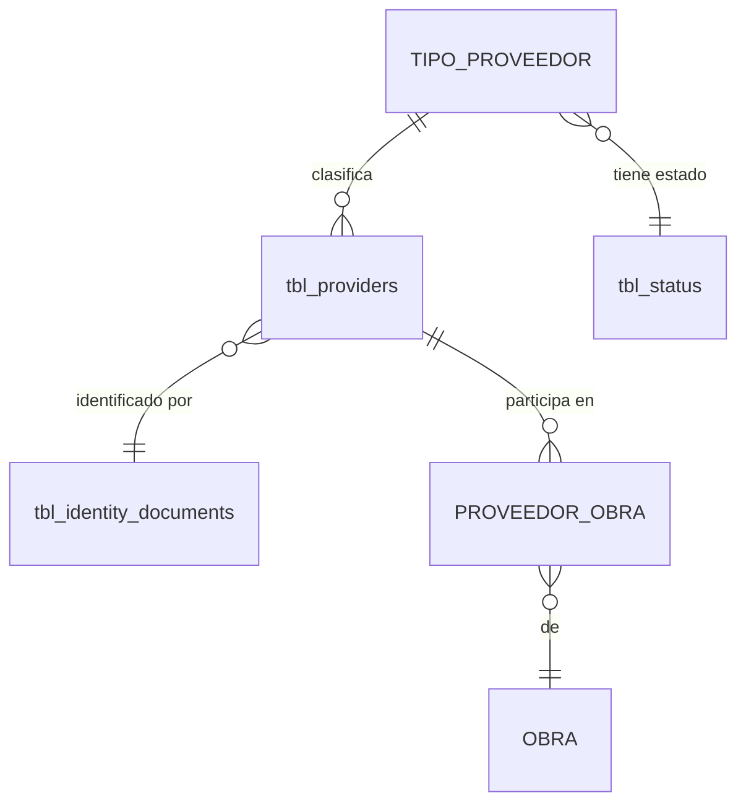

# ADR-0010: Tipo de proveedor

## Estado

**Propuesto.**

El maestro de tipos de proveedor **no existe** en el código ni en el esquema. Este ADR documenta la decisión arquitectónica recomendada.

## Fecha

2026-09-10 — versión inicial.

## Contexto

El alcance funcional define tres tipos de proveedor:

```text
Simple
Subcontratista
Contrato mayor
```

A diferencia de los demás maestros de configuración, estos tres valores **no son solo etiquetas**: sus nombres sugieren diferencias de comportamiento contractual. "Contrato mayor" apunta a un umbral de valor o a un régimen contractual distinto; "subcontratista" apunta a una relación de dependencia con otro contratista.

La pregunta que este ADR debe resolver antes que ninguna otra es qué representan realmente:

| Interpretación | Implicación en el modelo |
| --- | --- |
| **Clasificación** | Etiqueta descriptiva; sirve para filtrar y agrupar; sin efecto funcional |
| **Comportamiento** | Determina qué reglas, validaciones o campos aplican al proveedor |
| **Jerarquía** | Un subcontratista depende de otro proveedor; existe una relación padre-hijo |
| **Tipo contractual** | Pertenece al contrato, no al proveedor; la misma empresa puede ser simple en un contrato y contratista mayor en otro |

La respuesta cambia por completo dónde vive el dato.

## Problema

Si el tipo es una clasificación, es un maestro trivial. Si es comportamiento, debe existir un mecanismo que aplique reglas distintas. Si es jerarquía, falta una relación entre proveedores. Si es tipo contractual, **el atributo está en la entidad equivocada**.

El riesgo concreto de decidir mal: si "contrato mayor" describe cómo participa un proveedor en un contrato específico, guardarlo como atributo del proveedor obliga a que esa empresa sea "contrato mayor" en todos sus contratos, incluidos aquellos donde solo suministra materiales.

## Estado actual

**No se encontró evidencia de implementación.**

Hechos verificados:

- No existe tabla de tipos de proveedor en `database/bdintervewebpack.sql`.
- No existe módulo en `server/src/modules/` ni vista en `client/src/views/`.
- No existen permisos asociados en `permissionsConfig.js`.
- **`tbl_providers` no tiene ninguna columna de tipo de proveedor.** Sus columnas son: `prv_id`, `prv_name`, `idd_id`, `prv_identification`, `prv_address`, `prv_phone`, `prv_email`, `dot_id`, `are_id`, `cos_id`, `sta_id` y las de auditoría.
- **`tbl_providers` no se referencia en ninguna línea del código.** Es una tabla huérfana. Ver [ADR-0012](0012-proveedores.md).

Hallazgo relevante sobre esa tabla: tres de sus columnas son referencias a entidades que **no existen en el esquema** y que ningún código consume:

```text
dot_id  int NULL  COMMENT 'ID DEL TIPO DE DOCUMENTO'
are_id  int NULL  COMMENT 'ID DE LA AREA'
cos_id  int NULL  COMMENT 'ID DEL CENTRO DE COSTOS'
```

Ninguna tiene clave foránea declarada. `dot_id` es además redundante con `idd_id`, que sí tiene clave foránea y el mismo comentario semántico ("TIPO DE DOCUMENTO"). Son restos de un esquema de origen distinto, arrastrados sin depurar.

**Ninguna de esas tres columnas corresponde al tipo de proveedor.** El atributo, sencillamente, no existe en la tabla.

Respecto a la pregunta de qué reglas diferencian cada tipo funcionalmente: **no se encontró evidencia en la implementación actual.** No hay código que trate distinto a un subcontratista, ni validaciones diferenciadas, ni campos condicionales. Los tres tipos existen únicamente en el enunciado funcional.

## Decisión

1. **El tipo de proveedor es una clasificación del proveedor, no un comportamiento ni una jerarquía.** Es un maestro con nombre y estado, referenciado por el proveedor.

   Esta decisión se toma con una calificación explícita: **es la interpretación mínima defendible con la evidencia disponible.** No existe código, esquema ni especificación que atribuya comportamiento diferenciado a los tres tipos. Adoptar el modelo más simple que satisface lo conocido evita construir maquinaria para reglas que nadie ha definido.

2. **Estado: Pendiente de validación.** Antes de implementar debe confirmarse con el área usuaria:

   - ¿Un subcontratista se registra bajo otro proveedor? Si la respuesta es sí, hace falta una relación jerárquica entre proveedores y esta decisión debe revisarse.
   - ¿"Contrato mayor" describe al proveedor o a su participación en un contrato concreto? Si es lo segundo, el atributo pertenece a la relación proveedor-obra o al contrato, no al proveedor.
   - ¿Cambian las validaciones, los campos obligatorios o los documentos exigidos según el tipo?

3. **Si el tipo resulta ser comportamiento**, no se implementa con condicionales dispersos: se modela con el mecanismo de configuración de campos de [ADR-0006](0006-tipos-contrato.md), que ya resuelve ese problema para tipos de contrato.

4. **Si el tipo resulta ser jerarquía**, se añade una relación autorreferencial de proveedor a proveedor, y el tipo pasa a ser una consecuencia de esa relación en lugar de un atributo independiente.

5. **Si el tipo resulta ser tipo contractual**, el atributo se traslada a la relación proveedor-obra o al contrato, y el proveedor conserva solo su identidad. Esta posibilidad es la que exige mayor atención: es la que produce el error más costoso de corregir después.

6. **El nombre es único entre los tipos no eliminados, garantizado por restricción de base de datos.**

7. **El tipo de proveedor no participa en la identidad del proveedor.** La unicidad se determina por tipo y número de documento, según [ADR-0008](0008-tipos-identificacion.md) y [ADR-0012](0012-proveedores.md). Dos proveedores con el mismo documento y distinto tipo siguen siendo el mismo proveedor duplicado.

8. **La eliminación es lógica** mediante `sta_id = 3` y está **bloqueada si el tipo está en uso**.

9. **Desactivar un tipo impide seleccionarlo en proveedores nuevos y no afecta a los existentes.**

10. **Auditoría técnica según [ADR-0013](0013-auditoria-trazabilidad.md); permisos según [ADR-0014](0014-autorizacion-permisos.md).**

## Justificación

- **Interpretación mínima defendible**: el prompt de origen pide determinar qué representan los tipos "según el código existente". El código no los representa en absoluto. Ante esa ausencia, inventar un modelo de comportamiento o de jerarquía sería fabricar arquitectura sobre una suposición. La clasificación es el modelo que cubre lo conocido y es el más barato de ampliar si aparece más información.
- **Marcar la decisión como pendiente**: es preferible un ADR que declare honestamente una incertidumbre a uno que la oculte con una decisión aparentemente firme. Las tres preguntas de la decisión 2 son las que determinan el modelo, y no pueden responderse desde el repositorio.
- **Advertencia sobre el tipo contractual**: es el escenario que más caro sale corregir. Si "contrato mayor" pertenece al contrato y se guarda en el proveedor, el error solo se descubre cuando una empresa participe con dos roles distintos — momento en el que ya habrá datos que migrar y reportes construidos sobre el atributo equivocado.
- **Reutilizar el mecanismo de ADR-0006 si hay comportamiento**: si los tipos determinan qué campos aplican a un proveedor, es exactamente el mismo problema que la configuración de tipos de contrato. Resolverlo dos veces de formas distintas produciría dos mecanismos divergentes para el mismo requisito.
- **El tipo fuera de la identidad**: si la unicidad incluyera el tipo, la misma empresa podría registrarse tres veces —una por tipo— con el mismo NIT. Sería precisamente la duplicación que [ADR-0012](0012-proveedores.md) debe impedir.

## Alternativas consideradas

### Alternativa 1 — Tipos fijos en el código

Tres constantes, dado que la lista es cerrada por definición funcional.

- **A favor**: sin tabla ni CRUD; si el tipo determina comportamiento, es más natural tener el comportamiento junto a la definición; imposible crear un tipo sin la lógica que lo acompaña.
- **En contra**: ampliar la lista exige despliegue; rompe la uniformidad con los demás maestros; impide administrar el catálogo desde la interfaz.
- **Descartada**, con una salvedad: si la validación posterior determina que los tipos gobiernan comportamiento, esta alternativa **recupera peso**, porque un tipo creado desde la interfaz sin lógica asociada sería un tipo inerte y confuso.

### Alternativa 2 — Tipo en la relación proveedor-obra

El tipo describe cómo participa el proveedor en una obra concreta, no qué es el proveedor.

- **A favor**: permite que la misma empresa sea proveedor simple en una obra y contratista mayor en otra, que es un caso plausible y frecuente en el sector; separa correctamente la identidad de la participación; alinea con la separación que [ADR-0012](0012-proveedores.md) establece entre el proveedor y su asignación a obras.
- **En contra**: complica el filtrado global "proveedores de tipo X" —habría que agregar sobre sus participaciones—; si el tipo es realmente un atributo estable de la empresa, distribuirlo por relación duplica el dato.
- **No descartada.** Es la alternativa que debe evaluarse primero en la validación con el área usuaria. Si el caso de la empresa con dos roles existe, esta es la opción correcta.

### Alternativa 3 — Jerarquía de proveedores

Relación autorreferencial: un subcontratista se registra bajo su contratista.

- **A favor**: modela la realidad de la subcontratación de forma explícita; permite consultar la cadena de subcontratación de un contrato, que es información de control relevante para la interventoría.
- **En contra**: introduce complejidad —ciclos, profundidad, integridad de la cadena— sin requisito que la respalde en el alcance funcional descrito. El tipo pasaría a ser derivado y no configurable.
- **Descartada** por ausencia de requisito explícito. Reconsiderar si la validación confirma que el subcontratista depende de un proveedor concreto.

### Alternativa 4 — Maestro simple de clasificación (seleccionada, con reservas)

- **A favor**: consistente con los demás maestros; administrable; suficiente para filtrar, agrupar y reportar; el modelo más barato de ampliar.
- **En contra**: no cubre comportamiento, jerarquía ni tipo contractual, si alguno resulta ser el caso real.
- **Seleccionada provisionalmente**, condicionada a la validación de la decisión 2.

## Modelo arquitectónico

Modelo propuesto. **Ninguna de estas estructuras existe hoy**, y `tbl_providers` no tiene columna de tipo.



```text
TIPO_PROVEEDOR
  ├── identificador
  ├── nombre     ("Simple", "Subcontratista", "Contrato mayor")
  ├── sta_id     → tbl_status
  └── auditoría estándar

PROVEEDOR
  └── tipo_proveedor_id   FK ON DELETE RESTRICT   ← si el tipo describe a la empresa
```

Modelo alternativo, si la validación determina que el tipo describe la participación:

```text
PROVEEDOR_OBRA
  ├── proveedor
  ├── obra
  └── tipo_proveedor_id   FK   ← el tipo vive en la relación, no en el proveedor
```

Ambos modelos son excluyentes. La decisión entre ellos **no puede tomarse desde el repositorio**.

Sobre las columnas residuales de `tbl_providers`:

```text
dot_id  → sin FK, sin tabla, redundante con idd_id   ✗ depurar
are_id  → sin FK, sin tabla                          ✗ depurar
cos_id  → sin FK, sin tabla                          ✗ depurar
```

Estas tres columnas deben resolverse —eliminarse o dotarse de su tabla y su restricción— antes de añadir el tipo de proveedor, para no seguir acumulando referencias sin destino.

## Reglas de negocio

**No se encontró evidencia en la implementación actual.** Reglas propuestas para el modelo de clasificación:

1. Un tipo de proveedor tiene nombre y estado.
2. El nombre es único entre los tipos no eliminados.
3. Todo proveedor declara su tipo.
4. El tipo no participa en la identidad del proveedor.
5. Solo los tipos activos pueden seleccionarse en proveedores nuevos.
6. Un tipo en uso no puede eliminarse.
7. Desactivar un tipo no afecta los proveedores existentes.
8. Cambiar el tipo de un proveedor existente se audita funcionalmente.

**Pendiente de validación** — las reglas que el enunciado funcional insinúa y el código no confirma:

- Qué diferencia funcional tiene un subcontratista frente a un proveedor simple.
- Si "contrato mayor" implica un umbral de valor, y cuál.
- Si un subcontratista debe estar asociado a un contratista.
- Si el tipo condiciona los documentos exigidos, las pólizas requeridas o los campos obligatorios.
- Si un proveedor puede tener más de un tipo.

## Seguridad

Riesgo bajo por contenido; relevante si el tipo llegara a gobernar reglas.

- Las operaciones sobre el maestro exigen sesión y permiso verificados en backend.
- **Si el tipo determina qué validaciones aplican, cambiarlo se convierte en una acción con impacto en el control interno** y debe tener permiso propio y auditoría funcional. Es una razón adicional para resolver la pregunta de la decisión 2 antes de implementar.
- Consultas parametrizadas. Advertencia preventiva: el módulo `template`, patrón de referencia del proyecto, interpola filtros del cliente en la cadena SQL.

## Autorización

Acciones propuestas:

```text
CONSULTAR TIPOS DE PROVEEDOR
CREAR TIPO DE PROVEEDOR
EDITAR TIPO DE PROVEEDOR
ELIMINAR TIPO DE PROVEEDOR
CAMBIAR ESTADO TIPO DE PROVEEDOR
```

**Ninguna existe hoy.** Ver [ADR-0014](0014-autorizacion-permisos.md).

## Auditoría

**Nivel requerido: auditoría técnica** para el maestro.

**Auditoría funcional** para el cambio de tipo de un proveedor existente: si el tipo condiciona reglas, el cambio altera qué se le exige, y debe quedar registro del valor anterior.

Ver [ADR-0013](0013-auditoria-trazabilidad.md).

## Validaciones

| Validación | Frontend | Backend | Base de datos | Clasificación |
| --- | --- | --- | --- | --- |
| Nombre obligatorio | Propuesta | Propuesta | `NOT NULL` | UX + Integridad |
| Nombre único | Propuesta | Propuesta | **`UNIQUE` — obligatorio** | Integridad |
| Tipo obligatorio en el proveedor | Propuesta | Propuesta | `NOT NULL` + FK | Integridad |
| Tipo activo al asignarlo | Propuesta (selector) | Propuesta | No expresable | Regla de negocio |
| Sin uso antes de eliminar | Propuesta (aviso) | **Propuesta — obligatoria** | No expresable | Regla de negocio |
| Reglas específicas por tipo | **Pendiente de validación** | **Pendiente de validación** | No expresable | Regla de negocio |
| Permiso de la acción | Propuesta | **Propuesta — obligatoria** | No aplica | Seguridad |

## Integridad de datos

Requisitos propuestos:

- `UNIQUE` sobre el nombre, entre los no eliminados.
- FK a `tbl_status`, `ON DELETE RESTRICT`.
- FK desde proveedor al tipo, `ON DELETE RESTRICT`.
- Índice sobre el tipo en `tbl_providers`, para filtrado y verificación de uso.
- Depuración previa de `dot_id`, `are_id` y `cos_id`.
- `utf8mb4` consistente; `tbl_providers` ya es `utf8mb4_0900_ai_ci`.

## Transacciones

Operaciones de tabla única para el maestro; transacción por atomicidad entre verificación y escritura.

Si el tipo llegara a determinar campos obligatorios, la validación de esos campos debe ejecutarse dentro de la misma transacción que guarda el proveedor, de modo que un proveedor no pueda persistirse incumpliendo las reglas de su tipo.

## Consecuencias

### Positivas

- Clasificación administrable, útil para filtrar, agrupar y reportar proveedores.
- Consistente con los demás maestros: un solo modelo mental.
- El modelo más simple que cubre lo conocido, y el más barato de ampliar.
- No contamina la identidad del proveedor.

### Negativas

- **Puede ser el modelo equivocado.** Si el tipo describe la participación en un contrato, el atributo está en la entidad equivocada y corregirlo después implica migración de datos y de reportes.
- No cubre jerarquía de subcontratación, si resulta ser un requisito.
- No cubre comportamiento diferenciado, si resulta ser un requisito.
- Un tipo creado desde la interfaz sin lógica asociada sería inerte, si el modelo real fuera de comportamiento.

## Riesgos

| Riesgo | Severidad | Descripción |
| --- | --- | --- |
| Atributo en la entidad equivocada | **Alta** | Si "contrato mayor" describe la participación y se guarda en el proveedor |
| Reglas por tipo sin implementar | **Media** | Si el negocio espera comportamiento diferenciado y solo hay una etiqueta |
| Jerarquía de subcontratación ausente | **Media** | Si el subcontratista debe colgar de un contratista |
| Tipo en la clave de unicidad | **Alta** | Si se incluyera, permitiría la misma empresa registrada una vez por tipo |
| Columnas residuales sin depurar | **Media** | `dot_id`, `are_id`, `cos_id` sin tabla ni FK, arrastradas de otro esquema |
| Duplicados por concurrencia | **Media** | Sin `UNIQUE`, el `SELECT` previo no resiste peticiones simultáneas |
| Inyección SQL heredada del patrón `template` | **Alta** | Preventiva |

## Impacto técnico

### Frontend

- Vista de listado y diálogo, con los componentes existentes.
- Entrada de menú, ruta y archivo de API.
- El formulario de proveedor requiere un selector de tipos activos.
- Si el tipo condicionara campos, el formulario debería alimentarse con descriptores del backend, usando `GenericFormSection.jsx` según [ADR-0006](0006-tipos-contrato.md).

### Backend

- Módulo con `routes` / `controller` / `service`.
- Endpoint de selector restringido a activos.
- Verificación de uso en el servicio de eliminación.

### Base de datos

- Tabla nueva, inexistente hoy.
- Columna de tipo en `tbl_providers`, inexistente hoy.
- Depuración de `dot_id`, `are_id`, `cos_id`.
- Sin migraciones versionadas en el proyecto.

### Infraestructura

No aplica.

## Estado actual vs arquitectura objetivo

| Aspecto | Estado actual | Arquitectura objetivo |
| --- | --- | --- |
| Tabla del maestro | No existe | Catálogo con nombre, estado y auditoría |
| Columna de tipo en el proveedor | **No existe** | FK obligatoria al maestro |
| Naturaleza del tipo | Indeterminada; sin evidencia en el código | Clasificación — pendiente de confirmación |
| Reglas por tipo | Ninguna | Pendiente de definición |
| Columnas residuales | `dot_id`, `are_id`, `cos_id` sin tabla ni FK | Depuradas o dotadas de destino |
| Unicidad del proveedor | Sin restricción | Por (tipo de documento, número); el tipo de proveedor no participa |
| Permisos | No existen | Cinco acciones propias |

## Brechas identificadas

| # | Brecha | Severidad |
| --- | --- | --- |
| B1 | Naturaleza del tipo sin determinar: clasificación, comportamiento, jerarquía o tipo contractual | **Alta** — decisión de negocio pendiente y bloqueante |
| B2 | El maestro no existe en ninguna capa | **Alta** |
| B3 | `tbl_providers` no tiene columna de tipo de proveedor | **Alta** |
| B4 | Sin reglas funcionales diferenciadas por tipo | **Media** |
| B5 | `dot_id`, `are_id`, `cos_id` sin tabla ni FK, redundante `dot_id` con `idd_id` | **Media** |
| B6 | Sin permisos definidos | **Media** |
| B7 | Sin restricciones `UNIQUE` en todo el esquema | **Media** |
| B8 | Patrón de maestro (`template`) con inyección SQL | **Alta** — preventiva |
| B9 | Sin migraciones versionadas | **Media** |

## Plan de implementación

Recomendación derivada del análisis. **No fue ejecutada.**

**Fase 0 — Decisión de negocio (B1, B4)**
Bloqueante. Responder con el área usuaria las tres preguntas de la decisión 2. Sin ellas, cualquier implementación es una apuesta sobre dónde vive el atributo.

**Fase 1 — Depuración (B5)**
Resolver `dot_id`, `are_id` y `cos_id` antes de añadir columnas nuevas a `tbl_providers`.

**Fase 2 — Maestro autónomo (B2, B7)**
Tabla, módulo backend parametrizado y vista, con `UNIQUE` desde el inicio.

**Fase 3 — Relación (B3)**
Añadir la referencia al tipo, en `tbl_providers` o en la relación proveedor-obra, según lo resuelto en la Fase 0.

**Fase 4 — Permisos (B6)**
Definir y aplicar las cinco acciones en backend.

**Fase 5 — Comportamiento, si aplica**
Si la validación confirma reglas por tipo, modelarlas con el mecanismo de configuración de [ADR-0006](0006-tipos-contrato.md), no con condicionales dispersos.

## ADR relacionados

- [ADR-0012 — Proveedores](0012-proveedores.md) — entidad clasificada; separación entre proveedor y relación proveedor-obra
- [ADR-0008 — Tipo de identificación](0008-tipos-identificacion.md) — identidad del proveedor
- [ADR-0006 — Tipos de contrato](0006-tipos-contrato.md) — mecanismo a reutilizar si el tipo gobierna campos
- [ADR-0011 — Obras](0011-obras.md) — contexto de la participación del proveedor
- [ADR-0013 — Auditoría y trazabilidad](0013-auditoria-trazabilidad.md)
- [ADR-0014 — Autorización basada en permisos](0014-autorizacion-permisos.md)

## Referencias

- `database/bdintervewebpack.sql` — `tbl_providers` (`dot_id`, `are_id`, `cos_id`, `idd_id`), sin columna de tipo de proveedor
- `server/src/modules/template/` — patrón CRUD, con las salvedades indicadas
- `client/src/ui-component/extended/GenericFormSection.jsx`
