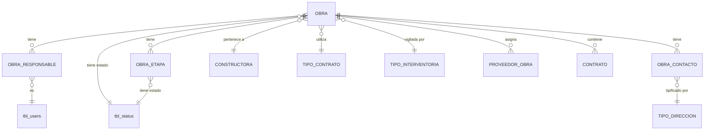

# ADR-0011: Obras y sus agregados

## Estado

**Propuesto.**

El módulo de obras **no existe** en el código ni en el esquema. Este ADR documenta la decisión arquitectónica recomendada.

## Fecha

2026-09-10 — versión inicial.

## Contexto

La obra es la entidad central del sistema. Todo lo demás cuelga de ella: contratos, proveedores asignados, pólizas, órdenes de servicio, facturas y documentos. Es el nodo raíz del expediente.

Una obra tiene atributos propios de cabecera:

```text
Código · Nombre · Constructora · Tipo de contrato · Área total
Costo directo · Plazo inicial · Plazo ampliado
Valor inicial · Valor ampliado · Valor máximo de orden de servicio
```

Y tres colecciones dependientes:

| Colección | Cardinalidad | Naturaleza |
| --- | --- | --- |
| **Responsables** | 1..N | Referencia a usuarios existentes o alta de nuevos |
| **Etapas** | 0..N | Fases de ejecución, con nombre y estado |
| **Contactos** | 0..N | Datos de contacto tipificados |

La obra y sus tres colecciones se crean y modifican como una unidad desde un mismo formulario. Esa unidad es el problema arquitectónico central: **cuatro tablas escritas en una sola operación de usuario**.

## Problema

Guardar una obra implica escribir en la tabla de obras y en las tres tablas dependientes. Si una de esas escrituras falla, el resultado sin transacción es un expediente incompleto:

```text
Obra        → OK
Responsable → OK
Etapa       → ERROR
Contacto    → NO EJECUTADO
```

Queda una obra sin etapas ni contactos, indistinguible de una obra que legítimamente no los tiene. El usuario ve un mensaje de error, reintenta, y crea una segunda obra — ahora hay dos, una incompleta.

Se requiere definir además:

1. Si los responsables son usuarios del sistema o personas registradas aparte.
2. Cómo se resuelve el alta de un responsable nuevo dentro del formulario de obra.
3. Si las etapas tienen orden, historial o transiciones.
4. Qué garantiza la unicidad del código de obra.
5. Qué ocurre al eliminar una obra con contratos asociados.

## Estado actual

**No se encontró evidencia de implementación.**

Hechos verificados:

- No existe tabla de obras, ni de responsables, etapas o contactos de obra en `database/bdintervewebpack.sql`.
- No existe módulo en `server/src/modules/` ni vista en `client/src/views/`.
- No existe entrada de menú: `menu-items/index.js` registra `dashboard`, `security`, `pages`, `utilities` y `other`.
- `routes/MainRoutes.jsx` solo declara `/home/default`, `/security/profiles` y `/security/users`.
- No existen permisos de obras en `permissionsConfig.js`.
- No existen los maestros que la obra referenciaría: constructoras, tipos de contrato, tipos de interventoría, tipos de dirección.

Lo que sí existe y condiciona el diseño:

**Patrón transaccional multi-tabla.** `users.service.saveUser` es el precedente más cercano: crea el usuario y, en la misma transacción, inserta sus permisos derivados del perfil.

```text
beginTransaction
  verificar duplicados
  INSERT tbl_users
  INSERT tbl_user_permissions  (SELECT desde tbl_profile_permissions)
commit  /  rollback en catch  /  release en finally
```

El patrón es correcto y está aplicado consistentemente en `saveUser`, `saveProfile`, `deleteUser`, `deleteProfile`, `updateUserPermissions`, `updateProfilePermissions` y `register`.

**Patrón de diferencial para colecciones.** `permissions.service.updateProfilePermissions` calcula altas y bajas comparando el estado actual con el deseado, y las aplica en una transacción. Es el patrón directamente aplicable a las tres colecciones de la obra.

**Motor de formularios.** `ui-component/extended/GenericFormSection.jsx` soporta los tipos de campo que la obra necesita: `currency` para valores monetarios, `number` y `float` para área y plazos, `date`, `dropdown`, `multiselect`, `textarea`.

**Alta en línea de registros relacionados.** `GenericFormSection` implementa un tipo de campo llamado `pendingDropdown`, con propiedades `showPending`, `pendingLabel`, `onConfirmPending` y `onCancelPending`. Es un selector que admite un valor pendiente de confirmación — exactamente el mecanismo de interfaz que requiere "responsable existente o nuevo responsable".

**Gestión de responsables.** `users.service.getUsersByPermission` devuelve usuarios filtrados por permiso, con `GROUP_CONCAT` de sus permisos. Es el endpoint natural para poblar un selector de responsables candidatos.

## Decisión

1. **La obra es una raíz de agregado.** Sus responsables, etapas y contactos son partes dependientes: no existen fuera de la obra y se gestionan siempre a través de ella.

2. **Toda operación de guardado de una obra es atómica.** La obra y sus tres colecciones se escriben en una única transacción. O se persiste el expediente completo, o no se persiste nada.

3. **Las colecciones se guardan por diferencial**, no borrando e insertando todo: se calculan altas, bajas y modificaciones respecto del estado actual. Esto preserva los identificadores y, con ellos, la auditoría y las referencias externas.

4. **Los responsables son usuarios del sistema**, referenciados desde una tabla intermedia. No se crea un registro de persona paralelo a `tbl_users`.

5. **El alta de un responsable nuevo desde el formulario de obra crea un usuario del sistema**, con los mismos controles que el alta administrativa: verificación de unicidad, perfil, estado y permisos. **No es un atajo que evite las validaciones de seguridad.**

6. **El alta de un usuario nuevo ocurre en la misma transacción que la obra.** Si la obra falla, el usuario no queda creado.

7. **La relación obra-responsable admite un rol**, para distinguir responsable principal de apoyo. La tabla intermedia lleva atributos propios de la asignación.

8. **Una obra debe tener al menos un responsable.** La cardinalidad 1..N se valida en el backend; el esquema no puede expresar un mínimo de filas relacionadas.

9. **Las etapas tienen orden explícito.** El orden es un atributo de la etapa, no el resultado de la clave primaria ni de la fecha de creación.

10. **Las etapas tienen estado propio**, tomado de `tbl_status`, independiente del estado de la obra.

11. **El código de obra es único**, garantizado por restricción de base de datos.

12. **La eliminación de la obra es lógica** mediante `sta_id = 3` y está **bloqueada si tiene contratos asociados**.

13. **Las partes dependientes se eliminan en cascada con la obra**, salvo que su conservación sea necesaria para la auditoría. Un contacto no tiene sentido sin su obra.

14. **Los valores monetarios se almacenan en un tipo decimal exacto, nunca en punto flotante.**

15. **Auditoría funcional para valores, plazos, constructora y tipo de contrato**, según [ADR-0013](0013-auditoria-trazabilidad.md). Auditoría técnica para el resto.

## Justificación

- **Atomicidad**: es la decisión que da sentido al resto. Sin ella, el formulario puede producir expedientes incompletos que nadie detecta hasta que se consultan. El patrón ya existe en el proyecto y está bien aplicado; extenderlo a cuatro tablas es continuidad, no innovación.
- **Diferencial en lugar de borrar e insertar**: borrar todas las etapas y reinsertarlas cambia sus identificadores en cada guardado. Eso rompe cualquier referencia externa, invalida la auditoría —cada etapa parecería recién creada— y produce crecimiento artificial de identificadores. El patrón de `updateProfilePermissions` ya resuelve esto correctamente.
- **Responsables como usuarios del sistema**: un responsable de obra debe poder acceder al sistema, recibir notificaciones y tener permisos. Crear una tabla de personas paralela produciría dos identidades para el mismo individuo, sin forma fiable de vincularlas. `tbl_users` ya tiene nombre, apellido, identificación, correo y estado.
- **Alta de usuario con los mismos controles**: es el punto de mayor riesgo del módulo. Un formulario de obra que cree usuarios sin verificación de unicidad, sin perfil y sin permisos abriría una vía de creación de cuentas fuera del módulo de seguridad. **El alta desde obra debe invocar el mismo servicio que el alta administrativa**, no una versión simplificada.
- **Rol en la tabla intermedia**: la asignación tiene atributos propios —rol, fecha, estado— que no pertenecen ni al usuario ni a la obra. Es la misma separación que [ADR-0012](0012-proveedores.md) establece entre el proveedor y su relación con una obra.
- **Orden explícito en etapas**: apoyarse en el identificador para ordenar impide reordenar sin reinsertar. `tbl_pages.pag_order` y `tbl_permissions.per_order` ya aplican esta decisión en el esquema actual.
- **Decimal exacto para dinero**: el punto flotante binario no representa exactamente valores decimales. En un sistema de control de costos de contratos, acumular facturas en punto flotante produce discrepancias de centavos que, sobre miles de registros, se vuelven visibles y no explicables. El esquema actual no tiene ninguna columna monetaria, por lo que no hay precedente que seguir — razón adicional para fijar la decisión aquí.
- **Bloqueo de eliminación por contratos**: la obra es la raíz del expediente. Eliminarla con contratos asociados dejaría huérfano todo el árbol. Es la misma decisión de [ADR-0004](0004-constructoras.md), un nivel más abajo.

## Alternativas consideradas

### Alternativa 1 — Guardado por partes, con peticiones independientes

Crear la obra, luego los responsables, luego las etapas, luego los contactos, cada uno con su propia petición.

- **A favor**: cada operación es simple; el frontend gestiona el flujo; permite guardar parcialmente y continuar después.
- **En contra**: **imposibilita la atomicidad**. Es exactamente el escenario del problema: obra creada, etapas fallidas, contactos no ejecutados. Sin transacción abarcante, el sistema no puede garantizar consistencia. Además multiplica las idas y vueltas y complica el manejo de errores en el cliente.
- **Descartada.**

### Alternativa 2 — Responsables como personas independientes de los usuarios

Una tabla de personas propia, sin relación con `tbl_users`.

- **A favor**: permite registrar responsables que no acceden al sistema, sin crear cuentas innecesarias; separa la identidad de negocio de la identidad de acceso.
- **En contra**: produce dos identidades para la misma persona cuando el responsable sí necesita acceder; obliga a mantener y conciliar dos registros; impide notificar a los responsables por los mecanismos existentes; duplica la información de contacto.
- **Descartada**, con una reserva: si existe el caso real de responsables que nunca accederán al sistema, la solución correcta es un usuario con `use_access = 0` —campo que **ya existe** en `tbl_users` con el comentario "acceso al sistema 1: SI, 0: NO"— y no una tabla paralela.

### Alternativa 3 — Colecciones guardadas por reemplazo total

Borrar todas las filas dependientes y reinsertarlas en cada guardado.

- **A favor**: implementación trivial; sin cálculo de diferencial.
- **En contra**: destruye identificadores y con ellos la auditoría y las referencias externas; cada guardado parece recrear todo; crecimiento artificial de identificadores; imposibilita registrar cuándo se creó realmente una etapa.
- **Descartada.**

### Alternativa 4 — Agregado transaccional con diferencial (seleccionada)

Obra y colecciones en una transacción, colecciones por diferencial, responsables como usuarios del sistema.

- **A favor**: consistencia garantizada; identificadores estables; auditoría fiable; una sola identidad por persona; reutiliza los patrones ya presentes y probados en el proyecto.
- **En contra**: el servicio de guardado es considerablemente más complejo; la transacción abarca más tiempo, con mayor probabilidad de contención de bloqueos.
- **Seleccionada.**

## Modelo arquitectónico

Modelo propuesto. **Ninguna de estas tablas existe hoy**, salvo `tbl_users` y `tbl_status`.



Composición del agregado:

```text
OBRA  —  raíz del agregado
  ├── código                (único)
  ├── nombre
  ├── constructora          FK → ADR-0004
  ├── tipo de contrato      FK → ADR-0006
  ├── tipo de interventoría FK → ADR-0007
  ├── área total            decimal
  ├── costo directo         decimal exacto
  ├── plazo inicial         entero
  ├── plazo ampliado        entero
  ├── valor inicial         decimal exacto
  ├── valor ampliado        decimal exacto
  ├── valor máximo de orden de servicio   decimal exacto
  ├── sta_id                → tbl_status
  └── auditoría estándar

  ├── OBRA_RESPONSABLE   1..N   → tbl_users + rol + estado + auditoría
  ├── OBRA_ETAPA         0..N   → nombre + orden + sta_id + auditoría
  └── OBRA_CONTACTO      0..N   → ADR-0009
```

Flujo de guardado:

```text
POST /api/obras/save    { obra, responsables[], etapas[], contactos[] }
   │
   ▼
verifyToken  →  requirePermission(CREAR|EDITAR OBRA)
   │
   ▼
BEGIN TRANSACTION
   │
   ├── validar cabecera (obligatorios, coherencia de valores y plazos)
   ├── validar unicidad del código
   ├── validar al menos un responsable
   │
   ├── INSERT / UPDATE obra
   │
   ├── responsables — diferencial
   │      ├── responsable nuevo  ──> crear usuario con el MISMO servicio
   │      │                          que el alta administrativa
   │      ├── altas    → INSERT obra_responsable
   │      ├── bajas    → DELETE obra_responsable
   │      └── cambios  → UPDATE rol / estado
   │
   ├── etapas    — diferencial (altas, bajas, cambios de nombre / orden / estado)
   ├── contactos — diferencial
   │
   ├── auditoría funcional de valores y plazos modificados
   │
COMMIT      ← todo o nada
   │
   └── error en cualquier punto → ROLLBACK, nada se persiste
```

## Reglas de negocio

**No se encontró evidencia en la implementación actual.** Reglas propuestas:

**Cabecera**

1. El código de obra es único en todo el sistema.
2. Toda obra pertenece a exactamente una constructora activa.
3. Toda obra declara un tipo de contrato activo.
4. Los valores monetarios y el área no pueden ser negativos.
5. El valor ampliado, cuando existe, es mayor o igual al valor inicial.
6. El plazo ampliado, cuando existe, es mayor o igual al plazo inicial.
7. El valor máximo de orden de servicio no puede superar el valor vigente de la obra.

**Responsables**

8. Una obra tiene al menos un responsable.
9. Un usuario no puede figurar dos veces como responsable de la misma obra.
10. Un responsable nuevo se crea como usuario del sistema, con las mismas validaciones del alta administrativa.
11. Retirar un responsable no elimina al usuario.

**Etapas**

12. Una obra puede tener cero o más etapas.
13. El nombre de la etapa es único dentro de la obra.
14. Las etapas tienen orden explícito dentro de la obra.
15. La etapa tiene estado propio, independiente del de la obra.

**Contactos**

16. Una obra puede tener cero o más contactos, según [ADR-0009](0009-tipos-direccion.md).

**Ciclo de vida**

17. Una obra con contratos asociados no puede eliminarse.
18. Eliminar una obra elimina sus responsables, etapas y contactos.
19. Los cambios de valores, plazos, constructora y tipo de contrato se auditan funcionalmente.

**Pendiente de validación:** si el plazo se expresa en días o en meses; si las etapas admiten fechas propias; si un responsable puede serlo de varias obras simultáneamente —el modelo lo permite, pero puede haber una restricción de negocio—; qué significa exactamente "valor máximo de orden de servicio" (por orden individual o acumulado).

## Seguridad

La obra concentra información económica sensible: valores contratados, ampliaciones y costos directos.

Requisitos:

- Todas las operaciones exigen sesión y permiso verificados en backend.
- **La creación de usuarios desde el formulario de obra es el punto de mayor riesgo.** Debe requerir el permiso de crear usuarios además del de crear obras, y ejecutar exactamente las mismas validaciones. Un formulario que cree usuarios sin esas condiciones sería una vía de escalada.
- Los valores monetarios se validan en backend: rangos, signo y coherencia entre inicial y ampliado.
- Consultas parametrizadas en filtros, ordenamiento y paginación. **Advertencia:** `paginationUsers` en el backend actual interpola directamente `name`, `lastName`, `email`, `identification`, `username`, `proId`, `staId`, `sortField`, `sortOrder`, `rows` y `first` en la cadena SQL. Un listado de obras construido con ese patrón sería explotable, y las obras son el módulo con más filtros del sistema.
- **Pendiente de validación:** si un usuario debe ver únicamente las obras de las que es responsable. Si es así, la restricción se aplica en backend, en el propio predicado de la consulta, y afecta también a los indicadores del dashboard.

## Autorización

Acciones propuestas:

```text
CONSULTAR OBRAS
CREAR OBRA
EDITAR OBRA
ELIMINAR OBRA
CAMBIAR ESTADO OBRA
ASIGNAR RESPONSABLE
DESASIGNAR RESPONSABLE
GESTIONAR ETAPAS
EXPORTAR OBRAS
```

**Ninguna existe hoy.**

`ASIGNAR RESPONSABLE` se separa de `EDITAR OBRA` porque determina quién tiene visibilidad y responsabilidad sobre el expediente: es una decisión de control, no de datos. Existe precedente en el sistema actual: `assignPermission` es un permiso distinto de `edit` para usuarios y perfiles.

`EXPORTAR` se incluye aunque **no exista funcionalidad de exportación en el sistema**. `exceljs` y `excel4node` figuran en las dependencias del backend y existe `common/configs/excelJS.js`, pero **no se encontró evidencia** de ningún endpoint que los use. El permiso se define solo si la funcionalidad se implementa.

Ver [ADR-0014](0014-autorizacion-permisos.md).

## Auditoría

**Nivel requerido: mixto.**

| Información | Nivel |
| --- | --- |
| Valor inicial, valor ampliado, costo directo, valor máximo de orden de servicio | **Funcional** |
| Plazo inicial, plazo ampliado | **Funcional** |
| Constructora, tipo de contrato, tipo de interventoría | **Funcional** |
| Código y nombre de la obra | **Funcional** |
| Asignación y retiro de responsables | **Funcional** |
| Cambio de estado de la obra | **Funcional** |
| Etapas: alta, baja, cambio de estado | Técnica |
| Contactos | Técnica |
| Área total | Técnica |

Los valores económicos y los plazos son el núcleo de la auditoría funcional de todo el sistema: una ampliación de valor o de plazo es una decisión contractual con consecuencias, y debe conservar el valor anterior, el nuevo, el autor y la fecha.

La asignación de responsables se audita funcionalmente porque determina quién responde por el expediente.

Ver [ADR-0013](0013-auditoria-trazabilidad.md).

## Validaciones

| Validación | Frontend | Backend | Base de datos | Clasificación |
| --- | --- | --- | --- | --- |
| Código obligatorio | Propuesta | Propuesta | `NOT NULL` | UX + Integridad |
| Código único | Propuesta | Propuesta | **`UNIQUE` — obligatorio** | **Integridad** |
| Constructora obligatoria y activa | Propuesta (selector) | **Propuesta — obligatoria** | `NOT NULL` + FK | Integridad + Regla de negocio |
| Tipo de contrato obligatorio | Propuesta (selector) | Propuesta | `NOT NULL` + FK | Integridad |
| Valores no negativos | Propuesta | **Propuesta — obligatoria** | `CHECK` | Regla de negocio |
| Ampliado ≥ inicial (valor y plazo) | Propuesta | **Propuesta — obligatoria** | `CHECK` | Regla de negocio |
| Valor máximo de orden ≤ valor vigente | Propuesta | **Propuesta — obligatoria** | No expresable | Regla de negocio |
| Al menos un responsable | Propuesta | **Propuesta — obligatoria** | No expresable | Regla de negocio |
| Responsable no repetido | Propuesta | Propuesta | **`UNIQUE (obra, usuario)`** | Integridad |
| Nombre de etapa único en la obra | Propuesta | Propuesta | **`UNIQUE (obra, nombre)`** | Integridad |
| Campos obligatorios según el tipo de contrato | Propuesta | **Propuesta — obligatoria** | No expresable | Regla de negocio — ver [ADR-0006](0006-tipos-contrato.md) |
| Sin contratos antes de eliminar | Propuesta (aviso) | **Propuesta — obligatoria** | No expresable | Regla de negocio |
| Permiso de la acción | Propuesta | **Propuesta — obligatoria** | No aplica | Seguridad |

Las validaciones "al menos un responsable" y "valor máximo ≤ valor vigente" no son expresables en el esquema y viven necesariamente en el servicio, dentro de la transacción.

## Integridad de datos

Requisitos propuestos:

- `UNIQUE` sobre el código de obra.
- `UNIQUE` sobre (obra, usuario) en la tabla de responsables.
- `UNIQUE` sobre (obra, nombre) en la tabla de etapas.
- FK a constructora, tipo de contrato, tipo de interventoría y `tbl_status`, todas `ON DELETE RESTRICT`.
- FK de las tres colecciones a la obra, `ON DELETE CASCADE`.
- FK de responsable a `tbl_users`, `ON DELETE RESTRICT`.
- `CHECK` sobre valores no negativos y sobre la coherencia entre inicial y ampliado.
- Tipo decimal exacto para los cuatro campos monetarios.
- Índices sobre constructora, tipo de contrato, estado y código.
- `utf8mb4` con colación consistente. **Advertencia:** `tbl_users` es `latin1_swedish_ci`; la tabla de responsables hará `JOIN` con ella, y una colación divergente degrada el uso de índices.

## Transacciones

**Es la sección crítica de este ADR.**

Toda operación de guardado abarca cuatro tablas —cinco si crea usuarios— y debe ser atómica. El escenario planteado en el problema queda resuelto por construcción:

```text
Obra        → OK
Responsable → OK
Etapa       → ERROR
                └──> ROLLBACK: la obra y el responsable tampoco se persisten
Contacto    → NO EJECUTADO
```

El resultado es que **nada se guarda**, el usuario recibe un error claro y reintenta sobre un estado limpio. Ningún expediente parcial.

El patrón ya presente en el proyecto es correcto y directamente aplicable:

```text
connection = await getConnection();
await connection.beginTransaction();
try {
  … todas las escrituras con la MISMA connection …
  await connection.commit();
} catch (err) {
  await connection.rollback();
  throw err;
} finally {
  releaseConnection(connection);
}
```

Dos precauciones específicas para este módulo:

1. **Todas las escrituras deben usar la misma conexión.** `executeQuery` del proyecto acepta una conexión como tercer parámetro y, si no se le pasa, **toma una nueva del pool** — que quedaría fuera de la transacción. Una escritura que omita el parámetro se confirmaría de forma independiente y sobreviviría al `rollback`. Es un error fácil de cometer y difícil de detectar.

2. **La transacción no debe abarcar operaciones externas.** Si la creación de un responsable dispara un correo de bienvenida, el envío va **después** del `commit`. `auth.service.register` ya aplica correctamente esta secuencia.

## Consecuencias

### Positivas

- Expedientes siempre completos: no existen obras a medio crear.
- Identificadores estables en las colecciones, lo que hace fiable la auditoría.
- Una sola identidad por persona, con acceso, permisos y notificaciones unificados.
- Los valores monetarios exactos evitan discrepancias acumuladas.
- Reutiliza los patrones transaccionales y de diferencial ya probados en el proyecto.
- El agregado bien definido facilita razonar sobre permisos y auditoría.

### Negativas

- El servicio de guardado es el más complejo del sistema.
- La transacción abarca más tiempo y más tablas, con mayor probabilidad de contención bajo concurrencia.
- El formulario es extenso: cabecera más tres colecciones editables.
- La creación de usuarios desde el formulario acopla el módulo de obras al de seguridad.
- Un fallo de validación en cualquier colección invalida todo el guardado, lo que puede resultar frustrante en formularios largos — mitigable con validación completa en el cliente antes de enviar.

## Riesgos

| Riesgo | Severidad | Descripción |
| --- | --- | --- |
| Expediente parcial | **Crítico** | Sin transacción abarcante, obras sin etapas ni contactos, indistinguibles de las legítimas |
| Escritura fuera de la transacción | **Crítico** | Omitir el parámetro de conexión en `executeQuery` toma otra conexión del pool y sobrevive al `rollback` |
| Alta de usuarios sin controles | **Crítico** | Si el formulario de obra crea usuarios sin las validaciones del alta administrativa |
| Inyección SQL en los filtros del listado | **Alto** | Si se replica el patrón de `paginationUsers`, que interpola once parámetros del cliente |
| Valores en punto flotante | **Alto** | Discrepancias acumuladas en el control de costos |
| Código de obra duplicado | **Alto** | Sin `UNIQUE`, el `SELECT` previo no resiste concurrencia |
| Obra sin responsables | **Medio** | Si la cardinalidad mínima no se valida en backend |
| Pérdida de identificadores por reemplazo total | **Medio** | Si las colecciones se guardan borrando e insertando |
| Contención de bloqueos | **Medio** | Transacciones largas sobre la tabla central del sistema |
| Desaparición de obras por estado del maestro | **Alto** | Si el listado replica el `JOIN ... AND maestro.sta_id = 1` de `paginationUsers` |
| Visibilidad no restringida | **Medio** | Si todo usuario ve todas las obras sin que esa sea la decisión de negocio |

## Impacto técnico

### Frontend

- Módulo completo, inexistente: listado, formulario y vista de detalle.
- `GenericFormSection.jsx` cubre los tipos de campo necesarios, incluido `currency`.
- El tipo de campo `pendingDropdown` de ese mismo componente resuelve el "responsable existente o nuevo".
- Tres subcomponentes de colección editable —responsables, etapas, contactos— con alta, modificación y baja en memoria, persistidos junto con la obra.
- El componente de contactos se comparte con proveedores, según [ADR-0009](0009-tipos-direccion.md).
- Si el tipo de contrato configura campos, el formulario debe alimentarse con descriptores del backend, según [ADR-0006](0006-tipos-contrato.md).
- `DataTable.jsx`, `FilterPopper.jsx`, `BaseDialog.jsx`, `ConfirmDialog.jsx`, `StatusChip.jsx`, `StatusTabs.jsx` y `TableActions.jsx` son reutilizables.
- Entrada de menú, rutas y archivo de API.
- **La validación completa debe ejecutarse en el cliente antes de enviar**, para no perder el trabajo de un formulario largo por un error que el servidor rechazará.

### Backend

- Módulo completo con `routes` / `controller` / `service`, inexistente.
- El servicio de guardado orquesta cuatro o cinco tablas en una transacción.
- Debe invocar el servicio de alta de usuarios existente, no reimplementarlo.
- `users.service.getUsersByPermission` sirve para poblar el selector de responsables candidatos.
- Verificación de contratos asociados antes de eliminar.
- **Consultas parametrizadas obligatorias**: el listado de obras tendrá más filtros que ningún otro módulo.

### Base de datos

- Cuatro tablas nuevas, todas inexistentes.
- Depende de constructoras, tipos de contrato, tipos de interventoría y tipos de dirección, ninguno existente.
- Requiere `CHECK` constraints, soportados por MySQL 8 y no usados hoy en el esquema.
- Requiere tipos decimales exactos; el esquema actual no tiene ninguna columna monetaria.
- Sin migraciones versionadas en el proyecto.

### Infraestructura

- Los documentos de obra pueden apoyarse en `tbl_documents`, cuyo `enum` `doc_type` admite hoy solo `'USERS'`, `'PROFILES'`, `'PAGINAS'`, `'PERMISOS'` — **habría que ampliarlo**.
- Socket.IO está disponible para notificar a los responsables, con la salvedad de que su handshake no está autenticado. Ver [ADR-0001](0001-seguridad.md).

## Estado actual vs arquitectura objetivo

| Aspecto | Estado actual | Arquitectura objetivo |
| --- | --- | --- |
| Entidad obra | No existe | Raíz de agregado con cabecera y tres colecciones |
| Guardado | No aplica | Transacción única sobre cuatro o cinco tablas |
| Colecciones | No aplica | Diferencial, con identificadores estables |
| Responsables | No aplica | Usuarios del sistema, tabla intermedia con rol |
| Alta de responsable nuevo | No aplica | Mismo servicio y controles que el alta administrativa |
| Etapas | No aplica | Con orden explícito y estado propio |
| Contactos | No aplica | Según ADR-0009 |
| Valores monetarios | Ninguna columna monetaria en el esquema | Decimal exacto con `CHECK` |
| Unicidad del código | No aplica | `UNIQUE` en base de datos |
| Eliminación | No aplica | Lógica, bloqueada si hay contratos |
| Filtros del listado | Patrón actual interpola en SQL | Parametrizados, con lista blanca de ordenamiento |
| Permisos | No existen | Nueve acciones propias |

## Brechas identificadas

| # | Brecha | Severidad |
| --- | --- | --- |
| B1 | El módulo no existe en ninguna capa | **Alta** |
| B2 | No existen los maestros que la obra referencia | **Alta** — bloquea el módulo |
| B3 | `executeQuery` toma una conexión nueva si se omite el parámetro: riesgo de escritura fuera de transacción | **Alta** — preventiva |
| B4 | `paginationUsers` interpola once parámetros del cliente en SQL | **Alta** — patrón a no replicar |
| B5 | Sin tipos decimales exactos ni precedente monetario en el esquema | **Alta** |
| B6 | Sin restricciones `UNIQUE` en todo el esquema | **Alta** |
| B7 | Riesgo de alta de usuarios sin controles desde el formulario de obra | **Alta** — preventiva |
| B8 | `paginationUsers` oculta registros por el estado del maestro | **Alta** — patrón a no replicar |
| B9 | `tbl_documents.doc_type` no contempla obras | **Media** |
| B10 | Sin permisos de obras | **Media** |
| B11 | Sin `CHECK` constraints en el esquema | **Media** |
| B12 | Visibilidad por responsable sin definir | **Media** — decisión de negocio pendiente |
| B13 | Sin funcionalidad de exportación pese a las dependencias declaradas | **Baja** |
| B14 | Sin migraciones versionadas | **Media** |
| B15 | Colaciones divergentes entre tablas nuevas y `tbl_users` | **Baja** |

## Plan de implementación

Recomendación derivada del análisis. **No fue ejecutada.**

**Fase 0 — Prerrequisitos (B2, B14)**
Implementar los maestros: [ADR-0004](0004-constructoras.md), [ADR-0006](0006-tipos-contrato.md), [ADR-0007](0007-tipos-interventoria.md), [ADR-0009](0009-tipos-direccion.md). Adoptar migraciones versionadas.

**Fase 1 — Decisiones de negocio (B12)**
Definir unidad de los plazos, semántica del valor máximo de orden de servicio, y si la visibilidad se restringe por responsabilidad.

**Fase 2 — Modelo de datos (B5, B6, B11)**
Cuatro tablas con `UNIQUE`, `CHECK`, decimales exactos y las políticas de borrado definidas.

**Fase 3 — Servicio transaccional (B3, B7)**
Guardado atómico con diferencial. Revisión explícita de que toda escritura use la conexión de la transacción. Invocación del servicio de alta de usuarios existente, no una versión propia.

**Fase 4 — Listado y consultas (B4, B8)**
Consultas parametrizadas, lista blanca de ordenamiento, `JOIN` externos a los maestros.

**Fase 5 — Interfaz (B1)**
Listado, formulario con las tres colecciones, selector con alta en línea de responsables.

**Fase 6 — Permisos y auditoría (B10)**
Nueve acciones aplicadas en backend. Auditoría funcional de valores, plazos y asignación de responsables.

**Fase 7 — Complementos (B9, B13, B15)**
Ampliar `doc_type` para documentos de obra. Evaluar exportación. Unificar colaciones.

## ADR relacionados

- [ADR-0004 — Constructoras](0004-constructoras.md)
- [ADR-0006 — Tipos de contrato](0006-tipos-contrato.md)
- [ADR-0007 — Tipo de interventoría](0007-tipos-interventoria.md)
- [ADR-0009 — Tipo de dirección](0009-tipos-direccion.md) — contactos de obra
- [ADR-0012 — Proveedores](0012-proveedores.md) — relación proveedor-obra
- [ADR-0005 — Estados de contrato](0005-estados-contrato.md) — contratos de la obra
- [ADR-0002 — Dashboard](0002-dashboard.md) — indicadores sobre obras
- [ADR-0013 — Auditoría y trazabilidad](0013-auditoria-trazabilidad.md)
- [ADR-0014 — Autorización basada en permisos](0014-autorizacion-permisos.md)

## Referencias

- `server/src/modules/security/users/users.service.js` — `saveUser` (patrón transaccional), `getUsersByPermission`, `paginationUsers` (antipatrón de filtros)
- `server/src/modules/security/permissions/permissions.service.js` — patrón de diferencial
- `server/src/common/configs/db.config.js` — `executeQuery`, comportamiento ante conexión omitida
- `server/src/modules/auth/auth.service.js` — `register`, correo enviado tras el `commit`
- `client/src/ui-component/extended/GenericFormSection.jsx` — tipos `currency`, `pendingDropdown`
- `client/src/routes/MainRoutes.jsx`, `client/src/menu-items/index.js`
- `database/bdintervewebpack.sql` — `tbl_users` (`use_access`), `tbl_status`, `tbl_documents` (`doc_type`)
