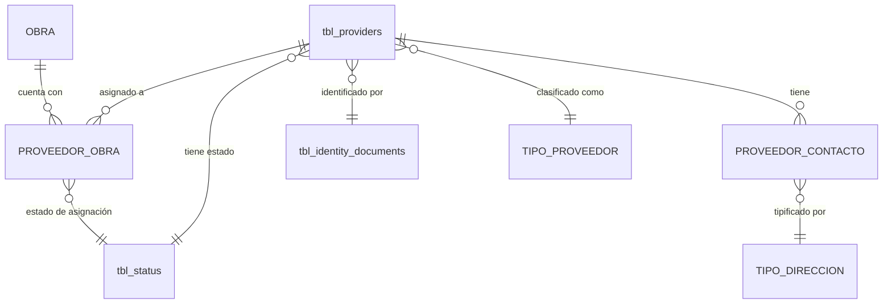

# ADR-0012: Proveedores y reutilización entre obras

## Estado

**Propuesto.**

La tabla `tbl_providers` **existe en el esquema** pero es una tabla huérfana: **ningún archivo del repositorio la referencia**. No hay módulo backend, ni vista, ni API, ni permisos. Este ADR documenta la decisión arquitectónica recomendada y registra los defectos de la estructura existente.

## Fecha

2026-09-10 — versión inicial.

## Contexto

Los proveedores, contratistas y subcontratistas son las contrapartes del proceso administrativo de contratos. Una misma empresa suministra materiales a varias obras a lo largo del tiempo: es, por naturaleza, una **entidad reutilizable**.

El sistema debe permitir dos flujos desde el formulario de una obra:

```text
Agregar proveedor existente  →  seleccionar uno ya registrado
Crear proveedor nuevo        →  registrar uno que no exista
```

Ambos flujos convergen en la misma pregunta: **cómo se determina que un proveedor "ya existe"**. La respuesta es el documento de identificación —NIT o cédula—, y de ella dependen la integridad del catálogo y la fiabilidad de todo análisis por proveedor.

## Problema

Hay dos problemas distintos, y confundirlos es el error de diseño que este ADR previene.

### Problema 1 — Duplicación del proveedor

Si el proveedor se crea desde una obra y se guarda con datos propios de esa obra, la tentación es crear un registro por cada obra en la que participa. El resultado: la misma empresa aparece cinco veces, con cinco identificadores distintos, y ningún informe consolidado es correcto.

### Problema 2 — Condición de carrera en la verificación de existencia

Aun con la intención correcta, si la unicidad se verifica solo con una consulta previa a la inserción, dos usuarios que registren simultáneamente el mismo NIT crearán ambos el proveedor.

Se requiere definir qué información pertenece al proveedor y cuál a su relación con una obra, dónde se garantiza la unicidad, y qué ocurre bajo concurrencia.

## Estado actual

### La tabla existe y nadie la usa

`tbl_providers` está en `database/bdintervewebpack.sql` con `AUTO_INCREMENT = 5293`, lo que indica unos 5.292 registros en el esquema de origen. El volcado no contiene datos (`0 INSERT INTO`).

Una búsqueda sobre todo el repositorio confirma que **`tbl_providers` no aparece en ninguna línea de código**, ni en `server/src/` ni en `client/src/`. Las únicas coincidencias de la palabra "proveedores" son la constante `nameApp` en `common/constants/app.constants.js` ("Gestión, proveedores y anticipos") y una importación de Microsoft Graph cuyo nombre contiene "Provider" por coincidencia.

Es una tabla arrastrada de otro sistema, sin módulo que la opere.

### Estructura real y sus defectos

```text
prv_id              int AUTO_INCREMENT   PK
prv_name            varchar(255) NULL    'NOMBRE O RAZÓN SOCIAL'
idd_id              int NULL             'TIPO DE DOCUMENTO'   → FK a tabla AUSENTE
prv_identification  varchar(20)  NULL    'NUMERO DE DOCUMENTO'
prv_address         varchar(255) NULL    'DIRECCIÓN'
prv_phone           varchar(20)  NULL    'TELÉFONO'
prv_email           varchar(255) NULL    'EMAIL'
dot_id              int NULL             'ID DEL TIPO DE DOCUMENTO'   → sin tabla, sin FK
are_id              int NULL             'ID DE LA AREA'              → sin tabla, sin FK
cos_id              int NULL             'ID DEL CENTRO DE COSTOS'    → sin tabla, sin FK
sta_id              int NULL DEFAULT 1   → FK a tbl_status
prv_create_by, prv_create_at, prv_update_by, pro_update_at
```

Ocho defectos verificables:

| # | Defecto | Consecuencia |
| --- | --- | --- |
| 1 | **`prv_identification` tiene índice `INDEX`, no `UNIQUE`** | Nada impide dos proveedores con el mismo documento |
| 2 | **FK a `tbl_identity_documents`, tabla ausente del volcado** | El volcado no es restaurable de forma consistente; ver [ADR-0008](0008-tipos-identificacion.md) |
| 3 | `prv_identification` admite `NULL` | Un proveedor puede existir sin documento, sin identidad |
| 4 | `prv_name` admite `NULL` | Un proveedor sin razón social |
| 5 | Contacto embebido (`prv_address`, `prv_phone`, `prv_email`) | Un solo contacto, sin tipo de dirección, sin celular, fax ni observaciones |
| 6 | `dot_id`, `are_id`, `cos_id` sin tabla ni FK | Referencias a un esquema ajeno; `dot_id` es redundante con `idd_id` |
| 7 | **Sin columna de tipo de proveedor** | El atributo del alcance funcional no existe; ver [ADR-0010](0010-tipos-proveedor.md) |
| 8 | `pro_update_at` con prefijo incorrecto | Debería ser `prv_update_at`; ver [ADR-0013](0013-auditoria-trazabilidad.md) |

Además, **no existe ninguna relación entre proveedor y obra**: no hay tabla intermedia, ni columna de obra en `tbl_providers`. Tampoco existe la tabla de obras.

### La condición de carrera, con evidencia

El prompt de origen pregunta qué sucede si dos usuarios intentan crear simultáneamente el mismo proveedor. Como no hay código de proveedores, la respuesta se deriva del patrón que el proyecto aplica en todos sus servicios equivalentes.

`users.service.saveUser` y `profiles.service.saveProfile` verifican unicidad así:

```text
beginTransaction
  SELECT … WHERE campo = ? LIMIT 1     ← verificación
  si hay resultados → error 400
  INSERT …                              ← escritura
commit
```

Con el nivel de aislamiento por defecto de InnoDB, `REPEATABLE READ`, una lectura simple no bloquea filas inexistentes. Dos transacciones concurrentes ejecutan la secuencia así:

```text
T1: BEGIN
T2: BEGIN
T1: SELECT WHERE nit = '900123456'  →  0 filas
T2: SELECT WHERE nit = '900123456'  →  0 filas      ← ninguna ve a la otra
T1: INSERT proveedor '900123456'
T2: INSERT proveedor '900123456'
T1: COMMIT   → proveedor creado
T2: COMMIT   → proveedor DUPLICADO creado
```

**Ambas inserciones tienen éxito.** La verificación aplicativa no previene el duplicado porque no hay nada en la base de datos que lo impida: `prv_identification` no tiene restricción `UNIQUE`.

Este no es un riesgo teórico. Es el comportamiento del patrón vigente en el proyecto, aplicado a una tabla sin restricción de unicidad, en un flujo —"crear proveedor desde la obra"— que por su naturaleza invita a que varios usuarios registren la misma empresa al mismo tiempo.

Respuesta directa a las preguntas del alcance:

| Pregunta | Respuesta verificada |
| --- | --- |
| ¿Existe constraint `UNIQUE`? | **No.** Índice no único. No hay ningún `UNIQUE` en todo el esquema |
| ¿La validación está solo en frontend? | No hay validación en ninguna capa: no hay código de proveedores |
| ¿Existe validación backend? | **No** |
| ¿Existe validación transaccional? | **No** |
| ¿Existe condición de carrera? | **Sí**, inevitablemente, con el patrón del proyecto y sin `UNIQUE` |
| ¿Qué sucede con creación simultánea? | **Se crean dos proveedores con el mismo documento** |

## Decisión

1. **El proveedor es una entidad maestra reutilizable, independiente de las obras.** Existe una única fila por empresa en todo el sistema, con independencia de en cuántas obras participe.

2. **La relación proveedor-obra es una entidad propia**, con su propia tabla, sus propios atributos y su propio ciclo de vida. Asignar un proveedor a una obra **no crea un proveedor**.

3. **La identidad del proveedor es el par (tipo de identificación, número de documento).** Ambos son obligatorios.

4. **La unicidad se garantiza con una restricción `UNIQUE` en la base de datos.** La verificación aplicativa se conserva para producir un mensaje de error comprensible, pero **no es el mecanismo de integridad**.

5. **La creación de un proveedor maneja el error de duplicado del motor**, no solo la verificación previa. El patrón correcto es intentar la inserción y traducir `ER_DUP_ENTRY` a una respuesta clara. `error.middleware.js` **ya traduce ese código a un `409`**; lo que falta es la restricción que lo dispare.

6. **Crear un proveedor desde el formulario de una obra crea el proveedor en el maestro y lo asigna a la obra**, en la misma transacción. Son dos escrituras, no una copia.

7. **Si el documento ya existe, el sistema no crea nada: ofrece asignar el proveedor existente.** El flujo de "crear nuevo" y el de "agregar existente" convergen: el segundo es el resultado natural del primero cuando hay coincidencia.

8. **Un proveedor puede estar asignado a muchas obras; una obra puede tener muchos proveedores.** La relación es N:M, materializada en la tabla intermedia.

9. **Un proveedor no puede asignarse dos veces a la misma obra**, garantizado por `UNIQUE` sobre el par en la tabla intermedia.

10. **Separación de información**, que es el núcleo de este ADR:

    | Pertenece al **proveedor** | Pertenece a la **relación proveedor-obra** |
    | --- | --- |
    | Nombre o razón social | Estado de la asignación |
    | Tipo y número de identificación | Fecha de asignación |
    | Tipo de proveedor | Observaciones específicas de esa participación |
    | Correo institucional | Rol o alcance en esa obra |
    | Estado del proveedor | Auditoría de la asignación |
    | Tipo de servicio | |
    | Observación general | |
    | Contactos | |

11. **Los contactos pertenecen al proveedor, no a la relación.** Son datos de la empresa, no de su participación en una obra concreta. Se modelan según [ADR-0009](0009-tipos-direccion.md), en tabla propia y múltiple, reemplazando el contacto embebido actual.

12. **Desasignar un proveedor de una obra no lo elimina del maestro.**

13. **La eliminación del proveedor es lógica** mediante `sta_id = 3` y está **bloqueada si tiene asignaciones a obras**.

14. **Auditoría funcional para la asignación y desasignación proveedor-obra y para los cambios de identidad**; técnica para el resto. Ver [ADR-0013](0013-auditoria-trazabilidad.md).

## Justificación

- **Unicidad en la base de datos y no en la aplicación**: es la decisión central. Una verificación por `SELECT` previo es una comprobación *optimista* sobre un estado que puede cambiar antes de la escritura. La restricción `UNIQUE` es una garantía del motor, evaluada en el momento de la inserción, bajo bloqueo. No hay ventana entre la verificación y la escritura porque son la misma operación. Es la única forma de que la afirmación "no existen proveedores duplicados" sea cierta y no una aspiración.

- **Manejar el error del motor y no solo verificar antes**: incluso con `UNIQUE`, si el código solo verifica previamente y no captura `ER_DUP_ENTRY`, la carrera produce un error genérico de base de datos en lugar de un mensaje útil. Verificar antes mejora la experiencia; capturar el error garantiza la corrección. Hacen falta ambos, y el orden de importancia es el inverso al intuitivo.

- **Proveedor separado de la relación**: si los datos del proveedor se duplicaran por obra, actualizar el correo de una empresa exigiría actualizar N registros, y cualquier omisión produciría versiones divergentes de la misma empresa. Además haría imposible responder "en cuántas obras participa esta empresa", que es información de gestión básica. Es la misma separación que [ADR-0008](0008-tipos-identificacion.md) establece entre el catálogo de tipos y los datos de la persona.

- **La relación como entidad propia**: la asignación tiene atributos que no pertenecen ni al proveedor ni a la obra —cuándo se asignó, quién lo hizo, con qué alcance, si sigue vigente—. Modelarla como tabla intermedia sin atributos obligaría a perder esa información o a ubicarla mal.

- **Contactos en el proveedor**: la dirección de una empresa no cambia según la obra en la que participe. Ubicar los contactos en la relación los duplicaría por obra, reintroduciendo el problema que este ADR resuelve.

- **Convergencia de los dos flujos**: presentarlos como caminos separados hace que el usuario elija "crear nuevo" y se encuentre con un error. Que "crear nuevo" detecte la coincidencia y ofrezca asignar el existente convierte un error en una acción. La empresa ya está en el sistema; el usuario solo necesita usarla.

- **Bloqueo de eliminación por asignaciones**: un proveedor asignado a obras forma parte de expedientes contractuales. Eliminarlo dejaría asignaciones sin contraparte identificable.

## Alternativas consideradas

### Alternativa 1 — Proveedor por obra

Un registro de proveedor por cada obra en la que participa.

- **A favor**: implementación trivial; cada obra gestiona sus proveedores sin interferir con otras; permite datos distintos por obra sin modelo adicional.
- **En contra**: duplica la empresa tantas veces como obras; hace imposible cualquier consolidación por proveedor; actualizar un dato exige actualizar N registros; el catálogo crece sin control; contradice directamente el requisito de reutilización.
- **Descartada.** Es precisamente lo que el alcance funcional prohíbe.

### Alternativa 2 — Proveedor maestro con validación solo en la aplicación

Una fila por empresa, unicidad verificada por `SELECT` previo, sin `UNIQUE` en el esquema.

- **A favor**: sin cambio de esquema; mensajes de error controlados; es el patrón que el proyecto ya aplica en usuarios y perfiles.
- **En contra**: **no previene duplicados bajo concurrencia**, como demuestra el análisis de la condición de carrera. Deja la integridad del catálogo a merced de la sincronización de los usuarios. Un duplicado creado así es difícil de detectar y costoso de consolidar una vez que ambos registros tienen asignaciones.
- **Descartada.** Es el estado actual del proyecto para otras entidades, y es una debilidad, no un patrón a seguir.

### Alternativa 3 — Proveedor maestro con datos específicos por obra en la relación (seleccionada)

Una fila por empresa con `UNIQUE` sobre su identidad; tabla intermedia con los atributos de la participación.

- **A favor**: sin duplicados, garantizado por el motor; un solo lugar donde actualizar los datos de la empresa; consultable en ambos sentidos —obras de un proveedor, proveedores de una obra—; los datos específicos de la participación tienen dónde vivir; el catálogo permanece limpio.
- **En contra**: exige la tabla intermedia y una migración de los contactos embebidos actuales; el flujo de creación desde la obra es más complejo que un simple `INSERT`.
- **Seleccionada.**

## Modelo arquitectónico

Separación que este ADR fija:

```text
PROVEEDOR  —  entidad maestra, UNA fila por empresa
    │
    ├── identidad
    │     ├── tipo de identificación   FK → ADR-0008
    │     └── número de documento
    │           UNIQUE (tipo, número)   ← garantía del motor
    │
    ├── nombre o razón social
    ├── tipo de proveedor              FK → ADR-0010
    ├── tipo de servicio
    ├── correo
    ├── observación
    ├── estado
    ├── contactos  0..N                → ADR-0009
    └── auditoría estándar

              ▲
              │  reutilizado por muchas obras
              │
PROVEEDOR_OBRA  —  relación de asignación
    │
    ├── proveedor      FK
    ├── obra           FK
    │     UNIQUE (proveedor, obra)      ← no se asigna dos veces
    │
    ├── estado de la asignación
    ├── fecha de asignación
    ├── observaciones de esta participación
    └── auditoría estándar
```



Flujo objetivo de "agregar proveedor a una obra":

```text
Usuario en el formulario de obra
   │
   ├── "Agregar proveedor existente"
   │        └── buscar por documento o razón social
   │              └── seleccionar  ──> INSERT PROVEEDOR_OBRA
   │
   └── "Crear proveedor nuevo"
            └── captura tipo y número de documento
                  │
                  ▼
            BEGIN TRANSACTION
              ├── ¿existe un proveedor con ese (tipo, número)?
              │      SÍ ──> NO se crea nada
              │             se ofrece asignar el existente
              │             ──> INSERT PROVEEDOR_OBRA
              │
              └── NO ──> INSERT proveedor              ← puede fallar por UNIQUE
                         INSERT PROVEEDOR_OBRA           si otro usuario ganó la carrera
                         │
                         └── ER_DUP_ENTRY ──> 409 con mensaje claro
                                              "Ya existe un proveedor con ese documento"
            COMMIT
```

El punto clave del flujo: **la verificación previa es una cortesía; la restricción `UNIQUE` es la garantía.** Si la verificación pasa y otro usuario inserta primero, el motor rechaza la segunda inserción y el sistema responde con el mismo mensaje que habría dado la verificación. El resultado es correcto en ambos caminos.

## Reglas de negocio

**No se encontró evidencia en la implementación actual.** Reglas propuestas:

**Identidad**

1. Un proveedor se identifica por el par (tipo de identificación, número de documento).
2. Ese par es único en todo el sistema.
3. Tipo y número de documento son obligatorios.
4. El nombre o razón social es obligatorio.
5. Cambiar la identidad de un proveedor existente es una operación excepcional, con permiso propio y auditoría funcional.

**Reutilización**

6. Existe una única fila por empresa, con independencia del número de obras en que participe.
7. Un proveedor puede asignarse a muchas obras.
8. Una obra puede tener muchos proveedores.
9. Un proveedor no puede asignarse dos veces a la misma obra.
10. Crear un proveedor desde una obra lo crea en el maestro y lo asigna a esa obra.
11. Si el documento ya existe, el sistema ofrece asignar el proveedor existente en lugar de crear uno nuevo.
12. Desasignar un proveedor de una obra no lo elimina del maestro.

**Estado y ciclo de vida**

13. Solo los proveedores activos pueden asignarse a obras nuevas.
14. Desactivar un proveedor no afecta sus asignaciones existentes.
15. Un proveedor con asignaciones no puede eliminarse.
16. La asignación tiene estado propio, independiente del estado del proveedor.

**Contactos**

17. Los contactos pertenecen al proveedor y son compartidos por todas sus obras.
18. Un proveedor puede tener cero o más contactos.

**Pendiente de validación:** si los datos de contacto pueden diferir por obra —lo que exigiría contactos también en la relación—; qué es exactamente el "tipo de servicio" y si debe ser un maestro; si un proveedor puede tener varios tipos de proveedor.

## Seguridad

El módulo maneja datos de identificación de personas naturales y jurídicas, y su información alimenta procesos de pago.

Requisitos:

- Todas las operaciones exigen sesión y permiso verificados en backend.
- **La consulta de proveedores por documento es un buscador sobre datos personales**: requiere permiso y no debe permitir enumeración masiva sin control.
- **Consultas parametrizadas obligatorias en la búsqueda por documento.** Es el punto de mayor exposición del módulo. El patrón vigente en el proyecto —`paginationUsers`, `paginationMasterTemplate`, `paginationModuleDocs`— interpola los filtros del cliente directamente en la cadena SQL. Un buscador de proveedores construido así permitiría extraer la tabla completa mediante inyección.
- Cambiar la identidad de un proveedor —su documento— altera a qué empresa corresponden todos sus contratos y facturas históricos. Requiere permiso propio y auditoría reforzada.
- La auditoría no debe conservar números de documento completos si la organización los clasifica como dato sensible. Ver [ADR-0013](0013-auditoria-trazabilidad.md).

## Autorización

Acciones propuestas:

```text
CONSULTAR PROVEEDORES
CREAR PROVEEDOR
EDITAR PROVEEDOR
ELIMINAR PROVEEDOR
CAMBIAR ESTADO PROVEEDOR
ASIGNAR PROVEEDOR A OBRA
DESASIGNAR PROVEEDOR DE OBRA
EXPORTAR PROVEEDORES
```

**Ninguna existe hoy.**

`ASIGNAR` y `DESASIGNAR` se separan de `EDITAR PROVEEDOR` porque operan sobre entidades distintas: editar modifica el maestro y afecta a todas las obras; asignar modifica una obra concreta. Un usuario puede necesitar asignar proveedores sin poder alterar el catálogo.

`EXPORTAR` se define solo si se implementa la funcionalidad; **no existe hoy** ningún endpoint de exportación, pese a que `exceljs` y `excel4node` figuran en las dependencias.

Ver [ADR-0014](0014-autorizacion-permisos.md).

## Auditoría

**Nivel requerido: mixto.**

| Información | Nivel |
| --- | --- |
| Tipo y número de identificación | **Funcional** — es la identidad |
| Nombre o razón social | **Funcional** |
| Tipo de proveedor | **Funcional** |
| Estado del proveedor | **Funcional** |
| Asignación de un proveedor a una obra | **Funcional** |
| Desasignación de un proveedor de una obra | **Funcional** |
| Correo, tipo de servicio, observación | Técnica |
| Contactos | Técnica |

La asignación y la desasignación se auditan funcionalmente porque establecen y revocan la participación de una empresa en un expediente contractual. Saber cuándo entró y cuándo salió un proveedor de una obra, y quién lo decidió, es información del expediente.

Precaución: si el número de documento es dato sensible, la bitácora registra el hecho del cambio sin conservar el valor completo.

## Validaciones

| Validación | Frontend | Backend | Base de datos | Clasificación |
| --- | --- | --- | --- | --- |
| Tipo de identificación obligatorio | Propuesta (selector) | Propuesta | `NOT NULL` + FK | Integridad |
| Número de documento obligatorio | Propuesta | Propuesta | `NOT NULL` | Integridad |
| **Unicidad de (tipo, número)** | Propuesta (aviso al escribir) | Propuesta (verificación + manejo de `ER_DUP_ENTRY`) | **`UNIQUE` — la garantía real** | **Integridad** |
| Formato del documento según el tipo | Propuesta | **Propuesta — obligatoria** | No expresable | Regla de negocio |
| Razón social obligatoria | Propuesta | Propuesta | `NOT NULL` | Integridad |
| Formato de correo | Propuesta | **Propuesta — obligatoria** | No expresable | UX + Regla de negocio |
| Proveedor no asignado dos veces a la misma obra | Propuesta | Propuesta | **`UNIQUE (proveedor, obra)`** | Integridad |
| Proveedor activo al asignarlo | Propuesta (selector) | **Propuesta — obligatoria** | No expresable | Regla de negocio |
| Sin asignaciones antes de eliminar | Propuesta (aviso) | **Propuesta — obligatoria** | No expresable | Regla de negocio |
| Permiso de la acción | Propuesta | **Propuesta — obligatoria** | No aplica | Seguridad |

La fila de unicidad es la que resume este ADR. La validación en frontend advierte; la del backend explica; **la de base de datos garantiza**. Solo la tercera es un mecanismo de integridad. Las otras dos son experiencia de usuario.

## Integridad de datos

Estado actual y requisitos:

| Elemento | Estado actual | Requisito |
| --- | --- | --- |
| `UNIQUE (idd_id, prv_identification)` | **Ausente** — solo índice no único | **Obligatorio** |
| `tbl_identity_documents` | **Ausente del volcado**, referenciada por FK | Debe existir |
| `idd_id` | `NULL` permitido | `NOT NULL` |
| `prv_identification` | `NULL` permitido | `NOT NULL` |
| `prv_name` | `NULL` permitido | `NOT NULL` |
| Tabla proveedor-obra | **No existe** | Con `UNIQUE (proveedor, obra)` |
| Contactos | Embebidos, únicos | Tabla propia, múltiples |
| `dot_id`, `are_id`, `cos_id` | Sin tabla ni FK | Depurar |
| Tipo de proveedor | Sin columna | FK al maestro |
| `pro_update_at` | Prefijo incorrecto | `prv_update_at` |
| Colación | `utf8mb4_0900_ai_ci` | Correcta; unificar con las tablas relacionadas |

Sobre la colación, un detalle relevante: `utf8mb4_0900_ai_ci` es insensible a mayúsculas y acentos. Para `prv_identification` eso es indiferente —son dígitos—, pero implica que `UNIQUE` sobre razón social, si se añadiera, trataría "Construcciones S.A." y "CONSTRUCCIONES S.A." como iguales. La unicidad se define sobre el documento, no sobre el nombre, precisamente porque el nombre admite variantes legítimas.

## Transacciones

Dos operaciones exigen atomicidad:

**Crear proveedor desde una obra** — dos escrituras en tablas distintas:

```text
BEGIN
  INSERT proveedor          ← puede fallar por UNIQUE
  INSERT proveedor_obra
COMMIT
```

Sin transacción, un fallo en la segunda inserción dejaría el proveedor creado y no asignado: el usuario reintentaría y recibiría "ya existe", sin entender por qué.

**Guardar una obra con sus proveedores** — la asignación forma parte del agregado de la obra descrito en [ADR-0011](0011-obras.md) y va en la misma transacción.

Precaución heredada del análisis: `executeQuery` en `common/configs/db.config.js` **toma una conexión nueva del pool si no se le pasa una**. Una escritura que omita el parámetro de conexión quedaría fuera de la transacción y sobreviviría al `rollback`. En un flujo que crea proveedores, eso produciría exactamente los registros huérfanos que este ADR busca evitar.

Sobre el nivel de aislamiento: **no se requiere elevarlo.** Con `UNIQUE` en el esquema, `REPEATABLE READ` es suficiente — el motor rechaza la inserción duplicada con independencia del aislamiento. Elevar a `SERIALIZABLE` para compensar la ausencia de `UNIQUE` sería costoso y frágil; la restricción es la solución correcta y barata.

## Consecuencias

### Positivas

- **Duplicados imposibles**, garantizado por el motor y no por disciplina aplicativa.
- Un solo lugar donde actualizar los datos de una empresa.
- Consultable en ambos sentidos: obras de un proveedor, proveedores de una obra.
- Los datos específicos de la participación tienen dónde vivir sin duplicar la empresa.
- Los dos flujos de la interfaz convergen: crear con documento existente se convierte en asignar.
- Habilita el análisis consolidado por proveedor, base de cualquier indicador de concentración.
- El manejo de `ER_DUP_ENTRY` ya está implementado en `error.middleware.js`.

### Negativas

- Requiere una migración considerable de `tbl_providers`: restricciones, contactos, tipo de proveedor, depuración de columnas residuales.
- Antes de aplicar `UNIQUE` hay que depurar los duplicados existentes, si los hay, en los ~5.292 registros del esquema de origen.
- El flujo de creación desde la obra es más complejo que un `INSERT`.
- La consolidación de dos proveedores duplicados creados antes de la restricción requiere una operación específica, no contemplada en este ADR.

## Riesgos

| Riesgo | Severidad | Descripción |
| --- | --- | --- |
| **Proveedores duplicados por concurrencia** | **Crítico** | Sin `UNIQUE`, el patrón de verificación previa del proyecto no lo impide |
| Duplicación del proveedor por obra | **Crítico** | Si se modela la relación como copia en lugar de asignación |
| FK a tabla ausente | **Alto** | `tbl_identity_documents` no está en el volcado; bloquea el uso de `tbl_providers` |
| Inyección SQL en el buscador por documento | **Alto** | Si se replica el patrón de interpolación de `paginationUsers` |
| Escritura fuera de la transacción | **Alto** | `executeQuery` sin conexión toma otra del pool y sobrevive al `rollback` |
| Proveedores sin identidad | **Alto** | `idd_id` y `prv_identification` admiten `NULL` |
| Contacto embebido insuficiente | **Alto** | Un solo contacto sin tipo; contradice el requisito |
| Datos divergentes de la misma empresa | **Alto** | Si el proveedor se duplica, cada copia deriva por su lado |
| Duplicados preexistentes | **Medio** | Aplicar `UNIQUE` exigirá depurar el conjunto de origen |
| Columnas residuales | **Medio** | `dot_id`, `are_id`, `cos_id` sin tabla ni FK |
| Cambio de identidad sin control | **Medio** | Alterar el documento reasigna todo el historial contractual de la empresa |
| Tabla huérfana | **Medio** | `tbl_providers` no la usa ningún código; su estructura no ha sido validada por uso real |

## Impacto técnico

### Frontend

- Módulo completo, inexistente: listado de proveedores, formulario y gestión de contactos.
- Dentro del formulario de obra, un componente de asignación de proveedores con los dos flujos.
- `GenericFormSection.jsx` soporta los campos necesarios; su tipo `pendingDropdown` sirve para el flujo de alta en línea.
- El componente de contactos se comparte con obras, según [ADR-0009](0009-tipos-direccion.md).
- La búsqueda por documento debe ser reactiva y advertir de la coincidencia **antes** de que el usuario complete el formulario.
- Ante un `409` por documento duplicado, la interfaz debe ofrecer directamente la acción de asignar el proveedor existente, no solo mostrar el error.
- `DataTable.jsx`, `FilterPopper.jsx`, `BaseDialog.jsx`, `ConfirmDialog.jsx` y `StatusChip.jsx` son reutilizables.

### Backend

- Módulo completo con `routes` / `controller` / `service`, inexistente.
- Endpoint de búsqueda por documento, con consultas parametrizadas.
- Servicio de creación que maneje `ER_DUP_ENTRY` además de la verificación previa.
- Servicios de asignación y desasignación, invocables desde el módulo de obras.
- `error.middleware.js` ya traduce `ER_DUP_ENTRY` a `409`; conviene mejorar el mensaje, hoy genérico ("Intento de duplicar un valor único... Contacta a sistemas"), para que nombre el campo duplicado.

### Base de datos

- `tbl_providers` requiere: `UNIQUE (idd_id, prv_identification)`, columnas obligatorias, columna de tipo de proveedor, corrección de `pro_update_at`, depuración de `dot_id` / `are_id` / `cos_id`, y retiro de los campos de contacto embebidos.
- Requiere la tabla de relación proveedor-obra y la de contactos de proveedor, ambas inexistentes.
- Requiere `tbl_identity_documents`, ausente del volcado.
- Depende de la tabla de obras, inexistente.
- Sin migraciones versionadas en el proyecto.

### Infraestructura

- Los documentos de proveedor pueden apoyarse en `tbl_documents`, cuyo `enum` `doc_type` admite hoy solo `'USERS'`, `'PROFILES'`, `'PAGINAS'`, `'PERMISOS'` — habría que ampliarlo.
- **No se encontró evidencia** de integración con servicios externos de validación de NIT o de listas restrictivas.

## Estado actual vs arquitectura objetivo

| Aspecto | Estado actual | Arquitectura objetivo |
| --- | --- | --- |
| Uso de `tbl_providers` | **Tabla huérfana, sin código** | Módulo completo |
| Unicidad del documento | **Índice no único** | `UNIQUE (tipo, número)` |
| Prevención de duplicados | **Ninguna** | Garantía del motor + verificación previa + manejo de `ER_DUP_ENTRY` |
| Identidad obligatoria | `NULL` permitido en tipo y número | `NOT NULL` en ambos |
| Relación con obras | **No existe** | Tabla intermedia N:M con atributos propios |
| Contactos | Embebidos, únicos, sin tipo | Tabla propia, múltiples, tipificados |
| Tipo de proveedor | Sin columna | FK al maestro |
| Tipo de identificación | FK a tabla ausente | FK a tabla existente |
| Columnas residuales | `dot_id`, `are_id`, `cos_id` | Depuradas |
| Auditoría | `pro_update_at` mal prefijado | Estándar corregido |
| Flujos de la interfaz | No existen | Convergentes: crear detecta y ofrece asignar |
| Permisos | No existen | Ocho acciones propias |

## Brechas identificadas

| # | Brecha | Severidad |
| --- | --- | --- |
| B1 | Sin `UNIQUE` sobre (tipo, número): duplicados por concurrencia | **Crítica** |
| B2 | No existe la relación proveedor-obra | **Alta** |
| B3 | `tbl_providers` es una tabla huérfana sin módulo | **Alta** |
| B4 | `tbl_identity_documents` referenciada por FK y ausente del esquema | **Alta** |
| B5 | Identidad opcional: `idd_id` y `prv_identification` admiten `NULL` | **Alta** |
| B6 | Contacto embebido, único y sin tipo | **Alta** |
| B7 | No existe la entidad obra | **Alta** — bloquea la relación |
| B8 | Sin columna de tipo de proveedor | **Alta** |
| B9 | Riesgo de inyección SQL en el buscador por documento | **Alta** — preventiva |
| B10 | `dot_id`, `are_id`, `cos_id` sin tabla ni FK; `dot_id` redundante con `idd_id` | **Media** |
| B11 | `pro_update_at` con prefijo incorrecto | **Baja** |
| B12 | Sin permisos definidos | **Media** |
| B13 | Mensaje genérico ante duplicado en `error.middleware.js` | **Baja** |
| B14 | `tbl_documents.doc_type` no contempla proveedores | **Media** |
| B15 | Sin migraciones versionadas | **Media** |
| B16 | Sin proceso de consolidación de duplicados preexistentes | **Media** |

## Plan de implementación

Recomendación derivada del análisis. **No fue ejecutada.**

**Fase 0 — Prerrequisitos (B4, B7, B15)**
Recuperar `tbl_identity_documents` ([ADR-0008](0008-tipos-identificacion.md)). Implementar obras ([ADR-0011](0011-obras.md)) y los maestros de tipo de proveedor y tipo de dirección. Adoptar migraciones versionadas.

**Fase 1 — Integridad de la identidad (B1, B5, B16)**
Depurar duplicados y nulos existentes. Aplicar `UNIQUE (idd_id, prv_identification)` y hacer obligatorias las columnas de identidad. **Es la fase que resuelve el problema central de este ADR.**

**Fase 2 — Estructura (B6, B8, B10, B11)**
Tabla de contactos de proveedor y migración de los datos embebidos. Columna de tipo de proveedor. Depuración de columnas residuales. Corrección del prefijo de auditoría.

**Fase 3 — Relación (B2)**
Tabla proveedor-obra con `UNIQUE (proveedor, obra)` y atributos de la asignación.

**Fase 4 — Módulo (B3, B9, B13)**
Backend con consultas parametrizadas y manejo de `ER_DUP_ENTRY`. Frontend con los dos flujos convergentes. Mensaje de duplicado que nombre el campo.

**Fase 5 — Permisos y auditoría (B12)**
Ocho acciones aplicadas en backend. Auditoría funcional de identidad, asignación y desasignación.

**Fase 6 — Complementos (B14)**
Ampliar `doc_type` para documentos de proveedor.

## ADR relacionados

- [ADR-0008 — Tipo de identificación](0008-tipos-identificacion.md) — identidad del proveedor; tabla ausente
- [ADR-0010 — Tipo de proveedor](0010-tipos-proveedor.md) — clasificación; decisión pendiente sobre dónde vive el atributo
- [ADR-0009 — Tipo de dirección](0009-tipos-direccion.md) — contactos del proveedor
- [ADR-0011 — Obras](0011-obras.md) — la asignación forma parte del agregado de la obra
- [ADR-0013 — Auditoría y trazabilidad](0013-auditoria-trazabilidad.md)
- [ADR-0014 — Autorización basada en permisos](0014-autorizacion-permisos.md)

## Referencias

- `database/bdintervewebpack.sql` — `tbl_providers` completa: índices, restricciones y columnas residuales
- `server/src/modules/security/users/users.service.js` — `checkIfUserExists` y `saveUser`, patrón de verificación previa sujeto a condición de carrera
- `server/src/modules/security/profiles/profiles.service.js` — `saveProfile`, mismo patrón
- `server/src/common/middlewares/error.middleware.js` — traducción de `ER_DUP_ENTRY` a `409`
- `server/src/common/configs/db.config.js` — `executeQuery` y el manejo de conexiones
- `client/src/ui-component/extended/GenericFormSection.jsx` — tipo `pendingDropdown`
