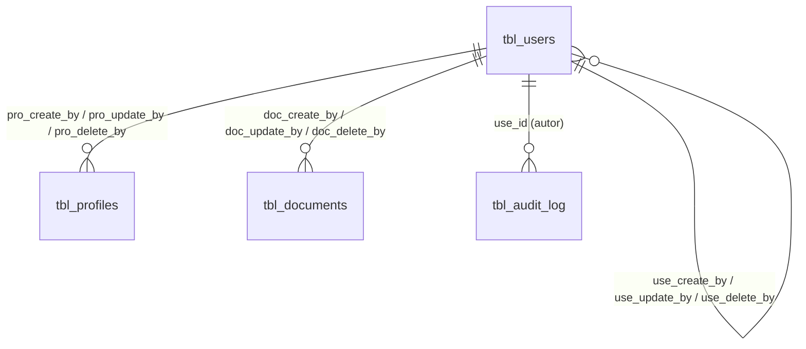

# ADR-0013: Auditoría y trazabilidad

## Estado

**Aceptado (implementado para los módulos existentes).**

La auditoría técnica con autor verificable, las columnas de eliminación y la bitácora funcional están implementadas para usuarios, perfiles, permisos, documentos y eventos de autenticación. Para los módulos de negocio que aún no existen (obras, contratos, pólizas, facturación, proveedores), este ADR fija el estándar que deben cumplir al crearse.

La sesión MySQL de Prisma va fijada en UTC (B8). Quedan abiertas: la política de retención de la bitácora (B15) y la consulta de la bitácora desde la aplicación (B16).

## Fecha

- 2026-09-10 — versión inicial (análisis del estado heredado).
- 2026-09-24 — se implementan las decisiones 2, 3, 4, 6, 7, 8 y 10: FK de autoría, columnas de eliminación, bitácora `tbl_audit_log` escrita desde el servicio y eventos de autenticación. Se retiran del análisis las tablas y módulos que ya no existen en el repositorio (`tbl_providers`, `tbl_business_rules`, módulo `template`).

## Contexto

Este ADR es transversal: aplica a todos los módulos, existentes y futuros.

El proceso administrativo de contratos maneja información con consecuencias contractuales y económicas: valores de contrato, ampliaciones de plazo, vigencias de póliza, estados de liquidación. Ante una discrepancia, la pregunta no es solo "cuál es el valor actual", sino "quién lo cambió, cuándo y desde qué valor".

Hay dos niveles de auditoría, y confundirlos es el error habitual:

| Nivel | Pregunta que responde | Coste |
| --- | --- | --- |
| **Auditoría técnica** | ¿Quién creó, modificó o eliminó este registro por última vez? | Seis columnas por tabla |
| **Auditoría funcional** | ¿Qué campo cambió, de qué valor a qué valor, quién y cuándo? | Tabla de bitácora + escritura por operación |

La auditoría técnica responde "quién tocó esto". La funcional responde "qué pasó aquí". La primera se sobrescribe en cada actualización; la segunda acumula historia.

## Problema

Se requiere definir:

1. Cuál es el estándar de columnas de auditoría y si debe ser uniforme.
2. Qué información exige auditoría funcional y cuál se conforma con la técnica.
3. Cómo se registra la eliminación, dado que es lógica.
4. Cómo se garantiza que el autor registrado es el real y no uno declarado por el cliente.

## Estado actual

### Auditoría técnica: columnas por tabla

| Tabla | create_by / at | update_by / at | delete_by / at | FK de autoría |
| --- | --- | --- | --- | --- |
| `tbl_users` | `use_create_by` / `use_create_at` | `use_update_by` / `use_update_at` | `use_delete_by` / `use_delete_at` | Sí (autorreferencia) |
| `tbl_profiles` | `pro_create_by` / `pro_create_at` | `pro_update_by` / `pro_update_at` | `pro_delete_by` / `pro_delete_at` | Sí |
| `tbl_documents` | `doc_create_by` / `doc_create_at` | `doc_update_by` / `doc_update_at` | `doc_delete_by` / `doc_delete_at` | Sí |
| `tbl_password_resets` | — / `par_created_at` | — | — | No aplica (registro transitorio) |
| `tbl_sessions` | — / `ses_create_at` | — | — | No aplica (registro transitorio) |
| `tbl_pages`, `tbl_permissions`, `tbl_status` | — | — | — | Exentas (catálogo, decisión 5) |
| `tbl_page_permissions`, `tbl_profile_permissions`, `tbl_user_permissions`, `tbl_user_pages` | — | — | — | Auditadas en la bitácora (decisión 6) |

- **FK a `tbl_users.use_id`** en todas las columnas `*_create_by`, `*_update_by` y `*_delete_by` (`database/migrations/0011_fk_audit_columns.sql` y `0012_add_delete_columns.sql`). Admiten `NULL`: el primer usuario del sistema no tiene creador. La migración 0011 depura antes cualquier valor sin usuario correspondiente (lo pone en `NULL`); en la BD de desarrollo no había ninguno.
- **El autor sale siempre de `req.user`** (el JWT verificado), nunca del cuerpo de la petición: `saveUser`, `deleteUser`, `saveProfile`, `deleteProfile`, `saveModuleDoc`, `deleteModuleDoc` y las autoediciones (`updateAccount`, `updatePassword`, que registran al propio usuario en `use_update_by`). `restorePassword` también registra al propio usuario: demostró ser el dueño del correo.
- En Prisma las relaciones de autoría tienen nombres explícitos (`created_by_user`, `updated_by_user`, `deleted_by_user` y sus inversas en `tbl_users`), porque Prisma los exige cuando dos modelos tienen varias relaciones entre sí.

### Eliminación

La eliminación sigue siendo lógica (`sta_id = 3`) y sigue siendo lo único que decide la visibilidad: todos los listados filtran `sta_id != 3`.

- `deleteUser`, `deleteProfile` y `deleteModuleDoc` pueblan además `*_delete_by` (autor de la sesión) y `*_delete_at`. La eliminación de una carpeta de documentos marca con la misma fecha y autor todo su contenido.
- `*_update_by` / `*_update_at` también se actualizan al eliminar, pero ya no son la única evidencia: una edición posterior no borra quién eliminó.
- Eliminar un registro ya eliminado se rechaza, para no pisar la evidencia original.
- **Reactivación**: si `saveUser` / `saveProfile` / `saveModuleDoc` devuelven un registro eliminado a un estado visible, `*_delete_by` / `*_delete_at` vuelven a `NULL`. La historia de la eliminación y la reactivación queda en la bitácora (usuarios y perfiles).
- Los registros eliminados antes de la migración 0012 quedan con `*_delete_*` en `NULL`: no hay forma de saber quién los eliminó, y copiar `*_update_*` sería inventar evidencia.

### Auditoría funcional: `tbl_audit_log`

`database/migrations/0013_create_audit_log.sql`. Una fila por campo modificado, o una fila sin campo para los eventos que no cambian un valor.

| Columna | Contenido |
| --- | --- |
| `aud_id` | Clave (`bigint`) |
| `aud_operation_id` | UUID que agrupa todas las filas de una misma operación: un "Guardar" que cambia varios campos, o una eliminación que además revoca permisos |
| `aud_entity` | Entidad de negocio (`USUARIO`, `PERFIL`, …) |
| `aud_record_id` | Id del registro afectado; `NULL` en eventos sin registro (login fallido de un usuario inexistente) |
| `aud_field` | Campo modificado; `NULL` en eventos |
| `aud_old_value` / `aud_new_value` | Valores como texto (`TEXT`). `NULL` es un valor válido. Las listas se guardan ordenadas y separadas por comas |
| `aud_operation` | Operación (catálogo `AUDIT_OPERATIONS` en el código, abajo) |
| `use_id` | Autor, FK a `tbl_users`. Siempre el usuario de la sesión; `NULL` solo en eventos anónimos |
| `aud_ip` | IP de origen |
| `aud_create_at` | `timestamp(3)`: milisegundos, para ordenar eventos del mismo segundo |

Índices: (`aud_entity`, `aud_record_id`), `aud_operation_id`, `use_id`, `aud_create_at`.

`aud_operation` es texto y no `ENUM` a propósito: el catálogo vive en el código y crecerá con los módulos de negocio sin exigir una migración por operación.

**Escritura**: exclusivamente con `writeAudit(tx, …)` de `server/src/common/services/audit.service.js`, dentro de la transacción de la operación. `diffFields(before, after, campos)` calcula qué cambió; cada service declara explícitamente qué campos audita.

**Qué se registra hoy:**

| Entidad | Operaciones | Origen |
| --- | --- | --- |
| `USUARIO` | `CREAR`, `EDITAR` (datos, perfil, estado, acceso, páginas puntuales, contraseña oculta), `ELIMINAR`, `REACTIVAR` | `users.service.js`, `auth.service.updateAccount` |
| `USUARIO` | `ASIGNAR` / `REVOCAR` de permisos individuales, una fila por permiso | `permissions.service.updateUserPermissions` |
| `PERFIL` | `CREAR`, `EDITAR` (nombre, estado, páginas), `ELIMINAR` (con las páginas que se borran), `REACTIVAR` | `profiles.service.js` |
| `PERFIL` | `ASIGNAR` / `REVOCAR` de permisos; al eliminar el perfil, `REVOCAR` de todos sus permisos en la misma operación | `permissions.service.updateProfilePermissions`, `profiles.service.deleteProfile` |
| `USUARIO` (autenticación) | `LOGIN` (indica si cerró otra sesión), `LOGIN_FALLIDO` (con motivo o contador), `CUENTA_BLOQUEADA`, `LOGOUT`, `SESION_REVOCADA` (reutilización de refresh token), `CONTRASENA_CAMBIADA`, `RECUPERACION_SOLICITADA`, `CODIGO_RECUPERACION_FALLIDO`, `CONTRASENA_RESTAURADA` | `auth.service.js`, `session.service.js` |

Los documentos adjuntos son auditoría **técnica** (decisión 9): tienen columnas de autoría y de eliminación, pero no escriben en la bitácora.

### Logging técnico

`server/app.js` monta el logger HTTP persistente (winston → `logs/api.log` y `logs/error-api.log`). Es diagnóstico técnico, no auditoría de negocio: registra método, ruta, estado y tiempo, no qué cambió en un registro.

## Decisión

1. **Se adopta como estándar transversal el patrón de columnas con prefijo de tabla**, ahora de seis columnas en las tablas del dominio de negocio:

   ```text
   <prefijo>_create_by, <prefijo>_create_at,
   <prefijo>_update_by, <prefijo>_update_at,
   <prefijo>_delete_by, <prefijo>_delete_at
   ```

   Toda tabla nueva del dominio de negocio lo incluye (ver `database/migrations/README.md`, "Estándar de auditoría para tablas nuevas").

2. **`*_create_by`, `*_update_by` y `*_delete_by` llevan clave foránea a `tbl_users.use_id`.** Un autor que no es un usuario del sistema no es auditoría, es un número.

3. **El autor se toma siempre de `req.user`, nunca del cuerpo de la petición.** Una auditoría que el cliente puede falsificar no tiene valor probatorio. Es la misma decisión que [ADR-0001](0001-seguridad.md) para el sujeto de la operación.

4. **`<prefijo>_delete_by` y `<prefijo>_delete_at` se pueblan en la eliminación lógica.** `sta_id = 3` sigue determinando la visibilidad; las columnas conservan la evidencia del evento. Se limpian si el registro se reactiva, y la historia queda en la bitácora.

5. **Las tablas de catálogo estable (`tbl_status`, `tbl_pages`, `tbl_permissions`) quedan exentas de auditoría de fila.** Su contenido es configuración versionada con el código (migraciones + `prisma/seed.js`).

6. **Las tablas de unión que expresan una decisión de negocio se auditan en la bitácora, no con columnas propias.** Asignar o revocar un permiso, o una página a un perfil o usuario, registra quién, cuándo y qué, una fila por elemento.

7. **Se adopta auditoría funcional mediante una bitácora única (`tbl_audit_log`)** con entidad, registro, campo, valor anterior, valor nuevo, operación, usuario, fecha, IP e identificador de operación. La bitácora se escribe **dentro de la misma transacción** que la operación auditada.

8. **La bitácora se escribe desde la capa de servicio, nunca mediante disparadores de base de datos.** El servicio conoce el usuario de la sesión y el contexto de negocio; un disparador no.

9. **Alcance de la auditoría funcional**, definido por criticidad:

   | Categoría | Nivel exigido | Estado |
   | --- | --- | --- |
   | Permisos, perfiles y estado de usuarios | **Funcional** | Implementado |
   | Eventos de autenticación | **Funcional**, en la misma bitácora | Implementado |
   | Valores económicos de obra y contrato (valor inicial, valor ampliado, costo directo, valor máximo de orden de servicio) | **Funcional** | Pendiente: los módulos no existen |
   | Plazos (inicial, ampliado) | **Funcional** | Pendiente |
   | Estados de contrato y sus transiciones | **Funcional** (ver [ADR-0005](0005-estados-contrato.md)) | Pendiente |
   | Vigencias de póliza y aseguradora asociada | **Funcional** | Pendiente |
   | Relación proveedor-obra: asignación y desasignación | **Funcional** (ver [ADR-0012](0012-proveedores.md)) | Pendiente |
   | Configuración de tipos de contrato | **Funcional** (ver [ADR-0006](0006-tipos-contrato.md)) | Pendiente |
   | Maestros de configuración simples (aseguradoras, constructoras, tipos de interventoría, identificación, dirección, proveedor) | **Técnica** | Pendiente |
   | Datos de contacto y observaciones | **Técnica** | Pendiente |
   | Documentos adjuntos | **Técnica** | Implementado |

10. **La auditoría no se elimina jamás.** Los registros de bitácora no se modifican ni se borran, ni siquiera cuando el registro auditado se elimina lógicamente. Ningún código hace `UPDATE` ni `DELETE` sobre `tbl_audit_log`.

11. **El logging HTTP persistente es complementario, no sustituto**: diagnóstico técnico frente a auditoría de negocio.

12. **Una operación, un identificador.** Todas las filas de bitácora generadas por una misma operación comparten `aud_operation_id`, aunque toquen varios campos o varias tablas.

13. **La bitácora nunca contiene secretos.** Contraseñas, hashes, códigos de recuperación y tokens se registran como `[oculto]`: queda constancia de que cambiaron, nunca de su valor. En eventos de login no se registra el identificador tecleado (un usuario que escribe su contraseña en el campo de usuario la dejaría en la bitácora).

## Justificación

- **Conservar el patrón existente** evita una migración masiva y aprovecha que ya estaba aplicado.
- **FK a `tbl_users`**: convierte una convención en una garantía.
- **Autor desde el token**: es la diferencia entre auditoría y declaración.
- **Columnas de eliminación separadas**: sobrecargar `*_update_by` con dos significados hace imposible responder "quién eliminó esto" tras cualquier modificación posterior. El coste es dos columnas.
- **Bitácora desde servicio y no desde disparador**: un disparador de MySQL no tiene acceso al usuario de la aplicación (todas las conexiones usan el mismo usuario de base de datos) ni al contexto de la operación.
- **Misma transacción**: una auditoría que puede fallar independientemente de la operación produce huecos silenciosos, peor que no tener auditoría, porque induce confianza injustificada.
- **Identificador de operación**: sin él, las filas de un mismo "Guardar" solo se pueden reagrupar por usuario y fecha, lo que falla con operaciones del mismo segundo. Agregarlo después no permite reagrupar la historia ya registrada.
- **Tablas de unión solo en bitácora**: la fila de unión se borra físicamente al revocar; columnas de autoría en ella desaparecerían justo cuando más importan.
- **Eventos de autenticación en la misma bitácora**: una sola estructura y una sola consulta para reconstruir qué hizo una cuenta, incluidos sus accesos.
- **Alcance selectivo**: auditar funcionalmente todo multiplica escritura y almacenamiento sin beneficio proporcional.

## Alternativas consideradas

### Alternativa 1 — Solo auditoría técnica

- **A favor**: coste cero.
- **En contra**: no responde ninguna pregunta relevante ante una discrepancia contractual.
- **Descartada** como solución completa. Se conserva como base.

### Alternativa 2 — Auditoría por disparadores de base de datos

- **A favor**: imposible de omitir desde la aplicación; captura cambios hechos por herramientas externas.
- **En contra**: no conoce el usuario de la aplicación; dispersa lógica de negocio a otra capa; el esquema no usa disparadores.
- **Descartada**, aunque es la opción más robusta si se requiere auditoría a prueba de la propia aplicación.

### Alternativa 3 — Versionado completo de filas (tablas de historia)

- **A favor**: reconstrucción exacta del estado en cualquier momento.
- **En contra**: duplica el esquema y el almacenamiento.
- **Descartada.**

### Alternativa 4 — Bitácora única de cambios desde la capa de servicio (seleccionada e implementada)

- **A favor**: una sola estructura para todos los módulos; granularidad de campo; acceso al usuario de la sesión y al contexto; alcance modulable por criticidad.
- **En contra**: depende de la disciplina en los servicios. Si un servicio omite la escritura, el cambio no se audita. Se mitiga centralizando la escritura en `audit.service.js`, exigiéndola en el checklist de `ENDPOINT_STANDARD.md` y cubriéndola con tests.
- **Seleccionada.**

## Modelo arquitectónico



Flujo de una operación auditada:

```text
Controller
   └── ctx = auditContext(req)      → { useId: req.user.useId, ip }   (nunca del body)

Service
   └── prisma.$transaction(async (tx) => {
         ├── before = SELECT fila (campos auditados)
         ├── UPDATE fila  (+ <prefijo>_update_by = ctx.useId)
         ├── changes = diffFields(before, after, CAMPOS_AUDITADOS)
         ├── writeAudit(tx, { operationId, entity, recordId, operation, ctx, changes })
         │      └── INSERT tbl_audit_log: una fila por campo, mismo operationId
         └── COMMIT → operación y auditoría se confirman o se revierten juntas
       })
```

Ejemplo: un administrador (id 1) edita al usuario 25 y cambia dos campos en un solo guardado.

```text
aud_operation_id  aud_entity  aud_record_id  aud_field  aud_old_value  aud_new_value  aud_operation  use_id
a1b2…             USUARIO     25             pro_id     3              2              EDITAR         1
a1b2…             USUARIO     25             sta_id     1              2              EDITAR         1
```

## Reglas de negocio

1. Todo registro de las tablas del dominio conserva quién lo creó, quién lo modificó por última vez y, si aplica, quién lo eliminó.
2. `*_create_at` y `*_update_at` los pobla la base de datos (`CURRENT_TIMESTAMP` / `ON UPDATE CURRENT_TIMESTAMP`). `*_delete_at` lo pobla la aplicación al eliminar.
3. `*_create_by`, `*_update_by` y `*_delete_by` los pobla la aplicación con el usuario autenticado de la sesión.
4. La eliminación es lógica: `sta_id = 3`. No hay borrado físico de registros de negocio. Los listados excluyen `sta_id = 3`.
5. Un registro ya eliminado no se vuelve a eliminar.
6. Reactivar un registro limpia sus columnas de eliminación.
7. La información crítica registra valor anterior y valor nuevo por campo modificado.
8. Asignar o revocar permisos y páginas registra un elemento por fila.
9. La bitácora es de solo escritura.
10. Si la operación se revierte, su auditoría se revierte con ella.
11. La auditoría no registra contraseñas, hashes, códigos ni tokens: se registran como `[oculto]`.
12. Una operación produce un único `aud_operation_id`.

## Seguridad

- **Integridad del autor**: resuelta. El autor sale de la sesión y está respaldado por FK.
- **Datos sensibles**: `audit.service.js` oculta los campos de `SENSITIVE_FIELDS` (`use_password`, `par_code_hash`, `ses_refresh_hash`, `ses_prev_refresh_hash`, `ses_key`) incluso si un service los pasa por error. Los eventos de login no guardan el identificador tecleado; `forgot_password` solo registra la solicitud cuando el correo existe, para no guardar texto arbitrario del cliente.
- **Inmutabilidad**: el código no expone ningún `UPDATE`/`DELETE` sobre la bitácora. A nivel de base de datos, la garantía completa requiere que el usuario de BD de la aplicación tenga solo `INSERT`/`SELECT` sobre `tbl_audit_log` (sugerencia incluida en la migración 0013; es infraestructura).
- **Acceso a la auditoría**: cuando exista una consulta de la bitácora, deberá estar protegida por su propio permiso (siguiente `per_id` libre: 17), según [ADR-0014](0014-autorizacion-permisos.md).

## Autorización

La escritura no es una operación de usuario: es un efecto de la operación de negocio y no se expone como endpoint. La consulta requerirá permiso explícito (B16). Ver [ADR-0014](0014-autorizacion-permisos.md).

## Auditoría

Es el objeto de este ADR.

## Validaciones

| Validación | Frontend | Backend | Base de datos | Clasificación |
| --- | --- | --- | --- | --- |
| `*_create_at` / `*_update_at` presentes | No aplica | No | Sí (defaults) | Integridad |
| `*_create_by` / `*_update_by` / `*_delete_by` son usuarios reales | No aplica | Sí (salen de `req.user`) | **Sí — FK** | Integridad |
| El autor coincide con la sesión | No aplica | **Sí** (`auditContext(req)`) | No aplica | Seguridad |
| Operación y bitácora atómicas | No aplica | **Sí** (misma transacción) | Sí (transacción InnoDB) | Integridad |
| La bitácora no se modifica | No aplica | Sí (sin código de `UPDATE`/`DELETE`) | Pendiente (privilegios del usuario de BD) | Seguridad |

## Integridad de datos

- FK de autoría: `tbl_users_create_by`, `tbl_users_update_by`, `tbl_users_delete_by`, `tbl_profiles_create_by`, `tbl_profiles_update_by`, `tbl_profiles_delete_by`, `tbl_documents_create_by`, `tbl_documents_update_by`, `tbl_documents_delete_by`, `tbl_audit_log_users`. Todas `ON DELETE RESTRICT`: los usuarios nunca se borran físicamente.
- Las columnas `*_at` de las tablas de negocio son `timestamp(0)` (segundos); `tbl_audit_log.aud_create_at` es `timestamp(3)` (milisegundos).
- **Zona horaria**: `timestamp` en MySQL almacena en UTC y convierte según la zona de la sesión. La conexión de Prisma fija la sesión en UTC (`timezone=+00:00` en `prismaClient.js`) porque el adapter escribe y lee las fechas como UTC; con la sesión en `SYSTEM` (hora de Bogotá) todo quedaba desfasado 5 horas. La presentación en hora local es responsabilidad de quien muestra el dato (B8).
- Los documentos resuelven al autor con una segunda consulta y un `Map` (`enrichDocs`), no con un `JOIN` interno: un documento con autor `NULL` ya no desaparece del listado.

## Transacciones

Toda escritura auditada usa `prisma.$transaction(async (tx) => { … })` y pasa ese `tx` a `writeAudit`:

- `saveUser`, `deleteUser`, `saveProfile`, `deleteProfile`, `updateProfilePermissions`, `updateUserPermissions`.
- `updateAccount`, `updatePassword`, `restorePassword`, `forgotPassword`.
- Registro de login fallido + bloqueo; consumo de intento del código de recuperación + su evento.
- `createSession` (login) y `revokeSession` (logout, revocación por reutilización de refresh token).

Excepción deliberada: el login fallido de un usuario **inexistente** y el rechazo por cuenta bloqueada no modifican datos, así que su fila de bitácora se escribe sola.

Cuando una revocación de sesión es consecuencia de otra operación ya auditada (eliminar o desactivar un usuario, restaurar la contraseña), no escribe un evento propio: la operación principal ya consta.

## Consecuencias

### Positivas

- El autor registrado es verificable y siempre corresponde a un usuario real.
- "Quién eliminó esto" sobrevive a ediciones posteriores.
- Cambios de permisos, perfiles, estado de usuarios y eventos de autenticación quedan con historia completa y agrupada por operación.
- Un compromiso de cuenta deja rastro: logins, fallos, bloqueos, recuperaciones y revocaciones con IP.
- La utilidad común (`audit.service.js`) hace que auditar un módulo nuevo sea declarar sus campos y llamar a `writeAudit` en su transacción.

### Negativas

- Cada operación auditada añade escrituras y una lectura previa de la fila.
- La bitácora crece sin límite hasta que exista una política de retención (B15).
- Depende de la disciplina de cada service nuevo; se mitiga con el checklist y los tests.
- Los registros eliminados antes de la migración 0012 no tienen autor ni fecha de eliminación.

## Riesgos

| Riesgo | Severidad | Estado |
| --- | --- | --- |
| Un service nuevo olvida escribir en la bitácora | **Medio** | Mitigado: checklist de `ENDPOINT_STANDARD.md` + tests |
| Alteración de la bitácora con acceso directo a la BD | **Medio** | Abierto hasta restringir privilegios del usuario de BD |
| Ambigüedad de zona horaria | **Medio** | Mitigado: sesión de Prisma en UTC (B8) |
| Crecimiento no acotado de la bitácora | **Bajo** | Abierto (B15) |
| Filtración de datos sensibles por la bitácora | **Alto si ocurre** | Mitigado: `SENSITIVE_FIELDS` + sin identificadores tecleados + tests |

## Impacto técnico

### Frontend

- Sin cambios: el cliente nunca envió ni envía el autor.
- **No existe** vista de historial ni de bitácora (B16).

### Backend

- `common/services/audit.service.js`: `writeAudit`, `diffFields`, `auditContext`, `newOperationId`, catálogos `AUDIT_ENTITIES` / `AUDIT_OPERATIONS`, `SENSITIVE_FIELDS`.
- Los controllers construyen `ctx = auditContext(req)` y lo pasan al service.
- `session.service.js`: `createSession({ auditOperation })` y `revokeSession({ audit })` escriben el evento en su transacción.

### Base de datos

- Migraciones `0011_fk_audit_columns.sql`, `0012_add_delete_columns.sql`, `0013_create_audit_log.sql`.
- Sin disparadores, procedimientos, funciones, vistas ni eventos programados, y así debe seguir para la auditoría (decisión 8).

### Infraestructura

- Sugerido: usuario de BD de la aplicación con solo `INSERT`/`SELECT` sobre `tbl_audit_log`.
- El cron existente (`src/cron/`) es el mecanismo natural para una futura política de archivado de la bitácora.

## Estado actual vs arquitectura objetivo

| Aspecto | Estado actual | Arquitectura objetivo |
| --- | --- | --- |
| Estándar de columnas | Seis columnas en usuarios, perfiles y documentos | El mismo en toda tabla nueva del dominio ✅ (documentado) |
| Origen del autor | `req.user` | ✅ |
| Integridad del autor | FK a `tbl_users.use_id` | ✅ |
| Eliminación | `sta_id = 3` + `*_delete_by` / `*_delete_at` | ✅ |
| Tablas de unión de permisos | Auditadas en la bitácora | ✅ |
| Auditoría funcional | Bitácora por campo, con identificador de operación | ✅ para los módulos existentes; pendiente en los de negocio |
| Auditoría de seguridad | Eventos de autenticación en la bitácora | ✅ |
| Logging HTTP | Activo y persistente | ✅ |
| Migraciones | Versionadas en `database/migrations/` | ✅ |
| `tbl_status` | Sembrada por migración y seed | ✅ |
| Zona horaria | Implícita del servidor | Explícita en la conexión |
| Retención de la bitácora | Sin política | Política definida y automatizada |
| Consulta de la bitácora | Solo por SQL | Endpoint + vista con permiso propio |

## Brechas identificadas

| # | Brecha | Severidad | Estado |
| --- | --- | --- | --- |
| B1 | El autor de la auditoría provenía del cliente | Alta | ✅ Cerrada — `req.user` |
| B2 | Sin auditoría funcional para información crítica | Alta | ✅ Cerrada para los módulos existentes; es requisito de los de negocio |
| B3 | Sin auditoría de eventos de seguridad | Alta | ✅ Cerrada — eventos de autenticación en la bitácora |
| B4 | `*_create_by` / `*_update_by` sin FK a `tbl_users` | Media | ✅ Cerrada — migración 0011 |
| B5 | Sin `*_delete_by` / `*_delete_at` | Media | ✅ Cerrada — migración 0012 |
| B6 | Tablas de permisos sin auditoría de otorgamiento | Media | ✅ Cerrada — `ASIGNAR` / `REVOCAR` en la bitácora |
| B7 | Logger persistente no montado | Media | ✅ Cerrada |
| B8 | Zona horaria no explícita en la conexión | Media | ✅ Cerrada — sesión en UTC + migración 0014 |
| B9 | El módulo `template` propagaba otra convención | Media | ✅ No aplica — módulo retirado |
| B10 | Sin migraciones versionadas | Media | ✅ Cerrada — `database/migrations/` |
| B11 | `tbl_providers.pro_update_at` con prefijo incorrecto | Baja | No aplica — la tabla no existe en este repositorio; al crearla, usar `prv_update_at` |
| B12 | `tbl_password_resets.par_created_at` fuera de convención | Baja | ⏳ Abierta — registro transitorio, sin impacto en auditoría |
| B13 | `JOIN` interno ocultaba documentos con autor nulo | Baja | ✅ Cerrada — lookup con `Map` |
| B14 | `tbl_status` sin datos sembrados | Media | ✅ Cerrada — migración 0010 + seed |
| B15 | Sin política de retención de auditoría | Baja | ⏳ Abierta |
| B16 | Sin consulta de la bitácora desde la aplicación | Baja | ⏳ Abierta — requiere permiso nuevo (`per_id` 17) |

## Plan de implementación

Ejecutado: fases 1 (autor verídico), 2 (FK, `tbl_status`), 3 (migraciones, logger), 4 (auditoría de seguridad) y 5 (bitácora y columnas de eliminación) para los módulos existentes.

Pendiente:

1. **Despliegue**: aplicar las migraciones `0011` a `0014` en orden; la `0014` junto con el despliegue del cambio de zona horaria.
2. **Infraestructura**: restringir el usuario de BD de la aplicación a `INSERT`/`SELECT` sobre `tbl_audit_log`.
3. **Módulos de negocio**: cada módulo nuevo aplica el estándar de seis columnas y audita en la bitácora los campos de la decisión 9.
4. **B16**: endpoint de consulta de la bitácora (filtrado por entidad/registro, usuario, operación y fecha), con `requirePermission` de un `per_id` nuevo, y su vista en el cliente.
5. **B15**: política de retención y archivado, apoyada en el cron existente.

## ADR relacionados

- [ADR-0001 — Seguridad](0001-seguridad.md) — eventos de autenticación (B15 de ese ADR)
- [ADR-0014 — Autorización basada en permisos](0014-autorizacion-permisos.md)
- [ADR-0005 — Estados de contrato](0005-estados-contrato.md) — trazabilidad de transiciones
- [ADR-0006 — Tipos de contrato](0006-tipos-contrato.md) — auditoría de configuración
- [ADR-0012 — Proveedores](0012-proveedores.md) — auditoría de la relación proveedor-obra
- Aplica a todos los ADR de módulo

## Referencias

- `database/migrations/0011_fk_audit_columns.sql`, `0012_add_delete_columns.sql`, `0013_create_audit_log.sql`, `0014_fix_prisma_timezone_data.sql`
- `server/src/common/configs/prismaClient.js` — sesión MySQL en UTC
- `database/migrations/README.md` — estándar de auditoría para tablas nuevas
- `server/src/common/services/audit.service.js`
- `server/src/common/services/session.service.js`
- `server/src/modules/security/users/users.service.js`, `server/src/modules/security/profiles/profiles.service.js`, `server/src/modules/security/permissions/permissions.service.js`
- `server/src/modules/auth/auth.service.js`
- `server/src/modules/app/documents/document.service.js`
- `server/ENDPOINT_STANDARD.md`
