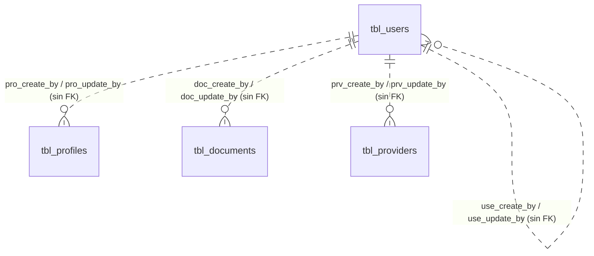

# ADR-0013: Auditoría y trazabilidad

## Estado

**Aceptado parcialmente / Propuesto.**

Existe un estándar de auditoría técnica, aplicado de forma casi consistente. La auditoría funcional (qué cambió) **no existe** y su adopción es una propuesta.

## Fecha

2026-09-10 — versión inicial.

## Contexto

Este ADR es transversal: aplica a todos los módulos, existentes y futuros.

El proceso administrativo de contratos maneja información con consecuencias contractuales y económicas: valores de contrato, ampliaciones de plazo, vigencias de póliza, estados de liquidación. Ante una discrepancia, la pregunta no es solo "cuál es el valor actual", sino "quién lo cambió, cuándo y desde qué valor".

Hay dos niveles de auditoría, y confundirlos es el error habitual:

| Nivel | Pregunta que responde | Coste |
| --- | --- | --- |
| **Auditoría técnica** | ¿Quién creó o modificó este registro por última vez? | Cuatro columnas por tabla |
| **Auditoría funcional** | ¿Qué campo cambió, de qué valor a qué valor, quién y cuándo? | Tabla de bitácora + escritura por operación |

La auditoría técnica responde "quién tocó esto". La funcional responde "qué pasó aquí". La primera se sobrescribe en cada actualización; la segunda acumula historia.

## Problema

El sistema registra únicamente el último autor de cada registro. Cuando un valor de contrato o una vigencia de póliza cambian, no queda constancia del valor anterior ni de la secuencia de cambios. Para los módulos de negocio del proceso de contratos, esa información es parte del expediente, no un lujo técnico.

Se requiere definir:

1. Cuál es el estándar de columnas de auditoría y si debe ser uniforme.
2. Qué información exige auditoría funcional y cuál se conforma con la técnica.
3. Cómo se registra la eliminación, dado que es lógica.
4. Cómo se garantiza que el autor registrado es el real y no uno declarado por el cliente.

## Estado actual

### El estándar existente

El esquema aplica un patrón de cuatro columnas con prefijo de tabla:

```text
<prefijo>_create_by   int NULL
<prefijo>_create_at   timestamp NULL DEFAULT CURRENT_TIMESTAMP
<prefijo>_update_by   int NULL
<prefijo>_update_at   timestamp NULL DEFAULT CURRENT_TIMESTAMP ON UPDATE CURRENT_TIMESTAMP
```

Los nombres reales por tabla, verificados en `database/bdintervewebpack.sql`:

| Tabla | create_by | create_at | update_by | update_at |
| --- | --- | --- | --- | --- |
| `tbl_users` | `use_create_by` | `use_create_at` | `use_update_by` | `use_update_at` |
| `tbl_profiles` | `pro_create_by` | `pro_create_at` | `pro_update_by` | `pro_update_at` |
| `tbl_documents` | `doc_create_by` | `doc_create_at` | `doc_update_by` | `doc_update_at` |
| `tbl_providers` | `prv_create_by` | `prv_create_at` | `prv_update_by` | **`pro_update_at`** |
| `tbl_business_rules` | `rul_create_by` | `rul_create_at` | `rul_update_by` | `rul_update_at` |
| `tbl_priorities` | `pri_create_by` | `pri_create_at` | `pri_update_by` | `pri_update_at` |
| `tbl_reasons` | `rea_create_by` | `rea_create_at` | `rea_update_by` | `rea_update_at` |
| `tbl_password_resets` | — | `par_created_at` | — | — |
| `tbl_pages` | — | — | — | — |
| `tbl_permissions` | — | — | — | — |
| `tbl_status` | — | — | — | — |
| `tbl_page_permissions` | — | — | — | — |
| `tbl_profile_permissions` | — | — | — | — |
| `tbl_user_permissions` | — | — | — | — |

Tres desviaciones concretas:

1. **`tbl_providers.pro_update_at`** usa el prefijo `pro_` (de perfiles) en lugar de `prv_`. Es un error de nomenclatura que rompe el patrón y confunde el origen de la columna.
2. **`tbl_password_resets`** usa `par_created_at` —participio en pasado— en lugar de `par_create_at`.
3. **Las cinco tablas de catálogo y unión no tienen auditoría alguna.** `tbl_pages`, `tbl_permissions`, `tbl_status`, `tbl_page_permissions`, `tbl_profile_permissions`, `tbl_user_permissions` solo tienen claves.

Un cuarto patrón aparece en el módulo `template`, que es la referencia de CRUD del proyecto:

```text
mas_usu_reg   mas_usu_act   mas_fec_act
```

Convención en español, distinta del estándar, sobre tablas (`tbl_template`, `tbl_estados`) que **no existen en el esquema**. Como este módulo es el patrón que se copiaría al crear módulos nuevos, propaga la convención equivocada.

### Cómo se pobla

El autor no se toma del token. Se recibe del cliente:

| Servicio | Origen del autor |
| --- | --- |
| `users.service.saveUser` | `useBy` desde `req.body` |
| `users.service.deleteUser` | `updatedBy` desde `req.body` |
| `profiles.service.saveProfile` | `useBy` desde `req.body` |
| `profiles.service.deleteProfile` | `updatedBy` desde `req.body` |
| `document.service.saveModuleDoc` | `docCreateBy` / `docUpdateBy` desde `req.body` |

`req.user` está disponible —lo deja `verifyToken`— y no se usa para esto en ningún servicio. **El autor auditado es el que el cliente declara**, no el que la sesión demuestra.

Las columnas `*_create_by` y `*_update_by` son `int NULL` **sin clave foránea a `tbl_users`**. No hay nada que garantice que el valor corresponde a un usuario real. `tbl_documents` es la única que las une a `tbl_users` en consulta (`JOIN tbl_users u ON d.doc_create_by = u.use_id`), y por ser `JOIN` interno, un documento con `doc_create_by` nulo o inválido **desaparece del listado**.

### Eliminación

No hay `deleted_at` ni `deleted_by` en ninguna tabla. La eliminación es lógica mediante estado:

```text
sta_id = 3   →   eliminado
```

Aplicado consistentemente: `deleteUser` y `deleteProfile` hacen `UPDATE ... SET sta_id = 3`, y todos los listados filtran `sta_id != 3`.

La consecuencia: **quién eliminó y cuándo se registran en `*_update_by` / `*_update_at`**, indistinguibles de una modificación ordinaria. Si tras eliminar se modifica el registro, la información de eliminación se pierde.

`tbl_status` no tiene datos sembrados en el volcado, por lo que los valores `1`, `2` y `3` viven codificados en el backend y en `client/src/utils/constants.js`, que solo declara `Activo` (1) e `Inactivo` (2).

### Auditoría funcional

**No existe.** No se encontró en el esquema ninguna tabla de bitácora, historial, log de cambios ni versionado. No hay disparadores, procedimientos almacenados, funciones ni eventos programados en toda la base de datos.

No se registra:

- El valor anterior de ningún campo.
- Cambios de estado de ningún registro.
- Concesiones ni revocaciones de permisos (`tbl_user_permissions` no tiene columnas de auditoría).
- Eventos de autenticación: inicios de sesión, fallos, cambios de contraseña, recuperaciones.
- Operaciones denegadas.

### Logging técnico

`common/configs/winston.config.js` define un logger con consola y dos archivos: `logs/error-api.log` y `logs/api.log`. `common/middlewares/httpLogger.middleware.js` lo conecta a morgan.

**Ninguno de los dos está montado en `app.js`.** Lo que se monta es `morgan("dev")`, que escribe solo a consola en formato de desarrollo, sin persistencia.

`error.middleware.js` hace `console.error` de cada error; en producción no lo persiste en ninguna parte.

Aunque estuvieran activos, son logs de tráfico HTTP: registran método, ruta y estado. **No son auditoría de negocio** y no responden qué cambió en un registro.

### Notificaciones

`modules/app/notifications/` implementa notificaciones por usuario sobre `tbl_notifications`, tabla **inexistente en el esquema**. Aunque funcionara, es un mecanismo de aviso, no de auditoría: no conserva valores anteriores.

## Decisión

1. **Se adopta como estándar transversal el patrón de cuatro columnas ya mayoritario**:

   ```text
   <prefijo>_create_by, <prefijo>_create_at, <prefijo>_update_by, <prefijo>_update_at
   ```

   Toda tabla nueva del dominio de negocio lo incluye. Se corrigen las desviaciones existentes (`tbl_providers.pro_update_at`).

2. **`*_create_by` y `*_update_by` llevan clave foránea a `tbl_users.use_id`.** Un autor que no es un usuario del sistema no es auditoría, es un número.

3. **El autor se toma siempre de `req.user`, nunca del cuerpo de la petición.** Una auditoría que el cliente puede falsificar no tiene valor probatorio. Esta decisión es idéntica a la de [ADR-0001](0001-seguridad.md) para el sujeto de la operación, por la misma razón.

4. **Se añaden `<prefijo>_delete_by` y `<prefijo>_delete_at`** a las tablas del dominio de negocio, poblados en la eliminación lógica. El estado `sta_id = 3` sigue siendo el que determina la visibilidad; las nuevas columnas conservan la evidencia del evento.

5. **Las tablas de catálogo estable (`tbl_status`, `tbl_pages`, `tbl_permissions`) quedan exentas de auditoría de fila.** Su contenido es configuración versionada con el código, no dato operativo. Su historia vive en el control de versiones.

6. **Las tablas de unión que expresan una decisión de negocio sí se auditan.** `tbl_user_permissions` y `tbl_profile_permissions` registran quién otorgó el permiso y cuándo: es una decisión con consecuencias de seguridad, no un dato estructural.

7. **Se adopta auditoría funcional mediante bitácora para la información crítica**, con registro de campo, valor anterior, valor nuevo, usuario, fecha y operación. La bitácora se escribe **dentro de la misma transacción** que la operación auditada.

8. **La bitácora se escribe desde la capa de servicio, no mediante disparadores de base de datos.** El servicio conoce el usuario de la sesión y el contexto de negocio; un disparador no.

9. **Alcance de la auditoría funcional**, definido por criticidad y no por comodidad:

   | Categoría | Nivel exigido |
   | --- | --- |
   | Valores económicos de obra y contrato (valor inicial, valor ampliado, costo directo, valor máximo de orden de servicio) | **Funcional** |
   | Plazos (inicial, ampliado) | **Funcional** |
   | Estados de contrato y sus transiciones | **Funcional** (ver [ADR-0005](0005-estados-contrato.md)) |
   | Vigencias de póliza y aseguradora asociada | **Funcional** |
   | Relación proveedor-obra: asignación y desasignación | **Funcional** (ver [ADR-0012](0012-proveedores.md)) |
   | Permisos, perfiles y estado de usuarios | **Funcional** (ver [ADR-0014](0014-autorizacion-permisos.md)) |
   | Eventos de autenticación | **Funcional**, en registro propio de seguridad |
   | Configuración de tipos de contrato | **Funcional** (ver [ADR-0006](0006-tipos-contrato.md)) |
   | Maestros de configuración simples (aseguradoras, constructoras, tipos de interventoría, identificación, dirección, proveedor) | **Técnica** |
   | Datos de contacto y observaciones | **Técnica** |
   | Documentos adjuntos | **Técnica** |

10. **La auditoría no se elimina jamás.** Los registros de bitácora no se borran ni se modifican, ni siquiera cuando el registro auditado se elimina lógicamente.

11. **Se activa el logging HTTP persistente** ya implementado, entendiéndolo como diagnóstico técnico y no como auditoría de negocio. Son mecanismos complementarios con propósitos distintos.

## Justificación

- **Conservar el patrón existente** evita una migración masiva y aprovecha que ya está aplicado en siete tablas. El coste de cambiar la convención supera con creces el beneficio estético.
- **FK a `tbl_users`**: sin ella, `*_create_by` es un entero sin significado garantizado. La restricción convierte una convención en una garantía.
- **Autor desde el token**: es la diferencia entre auditoría y declaración. Hoy un cliente puede atribuir sus cambios a cualquier `use_id`, incluido el de otro usuario. Esto invalida por completo el valor probatorio de las columnas actuales.
- **Columnas de eliminación separadas**: sobrecargar `*_update_by` con dos significados hace imposible responder "quién eliminó esto" tras cualquier modificación posterior. El coste es dos columnas.
- **Bitácora desde servicio y no desde disparador**: un disparador de MySQL no tiene acceso al usuario de la aplicación (todas las conexiones usan el mismo usuario de base de datos) ni al contexto de la operación. Habría que inyectarlo por variable de sesión, lo que añade fragilidad. Además, el esquema no usa disparadores en ninguna parte; introducirlos dispersaría la lógica de negocio entre dos capas.
- **Misma transacción**: una auditoría que puede fallar independientemente de la operación produce huecos silenciosos, que es peor que no tener auditoría, porque induce confianza injustificada.
- **Alcance selectivo**: auditar funcionalmente todo multiplica el volumen de escritura y de almacenamiento sin beneficio proporcional. Un cambio en el nombre de una aseguradora no tiene la misma consecuencia que un cambio en el valor de un contrato.

## Alternativas consideradas

### Alternativa 1 — Solo auditoría técnica (estado actual)

Conservar las cuatro columnas y no registrar valores anteriores.

- **A favor**: coste cero; ya está construido; sin impacto en rendimiento ni almacenamiento.
- **En contra**: no responde ninguna pregunta relevante ante una discrepancia contractual. Para un sistema cuyo objeto es el control de procesos administrativos de contratos, es insuficiente por definición.
- **Descartada** como solución completa. Se conserva como base sobre la que se construye.

### Alternativa 2 — Auditoría por disparadores de base de datos

Disparadores `AFTER INSERT/UPDATE/DELETE` que escriben a una bitácora.

- **A favor**: imposible de omitir desde la aplicación; captura incluso cambios hechos por herramientas externas como Navicat; no requiere disciplina del desarrollador.
- **En contra**: no conoce el usuario de la aplicación —el pool usa un único usuario de base de datos—, lo que obligaría a propagarlo por variable de sesión en cada conexión, algo frágil con un pool. Dispersa lógica de negocio a una capa sin control de versiones efectivo. El esquema actual no usa disparadores en absoluto, por lo que introduciría un paradigma nuevo. Encarece cada escritura.
- **Descartada**, aunque es la opción más robusta si en el futuro se requiere auditoría a prueba de la propia aplicación.

### Alternativa 3 — Versionado completo de filas (tablas de historia)

Una tabla espejo por cada tabla auditada, con una copia completa de la fila por cada versión.

- **A favor**: reconstrucción exacta del estado en cualquier momento; consultas de historia simples.
- **En contra**: duplica el esquema; el almacenamiento crece con la fila completa aunque cambie un solo campo; cada cambio estructural debe replicarse en la tabla espejo. Desproporcionado para el volumen esperado.
- **Descartada.**

### Alternativa 4 — Bitácora única de cambios desde la capa de servicio (seleccionada)

Una tabla de bitácora transversal con granularidad de campo, escrita por los servicios dentro de la transacción de negocio.

- **A favor**: una sola estructura para todos los módulos; granularidad de campo sin duplicar el esquema; acceso natural al usuario de la sesión y al contexto; almacenamiento proporcional al cambio real; alcance modulable por criticidad.
- **En contra**: depende de la disciplina en los servicios — si un servicio omite la escritura, el cambio no se audita. Mitigable centralizando la escritura en una utilidad común y verificándolo en revisión de código.
- **Seleccionada.**

## Modelo arquitectónico

Estado actual:



Las líneas punteadas representan relaciones **conceptuales sin restricción declarada**: el esquema no impide que `*_create_by` apunte a un usuario inexistente.

Modelo objetivo, con bitácora transversal:

```text
Operación de negocio (dentro de una transacción)
   │
   ├── req.user.useId  ──> autor real, no declarado
   │
   ├── UPDATE registro
   │      └── <prefijo>_update_by, <prefijo>_update_at   [auditoría técnica]
   │
   ├── ¿el módulo exige auditoría funcional?
   │      └── por cada campo modificado:
   │             INSERT bitácora (entidad, id, campo, anterior, nuevo, usuario, fecha, operación)
   │
   └── COMMIT   ──> operación y auditoría se confirman o se revierten juntas
```

Ejemplo del registro objetivo, en el formato que exige la sección 19 del prompt de origen:

```text
Entidad:   PROVEEDOR
Registro:  105
Campo:     estado
Anterior:  Activo
Nuevo:     Inactivo
Operación: EDITAR
Usuario:   14
Fecha:     2026-09-10 15:42:11
```

Los nombres de tabla y columna de la bitácora **no se especifican aquí**: es una decisión de implementación que se fijará al crearla. No existe hoy y este ADR no la inventa.

## Reglas de negocio

Reglas vigentes:

1. Todo registro de las tablas del dominio conserva quién lo creó y quién lo modificó por última vez.
2. `*_create_at` se puebla automáticamente por la base de datos con `CURRENT_TIMESTAMP`.
3. `*_update_at` se actualiza automáticamente en cada `UPDATE` con `ON UPDATE CURRENT_TIMESTAMP`.
4. `*_create_by` y `*_update_by` los puebla la aplicación, no la base de datos.
5. La eliminación es lógica: `sta_id = 3`. No hay borrado físico de registros de negocio.
6. Los listados excluyen sistemáticamente `sta_id = 3`.

Reglas objetivo adicionales:

7. El autor auditado es el usuario autenticado de la sesión.
8. La eliminación registra autor y fecha en columnas propias.
9. La información crítica registra valor anterior y valor nuevo por campo modificado.
10. La bitácora es de solo escritura: nunca se modifica ni se elimina.
11. Si la operación se revierte, su auditoría se revierte con ella.
12. La auditoría no registra contraseñas, hashes, tokens ni secretos, ni siquiera como valor anterior.

## Seguridad

La auditoría es un control de seguridad, no solo de negocio. Consideraciones:

- **Integridad del autor**: hoy el autor es falsificable por el cliente. Es la brecha más grave de este ADR, porque no produce un error visible: produce un registro plausible y falso.
- **Datos sensibles en la bitácora**: nunca deben registrarse valores de `use_password`, `par_token`, `par_code_temp`, ni las credenciales de `tbl_business_rules` (`rul_client_secret`, `rul_client_id`, almacenadas hoy en texto plano). La bitácora es un objetivo de exfiltración por concentrar historia.
- **Acceso a la auditoría**: la consulta de bitácora debe estar protegida por su propio permiso, según [ADR-0014](0014-autorizacion-permisos.md).
- **Ausencia de auditoría de seguridad**: no hay registro de inicios de sesión, fallos de autenticación ni cambios de permisos. Un compromiso de cuenta hoy es indetectable a posteriori.

## Autorización

La consulta de la bitácora requiere permiso explícito. La escritura no es una operación de usuario: es un efecto de la operación de negocio y no se expone como endpoint.

Ver [ADR-0014](0014-autorizacion-permisos.md).

## Auditoría

Es el objeto de este ADR. Ver `Estado actual` y `Decisión`.

## Validaciones

| Validación | Frontend | Backend | Base de datos | Clasificación |
| --- | --- | --- | --- | --- |
| `*_create_at` presente | No aplica | No | Sí (`DEFAULT CURRENT_TIMESTAMP`) | Integridad |
| `*_update_at` actualizado | No aplica | No | Sí (`ON UPDATE CURRENT_TIMESTAMP`) | Integridad |
| `*_create_by` presente | No | Parcial (`deleteUser` exige `updatedBy`) | No (`NULL` permitido) | Integridad — débil |
| `*_create_by` es un usuario real | No | **No** | **No — sin FK** | **Integridad — ausente** |
| El autor coincide con la sesión | No aplica | **No** | No aplica | **Seguridad — ausente** |

La única validación de autor en todo el backend está en `deleteUser`, que rechaza la operación si falta `updatedBy`. Es una validación de presencia, no de veracidad.

## Integridad de datos

- Las columnas `*_at` son `timestamp(0)`: precisión de un segundo, sin fracciones. Suficiente para auditoría de negocio; insuficiente para ordenar dos operaciones dentro del mismo segundo.
- **`timestamp` en MySQL almacena en UTC y convierte a la zona horaria de la sesión al leer.** El pool se configura con `dateStrings: true`, por lo que las fechas llegan como cadena ya convertida. No se establece zona horaria explícita en la conexión: el valor depende de la configuración del servidor MySQL. `winston.config.js` fuerza `America/Bogota` para los logs, lo que sugiere esa zona como referencia, pero **no está aplicada a la conexión de base de datos**. Es una fuente real de discrepancia si el servidor cambia de zona o se despliega en otra región.
- Sin FK en `*_create_by` / `*_update_by`.
- `tbl_documents` une por `JOIN` interno a `tbl_users`, lo que oculta filas con autor nulo o inválido.
- `tbl_users.use_create_by` referencia `tbl_users`: autorreferencia sin FK. El primer usuario del sistema no tiene creador posible.

## Transacciones

Las operaciones de escritura de `users`, `profiles`, `permissions`, `documents` y `template` abren transacción con `beginTransaction` / `commit` / `rollback`. La auditoría técnica, al ser columnas de la propia fila, es atómica por construcción.

Para la auditoría funcional, la exigencia es explícita: la escritura de bitácora ocurre **dentro de la misma transacción**. El escenario a evitar:

```text
UPDATE contrato       → OK
INSERT bitácora       → ERROR
COMMIT parcial        → cambio sin rastro
```

Con auditoría en la misma transacción, ese estado es imposible: o se confirman ambos o no se confirma ninguno.

## Consecuencias

### Positivas

- Existe un estándar reconocible y aplicado en la mayoría de las tablas del dominio; la decisión lo consolida en lugar de reemplazarlo.
- Las columnas `*_at` se pueblan solas por defecto de base de datos, sin depender del código.
- La eliminación lógica preserva todos los registros históricos: nada se pierde físicamente.
- La estructura de servicios transaccionales ya existente admite la escritura de bitácora sin rediseño.

### Negativas

- El autor actual no es confiable: es un dato declarado por el cliente.
- Sin FK, las columnas de autor pueden contener valores sin correspondencia.
- La información de eliminación se pierde ante cualquier modificación posterior.
- Auditar funcionalmente añade escrituras a cada operación crítica y crecimiento sostenido de almacenamiento, que exige una política de retención.
- El módulo `template`, que es el patrón a copiar, usa una convención distinta y propagaría el error a cada módulo nuevo.

## Riesgos

| Riesgo | Severidad | Descripción |
| --- | --- | --- |
| Auditoría falsificable | **Alto** | El autor viene del cliente; cualquier usuario puede atribuir sus cambios a otro |
| Sin trazabilidad de valores críticos | **Alto** | Un cambio de valor de contrato o de vigencia de póliza no deja rastro del valor anterior |
| Sin auditoría de eventos de seguridad | **Alto** | Un compromiso de cuenta o una escalada de permisos son indetectables a posteriori |
| Autor sin integridad referencial | **Medio** | `*_create_by` puede apuntar a un usuario inexistente sin que nada lo impida |
| Información de eliminación sobrescribible | **Medio** | Modificar un registro eliminado borra el rastro de quién lo eliminó |
| Ambigüedad de zona horaria | **Medio** | Sin zona explícita en la conexión, las marcas de tiempo dependen del servidor |
| Registros ocultos por `JOIN` interno | **Bajo** | Documentos con autor nulo desaparecen del listado |
| Propagación de la convención equivocada | **Medio** | El módulo `template` usa `mas_usu_reg` / `mas_fec_act` y es el patrón de copia |
| Crecimiento no acotado de la bitácora | **Bajo** | Sin política de retención definida |

## Impacto técnico

### Frontend

- `views/security/users/UsersPage.jsx` y `ProfilePage.jsx` muestran `updatedAt` y `updatedBy` en la tabla.
- `updatedBy` se presenta como identificador numérico crudo, no como nombre de usuario: la consulta de paginación devuelve `u.use_update_by AS updatedBy` sin resolver el nombre.
- `utils/formatTime.js` da formato a las fechas.
- Los servicios envían el `useId` del usuario en el cuerpo de cada petición de escritura. Al tomar el autor del token, ese envío deja de ser necesario.
- **No existe** ninguna vista de historial ni de bitácora.

### Backend

- Todos los servicios de escritura reciben el autor por parámetro desde el controlador, que lo lee de `req.body`.
- `req.user` está poblado por `verifyToken` y disponible sin trabajo adicional.
- Requiere una utilidad común de escritura de bitácora, hoy inexistente.
- `common/configs/winston.config.js` y `common/middlewares/httpLogger.middleware.js` existen y no están montados.
- El módulo `template` debe alinearse con el estándar antes de usarse como referencia.

### Base de datos

- Siete tablas con el estándar de cuatro columnas; seis sin auditoría alguna.
- Requiere: FK de `*_create_by` / `*_update_by` a `tbl_users`; corrección de `tbl_providers.pro_update_at`; columnas de eliminación; tabla de bitácora; datos semilla de `tbl_status`.
- Sin disparadores, procedimientos, funciones, vistas ni eventos programados.
- **No existen migraciones versionadas.** El único artefacto de esquema es un volcado de Navicat, lo que hace que cualquier cambio estructural sea manual y no reproducible.

### Infraestructura

- `logs/error-api.log` y `logs/api.log` definidos, con directorio `server/logs/` presente en el repositorio, pero sin logger montado.
- **No se encontró evidencia** de agregación centralizada de logs, retención, rotación ni copias de seguridad definidas.
- El cron está implementado con la lista de tareas vacía y su arranque comentado en `server.js`; sería el mecanismo natural para depuración o archivado de bitácora.

## Estado actual vs arquitectura objetivo

| Aspecto | Estado actual | Arquitectura objetivo |
| --- | --- | --- |
| Estándar de columnas | `<prefijo>_create_by/at`, `_update_by/at` en 7 tablas | El mismo, uniforme y sin desviaciones |
| Origen del autor | `req.body` | `req.user` |
| Integridad del autor | Sin FK | FK a `tbl_users.use_id` |
| Eliminación | `sta_id = 3`, autor en `*_update_by` | `sta_id = 3` + `*_delete_by` / `*_delete_at` |
| Tablas de unión de permisos | Sin auditoría | Con auditoría de otorgamiento |
| Auditoría funcional | Inexistente | Bitácora por campo para información crítica |
| Auditoría de seguridad | Inexistente | Registro de eventos de autenticación y permisos |
| Logging HTTP | Definido, no montado | Activo y persistente |
| Zona horaria | Implícita del servidor | Explícita en la conexión |
| `tbl_providers.pro_update_at` | Prefijo incorrecto | `prv_update_at` |
| Módulo `template` | `mas_usu_reg` / `mas_fec_act` | Alineado al estándar |
| Migraciones | Volcado de Navicat | Migraciones versionadas |

## Brechas identificadas

| # | Brecha | Severidad |
| --- | --- | --- |
| B1 | El autor de la auditoría proviene del cliente y es falsificable | **Alta** |
| B2 | Sin auditoría funcional para información crítica | **Alta** |
| B3 | Sin auditoría de eventos de seguridad | **Alta** |
| B4 | `*_create_by` / `*_update_by` sin FK a `tbl_users` | **Media** |
| B5 | Sin `*_delete_by` / `*_delete_at`; el rastro de eliminación es sobrescribible | **Media** |
| B6 | Tablas de permisos sin auditoría de otorgamiento | **Media** |
| B7 | Logger persistente implementado y no montado | **Media** |
| B8 | Zona horaria no explícita en la conexión de base de datos | **Media** |
| B9 | El módulo `template` propaga una convención distinta | **Media** |
| B10 | Sin migraciones versionadas | **Media** |
| B11 | `tbl_providers.pro_update_at` con prefijo incorrecto | **Baja** |
| B12 | `tbl_password_resets.par_created_at` fuera de convención | **Baja** |
| B13 | `JOIN` interno a `tbl_users` oculta documentos con autor nulo | **Baja** |
| B14 | `tbl_status` sin datos sembrados; los estados viven codificados | **Media** |
| B15 | Sin política de retención de auditoría | **Baja** |

## Plan de implementación

Recomendación derivada del análisis. **No fue ejecutada.**

**Fase 1 — Veracidad del autor (B1)**
Tomar el autor de `req.user` en todos los servicios de escritura. Es el cambio de mayor impacto y menor coste: sin él, ninguna auditoría posterior tiene valor.

**Fase 2 — Integridad y convención (B4, B9, B11, B12, B14)**
FK de las columnas de autor a `tbl_users`, previa depuración de valores inválidos. Corregir `tbl_providers.pro_update_at`. Alinear el módulo `template`. Sembrar y versionar `tbl_status`.

**Fase 3 — Base de trazabilidad (B10, B7, B8)**
Adoptar migraciones versionadas antes de cualquier cambio estructural adicional. Montar el logger persistente. Fijar la zona horaria en la conexión.

**Fase 4 — Auditoría de seguridad (B3, B6)**
Registro de eventos de autenticación y de cambios de permisos. Es el subconjunto de mayor valor y menor volumen.

**Fase 5 — Auditoría funcional (B2, B5)**
Definir la bitácora y la utilidad común de escritura. Aplicarla a los módulos según la tabla de alcance de la decisión 9, empezando por estados de contrato y valores económicos.

**Fase 6 — Sostenimiento (B13, B15)**
Corregir el `JOIN` de documentos. Definir política de retención y archivado, apoyada en el cron existente.

## ADR relacionados

- [ADR-0001 — Seguridad](0001-seguridad.md)
- [ADR-0014 — Autorización basada en permisos](0014-autorizacion-permisos.md)
- [ADR-0005 — Estados de contrato](0005-estados-contrato.md) — trazabilidad de transiciones
- [ADR-0006 — Tipos de contrato](0006-tipos-contrato.md) — auditoría de configuración
- [ADR-0012 — Proveedores](0012-proveedores.md) — auditoría de la relación proveedor-obra
- Aplica a todos los ADR de módulo

## Referencias

- `database/bdintervewebpack.sql` — definición de columnas de auditoría por tabla
- `server/src/modules/security/users/users.service.js`, `server/src/modules/security/profiles/profiles.service.js`
- `server/src/modules/app/documents/document.service.js`
- `server/src/modules/template/template.service.js`
- `server/src/common/configs/winston.config.js`, `server/src/common/middlewares/httpLogger.middleware.js`
- `server/src/common/configs/db.config.js`
- `server/app.js`
- `client/src/views/security/users/UsersPage.jsx`, `client/src/utils/formatTime.js`
