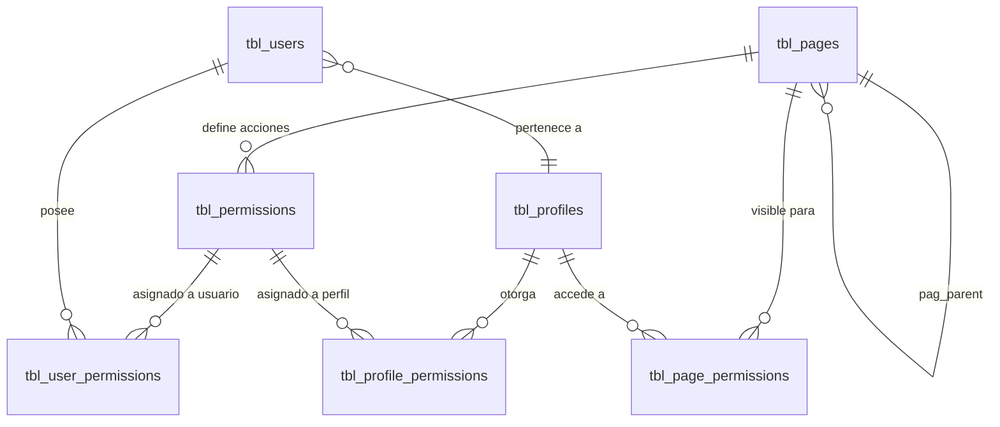

# ADR-0014: Autorización basada en permisos

## Estado

**Aceptado parcialmente / Propuesto.**

El modelo de datos de permisos existe y está poblado de estructura. La aplicación del permiso está implementada **únicamente en el frontend**. La decisión de aplicarlo en backend es una propuesta no implementada.

## Fecha

2026-09-10 — versión inicial.

## Contexto

Este ADR es transversal: gobierna todos los módulos del sistema, existentes y futuros.

El proceso de contratos involucra perfiles con responsabilidades muy distintas —interventoría, compras, contabilidad, administración— sobre la misma información. No basta con distinguir usuarios autenticados de anónimos: hay que distinguir qué puede hacer cada usuario autenticado sobre cada módulo.

La autenticación está resuelta en [ADR-0001](0001-seguridad.md). Este ADR se ocupa exclusivamente de lo que viene después: la decisión de permitir o negar una operación.

## Problema

Hoy el sistema tiene un modelo de permisos bien estructurado en base de datos y bien consumido por la interfaz, pero **ninguna verificación de permisos en el servidor**. La interfaz oculta botones que el backend ejecuta igual si se le invoca directamente.

Se requiere definir:

1. Qué se protege: ¿rutas, módulos, recursos, acciones?
2. Dónde se decide: ¿frontend, backend, base de datos?
3. Cómo se resuelven los permisos efectivos de un usuario cuando hay permisos de perfil y permisos individuales.
4. Qué acciones existen realmente en el sistema.

## Estado actual

### Modelo de datos

Cinco tablas componen el modelo, y es un modelo **de tres niveles**:

```text
tbl_pages          →  módulos / pantallas del sistema (jerárquicas: pag_parent)
tbl_permissions    →  acciones concretas, cada una perteneciente a una página (pag_id)
tbl_page_permissions   →  qué PÁGINAS ve un PERFIL
tbl_profile_permissions →  qué ACCIONES tiene un PERFIL
tbl_user_permissions    →  qué ACCIONES tiene un USUARIO concreto
```



`tbl_pages` almacena `pag_description`, `pag_url`, `pag_icon`, `pag_order`, `pag_name` y `pag_type` (comentado en el esquema como `1 PADRE, 2 HIJO`), además de `pag_parent`.

`tbl_permissions` almacena `per_name` y `per_order`, ligados a una página. El `AUTO_INCREMENT = 9` indica ocho permisos definidos en el origen, coincidentes con los ocho declarados en el frontend.

### Acciones realmente existentes

El volcado no incluye datos (`0 INSERT INTO`), por lo que los nombres de permiso se toman de la única fuente que los declara, `client/src/contexts/permissions/permissionsConfig.js`:

| `per_id` | Acción | Módulo |
| --- | --- | --- |
| 1 | Crear perfil | Seguridad / Perfiles |
| 2 | Modificar perfil | Seguridad / Perfiles |
| 3 | Eliminar perfil | Seguridad / Perfiles |
| 4 | Asignar permisos al perfil | Seguridad / Perfiles |
| 5 | Crear usuario | Seguridad / Usuarios |
| 6 | Modificar usuario | Seguridad / Usuarios |
| 7 | Eliminar usuario | Seguridad / Usuarios |
| 8 | Asignar permisos al usuario | Seguridad / Usuarios |

Las acciones realmente existentes en el sistema son, entonces, cuatro:

```text
CREAR
EDITAR
ELIMINAR   (lógica: sta_id = 3)
ASIGNAR PERMISOS
```

**No existen** permisos de `CONSULTAR`, `ACTIVAR`, `DESACTIVAR`, `EXPORTAR`, `CAMBIAR ESTADO`, `AUTORIZAR` ni `CONFIGURAR`.

Observaciones sobre esas ausencias:

- **CONSULTAR** está declarado en el frontend como `viewAll: null` y `onlyRead: null`. `null` significa, por la implementación de `hasPermission`, "no requiere permiso". La consulta es libre para todo usuario autenticado, y el control de acceso a la lectura recae exclusivamente en la visibilidad de la página (`tbl_page_permissions`).
- **ACTIVAR / DESACTIVAR** no son acciones separadas: el estado es un campo más dentro del formulario de edición, cubierto por el permiso de modificar.
- **EXPORTAR** no existe como acción ni como funcionalidad. `exceljs` y `excel4node` figuran en las dependencias del backend y existe `common/configs/excelJS.js`, pero **no se encontró evidencia** de ningún endpoint ni componente de exportación.

### Cómo se resuelven los permisos efectivos

En el login (`auth.service.js`) y en `verify_token` (`app.service.js`), los permisos del usuario se leen de **una sola tabla**:

```text
SELECT per_id FROM tbl_user_permissions WHERE use_id = ?
```

`tbl_profile_permissions` **no participa en la resolución en tiempo de ejecución**. Su único uso es como plantilla: al crear un usuario, `users.service.js` copia los permisos del perfil hacia el usuario:

```text
INSERT INTO tbl_user_permissions (per_id, use_id)
SELECT per_id, ? FROM tbl_profile_permissions WHERE pro_id = ?
```

La consecuencia es importante y probablemente no intencional: **los permisos de perfil son un valor inicial, no una fuente de verdad.** Modificar los permisos de un perfil no afecta a ningún usuario ya creado.

### Un cuarto mecanismo paralelo: campos CSV

`tbl_users.use_pages` y `tbl_profiles.pro_pages` son `varchar(255)` con lista de identificadores separados por coma. Se usan en `app.service.js`:

- `getMenu` — si `use_pages` tiene contenido, construye el menú con `WHERE pag_id IN (${ven})`, ignorando `tbl_page_permissions`; si está vacío, usa las páginas del perfil.
- `getUserPermissions` — resuelve rutas con `FIND_IN_SET(v.pag_id, u.use_pages)`.

Es decir, la visibilidad de páginas tiene **dos fuentes concurrentes** —la tabla relacional y el campo CSV desnormalizado— y el CSV tiene prioridad. Además, `use_pages` se interpola directamente en la consulta SQL.

### Aplicación del permiso en el frontend

`contexts/authContext.jsx` expone `hasPermission(perId)`:

```text
if (perId === null || perId === undefined) return true;   // acción sin permiso
if (!user) return false;
if (user.useId === 1) return true;                        // superusuario embebido
return permissions.includes(perId);
```

Las vistas la consumen contra el mapa de `permissionsConfig.js`. En `views/security/users/UsersPage.jsx`:

```text
const canCreate = hasPermission(permConfig.security.users.create);
const canEdit = hasPermission(permConfig.security.users.edit);
const canDelete = hasPermission(permConfig.security.users.delete);
const canAssignPermission = hasPermission(permConfig.security.users.assignPermission);
```

Esos valores gobiernan la visibilidad de botones y acciones de la tabla.

El guardia de ruta `routes/PrivateRoute.jsx` verifica **solo autenticación**, no permisos ni acceso a página. Cualquier usuario autenticado puede navegar a `/security/users` escribiendo la URL, aunque su perfil no tenga esa página asignada.

Los cambios de permisos se propagan en caliente: `permissions.service.js` emite `io.emit("update-permissions", { useId, updatedPermissions })` tras `updateUserPermissions`. La emisión es **global** (`io.emit`), no dirigida a la sala del usuario afectado, pese a que `socket.js` mantiene salas `user:<id>`.

### Aplicación del permiso en el backend

**No existe.**

Se revisaron todos los archivos de rutas del servidor: `auth.routes.js`, `app.routes.js`, `users.routes.js`, `profiles.routes.js`, `permissions.routes.js`, `document.routes.js`, `notifications.routes.js`, `template.routes.js`, `microsoftGraph.routes.js`, `mails.routes.js`.

El único middleware de protección utilizado es `verifyToken`. **No hay ningún middleware de verificación de permisos en el repositorio**, ni ninguna comprobación de `per_id` dentro de controladores o servicios.

Consecuencia concreta y verificable: un usuario autenticado sin ningún permiso puede ejecutar

```text
POST /api/security/users/save_user
PUT  /api/security/users/delete_user
POST /api/security/permissions/update_permissions_user
```

y crear usuarios, eliminarlos o **asignarse a sí mismo cualquier permiso**. La última operación convierte cualquier cuenta en administradora.

Situación agravada por `saveUser`: cuando recibe `ProfileMode`, ejecuta `UPDATE tbl_users SET ${field} = ?` con `field` tomado del cuerpo de la petición. Permite escribir cualquier columna de `tbl_users` —incluidas `pro_id`, `sta_id` y `use_password`— sobre cualquier usuario.

## Decisión

1. **El backend es la autoridad definitiva de autorización.** Toda ruta que ejecute una operación de negocio verifica el permiso requerido antes de ejecutarla. Una ruta sin verificación explícita de permiso se considera un defecto, no una ruta pública.

2. **La verificación se hace por middleware declarativo en la definición de la ruta**, no dentro del servicio. Ejemplo conceptual de la forma objetivo:

   ```text
   usersRoutes.post("/save_user", verifyToken, requirePermission(PERM.USERS.CREATE), saveUserController);
   ```

   Esto mantiene la autorización visible junto a la ruta y auditable de un vistazo.

3. **Los permisos efectivos se resuelven en el servidor a partir de la base de datos, en cada petición**, no desde el token ni desde el cuerpo de la petición. El JWT actual no contiene permisos, y esa decisión se mantiene: un token de 24 horas con permisos embebidos quedaría desactualizado ante cualquier cambio.

4. **`tbl_profile_permissions` es la fuente de verdad de los permisos del perfil; `tbl_user_permissions` expresa excepciones individuales.** El permiso efectivo es la unión de ambos. El modelo actual de "copiar al crear" se reemplaza por resolución en consulta.

5. **La visibilidad de páginas se resuelve exclusivamente por `tbl_page_permissions`.** Los campos `use_pages` y `pro_pages` se declaran obsoletos: son una fuente concurrente, desnormalizada y vector de inyección SQL.

6. **El frontend conserva `hasPermission` como control de experiencia de usuario**, y no como control de seguridad. Ocultar un botón es cortesía; negar la operación es responsabilidad del servidor.

7. **El catálogo de permisos se expone al frontend por API**, en lugar de duplicarse como constantes numéricas literales.

8. **No existen superusuarios embebidos en código.** El privilegio total, si se requiere, se expresa como un perfil con todos los permisos asignados.

9. **El conjunto de acciones se amplía solo cuando el módulo las necesita.** El catálogo objetivo para los módulos de negocio, derivado de los ADR de módulo, es: `CONSULTAR`, `CREAR`, `EDITAR`, `ELIMINAR`, `CAMBIAR ESTADO`, `ASIGNAR`, `EXPORTAR`. No se crean permisos sin funcionalidad que los use.

## Justificación

- **Backend como autoridad**: es el único punto por el que pasan obligatoriamente todas las operaciones. El frontend es código que se ejecuta en una máquina que el atacante controla; sus decisiones son sugerencias.
- **Middleware declarativo**: hace que la ausencia de autorización sea visible por inspección del archivo de rutas. Con la verificación enterrada en servicios, una ruta desprotegida pasa inadvertida — exactamente lo que ocurre hoy.
- **Resolución por consulta y no por token**: permite revocar un permiso con efecto inmediato. Con permisos en el JWT, un permiso retirado seguiría vigente hasta 24 horas.
- **Unión perfil + usuario**: el modelo de copia actual hace que los perfiles pierdan sentido en cuanto se usan. Un administrador que retira un permiso de un perfil espera razonablemente que afecte a quienes lo tienen; hoy no ocurre.
- **Eliminar los CSV**: `use_pages` no solo duplica información, sino que se interpola sin parametrizar en `getMenu`, convirtiendo un campo de datos en un vector de inyección.
- **Catálogo por API**: `permissionsConfig.js` acopla el frontend a identificadores numéricos de base de datos. Si un despliegue asigna otros ids, la interfaz autoriza acciones equivocadas de forma silenciosa.

## Alternativas consideradas

### Alternativa 1 — Permisos embebidos en el JWT

Incluir el arreglo de `per_id` como claim y verificar sin consultar la base.

- **A favor**: cero consultas adicionales por petición; el middleware queda trivial.
- **En contra**: los cambios de permiso no surten efecto hasta la expiración del token (24 h). Obliga a un mecanismo de revocación o a tokens de vida muy corta con refresh, que hoy no existe. Aumenta el tamaño del token.
- **Descartada.** El sistema ya paga una consulta por petición en `verifyToken`; añadir la resolución de permisos a esa misma consulta tiene coste marginal.

### Alternativa 2 — Autorización basada en roles (RBAC puro)

Verificar contra el perfil (`pro_id`) en lugar de contra permisos atómicos.

- **A favor**: mucho más simple; una comparación por ruta; sin tablas intermedias.
- **En contra**: el sistema ya invirtió en permisos granulares y en una interfaz de asignación (`PermissionsDrawer.jsx`). Retroceder a roles perdería la capacidad de excepciones individuales, que `tbl_user_permissions` sugiere ser un requisito real.
- **Descartada** por regresión funcional.

### Alternativa 3 — Autorización en la base de datos

Vistas restringidas, `row level security` o usuarios de base de datos por perfil.

- **A favor**: imposible de evadir desde la aplicación.
- **En contra**: MySQL 8 no ofrece seguridad a nivel de fila nativa. Exigiría vistas y procedimientos por perfil, con mantenimiento inviable. El proyecto usa un único usuario de base y pool compartido. **No se encontró evidencia** de procedimientos almacenados, disparadores ni vistas en el esquema.
- **Descartada.**

### Alternativa 4 — Middleware declarativo con resolución en BD (seleccionada)

- **A favor**: se apoya en el modelo de datos existente sin migrarlo; la autorización queda visible en las rutas; revocación inmediata; compatible con el frontend actual sin reescribirlo.
- **En contra**: una consulta adicional por petición, mitigable uniéndola a la que ya hace `verifyToken`.
- **Seleccionada.**

## Modelo arquitectónico

Flujo objetivo:

```text
Usuario
   │
   ├── Perfil ──> permisos del perfil   (tbl_profile_permissions)
   │
   └── Permisos individuales            (tbl_user_permissions)
              │
              └── permisos efectivos = unión de ambos
                        │
Acción en la interfaz
   │
   ├── hasPermission()  ──> muestra u oculta el control        [UX]
   │
   ▼
Petición HTTP
   │
   ▼
Backend
   ├── verifyToken            ──> ¿quién eres?        401 si no
   ├── requirePermission(P)   ──> ¿tienes P?          403 si no
   ├── validación de esquema  ──> ¿los datos valen?   400 si no
   ├── regla de negocio       ──> ¿es admisible?      409/422 si no
   ├── ejecuta la operación (transaccional)
   └── registra la auditoría  ──> ADR-0013
```

Estado actual, para contraste:

```text
Petición HTTP
   │
   ▼
Backend
   ├── verifyToken            ──> ¿quién eres?        401 si no
   └── ejecuta la operación                    ⚠ sin verificar permiso
```

## Reglas de negocio

Reglas vigentes en la implementación actual:

1. Un usuario pertenece a exactamente un perfil (`tbl_users.pro_id`).
2. Los permisos de un usuario recién creado se inicializan copiando los de su perfil.
3. Cambiar los permisos de un perfil no altera los de los usuarios ya existentes.
4. Cambiar el perfil de un usuario **no** recalcula sus permisos.
5. El usuario con `use_id = 1` es superusuario para el frontend, sin ningún respaldo en base de datos.
6. `profiles.service.js` impide que un usuario distinto de `use_id = 1` vea o modifique el perfil `pro_id = 1`.
7. Las acciones sin permiso asociado (`null`) están permitidas para cualquier usuario autenticado.
8. Eliminar un perfil borra físicamente sus filas de `tbl_page_permissions`, pero deja intactas las de `tbl_profile_permissions`, que quedan huérfanas.

Reglas objetivo adicionales:

9. El permiso efectivo es la unión de los permisos del perfil y los individuales.
10. Sin permiso explícito, la operación se deniega. La ausencia de configuración no concede acceso.
11. Un usuario no puede otorgarse a sí mismo un permiso que no posee.
12. Toda concesión o revocación de permiso queda auditada.

## Seguridad

Este ADR **es** el control de seguridad principal después de la autenticación. Los aspectos de identidad están en [ADR-0001](0001-seguridad.md).

Vectores de ataque abiertos por la ausencia de autorización en backend:

| Vector | Descripción |
| --- | --- |
| **Invocación directa de endpoint** | Ocultar el botón no oculta la ruta. Cualquier cliente HTTP alcanza `/api/security/users/save_user` |
| **Escalamiento vertical** | `POST /api/security/permissions/update_permissions_user` permite a cualquier usuario autenticado asignarse todos los permisos |
| **Escalamiento por columna arbitraria** | `saveUser` con `ProfileMode` permite escribir cualquier columna de `tbl_users`, incluida `pro_id` |
| **Escalamiento horizontal** | Los endpoints de cuenta toman `useId` del cliente; ver ADR-0001 |
| **Manipulación del guardia de ruta** | `isAuthenticated` se deriva de la cookie `idTEMPLATE`, escribible desde JavaScript |
| **Superusuario embebido** | `useId === 1` concede todo en el frontend sin verificación de servidor |
| **Fuga de permisos por socket** | `io.emit("update-permissions", ...)` difunde los permisos de un usuario a **todos** los clientes conectados |

## Autorización

Es el objeto de este ADR. Ver `Estado actual` y `Decisión`.

## Auditoría

**No se encontró evidencia** de auditoría de autorización. No se registra:

- Qué permiso se concedió o revocó, a quién, por quién y cuándo. `updateUserPermissions` y `updateProfilePermissions` ejecutan `DELETE` e `INSERT` sin dejar rastro.
- Los intentos de operación denegados — imposibles hoy, porque no hay denegación.
- Los cambios de perfil de un usuario.

`tbl_user_permissions`, `tbl_profile_permissions` y `tbl_page_permissions` **carecen por completo de columnas de auditoría**: solo tienen la clave primaria y las dos claves foráneas.

Ver [ADR-0013](0013-auditoria-trazabilidad.md).

## Validaciones

| Validación | Frontend | Backend | Base de datos | Clasificación |
| --- | --- | --- | --- | --- |
| Usuario autenticado | Sí (`PrivateRoute`) | Sí (`verifyToken`) | No aplica | Seguridad |
| Usuario tiene el permiso de la acción | Sí (`hasPermission`) | **No** | No aplica | **Seguridad — ausente en backend** |
| Página asignada al perfil | Parcial (solo menú) | **No** | No aplica | Seguridad — ausente |
| `per_id` existe | **No** | **No** | Sí (FK) | Integridad |
| Perfil existe y está activo | Sí (selector) | **No** | Sí (FK) | Integridad |
| Nombre de perfil único | **No** | Sí (`SELECT` previo) | **No — sin UNIQUE** | Integridad, mal ubicada |

## Integridad de datos

Claves foráneas presentes, todas con `ON DELETE RESTRICT ON UPDATE RESTRICT`:

- `tbl_permissions.pag_id` → `tbl_pages.pag_id`
- `tbl_page_permissions.pro_id` → `tbl_profiles.pro_id`
- `tbl_page_permissions.pag_id` → `tbl_pages.pag_id`
- `tbl_profile_permissions.per_id` → `tbl_permissions.per_id`
- `tbl_profile_permissions.pro_id` → `tbl_profiles.pro_id`
- `tbl_user_permissions.per_id` → `tbl_permissions.per_id`
- `tbl_user_permissions.use_id` → `tbl_users.use_id`

Debilidades:

- **Sin `UNIQUE` en los pares de las tablas de unión.** `(pro_id, per_id)`, `(use_id, per_id)` y `(pro_id, pag_id)` pueden duplicarse. La lógica aplicativa lo evita, pero nada lo impide bajo concurrencia.
- **Sin `UNIQUE` en `pro_name`.** La unicidad se verifica con un `SELECT` previo, sujeto a condición de carrera.
- **Colaciones mezcladas**: `tbl_permissions` es `utf8mb3_unicode_ci`, `tbl_page_permissions` y `tbl_profile_permissions` son `latin1_swedish_ci`, `tbl_documents` es `utf8mb4_0900_ai_ci`. Los `JOIN` entre columnas de colación distinta pueden impedir el uso de índices.
- **`tbl_pages.pag_parent` no tiene FK autorreferencial** y el código usa `pag_parent = 0` como raíz, mientras el esquema permite `NULL`. Dos convenciones de "sin padre" coexistiendo.

## Transacciones

`updateUserPermissions` y `updateProfilePermissions` operan bajo transacción explícita, calculando el diferencial entre el estado actual y el deseado (`toDelete` / `toInsert`). La atomicidad es correcta.

Dos observaciones:

- La lista `toDelete` se interpola en el `IN (...)` en lugar de parametrizarse. Los valores provienen de la base de datos, por lo que el riesgo de inyección es indirecto, pero rompe la consistencia del patrón.
- En `updateUserPermissions`, la emisión por socket ocurre **después** del `commit`. Es el orden correcto; si el `commit` falla no se notifica un cambio inexistente.

En `deleteProfile` hay una inconsistencia real: dentro de la transacción marca `sta_id = 3` y borra `tbl_page_permissions`, pero **no** borra `tbl_profile_permissions`. Las filas quedan huérfanas apuntando a un perfil eliminado.

## Consecuencias

### Positivas

- El modelo de datos ya soporta el objetivo: no requiere migración estructural, solo cambiar dónde se decide.
- La granularidad por acción y página es adecuada para el proceso de contratos, donde un mismo usuario consulta obras pero no las aprueba.
- La separación `routes` / `controller` / `service` permite insertar el middleware sin tocar la lógica de negocio.
- La interfaz de administración de permisos ya existe (`PermissionsDrawer.jsx`) y es reutilizable.
- La propagación por socket sienta la base de la actualización en caliente.

### Negativas

- El modelo tiene **cuatro** mecanismos concurrentes de autorización: permisos de perfil, permisos de usuario, páginas por perfil y los CSV `use_pages` / `pro_pages`. Tres de los cuatro son parcialmente redundantes.
- La copia de permisos al crear el usuario convierte el perfil en un valor por defecto y no en una política.
- El acoplamiento del frontend a identificadores numéricos hace frágil cualquier despliegue nuevo.
- Añadir la verificación a todas las rutas existentes exige definir el permiso de cada una, incluidas las que hoy no tienen ninguno declarado (documentos, notificaciones, `app/general`).

## Riesgos

| Riesgo | Severidad | Descripción |
| --- | --- | --- |
| Escalamiento vertical de privilegios | **Crítico** | Cualquier usuario autenticado puede asignarse todos los permisos vía `update_permissions_user` |
| Escritura de columna arbitraria | **Crítico** | `saveUser` con `ProfileMode` escribe cualquier columna de `tbl_users` sobre cualquier usuario |
| Autorización solo en cliente | **Crítico** | Toda operación de negocio es alcanzable por invocación directa |
| Inyección SQL vía `use_pages` | **Alto** | `getMenu` interpola el CSV directamente en `IN (...)` |
| Fuga de permisos por difusión global de socket | **Medio** | `io.emit` envía los permisos de un usuario a todos los clientes |
| Divergencia perfil/usuario | **Medio** | Los cambios de perfil no se propagan; el modelo deriva silenciosamente |
| Acoplamiento a ids numéricos | **Medio** | Un despliegue con otros ids autoriza acciones equivocadas sin error visible |
| Filas huérfanas | **Bajo** | `deleteProfile` no limpia `tbl_profile_permissions` |
| Duplicados en tablas de unión | **Bajo** | Sin `UNIQUE` en los pares |

## Impacto técnico

### Frontend

- `contexts/authContext.jsx` — `hasPermission`, estado de permisos, superusuario embebido.
- `contexts/permissions/permissionsConfig.js` — mapa de acciones a `per_id`; su comentario referencia `tbl_permisos` / `tbl_permisos_usuarios`, nombres que **no existen** (las tablas reales son `tbl_permissions` y `tbl_user_permissions`).
- `routes/PrivateRoute.jsx` — guardia solo de autenticación.
- `views/security/profiles/components/PermissionsDrawer.jsx` — interfaz de asignación.
- `views/security/users/UsersPage.jsx` y `views/security/profiles/ProfilePage.jsx` — consumidores de `hasPermission`.
- `layout/MainLayout/MenuList/` — construcción del menú desde `/api/app/get_menu`.
- `socket/SocketProvider.jsx` — recepción de `update-permissions`.

Impacto de la decisión: bajo. El frontend seguirá funcionando igual; solo dejará de ser la única barrera y deberá manejar respuestas `403`.

### Backend

- Requiere un middleware nuevo de verificación de permisos, hoy inexistente.
- Requiere declarar el permiso de cada ruta en los diez archivos `*.routes.js`.
- `modules/security/permissions/permissions.service.js` — resolución de permisos efectivos.
- `modules/app/general/app.service.js` — `getMenu` y `getUserPermissions` deben abandonar los CSV.
- `common/middlewares/authjwt.middleware.js` — punto natural para cargar los permisos efectivos en `req.user`.

### Base de datos

- Sin cambios estructurales obligatorios.
- Recomendable: `UNIQUE` sobre `(pro_id, per_id)`, `(use_id, per_id)`, `(pro_id, pag_id)` y `pro_name`.
- Recomendable: retirar `use_pages` y `pro_pages` una vez migrada la visibilidad a `tbl_page_permissions`.
- Requiere sembrar y versionar el catálogo de `tbl_pages` y `tbl_permissions`: hoy el volcado no contiene datos y el catálogo solo existe, implícitamente, en un archivo del frontend.

### Infraestructura

- La emisión de permisos debe dirigirse a la sala `user:<id>` en lugar de difundirse globalmente.
- El handshake de Socket.IO debe autenticarse antes de que la propagación de permisos sea confiable (ver ADR-0001).

## Estado actual vs arquitectura objetivo

| Aspecto | Estado actual | Arquitectura objetivo |
| --- | --- | --- |
| Punto de decisión | Frontend | Backend, con el frontend como capa de UX |
| Middleware de permisos | No existe | `requirePermission(...)` en cada ruta de negocio |
| Permisos efectivos | Solo `tbl_user_permissions` | Unión de perfil e individuales |
| Permisos de perfil | Plantilla copiada al crear | Fuente de verdad, resuelta en consulta |
| Visibilidad de páginas | `use_pages` CSV con prioridad sobre la tabla | Solo `tbl_page_permissions` |
| Catálogo de permisos | Constantes numéricas en el frontend | Expuesto por API desde `tbl_permissions` |
| Superusuario | `useId === 1` embebido en el frontend | Perfil con todos los permisos |
| Acciones | CREAR, EDITAR, ELIMINAR, ASIGNAR PERMISOS | + CONSULTAR, CAMBIAR ESTADO, ASIGNAR, EXPORTAR según módulo |
| Respuesta a operación no permitida | Se ejecuta | `403 Forbidden` |
| Auditoría de permisos | Ninguna | Registro de concesión y revocación |
| Propagación por socket | `io.emit` global | Dirigida a `user:<id>` |

## Brechas identificadas

| # | Brecha | Severidad |
| --- | --- | --- |
| B1 | Ninguna ruta del backend verifica permisos | **Crítica** |
| B2 | `update_permissions_user` permite autoconcesión de permisos | **Crítica** |
| B3 | `saveUser` con `ProfileMode` escribe columnas arbitrarias de `tbl_users` | **Crítica** |
| B4 | `getMenu` interpola `use_pages` sin parametrizar | **Alta** |
| B5 | Cuatro mecanismos concurrentes de autorización | **Alta** |
| B6 | Los permisos de perfil no se propagan a usuarios existentes | **Alta** |
| B7 | El catálogo de permisos vive en el frontend, no en la API | **Media** |
| B8 | Superusuario `useId === 1` embebido | **Media** |
| B9 | `io.emit` difunde permisos a todos los clientes | **Media** |
| B10 | Sin auditoría de cambios de permisos | **Media** |
| B11 | `deleteProfile` deja huérfanas las filas de `tbl_profile_permissions` | **Baja** |
| B12 | Sin `UNIQUE` en las tablas de unión ni en `pro_name` | **Baja** |
| B13 | Sin permisos de consultar, exportar ni cambiar estado | **Baja** — funcionalidad inexistente hoy |
| B14 | `tbl_pages` y `tbl_permissions` sin datos versionados | **Media** |

## Plan de implementación

Recomendación derivada del análisis. **No fue ejecutada.**

**Fase 1 — Contención (B2, B3)**
Restringir `update_permissions_user` y `update_permissions_profile` a quien posea el permiso de asignación, e impedir la autoasignación. Retirar o acotar `ProfileMode` a una lista blanca de columnas.

**Fase 2 — Middleware y catálogo (B1, B7, B14)**
Construir el middleware de permisos. Versionar el catálogo de `tbl_pages` y `tbl_permissions` como datos semilla. Exponerlo por API. Declarar el permiso requerido de cada ruta existente, empezando por `security/`.

**Fase 3 — Unificación del modelo (B5, B6, B4)**
Resolver los permisos efectivos como unión de perfil e individuales. Migrar la visibilidad de páginas a `tbl_page_permissions` y retirar `use_pages` / `pro_pages`.

**Fase 4 — Interfaz y propagación (B8, B9)**
Eliminar el superusuario embebido. Consumir el catálogo desde la API. Dirigir la emisión de socket a la sala del usuario. Manejar `403` de forma explícita en la interfaz.

**Fase 5 — Trazabilidad e integridad (B10, B11, B12)**
Auditar concesiones y revocaciones según ADR-0013. Corregir `deleteProfile`. Añadir las restricciones `UNIQUE`.

**Fase 6 — Ampliación (B13)**
Incorporar `CONSULTAR`, `CAMBIAR ESTADO`, `ASIGNAR` y `EXPORTAR` a medida que los módulos de negocio los requieran, según sus ADR.

## ADR relacionados

- [ADR-0001 — Seguridad](0001-seguridad.md)
- [ADR-0013 — Auditoría y trazabilidad](0013-auditoria-trazabilidad.md)
- Aplica a todos los ADR de módulo: [0002](0002-dashboard.md), [0003](0003-aseguradoras.md), [0004](0004-constructoras.md), [0005](0005-estados-contrato.md), [0006](0006-tipos-contrato.md), [0007](0007-tipos-interventoria.md), [0008](0008-tipos-identificacion.md), [0009](0009-tipos-direccion.md), [0010](0010-tipos-proveedor.md), [0011](0011-obras.md), [0012](0012-proveedores.md)

## Referencias

- `server/src/modules/security/permissions/` (`permissions.routes.js`, `permissions.controller.js`, `permissions.service.js`)
- `server/src/modules/security/users/users.service.js`, `server/src/modules/security/profiles/profiles.service.js`
- `server/src/modules/app/general/app.service.js`
- Todos los `server/src/modules/**/*.routes.js`
- `client/src/contexts/authContext.jsx`, `client/src/contexts/permissions/permissionsConfig.js`
- `client/src/routes/PrivateRoute.jsx`, `client/src/views/security/profiles/components/PermissionsDrawer.jsx`
- `client/src/views/security/users/UsersPage.jsx`
- `database/bdintervewebpack.sql`
