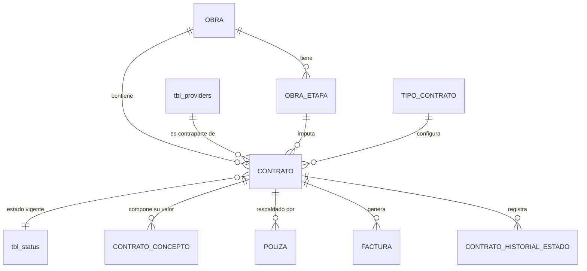

# ADR-0015: Contratos

## Estado

**Propuesto.**

La entidad contrato **no existe** en el código ni en el esquema. Este ADR documenta la decisión arquitectónica recomendada para el núcleo del sistema.

## Fecha

2026-09-10 — versión inicial.

## Contexto

El contrato es la entidad central del CORE. Sobre él se apoyan los conceptos económicos ([ADR-0016](0016-conceptos-contractuales.md)), los estados ([ADR-0017](0017-estados-contrato.md)), las pólizas ([ADR-0018](0018-polizas.md)) y toda la facturación ([ADR-0020](0020-facturacion.md)).

Un contrato pertenece simultáneamente a cuatro entidades:

```text
OBRA          →  el expediente en el que se ejecuta
PROVEEDOR     →  la contraparte contractual
ETAPA         →  la fase de la obra a la que se imputa
TIPO CONTRATO →  la configuración que determina qué campos aplican
```

Y declara un plazo contractual expresado en cinco atributos —plazo, unidad, frecuencia, fecha inicio, fecha fin— más una fecha de vencimiento, cuya relación entre sí es el problema técnico central de este ADR.

## Problema

Hay tres problemas distintos.

**1. El plazo es un dato calculado con múltiples orígenes de cambio.** La fecha fin depende del plazo, de la fecha de inicio, de las prórrogas de cada otrosí y del tiempo en suspensión. Si el cálculo vive en el frontend o se persiste sin recalcularse, el contrato muestra una fecha fin que no corresponde a su realidad contractual.

**2. `fecha fin` y `fecha vencimiento` son dos campos distintos sin semántica declarada.** Si son lo mismo, uno sobra y su divergencia será una fuente permanente de inconsistencia. Si son distintos, la diferencia debe declararse.

**3. El ámbito de unicidad del número de contrato no está definido.** Sin ámbito explícito, o se rechazan números legítimos o se admiten duplicados reales.

## Estado actual

**No se encontró evidencia de implementación.**

Verificado sobre el repositorio completo:

| Elemento | Resultado |
| --- | --- |
| Tabla de contratos en `bdintervewebpack.sql` | **No existe** |
| Módulo backend | **No existe** — `server/src/modules/` contiene `app`, `auth`, `microsoftGraph`, `security`, `template` |
| Vista frontend | **No existe** — `client/src/views/` contiene `dashboard`, `pages`, `sample-page`, `security`, `utilities` |
| Rutas en `main.routes.js` | **No existe** ninguna de contratos |
| Permisos en `permissionsConfig.js` | **No existen** |
| Coincidencias de dominio en el código | **Ninguna real.** Las únicas apariciones de "contrato", "anticipo" o "factura" son la constante `nameApp` ("Gestión, proveedores y anticipos") y rutas de SharePoint en `tbl_business_rules` |

Tampoco existen las entidades de las que el contrato dependería: **obra** ([ADR-0011](0011-obras.md)), **etapa de obra**, **tipo de contrato** ([ADR-0006](0006-tipos-contrato.md)). `tbl_providers` existe pero es una tabla huérfana que ningún código referencia ([ADR-0012](0012-proveedores.md)).

En consecuencia, respecto de las preguntas del alcance sobre el plazo:

| Pregunta | Respuesta |
| --- | --- |
| ¿Cómo se calcula la fecha final? | **No se encontró evidencia en la implementación actual** |
| ¿El cálculo es frontend o backend? | No aplica — no existe cálculo |
| ¿Se almacena la fecha fin o se calcula? | No aplica |
| ¿Qué sucede al modificar el plazo? | No aplica |
| ¿Qué sucede con un otrosí? | No aplica |
| ¿Qué sucede si el contrato está suspendido? | No aplica |
| ¿Diferencia entre fecha fin y fecha vencimiento? | **Indeterminable desde el código.** Ver decisión 6 |

Único elemento reutilizable encontrado: el proyecto incluye `dayjs`, `moment` y `moment-timezone` en el backend, y `date-fns` y `moment` en el frontend. No hay utilidades de cálculo de plazos construidas sobre ninguno de ellos.

## Decisión

1. **El contrato es la raíz del agregado económico.** Sus conceptos, pólizas y facturas cuelgan de él y no existen fuera de él.

2. **El contrato referencia obra, proveedor, etapa y tipo de contrato mediante claves foráneas obligatorias**, todas `ON DELETE RESTRICT`. La etapa debe pertenecer a la misma obra del contrato: es una invariante que el esquema no puede expresar y que se valida en el backend.

3. **El plazo se almacena como cantidad más unidad** (`DIA`, `MES`, `ANIO`). No se almacena en una unidad normalizada.

4. **`plazo`, `unidad` y `frecuencia` no son tres conceptos: son dos.** El alcance funcional enumera "Plazo", "Unidad del plazo" y "Frecuencia: días, meses, años", pero los valores de la frecuencia son exactamente los de la unidad. **Se adopta un único atributo `unidad`** y se descarta `frecuencia` como campo independiente.

   **Estado: Pendiente de validación.** Si `frecuencia` designa otra cosa —por ejemplo, la periodicidad de facturación o de informes de interventoría— es un concepto distinto que debe nombrarse como tal y no como unidad de plazo.

5. **La fecha fin es un valor derivado, calculado exclusivamente en el backend, y persistido.** Se recalcula y se reescribe en toda operación que afecte a sus insumos: cambio de fecha de inicio, cambio de plazo, alta o modificación de un otrosí con prórroga, y levantamiento de una suspensión.

6. **`fecha fin` y `fecha vencimiento` se declaran conceptos distintos**:

   | Concepto | Significado adoptado | Naturaleza |
   | --- | --- | --- |
   | **Fecha fin** | Último día del plazo contractual vigente, incluidas prórrogas y suspensiones | Derivada |
   | **Fecha vencimiento** | Fecha límite de una obligación asociada al contrato, distinta del fin de ejecución | **Pendiente de definición** |

   **Estado: Pendiente de validación.** No existe evidencia que permita determinar a qué obligación se refiere la fecha de vencimiento. Las tres lecturas plausibles son: vencimiento de la vigencia de pólizas —que ya tiene su propia fecha en [ADR-0018](0018-polizas.md) y sería redundante—, plazo límite para liquidar tras el fin de ejecución, o fecha de vencimiento de pago. **Hasta que se defina, el campo no debe implementarse.** Un campo sin semántica declarada se llena con criterios distintos por cada usuario y queda inservible.

7. **La suspensión detiene el cómputo del plazo.** La fecha fin se desplaza por el número de días en suspensión al levantarla. Mientras el contrato está suspendido y sin fecha de levantamiento, la fecha fin queda congelada en su último valor calculado y se marca como provisional.

   **Estado: Pendiente de validación.** La alternativa —que el plazo siga corriendo durante la suspensión— es admisible en algunos regímenes contractuales. Es una decisión de negocio, no técnica.

8. **Las prórrogas de los otrosí extienden el plazo de forma acumulativa.** La fecha fin vigente resulta del plazo inicial más la suma de las prórrogas de todos los otrosí, más los días de suspensión.

9. **El número de contrato es único dentro de la obra**, garantizado por `UNIQUE (obra, número)` en la base de datos.

   **Estado: Pendiente de validación.** La alternativa es unicidad global. Ver `Alternativas consideradas`.

10. **El contrato no almacena su valor.** El valor vigente es la suma de sus conceptos económicos y se calcula. Ver [ADR-0016](0016-conceptos-contractuales.md) y la sección `Fuente de verdad`.

11. **La eliminación del contrato es lógica** mediante `sta_id = 3`, y está **bloqueada si tiene facturas registradas**, con independencia de su estado.

12. **Todo cálculo de fechas se ejecuta en el backend con zona horaria explícita.** El frontend puede previsualizar, pero el valor persistido es siempre el del servidor.

## Justificación

- **Cálculo en backend**: la fecha fin determina cuándo un contrato pasa a liquidación y qué facturas son admisibles. Calcularla en el navegador la expone al reloj y la zona horaria del cliente, y a que dos usuarios vean fechas distintas para el mismo contrato. El proyecto ya tiene un antecedente de esta clase de deriva: `winston.config.js` fuerza `America/Bogota` para los registros, pero **la conexión a la base de datos no fija zona horaria**, por lo que las marcas de tiempo dependen de la configuración del servidor MySQL.

- **Derivar y además persistir**: es una desnormalización deliberada. La fecha fin se consulta en listados, filtros y en los indicadores de vencimiento del dashboard ([ADR-0002](0002-dashboard.md)); recalcularla en cada consulta impediría indexarla y haría inviable filtrar por rango. El coste es la obligación de recalcularla en cada evento que la afecte, que se asume explícitamente en la decisión 5.

- **Descartar `frecuencia`**: mantener dos campos con los mismos valores posibles garantiza que alguna vez discreparán, y entonces nadie sabrá cuál manda. Es preferible declarar la duplicación y preguntarla que arrastrarla.

- **No implementar `fecha vencimiento` sin definirla**: es la decisión más contraintuitiva de este ADR y la más importante. Un campo de fecha sin semántica no es un campo vacío: es un campo que cada usuario llenará con lo que crea que significa, y sobre el que después se construirán alertas y reportes. Es más barato no tenerlo que tenerlo mal.

- **Unicidad en base de datos**: el patrón que el proyecto aplica hoy en `saveUser` y `saveProfile` —`SELECT` previo dentro de la transacción— no previene duplicados bajo concurrencia, como se demuestra en [ADR-0012](0012-proveedores.md). El esquema actual **no tiene ninguna restricción `UNIQUE`**. Para el número de contrato, un duplicado es un defecto grave: dos contratos con el mismo número dentro de una obra hacen ambiguo cualquier documento que los referencie.

- **La etapa debe pertenecer a la obra**: una clave foránea a la tabla de etapas garantiza que la etapa exista, pero no que sea de esa obra. Es una invariante de coherencia entre dos ramas del mismo árbol, y solo el backend puede verificarla.

- **Bloqueo de eliminación con facturas**: una factura es un documento con efectos contables. El contrato es su contraparte y debe permanecer identificable.

## Alternativas consideradas

### Alternativa 1 — Fecha fin capturada manualmente

El usuario escribe la fecha fin; el plazo es informativo.

- **A favor**: sin lógica de cálculo; contempla cualquier acuerdo contractual, por irregular que sea; el usuario tiene control total.
- **En contra**: plazo y fecha fin pueden contradecirse sin que nada lo detecte; las prórrogas de los otrosí no se reflejan solas; las suspensiones exigen recálculo manual y se olvidan. Convierte un dato derivable en una fuente de error humano recurrente.
- **Descartada.**

### Alternativa 2 — Fecha fin calculada en cada consulta, sin persistir

Se deriva al vuelo desde plazo, prórrogas y suspensiones.

- **A favor**: imposible que quede desactualizada; una sola fuente de verdad; sin recálculos que mantener.
- **En contra**: no se puede indexar ni filtrar por rango de fecha fin sin recorrer todos los contratos y sus conceptos; los indicadores de vencimiento del dashboard tendrían que agregar sobre el cálculo completo. Con volumen, es inviable.
- **Descartada** como mecanismo único. Su lógica **sí se conserva**: la función de cálculo es la misma, y debe poder ejecutarse para verificar que el valor persistido coincide con el derivado. Esa verificación es la base del proceso de conciliación de la Fase 6 del plan.

### Alternativa 3 — Derivada, persistida y recalculada por evento (seleccionada)

- **A favor**: indexable y filtrable; siempre coherente con sus insumos; el cálculo vive en un único punto del backend; permite conciliación posterior.
- **En contra**: obliga a identificar exhaustivamente los eventos que afectan la fecha fin; olvidar uno produce deriva silenciosa.
- **Seleccionada.**

### Alternativas para el ámbito de unicidad del número

| | Ámbito | A favor | En contra |
| --- | --- | --- | --- |
| **A** | Global | Un número identifica un contrato sin ambigüedad en todo el sistema; simplifica búsquedas y referencias externas | Si los números los asigna cada obra o cada constructora, se producirán colisiones legítimas que el sistema rechazará sin motivo real |
| **B** | Por obra **(seleccionada)** | Corresponde a la práctica de numerar contratos dentro de un expediente; evita colisiones entre obras independientes | Un mismo número existe en varias obras: toda referencia externa debe incluir la obra |
| **C** | Por obra y proveedor | Máxima permisividad | Admite duplicados dentro de la misma obra, que es precisamente lo que hay que impedir |

Se selecciona **B** por corresponder a la práctica habitual de numeración por expediente, y se marca como pendiente de validación por ser una decisión de negocio.

## Modelo arquitectónico

Modelo propuesto. **Ninguna de estas tablas existe hoy**, salvo `tbl_providers` y `tbl_status`.



```text
CONTRATO
  ├── obra                FK  NOT NULL
  ├── proveedor           FK  NOT NULL
  ├── etapa               FK  NOT NULL   (debe pertenecer a la obra)
  ├── tipo de contrato    FK  NOT NULL
  ├── nombre
  ├── número                          UNIQUE (obra, número)
  ├── plazo               entero
  ├── unidad              DIA | MES | ANIO
  ├── fecha inicio        capturada
  ├── fecha fin           DERIVADA y persistida
  ├── días suspendidos    acumulador, insumo del cálculo
  ├── sta_id              → tbl_status
  └── auditoría estándar

  ✗ NO almacena valor del contrato   → ver ADR-0016
  ✗ NO almacena saldos               → ver ADR-0024 y ADR-0025
  ✗ fecha vencimiento                → no se implementa hasta definir su semántica
```

Cálculo de la fecha fin, expresado como decisión:

```text
fecha_fin = fecha_inicio
          + plazo_inicial (en su unidad)
          + Σ prórrogas de todos los otrosí
          + días acumulados en suspensión

Recalcular cuando ocurra CUALQUIERA de estos eventos:
  · cambio de fecha de inicio
  · cambio de plazo o unidad
  · alta, modificación o baja de un otrosí con prórroga
  · levantamiento de una suspensión

Siempre en backend, dentro de la transacción del evento que lo dispara.
```

## Reglas de negocio

**No se encontró evidencia en la implementación actual.** Reglas propuestas:

1. Un contrato pertenece a exactamente una obra, un proveedor, una etapa y un tipo de contrato.
2. La etapa del contrato debe pertenecer a la obra del contrato.
3. El proveedor debe estar activo y asignado a la obra del contrato ([ADR-0012](0012-proveedores.md)).
4. El número de contrato es único dentro de la obra.
5. El plazo es un entero positivo con unidad `DIA`, `MES` o `ANIO`.
6. La fecha fin se deriva y nunca se captura manualmente.
7. La fecha fin nunca es anterior a la fecha de inicio.
8. Las prórrogas de los otrosí son acumulativas.
9. La suspensión detiene el cómputo del plazo.
10. Un contrato se crea en estado `EN EJECUCIÓN` ([ADR-0017](0017-estados-contrato.md)).
11. Todo contrato nace con exactamente un concepto de tipo `VALOR INICIAL` ([ADR-0016](0016-conceptos-contractuales.md)).
12. El valor vigente del contrato es la suma de sus conceptos.
13. Un contrato con facturas registradas no puede eliminarse.
14. Un contrato `LIQUIDADO` no admite modificación de sus datos contractuales.
15. Los campos obligatorios del contrato dependen de su tipo de contrato ([ADR-0006](0006-tipos-contrato.md)).

## Seguridad

El contrato determina los importes admisibles de toda la facturación asociada. Manipularlo tiene consecuencia patrimonial directa.

- Todas las operaciones exigen sesión y permiso verificados **en el backend**. **Ninguna ruta del sistema actual verifica permisos** ([ADR-0014](0014-autorizacion-permisos.md)): el contrato no puede implementarse sobre esa base.
- Los identificadores de obra, proveedor, etapa y tipo de contrato recibidos del cliente deben validarse como existentes, activos y coherentes entre sí. Aceptarlos sin verificar permite asociar un contrato a una etapa de otra obra mediante una petición manipulada.
- **La fecha fin nunca se acepta desde el cliente.** Si el cliente la envía, se ignora. Aceptarla permitiría extender un contrato sin otrosí.
- El plazo, la fecha de inicio y el número de contrato son campos con efecto contractual: su modificación requiere permiso y queda auditada.
- **Consultas parametrizadas obligatorias.** El patrón vigente en `paginationUsers` interpola once parámetros del cliente directamente en la cadena SQL, incluidos `sortField`, `rows` y `first`. El listado de contratos tendrá más filtros que ese; replicar el patrón sería explotable.
- Los cuatro endpoints de `microsoftGraph.routes.js` (`get_sites_drive`, `get_user_drive`, `get_units_drive`, `get_folders_drive`) **no tienen `verifyToken`** y exponen la estructura de SharePoint sin autenticación. Es un hallazgo ajeno a este ADR, registrado por su relación con el almacenamiento de facturas.

## Autorización

Permisos propuestos:

```text
CONSULTAR CONTRATOS
CREAR CONTRATO
EDITAR CONTRATO
ELIMINAR CONTRATO
```

Las acciones de suspender, reactivar, crear otrosí, liquidar y gestionar pólizas tienen permisos propios definidos en [ADR-0017](0017-estados-contrato.md), [ADR-0016](0016-conceptos-contractuales.md) y [ADR-0018](0018-polizas.md), porque no son ediciones del contrato sino operaciones de negocio con consecuencias distintas.

**Ninguno de estos permisos existe hoy.** El catálogo real del sistema son ocho permisos (`per_id` 1 a 8) sobre perfiles y usuarios, declarados en `client/src/contexts/permissions/permissionsConfig.js`.

## Auditoría

**Nivel requerido: auditoría funcional** para los datos con efecto contractual.

| Información | Nivel |
| --- | --- |
| Número de contrato | **Funcional** |
| Plazo y unidad | **Funcional** |
| Fecha de inicio | **Funcional** |
| Fecha fin | **Funcional** — con marca de si el cambio fue derivado o por captura de sus insumos |
| Proveedor, obra, etapa, tipo de contrato | **Funcional** |
| Estado | **Funcional** — ver [ADR-0017](0017-estados-contrato.md) |
| Nombre y observaciones | Técnica |

Requisito heredado de [ADR-0013](0013-auditoria-trazabilidad.md) y no negociable aquí: **el autor debe tomarse de `req.user`**. En el backend actual, todos los servicios reciben el autor desde `req.body` (`useBy`, `updatedBy`, `docCreateBy`), lo que hace la auditoría falsificable. Para información contractual eso invalida su valor probatorio.

Las columnas `*_create_by` y `*_update_by` del esquema actual **no tienen clave foránea a `tbl_users`**.

## Validaciones

| Validación | Frontend | Backend | Base de datos | Clasificación |
| --- | --- | --- | --- | --- |
| Obra, proveedor, etapa y tipo obligatorios | Propuesta (selectores) | Propuesta | `NOT NULL` + FK | Integridad |
| La etapa pertenece a la obra | Propuesta (filtra el selector) | **Propuesta — obligatoria** | No expresable | **Integridad + Regla de negocio** |
| El proveedor está asignado a la obra | Propuesta (filtra el selector) | **Propuesta — obligatoria** | No expresable | Regla de negocio |
| Número de contrato obligatorio | Propuesta | Propuesta | `NOT NULL` | UX + Integridad |
| Número único en la obra | Propuesta (aviso) | Propuesta (+ manejo de `ER_DUP_ENTRY`) | **`UNIQUE (obra, número)`** | **Integridad** |
| Plazo entero positivo | Propuesta | **Propuesta — obligatoria** | `CHECK` | Regla de negocio |
| Unidad dentro del dominio | Propuesta (selector) | Propuesta | `ENUM` o FK | Integridad |
| Fecha fin ≥ fecha inicio | No aplica (derivada) | **Propuesta — obligatoria** | `CHECK` | Regla de negocio |
| Fecha fin no capturada por el cliente | No aplica | **Propuesta — obligatoria** | No expresable | **Seguridad** |
| Campos obligatorios según el tipo de contrato | Propuesta | **Propuesta — obligatoria** | No expresable | Regla de negocio — [ADR-0006](0006-tipos-contrato.md) |
| Sin facturas antes de eliminar | Propuesta (aviso) | **Propuesta — obligatoria** | No expresable | Regla de negocio |
| Permiso de la acción | Propuesta (oculta) | **Propuesta — obligatoria** | No aplica | **Seguridad** |

## Integridad de datos

Requisitos propuestos:

- `UNIQUE (obra, número)`.
- FK a obra, proveedor, etapa, tipo de contrato y `tbl_status`, todas `ON DELETE RESTRICT` —coherente con las siete claves foráneas existentes en el esquema, todas `RESTRICT`—.
- `CHECK` sobre plazo positivo y sobre `fecha_fin >= fecha_inicio`. MySQL 8 los soporta y **el esquema actual no usa ninguno**.
- Índices sobre obra, proveedor, estado, fecha fin y número.
- `utf8mb4` con colación consistente. El esquema actual mezcla `latin1`, `utf8mb3` y `utf8mb4`; `tbl_users` es `latin1_swedish_ci` y `tbl_providers` es `utf8mb4_0900_ai_ci`, lo que degrada los `JOIN` entre ellas.
- **No existen migraciones versionadas** en el proyecto: el único artefacto de esquema es un volcado de Navicat. Crear el CORE sin adoptarlas hace el cambio irreproducible entre entornos.

## Transacciones

La creación de un contrato **no es una escritura**: es al menos tres, más la auditoría.

```text
BEGIN
  INSERT contrato
  INSERT concepto VALOR INICIAL          → ADR-0016
  INSERT pólizas asociadas, si se capturan → ADR-0018
  INSERT historial de estado (EN EJECUCIÓN) → ADR-0017
  INSERT auditoría funcional
COMMIT
```

Sin atomicidad, un fallo intermedio deja un contrato sin concepto inicial —es decir, **un contrato sin valor**— que no se distingue de uno legítimamente vacío. Ver [ADR-0027](0027-integridad-transaccional.md), que gobierna esta materia para todo el CORE.

**Precaución específica y verificada:** `executeQuery` en `server/src/common/configs/db.config.js` **toma una conexión nueva del pool si no se le pasa una como tercer parámetro**. Una escritura que omita ese parámetro se confirma de forma independiente y **sobrevive al `rollback`**. En la creación de un contrato eso produciría exactamente el registro huérfano que la transacción pretende evitar.

## Concurrencia

Dos escenarios relevantes para este ADR:

**1. Números de contrato duplicados.** Dos usuarios registran simultáneamente el contrato número 15 en la misma obra. Con el patrón `SELECT`-luego-`INSERT` del proyecto y sin `UNIQUE`, ambos tienen éxito. Con `UNIQUE (obra, número)`, el motor rechaza el segundo y el backend traduce `ER_DUP_ENTRY` a un `409` — `error.middleware.js` **ya implementa esa traducción**; lo que falta es la restricción que la dispare.

**2. Recálculo de fecha fin bajo modificación concurrente.** Un usuario registra un otrosí con prórroga mientras otro levanta una suspensión. Ambos recalculan la fecha fin desde el estado que leyeron, y el último en escribir descarta el efecto del primero.

La protección adoptada es **bloqueo pesimista sobre la fila del contrato**: toda operación que recalcule la fecha fin abre la transacción con `SELECT ... FOR UPDATE` sobre el contrato. Las operaciones concurrentes se serializan sobre esa fila. Es la misma protección que [ADR-0024](0024-amortizacion-anticipo.md) y [ADR-0025](0025-retenciones.md) aplican a los saldos, y por la misma razón: el contrato es el punto natural de serialización de todo su agregado.

## Fuente de verdad

| Dato | Naturaleza | Fuente de verdad | Momento de actualización |
| --- | --- | --- | --- |
| Número, nombre, plazo, unidad, fecha inicio | **Almacenado** | Captura del usuario | Al guardar |
| Obra, proveedor, etapa, tipo de contrato | **Almacenado** | Selección del usuario | Al guardar |
| **Fecha fin** | **Derivado y persistido** | Función de cálculo del backend | En cada evento que afecte sus insumos |
| **Días en suspensión** | **Derivado y persistido** | Historial de suspensiones ([ADR-0017](0017-estados-contrato.md)) | Al levantar cada suspensión |
| **Estado** | **Almacenado** | Máquina de estados ([ADR-0017](0017-estados-contrato.md)) | En cada transición |
| **Valor vigente del contrato** | **Calculado, nunca almacenado** | Suma de conceptos ([ADR-0016](0016-conceptos-contractuales.md)) | En cada consulta |
| **Anticipo, retenido, saldos** | **Calculado, nunca almacenado** | Movimientos ([ADR-0024](0024-amortizacion-anticipo.md), [ADR-0025](0025-retenciones.md)) | En cada consulta |
| Fecha vencimiento | **Pendiente de definición** | — | — |

La distinción que gobierna la tabla: **la fecha fin se persiste porque se filtra e indexa; los valores económicos no se persisten porque su exactitud importa más que su velocidad de consulta.**

## Inmutabilidad

Tras la aprobación de la primera factura del contrato, quedan inmutables:

```text
Obra
Proveedor
Número de contrato
```

Cambiar cualquiera de los tres después de que existan documentos contables reasignaría esos documentos a otra contraparte o a otro expediente.

Tras el estado `LIQUIDADO`, queda inmutable **la totalidad de los datos contractuales**: plazo, fechas, tipo de contrato y etapa. La única salida es la reapertura, con permiso propio ([ADR-0017](0017-estados-contrato.md)).

Modificable durante la ejecución, con auditoría funcional: nombre, plazo, unidad, fecha de inicio, etapa y tipo de contrato.

**Toda corrección posterior a la aprobación de una factura se hace por movimiento nuevo, nunca por edición en sitio.** Ver [ADR-0026](0026-calculos-facturacion.md) y [ADR-0020](0020-facturacion.md).

## Consecuencias

### Positivas

- La fecha fin es siempre coherente con plazo, prórrogas y suspensiones, sin intervención manual.
- El cálculo vive en un único punto del backend y es verificable por conciliación.
- El valor del contrato no puede desincronizarse de sus conceptos, porque no se almacena.
- La unicidad del número está garantizada por el motor y no por disciplina aplicativa.
- El bloqueo sobre la fila del contrato da un punto de serialización único para todo el agregado.

### Negativas

- Obliga a identificar exhaustivamente los eventos que afectan la fecha fin; omitir uno produce deriva silenciosa.
- El bloqueo pesimista serializa operaciones sobre el mismo contrato y puede generar contención en contratos con alta actividad de facturación.
- No implementar `fecha vencimiento` deja un requisito del alcance funcional sin cubrir hasta que se defina.
- Depende de cuatro entidades que no existen: obra, etapa, tipo de contrato y el módulo de proveedores.

## Riesgos

| Riesgo | Severidad | Descripción |
| --- | --- | --- |
| Fecha fin calculada en el frontend | **Alto** | Dependería del reloj y la zona horaria del cliente; determina qué facturas son admisibles |
| Fecha fin aceptada desde el cliente | **Alto** | Permitiría extender un contrato sin otrosí mediante una petición manipulada |
| Evento de recálculo omitido | **Alto** | Deriva silenciosa entre la fecha fin persistida y la real |
| Números de contrato duplicados | **Alto** | Sin `UNIQUE`, el patrón del proyecto no lo impide bajo concurrencia |
| Contrato sin concepto inicial | **Alto** | Un fallo intermedio sin transacción deja un contrato sin valor |
| Escritura fuera de la transacción | **Alto** | `executeQuery` sin conexión toma otra del pool y sobrevive al `rollback` |
| Etapa de otra obra | **Medio** | La FK no verifica la coherencia entre ramas del árbol |
| `fecha vencimiento` implementada sin semántica | **Medio** | Se llenaría con criterios distintos por usuario y se construirían alertas sobre un dato inconsistente |
| Ambigüedad plazo/unidad/frecuencia | **Medio** | Dos campos con los mismos valores acabarán discrepando |
| Sin autorización en backend | **Crítico** | Estado actual del sistema: ninguna ruta verifica permisos |
| Inyección SQL en el listado | **Alto** | Si se replica el patrón de `paginationUsers` |

## Impacto técnico

### Frontend

- Módulo completo inexistente: listado, formulario y vista de expediente.
- El formulario debe alimentarse con los descriptores de campo del tipo de contrato ([ADR-0006](0006-tipos-contrato.md)), consumibles por `client/src/ui-component/extended/GenericFormSection.jsx`, que ya soporta `date`, `number`, `currency` y `dropdown`.
- La fecha fin se muestra **solo lectura**, con indicación de su origen derivado.
- Los selectores de etapa y proveedor deben filtrarse por la obra seleccionada.
- `DataTable.jsx`, `FilterPopper.jsx`, `BaseDialog.jsx`, `ConfirmDialog.jsx`, `StatusChip.jsx` y `StatusTabs.jsx` son reutilizables.
- `date-fns` y `moment` están disponibles para previsualización, nunca para el valor persistido.

### Backend

- Módulo completo con `routes` / `controller` / `service`, inexistente.
- Una función única de cálculo de fecha fin, invocada por todos los eventos que la afectan.
- `dayjs`, `moment` y `moment-timezone` están disponibles.
- Consultas parametrizadas y lista blanca para el campo de ordenamiento.
- Verificación de coherencia etapa-obra y proveedor-obra.

### Base de datos

- Tabla nueva, inexistente. Depende de obra, etapa, tipo de contrato y del módulo de proveedores.
- Requiere `UNIQUE`, `CHECK` y zona horaria explícita en la conexión — ninguno presente hoy.
- Sin migraciones versionadas.

### Infraestructura

- **No se encontró evidencia** de Redis, colas ni bus de eventos. El recálculo de la fecha fin se implementa como llamada directa dentro de la transacción, no como evento asíncrono.
- El cron (`server/src/cron/index.js`) está implementado **con la lista de tareas vacía** y su arranque comentado en `server.js`. Sería el lugar del proceso de conciliación de fechas, no del cálculo.

## Arquitectura objetivo

| Área | Actual | Objetivo | Brecha |
| --- | --- | --- | --- |
| Entidad contrato | No existe | Raíz del agregado económico | **Alta** |
| Fecha fin | No existe | Derivada en backend, persistida, recalculada por evento | **Alta** |
| Fecha vencimiento | No existe | No se implementa hasta definir su semántica | **Media** |
| Plazo / unidad / frecuencia | No existe | Dos atributos: plazo y unidad | **Media** |
| Unicidad del número | No existe | `UNIQUE (obra, número)` | **Alta** |
| Valor del contrato | No existe | Calculado desde conceptos, nunca almacenado | **Alta** |
| Coherencia etapa-obra | No existe | Validada en backend | **Media** |
| Permisos | Solo 8, sobre usuarios y perfiles | Cuatro acciones propias, verificadas en backend | **Crítica** |
| Auditoría | Autor desde el body | Autor desde el token, auditoría funcional | **Alta** |
| Transacciones | Patrón correcto en seguridad | Extendido a cinco tablas | **Alta** |
| Concurrencia | Sin protección | Bloqueo pesimista sobre la fila del contrato | **Alta** |

## Brechas identificadas

| # | Brecha | Severidad |
| --- | --- | --- |
| B1 | La entidad contrato no existe en ninguna capa | **Alta** |
| B2 | No existen obra, etapa de obra ni tipo de contrato | **Alta** — bloqueante |
| B3 | `tbl_providers` es una tabla huérfana sin módulo | **Alta** — bloqueante |
| B4 | Semántica de `fecha vencimiento` sin definir | **Media** — decisión de negocio pendiente |
| B5 | Ambigüedad entre `unidad` y `frecuencia` | **Media** — decisión de negocio pendiente |
| B6 | Efecto de la suspensión sobre el plazo sin confirmar | **Media** — decisión de negocio pendiente |
| B7 | Ámbito de unicidad del número sin confirmar | **Media** — decisión de negocio pendiente |
| B8 | Sin restricciones `UNIQUE` ni `CHECK` en todo el esquema | **Alta** |
| B9 | Ninguna ruta del backend verifica permisos | **Crítica** |
| B10 | El autor de la auditoría proviene del cliente | **Alta** |
| B11 | `executeQuery` sin conexión escapa de la transacción | **Alta** — preventiva |
| B12 | Patrón de listados con interpolación SQL | **Alta** — preventiva |
| B13 | Zona horaria no explícita en la conexión a base de datos | **Media** |
| B14 | Sin migraciones versionadas | **Media** |
| B15 | Rutas de `microsoftGraph` sin `verifyToken` | **Alta** — ajena a este ADR |

## Plan de implementación

Recomendación derivada del análisis. **No fue ejecutada.**

**Fase 0 — Prerrequisitos (B2, B3, B9, B14)**
Obra, etapa, tipo de contrato y módulo de proveedores. Autorización en backend ([ADR-0014](0014-autorizacion-permisos.md)). Migraciones versionadas. **Ninguna parte del CORE debe construirse antes de que exista autorización en el servidor.**

**Fase 1 — Decisiones de negocio (B4, B5, B6, B7)**
Semántica de `fecha vencimiento`, relación entre unidad y frecuencia, efecto de la suspensión sobre el plazo, y ámbito de unicidad del número.

**Fase 2 — Modelo de datos (B8, B13)**
Tabla de contratos con `UNIQUE`, `CHECK`, FK e índices. Zona horaria explícita en la conexión.

**Fase 3 — Cálculo del plazo (B11)**
Función única de cálculo de fecha fin. Revisión explícita de que toda escritura use la conexión de la transacción.

**Fase 4 — Servicio transaccional**
Creación atómica de contrato, concepto inicial, pólizas e historial, según [ADR-0027](0027-integridad-transaccional.md).

**Fase 5 — Concurrencia**
Bloqueo pesimista sobre la fila del contrato en toda operación del agregado.

**Fase 6 — Interfaz y conciliación (B12)**
Listado con consultas parametrizadas. Proceso programado que **reporte** discrepancias entre la fecha fin persistida y la derivada, sin corregirlas en silencio.

## ADR relacionados

- [ADR-0016 — Conceptos contractuales](0016-conceptos-contractuales.md) — composición económica
- [ADR-0017 — Estados de contrato](0017-estados-contrato.md) — ciclo de vida; reemplaza a ADR-0005
- [ADR-0018 — Pólizas](0018-polizas.md)
- [ADR-0020 — Facturación](0020-facturacion.md)
- [ADR-0027 — Integridad transaccional del CORE](0027-integridad-transaccional.md)
- [ADR-0011 — Obras](0011-obras.md) · [ADR-0012 — Proveedores](0012-proveedores.md) · [ADR-0006 — Tipos de contrato](0006-tipos-contrato.md)
- [ADR-0013 — Auditoría](0013-auditoria-trazabilidad.md) · [ADR-0014 — Autorización](0014-autorizacion-permisos.md)

## Referencias

- `database/bdintervewebpack.sql` — 14 tablas, ninguna del CORE; sin `UNIQUE`, `CHECK`, disparadores ni procedimientos
- `server/src/modules/main.routes.js` — sin rutas de contratos
- `server/src/common/configs/db.config.js` — `executeQuery` y el manejo de conexiones del pool
- `server/src/modules/security/users/users.service.js` — `paginationUsers`, patrón de interpolación a no replicar
- `server/src/common/middlewares/error.middleware.js` — traducción de `ER_DUP_ENTRY` a `409`
- `server/src/common/configs/winston.config.js` — zona horaria `America/Bogota` aplicada solo a registros
- `server/src/modules/microsoftGraph/microsoftGraph.routes.js` — rutas sin `verifyToken`
- `client/src/ui-component/extended/GenericFormSection.jsx`
