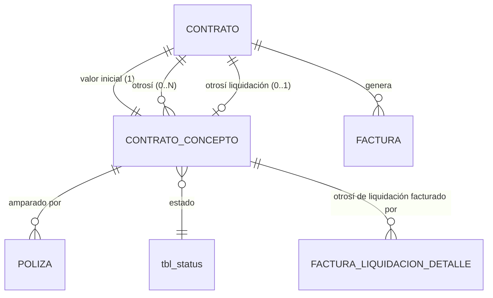

# ADR-0016: Conceptos contractuales — composición económica del contrato

## Estado

**Propuesto.**

Los conceptos contractuales **no existen** en el código ni en el esquema. Este ADR documenta la decisión arquitectónica recomendada.

## Fecha

2026-09-10 — versión inicial.

## Contexto

El contrato tiene un subnivel funcional denominado **"Información del valor del contrato"**. No son campos del encabezado: son una **colección de conceptos económicos** que componen el valor contractual a lo largo del tiempo.

```text
CONTRATO
    │
    └── Información del valor del contrato
            ├── VALOR INICIAL
            ├── OTROSÍ 1
            ├── OTROSÍ 2
            ├── OTROSÍ N
            └── OTROSÍ LIQUIDACIÓN
```

Cada concepto declara la misma estructura económica:

```text
Fecha inicio · Costo directo · AIU · IVA · Anticipo · Retenido
```

Y el otrosí añade prórroga y extensión de fechas, con numeración automática.

Este ADR es el pilar del CORE: **el valor del contrato, el anticipo disponible y el retenido acumulado se derivan de aquí.** Si el modelo de conceptos está mal, toda la facturación hereda el error.

## Problema

Tratar la composición económica como campos del encabezado del contrato —un `valor_inicial`, un `valor_ampliado`— produce cuatro fallas concretas:

1. **No admite más de una modificación.** Con dos otrosí, el segundo sobrescribe al primero o exige columnas nuevas.
2. **Pierde la historia.** No queda registro de cuánto valía el contrato antes de cada otrosí, ni de cuándo cambió.
3. **Pierde la trazabilidad del AIU, el anticipo y el retenido por acto contractual.** Cada otrosí puede pactar porcentajes distintos.
4. **Impide que una póliza ampare un acto concreto.** [ADR-0018](0018-polizas.md) exige que la póliza aplique sobre un concepto identificable.

Se requiere definir cómo se identifican y numeran los conceptos, si comparten tabla, cómo se garantiza la cardinalidad, y cómo componen el valor vigente.

## Estado actual

**No se encontró evidencia de implementación.**

| Elemento | Resultado |
| --- | --- |
| Tabla de conceptos contractuales | **No existe** |
| Tabla de contratos | **No existe** |
| Módulo backend o vista | **No existen** |
| Cualquier campo de tipo monetario en el esquema | **No existe ninguno.** Las 14 tablas del volcado no tienen una sola columna decimal o monetaria |
| Numeración automática de documentos | **No existe** ningún mecanismo |

Respecto de las preguntas concretas del alcance:

| Pregunta | Respuesta |
| --- | --- |
| ¿Cómo se identifican los conceptos? | No se encontró evidencia en la implementación actual |
| ¿Cómo se numeran? | No se encontró evidencia |
| ¿Existe tabla común o tablas separadas? | No existe ninguna |
| ¿Se permite más de un otrosí? | No aplica |
| ¿Existe orden cronológico? | No aplica |
| ¿Cómo afectan el valor total? | No aplica |

Precedente estructural relevante: el proyecto **no tiene ninguna columna monetaria**, por lo que no hay convención de precisión decimal que seguir. Es una decisión que debe fijarse aquí desde cero.

Antecedente de patrón discriminado: `tbl_documents` usa `doc_type enum('USERS','PROFILES','PAGINAS','PERMISOS')` con `doc_id_ref` **sin clave foránea**. Es el precedente de "una tabla con discriminador" en este esquema, y muestra su riesgo cuando la referencia carece de integridad.

## Decisión

1. **Los tres tipos de concepto comparten una única tabla**, discriminados por un atributo de tipo:

   ```text
   VALOR_INICIAL | OTROSI | OTROSI_LIQUIDACION
   ```

2. **Todo concepto pertenece a un único contrato**, con clave foránea obligatoria y `ON DELETE RESTRICT`.

3. **La cardinalidad es una invariante del sistema y se garantiza en la base de datos donde sea expresable**:

   | Tipo | Cardinalidad | Mecanismo |
   | --- | --- | --- |
   | `VALOR_INICIAL` | **exactamente 1** | `UNIQUE` sobre columna generada: `(contrato, tipo)` cuando tipo = VALOR_INICIAL |
   | `OTROSI` | 0..N | Sin restricción de cantidad |
   | `OTROSI_LIQUIDACION` | **0..1** | `UNIQUE` sobre columna generada: `(contrato, tipo)` cuando tipo = OTROSI_LIQUIDACION |

   El mínimo de un `VALOR_INICIAL` no es expresable en el esquema: se garantiza porque **el contrato y su concepto inicial se crean en la misma transacción** ([ADR-0015](0015-contratos.md), [ADR-0027](0027-integridad-transaccional.md)).

4. **El número de otrosí lo asigna el backend, es secuencial por contrato y no se reutiliza.** Se calcula dentro de la transacción, bajo bloqueo de la fila del contrato.

5. **El otrosí de liquidación no participa en la numeración de los otrosí ordinarios.** Es un acto de naturaleza distinta y se identifica por su tipo, no por un número de secuencia.

6. **El orden de los conceptos es cronológico por fecha de inicio, y el número de otrosí es su desempate.** El orden no depende del identificador de la fila.

7. **El valor vigente del contrato es la suma de los valores de todos sus conceptos. No se almacena en el contrato.** Ver `Fuente de verdad`.

8. **Cada concepto declara sus propios porcentajes de AIU, anticipo y retenido.** No se heredan del contrato ni del concepto anterior: cada acto contractual pacta los suyos.

9. **El AIU pertenece al concepto**, no al encabezado del contrato ni a la factura. Ver [ADR-0026](0026-calculos-facturacion.md) para su efecto en el cálculo.

10. **Anticipo y retenido se almacenan como porcentaje; su valor se deriva.** El porcentaje es lo pactado; el valor es su consecuencia sobre la base del concepto. Almacenar ambos permitiría que discrepen.

    **Excepción admitida:** si el negocio pacta un valor de anticipo fijo desacoplado del porcentaje, se almacena el valor y se deriva el porcentaje. **Pendiente de validación** — la decisión debe ser una de las dos, nunca ambas.

11. **La prórroga es un atributo del otrosí**, expresada en la misma unidad de plazo del contrato. Alimenta el cálculo de la fecha fin de [ADR-0015](0015-contratos.md).

12. **Tras la primera factura aprobada del contrato, los valores económicos de todos sus conceptos existentes son inmutables.** Ver `Inmutabilidad`.

13. **La creación del `OTROSI_LIQUIDACION` dispara la transición del contrato a `EN LIQUIDACIÓN`**, en la misma transacción ([ADR-0017](0017-estados-contrato.md)).

14. **No se admiten otrosí posteriores al otrosí de liquidación.**

15. **Los conceptos no se eliminan.** Un concepto registrado por error se corrige con un otrosí que lo compense, no borrándolo. Excepción única: un otrosí creado el mismo día y sin facturas del contrato aprobadas después de su creación puede anularse, quedando registrado como anulado y conservando su número.

    **Pendiente de validación.**

## Justificación

- **Tabla única con discriminador**: los tres tipos tienen exactamente la misma estructura económica —fecha, costo directo, AIU, IVA, anticipo, retenido—. Separarlos en tres tablas triplicaría el esquema para representar lo mismo, y el cálculo del valor vigente exigiría unir tres tablas en cada consulta. El discriminador captura la única diferencia real, que es de rol contractual y no de estructura. A diferencia del precedente de `tbl_documents`, aquí **la referencia sí tiene clave foránea**: el discriminador distingue tipos dentro de una relación, no entidades distintas.

- **Cardinalidad en el motor donde sea expresable**: la unicidad del valor inicial y del otrosí de liquidación es una invariante que, si se rompe, duplica silenciosamente el valor del contrato. MySQL 8 admite índices únicos sobre columnas generadas, lo que permite expresar "a lo sumo uno de este tipo por contrato" sin lógica aplicativa. Delegarlo al servicio repetiría el patrón `SELECT`-luego-`INSERT` que, como demuestra [ADR-0012](0012-proveedores.md), no resiste concurrencia.

- **Numeración en el backend bajo bloqueo**: si el número se calcula con `MAX(numero) + 1` sin bloqueo, dos otrosí simultáneos reciben el mismo número. El bloqueo sobre la fila del contrato —ya adoptado en [ADR-0015](0015-contratos.md) para el recálculo de fechas— serializa la asignación sin infraestructura adicional.

- **No almacenar el valor del contrato**: es la decisión más importante de este ADR. Un total almacenado es una copia de una suma, y toda copia puede desincronizarse: basta que un otrosí se registre sin actualizar el total, o que una actualización falle tras el `commit` del concepto. Calcularlo hace imposible la discrepancia por construcción. El coste —una agregación por consulta— es despreciable para el volumen esperado: un contrato tiene unidades de conceptos, no miles.

- **Porcentajes por concepto y no por contrato**: cada otrosí es un acto contractual autónomo que puede pactar un anticipo distinto del original. Si el porcentaje viviera en el encabezado, modificarlo alteraría retroactivamente la base de amortización de facturas ya emitidas contra conceptos anteriores.

- **AIU en el concepto**: si el AIU estuviera en el encabezado, un otrosí no podría pactar uno distinto. Si estuviera en la factura, la factura podría inventar un AIU no pactado. En el concepto queda anclado al acto contractual que lo estipuló, que es donde corresponde.

- **Porcentaje como fuente y valor derivado**: almacenar ambos crea dos verdades para el mismo hecho. Cuando el costo directo se corrige, el porcentaje sigue siendo válido y el valor no. Derivar el valor elimina la clase entera de defecto.

- **No eliminar conceptos**: el valor del contrato es la suma de los conceptos; eliminar uno reescribe la historia económica. Un otrosí registrado y luego borrado deja facturas imputadas a un acto que ya no existe.

## Alternativas consideradas

### Alternativa 1 — Campos en el encabezado del contrato

`valor_inicial`, `valor_ampliado`, `aiu`, `anticipo`, `retenido` como columnas del contrato.

- **A favor**: la implementación más simple; sin uniones; consulta directa del valor.
- **En contra**: admite **un solo** otrosí, cuando el alcance exige `0..N`; no conserva historia; no admite porcentajes distintos por acto; impide que una póliza ampare un concepto identificable; el otrosí de liquidación no tiene dónde ir.
- **Descartada.** Es el modelo que este ADR existe para evitar. Nótese que [ADR-0011](0011-obras.md) sí lo aplica a la **obra** (valor inicial y valor ampliado como columnas), lo cual es correcto allí porque la obra no tiene actos contractuales sucesivos que amparar.

### Alternativa 2 — Tres tablas separadas

Una tabla por tipo: valor inicial, otrosí, otrosí de liquidación.

- **A favor**: cada tabla puede tener columnas propias sin nulos; la cardinalidad del valor inicial se expresa con una relación 1:1; imposible confundir tipos.
- **En contra**: triplica una estructura idéntica; el valor vigente exige unir tres tablas; las pólizas tendrían que referenciar polimórficamente el concepto amparado —reintroduciendo el problema de `tbl_documents.doc_id_ref` sin clave foránea—; cada campo nuevo se replica tres veces.
- **Descartada.**

### Alternativa 3 — Tabla única con discriminador (seleccionada)

- **A favor**: una sola estructura para una sola forma; el valor vigente es una agregación sobre una tabla; las pólizas y las facturas referencian el concepto con una clave foránea real; la cardinalidad se expresa con índices únicos sobre columnas generadas; añadir un tipo de acto contractual futuro no cambia el esquema.
- **En contra**: los atributos exclusivos del otrosí —prórroga, número— quedan nulos en el valor inicial y en el otrosí de liquidación; el discriminador debe validarse en toda consulta que dependa del tipo.
- **Seleccionada.**

### Alternativa 4 — Libro de movimientos económicos genérico

Una tabla de movimientos que registre indistintamente conceptos contractuales y hechos de facturación.

- **A favor**: un solo mecanismo para toda la contabilidad del contrato; saldos calculables con una única agregación.
- **En contra**: mezcla dos naturalezas distintas —lo pactado y lo ejecutado— que tienen ciclos de vida, permisos, inmutabilidad y auditoría diferentes. Haría que una factura y un otrosí compartieran estructura sin compartir reglas.
- **Descartada.** La separación entre concepto contractual y movimiento de facturación se mantiene: ver [ADR-0024](0024-amortizacion-anticipo.md) y [ADR-0025](0025-retenciones.md).

## Modelo arquitectónico

Modelo propuesto. **Ninguna de estas tablas existe hoy.**



```text
CONTRATO_CONCEPTO
  ├── contrato            FK  NOT NULL  ON DELETE RESTRICT
  ├── tipo                VALOR_INICIAL | OTROSI | OTROSI_LIQUIDACION
  ├── número              secuencial por contrato — solo para OTROSI
  ├── fecha inicio        capturada
  ├── costo directo       decimal exacto
  ├── porcentaje AIU      decimal   desagregado en administración, imprevistos y utilidad — ver ADR-0026 (pendiente)
  ├── porcentaje IVA      decimal
  ├── porcentaje anticipo decimal
  ├── porcentaje retenido decimal
  ├── prórroga            entero    — solo para OTROSI
  ├── sta_id              → tbl_status
  └── auditoría estándar

  UNIQUE (contrato, tipo) donde tipo = VALOR_INICIAL
  UNIQUE (contrato, tipo) donde tipo = OTROSI_LIQUIDACION
  UNIQUE (contrato, número) donde tipo = OTROSI

  ✗ NO almacena el valor del concepto  → se deriva del costo directo y sus porcentajes
  ✗ NO almacena valores de anticipo ni retenido → se derivan de los porcentajes
```

Composición del valor vigente:

```text
VALOR VIGENTE DEL CONTRATO = Σ valor de cada concepto no anulado

donde el valor de un concepto se compone según ADR-0026
a partir de: costo directo, AIU, IVA

ANTICIPO CONTRACTUAL  = Σ (base del concepto × % anticipo del concepto)
RETENIDO CONTRACTUAL  = definido por % retenido de cada concepto,
                        aplicado sobre las facturas — ver ADR-0025
```

Ciclo de composición a lo largo del tiempo:

```text
t0   VALOR_INICIAL          costo directo 100  →  valor vigente = V(100)
t1   OTROSI 1  prórroga 30  costo directo  20  →  valor vigente = V(100) + V(20)
t2   OTROSI 2               costo directo  15  →  valor vigente = V(100) + V(20) + V(15)
t3   OTROSI_LIQUIDACION     costo directo  -5  →  valor vigente = V(100)+V(20)+V(15)+V(-5)
                                                   contrato → EN LIQUIDACIÓN
```

El otrosí de liquidación admite costo directo negativo: la liquidación puede ajustar a la baja el valor ejecutado. **Pendiente de validación.**

## Reglas de negocio

**No se encontró evidencia en la implementación actual.** Reglas propuestas:

1. Todo contrato tiene exactamente un concepto `VALOR_INICIAL`.
2. El `VALOR_INICIAL` se crea en la misma transacción que el contrato.
3. Un contrato puede tener cero o más `OTROSI`.
4. Un contrato puede tener como máximo un `OTROSI_LIQUIDACION`.
5. El número de otrosí es secuencial por contrato, lo asigna el backend y no se reutiliza.
6. El otrosí de liquidación no consume número de la secuencia de otrosí.
7. No se admiten otrosí ordinarios después del otrosí de liquidación.
8. Cada concepto declara sus propios porcentajes de AIU, IVA, anticipo y retenido.
9. Los porcentajes están entre 0 y 100.
10. El valor vigente del contrato es la suma de los valores de sus conceptos no anulados.
11. La prórroga de un otrosí extiende el plazo del contrato ([ADR-0015](0015-contratos.md)).
12. Solo se pueden crear conceptos en contratos en estado `EN EJECUCIÓN`, salvo el otrosí de liquidación.
13. La creación del otrosí de liquidación transiciona el contrato a `EN LIQUIDACIÓN`, y las facturas de liquidación se asocian a ese otrosí (confirmado con el área usuaria).
14. Tras la primera factura aprobada del contrato, los valores económicos de sus conceptos son inmutables.
15. Los conceptos no se eliminan.
16. La fecha de inicio de un otrosí no puede ser anterior a la del concepto que lo precede.

**Pendiente de validación:** si el otrosí de liquidación admite costo directo negativo; si se pactan valores fijos de anticipo en lugar de porcentaje; si un otrosí puede reducir el valor del contrato; si la fecha de inicio de un otrosí debe estar dentro del plazo vigente.

## Seguridad

Los conceptos determinan el valor del contrato y, con él, los importes admisibles de toda la facturación. Es la superficie de mayor impacto patrimonial del sistema.

- **Toda operación exige permiso verificado en backend.** Crear un otrosí no es editar un contrato: es un acto contractual con permiso propio.
- **El valor del concepto, el valor del anticipo y el valor del retenido nunca se aceptan desde el cliente.** Se derivan en el servidor desde el costo directo y los porcentajes. Aceptarlos permitiría inflar el valor de un contrato con una petición manipulada, sin tocar el costo directo que el usuario ve.
- **El número de otrosí nunca se acepta desde el cliente.** Lo asigna el backend.
- **El tipo de concepto no se acepta como parámetro libre**: cada tipo se crea por un endpoint propio con su permiso, de modo que crear un otrosí de liquidación no sea alcanzable desde el permiso de crear un otrosí ordinario.
- Los porcentajes se validan en rango en el backend. Un anticipo del 500 % capturado por manipulación produciría un saldo de amortización absurdo.
- Consultas parametrizadas. El patrón vigente en `paginationUsers` interpola once parámetros del cliente en la cadena SQL.

## Autorización

Permisos propuestos:

```text
CONSULTAR CONCEPTOS CONTRACTUALES
CREAR OTROSÍ
EDITAR CONCEPTO CONTRACTUAL
CREAR OTROSÍ DE LIQUIDACIÓN
ANULAR OTROSÍ
```

`CREAR OTROSÍ DE LIQUIDACIÓN` se separa deliberadamente: dispara la transición de estado del contrato y cierra la posibilidad de otrosí posteriores. Es una decisión de cierre, no una modificación de valor.

El `VALOR_INICIAL` no tiene permiso de creación propio: se crea con el contrato, bajo el permiso `CREAR CONTRATO`.

**Ninguno de estos permisos existe hoy.** El catálogo real son ocho permisos sobre perfiles y usuarios.

## Auditoría

**Nivel requerido: auditoría funcional completa.** Es, junto con [ADR-0017](0017-estados-contrato.md) y [ADR-0026](0026-calculos-facturacion.md), el caso más exigente del sistema.

Se registra con valor anterior y valor nuevo:

| Información | Nivel |
| --- | --- |
| Creación de cualquier concepto | **Funcional** — el acto completo |
| Costo directo | **Funcional** |
| Porcentaje de AIU | **Funcional** |
| Porcentaje de IVA | **Funcional** |
| **Porcentaje de anticipo** | **Funcional** — determina la amortización de las facturas |
| **Porcentaje de retenido** | **Funcional** — determina el retenido acumulable |
| Prórroga | **Funcional** — altera el plazo contractual |
| Fecha de inicio | **Funcional** |
| Anulación de un otrosí | **Funcional** — con motivo obligatorio |

El registro de la creación de un otrosí debe conservar **el valor vigente del contrato antes y después del acto**, aunque ese valor no se almacene: es el dato que explica el efecto económico de la modificación.

Requisito heredado y no negociable: **el autor se toma de `req.user`**, no del cuerpo de la petición como hace todo el backend actual ([ADR-0013](0013-auditoria-trazabilidad.md)).

## Validaciones

| Validación | Frontend | Backend | Base de datos | Clasificación |
| --- | --- | --- | --- | --- |
| Contrato obligatorio | No aplica | Propuesta | `NOT NULL` + FK | Integridad |
| Tipo dentro del dominio | No aplica (endpoint por tipo) | **Propuesta — obligatoria** | `ENUM` | **Integridad + Seguridad** |
| Exactamente un `VALOR_INICIAL` | No aplica | Propuesta (transacción) | **`UNIQUE` sobre columna generada** | **Integridad** |
| Máximo un `OTROSI_LIQUIDACION` | Propuesta (oculta la acción) | Propuesta | **`UNIQUE` sobre columna generada** | **Integridad** |
| Número de otrosí único en el contrato | No aplica | Propuesta (bajo bloqueo) | **`UNIQUE (contrato, número)`** | **Integridad** |
| Número asignado por el backend | No aplica | **Propuesta — obligatoria** | No expresable | **Seguridad** |
| Costo directo no negativo | Propuesta | **Propuesta — obligatoria** | `CHECK` | Regla de negocio |
| Porcentajes entre 0 y 100 | Propuesta | **Propuesta — obligatoria** | `CHECK` | Regla de negocio |
| Valores derivados, no capturados | No aplica | **Propuesta — obligatoria** | No expresable | **Seguridad** |
| Sin otrosí tras el de liquidación | Propuesta (oculta) | **Propuesta — obligatoria** | No expresable | Regla de negocio |
| Contrato en estado que admite el acto | Propuesta (oculta) | **Propuesta — obligatoria** | No expresable | Regla de negocio |
| Contrato sin facturas aprobadas antes de modificar valores de un concepto | Propuesta (bloquea) | **Propuesta — obligatoria** | No expresable | Regla de negocio |
| Permiso de la acción | Propuesta (oculta) | **Propuesta — obligatoria** | No aplica | **Seguridad** |

## Integridad de datos

Requisitos propuestos:

- `UNIQUE` sobre columnas generadas para la cardinalidad de `VALOR_INICIAL` y `OTROSI_LIQUIDACION`.
- `UNIQUE (contrato, número)` para los otrosí.
- FK al contrato, `ON DELETE RESTRICT`.
- `CHECK` sobre costo directo y sobre el rango de los porcentajes.
- **Tipo decimal exacto para todos los importes y porcentajes. Nunca punto flotante.** El punto flotante binario no representa exactamente valores decimales; acumulado sobre miles de facturas produce discrepancias de centavos no explicables. El esquema actual **no tiene ninguna columna monetaria**, por lo que no hay precedente y la decisión se fija aquí.
- Índices sobre contrato, tipo y fecha de inicio.
- Columnas generadas e índices únicos sobre ellas: soportados por MySQL 8, **no usados hoy** en el esquema.
- Sin migraciones versionadas en el proyecto.

## Transacciones

Tres operaciones exigen atomicidad, todas gobernadas por [ADR-0027](0027-integridad-transaccional.md):

**Crear contrato con su valor inicial**

```text
BEGIN
  INSERT contrato
  INSERT concepto VALOR_INICIAL
  INSERT pólizas asociadas
  INSERT historial de estado
  INSERT auditoría
COMMIT
```

**Crear otrosí**

```text
BEGIN
  SELECT contrato ... FOR UPDATE          ← serializa la numeración y el recálculo
  calcular número = MAX(número) + 1
  INSERT concepto OTROSI
  UPDATE contrato: recalcular fecha fin   ← si trae prórroga
  INSERT pólizas del otrosí, si aplica
  INSERT auditoría
COMMIT
```

**Crear otrosí de liquidación**

```text
BEGIN
  SELECT contrato ... FOR UPDATE
  verificar que no exista otro OTROSI_LIQUIDACION
  INSERT concepto OTROSI_LIQUIDACION
  UPDATE contrato: estado → EN LIQUIDACIÓN
  INSERT historial de estado
  INSERT auditoría
COMMIT
```

El tercero es el caso donde la atomicidad es más crítica: un otrosí de liquidación creado sin la transición de estado deja un contrato que debería estar en liquidación y no lo está, sin señal visible.

**Precaución verificada:** `executeQuery` en `db.config.js` toma una conexión nueva del pool si se omite el tercer parámetro, y esa escritura **sobrevive al `rollback`**.

## Concurrencia

**Escenario 1 — Numeración duplicada de otrosí.** Dos usuarios registran un otrosí sobre el mismo contrato al mismo tiempo. Con `MAX(numero) + 1` sin bloqueo, ambos leen el mismo máximo y ambos escriben el mismo número.

- Protección adoptada: `SELECT ... FOR UPDATE` sobre la fila del contrato antes de calcular el número.
- Red de seguridad: `UNIQUE (contrato, número)`, que convierte la carrera perdida en un error manejable en lugar de un duplicado silencioso.

**Escenario 2 — Dos otrosí de liquidación simultáneos.** Ambos verifican que no existe uno previo, ambos insertan.

- Protección: el índice único sobre columna generada lo impide en el motor.
- Sin él, el contrato quedaría con dos actos de liquidación y un valor vigente inflado.

**Escenario 3 — Otrosí registrado mientras se aprueba una factura.** El otrosí modifica el anticipo pactado del contrato; una factura de anticipo podría validarse contra un anticipo pactado que ya cambió.

- Protección: ambas operaciones toman el mismo bloqueo sobre la fila del contrato, por lo que se serializan. Ver [ADR-0024](0024-amortizacion-anticipo.md).

**El contrato es el punto de serialización de todo su agregado.** Esta decisión es común a [ADR-0015](0015-contratos.md), [ADR-0024](0024-amortizacion-anticipo.md), [ADR-0025](0025-retenciones.md) y [ADR-0027](0027-integridad-transaccional.md).

## Fuente de verdad

| Dato | Naturaleza | Fuente de verdad | Momento |
| --- | --- | --- | --- |
| Costo directo del concepto | **Almacenado** | Captura del usuario | Al guardar |
| Porcentajes de AIU, IVA, anticipo, retenido | **Almacenado** | Captura del usuario | Al guardar |
| Prórroga | **Almacenado** | Captura del usuario | Al guardar |
| Número de otrosí | **Almacenado** | Asignado por el backend bajo bloqueo | Al crear |
| **Valor del concepto** | **Calculado** | Costo directo + porcentajes ([ADR-0026](0026-calculos-facturacion.md)) | En cada consulta |
| **Valor vigente del contrato** | **Calculado** | Σ valor de conceptos no anulados | En cada consulta |
| **Anticipo contractual** | **Calculado** | Σ (base × % anticipo) por concepto | En cada consulta |
| **Valor del anticipo por concepto** | **Calculado** | Base del concepto × % anticipo | En cada consulta |
| Porcentaje de retenido aplicable | **Almacenado** | El del concepto contra el que se factura | — |
| **Retenido acumulado** | **Calculado** | Σ retenido de facturas aprobadas ([ADR-0025](0025-retenciones.md)) | En cada consulta |

**Regla que gobierna la tabla:** se almacena lo pactado —costos y porcentajes— y se calcula todo lo que se deriva de ello. Ningún total ni saldo se persiste. Ver [ADR-0027](0027-integridad-transaccional.md), sección de no duplicación de saldos.

## Inmutabilidad

| Momento | Qué queda inmutable |
| --- | --- |
| **Al aprobarse la primera factura del contrato** (anticipo o liquidación) | Costo directo y porcentajes de AIU, IVA, anticipo y retenido **de todos los conceptos existentes** |
| **Al crearse el otrosí de liquidación** | Todos los conceptos anteriores quedan cerrados a modificación |
| **Al pasar el contrato a `LIQUIDADO`** | La totalidad de los conceptos |
| **Siempre** | El número de otrosí y el tipo de concepto |

La razón es directa: el anticipo y el retenido se controlan como un único saldo por contrato ([ADR-0024](0024-amortizacion-anticipo.md), [ADR-0025](0025-retenciones.md)); si el porcentaje o la base de cualquier concepto cambia después de aprobada una factura del contrato, **el histórico de amortizaciones deja de cuadrar con la base que lo generó**. El saldo calculado ya no corresponde a lo efectivamente amortizado.

**Toda corrección posterior se hace mediante un otrosí compensatorio**, nunca editando el concepto. Esa es la razón de la decisión 15.

La prórroga y la fecha de inicio sí pueden corregirse mientras no existan facturas, porque no participan en ningún cálculo económico ya materializado — solo en la fecha fin, que es recalculable.

## Consecuencias

### Positivas

- El valor del contrato no puede desincronizarse de sus componentes, porque no se almacena.
- La historia económica completa queda registrada: qué se pactó, cuándo y por cuánto.
- Cada póliza puede amparar un acto contractual identificable ([ADR-0018](0018-polizas.md)).
- Cada otrosí puede pactar porcentajes propios sin alterar los anteriores.
- La cardinalidad está garantizada por el motor, no por disciplina aplicativa.
- Un tipo de acto contractual futuro no requiere cambio de esquema.

### Negativas

- El valor vigente exige una agregación en cada consulta, incluidos los listados de contratos y los indicadores del dashboard.
- Los atributos exclusivos del otrosí quedan nulos en los otros dos tipos.
- La inmutabilidad tras la primera factura obliga a corregir por compensación, lo que resulta contraintuitivo para el usuario y exige explicarlo en la interfaz.
- La numeración bajo bloqueo serializa la creación de otrosí sobre el mismo contrato.

## Riesgos

| Riesgo | Severidad | Descripción |
| --- | --- | --- |
| Valor del contrato almacenado | **Crítico** | Cualquier copia de una suma se desincroniza; sería la raíz de errores en toda la facturación |
| Valores aceptados desde el cliente | **Crítico** | Permitiría inflar el valor de un contrato con una petición manipulada |
| Más de un `VALOR_INICIAL` | **Crítico** | Duplica silenciosamente el valor del contrato |
| Modificar porcentajes con facturas emitidas | **Crítico** | El histórico de amortizaciones deja de cuadrar con su base |
| Dos otrosí con el mismo número | **Alto** | Sin bloqueo ni `UNIQUE`; ambigüedad documental |
| Otrosí de liquidación sin transición de estado | **Alto** | Contrato que debería estar en liquidación y no lo está |
| Punto flotante en importes | **Alto** | Discrepancias de centavos acumuladas y no explicables |
| Eliminación de conceptos | **Alto** | Reescribe la historia económica; deja facturas imputadas a actos inexistentes |
| Escritura fuera de la transacción | **Alto** | `executeQuery` sin conexión sobrevive al `rollback` |
| Rendimiento de la agregación | **Medio** | Mitigable con índices; el volumen por contrato es de unidades |
| Sin autorización en backend | **Crítico** | Estado actual del sistema |

## Impacto técnico

### Frontend

- Vista de "Información del valor del contrato" dentro del expediente: lista cronológica de conceptos con el valor vigente acumulado.
- Diálogos separados para otrosí y para otrosí de liquidación, con confirmación explícita en el segundo por su efecto sobre el estado del contrato.
- `GenericFormSection.jsx` soporta `currency`, `number`, `float` y `date`.
- **Los valores derivados se muestran calculados en el cliente solo como previsualización**; el valor persistido es el del servidor.
- La interfaz debe explicar por qué un concepto con facturas no es editable y ofrecer la corrección por otrosí.
- El número de otrosí se muestra tras guardar; nunca se captura.

### Backend

- Módulo de conceptos, o submódulo de contratos.
- Endpoints separados por tipo de acto, cada uno con su permiso.
- Función única de cálculo del valor de un concepto, compartida con [ADR-0026](0026-calculos-facturacion.md).
- Asignación de número bajo `SELECT ... FOR UPDATE`.
- Verificación de existencia de facturas antes de permitir modificación.

### Base de datos

- Tabla nueva. Requiere columnas generadas, índices únicos sobre ellas, `CHECK` y decimales exactos: **ninguno de estos mecanismos se usa hoy** en el esquema.
- Depende de la tabla de contratos.
- Sin migraciones versionadas.

### Infraestructura

No aplica. **No se encontró evidencia** de motor de reglas, colas ni servicios de cálculo externos.

## Arquitectura objetivo

| Área | Actual | Objetivo | Brecha |
| --- | --- | --- | --- |
| Conceptos contractuales | No existen | Tabla única con discriminador | **Alta** |
| Cardinalidad | No aplica | Garantizada por índices únicos | **Alta** |
| Numeración de otrosí | No existe | Backend, secuencial, bajo bloqueo | **Alta** |
| Valor del contrato | No existe | Calculado, nunca almacenado | **Alta** |
| AIU | No existe | En el concepto | **Alta** |
| Anticipo y retenido | No existen | Porcentaje almacenado, valor derivado | **Alta** |
| Tipos monetarios | Ninguna columna monetaria en el esquema | Decimal exacto con `CHECK` | **Alta** |
| Inmutabilidad | No existe | Congelado tras la primera factura aprobada | **Alta** |
| Concurrencia | Sin protección | Bloqueo sobre la fila del contrato | **Alta** |
| Auditoría | Autor desde el body | Funcional completa, autor desde el token | **Alta** |

## Brechas identificadas

| # | Brecha | Severidad |
| --- | --- | --- |
| B1 | Los conceptos contractuales no existen en ninguna capa | **Alta** |
| B2 | No existe la entidad contrato | **Alta** — bloqueante |
| B3 | El esquema no tiene ninguna columna monetaria ni convención de precisión | **Alta** |
| B4 | Sin `UNIQUE`, `CHECK` ni columnas generadas en el esquema | **Alta** |
| B5 | Sin mecanismo de numeración secuencial | **Alta** |
| B6 | Sin protección de concurrencia en ninguna operación del sistema | **Alta** |
| B7 | Ninguna ruta del backend verifica permisos | **Crítica** |
| B8 | El autor de la auditoría proviene del cliente | **Alta** |
| B9 | `executeQuery` sin conexión escapa de la transacción | **Alta** — preventiva |
| B10 | Costo directo negativo en el otrosí de liquidación sin confirmar | **Media** — decisión de negocio pendiente |
| B11 | Anticipo por porcentaje o por valor fijo sin confirmar | **Media** — decisión de negocio pendiente |
| B12 | Política de anulación de otrosí sin confirmar | **Media** — decisión de negocio pendiente |
| B13 | Sin migraciones versionadas | **Media** |

## Plan de implementación

Recomendación derivada del análisis. **No fue ejecutada.**

**Fase 0 — Prerrequisitos (B2, B7, B13)**
Entidad contrato ([ADR-0015](0015-contratos.md)). Autorización en backend. Migraciones versionadas.

**Fase 1 — Decisiones de negocio (B10, B11, B12)**
Costo negativo en liquidación, anticipo por porcentaje o valor, y política de anulación.

**Fase 2 — Convención monetaria (B3)**
Fijar tipo decimal y precisión para importes y porcentajes en todo el CORE, antes de crear ninguna tabla.

**Fase 3 — Modelo (B4)**
Tabla de conceptos con columnas generadas, índices únicos, `CHECK` y decimales exactos.

**Fase 4 — Cálculo**
Función única de valor de concepto y de valor vigente del contrato, compartida con [ADR-0026](0026-calculos-facturacion.md).

**Fase 5 — Transacciones y concurrencia (B5, B6, B9)**
Numeración bajo bloqueo. Creación atómica de los tres actos. Revisión de que toda escritura use la conexión de la transacción.

**Fase 6 — Inmutabilidad y auditoría (B8)**
Bloqueo de modificación tras la primera factura aprobada. Auditoría funcional con autor desde el token.

## ADR relacionados

- [ADR-0015 — Contratos](0015-contratos.md) — raíz del agregado
- [ADR-0017 — Estados de contrato](0017-estados-contrato.md) — el otrosí de liquidación dispara la transición
- [ADR-0018 — Pólizas](0018-polizas.md) — amparan conceptos identificables
- [ADR-0024 — Amortización de anticipo](0024-amortizacion-anticipo.md) · [ADR-0025 — Retenciones](0025-retenciones.md)
- [ADR-0026 — Cálculos de facturación](0026-calculos-facturacion.md) — composición del valor
- [ADR-0027 — Integridad transaccional del CORE](0027-integridad-transaccional.md)
- [ADR-0013 — Auditoría](0013-auditoria-trazabilidad.md) · [ADR-0014 — Autorización](0014-autorizacion-permisos.md)

## Referencias

- `database/bdintervewebpack.sql` — sin columnas monetarias, sin `UNIQUE`, `CHECK` ni columnas generadas; `tbl_documents` como precedente de discriminador sin FK
- `server/src/common/configs/db.config.js` — `executeQuery` y el manejo de conexiones
- `server/src/modules/security/permissions/permissions.service.js` — patrón de diferencial transaccional
- `client/src/ui-component/extended/GenericFormSection.jsx` — tipos `currency`, `number`, `float`
- [ADR-0011 — Obras](0011-obras.md) — donde el modelo de columnas de valor sí es adecuado
