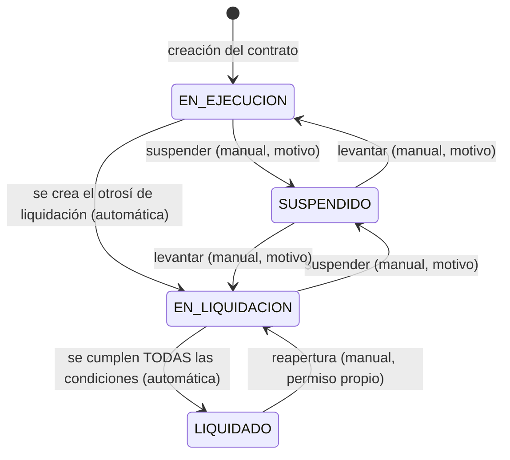
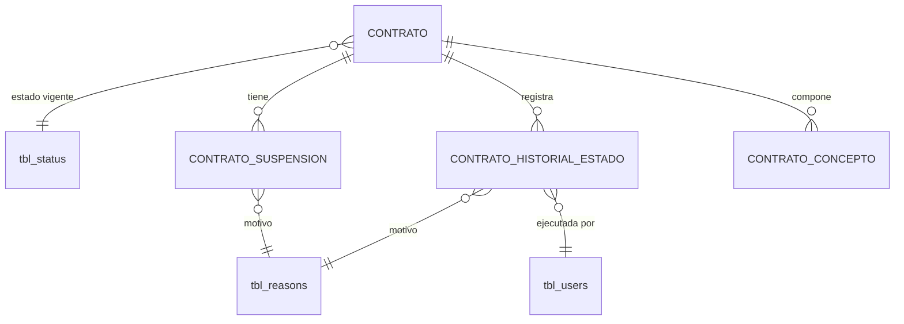

# ADR-0017: Estados y transición de contratos

## Estado

**Propuesto.**

**Reemplaza a [ADR-0005](0005-estados-contrato.md)**, que se conserva como registro histórico.

La máquina de estados **no existe** en el código ni en el esquema. Este ADR documenta la decisión arquitectónica recomendada.

## Fecha

2026-09-10 — versión inicial. Reemplaza a ADR-0005.
2026-09-10 — el área usuaria confirma que la factura de liquidación se asocia al otrosí de liquidación. La condición `C2` pasa a medirse sobre el anticipo **facturado** y no sobre el pactado ([ADR-0024](0024-amortizacion-anticipo.md)).

## Contexto

El contrato recorre cuatro estados:

```text
EN EJECUCIÓN · EN LIQUIDACIÓN · LIQUIDADO · SUSPENDIDO
```

[ADR-0005](0005-estados-contrato.md) fijó una primera decisión sobre ellos, pero fue escrito **antes** de conocer el modelo de conceptos contractuales, y por eso atribuía la transición a liquidación a un genérico "fin de ejecución". El análisis del CORE muestra tres diferencias sustanciales que obligan a reemplazarlo:

| Aspecto | ADR-0005 | Este ADR |
| --- | --- | --- |
| Disparador de `EN LIQUIDACIÓN` | "fin de ejecución" — indefinido | **Creación del otrosí de liquidación** ([ADR-0016](0016-conceptos-contractuales.md)) |
| Disparador de `LIQUIDADO` | "cierre económico" — indefinido | **Conjunto verificable de condiciones de facturación** |
| Suspensión | Estado con motivo | Estado con **seis atributos**, incluido su efecto sobre el plazo |

## Problema

Un modelo de estados mal resuelto en un sistema de contratos produce fallas con efecto patrimonial:

1. **Transiciones imposibles ocurren.** Un contrato liquidado vuelve a ejecución y recibe facturas.
2. **La liquidación se declara sin cumplir condiciones.** Se cierra un contrato con anticipo sin amortizar o retenido sin devolver — dinero que queda sin resolver.
3. **La suspensión no deja rastro suficiente.** No se sabe por qué se suspendió, desde cuándo, ni bajo qué condición puede levantarse.
4. **Automático y manual compiten.** Un proceso recalcula lo que un usuario decidió, o al revés.

La pregunta central del alcance es explícita: **qué condiciones exactas permiten pasar de `EN LIQUIDACIÓN` a `LIQUIDADO`**, con la advertencia de no asumir que pagar una factura las cumple todas.

## Estado actual

**No se encontró evidencia de implementación.**

| Elemento | Resultado |
| --- | --- |
| Tabla de contratos | **No existe** |
| Catálogo de estados de contrato | **No existe** |
| Máquina de estados, explícita o implícita | **No existe** en ninguna parte del backend |
| Historial de estados de cualquier entidad | **No existe** |
| Disparadores, procedimientos, funciones o eventos programados | **Ninguno** en toda la base de datos |
| Proceso programado | `server/src/cron/index.js` está implementado **con la lista de tareas vacía** y su arranque comentado en `server.js` |

Lo que sí existe y condiciona la decisión:

**`tbl_status`** es el catálogo transversal de estados, con `sta_id`, `sta_name`, `sta_scope`, `sta_order`, `sta_color` y `sta_key`. `sta_scope` es un `enum` que **hoy admite un único valor: `'GENERAL'`**.

El endpoint `GET /api/app/get_statuses_by_scope` (`app.service.js`) ya consulta por ámbito y permite excluir claves. **El mecanismo de catálogos de estado segmentados existe y está sin usar.**

`tbl_status` **no tiene datos sembrados** en el volcado. La convención `1 = activo`, `2 = inactivo`, `3 = eliminado` vive codificada en el backend y en `client/src/utils/constants.js`, que solo declara los dos primeros.

**`tbl_reasons`** es un maestro de motivos ya presente en el esquema, con `rea_name`, `sta_id` y auditoría estándar. **Ningún código lo referencia.** Es el catálogo natural para tipificar motivos de suspensión.

Evidencia de deriva por estados numéricos literales: `app.service.verifyToken` acepta usuarios con `sta_id IN (1,4)`, y el estado `4` **no existe** (`AUTO_INCREMENT = 4` implica ids 1 a 3).

## Decisión

1. **El estado del contrato es un atributo controlado, no un campo editable.** Solo cambia mediante transiciones declaradas.

2. **Se implementa una máquina de estados explícita en el backend, con las transiciones válidas declaradas como dato.** Una transición no declarada se rechaza con `409`, no con un error genérico.

3. **`SUSPENDIDO` no es un punto del ciclo: es un estado superpuesto.** El contrato conserva el estado del que proviene, y al levantar la suspensión regresa a él.

4. **Dos vías de transición que no compiten**:

   | Vía | Transiciones | Disparador |
   | --- | --- | --- |
   | **Automática** | → `EN LIQUIDACIÓN`, → `LIQUIDADO` | Hecho de negocio registrado, evaluado en la misma transacción |
   | **Manual** | → `SUSPENDIDO`, levantamiento, reapertura | Acción explícita con permiso y motivo |

5. **`EN EJECUCIÓN` es el estado inicial**, asignado en la transacción de creación del contrato.

6. **`EN LIQUIDACIÓN` se dispara por la creación del otrosí de liquidación**, en la misma transacción que lo crea ([ADR-0016](0016-conceptos-contractuales.md)). No hay otro disparador.

7. **`LIQUIDADO` exige el cumplimiento simultáneo de un conjunto verificable de condiciones**, evaluado tras cada evento de facturación. **Ninguna condición aislada basta.** Ver la sección `Modelo arquitectónico`.

8. **La suspensión captura seis atributos**, todos con propósito propio:

   ```text
   Motivo                        → tbl_reasons, obligatorio
   Fecha de suspensión           → obligatoria
   Condición de levantamiento    → texto, obligatoria: qué debe ocurrir para reanudar
   Observación                   → opcional
   Fecha de levantamiento        → se captura al reanudar, no al suspender
   ¿Genera informe de interventoría?  → booleano, decidido al suspender
   ```

9. **La suspensión detiene el cómputo del plazo contractual.** Al levantarla, los días transcurridos se acumulan en el contrato y la fecha fin se recalcula ([ADR-0015](0015-contratos.md)).

10. **Toda transición se registra en un historial de solo escritura**: estado anterior, estado nuevo, origen (automática o manual), motivo, observación, usuario y fecha. **Nunca se modifica ni se elimina.**

11. **`LIQUIDADO` es terminal.** La reapertura existe como operación excepcional, con permiso propio, motivo obligatorio y auditoría reforzada. Devuelve el contrato a `EN LIQUIDACIÓN`, nunca a `EN EJECUCIÓN`.

12. **Los efectos de cada estado sobre las operaciones se declaran en un solo lugar y se aplican en el backend de cada módulo afectado.**

13. **El catálogo de estados se implementa sobre `tbl_status` con un `sta_scope` propio**, ampliando el `enum` existente. No se crea un catálogo paralelo.

14. **Los estados se comparan siempre por `sta_key`, nunca por identificador numérico literal ni por nombre.**

15. **Las transiciones automáticas no dependen de ningún proceso programado.** Se evalúan y aplican dentro de la transacción del hecho que las causa.

## Justificación

- **Condiciones múltiples para `LIQUIDADO`**: es la decisión que el alcance señala explícitamente y la de mayor consecuencia económica. Liquidar es cerrar el contrato: si se hace con anticipo sin amortizar, el sistema da por concluido un contrato en el que el proveedor recibió dinero que no devolvió. Si se hace con retenido sin devolver, ocurre lo inverso. Una sola condición —"se aprobó la factura de liquidación"— no cubre ninguno de los dos casos.

- **Disparador único y preciso para `EN LIQUIDACIÓN`**: el otrosí de liquidación es un acto contractual registrado, con fecha y autor. Es un hecho verificable, a diferencia de "fin de ejecución", que exigiría interpretar si el plazo venció, si hubo acta, o si alguien lo decidió. Esta es la corrección principal sobre [ADR-0005](0005-estados-contrato.md).

- **Suspensión como superposición**: modelarla como un punto del ciclo obliga a decidir a dónde vuelve el contrato al reanudarse, y la única respuesta correcta es "a donde estaba". Un contrato suspendido durante la liquidación debe volver a liquidación, no a ejecución.

- **Condición de levantamiento obligatoria**: es el atributo que distingue una suspensión gestionada de una indefinida. Sin ella, nadie sabe qué debe ocurrir para reanudar, y las suspensiones se eternizan.

- **Transiciones por evento y no por proceso programado**: un proceso nocturno deja una ventana en la que el estado es incorrecto y se admiten operaciones que ya no corresponden. Además, el cron del proyecto está **vacío y desactivado**, y `startCronJobs` se autoinhibe en desarrollo — el sistema se comportaría distinto según el entorno.

- **Historial inmutable**: el estado actual es un dato; la secuencia es el expediente. Ante una controversia, la pregunta es cuándo se suspendió y por qué, no en qué estado está hoy.

- **`sta_key` sobre literales numéricos**: el backend actual compara `sta_id = 1`, `sta_id != 3`, `sta_id IN (1,4)` con literales dispersos, y **ya produjo un defecto real**: el estado `4` no existe. Una clave simbólica hace el código legible y resistente a que los identificadores difieran entre entornos.

- **Reutilizar `tbl_status` y `tbl_reasons`**: ambos existen, el segundo sin uso alguno, y el mecanismo de ámbitos ya tiene endpoint. Crear catálogos paralelos duplicaría infraestructura disponible.

## Alternativas consideradas

### Alternativa 1 — Estado como campo del formulario

Un selector más en la edición del contrato, sin restricciones.

- **A favor**: trivial; es el patrón que usan hoy usuarios y perfiles en este sistema.
- **En contra**: permite cualquier transición, incluidas las imposibles; no distingue automático de manual; no deja rastro; no captura motivo. Para maestros de configuración es aceptable; para un ciclo contractual con efecto patrimonial es inadmisible.
- **Descartada.**

### Alternativa 2 — Estado derivado, calculado en cada consulta

No persistir el estado: deducirlo de los hechos registrados.

- **A favor**: imposible que quede desactualizado; sin transiciones que gestionar.
- **En contra**: **no admite el estado manual** — una suspensión es una decisión, no se deriva de ningún dato. Impide indexar y filtrar por estado, que es el filtro principal del listado de contratos y del dashboard. Imposibilita el historial: no hay evento que registrar.
- **Descartada.** El requisito de un estado manual la excluye por completo.

### Alternativa 3 — Recálculo por proceso programado

Un job periódico revisa contratos y ajusta estados.

- **A favor**: lógica centralizada; corrige derivas acumuladas.
- **En contra**: ventana de inconsistencia entre el hecho y su reflejo; el cron está vacío y desactivado; un fallo silencioso deja todo el sistema con estados incorrectos sin señal.
- **Descartada como mecanismo principal.** Se conserva como **proceso de conciliación** que detecte y **reporte** discrepancias entre el estado registrado y las condiciones evaluables, sin corregirlas en silencio.

### Alternativa 4 — Máquina de estados explícita, por evento, con historial (seleccionada)

- **A favor**: transiciones verificables en un punto único; estado coherente con los hechos; convive con el estado manual; historial completo; efectos declarados y consultables; habilita los indicadores de [ADR-0002](0002-dashboard.md).
- **En contra**: más costoso que un selector; exige precisar los hechos que disparan cada transición automática.
- **Seleccionada.**

## Modelo arquitectónico

Máquina de estados propuesta:



Transiciones **inválidas** por declaración explícita:

```text
LIQUIDADO      ──X──> EN EJECUCIÓN     no se reactiva un contrato cerrado
LIQUIDADO      ──X──> SUSPENDIDO       no se suspende lo ya cerrado
EN EJECUCIÓN   ──X──> LIQUIDADO        no se omite la liquidación
SUSPENDIDO     ──X──> LIQUIDADO        debe levantarse primero
cualquiera     ──X──> el mismo estado  no es una transición
```

### Condiciones para `EN LIQUIDACIÓN → LIQUIDADO`

Esta es la respuesta a la pregunta central del alcance. **Todas deben cumplirse simultáneamente:**

```text
C1  Existe el otrosí de liquidación                          → ADR-0016
C2  Saldo de anticipo = 0
        anticipo facturado aprobado − amortizado acumulado = 0      → ADR-0024
C3  Saldo de retenido = 0
        retenido acumulado − devuelto acumulado = 0          → ADR-0025
C4  Existe al menos una factura de liquidación APROBADA,
        asociada al otrosí de liquidación (confirmado)      → ADR-0021
C5  No existen facturas del contrato en estado no definitivo
        (registradas y sin aprobar, o en trámite)            → ADR-0020
C6  No existen suspensiones abiertas
        (sin fecha de levantamiento)
C7  Los informes de interventoría exigidos por las
    suspensiones que los generaron están registrados          → pendiente de validación
C8  Las pólizas exigidas cubren el periodo requerido          → pendiente de validación
```

`C2` y `C3` son las condiciones que el alcance advierte que no deben darse por supuestas: **aprobar una factura de liquidación no implica que el anticipo esté amortizado ni que el retenido esté devuelto.** Son hechos independientes que se verifican por separado.

`C7` y `C8` quedan pendientes de validación con el área usuaria: no hay evidencia que permita determinar si son requisitos de cierre o controles paralelos.

Evaluación:

```text
Tras CADA evento de facturación aprobada, dentro de su transacción:
   │
   ├── ¿el contrato está EN LIQUIDACIÓN?
   │       NO ──> no evaluar
   │
   └── SÍ ──> evaluar C1..C8
             ├── todas se cumplen  ──> transición automática a LIQUIDADO
             │                          + historial + auditoría
             └── alguna falla      ──> permanecer EN LIQUIDACIÓN
                                        registrar cuál falló, para diagnóstico
```

Registrar qué condición falló es tan importante como la transición: permite responder al usuario "el contrato no se liquida porque queda un saldo de retenido de X" en lugar de dejarlo sin explicación.

### Efectos de cada estado

| Estado | Otrosí | Facturas de anticipo | Facturas de liquidación | Devolución de retenido | Pólizas | Documentos | Datos contractuales |
| --- | --- | --- | --- | --- | --- | --- | --- |
| `EN EJECUCIÓN` | Sí | Sí | No | No | Sí | Sí | Editables |
| `SUSPENDIDO` | **No** | **No** | **No** | **No** | Sí | Sí | **Bloqueados** |
| `EN LIQUIDACIÓN` | **No** | **No** | Sí | Sí | Renovación | Sí | **Bloqueados** |
| `LIQUIDADO` | **No** | **No** | **No** | **No** | Solo consulta | Sí | **Inmutables** |

Los documentos siempre pueden adjuntarse: un expediente cerrado sigue recibiendo soportes. La consulta nunca se bloquea por estado.

**Confirmado con el área usuaria:** la factura de liquidación se asocia al otrosí de liquidación y por eso solo es admisible en `EN LIQUIDACIÓN`. Como consecuencia, **durante `EN EJECUCIÓN` la única factura de contrato es la de anticipo**: no se amortiza anticipo ni se acumula retenido hasta la liquidación. Cómo se factura el avance de obra durante la ejecución queda como decisión pendiente en [ADR-0021](0021-facturacion-contrato-mayor.md).

### Modelo de datos



```text
CONTRATO_HISTORIAL_ESTADO  (propuesta, de solo escritura)
  ├── contrato · estado anterior · estado nuevo
  ├── origen  AUTOMATICA | MANUAL
  ├── motivo → tbl_reasons · observación
  ├── usuario → tbl_users · fecha
  └── condición fallida  (cuando la evaluación no transiciona)

CONTRATO_SUSPENSION  (propuesta)
  ├── contrato · estado previo a la suspensión
  ├── motivo → tbl_reasons  NOT NULL
  ├── fecha de suspensión   NOT NULL
  ├── condición de levantamiento  NOT NULL
  ├── observación
  ├── fecha de levantamiento   NULL mientras esté abierta
  ├── genera informe de interventoría  booleano
  └── auditoría estándar

  UNIQUE sobre columna generada: una sola suspensión abierta por contrato
```

## Reglas de negocio

**No se encontró evidencia en la implementación actual.** Reglas propuestas:

1. Un contrato se crea en `EN EJECUCIÓN`.
2. Un contrato tiene exactamente un estado vigente.
3. La creación del otrosí de liquidación transiciona a `EN LIQUIDACIÓN`, en la misma transacción.
4. La transición a `LIQUIDADO` exige `C1` a `C8` simultáneamente.
5. La transición a `LIQUIDADO` se evalúa tras cada evento de facturación aprobada.
6. `SUSPENDIDO` conserva el estado previo y regresa a él al levantarse.
7. Suspender exige motivo, fecha de suspensión y condición de levantamiento.
8. Un contrato no puede tener dos suspensiones abiertas.
9. La suspensión detiene el cómputo del plazo; al levantarla la fecha fin se recalcula.
10. `LIQUIDADO` es terminal; solo se sale por reapertura hacia `EN LIQUIDACIÓN`.
11. Una transición no declarada se rechaza.
12. Toda transición queda en el historial.
13. Un contrato suspendido no admite otrosí, facturas ni edición de datos contractuales.
14. Un contrato liquidado no admite ninguna operación de escritura salvo adjuntar documentos.
15. La consulta nunca se bloquea por estado.
16. Un contrato eliminado lógicamente queda fuera del ciclo de estados funcionales.

**Pendiente de validación:** si el informe de interventoría es condición de cierre (`C7`); si la vigencia de pólizas condiciona la liquidación (`C8`); si un contrato suspendido puede recibir devolución de retenido; si la reapertura tiene límite temporal.

## Seguridad

Los estados controlan qué operaciones económicas son admisibles. Manipularlos tiene consecuencia patrimonial directa: pasar un contrato liquidado a ejecución habilitaría facturación sobre un contrato cerrado.

- **Toda transición se verifica en backend.** El selector de estado del formulario no es un control de seguridad.
- **El estado nunca se acepta como campo de escritura directa.** No existe un endpoint que reciba `estado` y lo persista; cada transición es una operación con nombre propio.
- Cada transición manual requiere permiso propio. Reabrir un contrato liquidado no es lo mismo que suspender uno en ejecución.
- **El bloqueo de operaciones por estado se aplica en el backend de cada módulo afectado** —conceptos, facturación, pólizas—, no ocultando botones.
- **Las condiciones de liquidación se evalúan en el servidor sobre datos del servidor.** Nunca sobre saldos enviados por el cliente.
- El historial de estados y las suspensiones no admiten modificación ni eliminación por ninguna vía expuesta.
- **Estado actual del sistema: ninguna ruta verifica permisos.** Sobre esa base, cualquier usuario autenticado podría liquidar cualquier contrato.

## Autorización

Permisos propuestos:

```text
CONSULTAR CONTRATOS
CONSULTAR HISTORIAL DE ESTADOS
SUSPENDER CONTRATO
LEVANTAR SUSPENSIÓN
REABRIR CONTRATO LIQUIDADO
```

No existe un permiso genérico de "cambiar estado": cada transición manual es una acción de negocio distinta con consecuencias distintas.

Las transiciones automáticas **no tienen permiso propio**: son consecuencia del permiso de la acción que las causa —crear el otrosí de liquidación, aprobar una factura—. Un usuario no "liquida" un contrato: aprueba la última factura, y el sistema concluye que las condiciones se cumplen.

`REABRIR CONTRATO LIQUIDADO` debe ser el permiso más restringido del CORE.

**Ninguno existe hoy.** El catálogo real son ocho permisos sobre perfiles y usuarios.

## Auditoría

**Nivel requerido: auditoría funcional completa.**

Toda transición registra estado anterior, estado nuevo, origen, motivo, observación, usuario y fecha.

Diferencia respecto de la bitácora general de [ADR-0013](0013-auditoria-trazabilidad.md): **el historial de estados no es auditoría técnica, es información de negocio consultable por el usuario.** Tiene vista propia dentro del expediente del contrato, permiso propio de consulta, y no vive en un módulo técnico.

Las transiciones automáticas se registran con **el usuario que ejecutó la acción que las causó**, no con un usuario de sistema: el hecho tiene un responsable.

La reapertura de un contrato liquidado exige auditoría reforzada: motivo obligatorio, observación obligatoria y registro del estado completo de las condiciones `C1..C8` en el momento de la reapertura.

## Validaciones

| Validación | Frontend | Backend | Base de datos | Clasificación |
| --- | --- | --- | --- | --- |
| Estado inicial `EN EJECUCIÓN` | No aplica | Propuesta | Valor por defecto | Regla de negocio |
| Transición declarada como válida | Propuesta (oculta opciones) | **Propuesta — obligatoria** | No expresable | **Regla de negocio + Seguridad** |
| Motivo en transición manual | Propuesta | **Propuesta — obligatoria** | `NOT NULL` | Regla de negocio |
| Condición de levantamiento obligatoria | Propuesta | **Propuesta — obligatoria** | `NOT NULL` | Regla de negocio |
| Una sola suspensión abierta | Propuesta (oculta) | Propuesta | **`UNIQUE` sobre columna generada** | **Integridad** |
| Fecha de levantamiento ≥ fecha de suspensión | Propuesta | **Propuesta — obligatoria** | `CHECK` | Regla de negocio |
| Condiciones `C1..C8` para liquidar | No aplica | **Propuesta — obligatoria** | No expresable | **Regla de negocio + Seguridad** |
| Bloqueo de operaciones por estado | Propuesta (oculta) | **Propuesta — obligatoria** | No expresable | **Regla de negocio + Seguridad** |
| Estado existe en el catálogo | Propuesta (selector) | Propuesta | FK a `tbl_status` | Integridad |
| Permiso de la transición | Propuesta (oculta) | **Propuesta — obligatoria** | No aplica | **Seguridad** |

Las tres validaciones marcadas como "Regla de negocio + Seguridad" no admiten delegación al frontend bajo ninguna circunstancia: su omisión permite operaciones económicas indebidas o el cierre de contratos con dinero pendiente.

## Integridad de datos

Requisitos propuestos:

- FK del contrato a `tbl_status`, `NOT NULL`, `ON DELETE RESTRICT`.
- FK del historial al contrato, a ambos estados, al motivo y al usuario.
- FK de la suspensión al contrato, al motivo y a `tbl_users`.
- `UNIQUE` sobre columna generada: una sola suspensión abierta por contrato.
- `CHECK` sobre la coherencia de fechas de suspensión.
- Índice sobre contrato y fecha en el historial, para consulta cronológica.
- Índice sobre el estado en la tabla de contratos, para filtros y agregaciones del dashboard.
- **Ampliar el `enum` de `sta_scope`** en `tbl_status`, hoy limitado a `'GENERAL'`.
- **Sembrar y versionar los cuatro estados** con su `sta_key`, `sta_order` y `sta_color`. Hoy `tbl_status` no tiene datos.

La restricción de transiciones válidas **no es expresable en el esquema** de forma razonable: vive en el servicio. Es una limitación aceptada; la alternativa serían disparadores, que el esquema no usa en ninguna parte y que no tienen acceso al usuario de la aplicación.

## Transacciones

Toda transición implica al menos dos escrituras y debe ser atómica:

```text
UPDATE contrato SET estado    → OK
INSERT historial de estado    → ERROR
```

Sin transacción, el contrato cambia de estado **sin dejar rastro** — el peor resultado, porque el sistema parece consistente y no lo es.

Cuando la transición es consecuencia de otro hecho, todo va en la misma transacción:

```text
BEGIN
  SELECT contrato ... FOR UPDATE
  registrar el hecho (otrosí de liquidación, o factura aprobada)
  evaluar condiciones
  UPDATE estado del contrato
  INSERT historial
  INSERT auditoría
COMMIT
```

**Precaución verificada:** `executeQuery` en `db.config.js` toma una conexión nueva del pool si se omite el tercer parámetro, y esa escritura sobrevive al `rollback`. Aplicado a una transición, produciría un cambio de estado sin historial.

Ver [ADR-0027](0027-integridad-transaccional.md).

## Concurrencia

**Escenario 1 — Doble suspensión.** Dos usuarios suspenden el mismo contrato simultáneamente. Ambos verifican que no hay suspensión abierta, ambos insertan.

- Protección: `SELECT ... FOR UPDATE` sobre la fila del contrato, más el índice único sobre columna generada que impide dos suspensiones abiertas.

**Escenario 2 — Liquidación evaluada con saldos obsoletos.** Dos facturas se aprueban a la vez; cada transacción evalúa las condiciones sobre el estado que leyó, y ninguna ve el efecto de la otra. Podría concluirse que el saldo es cero cuando no lo es, o no detectarse que ya lo es.

- Protección: **toda evaluación de condiciones ocurre bajo el bloqueo de la fila del contrato**, que serializa las aprobaciones de facturas del mismo contrato. Es la misma decisión de [ADR-0024](0024-amortizacion-anticipo.md) y [ADR-0025](0025-retenciones.md).

**Escenario 3 — Transición mientras se registra un otrosí.** Un usuario crea un otrosí ordinario mientras otro crea el de liquidación.

- Protección: el mismo bloqueo. El segundo en obtenerlo ve el estado ya cambiado y su operación se rechaza por regla de negocio, no por conflicto de datos.

**El contrato es el punto de serialización de todo su agregado.**

## Fuente de verdad

| Dato | Naturaleza | Fuente de verdad | Momento |
| --- | --- | --- | --- |
| **Estado vigente** | **Almacenado** | La máquina de estados; nunca captura directa | En cada transición |
| Historial de transiciones | **Almacenado, inmutable** | Cada transición | Al ocurrir |
| Motivo, condición de levantamiento, observación | **Almacenado** | Captura del usuario | Al suspender o levantar |
| **Días en suspensión** | **Derivado y persistido en el contrato** | Suma de periodos cerrados de suspensión | Al levantar cada suspensión |
| **Cumplimiento de `C1..C8`** | **Calculado** | Conceptos, facturas y saldos | En cada evaluación |
| **Estado previo a la suspensión** | **Almacenado** | Registrado al suspender | Al suspender |

El estado se almacena aunque sea consecuencia de hechos, porque es el filtro principal de listados e indicadores y porque el estado manual no es derivable. Las **condiciones** que lo justifican, en cambio, nunca se almacenan: se evalúan.

## Inmutabilidad

| Elemento | Inmutabilidad |
| --- | --- |
| Historial de estados | **Absoluta.** Nunca se modifica ni se elimina |
| Registro de una suspensión cerrada | **Absoluta**, salvo la observación |
| Motivo y fecha de suspensión | Inmutables una vez levantada |
| Datos contractuales en `EN LIQUIDACIÓN` | Bloqueados |
| Todo el contrato en `LIQUIDADO` | **Inmutable**, salvo adjuntar documentos |

Tras `LIQUIDADO`, ninguna corrección se hace por edición. La única vía es la reapertura, que es una transición registrada y auditada, no una excepción silenciosa.

## Consecuencias

### Positivas

- El estado siempre es explicable: el historial dice cuándo cambió, por qué y por quién.
- Las transiciones imposibles quedan bloqueadas por diseño.
- Automático y manual coexisten sin competir.
- La liquidación no puede declararse con dinero pendiente.
- Registrar la condición fallida permite explicar al usuario por qué un contrato no se liquida.
- Reutiliza `tbl_status`, `sta_scope`, `sta_key` y `tbl_reasons`, cuatro mecanismos presentes y sin uso.
- Habilita los indicadores de [ADR-0002](0002-dashboard.md), que dependen de estados fiables.

### Negativas

- Considerablemente más costoso que un selector de estado.
- Exige precisar `C7` y `C8`, hoy indefinidas.
- El historial crece de forma sostenida.
- Cada módulo afectado debe consultar el estado antes de permitir operaciones, lo que lo acopla a este ADR.
- La evaluación de condiciones tras cada factura aprobada añade trabajo a una operación ya transaccional.
- La reapertura introduce un camino excepcional que debe mantenerse y vigilarse.

## Riesgos

| Riesgo | Severidad | Descripción |
| --- | --- | --- |
| Estado editable sin control | **Crítico** | Un contrato liquidado podría volver a ejecución y recibir facturas |
| **Liquidación con saldo pendiente** | **Crítico** | Cerrar un contrato con anticipo sin amortizar o retenido sin devolver |
| Bloqueo de operaciones solo en el frontend | **Crítico** | Ocultar el botón no impide la invocación directa del endpoint |
| Condiciones evaluadas sobre datos del cliente | **Crítico** | Permitiría declarar cumplimiento manipulando la petición |
| Transición sin historial | **Alto** | Sin transacción, el estado cambia sin rastro |
| Evaluación sin bloqueo | **Alto** | Dos facturas concurrentes producen una evaluación incorrecta |
| Dependencia del cron | **Alto** | Está vacío y desactivado: las transiciones no ocurrirían |
| Suspensión sin condición de levantamiento | **Medio** | Suspensiones indefinidas sin criterio de reanudación |
| Estados por identificador numérico | **Medio** | Ya produjo el defecto del `sta_id = 4` inexistente |
| Historial modificable | **Medio** | Pierde valor probatorio |
| `C7` y `C8` indefinidas | **Medio** | La condición de cierre queda incompleta |
| Sin autorización en backend | **Crítico** | Estado actual del sistema |

## Impacto técnico

### Frontend

- Requiere el módulo de contratos, inexistente.
- El estado se presenta con `StatusChip.jsx`, usando `sta_color` del catálogo; `StatusTabs.jsx` sirve para filtrar el listado.
- **El cambio de estado no es un campo del formulario**: es una acción propia, con diálogo de confirmación y captura de motivo, fecha y condición de levantamiento.
- Las opciones de transición ofrecidas provienen del backend según el estado actual, no se calculan en el cliente.
- Vista de historial dentro del expediente.
- **Cuando el contrato no liquida, la interfaz debe mostrar qué condición falta** — es el dato más útil para el usuario.
- `ConfirmDialog.jsx` y `BaseDialog.jsx` son reutilizables.

### Backend

- La máquina de estados reside en un punto único, consultable por los demás módulos del CORE.
- Los módulos de conceptos, facturación y pólizas verifican el estado antes de permitir escritura.
- Un evaluador de condiciones `C1..C8`, invocado tras cada evento de facturación aprobada.
- `GET /api/app/get_statuses_by_scope` ya existe y sirve para exponer el catálogo por ámbito.
- **No usar el cron para transiciones**; sí es válido para conciliación.

### Base de datos

- Tablas de historial y de suspensión, inexistentes.
- Ampliar el `enum` de `sta_scope`.
- Sembrar y versionar los estados con `sta_key`.
- `tbl_reasons` ya existe y es el catálogo de motivos.
- Requiere columnas generadas e índices únicos sobre ellas: no usados hoy.
- Sin migraciones versionadas.

### Infraestructura

- **No se encontró evidencia** de bus de eventos ni colas. Las transiciones por evento se implementan como llamadas directas dentro de la transacción, no como eventos asíncronos.
- Socket.IO está disponible para notificar cambios de estado, con la salvedad de que **su handshake no está autenticado**: `server/socket.js` acepta el `userId` del `handshake.auth` sin verificar el token ([ADR-0001](0001-seguridad.md)).

## Arquitectura objetivo

| Área | Actual | Objetivo | Brecha |
| --- | --- | --- | --- |
| Entidad contrato | No existe | Con estado y ciclo de vida | **Alta** |
| Catálogo de estados | `tbl_status` con un ámbito, sin datos | Ámbito de contratos, sembrado y versionado | **Media** |
| Máquina de estados | No existe | Explícita, declarada como dato, en backend | **Alta** |
| Transición a `EN LIQUIDACIÓN` | No existe | Por creación del otrosí de liquidación | **Alta** |
| Transición a `LIQUIDADO` | No existe | Por cumplimiento de `C1..C8` | **Alta** |
| Suspensión | No existe | Seis atributos, efecto sobre el plazo | **Alta** |
| Historial | No existe | Tabla propia, de solo escritura, consultable | **Alta** |
| Efectos por estado | No existen | Declarados y aplicados en backend | **Alta** |
| Identificación del estado | `sta_id` numérico literal | `sta_key` simbólica | **Media** |
| Motivos | `tbl_reasons` sin uso | Catálogo de motivos de transición | **Baja** |
| Concurrencia | Sin protección | Bloqueo sobre la fila del contrato | **Alta** |

## Brechas identificadas

| # | Brecha | Severidad |
| --- | --- | --- |
| B1 | No existe la entidad contrato | **Alta** — bloqueante |
| B2 | No existe máquina de estados, historial ni suspensiones | **Alta** |
| B3 | `C7` (informe de interventoría) y `C8` (pólizas) sin definir | **Media** — decisión de negocio pendiente |
| B4 | `tbl_status.sta_scope` limitado a un solo valor | **Media** |
| B5 | `tbl_status` sin datos sembrados ni versionados | **Media** |
| B6 | `tbl_reasons` existe y no se usa | **Baja** |
| B7 | Estados comparados por identificador numérico literal; defecto real del `sta_id = 4` | **Media** |
| B8 | Cron vacío y desactivado | **Baja** — relevante solo si se pretendiera usar para estados |
| B9 | Sin permisos de transición | **Media** |
| B10 | Ninguna ruta del backend verifica permisos | **Crítica** |
| B11 | Sin protección de concurrencia en ninguna operación | **Alta** |
| B12 | Handshake de Socket.IO sin autenticar | **Alta** — ajena a este ADR |
| B13 | Sin migraciones versionadas | **Media** |

## Plan de implementación

Recomendación derivada del análisis. **No fue ejecutada.**

**Fase 0 — Prerrequisitos (B1, B10, B13)**
Entidad contrato ([ADR-0015](0015-contratos.md)) y conceptos ([ADR-0016](0016-conceptos-contractuales.md)). Autorización en backend. Migraciones versionadas.

**Fase 1 — Decisiones de negocio (B3)**
Precisar si el informe de interventoría y la vigencia de pólizas son condiciones de cierre.

**Fase 2 — Catálogo (B4, B5, B6, B7)**
Ampliar `sta_scope`. Sembrar y versionar los cuatro estados con `sta_key` y `sta_color`. Adoptar la comparación por clave simbólica.

**Fase 3 — Máquina y persistencia (B2)**
Tabla de historial, tabla de suspensiones, y la máquina de estados como punto único de decisión.

**Fase 4 — Evaluador de condiciones**
Función que evalúe `C1..C8` y registre la condición fallida. Invocada tras cada aprobación de factura, bajo bloqueo.

**Fase 5 — Permisos y efectos (B9)**
Cinco acciones aplicadas en backend. Bloqueo de operaciones por estado en conceptos, facturación y pólizas.

**Fase 6 — Concurrencia (B11)**
Bloqueo pesimista sobre la fila del contrato en toda transición y evaluación.

**Fase 7 — Interfaz y conciliación (B8)**
Vista de historial. Presentación de la condición faltante. Proceso programado que **reporte** discrepancias entre estado registrado y condiciones evaluables, sin corregirlas.

## ADR relacionados

- [ADR-0005 — Estados de contrato](0005-estados-contrato.md) — **reemplazado por este ADR**
- [ADR-0015 — Contratos](0015-contratos.md) — efecto de la suspensión sobre el plazo
- [ADR-0016 — Conceptos contractuales](0016-conceptos-contractuales.md) — el otrosí de liquidación dispara la transición
- [ADR-0024 — Amortización de anticipo](0024-amortizacion-anticipo.md) — condición `C2`
- [ADR-0025 — Retenciones](0025-retenciones.md) — condición `C3`
- [ADR-0021 — Facturación de contrato mayor](0021-facturacion-contrato-mayor.md) — condición `C4`
- [ADR-0020 — Facturación](0020-facturacion.md) — condición `C5`
- [ADR-0018 — Pólizas](0018-polizas.md) — condición `C8`
- [ADR-0027 — Integridad transaccional del CORE](0027-integridad-transaccional.md)
- [ADR-0002 — Dashboard](0002-dashboard.md) · [ADR-0013 — Auditoría](0013-auditoria-trazabilidad.md) · [ADR-0014 — Autorización](0014-autorizacion-permisos.md)

## Referencias

- `database/bdintervewebpack.sql` — `tbl_status` (`sta_scope`, `sta_key`, `sta_color`, `sta_order`), `tbl_reasons`
- `server/src/modules/app/general/app.service.js` — `getStatusesByScope`, y `verifyToken` con `sta_id IN (1,4)`
- `server/src/cron/index.js`, `server/server.js` — cron vacío y desactivado
- `server/src/common/configs/db.config.js` — `executeQuery` y el manejo de conexiones
- `server/socket.js` — handshake sin autenticar
- `client/src/ui-component/extended/StatusChip.jsx`, `StatusTabs.jsx`
- `client/src/utils/constants.js` — `STATUS_OPTIONS` con solo dos estados
