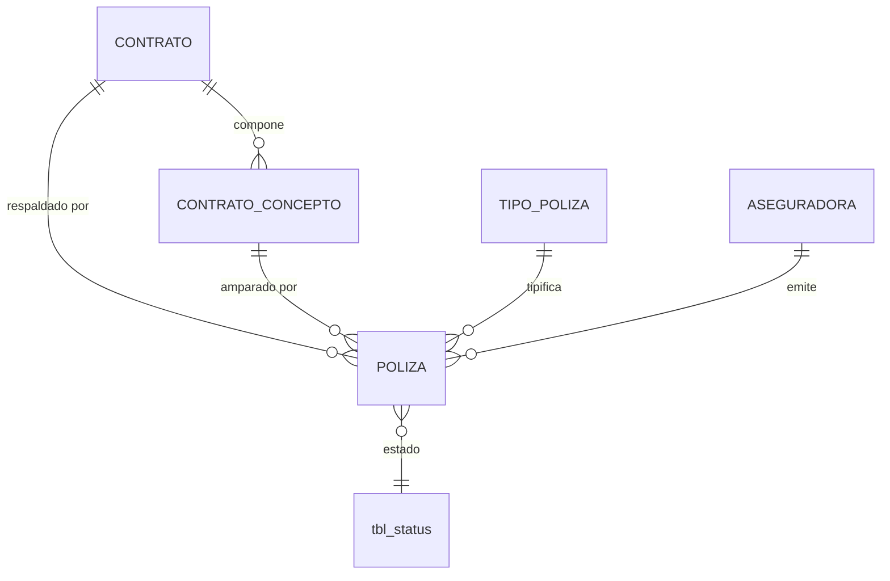

# ADR-0018: Pólizas

## Estado

**Propuesto.**

Las pólizas **no existen** en el código ni en el esquema. Este ADR documenta la decisión arquitectónica recomendada.

## Fecha

2026-09-10 — versión inicial.

## Contexto

Las pólizas garantizan el cumplimiento del contrato. Cada una declara:

```text
Fecha de vigencia · Tipo de póliza · Porcentaje del contrato
Concepto sobre el cual aplica · Observación · Aseguradora
```

El atributo que distingue este modelo de un adjunto documental es el **concepto sobre el cual aplica**: la póliza no ampara "el contrato" en abstracto, sino un acto contractual identificable — el valor inicial, un otrosí concreto, o el otrosí de liquidación ([ADR-0016](0016-conceptos-contractuales.md)).

Esa decisión tiene una consecuencia directa: **cuando un otrosí amplía el valor del contrato, la póliza del valor inicial no lo cubre.** El modelo debe hacer visible esa brecha de cobertura.

## Problema

Tres problemas distintos.

**1. La base de cálculo del porcentaje no está definida.** Un 10 % sobre el valor antes de IVA y un 10 % sobre el valor con IVA son importes distintos. Sin una base declarada, cada usuario calculará el suyo y el valor asegurado será incomparable entre contratos.

**2. La cobertura por concepto puede quedar incompleta sin señal.** Si un otrosí no recibe póliza, el contrato queda parcialmente desamparado y nada lo advierte.

**3. La póliza es evidencia contractual.** Modificarla o eliminarla destruye el rastro de qué estuvo amparado y cuándo — información que puede necesitarse años después ante una reclamación.

## Estado actual

**No se encontró evidencia de implementación.**

| Elemento | Resultado |
| --- | --- |
| Tabla de pólizas | **No existe** |
| Tabla de tipos de póliza | **No existe** — ver [ADR-0019](0019-tipos-poliza.md) |
| Maestro de aseguradoras | **No existe** — ver [ADR-0003](0003-aseguradoras.md) |
| Tabla de contratos y de conceptos | **No existen** |
| Módulo backend o vista | **No existen** |
| Cualquier fórmula de cálculo de póliza | **No existe** |

Respecto de las preguntas concretas del alcance:

| Pregunta | Respuesta |
| --- | --- |
| ¿Cómo se relaciona una póliza con el contrato? | No se encontró evidencia en la implementación actual |
| ¿Puede haber múltiples pólizas? | No aplica |
| ¿Una póliza aplica a un único concepto? | No aplica |
| ¿Existe histórico? | No existe historial de ninguna entidad en el sistema |
| ¿Puede eliminarse? | No aplica |
| **¿La póliza se calcula antes o después de IVA?** | **No se encontró evidencia. Decisión pendiente.** Ver `Decisión 4` |

Sobre el punto de la base de cálculo, el alcance advierte expresamente que no se asuma la respuesta. **No hay código, esquema, configuración ni fórmula que la determine.** Se documenta como decisión pendiente con alternativas evaluadas.

Único elemento adyacente en el sistema actual: `tbl_documents` permite adjuntar archivos con un discriminador `doc_type enum('USERS','PROFILES','PAGINAS','PERMISOS')`. **No contempla contratos ni pólizas**, y su `doc_id_ref` no tiene clave foránea.

## Decisión

1. **La póliza pertenece al contrato y ampara un concepto contractual identificable.** Dos claves foráneas obligatorias: al contrato y al concepto.

2. **Un contrato puede tener múltiples pólizas. Una póliza ampara exactamente un concepto.** Un concepto puede tener varias pólizas de tipos distintos —cumplimiento, estabilidad, salarios— y esa es la razón de la cardinalidad.

3. **El sistema detecta y expone los conceptos sin póliza.** No es un error que impida operar, pero sí un hallazgo visible en el expediente del contrato y en los indicadores de [ADR-0002](0002-dashboard.md).

4. **La base de cálculo del porcentaje es configurable por tipo de póliza** ([ADR-0019](0019-tipos-poliza.md)), no una constante del sistema.

   **Estado: Pendiente de validación.** Se selecciona la alternativa C por las razones de la sección siguiente, pero **los valores concretos de base por cada tipo de póliza deben confirmarse con el área usuaria y con la aseguradora antes de implementar.**

5. **El valor asegurado se calcula y no se captura.** Resulta de aplicar el porcentaje sobre la base determinada por el tipo de póliza, evaluada sobre el concepto amparado. Se recalcula si el concepto cambia — cosa que solo es posible antes de que existan facturas ([ADR-0016](0016-conceptos-contractuales.md)).

6. **La póliza no se elimina físicamente.** Una póliza registrada por error se anula, conservando el registro y el motivo.

7. **La modificación de una póliza vigente genera una versión nueva, no una edición en sitio.** La póliza anterior queda cerrada con su periodo de validez. El expediente conserva la secuencia completa de amparos.

8. **La fecha de vigencia admite ausencia y ese caso es una categoría explícita**, no una exclusión silenciosa. Ver [ADR-0002](0002-dashboard.md), donde "sin fecha de vigencia" es una de las cinco categorías de los indicadores.

9. **La aseguradora referenciada debe estar activa al registrar la póliza; desactivarla después no invalida las pólizas existentes** ([ADR-0003](0003-aseguradoras.md)).

10. **Las pólizas se gestionan en cualquier estado del contrato salvo `LIQUIDADO`**, donde quedan en solo consulta ([ADR-0017](0017-estados-contrato.md)).

11. **Auditoría funcional completa.** La póliza es evidencia contractual.

## Justificación

- **Amparo por concepto y no por contrato**: es la decisión estructural de este ADR. Si la póliza amparara "el contrato", sería imposible responder si un otrosí de ampliación quedó cubierto. Anclarla al concepto convierte una pregunta difícil en una consulta trivial: conceptos sin póliza.

- **Base configurable por tipo (alternativa C)**: el alcance funcional describe el maestro de tipos de póliza con un atributo "aplica sobre subtotal o IVA". Esa descripción **ya presupone que la base varía por tipo**. Fijar una base única en el sistema contradiría el maestro que el propio alcance define. Además, distintos amparos se calculan de forma distinta en la práctica aseguradora: una póliza de cumplimiento y una de estabilidad de obra no comparten necesariamente base.

- **Valor asegurado calculado**: si se capturara, podría discrepar del porcentaje y del valor del concepto sin que nada lo detecte. Es el mismo razonamiento que [ADR-0016](0016-conceptos-contractuales.md) aplica a los valores del contrato: se almacena lo pactado —el porcentaje— y se deriva su consecuencia.

- **Versionado en lugar de edición**: una póliza es evidencia. Si en marzo se amparó el 10 % y en junio se modificó al 20 %, el expediente debe mostrar ambos hechos y sus fechas, no solo el estado final. Editar en sitio destruye la respuesta a "qué estaba amparado en abril".

- **Conceptos sin póliza como hallazgo y no como bloqueo**: impedir crear un otrosí sin póliza detendría la operación por un trámite que suele ser posterior. Exponerlo como hallazgo permite operar y a la vez no perderlo de vista.

- **Fecha de vigencia nula como categoría**: es la aplicación directa de la decisión 6 de [ADR-0002](0002-dashboard.md). Excluir del conteo las pólizas sin fecha haría que el total no cuadrara y nadie sabría si faltan datos o hay un error de cálculo.

## Alternativas consideradas

### Base de cálculo del porcentaje — las tres alternativas del alcance

| | Alternativa | A favor | En contra |
| --- | --- | --- | --- |
| **A** | **Base antes de IVA** (costo directo + AIU) | El IVA es un impuesto trasladado, no valor de la obra ejecutada; el amparo cubre la prestación, no la carga fiscal; base estable frente a cambios de tarifa de IVA | Si la aseguradora exige amparar el valor total facturado, la cobertura queda corta |
| **B** | **Base con IVA** (valor total del concepto) | Cubre el importe efectivamente comprometido; simple de explicar; una sola regla | El valor asegurado varía si cambia la tarifa de IVA sin que cambie el contrato; encarece la prima sobre un componente que no es riesgo de obra |
| **C** | **Configurable por tipo de póliza** *(seleccionada)* | Corresponde al maestro que el propio alcance define; permite que cumplimiento y estabilidad usen bases distintas; no impone una regla única a casos heterogéneos | Requiere que cada tipo declare su base correctamente; un tipo mal configurado produce valores asegurados erróneos de forma silenciosa |

Se selecciona **C**, y se marca la configuración concreta de cada tipo como **pendiente de validación**. El riesgo señalado en la columna "En contra" se mitiga con la auditoría funcional del maestro ([ADR-0019](0019-tipos-poliza.md)) y haciendo la base visible en el detalle de cada póliza.

### Relación póliza-contrato

| | Alternativa | Evaluación |
| --- | --- | --- |
| **A** | Póliza ligada solo al contrato | Simple, pero **no permite saber qué actos quedaron amparados**. Descartada |
| **B** | Póliza ligada solo al concepto | El contrato se deduce del concepto. Correcto en teoría, pero obliga a unir dos tablas en toda consulta de pólizas de un contrato |
| **C** | **Ligada a ambos** *(seleccionada)* | Redundancia deliberada y controlada: el contrato es consultable directamente y el concepto da la precisión del amparo. Exige validar que el concepto pertenezca al contrato |

### Modificación de pólizas

| | Alternativa | Evaluación |
| --- | --- | --- |
| **A** | Edición en sitio | La más simple. **Destruye la evidencia histórica.** Descartada |
| **B** | **Versionado** *(seleccionada)* | Conserva la secuencia completa de amparos. Coste: la consulta debe filtrar la versión vigente |
| **C** | Inmutable total, sin corrección posible | Un error de digitación obligaría a anular y recrear. Innecesariamente rígido |

## Modelo arquitectónico

Modelo propuesto. **Ninguna de estas tablas existe hoy.**



```text
POLIZA
  ├── contrato             FK  NOT NULL  ON DELETE RESTRICT
  ├── concepto             FK  NOT NULL  ON DELETE RESTRICT
  │                            (debe pertenecer al contrato)
  ├── tipo de póliza       FK  NOT NULL  → ADR-0019
  ├── aseguradora          FK  NOT NULL  → ADR-0003
  ├── número de póliza
  ├── porcentaje del contrato   decimal
  ├── fecha inicio de vigencia  NULL admitido
  ├── fecha fin de vigencia     NULL admitido
  ├── observación
  ├── versión               entero, secuencial por póliza lógica
  ├── vigente               booleano — solo una versión vigente
  ├── sta_id                → tbl_status
  └── auditoría estándar

  ✗ NO almacena el valor asegurado  → se deriva del porcentaje y la base del tipo
```

Cálculo del valor asegurado:

```text
base = según el tipo de póliza (ADR-0019), evaluada sobre el CONCEPTO amparado
       A → costo directo + AIU            (antes de IVA)
       B → costo directo + AIU + IVA      (valor total)

valor asegurado = base × porcentaje de la póliza

Calculado en backend. Nunca capturado. Nunca almacenado.
```

Cobertura por concepto — la consulta que este modelo hace posible:

```text
Para cada CONCEPTO del contrato:
   ├── ¿tiene al menos una póliza vigente del tipo exigido?
   │       SÍ  ──> amparado
   │       NO  ──> CONCEPTO SIN PÓLIZA  ← hallazgo visible en el expediente
   │
   └── ¿la vigencia de esa póliza cubre el periodo requerido?
           sin fecha ──> "sin fecha de vigencia"   → categoría de ADR-0002
```

## Reglas de negocio

**No se encontró evidencia en la implementación actual.** Reglas propuestas:

1. Toda póliza pertenece a un contrato y ampara exactamente un concepto de ese contrato.
2. Un contrato puede tener múltiples pólizas.
3. Un concepto puede tener múltiples pólizas de tipos distintos.
4. El valor asegurado se deriva del porcentaje y de la base del tipo de póliza.
5. La base de cálculo la determina el tipo de póliza, no la póliza individual.
6. La aseguradora debe estar activa al registrar la póliza.
7. Desactivar una aseguradora no invalida las pólizas existentes.
8. La fecha de vigencia puede estar ausente; ese caso se reporta explícitamente.
9. La fecha fin de vigencia, cuando existe, es posterior a la de inicio.
10. Modificar una póliza genera una versión nueva; la anterior queda cerrada.
11. Solo una versión de cada póliza está vigente a la vez.
12. Las pólizas no se eliminan físicamente; se anulan con motivo.
13. Un contrato `LIQUIDADO` no admite alta ni modificación de pólizas.
14. Los conceptos sin póliza se exponen como hallazgo, no bloquean la operación.

**Pendiente de validación:** qué tipos de póliza son obligatorios por tipo de contrato; si la vigencia de las pólizas condiciona la liquidación (condición `C8` de [ADR-0017](0017-estados-contrato.md)); si el porcentaje tiene mínimos por tipo; qué periodo debe cubrir la vigencia respecto de la fecha fin del contrato.

## Seguridad

- **Toda operación exige permiso verificado en backend.** Gestionar pólizas es un permiso propio, distinto de editar el contrato.
- **El valor asegurado nunca se acepta desde el cliente.** Se deriva en el servidor. Aceptarlo permitiría declarar un amparo superior al real sin que el porcentaje lo respalde.
- **La base de cálculo nunca se acepta desde el cliente.** La determina el tipo de póliza.
- **El concepto amparado debe validarse como perteneciente al contrato.** La clave foránea garantiza que el concepto exista, no que sea del contrato correcto: es una invariante entre dos ramas del mismo árbol y solo el backend puede verificarla.
- La versión y la marca de vigencia las gestiona el backend, nunca el cliente.
- Consultas parametrizadas. El patrón vigente en `paginationUsers` interpola once parámetros del cliente en la cadena SQL.

## Autorización

Permisos propuestos:

```text
CONSULTAR PÓLIZAS
CREAR PÓLIZA
EDITAR PÓLIZA
ANULAR PÓLIZA
```

`ANULAR` reemplaza a `ELIMINAR`: no existe eliminación física, y anular es una operación con motivo y auditoría.

**Ninguno existe hoy.** El catálogo real son ocho permisos sobre perfiles y usuarios, declarados en `client/src/contexts/permissions/permissionsConfig.js`.

## Auditoría

**Nivel requerido: auditoría funcional completa.** La póliza es evidencia contractual.

| Información | Nivel |
| --- | --- |
| Alta de la póliza | **Funcional** — el acto completo |
| Porcentaje | **Funcional** |
| Tipo de póliza | **Funcional** — cambia la base de cálculo |
| Aseguradora | **Funcional** |
| Fechas de vigencia | **Funcional** |
| Concepto amparado | **Funcional** |
| Anulación | **Funcional** — con motivo obligatorio |
| Observación | Técnica |

El versionado de la decisión 7 **es en sí mismo un mecanismo de trazabilidad**, complementario a la bitácora: la secuencia de versiones responde "qué estuvo amparado y cuándo", mientras la bitácora responde "quién lo cambió y desde qué valor".

Requisito heredado: **el autor se toma de `req.user`**, no del cuerpo de la petición como hace todo el backend actual ([ADR-0013](0013-auditoria-trazabilidad.md)).

## Validaciones

| Validación | Frontend | Backend | Base de datos | Clasificación |
| --- | --- | --- | --- | --- |
| Contrato y concepto obligatorios | Propuesta (selectores) | Propuesta | `NOT NULL` + FK | Integridad |
| El concepto pertenece al contrato | Propuesta (filtra el selector) | **Propuesta — obligatoria** | No expresable | **Integridad + Seguridad** |
| Tipo de póliza y aseguradora obligatorios | Propuesta | Propuesta | `NOT NULL` + FK | Integridad |
| Aseguradora activa | Propuesta (selector) | **Propuesta — obligatoria** | No expresable | Regla de negocio |
| Porcentaje entre 0 y 100 | Propuesta | **Propuesta — obligatoria** | `CHECK` | Regla de negocio |
| Fecha fin ≥ fecha inicio | Propuesta | **Propuesta — obligatoria** | `CHECK` | Regla de negocio |
| Valor asegurado derivado, no capturado | No aplica | **Propuesta — obligatoria** | No expresable | **Seguridad** |
| Una sola versión vigente | No aplica | Propuesta | **`UNIQUE` sobre columna generada** | **Integridad** |
| Contrato en estado que admite el acto | Propuesta (oculta) | **Propuesta — obligatoria** | No expresable | Regla de negocio |
| Permiso de la acción | Propuesta (oculta) | **Propuesta — obligatoria** | No aplica | **Seguridad** |

## Integridad de datos

Requisitos propuestos:

- FK a contrato, concepto, tipo de póliza, aseguradora y `tbl_status`, todas `ON DELETE RESTRICT` —coherente con las siete claves foráneas del esquema actual, todas `RESTRICT`—.
- `UNIQUE` sobre columna generada: una sola versión vigente por póliza lógica.
- `CHECK` sobre el rango del porcentaje y sobre la coherencia de fechas. MySQL 8 los soporta; **el esquema actual no usa ninguno**.
- Índices sobre contrato, concepto, aseguradora y fecha fin de vigencia. El último es necesario para los indicadores de vencimiento de [ADR-0002](0002-dashboard.md).
- Tipo decimal exacto para el porcentaje.
- `utf8mb4` con colación consistente.
- Sin migraciones versionadas en el proyecto.

## Transacciones

Las pólizas se capturan típicamente junto con el contrato o el otrosí que amparan, y forman parte de esa transacción:

```text
BEGIN
  INSERT contrato / concepto
  INSERT pólizas asociadas
  INSERT auditoría
COMMIT
```

El versionado también es transaccional:

```text
BEGIN
  UPDATE póliza anterior: vigente = false, cierre de periodo
  INSERT versión nueva: vigente = true
  INSERT auditoría
COMMIT
```

Sin atomicidad, el segundo caso puede dejar **dos versiones vigentes** o **ninguna** — ambos estados corrompen la respuesta a "qué está amparado hoy". El índice único sobre columna generada actúa como red de seguridad frente al primero.

**Precaución verificada:** `executeQuery` en `db.config.js` toma una conexión nueva del pool si se omite el tercer parámetro, y esa escritura sobrevive al `rollback`.

Ver [ADR-0027](0027-integridad-transaccional.md).

## Concurrencia

**Escenario 1 — Dos versiones vigentes.** Dos usuarios modifican la misma póliza a la vez. Ambos cierran la versión anterior y ambos insertan una nueva marcada como vigente.

- Protección: el índice único sobre columna generada impide la segunda inserción; el motor rechaza la carrera perdida.
- Complemento: `SELECT ... FOR UPDATE` sobre la fila del contrato serializa las operaciones de su agregado, de forma coherente con [ADR-0015](0015-contratos.md), [ADR-0016](0016-conceptos-contractuales.md) y [ADR-0027](0027-integridad-transaccional.md).

**Escenario 2 — Póliza registrada mientras se modifica su concepto.** El concepto cambia de costo directo y el valor asegurado deja de corresponder.

- Protección: el mismo bloqueo, más la inmutabilidad del concepto tras la primera factura aprobada ([ADR-0016](0016-conceptos-contractuales.md)). El valor asegurado, al ser derivado, se recalcula solo.

El riesgo de concurrencia en pólizas es **menor que en saldos**: no hay un recurso finito que pueda sobregirarse. Ver [ADR-0024](0024-amortizacion-anticipo.md) y [ADR-0025](0025-retenciones.md) para el caso crítico.

## Fuente de verdad

| Dato | Naturaleza | Fuente de verdad | Momento |
| --- | --- | --- | --- |
| Porcentaje de la póliza | **Almacenado** | Captura del usuario | Al guardar |
| Tipo, aseguradora, concepto, número | **Almacenado** | Captura del usuario | Al guardar |
| Fechas de vigencia | **Almacenado** | Captura del usuario | Al guardar |
| **Base de cálculo** | **Configurada** | Tipo de póliza ([ADR-0019](0019-tipos-poliza.md)) | Al consultar el tipo |
| **Valor asegurado** | **Calculado, nunca almacenado** | Base del concepto × porcentaje | En cada consulta |
| **Estado de vigencia** (vigente, a vencer, vencida) | **Calculado** | Fechas contra la fecha del servidor ([ADR-0002](0002-dashboard.md)) | En cada consulta |
| **Conceptos sin póliza** | **Calculado** | Diferencia entre conceptos y pólizas | En cada consulta |
| Versión vigente | **Almacenado** | Marca gestionada por el backend | Al versionar |

**El estado de vigencia se calcula siempre contra la fecha del servidor con zona horaria explícita**, nunca contra la del cliente ([ADR-0002](0002-dashboard.md), decisión 3). La conexión a base de datos del proyecto **no fija zona horaria**, lo que debe corregirse antes de construir estos cálculos.

## Inmutabilidad

| Momento | Qué queda inmutable |
| --- | --- |
| **Al cerrarse una versión** | La versión cerrada es inmutable en su totalidad |
| **Siempre** | El contrato y el concepto amparados: cambiarlos reasignaría el amparo a otro acto |
| **Al pasar el contrato a `LIQUIDADO`** | Todas las pólizas quedan en solo consulta |

Toda corrección posterior al cierre de una versión se hace mediante una versión nueva, nunca editando la anterior. Una póliza anulada permanece registrada con su motivo.

Es la misma política que [ADR-0016](0016-conceptos-contractuales.md) aplica a los conceptos y [ADR-0020](0020-facturacion.md) a las facturas: **corregir por movimiento nuevo, nunca por edición en sitio.**

## Consecuencias

### Positivas

- Es posible responder qué acto contractual quedó amparado y cuál no.
- Los conceptos sin póliza se hacen visibles como información de gestión.
- El valor asegurado no puede discrepar del porcentaje ni de la base, porque no se almacena.
- El versionado conserva la secuencia completa de amparos.
- La base configurable por tipo evita imponer una regla única a amparos heterogéneos.
- Habilita las cinco categorías de estado de póliza de [ADR-0002](0002-dashboard.md).

### Negativas

- La configuración de la base por tipo debe ser correcta: un tipo mal configurado produce valores asegurados erróneos de forma silenciosa.
- El versionado multiplica las filas y obliga a filtrar la versión vigente en toda consulta.
- La validación de coherencia concepto-contrato vive en el servicio, no en el esquema.
- Depende de tres entidades inexistentes: contratos, conceptos y el maestro de aseguradoras.

## Riesgos

| Riesgo | Severidad | Descripción |
| --- | --- | --- |
| Base de cálculo indefinida | **Alto** | Sin base declarada, cada usuario calcula la suya y los valores son incomparables |
| Valor asegurado capturado | **Alto** | Permitiría declarar un amparo que el porcentaje no respalda |
| Tipo de póliza mal configurado | **Alto** | Produce valores asegurados erróneos sin señal visible |
| Póliza ligada solo al contrato | **Alto** | Imposibilita saber si un otrosí quedó amparado |
| Edición en sitio | **Alto** | Destruye la evidencia de qué estuvo amparado y cuándo |
| Concepto de otro contrato | **Medio** | La FK no verifica la coherencia entre ramas del árbol |
| Dos versiones vigentes | **Medio** | Corrompe la respuesta a "qué está amparado hoy" |
| Vigencia calculada con la fecha del cliente | **Medio** | Estados distintos según el reloj y la zona horaria del usuario |
| Conceptos sin póliza no detectados | **Medio** | Cobertura incompleta que nadie advierte |
| Sin autorización en backend | **Crítico** | Estado actual del sistema |

## Impacto técnico

### Frontend

- Sección de pólizas dentro del expediente del contrato, con el concepto amparado visible en cada fila.
- **Indicador de conceptos sin póliza** en el propio expediente.
- El valor asegurado se muestra calculado, en solo lectura, con la base indicada para que el usuario entienda de dónde sale.
- El selector de concepto debe filtrarse por el contrato.
- El historial de versiones de una póliza debe ser consultable.
- `GenericFormSection.jsx` soporta `dropdown`, `date`, `float` y `textarea`.
- `DataTable.jsx`, `BaseDialog.jsx`, `ConfirmDialog.jsx` y `StatusChip.jsx` son reutilizables.

### Backend

- Módulo de pólizas, o submódulo de contratos.
- Función de cálculo del valor asegurado que consulte la base del tipo de póliza.
- Consulta de cobertura: conceptos sin póliza por contrato.
- Cálculo de estado de vigencia con fecha del servidor, compartido con los indicadores de [ADR-0002](0002-dashboard.md).
- Validación de coherencia concepto-contrato.

### Base de datos

- Tabla nueva. Depende de contratos, conceptos, tipos de póliza y aseguradoras: **ninguna existe**.
- Requiere columnas generadas, índices únicos sobre ellas y `CHECK`: no usados hoy.
- Índice sobre fecha fin de vigencia para los indicadores.
- **Zona horaria explícita en la conexión**, hoy ausente.
- Sin migraciones versionadas.

### Infraestructura

- El documento físico de la póliza puede almacenarse mediante `tbl_documents`, cuyo `enum` `doc_type` **no contempla contratos ni pólizas** y debería ampliarse. Su `doc_id_ref` no tiene clave foránea.
- `tbl_business_rules` almacena rutas de SharePoint para facturas (`rul_invoicing_site`, `rul_invoicing_library`, `rul_invoice_folder`, `rul_invoice_path`) mediante `microsoftGraph`. **No hay equivalente para pólizas**, y sería el mecanismo natural si se decide almacenarlas allí. Nota de seguridad ajena a este ADR: esa tabla guarda `rul_client_secret` en texto plano, y las cuatro rutas de `microsoftGraph.routes.js` **no tienen `verifyToken`**.

## Arquitectura objetivo

| Área | Actual | Objetivo | Brecha |
| --- | --- | --- | --- |
| Entidad póliza | No existe | Ligada a contrato y concepto | **Alta** |
| Base de cálculo | No existe | Configurable por tipo de póliza | **Alta** |
| Valor asegurado | No existe | Calculado, nunca almacenado | **Alta** |
| Cobertura por concepto | No existe | Consulta de conceptos sin póliza | **Alta** |
| Modificación | No aplica | Versionado, sin edición en sitio | **Alta** |
| Vigencia | No aplica | Calculada con fecha del servidor; nulos como categoría | **Media** |
| Eliminación | No aplica | Anulación con motivo, sin borrado físico | **Media** |
| Permisos | No existen | Cuatro acciones propias | **Media** |
| Auditoría | Autor desde el body | Funcional completa, autor desde el token | **Alta** |

## Brechas identificadas

| # | Brecha | Severidad |
| --- | --- | --- |
| B1 | La entidad póliza no existe en ninguna capa | **Alta** |
| B2 | No existen contratos, conceptos ni el maestro de aseguradoras | **Alta** — bloqueante |
| B3 | **Base de cálculo del porcentaje sin definir** | **Alta** — decisión de negocio pendiente |
| B4 | Tipos de póliza obligatorios por tipo de contrato sin definir | **Media** — decisión de negocio pendiente |
| B5 | Si la vigencia condiciona la liquidación (`C8`) sin definir | **Media** — decisión de negocio pendiente |
| B6 | Sin `UNIQUE`, `CHECK` ni columnas generadas en el esquema | **Alta** |
| B7 | Zona horaria no explícita en la conexión a base de datos | **Media** |
| B8 | `tbl_documents.doc_type` no contempla contratos ni pólizas | **Media** |
| B9 | Ninguna ruta del backend verifica permisos | **Crítica** |
| B10 | El autor de la auditoría proviene del cliente | **Alta** |
| B11 | Sin migraciones versionadas | **Media** |
| B12 | Rutas de `microsoftGraph` sin `verifyToken`; `rul_client_secret` en texto plano | **Alta** — ajena a este ADR |

## Plan de implementación

Recomendación derivada del análisis. **No fue ejecutada.**

**Fase 0 — Prerrequisitos (B2, B9, B11)**
Contratos ([ADR-0015](0015-contratos.md)), conceptos ([ADR-0016](0016-conceptos-contractuales.md)), aseguradoras ([ADR-0003](0003-aseguradoras.md)) y tipos de póliza ([ADR-0019](0019-tipos-poliza.md)). Autorización en backend. Migraciones versionadas.

**Fase 1 — Decisiones de negocio (B3, B4, B5)**
**Bloqueante:** confirmar la base de cálculo de cada tipo de póliza con el área usuaria y con la aseguradora. Definir tipos obligatorios por tipo de contrato y si la vigencia condiciona la liquidación.

**Fase 2 — Modelo (B6, B7)**
Tabla con FK, `CHECK`, columnas generadas e índice sobre fecha fin de vigencia. Zona horaria explícita en la conexión.

**Fase 3 — Cálculo**
Valor asegurado derivado. Estado de vigencia con fecha del servidor, compartido con [ADR-0002](0002-dashboard.md).

**Fase 4 — Cobertura**
Consulta de conceptos sin póliza y su exposición en el expediente y en el dashboard.

**Fase 5 — Versionado y permisos (B10)**
Versionado transaccional. Cuatro permisos en backend. Auditoría funcional con autor desde el token.

**Fase 6 — Documentos (B8)**
Ampliar `doc_type` para pólizas, o definir su almacenamiento en SharePoint.

## ADR relacionados

- [ADR-0019 — Tipos de póliza](0019-tipos-poliza.md) — determina la base de cálculo
- [ADR-0016 — Conceptos contractuales](0016-conceptos-contractuales.md) — objeto del amparo
- [ADR-0015 — Contratos](0015-contratos.md) · [ADR-0017 — Estados de contrato](0017-estados-contrato.md) — condición `C8`
- [ADR-0003 — Aseguradoras](0003-aseguradoras.md) — emisor
- [ADR-0002 — Dashboard](0002-dashboard.md) — indicadores de estado de póliza
- [ADR-0027 — Integridad transaccional del CORE](0027-integridad-transaccional.md)
- [ADR-0013 — Auditoría](0013-auditoria-trazabilidad.md) · [ADR-0014 — Autorización](0014-autorizacion-permisos.md)

## Referencias

- `database/bdintervewebpack.sql` — `tbl_documents` (`doc_type`, `doc_id_ref` sin FK), `tbl_business_rules`, `tbl_status`
- `server/src/modules/microsoftGraph/microsoftGraph.routes.js` — rutas sin `verifyToken`
- `server/src/common/configs/db.config.js` — `executeQuery` y el manejo de conexiones
- `server/src/common/configs/winston.config.js` — zona horaria aplicada solo a registros
- `client/src/ui-component/extended/GenericFormSection.jsx`
