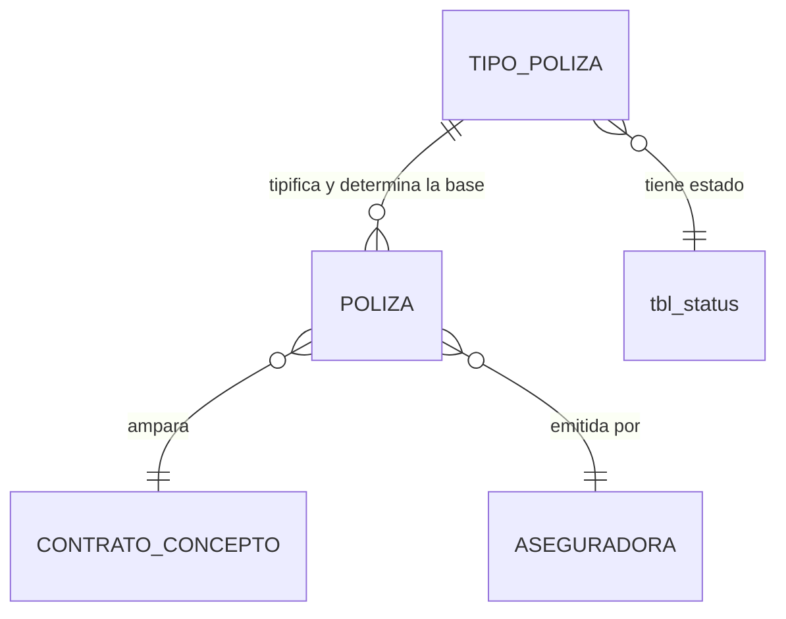

# ADR-0019: Tipos de póliza

## Estado

**Propuesto.**

El maestro de tipos de póliza **no existe** en el código ni en el esquema. Este ADR documenta la decisión arquitectónica recomendada y registra una **ambigüedad semántica sin resolver** en la definición funcional del maestro.

## Fecha

2026-09-10 — versión inicial.

## Contexto

El maestro de tipos de póliza tiene dos atributos según el alcance funcional:

```text
Nombre
Aplica sobre subtotal o IVA
```

El segundo atributo no es una etiqueta descriptiva: **determina la base sobre la que se calcula el valor asegurado de toda póliza de ese tipo** ([ADR-0018](0018-polizas.md), decisión 4). Es un maestro de configuración con efecto directo sobre importes.

Eso lo coloca en la misma categoría que [ADR-0006](0006-tipos-contrato.md): no es un catálogo, es **metadato que gobierna un cálculo**.

## Problema

La opción `SUBTOTAL` o `IVA` es semánticamente ambigua, y la ambigüedad es material porque produce importes distintos.

`SUBTOTAL` admite al menos dos lecturas:

```text
a) costo directo                        (sin AIU, sin IVA)
b) costo directo + AIU                  (base gravable, antes de IVA)
```

`IVA` admite al menos tres:

```text
c) el valor del IVA únicamente          (una póliza que ampara solo el impuesto)
d) el valor total, IVA incluido         ("aplica sobre [el valor con] IVA")
e) la base gravable del IVA             (equivalente a b)
```

La lectura **(c)** —amparar únicamente el impuesto— es económicamente inusual. La lectura **(d)** es la más plausible por el uso corriente de la expresión, pero **plausible no es verificado**.

El alcance funcional es explícito en este punto: *"No cambiar la semántica sin evidencia."* No hay evidencia. Por tanto el problema a resolver es doble: qué significa el atributo, y si dos opciones bastan.

## Estado actual

**No se encontró evidencia de implementación.**

| Elemento | Resultado |
| --- | --- |
| Tabla de tipos de póliza | **No existe** |
| Tabla de pólizas | **No existe** |
| Cualquier configuración de base de cálculo | **No existe** en ninguna capa |
| Módulo backend o vista | **No existen** |
| Permisos asociados | **No existen** |

Respecto de las preguntas concretas del alcance:

| Pregunta | Respuesta |
| --- | --- |
| ¿La configuración `SUBTOTAL` / `IVA` es suficiente? | **No determinable desde el código.** El maestro no existe |
| ¿Qué significa realmente cada valor? | **No se encontró evidencia.** Ver `Problema` |
| ¿Existe otra base posible? | Sí, al menos cinco lecturas plausibles, ninguna verificable |

Precedentes estructurales disponibles en el esquema:

- **`tbl_reasons`** y **`tbl_priorities`** son maestros ya presentes y sin uso en el código. `tbl_reasons` tiene `rea_name`, `sta_id` y auditoría estándar; `tbl_priorities` no tiene `sta_id`. El patrón a seguir es el de `tbl_reasons`.
- **`tbl_status`** tiene un campo `sta_key` —clave simbólica— y `sta_scope` —ámbito—, ambos sin uso. Son la referencia de cómo este proyecto ya previó identificar valores de catálogo por clave y no por número.

## Decisión

1. **Tipo de póliza es un maestro con nombre, estado y base de cálculo.** Es un maestro con efecto funcional, no un catálogo descriptivo.

2. **El nombre es único entre los tipos no eliminados**, garantizado por restricción de base de datos.

3. **La base de cálculo se modela como un valor de dominio cerrado con clave simbólica**, no como un booleano ni como un texto libre:

   ```text
   COSTO_DIRECTO          costo directo del concepto
   BASE_GRAVABLE          costo directo + AIU        (antes de IVA)
   VALOR_TOTAL            costo directo + AIU + IVA
   SOLO_IVA               únicamente el valor del IVA
   ```

4. **Las cuatro opciones se declaran, y la decisión de cuáles se usan realmente queda pendiente de validación.** Declararlas no obliga a poblarlas: el catálogo sembrado contendrá solo las que el negocio confirme.

   **Estado: Pendiente de validación.** Es la decisión bloqueante de este ADR y de [ADR-0018](0018-polizas.md).

5. **Se descarta el modelado como booleano `subtotal / IVA`.** Dos valores no bastan para expresar cuatro bases posibles, y ninguno de los dos nombres identifica sin ambigüedad la base que designa.

6. **La base es un atributo del tipo, no de la póliza individual.** Una póliza no elige su base: la hereda de su tipo. Esto garantiza que todas las pólizas del mismo amparo se calculen igual.

7. **Cambiar la base de un tipo no recalcula las pólizas existentes.** Las pólizas ya emitidas conservan su valor asegurado, derivado con la base vigente al momento de su emisión.

   Para que esto sea posible sin almacenar el valor asegurado —que [ADR-0018](0018-polizas.md) prohíbe—, **la póliza registra la clave de la base con la que fue calculada.** Es una copia deliberada del valor de configuración, no del importe.

8. **La eliminación es lógica** mediante `sta_id = 3` y está **bloqueada si el tipo está en uso**.

9. **Desactivar un tipo impide seleccionarlo en pólizas nuevas y no afecta a las existentes.**

10. **Los cambios de base se auditan funcionalmente.** Es una decisión de configuración con efecto sobre todos los importes futuros de ese tipo.

## Justificación

- **Dominio cerrado con clave simbólica en lugar de booleano**: un booleano solo puede expresar dos estados, y el problema tiene al menos cuatro. Además, un booleano llamado `aplica_iva` no dice si "aplica" significa "incluye el IVA en la base" o "se calcula sobre el IVA". La clave simbólica obliga a nombrar la base y elimina la ambigüedad en el propio esquema.

- **Declarar cuatro opciones sin poblarlas todas**: es más barato que el dominio contemple una base que no se use, a que no contemple una que sí se necesite. Ampliar un `ENUM` en producción es una operación de esquema; sembrar una fila no lo es.

- **Base en el tipo y no en la póliza**: si cada póliza eligiera su base, dos pólizas de cumplimiento del mismo contrato podrían calcularse de forma distinta, y el valor asegurado dejaría de ser comparable. Anclarla al tipo garantiza uniformidad por amparo, que es el propósito de tener un maestro.

- **Registrar en la póliza la clave de la base usada**: es la única forma de conciliar dos decisiones que parecen opuestas. [ADR-0018](0018-polizas.md) prohíbe almacenar el valor asegurado —porque un importe copiado se desincroniza—, pero cambiar la base de un tipo no debe reescribir el pasado. La solución es copiar **la regla**, no **el resultado**: el valor sigue siendo calculado, pero con la base que correspondía. Es la misma distinción que [ADR-0016](0016-conceptos-contractuales.md) hace entre almacenar el porcentaje pactado y derivar su valor.

- **No cambiar la semántica sin evidencia**: el alcance lo exige y es correcto. Adoptar la lectura (d) —"valor total"— porque es la más plausible sería sustituir una ambigüedad por una suposición con apariencia de decisión. La diferencia entre calcular una póliza sobre 100 o sobre 119 es del 19 % del valor asegurado: no es un detalle sobre el que convenga adivinar.

- **Auditoría funcional del cambio de base**: si un tipo cambia de `BASE_GRAVABLE` a `VALOR_TOTAL`, todas las pólizas futuras de ese tipo valen un 19 % más. Es una decisión con efecto económico y debe tener autor y fecha registrados.

## Alternativas consideradas

### Alternativa 1 — Booleano `aplica sobre subtotal / IVA`

Modelado literal del alcance funcional.

- **A favor**: la implementación más simple; corresponde textualmente a lo descrito; una columna.
- **En contra**: **no resuelve la ambigüedad, la codifica.** Dos valores para al menos cuatro bases posibles. El nombre no identifica la base. Ampliar el dominio después exigiría migrar los datos existentes reinterpretando qué quiso decir cada fila.
- **Descartada.**

### Alternativa 2 — Base como fórmula configurable

Almacenar una expresión que el sistema evalúe.

- **A favor**: máxima flexibilidad; una base nueva no requiere despliegue; cubre casos no previstos.
- **En contra**: una expresión editable desde una interfaz de administración es código, y evaluarlo es un riesgo de ejecución arbitraria. Un error de configuración produciría valores asegurados erróneos en silencio. Exigiría validar y acotar la expresión, con complejidad desproporcionada para cuatro bases posibles.
- **Descartada.** Mismo razonamiento que la alternativa 2 de [ADR-0008](0008-tipos-identificacion.md) sobre expresiones regulares almacenadas.

### Alternativa 3 — Base fija en el sistema, sin configuración

Una única base para todas las pólizas, decidida en el código.

- **A favor**: sin maestro configurable; sin riesgo de configuración incorrecta; una sola regla que explicar.
- **En contra**: contradice el maestro que el propio alcance define, que declara la base como atributo del tipo. Distintos amparos —cumplimiento, estabilidad, salarios— no comparten necesariamente base en la práctica aseguradora.
- **Descartada.**

### Alternativa 4 — Dominio cerrado con clave simbólica (seleccionada)

Cuatro bases nombradas, configurables por tipo, con la clave registrada en cada póliza emitida.

- **A favor**: elimina la ambigüedad en el esquema; permite bases distintas por amparo; el valor sigue siendo derivado; cambiar la base no reescribe el pasado; añadir una base es un cambio acotado y revisable.
- **En contra**: exige poblar correctamente el catálogo; una base mal asignada produce importes erróneos sin señal visible.
- **Seleccionada.**

## Modelo arquitectónico

Modelo propuesto. **Ninguna de estas tablas existe hoy.**



```text
TIPO_POLIZA
  ├── identificador
  ├── nombre        (único entre no eliminados)
  ├── clave         simbólica, estable, no editable
  ├── base de cálculo   COSTO_DIRECTO | BASE_GRAVABLE | VALOR_TOTAL | SOLO_IVA
  ├── sta_id        → tbl_status
  └── auditoría estándar

        NO CONTIENE:
        ✗ ninguna póliza concreta
        ✗ ningún porcentaje: el porcentaje es de la póliza, no del tipo
        ✗ ningún valor asegurado

POLIZA  (ver ADR-0018)
  ├── tipo de póliza          FK
  ├── base aplicada           clave copiada del tipo al emitir  ← congela la REGLA
  ├── porcentaje              capturado
  └── valor asegurado         ✗ NO se almacena: se deriva
```

Resolución de la base:

```text
Al emitir una póliza:
   base_aplicada = base del tipo en ese momento     ← se copia la CLAVE

Al consultar el valor asegurado, en cualquier momento posterior:
   base_valor = evaluar(base_aplicada, concepto amparado)
       COSTO_DIRECTO  → costo directo
       BASE_GRAVABLE  → costo directo + AIU
       VALOR_TOTAL    → costo directo + AIU + IVA
       SOLO_IVA       → IVA

   valor asegurado = base_valor × porcentaje de la póliza
```

La distinción que hace funcionar el modelo:

```text
Se copia   →  la REGLA de cálculo    (base_aplicada)   estable en el tiempo
Se deriva  →  el RESULTADO           (valor asegurado)  siempre recalculado
```

## Reglas de negocio

**No se encontró evidencia en la implementación actual.** Reglas propuestas:

1. Un tipo de póliza tiene nombre, clave, estado y base de cálculo.
2. El nombre es único entre los tipos no eliminados.
3. La base pertenece a un dominio cerrado de cuatro valores.
4. Toda póliza hereda su base del tipo al momento de emitirse.
5. La póliza registra la clave de la base aplicada; el valor asegurado nunca se almacena.
6. Cambiar la base de un tipo no altera las pólizas ya emitidas.
7. Solo los tipos activos pueden seleccionarse en pólizas nuevas.
8. Un tipo en uso no puede eliminarse.
9. Desactivar un tipo no afecta las pólizas existentes.
10. La clave simbólica del tipo es inmutable una vez creado.

**Pendiente de validación:** qué bases usa realmente la organización; qué tipos de póliza existen; si algún tipo es obligatorio según el tipo de contrato; si el porcentaje tiene mínimos por tipo.

## Seguridad

Riesgo bajo por contenido; **alto por efecto**. Un maestro de tres o cuatro filas que determina importes asegurados de todos los contratos.

- **La administración del maestro exige permiso propio**, distinto del de gestionar pólizas. Quien registra una póliza no debería poder cambiar la regla con la que se calcula.
- **La base nunca se acepta desde el cliente al emitir una póliza.** La resuelve el servidor consultando el tipo. Aceptarla permitiría calcular una póliza sobre `VALOR_TOTAL` cuando su tipo exige `BASE_GRAVABLE`, inflando el valor asegurado con una petición manipulada.
- **La clave simbólica no es editable** tras la creación: el código y las pólizas emitidas la referencian.
- Consultas parametrizadas y lista blanca para el campo de ordenamiento. Advertencia preventiva: el módulo `template`, patrón de referencia declarado del proyecto, interpola los filtros del cliente directamente en la cadena SQL.

## Autorización

Permisos propuestos:

```text
CONSULTAR TIPOS DE PÓLIZA
CREAR TIPO DE PÓLIZA
EDITAR TIPO DE PÓLIZA
ELIMINAR TIPO DE PÓLIZA
CONFIGURAR BASE DE CÁLCULO
CAMBIAR ESTADO TIPO DE PÓLIZA
```

`CONFIGURAR BASE DE CÁLCULO` se separa de `EDITAR` deliberadamente: cambiar el nombre de un tipo es cosmético; cambiar su base altera todos los importes asegurados futuros de ese amparo.

Es la misma separación que [ADR-0006](0006-tipos-contrato.md) aplica entre editar un tipo de contrato y configurar sus campos, y que el sistema actual ya aplica entre `edit` (`per_id` 2 y 6) y `assignPermission` (`per_id` 4 y 8).

**Ninguno de estos permisos existe hoy.**

## Auditoría

**Nivel requerido: técnica** para nombre y estado; **funcional** para la base de cálculo.

| Información | Nivel |
| --- | --- |
| **Base de cálculo** | **Funcional** — con valor anterior y nuevo |
| Estado del tipo | **Funcional** |
| Nombre | Técnica |
| Clave simbólica | No aplica — inmutable |

El registro del cambio de base debe conservar **cuántas pólizas activas tenía el tipo en ese momento**. Sin ese dato es imposible dimensionar después el alcance del cambio.

Requisito heredado: el autor se toma de `req.user`, no del cuerpo de la petición como hace todo el backend actual ([ADR-0013](0013-auditoria-trazabilidad.md)).

## Validaciones

| Validación | Frontend | Backend | Base de datos | Clasificación |
| --- | --- | --- | --- | --- |
| Nombre obligatorio | Propuesta | Propuesta | `NOT NULL` | UX + Integridad |
| Nombre único | Propuesta | Propuesta | **`UNIQUE` — obligatorio** | Integridad |
| Clave única e inmutable | Propuesta | **Propuesta — obligatoria** | **`UNIQUE`** | Integridad + Seguridad |
| Base dentro del dominio | Propuesta (selector) | **Propuesta — obligatoria** | `ENUM` | **Integridad** |
| Base obligatoria | Propuesta | Propuesta | `NOT NULL` | Integridad |
| Base no aceptada desde el cliente al emitir póliza | No aplica | **Propuesta — obligatoria** | No expresable | **Seguridad** |
| Tipo activo al emitir una póliza | Propuesta (selector) | **Propuesta — obligatoria** | No expresable | Regla de negocio |
| Sin pólizas antes de eliminar | Propuesta (aviso) | **Propuesta — obligatoria** | No expresable | Regla de negocio |
| Permiso de la acción | Propuesta (oculta) | **Propuesta — obligatoria** | No aplica | **Seguridad** |

## Integridad de datos

Requisitos propuestos:

- `UNIQUE` sobre el nombre, entre los no eliminados.
- `UNIQUE` sobre la clave simbólica.
- `ENUM` o tabla de dominio para la base de cálculo, `NOT NULL`.
- FK a `tbl_status`, `ON DELETE RESTRICT`.
- FK desde póliza al tipo, `ON DELETE RESTRICT`.
- Índice sobre el tipo en la tabla de pólizas, para la verificación de uso al eliminar.
- `utf8mb4` con colación consistente. El esquema actual mezcla `latin1`, `utf8mb3` y `utf8mb4`.
- Sin migraciones versionadas en el proyecto.

**El esquema actual no tiene ninguna restricción `UNIQUE`.** El patrón vigente de verificación por `SELECT` previo dentro de la transacción —`saveProfile`, `saveMasterTemplate`— no resiste concurrencia, como se demuestra en [ADR-0012](0012-proveedores.md).

## Transacciones

Operaciones de tabla única. La transacción se justifica por dos motivos:

1. Atomicidad entre la verificación de unicidad y la escritura.
2. La auditoría funcional del cambio de base va en la misma transacción que el cambio.

Es el patrón ya aplicado en `saveProfile` y `saveMasterTemplate` en el backend actual, corrigiendo su interpolación de filtros.

**Precaución verificada:** `executeQuery` en `db.config.js` toma una conexión nueva del pool si se omite el tercer parámetro, y esa escritura sobrevive al `rollback`.

## Concurrencia

**Escenario 1 — Nombres duplicados.** Dos usuarios crean el mismo tipo simultáneamente. Con el patrón `SELECT`-luego-`INSERT` y sin `UNIQUE`, ambos tienen éxito. Con `UNIQUE`, el motor rechaza el segundo y `error.middleware.js` **ya traduce `ER_DUP_ENTRY` a un `409`**; falta la restricción que lo dispare.

**Escenario 2 — Cambio de base mientras se emite una póliza.** Un administrador cambia la base del tipo mientras otro usuario registra una póliza de ese tipo.

- La póliza copia la clave de la base **dentro de su propia transacción**, por lo que obtiene un valor coherente: o la anterior o la nueva, nunca un estado intermedio.
- No se requiere bloqueo adicional: la decisión 7 hace que ambos resultados sean válidos. Este es un beneficio directo de copiar la regla en lugar de depender del estado vigente del maestro.

El riesgo de concurrencia en este maestro es **bajo**: no hay recurso finito que pueda sobregirarse. Ver [ADR-0024](0024-amortizacion-anticipo.md) y [ADR-0025](0025-retenciones.md) para el caso crítico del CORE.

## Fuente de verdad

| Dato | Naturaleza | Fuente de verdad | Momento |
| --- | --- | --- | --- |
| Nombre y clave del tipo | **Almacenado** | Captura del usuario | Al guardar |
| **Base de cálculo del tipo** | **Almacenado, configurable** | Captura del usuario con permiso propio | Al configurar |
| **Base aplicada a una póliza** | **Almacenado en la póliza** | Copia de la clave del tipo al emitir | Al emitir la póliza |
| **Valor de la base** | **Calculado** | Evaluación de la clave sobre el concepto amparado | En cada consulta |
| **Valor asegurado** | **Calculado, nunca almacenado** | Valor de la base × porcentaje ([ADR-0018](0018-polizas.md)) | En cada consulta |

La fuente de verdad de la base **para una póliza concreta** es la clave copiada en la póliza, no la configuración vigente del tipo. Esa distinción es lo que permite cambiar la configuración sin reescribir el histórico.

## Inmutabilidad

| Elemento | Inmutabilidad |
| --- | --- |
| Clave simbólica del tipo | **Absoluta** desde su creación |
| Base aplicada registrada en una póliza | **Absoluta** — es la regla congelada del amparo |
| Base de cálculo del tipo | Modificable con permiso propio y auditoría funcional; sin efecto retroactivo |
| Nombre del tipo | Modificable con auditoría técnica |

El maestro es configurable; **lo que queda inmutable es su aplicación a cada póliza emitida.** Es la misma política de [ADR-0016](0016-conceptos-contractuales.md): lo pactado se congela, la configuración evoluciona.

## Consecuencias

### Positivas

- La ambigüedad de `SUBTOTAL` / `IVA` se elimina en el propio esquema: cada base tiene nombre propio.
- Distintos amparos pueden calcularse con bases distintas sin condicionar a los demás.
- Cambiar la configuración no reescribe el histórico de pólizas.
- El valor asegurado sigue siendo derivado, sin riesgo de desincronización.
- Añadir una base futura es un cambio acotado y revisable.
- Reutiliza el patrón de clave simbólica que `tbl_status.sta_key` ya previó y no usa.

### Negativas

- Requiere confirmar con el negocio qué bases se usan realmente: sin eso, el maestro no puede sembrarse.
- Un tipo con base mal asignada produce importes erróneos sin señal visible.
- La copia de la clave en cada póliza es una desnormalización deliberada que debe explicarse a quien mantenga el modelo.
- El dominio cerrado obliga a un cambio de esquema si aparece una base no prevista.

## Riesgos

| Riesgo | Severidad | Descripción |
| --- | --- | --- |
| **Semántica de la base sin resolver** | **Alto** | Diferencia de hasta un 19 % en el valor asegurado según la lectura que se adopte |
| Modelado como booleano | **Alto** | Codificaría la ambigüedad en el esquema y exigiría reinterpretar los datos al ampliarlo |
| Base aceptada desde el cliente | **Alto** | Permitiría inflar el valor asegurado con una petición manipulada |
| Tipo con base mal configurada | **Alto** | Importes erróneos en todas sus pólizas, sin señal |
| Cambio de base con efecto retroactivo | **Alto** | Reescribiría el valor asegurado de pólizas ya emitidas |
| Duplicados por concurrencia | **Medio** | Sin `UNIQUE`, el `SELECT` previo no lo impide |
| Clave simbólica editable | **Medio** | Rompería las referencias del código y de las pólizas emitidas |
| Inyección SQL heredada del patrón `template` | **Alto** | Preventiva |
| Sin autorización en backend | **Crítico** | Estado actual del sistema |

## Impacto técnico

### Frontend

- Vista de listado y diálogo del maestro, con los componentes existentes: `DataTable.jsx`, `FilterPopper.jsx`, `BaseDialog.jsx`, `ConfirmDialog.jsx`, `StatusChip.jsx`.
- El selector de base debe mostrar **la descripción de cada opción**, no solo su nombre: el usuario que configura debe entender qué compone cada base.
- El formulario de póliza requiere un selector de tipos activos.
- El detalle de una póliza debe mostrar **qué base se le aplicó**, para que el valor asegurado sea explicable.
- Entrada de menú, ruta y archivo de API.

### Backend

- Módulo con `routes` / `controller` / `service`, siguiendo `modules/template/` **con sus dos defectos corregidos**: interpolación de filtros y convención de auditoría en español (`mas_usu_reg`, `mas_fec_act`) distinta del estándar real del proyecto.
- Función de evaluación de la base, compartida con [ADR-0018](0018-polizas.md) y con [ADR-0026](0026-calculos-facturacion.md).
- Endpoint de selector restringido a tipos activos.
- Verificación de uso en el servicio de eliminación.

### Base de datos

- Tabla nueva, inexistente. Depende de la tabla de pólizas para la relación.
- Requiere `UNIQUE` y `ENUM` o tabla de dominio.
- Datos semilla versionados, una vez confirmadas las bases con el negocio.
- Sin migraciones versionadas.

### Infraestructura

No aplica.

## Arquitectura objetivo

| Área | Actual | Objetivo | Brecha |
| --- | --- | --- | --- |
| Maestro de tipos de póliza | No existe | Nombre, clave, estado y base de cálculo | **Alta** |
| Semántica de la base | Ambigua en el alcance funcional | Dominio cerrado de cuatro claves nombradas | **Alta** |
| Modelado de la base | Descrito como binario | Clave simbólica, no booleano | **Alta** |
| Aplicación a la póliza | No existe | Clave copiada al emitir; valor derivado | **Alta** |
| Efecto de cambiar la base | No aplica | Sin efecto retroactivo | **Alta** |
| Permisos | No existen | Seis acciones, con `CONFIGURAR BASE` separada | **Media** |
| Auditoría | Autor desde el body | Funcional en la base, autor desde el token | **Alta** |

## Brechas identificadas

| # | Brecha | Severidad |
| --- | --- | --- |
| B1 | **Semántica de `SUBTOTAL` / `IVA` sin resolver** | **Alta** — decisión de negocio bloqueante |
| B2 | El maestro no existe en ninguna capa | **Alta** |
| B3 | No existen pólizas, conceptos ni contratos | **Alta** — bloqueante |
| B4 | Qué tipos de póliza existen realmente, sin definir | **Media** — decisión de negocio pendiente |
| B5 | Sin restricciones `UNIQUE` en todo el esquema | **Media** |
| B6 | Patrón de maestro (`template`) con inyección SQL y convención de auditoría incorrecta | **Alta** — preventiva |
| B7 | Sin permisos definidos | **Media** |
| B8 | Ninguna ruta del backend verifica permisos | **Crítica** |
| B9 | El autor de la auditoría proviene del cliente | **Alta** |
| B10 | Sin migraciones versionadas | **Media** |

## Plan de implementación

Recomendación derivada del análisis. **No fue ejecutada.**

**Fase 0 — Decisión de negocio (B1, B4)**
**Bloqueante para este ADR y para [ADR-0018](0018-polizas.md).** Confirmar con el área usuaria y con la aseguradora qué significa cada base, cuáles se usan y qué tipos de póliza existen. Ninguna implementación debe iniciarse antes.

**Fase 1 — Prerrequisitos (B6, B8, B10)**
Corregir o reemplazar el módulo `template` como patrón de referencia. Autorización en backend. Migraciones versionadas.

**Fase 2 — Maestro (B2, B5)**
Tabla con `UNIQUE`, dominio cerrado de bases, clave simbólica inmutable.

**Fase 3 — Datos semilla**
Sembrar y versionar los tipos confirmados en la Fase 0.

**Fase 4 — Integración (B3)**
Función de evaluación de la base compartida con [ADR-0018](0018-polizas.md). Copia de la clave al emitir cada póliza.

**Fase 5 — Permisos y auditoría (B7, B9)**
Seis acciones en backend, con `CONFIGURAR BASE DE CÁLCULO` separada de `EDITAR`. Auditoría funcional del cambio de base, con autor desde el token.

## ADR relacionados

- [ADR-0018 — Pólizas](0018-polizas.md) — consumidor directo de la base de cálculo
- [ADR-0016 — Conceptos contractuales](0016-conceptos-contractuales.md) — objeto sobre el que se evalúa la base
- [ADR-0026 — Cálculos de facturación](0026-calculos-facturacion.md) — composición de costo directo, AIU e IVA
- [ADR-0003 — Aseguradoras](0003-aseguradoras.md) — mismo patrón de maestro
- [ADR-0006 — Tipos de contrato](0006-tipos-contrato.md) — mismo patrón de maestro con efecto funcional
- [ADR-0013 — Auditoría](0013-auditoria-trazabilidad.md) · [ADR-0014 — Autorización](0014-autorizacion-permisos.md)

## Referencias

- `database/bdintervewebpack.sql` — `tbl_reasons` y `tbl_priorities` como patrón estructural; `tbl_status` (`sta_key`, `sta_scope`) como precedente de clave simbólica sin uso
- `server/src/modules/template/` — patrón CRUD, con las salvedades indicadas
- `server/src/common/middlewares/error.middleware.js` — traducción de `ER_DUP_ENTRY` a `409`
- `server/src/common/configs/db.config.js` — `executeQuery` y el manejo de conexiones
- `client/src/ui-component/extended/` — componentes reutilizables
