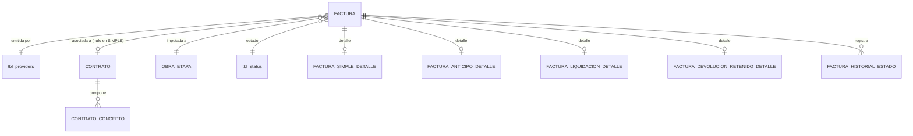
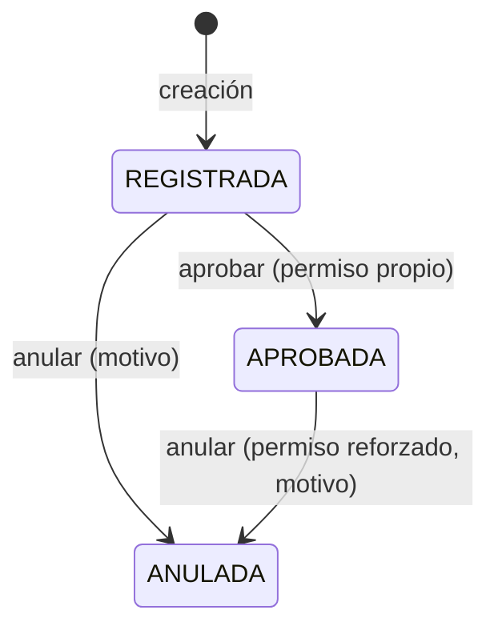

# ADR-0020: Facturación — modelo común y ciclo de vida

## Estado

**Propuesto.**

La facturación **no existe** en el código ni en el esquema. Este ADR documenta la decisión arquitectónica recomendada y **gobierna a los ADR 0021, 0022, 0023, 0024, 0025 y 0026**, que desarrollan sus casos particulares.

## Fecha

2026-09-10 — versión inicial.

## Contexto

La facturación presenta tres comportamientos según el alcance funcional:

```text
FACTURACIÓN
├── SIMPLE            no selecciona contrato; solo proveedor
├── CONTRATO MAYOR    requiere proveedor y contrato
└── SUBCONTRATISTA    requiere proveedor y contrato
```

Y, dentro de las asociadas a contrato, tres tipos documentales:

```text
Factura de anticipo
Factura de liquidación
Factura de devolución de retenido
```

La pregunta arquitectónica central es si esto son entidades distintas, una entidad con tipos, o un encabezado común con detalles especializados.

## Problema

La respuesta determina la mantenibilidad de todo el CORE.

- **Tablas independientes por tipo** duplican el encabezado —número, fechas, comprobante, extracto, estado, auditoría— cuatro veces, y obligan a unir cuatro tablas para responder "todas las facturas de este proveedor".
- **Una tabla única con todos los campos** produce una tabla con la mayoría de columnas nulas y sin forma de exigir obligatoriedad por tipo.
- **Un modelo mal elegido se paga en cada consulta y en cada campo nuevo.**

Hay además dos problemas de ciclo de vida que ningún tipo puede resolver por su cuenta: **qué estados tiene una factura**, y **qué queda inmutable tras su aprobación**.

## Estado actual

**No se encontró evidencia de implementación.**

| Elemento | Resultado |
| --- | --- |
| Tabla de facturas | **No existe** |
| Tabla de estados de factura | **No existe** |
| Módulo backend o vista | **No existen** |
| Rutas en `main.routes.js` | **Ninguna** |
| Permisos de facturación | **No existen** |
| Cualquier columna monetaria en el esquema | **No existe ninguna** en las 14 tablas |

Respecto de las preguntas concretas del alcance:

| Pregunta | Respuesta |
| --- | --- |
| ¿Son tres entidades, una con tipos, o híbrido? | **No determinable desde el código.** No existe ninguna |
| ¿Las facturas tienen estados? | **No se encontró evidencia.** Ver decisión 6 |
| ¿Comparten encabezado, auditoría, permisos, ciclo de vida? | No aplica |

Lo único relacionado con facturación en el sistema actual es `tbl_business_rules`, que almacena **dónde se guardan los archivos de factura en SharePoint**:

```text
rul_invoicing_site · rul_invoicing_library · rul_invoice_folder
rul_invoice_path   · rul_email_invoices
```

Consumido por `microsoftGraph.config.js` y `microsoftGraph.service.js`, cuyas cuatro rutas (`get_sites_drive`, `get_user_drive`, `get_units_drive`, `get_folders_drive`) **no tienen `verifyToken`**. Es configuración de almacenamiento documental, **no el dominio de facturación**. Esa tabla guarda además `rul_client_secret` en texto plano.

## Decisión

1. **Se adopta encabezado común más detalle especializado** — la alternativa C del alcance funcional.

   ```text
   FACTURA              encabezado común a los cuatro tipos
        │
        ├── FACTURA_SIMPLE_DETALLE
        ├── FACTURA_ANTICIPO_DETALLE
        ├── FACTURA_LIQUIDACION_DETALLE
        └── FACTURA_DEVOLUCION_RETENIDO_DETALLE
   ```

2. **El encabezado contiene lo que los cuatro tipos comparten**: proveedor, tipo, número de factura, fecha de factura, fecha de aprobación, número de comprobante, extracto, etapa, estado, descripción y auditoría.

3. **El contrato es un atributo del encabezado, obligatorio para tres tipos y nulo para el simple.**

   | Tipo | Contrato | Etapa |
   | --- | --- | --- |
   | `SIMPLE` | **Nulo** | Obligatoria |
   | `ANTICIPO` | **Obligatorio** | Heredada del contrato |
   | `LIQUIDACION` | **Obligatorio** | Heredada del contrato |
   | `DEVOLUCION_RETENIDO` | **Obligatorio** | Heredada del contrato |

   La regla "contrato obligatorio salvo en el tipo simple" se expresa con un `CHECK` en el esquema.

4. **`CONTRATO MAYOR` y `SUBCONTRATISTA` no son tipos de factura.** Son la naturaleza del proveedor del contrato ([ADR-0010](0010-tipos-proveedor.md)). Una factura asociada a contrato es del mismo tipo documental con independencia de si el proveedor es contratista mayor o subcontratista. Ver [ADR-0021](0021-facturacion-contrato-mayor.md) y [ADR-0022](0022-facturacion-subcontratista.md).

5. **Los cuatro tipos comparten ciclo de vida, permisos base, auditoría e inmutabilidad.** Lo que difiere es su composición económica ([ADR-0026](0026-calculos-facturacion.md)) y sus validaciones de saldo ([ADR-0024](0024-amortizacion-anticipo.md), [ADR-0025](0025-retenciones.md)).

6. **Se adoptan tres estados de factura**, derivados de campos que el propio alcance declara:

   ```text
   REGISTRADA  →  APROBADA  →  (terminal)
        │              │
        └──────────────┴──> ANULADA
   ```

   La existencia de `fecha de aprobación` como campo distinto de `fecha de factura` **es la evidencia de que existe un acto de aprobación** separado del registro. Los tres estados son el mínimo que esa evidencia sostiene.

   **Estado: Pendiente de validación.** El alcance advierte "no inventar estados". Estados adicionales plausibles —rechazada, contabilizada, pagada— **no se adoptan por falta de evidencia**. Si el negocio los requiere, se incorporan a la máquina de estados sin cambiar el modelo.

7. **La aprobación es el hecho que hace que una factura cuente.** Solo las facturas `APROBADA` afectan saldos, condiciones de liquidación e indicadores. Una factura `REGISTRADA` no amortiza anticipo ni acumula retenido.

8. **Tras la aprobación, la información financiera es inmutable.** Toda corrección se hace por anulación más registro nuevo. Ver `Inmutabilidad`.

9. **La anulación no borra**: cambia el estado, exige motivo y revierte el efecto sobre los saldos por su exclusión del cálculo, no por un movimiento compensatorio.

10. **El número de factura es único por proveedor**, garantizado por restricción de base de datos.

    **Estado: Pendiente de validación.** Ver `Alternativas consideradas`.

11. **La creación y la aprobación son operaciones idempotentes**, protegidas por clave de idempotencia. Ver `Concurrencia`.

12. **Las facturas no se eliminan.** Se anulan.

## Justificación

- **Encabezado común más detalle**: los cuatro tipos comparten diez campos de encabezado y difieren en su composición económica. Una tabla única los tendría todos con la mayoría nulos, sin poder exigir obligatoriedad por tipo. Cuatro tablas independientes replicarían el encabezado y harían que "todas las facturas de un proveedor" fuera una unión de cuatro consultas. El modelo híbrido paga una unión por consulta de detalle y resuelve todo lo demás.

- **`CONTRATO MAYOR` y `SUBCONTRATISTA` fuera del tipo de factura**: es la corrección más importante de este ADR sobre la lectura literal del alcance. Si fueran tipos de factura, el mismo documento —una factura de liquidación— tendría dos formas según quién sea el proveedor, duplicando estructura sin diferencia real. **No se encontró ninguna regla que diferencie su facturación**; ver [ADR-0022](0022-facturacion-subcontratista.md), donde este punto se documenta explícitamente.

- **Tres estados y no más**: el alcance advierte no inventar estados, y a la vez declara `fecha de aprobación` como campo. Un campo de fecha de aprobación sin un estado que lo respalde es un dato huérfano. Tres estados son el mínimo que la evidencia sostiene; añadir "pagada" o "contabilizada" sería inventar un flujo que nada indica que exista.

- **Solo lo aprobado cuenta**: es la decisión que hace consistente todo el CORE. Si una factura registrada y sin aprobar ya amortizara anticipo, el saldo disponible dependería de documentos que pueden anularse, y dos usuarios verían saldos distintos según lo que cada uno tenga en trámite. Anclar el efecto a la aprobación da un hecho único, fechado y con responsable.

- **Inmutabilidad tras la aprobación**: una factura aprobada es un documento con efectos contables. Editarla en sitio reescribe un hecho ya ocurrido y descuadra el histórico de saldos que se calculó sobre ella. La corrección por anulación más registro nuevo conserva ambos hechos.

- **Anulación por exclusión y no por contramovimiento**: como los saldos se calculan sobre facturas aprobadas ([ADR-0024](0024-amortizacion-anticipo.md), [ADR-0025](0025-retenciones.md)), excluir la anulada del cálculo revierte su efecto automáticamente. Un contramovimiento duplicaría filas para lograr lo mismo y haría que el histórico mostrara dos hechos donde hubo uno y su corrección.

- **Idempotencia**: el alcance la señala explícitamente. Registrar una factura de anticipo dos veces por doble clic consume dos veces el anticipo disponible. Es un error con efecto patrimonial que ningún control posterior detecta con facilidad.

## Alternativas consideradas

### Modelo de persistencia — las tres alternativas del alcance

| | Alternativa | Mantenibilidad | Integridad | Consultas | Extensibilidad | Duplicación | Complejidad |
| --- | --- | --- | --- | --- | --- | --- | --- |
| **A** | Una tabla para todos los tipos | Mala: cada tipo añade columnas nulas | Mala: no se puede exigir obligatoriedad por tipo sin `CHECK` por columna | Muy buena: sin uniones | Mala: cada tipo nuevo ensancha la tabla | Ninguna | Baja |
| **B** | Tabla independiente por tipo | Mala: el encabezado se replica cuatro veces | Buena por tipo, mala en conjunto | Mala: consultas transversales exigen unión de cuatro tablas | Buena: un tipo nuevo no toca a los demás | **Alta** | Media |
| **C** | **Encabezado común + detalle** *(seleccionada)* | Buena: el encabezado se modifica una vez | **Buena**: obligatoriedad exigible en cada tabla de detalle | Buena: transversales sobre el encabezado; el detalle se une solo cuando hace falta | **Buena**: un tipo nuevo es una tabla de detalle | Ninguna | Media |

Se selecciona **C**. Es también coherente con [ADR-0016](0016-conceptos-contractuales.md), que adopta tabla única con discriminador **porque allí la estructura económica sí es idéntica entre tipos**. Aquí no lo es, y de ahí la diferencia de decisión: el criterio en ambos casos es el mismo —una estructura, una tabla—, aplicado a hechos distintos.

### Ámbito de unicidad del número de factura

| | Ámbito | A favor | En contra |
| --- | --- | --- | --- |
| **A** | Global | Un número identifica una factura sin ambigüedad | Dos proveedores distintos numeran de forma independiente: colisiones legítimas rechazadas |
| **B** | **Por proveedor** *(seleccionada)* | Corresponde a la realidad: cada proveedor lleva su propia numeración | Toda referencia externa debe incluir el proveedor |
| **C** | Por proveedor y contrato | Máxima permisividad | Admitiría el mismo número dos veces para el mismo proveedor en contratos distintos, que es un duplicado real |

Se selecciona **B**, pendiente de validación con el área contable.

### Efecto de la anulación

| | Alternativa | Evaluación |
| --- | --- | --- |
| **A** | Borrado físico | Destruye el documento y su rastro. **Descartada** |
| **B** | **Cambio de estado, excluida del cálculo** *(seleccionada)* | El histórico conserva ambos hechos; los saldos se corrigen solos por ser derivados |
| **C** | Contramovimiento compensatorio | Duplica filas para lograr lo mismo; el histórico muestra dos hechos donde hubo uno y su corrección |

## Modelo arquitectónico

Modelo propuesto. **Ninguna de estas tablas existe hoy.**



```text
FACTURA  —  encabezado común
  ├── proveedor            FK  NOT NULL
  ├── contrato             FK  NULL      obligatorio salvo en SIMPLE
  ├── etapa                FK  NOT NULL
  ├── tipo    SIMPLE | ANTICIPO | LIQUIDACION | DEVOLUCION_RETENIDO
  ├── número de factura                  UNIQUE (proveedor, número)
  ├── fecha de factura     NOT NULL
  ├── fecha de aprobación  NULL hasta aprobar
  ├── número de comprobante
  ├── extracto
  ├── descripción
  ├── clave de idempotencia              UNIQUE
  ├── sta_id               → tbl_status  (REGISTRADA | APROBADA | ANULADA)
  ├── versión de fórmula   la usada al calcular — ADR-0026
  └── auditoría estándar

  CHECK: (tipo = 'SIMPLE' AND contrato IS NULL)
      OR (tipo <> 'SIMPLE' AND contrato IS NOT NULL)

  CHECK: (sta_key = 'APROBADA') = (fecha_aprobacion IS NOT NULL)

  ✗ NO almacena totales ni saldos  → ver ADR-0026, ADR-0024, ADR-0025
```

Ciclo de vida:



Transiciones **inválidas**:

```text
APROBADA  ──X──> REGISTRADA    no se "desaprueba": se anula y se registra de nuevo
ANULADA   ──X──> cualquiera    estado terminal
```

Efecto de la aprobación:

```text
Factura REGISTRADA   →  no amortiza · no acumula retenido · no cuenta para liquidar
Factura APROBADA     →  amortiza    · acumula retenido    · cuenta para C2, C3, C4
Factura ANULADA      →  excluida de todo cálculo, conservada en el histórico
```

## Reglas de negocio

**No se encontró evidencia en la implementación actual.** Reglas propuestas:

1. Toda factura pertenece a un proveedor.
2. Las facturas de tipo distinto de `SIMPLE` pertenecen obligatoriamente a un contrato.
3. Las facturas `SIMPLE` no tienen contrato.
4. El proveedor de la factura debe coincidir con el del contrato, cuando hay contrato.
5. La etapa de una factura con contrato es la del contrato.
6. El número de factura es único por proveedor.
7. Una factura se crea en estado `REGISTRADA`.
8. La aprobación registra la fecha de aprobación y el usuario que la ejecutó.
9. Solo las facturas `APROBADA` afectan saldos, condiciones de liquidación e indicadores.
10. Una factura aprobada es inmutable en su información financiera.
11. Una factura anulada queda excluida de todo cálculo y no se elimina.
12. `ANULADA` es terminal.
13. La fecha de aprobación no puede ser anterior a la fecha de factura.
14. El estado del contrato determina qué tipos de factura se admiten ([ADR-0017](0017-estados-contrato.md)).
15. Las facturas no se eliminan.

**Pendiente de validación:** si existen estados adicionales —rechazada, contabilizada, pagada—; si la aprobación requiere más de un aprobador; si el ámbito de unicidad del número es el proveedor; si una factura anulada libera su número para reutilización.

## Seguridad

La facturación es la superficie de mayor riesgo patrimonial del sistema.

- **Toda operación exige permiso verificado en backend.** Aprobar es un permiso distinto de crear: quien registra no debe poder aprobar.
- **Ningún importe, total ni saldo se acepta desde el cliente.** Se derivan en el servidor ([ADR-0026](0026-calculos-facturacion.md)). Aceptarlos permitiría registrar una factura por un importe que sus componentes no respaldan.
- **La fecha de aprobación y el estado nunca se aceptan como campos de escritura.** Los fija el acto de aprobación.
- **El proveedor de la factura debe validarse contra el del contrato.** La clave foránea garantiza que ambos existan, no que coincidan.
- **Las validaciones de saldo se evalúan en el servidor sobre datos del servidor**, nunca sobre saldos enviados por el cliente. Ver [ADR-0024](0024-amortizacion-anticipo.md).
- **La aprobación de una factura debe ser idempotente**: un reenvío no puede aprobar dos veces ni duplicar el efecto sobre los saldos.
- Consultas parametrizadas. El patrón vigente en `paginationUsers` interpola once parámetros del cliente en la cadena SQL, incluidos `sortField`, `rows` y `first`. El listado de facturas será el de más filtros del sistema.
- **Estado actual: ninguna ruta verifica permisos.** Sobre esa base, cualquier usuario autenticado podría aprobar cualquier factura.

## Autorización

Permisos propuestos:

```text
CONSULTAR FACTURAS
CREAR FACTURA
EDITAR FACTURA
APROBAR FACTURA
ANULAR FACTURA
ANULAR FACTURA APROBADA
```

`ANULAR FACTURA APROBADA` se separa de `ANULAR FACTURA`: anular un borrador no tiene consecuencia; anular una factura aprobada revierte efectos sobre saldos y puede reabrir condiciones de liquidación ya cumplidas.

`APROBAR` separado de `CREAR` es un control de segregación de funciones, no una comodidad.

**Pendiente de validación:** si los permisos deben diferenciarse por tipo de factura —por ejemplo, aprobar anticipos y aprobar liquidaciones como permisos distintos—. El modelo lo admite sin cambios.

**Ninguno de estos permisos existe hoy.** El catálogo real son ocho permisos sobre perfiles y usuarios.

## Auditoría

**Nivel requerido: auditoría funcional completa.**

| Información | Nivel |
| --- | --- |
| Creación de la factura | **Funcional** — el acto completo con su composición |
| **Aprobación** | **Funcional** — usuario, fecha y saldos vigentes en ese momento |
| **Anulación** | **Funcional** — motivo obligatorio, usuario, fecha |
| Cualquier importe antes de la aprobación | **Funcional** |
| Número de factura, fechas, comprobante | **Funcional** |
| Extracto y descripción | Técnica |

El registro de la aprobación debe conservar **los saldos de anticipo y retenido vigentes en ese instante**, aunque no se almacenen como estado. Es el dato que permite reconstruir después por qué la validación de saldo pasó.

El historial de estados de factura es información de negocio consultable, con su propio permiso, no un módulo técnico — mismo criterio que [ADR-0017](0017-estados-contrato.md).

Requisito heredado: **el autor se toma de `req.user`**, no del cuerpo de la petición como hace todo el backend actual ([ADR-0013](0013-auditoria-trazabilidad.md)).

## Validaciones

| Validación | Frontend | Backend | Base de datos | Clasificación |
| --- | --- | --- | --- | --- |
| Proveedor obligatorio | Propuesta (selector) | Propuesta | `NOT NULL` + FK | Integridad |
| Contrato obligatorio salvo en `SIMPLE` | Propuesta (según tipo) | **Propuesta — obligatoria** | **`CHECK`** | **Integridad** |
| Proveedor coincide con el del contrato | Propuesta (filtra) | **Propuesta — obligatoria** | No expresable | **Integridad + Seguridad** |
| Número único por proveedor | Propuesta (aviso) | Propuesta (+ `ER_DUP_ENTRY`) | **`UNIQUE (proveedor, número)`** | **Integridad** |
| Fecha de factura obligatoria | Propuesta | Propuesta | `NOT NULL` | UX + Integridad |
| Fecha de aprobación ≥ fecha de factura | Propuesta | **Propuesta — obligatoria** | `CHECK` | Regla de negocio |
| Coherencia estado / fecha de aprobación | No aplica | Propuesta | **`CHECK`** | Integridad |
| Importes derivados, no capturados | No aplica | **Propuesta — obligatoria** | No expresable | **Seguridad** |
| Validaciones de saldo | Propuesta (aviso) | **Propuesta — obligatoria** | No expresable | **Regla de negocio + Seguridad** |
| Estado del contrato admite el tipo | Propuesta (oculta) | **Propuesta — obligatoria** | No expresable | Regla de negocio |
| Factura aprobada no editable | Propuesta (bloquea) | **Propuesta — obligatoria** | No expresable | **Regla de negocio + Seguridad** |
| Clave de idempotencia | Propuesta (genera) | **Propuesta — obligatoria** | **`UNIQUE`** | **Integridad** |
| Permiso de la acción | Propuesta (oculta) | **Propuesta — obligatoria** | No aplica | **Seguridad** |

## Integridad de datos

Requisitos propuestos:

- `UNIQUE (proveedor, número de factura)`.
- `UNIQUE` sobre la clave de idempotencia.
- `CHECK` de coherencia entre tipo y presencia de contrato.
- `CHECK` de coherencia entre estado y fecha de aprobación.
- `CHECK` sobre fechas.
- FK a proveedor, contrato, etapa y `tbl_status`, todas `ON DELETE RESTRICT`.
- FK de cada tabla de detalle a la factura, `ON DELETE RESTRICT` — un detalle nunca se borra porque la factura nunca se borra.
- `UNIQUE` sobre la factura en cada tabla de detalle: relación 1:1.
- Índices sobre proveedor, contrato, tipo, estado y fecha de factura.
- **Tipo decimal exacto para todos los importes.** El esquema actual **no tiene ninguna columna monetaria**; la convención se fija en [ADR-0016](0016-conceptos-contractuales.md) y se aplica aquí.
- Sin migraciones versionadas en el proyecto.

## Transacciones

Toda operación de facturación abarca varias tablas y debe ser atómica. Ver [ADR-0027](0027-integridad-transaccional.md).

**Registrar una factura**

```text
BEGIN
  SELECT contrato ... FOR UPDATE        ← si tiene contrato
  validar saldos y reglas de negocio
  INSERT factura (encabezado)
  INSERT detalle del tipo correspondiente
  INSERT historial de estado (REGISTRADA)
  INSERT auditoría
COMMIT
```

**Aprobar una factura**

```text
BEGIN
  SELECT contrato ... FOR UPDATE
  SELECT factura ... FOR UPDATE
  revalidar saldos: pudieron cambiar desde el registro
  UPDATE factura: estado = APROBADA, fecha de aprobación
  INSERT historial de estado
  evaluar condiciones de liquidación del contrato → ADR-0017
  INSERT auditoría
COMMIT
```

**La revalidación de saldos en la aprobación no es redundante.** Entre el registro y la aprobación pueden haberse aprobado otras facturas que consumieron el saldo. Validar solo al registrar dejaría pasar aprobaciones que exceden lo disponible.

**Precaución verificada:** `executeQuery` en `db.config.js` toma una conexión nueva del pool si se omite el tercer parámetro, y esa escritura **sobrevive al `rollback`**. Aplicado a la aprobación, produciría una factura aprobada sin historial ni evaluación de liquidación.

## Concurrencia

**Escenario 1 — Doble registro por doble clic o reintento HTTP.** El usuario pulsa dos veces, o el cliente reintenta tras un tiempo de espera agotado. Se crean dos facturas idénticas, y si son de anticipo, se consume dos veces el anticipo disponible.

- **Protección: clave de idempotencia.** El cliente genera una clave por intento de operación y la envía; el servidor la registra con `UNIQUE`. Un reenvío con la misma clave devuelve el resultado de la primera ejecución en lugar de crear una factura nueva.
- Es la protección que el alcance señala expresamente y que **no existe en ninguna operación del sistema actual**.

**Escenario 2 — Dos aprobaciones simultáneas de la misma factura.** Ambas transacciones leen `REGISTRADA` y ambas escriben `APROBADA`, duplicando el efecto sobre los saldos.

- Protección: `SELECT factura ... FOR UPDATE`, más la verificación de que el estado leído sea `REGISTRADA`. La segunda transacción encuentra `APROBADA` y se rechaza.

**Escenario 3 — Dos facturas del mismo contrato aprobadas a la vez, cada una validando saldo sobre el estado que leyó.** Es el escenario crítico del CORE y se desarrolla en [ADR-0024](0024-amortizacion-anticipo.md) y [ADR-0025](0025-retenciones.md).

- Protección: **toda operación de facturación con contrato toma `SELECT ... FOR UPDATE` sobre la fila del contrato**, serializando las aprobaciones de ese contrato.

**El contrato es el punto de serialización de todo su agregado** — decisión común a [ADR-0015](0015-contratos.md), [ADR-0016](0016-conceptos-contractuales.md), [ADR-0017](0017-estados-contrato.md), [ADR-0024](0024-amortizacion-anticipo.md), [ADR-0025](0025-retenciones.md) y [ADR-0027](0027-integridad-transaccional.md).

Las facturas `SIMPLE` no tienen contrato y no participan de esta serialización: no consumen ningún recurso finito.

## Fuente de verdad

| Dato | Naturaleza | Fuente de verdad | Momento |
| --- | --- | --- | --- |
| Número, fechas, comprobante, extracto | **Almacenado** | Captura del usuario | Al registrar |
| Proveedor, contrato, etapa, tipo | **Almacenado** | Selección del usuario | Al registrar |
| Componentes económicos capturados | **Almacenado** | Captura del usuario, en el detalle | Al registrar |
| **Totales y subtotales** | **Calculado, nunca almacenado** | Composición de [ADR-0026](0026-calculos-facturacion.md) | En cada consulta |
| **Estado** | **Almacenado** | Máquina de estados | En cada transición |
| **Fecha de aprobación** | **Almacenado** | El acto de aprobación | Al aprobar |
| **Saldos de anticipo y retenido** | **Calculado, nunca almacenado** | Σ sobre facturas aprobadas | En cada consulta |

**Regla que gobierna la tabla:** se almacena lo capturado y el hecho de la aprobación; se calcula todo lo que se deriva. Ningún total ni saldo se persiste. Ver [ADR-0027](0027-integridad-transaccional.md).

## Inmutabilidad

| Momento | Qué queda inmutable |
| --- | --- |
| **Al aprobar** | **Todos los importes del detalle**, número de factura, fecha de factura, proveedor, contrato, etapa y tipo |
| **Al aprobar** | La fecha de aprobación y el usuario aprobador |
| **Al anular** | La totalidad del documento; `ANULADA` es terminal |
| **Siempre** | El historial de estados y la clave de idempotencia |

Modificable mientras la factura está `REGISTRADA`: todos los campos, con auditoría funcional.

Modificable **después** de aprobar: únicamente el extracto y la descripción, que no participan en ningún cálculo.

**Toda corrección de un importe en una factura aprobada se hace por anulación más registro nuevo.** No hay excepción. La razón: los saldos y las condiciones de liquidación se calcularon sobre esa factura; editarla en sitio haría que el histórico dejara de cuadrar con la base que lo generó.

Este criterio es común a [ADR-0016](0016-conceptos-contractuales.md) —corregir por otrosí compensatorio— y a [ADR-0018](0018-polizas.md) —corregir por versión nueva—: **el CORE no edita hechos consumados.**

## Consecuencias

### Positivas

- Un solo encabezado que mantener; las consultas transversales por proveedor o contrato son directas.
- Cada tipo exige obligatoriedad sobre sus propios campos, sin columnas nulas ni `CHECK` por columna.
- Un tipo de factura futuro es una tabla de detalle, sin tocar el encabezado ni los tipos existentes.
- Ciclo de vida, permisos, auditoría e inmutabilidad únicos para los cuatro tipos.
- Anclar el efecto a la aprobación da un hecho único y fechado sobre el que calcular saldos.
- La anulación revierte efectos sin contramovimientos, por ser los saldos derivados.
- La idempotencia elimina la clase entera de defecto por doble registro.

### Negativas

- Consultar el detalle de una factura exige una unión, y consultar detalles de tipos mezclados exige varias.
- La revalidación de saldos en la aprobación duplica trabajo respecto de validar solo al registrar.
- El bloqueo sobre la fila del contrato serializa las aprobaciones de un mismo contrato.
- La corrección por anulación más registro nuevo es contraintuitiva y exige explicarla en la interfaz.
- Los tres estados pueden resultar insuficientes si el negocio tiene un flujo de aprobación más largo.

## Riesgos

| Riesgo | Severidad | Descripción |
| --- | --- | --- |
| Importes aceptados desde el cliente | **Crítico** | Permitiría registrar una factura por un importe que sus componentes no respaldan |
| Aprobar sin permiso propio | **Crítico** | Sin segregación de funciones, quien registra aprueba |
| Doble registro de factura de anticipo | **Crítico** | Consume dos veces el anticipo disponible; sin idempotencia no hay protección |
| Validación de saldo solo al registrar | **Crítico** | Aprobaciones que exceden lo disponible por consumo intermedio |
| Edición de factura aprobada | **Crítico** | Descuadra el histórico de saldos calculado sobre ella |
| Estado o fecha de aprobación como campos de escritura | **Alto** | Permitiría aprobar sin pasar por el acto de aprobación |
| Factura aprobada sin historial | **Alto** | Escritura fuera de la transacción; `executeQuery` sin conexión |
| Proveedor distinto al del contrato | **Alto** | La FK no verifica la coherencia entre ambos |
| Números de factura duplicados | **Alto** | Sin `UNIQUE`, el patrón del proyecto no lo impide |
| Totales almacenados | **Alto** | Cualquier copia de un cálculo se desincroniza |
| Estados insuficientes | **Medio** | Si el negocio tiene un flujo más largo que registrar-aprobar |
| Inyección SQL en el listado | **Alto** | Si se replica el patrón de `paginationUsers` |
| Sin autorización en backend | **Crítico** | Estado actual del sistema |

## Impacto técnico

### Frontend

- Módulo completo inexistente: listado transversal de facturas y formularios por tipo.
- El formulario cambia según el tipo: `SIMPLE` sin contrato, los demás con contrato y con el panel de estado financiero de [ADR-0021](0021-facturacion-contrato-mayor.md).
- `GenericFormSection.jsx` soporta `currency`, `number`, `float`, `date`, `dropdown` y `textarea`.
- **Los totales se muestran calculados como previsualización**; el valor persistido es el del servidor.
- La aprobación es una acción propia con confirmación, no un campo del formulario.
- La interfaz debe explicar por qué una factura aprobada no es editable y ofrecer anular y registrar de nuevo.
- **La clave de idempotencia se genera en el cliente al abrir el formulario**, no al enviarlo: reenviar el mismo formulario debe reusar la clave.
- `DataTable.jsx`, `FilterPopper.jsx`, `BaseDialog.jsx`, `ConfirmDialog.jsx`, `StatusChip.jsx`, `StatusTabs.jsx` y `TableActions.jsx` son reutilizables.

### Backend

- Módulo completo con `routes` / `controller` / `service`, inexistente.
- Endpoints separados por tipo para el registro; comunes para consultar, aprobar y anular.
- Función de composición económica compartida ([ADR-0026](0026-calculos-facturacion.md)).
- Evaluador de saldos invocado en registro **y** en aprobación.
- Registro de claves de idempotencia.
- Invocación del evaluador de condiciones de liquidación tras cada aprobación ([ADR-0017](0017-estados-contrato.md)).

### Base de datos

- Cinco tablas nuevas —encabezado más cuatro detalles—, más el historial de estados.
- Requiere `UNIQUE`, `CHECK` y decimales exactos: **ninguno presente hoy**.
- Depende de contratos, conceptos, obras, etapas y del módulo de proveedores.
- Sin migraciones versionadas.

### Infraestructura

- El archivo físico de la factura puede almacenarse en SharePoint mediante la configuración ya existente en `tbl_business_rules` y el módulo `microsoftGraph`. **Es el único elemento del CORE con infraestructura preexistente.**
- Advertencias sobre esa infraestructura: las cuatro rutas de `microsoftGraph.routes.js` **no tienen `verifyToken`**, y `tbl_business_rules` almacena `rul_client_secret` en texto plano.
- `tbl_documents.doc_type` no contempla facturas y debería ampliarse si se opta por almacenamiento local.
- **No se encontró evidencia** de colas, reintentos ni bus de eventos.

## Arquitectura objetivo

| Área | Actual | Objetivo | Brecha |
| --- | --- | --- | --- |
| Entidad factura | No existe | Encabezado común + detalle por tipo | **Alta** |
| Tipos | No existen | Cuatro tipos documentales; mayor y subcontratista no son tipos | **Alta** |
| Estados | No existen | `REGISTRADA` → `APROBADA` → `ANULADA` | **Alta** |
| Efecto sobre saldos | No aplica | Solo las aprobadas cuentan | **Alta** |
| Totales | No aplica | Calculados, nunca almacenados | **Alta** |
| Inmutabilidad | No aplica | Congelada tras la aprobación | **Alta** |
| Corrección | No aplica | Anulación + registro nuevo | **Alta** |
| Idempotencia | **Inexistente en todo el sistema** | Clave de idempotencia con `UNIQUE` | **Alta** |
| Concurrencia | Sin protección | Bloqueo sobre contrato y sobre factura | **Alta** |
| Permisos | No existen | Seis acciones, con `APROBAR` segregado de `CREAR` | **Crítica** |
| Auditoría | Autor desde el body | Funcional completa, autor desde el token | **Alta** |
| Almacenamiento documental | SharePoint configurado, rutas sin autenticar | Igual, con `verifyToken` y secreto protegido | **Alta** |

## Brechas identificadas

| # | Brecha | Severidad |
| --- | --- | --- |
| B1 | La facturación no existe en ninguna capa | **Alta** |
| B2 | No existen contratos, conceptos, obras, etapas ni módulo de proveedores | **Alta** — bloqueante |
| B3 | Sin protección de idempotencia en ninguna operación del sistema | **Alta** |
| B4 | Sin protección de concurrencia en ninguna operación del sistema | **Alta** |
| B5 | Sin `UNIQUE` ni `CHECK` en todo el esquema | **Alta** |
| B6 | El esquema no tiene ninguna columna monetaria ni convención de precisión | **Alta** |
| B7 | Estados adicionales de factura sin confirmar | **Media** — decisión de negocio pendiente |
| B8 | Ámbito de unicidad del número sin confirmar | **Media** — decisión de negocio pendiente |
| B9 | Permisos diferenciados por tipo de factura sin confirmar | **Media** — decisión de negocio pendiente |
| B10 | Ninguna ruta del backend verifica permisos | **Crítica** |
| B11 | El autor de la auditoría proviene del cliente | **Alta** |
| B12 | `executeQuery` sin conexión escapa de la transacción | **Alta** — preventiva |
| B13 | Patrón de listados con interpolación SQL | **Alta** — preventiva |
| B14 | Rutas de `microsoftGraph` sin `verifyToken`; `rul_client_secret` en texto plano | **Alta** |
| B15 | `tbl_documents.doc_type` no contempla facturas | **Media** |
| B16 | Sin migraciones versionadas | **Media** |

## Plan de implementación

Recomendación derivada del análisis. **No fue ejecutada.**

**Fase 0 — Prerrequisitos (B2, B10, B16)**
Contratos, conceptos, obras, etapas y proveedores. **Autorización en backend: sin ella, la facturación no debe construirse.** Migraciones versionadas.

**Fase 1 — Decisiones de negocio (B7, B8, B9)**
Estados adicionales, ámbito de unicidad del número, y si los permisos se diferencian por tipo.

**Fase 2 — Convención monetaria (B6)**
Fijar tipo decimal y precisión para todo el CORE, según [ADR-0016](0016-conceptos-contractuales.md).

**Fase 3 — Modelo (B5)**
Encabezado, cuatro detalles e historial, con `UNIQUE`, `CHECK` y decimales exactos.

**Fase 4 — Ciclo de vida y permisos**
Máquina de estados de factura. Seis permisos en backend, con `APROBAR` segregado.

**Fase 5 — Idempotencia y concurrencia (B3, B4, B12)**
Clave de idempotencia con `UNIQUE`. Bloqueo sobre contrato y factura. Revalidación de saldos en la aprobación. Revisión de que toda escritura use la conexión de la transacción.

**Fase 6 — Composición e integración**
Cálculos de [ADR-0026](0026-calculos-facturacion.md). Validaciones de saldo de [ADR-0024](0024-amortizacion-anticipo.md) y [ADR-0025](0025-retenciones.md). Evaluación de condiciones de liquidación de [ADR-0017](0017-estados-contrato.md).

**Fase 7 — Interfaz y documentos (B13, B14, B15)**
Listado con consultas parametrizadas. Autenticar las rutas de `microsoftGraph` y proteger el secreto. Ampliar `doc_type` si se opta por almacenamiento local.

## ADR relacionados

- [ADR-0021 — Facturación de contrato mayor](0021-facturacion-contrato-mayor.md) · [ADR-0022 — Facturación de subcontratista](0022-facturacion-subcontratista.md) · [ADR-0023 — Facturación simple](0023-facturacion-simple.md)
- [ADR-0024 — Amortización de anticipo](0024-amortizacion-anticipo.md) · [ADR-0025 — Retenciones](0025-retenciones.md) · [ADR-0026 — Cálculos de facturación](0026-calculos-facturacion.md)
- [ADR-0015 — Contratos](0015-contratos.md) · [ADR-0016 — Conceptos contractuales](0016-conceptos-contractuales.md) · [ADR-0017 — Estados de contrato](0017-estados-contrato.md)
- [ADR-0027 — Integridad transaccional del CORE](0027-integridad-transaccional.md)
- [ADR-0010 — Tipo de proveedor](0010-tipos-proveedor.md) · [ADR-0012 — Proveedores](0012-proveedores.md)
- [ADR-0013 — Auditoría](0013-auditoria-trazabilidad.md) · [ADR-0014 — Autorización](0014-autorizacion-permisos.md)

## Referencias

- `database/bdintervewebpack.sql` — 14 tablas, ninguna de facturación; `tbl_business_rules` con configuración de SharePoint y `rul_client_secret` en texto plano; sin columnas monetarias
- `server/src/modules/microsoftGraph/` — rutas sin `verifyToken`; `microsoftGraph.config.js` consume la configuración de facturas
- `server/src/common/configs/db.config.js` — `executeQuery` y el manejo de conexiones
- `server/src/modules/security/users/users.service.js` — `paginationUsers`, patrón de interpolación a no replicar
- `server/src/common/middlewares/error.middleware.js` — traducción de `ER_DUP_ENTRY`
- `client/src/ui-component/extended/GenericFormSection.jsx`
