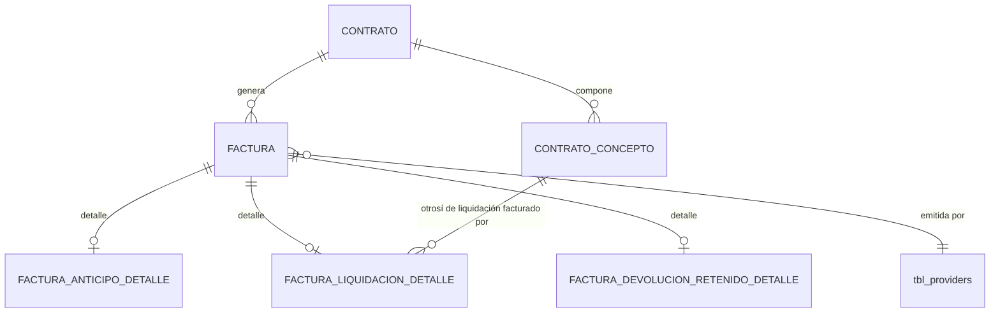
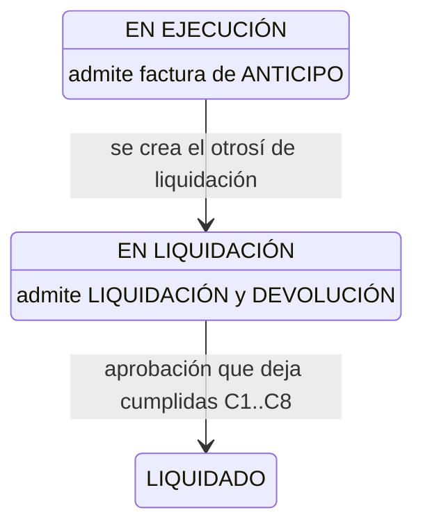

# ADR-0021: Facturación de contrato mayor — anticipo, liquidación y devolución de retenido

## Estado

**Propuesto.**

La facturación asociada a contrato **no existe** en el código ni en el esquema. Este ADR documenta la decisión arquitectónica recomendada dentro del modelo común de [ADR-0020](0020-facturacion.md).

**Decisión confirmada con el área usuaria (2026-09-10):** la factura de liquidación **se asocia al otrosí de liquidación**.

Las fórmulas de composición **no existen en el código**. Las de este ADR son **PROPUESTA PENDIENTE DE VALIDACIÓN**; su versión autoritativa está en [ADR-0026](0026-calculos-facturacion.md).

## Fecha

2026-09-10 — versión inicial, con la confirmación sobre la factura de liquidación.

## Contexto

Al seleccionar proveedor y contrato, el sistema muestra la información financiera del contrato:

```text
Anticipo · Retenido · Amortizado · Pendiente por amortizar
```

y admite tres tipos de factura:

| Tipo | Campos del alcance funcional |
| --- | --- |
| **Anticipo** | Número, fecha factura, fecha aprobación, comprobante, extracto, **valor anticipo**, descripción |
| **Liquidación** | Número, fecha factura, fecha aprobación, comprobante, extracto, **valor, % utilidad, % IVA, % retención fuente, retención IVA, retención ICA, valor amortización, valor retenido, descuento materiales**, descripción |
| **Devolución de retenido** | Número, fecha factura, fecha aprobación, comprobante, extracto, **valor devolución retenido**, descripción |

Son los tres tipos con contrato del modelo común. **"Contrato mayor" no es un tipo de factura**: es la naturaleza del proveedor del contrato ([ADR-0020](0020-facturacion.md), decisión 4). La facturación de subcontratista usa este mismo modelo ([ADR-0022](0022-facturacion-subcontratista.md)).

Con la confirmación del área usuaria queda adoptado como arquitectura objetivo el flujo que describe el alcance:

```text
OTROSÍ LIQUIDACIÓN
      ↓
contrato EN LIQUIDACIÓN
      ↓
facturas de liquidación      (amortizan anticipo y acumulan retenido)
      ↓
facturas de devolución de retenido
      ↓
condiciones C1..C8           (ADR-0017)
      ↓
LIQUIDADO
```

## Problema

1. **Cuándo es admisible cada tipo.** Un anticipo facturado en liquidación, o una devolución de retenido durante la ejecución, rompen el control de saldos.

2. **De dónde sale la información financiera del contrato.** Anticipo, retenido, amortizado y pendiente cambian con cada factura. Si se guardan, se desincronizan. Si se calculan mal, se aprueban facturas que exceden lo disponible.

3. **Límites de la factura de anticipo.** Cuántas puede haber, hasta qué valor y qué ocurre cuando el anticipo ya se facturó por completo.

4. **La factura de liquidación mezcla dos naturalezas.** Tiene composición tributaria (utilidad, IVA, retenciones) y a la vez **movimientos de saldo** (amortización y retenido), con porcentajes por defecto que el usuario puede ajustar.

5. **Consecuencia directa de la confirmación.** Si la factura de liquidación solo existe tras el otrosí de liquidación, **durante la ejecución no hay ninguna factura de contrato que facture el avance de obra**. La única factura de contrato en `EN EJECUCIÓN` es la de anticipo. El alcance no dice cómo se factura el avance mientras el contrato se ejecuta.

## Estado actual

**No se encontró evidencia de implementación.**

| Pregunta del alcance | Respuesta |
| --- | --- |
| ¿Los valores financieros del contrato se almacenan, se calculan, se agregan desde facturas o usan tablas auxiliares? | **No se encontró evidencia.** No existe ninguno. Ver decisión 6 |
| ¿Los tres tipos comparten encabezado, auditoría, permisos y ciclo de vida? | No existen. Ver decisión 1 |
| Factura de anticipo: validación contra el anticipo contractual, multiplicidad, máximo, saldo, anticipo consumido | **No se encontró evidencia.** Ver decisión 3 |
| Factura de liquidación: límite, validación, saldo disponible, relación entre porcentaje y valor | **No se encontró evidencia.** Ver decisión 4, [ADR-0024](0024-amortizacion-anticipo.md) y [ADR-0025](0025-retenciones.md) |
| ¿Existe el flujo de liquidación del alcance? | **No existe en el código.** Se adopta como arquitectura objetivo |

Hechos verificados del sistema que condicionan la decisión:

| Hecho | Evidencia |
| --- | --- |
| Ninguna tabla de contratos, conceptos, facturas ni saldos | `database/bdintervewebpack.sql` — 14 tablas, ninguna del CORE |
| Ninguna columna monetaria | Idem |
| **Ningún bloqueo de filas ni ajuste de nivel de aislamiento** en todo el backend | Búsqueda de `FOR UPDATE`, `LOCK IN SHARE MODE`, `SET TRANSACTION` e `ISOLATION` en `server/`: sin coincidencias |
| Ninguna librería de aritmética decimal | `server/package.json` y `client/package.json` |
| El formato de moneda del cliente solo presenta importes, con `parseFloat` y `Intl.NumberFormat` | `client/src/utils/formatNumber.js` |
| Almacenamiento de archivos de factura configurado en SharePoint, con rutas sin `verifyToken` | `tbl_business_rules`, `server/src/modules/microsoftGraph/microsoftGraph.routes.js` |

## Decisión

1. **Los tres tipos pertenecen al modelo común de [ADR-0020](0020-facturacion.md)**: encabezado compartido, una tabla de detalle por tipo, mismo ciclo de vida (`REGISTRADA` → `APROBADA` → `ANULADA`), mismos permisos base, misma auditoría y misma inmutabilidad.

2. **La admisibilidad de cada tipo depende del estado del contrato**, en coherencia con [ADR-0017](0017-estados-contrato.md):

   | Estado del contrato | Anticipo | Liquidación | Devolución de retenido |
   | --- | --- | --- | --- |
   | `EN EJECUCIÓN` | **Sí** | No — aún no existe el otrosí de liquidación | No |
   | `SUSPENDIDO` | No | No | No |
   | `EN LIQUIDACIÓN` | No | **Sí** | **Sí** |
   | `LIQUIDADO` | No | No | No |

   La restricción aplica a **registrar y a aprobar**. Anular una factura aún `REGISTRADA` se permite en cualquier estado salvo `LIQUIDADO`.

3. **Factura de anticipo**
   - Se asocia al contrato, no a un concepto: el anticipo se controla como un saldo único por contrato ([ADR-0024](0024-amortizacion-anticipo.md)).
   - Su valor no puede superar el **anticipo por facturar** (`A − AF`), verificado al registrar y de nuevo al aprobar.
   - **Se admiten varias facturas de anticipo** mientras quede anticipo por facturar. **Pendiente de validación.**
   - Cuando el anticipo pactado ya se facturó por completo, se rechaza cualquier factura de anticipo nueva con un mensaje que indique el anticipo pactado y el ya facturado.
   - El alcance no declara impuestos ni retenciones para este tipo: **total = valor anticipo**. Si el negocio los requiere, es una decisión pendiente.

4. **Factura de liquidación** (asociación **confirmada**)
   - **Se asocia obligatoriamente al concepto `OTROSI_LIQUIDACION` del contrato** mediante clave foránea en su tabla de detalle. El backend verifica que el concepto sea de ese tipo y pertenezca al contrato de la factura.
   - Por construcción, solo puede existir cuando el contrato está `EN LIQUIDACIÓN`.
   - **Se admiten una o varias facturas de liquidación** por otrosí de liquidación. **Pendiente de validación** si debe ser exactamente una.
   - **Amortización y retenido son movimientos de saldo**: se almacena el **valor**, con porcentaje por defecto tomado del contrato y ajustable con permiso propio ([ADR-0024](0024-amortizacion-anticipo.md), [ADR-0025](0025-retenciones.md)).
   - Límite de valor propuesto: la suma de los `VALOR` de las facturas de liquidación aprobadas no supera la base vigente del contrato antes de IVA. **Pendiente de validación.**

5. **Factura de devolución de retenido**
   - Se asocia al contrato.
   - Su valor no supera el saldo de retenido (`R − D`), verificado al registrar y al aprobar ([ADR-0025](0025-retenciones.md)).
   - **Se admiten varias devoluciones** mientras quede saldo.
   - El alcance no declara impuestos ni retenciones: **total = valor devolución**.

6. **La información financiera del contrato se calcula en el servidor en cada consulta y nunca se almacena.** Un único endpoint la entrega a los tres formularios:

   ```text
   Anticipo pactado          A   = Σ conceptos (base antes de IVA × % anticipo)
   Anticipo facturado        AF  = Σ facturas ANTICIPO aprobadas
   Anticipo por facturar         = máx(0, A − AF)
   Amortizado                AM  = Σ amortización de facturas LIQUIDACION aprobadas
   Pendiente por amortizar       = AF − AM
   Retenido acumulado        R   = Σ retenido de facturas LIQUIDACION aprobadas
   Retenido devuelto         D   = Σ facturas DEVOLUCION_RETENIDO aprobadas
   Saldo de retenido             = R − D
   ```

   Las facturas aprobadas **son** los movimientos. No existe tabla auxiliar de saldos.

7. **Cada aprobación de una factura de liquidación o de devolución evalúa las condiciones de liquidación del contrato** ([ADR-0017](0017-estados-contrato.md)), dentro de la misma transacción.

8. **El proveedor de la factura debe ser el del contrato.** La clave foránea no lo garantiza; lo verifica el backend.

9. **Cómo se factura el avance de obra durante la ejecución queda como decisión pendiente y bloqueante para la operación de contratos de larga duración.** Ver `Alternativas consideradas`.

## Justificación

- **Asociar la factura de liquidación al otrosí de liquidación**: la decisión la confirmó el área usuaria, y además ancla la factura a un acto contractual concreto y fechado. Cualquier consulta de "qué se facturó contra la liquidación" es directa, y la factura no puede existir sin el acto que la habilita.

- **Anticipo como saldo por contrato y no por concepto**: la amortización ocurre en facturas asociadas al otrosí de liquidación, no a cada concepto. Llevar un saldo de anticipo por concepto obligaría a prorratear cada amortización entre conceptos con un criterio que el alcance no define. Un saldo único por contrato es exacto y no exige ese prorrateo.

- **Valor como movimiento y porcentaje como ayuda**: el saldo se calcula sumando valores. Si se guardara el porcentaje y se derivara el valor, el redondeo impediría cerrar el saldo exactamente en cero en la última factura, y la condición `C2` de liquidación no se cumpliría nunca. En el concepto contractual se guarda el porcentaje pactado ([ADR-0016](0016-conceptos-contractuales.md)); en la factura se guarda el valor movido. Son dos niveles distintos: lo pactado y lo ejecutado.

- **Información financiera calculada**: es la aplicación directa de la regla de no duplicar saldos (sección 28 del alcance). Cada cifra del panel es una suma sobre pocas facturas de un solo contrato; calcularla cuesta poco con un índice sobre contrato, tipo y estado. Guardarla crearía una segunda verdad que se desincroniza con cualquier anulación o fallo intermedio.

- **Validar al registrar y al aprobar**: entre el registro y la aprobación pueden aprobarse otras facturas del mismo contrato que consumen saldo. La validación del registro sirve de aviso temprano; la de la aprobación es la que decide.

- **Varias facturas de anticipo y de devolución**: el alcance pide analizar si puede haber más de una y no lo prohíbe. Desembolsar el anticipo por tramos y devolver el retenido por partes son prácticas habituales. Los límites de saldo impiden el exceso sin necesidad de restringir la cantidad.

## Alternativas consideradas

### Asociación de la factura de liquidación

| | Alternativa | Evaluación |
| --- | --- | --- |
| **A** | Al contrato | Simple, pero no distingue qué se facturó contra la liquidación ni impide facturar sin otrosí de liquidación |
| **B** | **Al otrosí de liquidación** *(confirmada por el área usuaria)* | Ancla la factura al acto que la habilita; la admisibilidad en `EN LIQUIDACIÓN` se cumple por construcción |
| **C** | A cada concepto facturado, prorrateada | Máxima precisión por concepto, pero exige un criterio de prorrateo inexistente en el alcance y complica todos los saldos |

### Origen de la información financiera

| | Alternativa | Evaluación |
| --- | --- | --- |
| **A** | Columnas de saldo en el contrato, actualizadas por cada factura | Lectura inmediata; se desincroniza ante anulaciones, fallos intermedios o escrituras fuera de transacción |
| **B** | Tabla auxiliar de saldos o libro de movimientos | Trazabilidad explícita, pero duplica los hechos ya registrados en las facturas: dos fuentes para el mismo dato |
| **C** | **Cálculo desde facturas aprobadas y conceptos** *(seleccionada)* | Una sola verdad; las anulaciones se reflejan solas; coste bajo por el volumen de facturas por contrato |

### Avance de obra durante la ejecución — decisión pendiente

| | Alternativa | Consecuencia |
| --- | --- | --- |
| **a** | No se factura avance: todo el valor ejecutado se factura en la liquidación | Coherente con la confirmación. Durante la ejecución, el costo ejecutado de un contrato solo refleja anticipos; en contratos largos, el proveedor financia la obra hasta la liquidación |
| **b** | El avance se factura con facturas simples ([ADR-0023](0023-facturacion-simple.md)) | Operativo hoy, pero **sin control contra el contrato**: no amortiza, no retiene y no respeta el valor pactado |
| **c** | Un tipo de factura de avance con la estructura económica de la de liquidación, admisible en `EN EJECUCIÓN` | Control completo de saldos durante la ejecución; añade un quinto tipo que el alcance no nombra |

**No se selecciona ninguna.** Es una decisión de negocio. Si se adopta **c**, el modelo de [ADR-0020](0020-facturacion.md) la admite como una tabla de detalle más, sin cambiar el encabezado ni los saldos de [ADR-0024](0024-amortizacion-anticipo.md) y [ADR-0025](0025-retenciones.md).

### Multiplicidad de la factura de anticipo

| | Alternativa | Evaluación |
| --- | --- | --- |
| **A** | Una sola por contrato | Simple; impide desembolsos por tramos y obliga a anular y registrar de nuevo ante cualquier ajuste |
| **B** | **Varias, hasta el anticipo pactado** *(seleccionada, pendiente)* | Admite tramos; el límite de saldo impide el exceso |

### Límite de valor de las facturas de liquidación

| | Alternativa | Evaluación |
| --- | --- | --- |
| **A** | Hasta el valor del otrosí de liquidación | Útil solo si el otrosí fija el valor total a liquidar; si es un ajuste, el límite sería absurdo |
| **B** | **Suma hasta la base vigente del contrato antes de IVA** *(propuesta, pendiente)* | No depende de la semántica del otrosí; impide facturar por encima de lo pactado |
| **C** | Sin límite en el sistema; control por interventoría | Deja sin control de sistema la facturación por encima del contrato |

## Modelo arquitectónico

Modelo propuesto. **Ninguna de estas tablas existe hoy.**



```text
FACTURA_ANTICIPO_DETALLE
  ├── factura            FK  UNIQUE (1:1)
  └── valor anticipo     decimal exacto  > 0

FACTURA_LIQUIDACION_DETALLE
  ├── factura                    FK  UNIQUE (1:1)
  ├── concepto de liquidación    FK  NOT NULL → CONTRATO_CONCEPTO (tipo OTROSI_LIQUIDACION)
  ├── valor                      decimal exacto   ingresado, base antes de IVA
  ├── % utilidad                 ingresado, congelado — por defecto del contrato (ADR-0026)
  ├── % IVA                      ingresado, congelado
  ├── % retención fuente         ingresado, congelado
  ├── % retención IVA            ingresado, congelado
  ├── tarifa retención ICA       ingresado, congelado
  ├── valor amortización         MOVIMIENTO — ingresado, por defecto calculado
  ├── % amortización por defecto el vigente al registrar — solo auditoría
  ├── valor retenido             MOVIMIENTO — ingresado, por defecto calculado
  ├── % retenido por defecto     el vigente al registrar — solo auditoría
  └── descuento materiales       decimal exacto   ingresado

FACTURA_DEVOLUCION_RETENIDO_DETALLE
  ├── factura                    FK  UNIQUE (1:1)
  └── valor devolución           decimal exacto  > 0

  ✗ Ninguna tabla almacena totales, netos ni saldos
```

### Composición propuesta — PROPUESTA PENDIENTE DE VALIDACIÓN

> No es un hallazgo. **No existe ninguna fórmula en el código.** Versión autoritativa en [ADR-0026](0026-calculos-facturacion.md).

```text
FACTURA DE ANTICIPO
  TOTAL = VALOR ANTICIPO

FACTURA DE LIQUIDACIÓN   (supone que VALOR ya incluye el AIU y está antes de IVA)
 [1] VALOR                           ingresado
 [2] UTILIDAD         = [1] × % utilidad
 [3] IVA              = [2] × % IVA            ← IVA sobre la utilidad (régimen AIU)
 [4] TOTAL FACTURADO  = [1] + [3]
 ─────────────────────────────────────────────
 [5] RTE FUENTE       = [1] × % retención fuente
 [6] RTE IVA          = [3] × % retención IVA
 [7] RTE ICA          = [1] × tarifa ICA
 [8] AMORTIZACIÓN     ingresado · por defecto mín([1] × % anticipo efectivo, pendiente por amortizar)
 [9] RETENIDO         ingresado · por defecto [1] × % retenido efectivo
[10] DCTO MATERIALES  ingresado
[11] NETO A PAGAR     = [4] − [5] − [6] − [7] − [8] − [9] − [10]

FACTURA DE DEVOLUCIÓN DE RETENIDO
  TOTAL = VALOR DEVOLUCIÓN
```

Puntos abiertos, todos pendientes de validación: si `VALOR` incluye el AIU o es costo directo; si el IVA se liquida sobre la utilidad o sobre el valor completo; la base de cada retención; si el descuento de materiales reduce la base gravable o solo el neto.

### Admisibilidad y efecto sobre el contrato



| Hecho de facturación | Efecto |
| --- | --- |
| Factura `REGISTRADA` de cualquier tipo | Ninguno sobre saldos; **impide liquidar** por la condición `C5` |
| Aprobación de anticipo | Aumenta `AF` y, con ello, el pendiente por amortizar |
| Aprobación de liquidación | Aumenta `AM` y `R`; evalúa `C1..C8` |
| Aprobación de devolución | Aumenta `D`; evalúa `C1..C8` |
| Anulación de una factura aprobada | La excluye de los saldos; exige que los invariantes sigan cumpliéndose ([ADR-0024](0024-amortizacion-anticipo.md), [ADR-0025](0025-retenciones.md)) |

## Reglas de negocio

**No se encontró evidencia en la implementación actual.** Reglas propuestas:

1. Las facturas de anticipo, liquidación y devolución de retenido exigen contrato.
2. El proveedor de la factura es el del contrato.
3. La factura de anticipo solo es admisible con el contrato `EN EJECUCIÓN`.
4. Las facturas de liquidación y de devolución solo son admisibles con el contrato `EN LIQUIDACIÓN`.
5. **La factura de liquidación se asocia al otrosí de liquidación del contrato** *(confirmado)*.
6. La suma de facturas de anticipo aprobadas no supera el anticipo pactado.
7. La amortización acumulada no supera el anticipo facturado.
8. Las devoluciones acumuladas no superan el retenido acumulado.
9. La amortización y el retenido de una factura de liquidación proponen por defecto los porcentajes efectivos del contrato; apartarse de ellos requiere permiso propio.
10. Solo las facturas aprobadas afectan saldos y condiciones de liquidación.
11. Las validaciones de saldo se hacen al registrar y de nuevo al aprobar.
12. Una factura registrada y sin aprobar impide que el contrato se liquide.
13. Cada aprobación de liquidación o devolución evalúa las condiciones de liquidación del contrato.
14. Con el contrato `LIQUIDADO` no se registra, aprueba ni anula ninguna factura del contrato.

**Pendiente de validación:** cómo se factura el avance de obra durante la ejecución; si hay una o varias facturas de liquidación; el límite de valor de las facturas de liquidación; si la factura de anticipo lleva impuestos o retenciones; la composición económica completa de la factura de liquidación.

## Seguridad

- **Toda operación exige permiso verificado en el backend.** Hoy **ninguna ruta del sistema verifica permisos** ([ADR-0014](0014-autorizacion-permisos.md)).
- **Ningún saldo se acepta desde el cliente.** El panel financiero es de solo lectura y las validaciones se ejecutan sobre saldos recalculados en el servidor. Aceptar un "pendiente por amortizar" enviado por el cliente permitiría aprobar amortizaciones inexistentes.
- **Ni el concepto de liquidación ni el contrato se aceptan sin verificar su coherencia.** Una petición manipulada podría asociar la factura al otrosí de liquidación de otro contrato.
- **El estado del contrato se consulta en el servidor en cada registro y en cada aprobación.** Ocultar el botón no impide invocar el endpoint.
- **Ajustar la amortización o el retenido fuera del valor por defecto exige permiso propio** y queda auditado con ambos valores.
- Totales y netos se calculan en el servidor; los enviados por el cliente se ignoran.
- Consultas parametrizadas. El patrón vigente de `paginationUsers` interpola los filtros del cliente en la cadena SQL.

## Autorización

Permisos base del modelo común ([ADR-0020](0020-facturacion.md)):

```text
CONSULTAR FACTURAS · CREAR FACTURA · EDITAR FACTURA
APROBAR FACTURA · ANULAR FACTURA · ANULAR FACTURA APROBADA
```

Permisos adicionales propuestos para este ADR:

```text
CONSULTAR INFORMACIÓN FINANCIERA DEL CONTRATO
AJUSTAR AMORTIZACIÓN         → ADR-0024
AJUSTAR RETENIDO             → ADR-0025
```

**Pendiente de validación:** si se diferencian permisos por tipo, por ejemplo aprobar anticipos frente a aprobar liquidaciones.

**Ninguno de estos permisos existe hoy.** El catálogo real son ocho permisos sobre perfiles y usuarios.

## Auditoría

**Nivel requerido: auditoría funcional completa.**

| Información | Nivel |
| --- | --- |
| Registro, aprobación y anulación de cada factura | **Funcional** |
| Valor anticipo, valor devolución | **Funcional** |
| Valor, porcentajes y tasas de la factura de liquidación | **Funcional** mientras está `REGISTRADA` |
| **Amortización aplicada frente a la amortización por defecto** | **Funcional** — ambos valores y el usuario que ajustó |
| **Retenido aplicado frente al retenido por defecto** | **Funcional** — ambos valores y el usuario que ajustó |
| Saldos vigentes en el instante de la aprobación | **Funcional** — instantánea, no fuente de cálculo |
| Resultado de la evaluación de `C1..C8` tras la aprobación | **Funcional** — incluida la condición que falló |

El autor se toma de `req.user`. Todo el backend actual lo recibe en `req.body` ([ADR-0013](0013-auditoria-trazabilidad.md)).

## Validaciones

| Validación | Frontend | Backend | Base de datos | Clasificación |
| --- | --- | --- | --- | --- |
| Contrato obligatorio | Propuesta (selector) | Propuesta | `CHECK` tipo/contrato ([ADR-0020](0020-facturacion.md)) | Integridad |
| Proveedor igual al del contrato | Propuesta (filtra) | **Propuesta — obligatoria** | No expresable | **Integridad + Seguridad** |
| Tipo admisible según el estado del contrato | Propuesta (oculta) | **Propuesta — obligatoria** | No expresable | **Regla de negocio + Seguridad** |
| Concepto de liquidación del mismo contrato y de tipo `OTROSI_LIQUIDACION` | No aplica (lo resuelve el servidor) | **Propuesta — obligatoria** | FK; coherencia no expresable salvo con FK compuesta | **Integridad** |
| Valor anticipo ≤ anticipo por facturar | Propuesta (aviso) | **Propuesta — obligatoria, al registrar y al aprobar** | No expresable | **Regla de negocio** |
| Amortización ≤ pendiente por amortizar | Propuesta (aviso) | **Propuesta — obligatoria, al registrar y al aprobar** | No expresable | **Regla de negocio** |
| Devolución ≤ saldo de retenido | Propuesta (aviso) | **Propuesta — obligatoria, al registrar y al aprobar** | No expresable | **Regla de negocio** |
| Ajuste de amortización o retenido con permiso | Propuesta (bloquea el campo) | **Propuesta — obligatoria** | No aplica | **Seguridad** |
| Importes no negativos y tasas en rango | Propuesta | **Propuesta — obligatoria** | `CHECK` | Regla de negocio |
| Saldos no aceptados desde el cliente | No aplica | **Propuesta — obligatoria** | No expresable | **Seguridad** |
| Campos obligatorios de encabezado | Propuesta | Propuesta | `NOT NULL` | Validación de interfaz |

## Integridad de datos

- Una tabla de detalle por tipo, con `UNIQUE` sobre la factura: relación 1:1.
- FK del detalle de liquidación al concepto, `ON DELETE RESTRICT`.
- **Coherencia contrato-concepto**: se propone exponer `UNIQUE (contrato, id)` en la tabla de conceptos y guardar el contrato en el detalle, para declarar una **clave foránea compuesta** `(contrato, concepto)` que la base de datos haga cumplir. Sin ella, la coherencia depende del backend.
- `CHECK` sobre importes positivos, tasas entre 0 y 100 y descuento de materiales no negativo.
- **Decimal exacto para todos los importes.** El esquema actual no tiene ninguna columna monetaria.
- Índice sobre `(contrato, tipo, estado)` en el encabezado: es el que resuelve todas las sumas del panel financiero.
- Los invariantes de saldo (`AF ≤ A`, `AM ≤ AF`, `D ≤ R`) **no son expresables** con `CHECK`, porque relacionan sumas de varias filas. Se garantizan con el bloqueo y la revalidación de [ADR-0027](0027-integridad-transaccional.md).
- Sin migraciones versionadas en el proyecto.

## Transacciones

Todas se rigen por [ADR-0027](0027-integridad-transaccional.md).

**Registrar factura de liquidación**

```text
BEGIN
  SELECT contrato ... FOR UPDATE            ← primera sentencia de la transacción
  verificar estado = EN LIQUIDACIÓN y proveedor del contrato
  resolver el otrosí de liquidación del contrato
  recalcular pendiente por amortizar y saldo de retenido
  validar amortización y retenido contra saldos
  INSERT factura (REGISTRADA) + detalle
  INSERT historial de estado + auditoría
COMMIT
```

**Aprobar factura de contrato**

```text
BEGIN
  SELECT contrato ... FOR UPDATE
  SELECT factura  ... FOR UPDATE            ← siempre en este orden: contrato, luego factura
  verificar estado de la factura = REGISTRADA y estado del contrato admisible
  recalcular saldos y REVALIDAR              ← pudieron cambiar desde el registro
  UPDATE factura: APROBADA + fecha de aprobación
  INSERT historial + auditoría con instantánea de saldos
  evaluar C1..C8 → transición a LIQUIDADO si se cumplen   (ADR-0017)
COMMIT
```

Ninguna operación externa ocurre dentro de la transacción. La subida del archivo a SharePoint y cualquier notificación van **después** del `COMMIT`.

**Precaución verificada:** `executeQuery` en `server/src/common/configs/db.config.js` toma una conexión nueva del pool si no recibe la conexión como tercer parámetro, y esa escritura **sobrevive al `rollback`**.

## Concurrencia

**Escenario — dos facturas de anticipo simultáneas.**

```text
Anticipo por facturar = 10.000.000
Usuario A aprueba anticipo de 7.000.000
Usuario B aprueba anticipo de 5.000.000
```

Sin protección, ambas transacciones leen 10.000.000, ambas validan y ambas aprueban: se factura 12.000.000 de anticipo sobre 10.000.000 pactados. **Hoy no existe ninguna protección**: el backend no usa `FOR UPDATE` en ninguna consulta.

Con la decisión:

```text
A: SELECT contrato FOR UPDATE    → obtiene el bloqueo
B: SELECT contrato FOR UPDATE    → espera
A: recalcula 10.000.000, valida 7.000.000, aprueba, COMMIT
B: obtiene el bloqueo, recalcula 3.000.000, 5.000.000 > 3.000.000 → rechazo 409
```

Mismo patrón para amortización ([ADR-0024](0024-amortizacion-anticipo.md)) y devolución de retenido ([ADR-0025](0025-retenciones.md)).

**Precisión necesaria.** El pool no fija nivel de aislamiento, por lo que rige el `REPEATABLE READ` por defecto de InnoDB. En ese nivel, la instantánea de lectura se fija con la primera lectura no bloqueante de la transacción. **Si se lee cualquier dato antes de bloquear el contrato**, las sumas posteriores usan una instantánea anterior a la aprobación concurrente y el bloqueo no protege nada. Por eso el bloqueo del contrato es **la primera sentencia**.

**Doble aprobación y doble registro:** estado leído bajo bloqueo y clave de idempotencia ([ADR-0020](0020-facturacion.md)).

## Fuente de verdad

| Dato | Clase | Fuente de verdad | Momento |
| --- | --- | --- | --- |
| Anticipo pactado `A` | **Calculado** | Conceptos del contrato ([ADR-0016](0016-conceptos-contractuales.md)) | En cada consulta |
| Anticipo facturado `AF` | **Calculado** | Σ facturas de anticipo aprobadas | En cada consulta |
| Amortizado `AM` | **Calculado** | Σ amortización de facturas de liquidación aprobadas | En cada consulta |
| Pendiente por amortizar | **Calculado** | `AF − AM` | En cada consulta |
| Retenido acumulado `R` | **Calculado** | Σ retenido de facturas de liquidación aprobadas | En cada consulta |
| Retenido devuelto `D` | **Calculado** | Σ devoluciones aprobadas | En cada consulta |
| Saldo de retenido | **Calculado** | `R − D` | En cada consulta |
| Valor anticipo, valor devolución | **Almacenado** — movimiento | Captura del usuario | Al registrar |
| Valor amortización, valor retenido | **Almacenado** — movimiento | Captura, con valor por defecto calculado | Al registrar |
| Porcentajes efectivos por defecto | **Calculado** | `A / base`, `retenido pactado / base` ([ADR-0024](0024-amortizacion-anticipo.md), [ADR-0025](0025-retenciones.md)) | Al abrir el formulario |
| Tasas tributarias | **Almacenado, congelado** | Captura | Al registrar |
| Totales y neto a pagar | **Calculado** | Composición de [ADR-0026](0026-calculos-facturacion.md) | En cada consulta |

## Inmutabilidad

| Momento | Qué queda inmutable |
| --- | --- |
| **Al aprobar** | Todos los importes, tasas, movimientos de amortización y retenido, concepto de liquidación, contrato, proveedor, número y fecha de factura |
| **Al aprobar** | La instantánea de saldos y el resultado de la evaluación de liquidación |
| **Al pasar el contrato a `LIQUIDADO`** | Todas las facturas del contrato, incluida su anulación |
| **Siempre** | El tipo de factura y su asociación al otrosí de liquidación |

Toda corrección de una factura aprobada se hace **anulando y registrando de nuevo**, y solo si la anulación no rompe los invariantes de saldo. Si el contrato ya está `LIQUIDADO`, la única vía es la reapertura ([ADR-0017](0017-estados-contrato.md)).

## Consecuencias

### Positivas

- Un único modelo para los tres tipos, con saldos coherentes por construcción.
- La factura de liquidación queda anclada al acto que la habilita.
- El panel financiero nunca muestra cifras desincronizadas, porque no se almacena.
- Los saldos no se pueden sobregirar por concurrencia.
- Guardar el valor del movimiento permite cerrar los saldos exactamente en cero.
- Cada aprobación evalúa la liquidación sin depender de procesos programados.

### Negativas

- **Durante la ejecución no se factura avance de obra** mientras no se resuelva la decisión pendiente.
- El bloqueo sobre el contrato serializa todas las facturas de ese contrato.
- La revalidación en la aprobación puede rechazar facturas que fueron válidas al registrarse, y hay que explicarlo al usuario.
- El panel financiero exige varias agregaciones por consulta.
- La composición de la factura de liquidación no se puede implementar hasta que el área contable la valide.

## Riesgos

| Riesgo | Severidad | Descripción |
| --- | --- | --- |
| **Avance de obra sin mecanismo de facturación** | **Crítico** | Operación bloqueada en contratos largos, o avance facturado con facturas simples sin control contra el contrato |
| Anticipo facturado por encima de lo pactado | **Crítico** | Sin bloqueo, dos aprobaciones concurrentes superan el anticipo |
| Amortización o devolución por encima del saldo | **Crítico** | Mismo mecanismo; ver ADR-0024 y ADR-0025 |
| Lectura antes del bloqueo | **Alto** | Con `REPEATABLE READ`, las sumas usan una instantánea vieja y el bloqueo no protege |
| Saldos aceptados desde el cliente | **Crítico** | Permitiría aprobar amortizaciones inexistentes |
| Validación solo al registrar | **Crítico** | Aprueba facturas que exceden el saldo por consumos intermedios |
| Factura asociada al otrosí de liquidación de otro contrato | **Alto** | La FK simple no verifica la coherencia |
| Anulación que rompe invariantes | **Alto** | Anular un anticipo ya amortizado deja pendiente por amortizar negativo |
| Deadlocks sin tratamiento | **Medio** | `error.middleware.js` no maneja `ER_LOCK_DEADLOCK` ni `ER_LOCK_WAIT_TIMEOUT`: responde un 500 genérico |
| Aritmética en punto flotante | **Alto** | No hay librería decimal; `Number` de JavaScript acumula errores de redondeo |
| Sin autorización en backend | **Crítico** | Estado actual del sistema |

## Impacto técnico

### Frontend

- Formularios de los tres tipos con selección de proveedor y contrato, y el **panel de información financiera** de solo lectura servido por el backend.
- En la factura de liquidación, amortización y retenido **precargados con el valor por defecto** y editables solo con permiso; si se modifican, se muestran ambos valores.
- Tipos admisibles filtrados según el estado del contrato recibido del servidor.
- `GenericFormSection.jsx` soporta `currency`, `float`, `number`, `date` y `textarea`.
- `client/src/utils/formatNumber.js` sirve para **presentar** importes. **No debe usarse para calcular**: convierte con `parseFloat` y trabaja con `Number`.
- La clave de idempotencia se genera al abrir el formulario.

### Backend

- Endpoints de registro por tipo, un endpoint de información financiera y los comunes de aprobación y anulación.
- Servicio único de saldos, compartido con [ADR-0024](0024-amortizacion-anticipo.md), [ADR-0025](0025-retenciones.md) y el evaluador de [ADR-0017](0017-estados-contrato.md).
- Bloqueo del contrato como primera sentencia de cada transacción de facturación con contrato.
- Tratamiento de `ER_LOCK_DEADLOCK` y `ER_LOCK_WAIT_TIMEOUT`, hoy ausente en `error.middleware.js`.
- Aritmética decimal exacta: no hay librería en el proyecto ([ADR-0026](0026-calculos-facturacion.md)).

### Base de datos

- Tres tablas de detalle más el encabezado común. Ninguna existe.
- Índice `(contrato, tipo, estado)` y, si se adopta, clave foránea compuesta contrato-concepto.
- Depende de contratos y conceptos, que tampoco existen.
- Sin migraciones versionadas.

### Infraestructura

- Los archivos de factura pueden guardarse en SharePoint con la configuración de `tbl_business_rules`, después del `COMMIT`. Antes hay que proteger con `verifyToken` las rutas de `microsoftGraph.routes.js` y dejar de guardar `rul_client_secret` en texto plano.
- **No se encontró evidencia** de colas ni de reintentos para operaciones externas.

## Arquitectura objetivo

| Área | Actual | Objetivo | Brecha |
| --- | --- | --- | --- |
| Facturas de contrato | No existen | Tres tipos del modelo común | **Alta** |
| Asociación de la liquidación | No existe | Al otrosí de liquidación *(confirmado)* | **Alta** |
| Admisibilidad por estado | No existe | Verificada en backend al registrar y al aprobar | **Alta** |
| Información financiera | No existe | Calculada desde facturas aprobadas, nunca almacenada | **Alta** |
| Anticipo | No existe | Saldo por contrato con límite de facturación | **Alta** |
| Amortización y retenido | No existen | Movimientos con valor por defecto y ajuste con permiso | **Alta** |
| Avance en ejecución | No existe | **Decisión pendiente** | **Crítica** |
| Concurrencia | Ningún bloqueo en el backend | Bloqueo del contrato como primera sentencia | **Alta** |
| Deadlocks | Sin tratamiento | Mapeo y reintento controlado | **Media** |
| Aritmética | Sin librería decimal | Aritmética exacta | **Alta** |
| Permisos | No existen | Base más ajustes de amortización y retenido | **Crítica** |

## Brechas identificadas

| # | Brecha | Severidad |
| --- | --- | --- |
| B1 | **Facturación del avance de obra durante la ejecución sin definir** | **Crítica** — decisión de negocio bloqueante |
| B2 | Las facturas de contrato no existen en ninguna capa | **Alta** |
| B3 | No existen contratos, conceptos ni el modelo común de facturación | **Alta** — bloqueante |
| B4 | Composición de la factura de liquidación sin validar | **Alta** — decisión de negocio pendiente |
| B5 | Cantidad de facturas de liquidación por otrosí sin definir | **Media** — decisión de negocio pendiente |
| B6 | Límite de valor de las facturas de liquidación sin definir | **Media** — decisión de negocio pendiente |
| B7 | Impuestos o retenciones en factura de anticipo y devolución sin definir | **Media** — decisión de negocio pendiente |
| B8 | Ningún bloqueo de filas en todo el backend | **Alta** |
| B9 | Sin tratamiento de deadlocks ni esperas de bloqueo | **Media** |
| B10 | Sin librería de aritmética decimal | **Alta** |
| B11 | Ninguna ruta del backend verifica permisos | **Crítica** |
| B12 | El autor de la auditoría proviene del cliente | **Alta** |
| B13 | `executeQuery` sin conexión escapa de la transacción | **Alta** — preventiva |
| B14 | Rutas de `microsoftGraph` sin `verifyToken`; `rul_client_secret` en texto plano | **Alta** |
| B15 | Sin migraciones versionadas | **Media** |

## Plan de implementación

Recomendación derivada del análisis. **No fue ejecutada.**

**Fase 0 — Decisiones de negocio (B1, B4, B5, B6, B7)**
**Bloqueante.** Definir cómo se factura el avance durante la ejecución, validar la composición de la factura de liquidación, la cantidad de facturas de liquidación, su límite de valor y el tratamiento tributario del anticipo y la devolución.

**Fase 1 — Prerrequisitos (B3, B11, B15)**
Contratos, conceptos y modelo común de facturación. Autorización en backend. Migraciones versionadas.

**Fase 2 — Modelo (B2, B10)**
Tablas de detalle, índices y convención de aritmética decimal exacta.

**Fase 3 — Servicio de saldos**
Cálculo único de la información financiera, compartido con ADR-0024, ADR-0025 y el evaluador de liquidación.

**Fase 4 — Transacciones y concurrencia (B8, B9, B13)**
Bloqueo del contrato como primera sentencia, revalidación en la aprobación, orden fijo contrato → factura, tratamiento de deadlocks y revisión de que toda escritura use la conexión de la transacción.

**Fase 5 — Interfaz, permisos y auditoría (B12, B14)**
Formularios con panel financiero, permisos de ajuste, auditoría con autor desde el token y rutas de `microsoftGraph` autenticadas.

## ADR relacionados

- [ADR-0020 — Facturación](0020-facturacion.md) — modelo común
- [ADR-0022 — Facturación de subcontratista](0022-facturacion-subcontratista.md) — mismo modelo
- [ADR-0024 — Anticipo y amortización](0024-amortizacion-anticipo.md) · [ADR-0025 — Retenido y devolución](0025-retenciones.md)
- [ADR-0026 — Cálculos de facturación](0026-calculos-facturacion.md) — composición autoritativa
- [ADR-0016 — Conceptos contractuales](0016-conceptos-contractuales.md) — otrosí de liquidación
- [ADR-0017 — Estados de contrato](0017-estados-contrato.md) — admisibilidad y condiciones `C1..C8`
- [ADR-0027 — Integridad transaccional del CORE](0027-integridad-transaccional.md)
- [ADR-0013 — Auditoría](0013-auditoria-trazabilidad.md) · [ADR-0014 — Autorización](0014-autorizacion-permisos.md)

## Referencias

- `docs/prompt_adr_core.md` — secciones 19 a 24 del alcance funcional
- `database/bdintervewebpack.sql` — sin tablas del CORE ni columnas monetarias; `tbl_business_rules`
- `server/src/common/configs/db.config.js` — pool sin nivel de aislamiento, sin `decimalNumbers`; `executeQuery`
- `server/src/common/middlewares/error.middleware.js` — sin tratamiento de `ER_LOCK_DEADLOCK` ni `ER_LOCK_WAIT_TIMEOUT`
- `server/package.json`, `client/package.json` — sin librería de aritmética decimal
- `client/src/utils/formatNumber.js` — formato de presentación con `parseFloat`
- `server/src/modules/microsoftGraph/microsoftGraph.routes.js` — rutas sin `verifyToken`
- `client/src/ui-component/extended/GenericFormSection.jsx`
