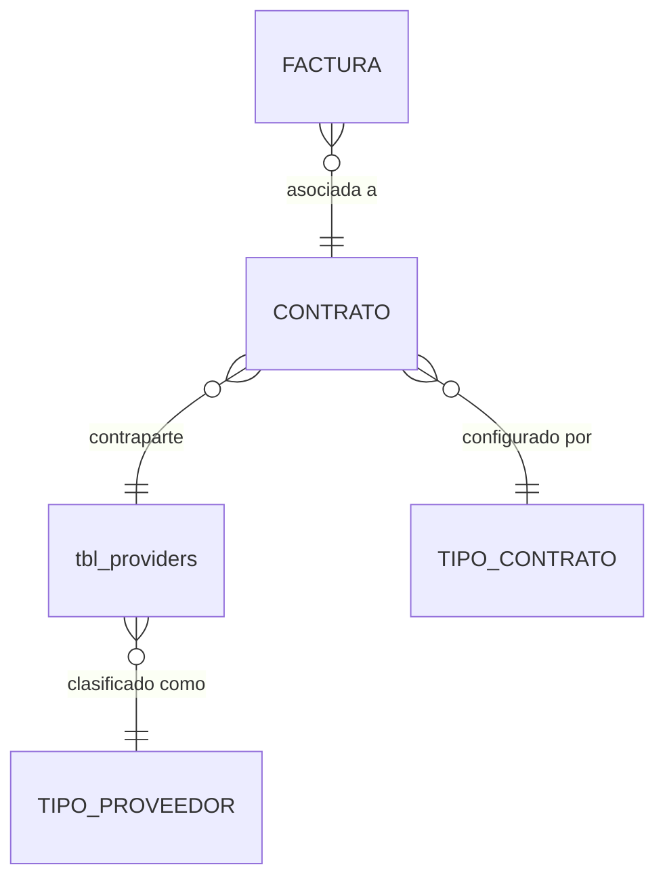

# ADR-0022: Facturación de subcontratista

## Estado

**Propuesto.**

La facturación de subcontratista **no existe** en el código ni en el esquema.

**Declaración explícita:** no se encontró **ninguna regla** —en el código, en el esquema ni en el alcance funcional— que diferencie la facturación de un subcontratista de la de un contratista mayor. Este ADR documenta esa ausencia, la decisión que se deriva de ella y las hipótesis que deben validarse antes de implementar cualquier diferencia.

## Fecha

2026-09-10 — versión inicial.

## Contexto

El alcance funcional describe tres comportamientos de facturación:

```text
FACTURACIÓN
├── SIMPLE
├── CONTRATO MAYOR
└── SUBCONTRATISTA
```

Y también los tipos de proveedor ([ADR-0010](0010-tipos-proveedor.md)):

```text
Simple · Subcontratista · Contrato mayor
```

La coincidencia de nombres indica que el comportamiento de facturación sigue al tipo de proveedor. El propio alcance **agrupa ambos comportamientos**: su sección 19 se titula *"Facturación de contrato mayor / subcontratista"* y describe para los dos la misma selección de proveedor y contrato y el mismo panel de anticipo, retenido, amortizado y pendiente. La sección 36 pregunta expresamente: *"¿Contrato mayor y subcontratista comparten modelo?"*.

## Problema

Hay dos errores posibles, en direcciones opuestas:

1. **Duplicar un modelo sin diferencia real.** Una tabla, un formulario y unas validaciones propias para el subcontratista que repiten los del contratista mayor. Cada cambio se aplica dos veces y tarde o temprano divergen.
2. **Omitir una diferencia real.** Si el subcontratista tiene reglas propias —dependencia de un contratista mayor, ausencia de anticipo, otro régimen de AIU—, un modelo único que no las contemple produce saldos o cálculos incorrectos.

El segundo error solo puede evitarse con información del negocio. El primero se evita no construyendo diferencias sin evidencia.

## Estado actual

**No se encontró evidencia de implementación.**

| Búsqueda | Resultado |
| --- | --- |
| Tablas de facturación, contratos o proveedores con tipo | **Ninguna.** `tbl_providers` no tiene columna de tipo de proveedor |
| Código que distinga subcontratista de contratista mayor | **Ninguno.** `tbl_providers` no se referencia en ninguna línea del código |
| Término "subcontratista" en el código | **Ninguna coincidencia** en `server/src` ni `client/src` |
| Regla del alcance que diferencie la facturación | **Ninguna** en las secciones 16 a 24 |

La única diferencia que el alcance enuncia **no está en la facturación**:

> Sección 10: *"Si el tipo de contrato es 'mayor', debe solicitar AIU."*

Es una regla de **configuración del contrato**, que vive en el tipo de contrato ([ADR-0006](0006-tipos-contrato.md)) y no en la factura. Y revela una ambigüedad de nombres: "mayor" aparece como **tipo de contrato** en la sección 10 y como **tipo de proveedor** en [ADR-0010](0010-tipos-proveedor.md). No hay evidencia de si son el mismo concepto.

## Decisión

1. **La facturación de subcontratista usa exactamente el modelo de [ADR-0021](0021-facturacion-contrato-mayor.md)**: los mismos tres tipos de factura (anticipo, liquidación, devolución de retenido), las mismas tablas de detalle, las mismas reglas de admisibilidad, los mismos saldos y las mismas validaciones.

2. **La distinción entre contratista mayor y subcontratista es un atributo del proveedor del contrato**, no de la factura. Se deriva de `factura → contrato → proveedor → tipo de proveedor`. **No se copia en la factura.**

3. **No se implementa ninguna regla diferenciada sin validación previa.**

4. **Si alguna hipótesis de diferencia se confirma, se incorpora por configuración o como regla sobre el modelo común**, nunca como un modelo de factura paralelo:

   | Si se confirma… | Se incorpora en… |
   | --- | --- |
   | Diferencias en campos obligatorios o visibles | Configuración del tipo de contrato — [ADR-0006](0006-tipos-contrato.md) |
   | Diferencias en anticipo o amortización | [ADR-0024](0024-amortizacion-anticipo.md) |
   | Diferencias en retenido o devolución | [ADR-0025](0025-retenciones.md) |
   | Diferencias en composición tributaria o AIU | [ADR-0026](0026-calculos-facturacion.md) |
   | Dependencia de un contratista mayor | Relación entre contratos o proveedores — [ADR-0010](0010-tipos-proveedor.md), alternativa 3 |

5. **Hipótesis que deben validarse con el área usuaria**, todas **pendientes de validación**:

   | ID | Hipótesis | Por qué importa |
   | --- | --- | --- |
   | H1 | El subcontratista depende de un contratista mayor, y su contrato cuelga del contrato de este | Si se confirma, las facturas del subcontratista podrían afectar saldos o descuentos del contrato mayor |
   | H2 | Los contratos de subcontratista no solicitan AIU por defecto | Única diferencia sugerida por el alcance (sección 10), según el tipo de contrato |
   | H3 | Los subcontratistas no reciben anticipo | Eliminaría la factura de anticipo para ese caso |
   | H4 | El porcentaje o la devolución del retenido siguen otra regla | Cambiaría ADR-0025 |
   | H5 | El "descuento de materiales" de la factura del contratista mayor corresponde a pagos o materiales de subcontratistas | Relacionaría las facturas de ambos |
   | H6 | La aprobación de facturas de subcontratista exige otro aprobador | Cambiaría permisos, no el modelo |
   | H7 | "Mayor" es tipo de contrato y no tipo de proveedor, o ambos a la vez | Determina dónde se consulta la distinción |

## Justificación

- **Un solo modelo sin evidencia de diferencia**: el alcance describe para ambos la misma selección, el mismo panel y los mismos tipos de factura, y los agrupa en una sola sección. Construir un modelo propio para el subcontratista sería inventar diferencias, que es justamente lo que el alcance prohíbe ("no inventar reglas").

- **La distinción en el proveedor y no en la factura**: si la factura guardara "subcontratista" como atributo propio, podría contradecir el tipo del proveedor del contrato, y nada indicaría cuál es el correcto. Derivarla garantiza una sola verdad.

- **Incorporar diferencias sobre el modelo común**: cada diferencia posible tiene un lugar natural en un ADR existente. Resolverlas allí mantiene un único motor de saldos y cálculo. Un modelo paralelo duplicaría también la concurrencia, la auditoría y la inmutabilidad, que son las partes más costosas de hacer bien.

- **Declarar las hipótesis en lugar de decidirlas**: H1 y H5 tendrían consecuencias estructurales —facturas de un contrato que afectan a otro— y no pueden decidirse desde el repositorio. Dejarlas escritas evita que se descubran tarde, cuando ya haya datos.

## Alternativas consideradas

| | Alternativa | Evaluación |
| --- | --- | --- |
| **A** | Modelo propio de factura de subcontratista | Aísla diferencias futuras, pero **no hay ninguna diferencia conocida**: duplicaría tablas, validaciones, saldos y concurrencia. **Descartada** |
| **B** | **Mismo modelo, distinguido por el tipo de proveedor del contrato** *(seleccionada)* | Una sola implementación; la distinción no puede contradecirse; las diferencias futuras se incorporan donde corresponde |
| **C** | Mismo modelo más un campo "subcontratista" en la factura | Permite filtrar sin unir tablas, pero es una copia que puede contradecir al proveedor. **Descartada**; el filtro se resuelve con un `JOIN` indexado |

## Modelo arquitectónico

No hay tablas propias. Modelo común de [ADR-0020](0020-facturacion.md) y [ADR-0021](0021-facturacion-contrato-mayor.md):



```text
¿Es una factura de subcontratista?
   factura.contrato → contrato.proveedor → proveedor.tipo = SUBCONTRATISTA

   ✗ No existe columna "subcontratista" en la factura
   ✗ No existen tablas de detalle propias
```

`TIPO_PROVEEDOR` y la columna de tipo en `tbl_providers` **no existen hoy** ([ADR-0010](0010-tipos-proveedor.md)).

Si H1 se confirmara, el modelo requeriría una relación adicional, que **no se adopta**:

```text
CONTRATO (subcontratista)  ──depende de──>  CONTRATO (contratista mayor)
```

## Reglas de negocio

Las de [ADR-0021](0021-facturacion-contrato-mayor.md), sin excepciones.

Reglas específicas del subcontratista: **no se encontró evidencia de ninguna.** Las hipótesis H1 a H7 están pendientes de validación.

## Seguridad

Las mismas de [ADR-0021](0021-facturacion-contrato-mayor.md).

Consideración adicional: **el tipo de proveedor no se acepta desde el cliente** para decidir qué reglas aplicar. Se resuelve en el servidor a partir del contrato. Si se aceptara, una petición manipulada podría marcar un contrato mayor como subcontratista para evitar una regla que solo aplique al primero.

## Autorización

Los permisos de [ADR-0020](0020-facturacion.md) y [ADR-0021](0021-facturacion-contrato-mayor.md).

**Pendiente de validación (H6):** si la aprobación de facturas de subcontratista exige un permiso distinto. El modelo de permisos lo admite sin cambiar la facturación.

**Ninguno de estos permisos existe hoy.**

## Auditoría

La de [ADR-0021](0021-facturacion-contrato-mayor.md). El tipo de proveedor vigente al aprobar debe quedar en la instantánea de aprobación: si el proveedor cambia de tipo después, la factura conserva con qué clasificación se aprobó.

## Validaciones

Las de [ADR-0021](0021-facturacion-contrato-mayor.md). Adicional:

| Validación | Frontend | Backend | Base de datos | Clasificación |
| --- | --- | --- | --- | --- |
| Tipo de proveedor resuelto desde el contrato, no desde la petición | No aplica | **Propuesta — obligatoria** | No expresable | **Seguridad** |

## Integridad de datos

La de [ADR-0021](0021-facturacion-contrato-mayor.md). No hay tablas ni restricciones propias.

Depende de que exista la columna de tipo de proveedor en `tbl_providers`, **hoy ausente**, y de que se resuelvan sus columnas residuales `dot_id`, `are_id` y `cos_id`, que no tienen tabla ni clave foránea ([ADR-0010](0010-tipos-proveedor.md)).

## Transacciones

Las de [ADR-0021](0021-facturacion-contrato-mayor.md) y [ADR-0027](0027-integridad-transaccional.md).

Si H1 se confirmara y la factura de un subcontratista afectara al contrato del contratista mayor, la transacción debería **bloquear ambos contratos**, siempre en orden de identificador ascendente, para evitar interbloqueos entre operaciones cruzadas.

## Concurrencia

La de [ADR-0021](0021-facturacion-contrato-mayor.md): bloqueo del contrato como primera sentencia de la transacción.

Riesgo condicionado a H1: dos transacciones que bloqueen el contrato del subcontratista y el del contratista mayor en orden inverso producen un interbloqueo. `error.middleware.js` **no trata `ER_LOCK_DEADLOCK`** y respondería un 500 genérico. El orden fijo por identificador lo evita.

## Fuente de verdad

| Dato | Clase | Fuente de verdad |
| --- | --- | --- |
| Condición de subcontratista | **Derivado** | Tipo del proveedor del contrato |
| Saldos, totales y movimientos | Los de [ADR-0021](0021-facturacion-contrato-mayor.md) | — |

## Inmutabilidad

La de [ADR-0021](0021-facturacion-contrato-mayor.md). El tipo de proveedor con que se aprobó la factura queda en la instantánea de aprobación y no cambia aunque el proveedor se reclasifique.

## Consecuencias

### Positivas

- Una sola implementación para contratista mayor y subcontratista.
- La distinción no puede contradecirse, porque no se duplica.
- Las diferencias que se confirmen tienen un lugar definido.
- Las hipótesis quedan escritas y no se descubren tarde.

### Negativas

- Si H1 o H5 se confirman, el cambio es estructural: relación entre contratos y transacciones sobre dos contratos.
- Filtrar facturas por tipo de proveedor exige unir con contrato y proveedor.
- Mientras no se validen las hipótesis, el sistema trata igual dos casos que el negocio distingue por nombre.

## Riesgos

| Riesgo | Severidad | Descripción |
| --- | --- | --- |
| Diferencia real no contemplada | **Alto** | Si H1, H3 o H5 son ciertas, los saldos o descuentos serían incorrectos |
| Modelo paralelo sin evidencia | **Medio** | Duplicación de tablas, saldos y concurrencia con divergencia progresiva |
| Tipo de proveedor aceptado desde el cliente | **Alto** | Permitiría evitar reglas propias de un tipo |
| Ambigüedad "mayor" como contrato o proveedor | **Medio** | Reglas aplicadas sobre la entidad equivocada |
| Interbloqueo entre contratos relacionados | **Medio** | Solo si H1 se confirma y no se fija orden de bloqueo |
| Ausencia de columna de tipo de proveedor | **Alto** | Sin ella la distinción no es derivable |

## Impacto técnico

### Frontend

Los formularios de [ADR-0021](0021-facturacion-contrato-mayor.md), sin variantes. El tipo de proveedor puede mostrarse como información, nunca como campo editable de la factura.

### Backend

Sin endpoints propios. Si se confirma alguna hipótesis, la regla se incorpora en el servicio común resolviendo el tipo de proveedor desde el contrato.

### Base de datos

Sin tablas propias. Requiere la columna de tipo de proveedor en `tbl_providers`, hoy inexistente.

### Infraestructura

No aplica.

## Arquitectura objetivo

| Área | Actual | Objetivo | Brecha |
| --- | --- | --- | --- |
| Facturación de subcontratista | No existe | Modelo común de ADR-0021 | **Alta** |
| Distinción mayor / subcontratista | No existe; `tbl_providers` sin tipo | Derivada del tipo de proveedor del contrato | **Alta** |
| Reglas diferenciadas | Ninguna encontrada | Solo las que se validen, sobre el modelo común | **Media** |

## Brechas identificadas

| # | Brecha | Severidad |
| --- | --- | --- |
| B1 | Hipótesis H1 a H7 sin validar | **Alta** — decisión de negocio pendiente |
| B2 | `tbl_providers` sin columna de tipo de proveedor | **Alta** |
| B3 | Ambigüedad "mayor" como tipo de contrato o de proveedor | **Media** — decisión de negocio pendiente |
| B4 | Todas las brechas de [ADR-0021](0021-facturacion-contrato-mayor.md) | Ver ese ADR |

## Plan de implementación

Recomendación derivada del análisis. **No fue ejecutada.**

**Fase 0 — Validación (B1, B3)**
Revisar H1 a H7 con el área usuaria, empezando por H1 y H5, que tienen consecuencias estructurales.

**Fase 1 — Prerrequisito (B2)**
Columna de tipo de proveedor en `tbl_providers` ([ADR-0010](0010-tipos-proveedor.md)).

**Fase 2 — Implementación**
Ninguna propia: se implementa [ADR-0021](0021-facturacion-contrato-mayor.md). Las hipótesis confirmadas se incorporan en el ADR que corresponda según la tabla de la decisión 4.

## ADR relacionados

- [ADR-0021 — Facturación de contrato mayor](0021-facturacion-contrato-mayor.md) — modelo que este ADR adopta
- [ADR-0020 — Facturación](0020-facturacion.md) — modelo común
- [ADR-0010 — Tipo de proveedor](0010-tipos-proveedor.md) — origen de la distinción
- [ADR-0006 — Tipos de contrato](0006-tipos-contrato.md) — regla de AIU por tipo de contrato
- [ADR-0024](0024-amortizacion-anticipo.md) · [ADR-0025](0025-retenciones.md) · [ADR-0026](0026-calculos-facturacion.md) · [ADR-0027](0027-integridad-transaccional.md)

## Referencias

- `docs/prompt_adr_core.md` — secciones 10, 16, 19 y 36 del alcance funcional
- `docs/prompt_adr.md` — sección 14, tipos de proveedor
- `database/bdintervewebpack.sql` — `tbl_providers` sin columna de tipo
- `server/src/common/middlewares/error.middleware.js` — sin tratamiento de `ER_LOCK_DEADLOCK`
