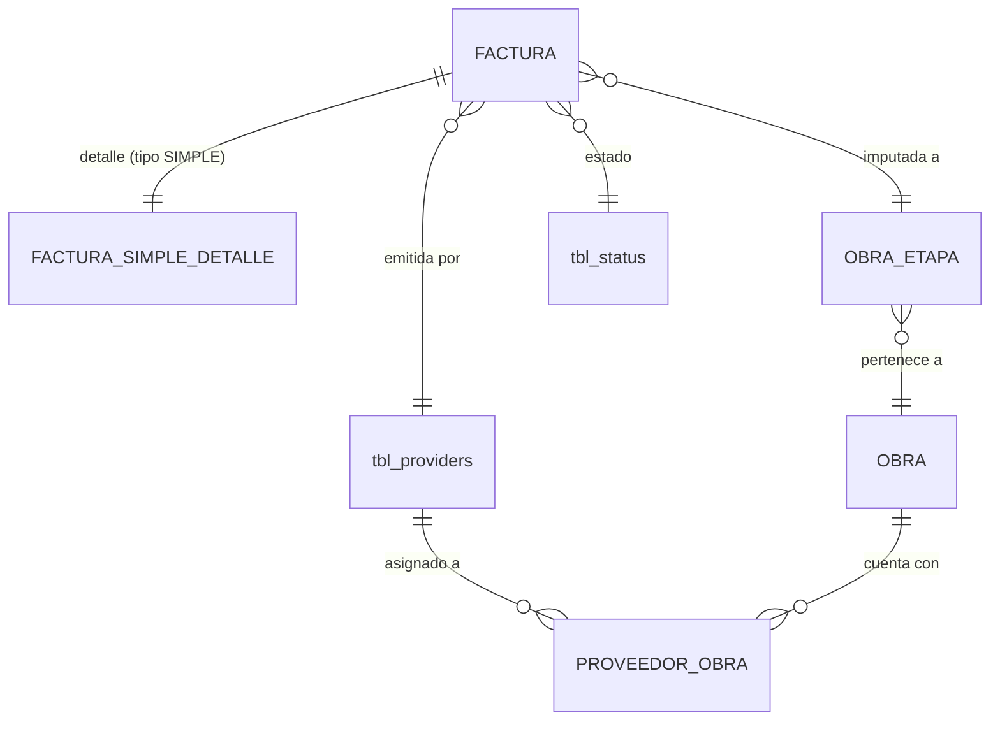

# ADR-0023: Facturación simple

## Estado

**Propuesto.**

La facturación simple **no existe** en el código ni en el esquema. Este ADR documenta la decisión arquitectónica recomendada, dentro del modelo común definido en [ADR-0020](0020-facturacion.md).

Las fórmulas de composición económica **no existen en el código**. Las que aquí aparecen son **PROPUESTA PENDIENTE DE VALIDACIÓN** y no un hallazgo. Su versión autoritativa está en [ADR-0026](0026-calculos-facturacion.md).

## Fecha

2026-09-10 — versión inicial.

## Contexto

La factura simple es el único tipo de factura que **no selecciona contrato**. Solo pide proveedor e información general:

```text
Número de factura · Fecha factura · Fecha aprobación · Número de comprobante
Extracto · Etapa · Valor · Retención en la fuente · Descuento AI · % IVA
Retención IVA · Retención ICA · Flete · Descuento pronto pago · Observación
```

Su composición económica, en el orden que describe el alcance funcional:

```text
VALOR · RTE FUENTE · DCTO AI · SUBTOTAL · IVA · RTE IVA · RTE ICA · FLETE · DCTO PRONTO PAGO · TOTAL
```

Al no tener contrato, no toca ningún recurso finito: no amortiza anticipo, no acumula retenido y no participa en la liquidación. Es el tipo **más simple de gobernar y el más expuesto a errores de cálculo**, porque todo su valor depende de la composición de impuestos y retenciones.

## Problema

Tres problemas distintos:

**1. Las fórmulas no están definidas y el orden de la pantalla no las determina.** El alcance lista `RTE FUENTE` antes de `SUBTOTAL`. Si se lee como secuencia de cálculo, el IVA se calcularía sobre una base ya reducida por la retención en la fuente. Con la otra lectura, las retenciones solo descuentan el neto a pagar. Las dos producen importes distintos.

**2. El `TOTAL` es ambiguo.** Aparece después de las retenciones, así que designa el **neto a pagar** y no el **total facturado**. Son dos cifras distintas con usos distintos: el total facturado es el valor del documento del proveedor; el neto es lo que se desembolsa.

**3. No se sabe qué campos se capturan y cuáles se calculan.** El alcance da `% IVA` como porcentaje, pero `Retención en la fuente`, `Retención IVA` y `Retención ICA` sin indicar si son tasa o valor. En la factura de liquidación ([ADR-0021](0021-facturacion-contrato-mayor.md)) sí aparece `% Retención fuente`. Si se capturan valores en un tipo y tasas en otro, habrá dos motores de cálculo.

## Estado actual

**No se encontró evidencia de implementación.**

| Elemento | Resultado |
| --- | --- |
| Tabla de facturas o de detalle de factura simple | **No existe** |
| Módulo backend, rutas o vista | **No existen** |
| Cualquier fórmula de IVA, retenciones o totales | **No existe** en ninguna capa |
| Configuración de tarifas de IVA, retención o ICA | **No existe** |
| Columnas monetarias en el esquema | **Ninguna** en las 14 tablas del volcado |
| Validación de entrada con esquema | **No existe**: `express-validator` está en `server/package.json` y no se usa en ningún archivo |

Respuestas a las preguntas del alcance:

| Pregunta | Respuesta |
| --- | --- |
| ¿Qué campos son ingresados, calculados, derivados o de configuración? | **No se encontró evidencia.** Clasificación propuesta en `Fuente de verdad` |
| ¿Cuáles son las fórmulas reales? | **No existen.** Propuesta en `Modelo arquitectónico`, pendiente de validación |
| ¿Las fórmulas están repartidas entre frontend y backend? | No aplica: no existen en ninguna de las dos capas |
| ¿Cuál debe ser la fuente de verdad del cálculo? | Decisión 5 |

Elementos del sistema actual que condicionan el diseño:

- `tbl_providers` existe pero **ningún código la referencia**. `prv_identification` tiene índice no único y su FK apunta a `tbl_identity_documents`, que **no está en el volcado** ([ADR-0012](0012-proveedores.md)).
- `tbl_business_rules` guarda la ruta de SharePoint de los archivos de factura (`rul_invoicing_site`, `rul_invoicing_library`, `rul_invoice_folder`, `rul_invoice_path`, `rul_email_invoices`). Las cuatro rutas de `microsoftGraph.routes.js` **no tienen `verifyToken`**.

## Decisión

1. **La factura simple es el tipo `SIMPLE` del modelo común de [ADR-0020](0020-facturacion.md)**: encabezado común más una tabla de detalle propia. No es una entidad aparte.

2. **No tiene contrato, y el esquema lo garantiza** con el `CHECK` de coherencia entre tipo y contrato definido en ADR-0020.

3. **La etapa es obligatoria y determina la obra.** La factura simple se imputa a una etapa, y por ella a una obra. El proveedor debe estar asignado a esa obra ([ADR-0012](0012-proveedores.md)).

   **Estado: Pendiente de validación.** Queda por confirmar si hay facturas simples sin obra (gastos generales). Si existen, la etapa pasa a ser opcional y el modelo lo admite sin cambios estructurales.

4. **El tipo de factura lo decide la presencia de contrato, no el tipo de proveedor.** El alcance nombra la facturación simple igual que el tipo de proveedor "Simple" ([ADR-0010](0010-tipos-proveedor.md)), y eso sugiere una correspondencia. No hay evidencia de que sea una regla. **No se restringe** que un contratista mayor reciba facturas simples ni que un proveedor simple las tenga exclusivamente.

   **Estado: Pendiente de validación.**

5. **La fuente de verdad del cálculo es el backend.** El frontend puede previsualizar con la misma fórmula, pero el valor válido es el que calcula el servidor al registrar y al aprobar. Los importes calculados enviados por el cliente se ignoran.

6. **Todas las retenciones y el IVA se capturan como tasa, y sus valores se derivan.** El modelo es uniforme con la factura de liquidación, donde el alcance ya declara `% Retención fuente`. El motor de cálculo es uno solo para todos los tipos ([ADR-0026](0026-calculos-facturacion.md)).

   **Estado: Pendiente de validación.** Si el área contable necesita capturar el **valor** de la retención (porque la base o la tarifa varía por concepto tributario), la alternativa es capturar valor y no derivarlo. Debe ser una de las dos para todos los tipos, nunca una mezcla.

7. **Se distinguen dos totales con nombre propio**: el **total facturado** (valor del documento del proveedor) y el **neto a pagar** (lo que se desembolsa tras retenciones y descuentos). El `TOTAL` del alcance es el neto a pagar.

8. **Las retenciones no reducen la base gravable del IVA.** Es la lectura B de las alternativas y se adopta como **propuesta pendiente de validación** con el área contable y tributaria. El orden en que la pantalla lista los campos no determina el orden del cálculo.

9. **Los importes calculados no se almacenan.** Subtotal, IVA, retenciones, total facturado y neto a pagar se derivan de lo capturado ([ADR-0027](0027-integridad-transaccional.md), no duplicación de valores).

10. **Las tasas se congelan en la factura al capturarlas.** Si más adelante existe una configuración de tarifas por defecto, cambiarla no altera facturas ya registradas. Es la misma lógica de [ADR-0019](0019-tipos-poliza.md): se copia la regla, se deriva el resultado.

11. **`Descuento AI` se modela como un valor capturado que se resta del valor antes del subtotal**, sin darle otra semántica.

    **Estado: Pendiente de validación.** "AI" puede significar Administración e Imprevistos (componentes del AIU) u otro descuento comercial. En una factura sin contrato ni AIU pactado la primera lectura no es evidente. Hasta confirmarlo, el campo no se relaciona con ningún AIU.

12. **Ciclo de vida, permisos, inmutabilidad, idempotencia y anulación son los de [ADR-0020](0020-facturacion.md)**, sin excepciones para este tipo.

## Justificación

- **Backend como fuente de verdad**: una factura simple es un documento con efecto contable y tributario. Si el total lo calcula el navegador, una petición manipulada registra un neto que sus componentes no respaldan. Tener la misma fórmula en ambas capas solo sirve si el servidor recalcula y no confía en lo recibido.

- **Tasas en lugar de valores**: con la tasa guardada, cualquier corrección del valor base recalcula de forma coherente todas las retenciones. Con el valor guardado, corregir la base deja retenciones desalineadas que nadie recalcula. Aplicar el mismo criterio a la factura de liquidación evita mantener dos motores de cálculo.

- **Dos totales con nombre propio**: el alcance llama `TOTAL` a una cifra que, por su posición, ya descontó retenciones. Llamarla solo "total" haría que se usara como valor facturado en reportes de costo de obra, subestimándolo en el monto de las retenciones. El indicador "costo de obra ejecutado" de [ADR-0002](0002-dashboard.md) necesita el total facturado, no el neto.

- **Retenciones fuera de la base del IVA (lectura B)**: la retención en la fuente es un anticipo de impuesto que se descuenta del pago y no una rebaja del precio. Calcular el IVA sobre una base reducida por la retención subestimaría el IVA de cada factura. Aun así, **no se adopta como decisión firme**: es materia tributaria y la valida el área contable. Por eso queda como propuesta.

- **No almacenar calculados**: un total guardado es una copia de una fórmula, y se desalinea en cuanto alguien corrige un componente o se ajusta la fórmula. Mientras la factura está `REGISTRADA` sus componentes cambian; derivar el total evita el problema.

- **No restringir por tipo de proveedor**: la coincidencia de nombres entre "facturación simple" y "proveedor simple" es sugerente, pero no hay evidencia de que sea una regla. Restringir sin evidencia bloquearía casos reales, como un contratista mayor que factura una compra puntual sin contrato.

## Alternativas consideradas

### Lectura de la composición económica

| | Alternativa | A favor | En contra |
| --- | --- | --- | --- |
| **A** | **Orden literal de la pantalla**: `SUBTOTAL = VALOR − RTE FUENTE − DCTO AI`; IVA sobre ese subtotal | Coincide con el orden de los campos; fácil de explicar al usuario de la pantalla | El IVA se calcula sobre una base reducida por una retención, lo que subestima el impuesto; mezcla deducciones del pago con la base del precio |
| **B** | **Base gravable antes de retenciones** *(propuesta)*: `SUBTOTAL = VALOR − DCTO AI`; IVA sobre el subtotal; las retenciones solo descuentan el neto a pagar | Separa el precio (base, IVA, total facturado) del pago (retenciones, neto); da un total facturado utilizable como costo de obra | No sigue el orden visual de los campos; hay que presentar los importes en dos bloques |
| **C** | **Totales capturados por el usuario**, sin fórmula | Admite cualquier caso tributario, por irregular que sea | Nada verifica que el total cuadre con sus componentes; sin integridad de cálculo; contradice la decisión 5 |

Se propone **B**, **pendiente de validación** con el área contable y tributaria.

### Captura de retenciones

| | Alternativa | Evaluación |
| --- | --- | --- |
| **A** | **Tasa capturada, valor derivado** *(propuesta)* | Uniforme con `% Retención fuente` de la factura de liquidación; corregir la base recalcula todo |
| **B** | Valor capturado | Admite bases y tarifas variables por concepto tributario; corregir la base deja retenciones desalineadas |
| **C** | Mixto: tasa en unos campos, valor en otros | Dos motores de cálculo y validaciones distintas por campo. **Descartada** |

### Persistencia de los importes calculados

| | Alternativa | Evaluación |
| --- | --- | --- |
| **A** | Almacenar subtotal, IVA, retenciones y totales | Consulta directa, pero son copias de una fórmula que se desincronizan. **Descartada** como fuente de verdad |
| **B** | **Derivar siempre** *(seleccionada)* | Una sola verdad. El coste de cálculo por factura es despreciable |
| **C** | Derivar y además guardar una instantánea al aprobar | Admisible solo como evidencia de auditoría ([ADR-0020](0020-facturacion.md), registro de aprobación), nunca como fuente de cálculo |

## Modelo arquitectónico

Modelo propuesto. **Ninguna de estas tablas existe hoy**, salvo `tbl_providers` y `tbl_status`.



```text
FACTURA  (encabezado común — ADR-0020)
  ├── proveedor              FK  NOT NULL
  ├── contrato               NULL  ← obligatorio NULL para SIMPLE (CHECK)
  ├── etapa                  FK  NOT NULL  → determina la obra
  ├── tipo = SIMPLE
  ├── número de factura      UNIQUE (proveedor, número)
  ├── fecha factura · fecha aprobación · número de comprobante · extracto
  ├── descripción            ← "Observación" en la interfaz de la factura simple
  ├── clave de idempotencia  UNIQUE
  └── sta_id · auditoría estándar

FACTURA_SIMPLE_DETALLE
  ├── factura                FK  NOT NULL  UNIQUE (1:1)
  ├── valor                  decimal exacto   ingresado
  ├── descuento AI           decimal exacto   ingresado
  ├── porcentaje IVA         decimal          ingresado, congelado
  ├── porcentaje rte fuente  decimal          ingresado, congelado
  ├── porcentaje rte IVA     decimal          ingresado, congelado
  ├── tarifa rte ICA         decimal          ingresado, congelado
  ├── flete                  decimal exacto   ingresado
  └── descuento pronto pago  decimal exacto   ingresado

  ✗ NO almacena: subtotal, IVA, retenciones, total facturado, neto a pagar
```

### Composición propuesta — PROPUESTA PENDIENTE DE VALIDACIÓN

> No es un hallazgo. **No existe ninguna fórmula en el código.** Se propone para decidir y la valida el área contable y tributaria. Versión autoritativa en [ADR-0026](0026-calculos-facturacion.md).

Lectura B (propuesta):

```text
 [1] VALOR                        ingresado
 [2] DCTO AI                      ingresado
 [3] SUBTOTAL          = [1] − [2]
 [4] IVA               = [3] × % IVA
 [5] FLETE                        ingresado
 [6] TOTAL FACTURADO   = [3] + [4] + [5]            ← no aparece en la pantalla descrita
 ─────────────────────────────────────────────────
 [7] RTE FUENTE        = [3] × % rte fuente
 [8] RTE IVA           = [4] × % rte IVA
 [9] RTE ICA           = [3] × tarifa ICA
[10] DCTO PRONTO PAGO             ingresado
[11] TOTAL (neto a pagar) = [6] − [7] − [8] − [9] − [10]
```

Lectura A (orden literal de la pantalla), para comparar:

```text
SUBTOTAL  = VALOR − RTE FUENTE − DCTO AI
IVA       = SUBTOTAL × % IVA                  ← base reducida por la retención
TOTAL     = SUBTOTAL + IVA − RTE IVA − RTE ICA + FLETE − DCTO PRONTO PAGO
```

Puntos abiertos dentro de la propia fórmula, todos **pendientes de validación**:

| Punto | Opciones |
| --- | --- |
| Base de la retención en la fuente | Subtotal · Subtotal + flete |
| Base del ICA | Subtotal · Total facturado |
| ¿El flete causa IVA? | No (fuera de la base, como en la propuesta) · Sí (sumado antes del IVA) |
| ¿El descuento pronto pago reduce la base gravable? | No: descuento condicionado, solo descuenta el neto (propuesta) · Sí |
| Redondeo | Por línea, a pesos · Por línea, a dos decimales · Solo en los totales |

## Reglas de negocio

**No se encontró evidencia en la implementación actual.** Reglas propuestas:

1. La factura simple no tiene contrato.
2. Tiene proveedor y etapa obligatorios.
3. El proveedor debe estar activo y asignado a la obra de la etapa.
4. El número de factura es único por proveedor ([ADR-0020](0020-facturacion.md)).
5. Valor, descuento AI, flete y descuento pronto pago no pueden ser negativos.
6. El descuento AI no puede superar el valor.
7. Las tasas de IVA, retención en la fuente, retención de IVA e ICA van de 0 a 100.
8. El neto a pagar no puede ser negativo.
9. Subtotal, IVA, retenciones, total facturado y neto a pagar se calculan en el backend y nunca se capturan.
10. Las tasas capturadas quedan congeladas en la factura.
11. Solo las facturas `APROBADA` cuentan para el costo de obra ejecutado ([ADR-0002](0002-dashboard.md)).
12. La factura simple no amortiza anticipo, no acumula retenido y no afecta el estado de ningún contrato.
13. Tras la aprobación, la información financiera es inmutable; se corrige anulando y registrando de nuevo.

**Pendiente de validación:** la composición económica completa (lectura A o B y los puntos abiertos de la fórmula), si las retenciones se capturan como tasa o como valor, la semántica de `Descuento AI` y de `Extracto`, si hay facturas simples sin obra, si el tipo de proveedor restringe el tipo de factura y la regla de redondeo.

## Seguridad

- **Toda operación exige permiso verificado en backend.** Hoy **ninguna ruta del sistema verifica permisos** ([ADR-0014](0014-autorizacion-permisos.md)); la facturación no debe construirse antes de corregirlo.
- **Ningún importe calculado se acepta desde el cliente.** Si la petición trae subtotal, IVA, retenciones o totales, se ignoran y se recalculan. Aceptarlos permitiría registrar un neto a pagar mayor que el que sus componentes respaldan.
- **Las tasas se validan en rango en el servidor.** Una retención de IVA capturada en 0 % por manipulación sube el neto a pagar sin que cambie ningún valor visible.
- **El proveedor debe validarse como asignado a la obra de la etapa.** La FK garantiza que proveedor y etapa existan, no que estén relacionados.
- **Estado y fecha de aprobación no se aceptan como campos de escritura**: los fija el acto de aprobación.
- Consultas parametrizadas. El patrón vigente en `paginationUsers` interpola once parámetros del cliente en la cadena SQL; un listado de facturas filtrable por proveedor, número y fechas construido así sería explotable.
- Validación de esquema de entrada en el servidor. `express-validator` ya es dependencia del backend y no se usa en ninguna parte.

## Autorización

Los permisos son los del modelo común de [ADR-0020](0020-facturacion.md):

```text
CONSULTAR FACTURAS
CREAR FACTURA
EDITAR FACTURA
APROBAR FACTURA
ANULAR FACTURA
ANULAR FACTURA APROBADA
```

**Pendiente de validación:** si la factura simple necesita permisos propios, distintos de los de las facturas de contrato. El modelo lo admite sin cambios.

**Ninguno de estos permisos existe hoy.** El catálogo real son ocho permisos (`per_id` 1 a 8) sobre perfiles y usuarios, declarados en `client/src/contexts/permissions/permissionsConfig.js`.

## Auditoría

**Nivel requerido: auditoría funcional completa**, igual que el modelo común.

| Información | Nivel |
| --- | --- |
| Creación de la factura con su composición | **Funcional** |
| Valor, descuentos, flete | **Funcional** mientras está `REGISTRADA` |
| Tasas de IVA, retenciones e ICA | **Funcional** mientras está `REGISTRADA` |
| Aprobación | **Funcional**, con instantánea de los importes calculados en ese momento |
| Anulación | **Funcional**, con motivo obligatorio |
| Extracto y observación | Técnica |

La instantánea de la aprobación **no es fuente de cálculo**: es evidencia. Permite demostrar después qué importes se aprobaron aunque la fórmula haya cambiado.

El autor se toma de `req.user`. Todo el backend actual lo recibe desde `req.body`, lo que hace la auditoría falsificable ([ADR-0013](0013-auditoria-trazabilidad.md)).

## Validaciones

| Validación | Frontend | Backend | Base de datos | Clasificación |
| --- | --- | --- | --- | --- |
| Proveedor y etapa obligatorios | Propuesta (selectores) | Propuesta | `NOT NULL` + FK | Integridad |
| Contrato nulo | No aplica | Propuesta | **`CHECK`** tipo/contrato | **Integridad** |
| Proveedor asignado a la obra de la etapa | Propuesta (filtra) | **Propuesta — obligatoria** | No expresable | **Regla de negocio + Seguridad** |
| Número único por proveedor | Propuesta (aviso) | Propuesta (+ `ER_DUP_ENTRY`) | **`UNIQUE (proveedor, número)`** | **Integridad** |
| Campos obligatorios de encabezado | Propuesta | Propuesta | `NOT NULL` | Validación de interfaz |
| Importes no negativos | Propuesta | **Propuesta — obligatoria** | `CHECK` | Regla de negocio |
| Descuento AI ≤ valor | Propuesta | **Propuesta — obligatoria** | `CHECK` | Regla de negocio |
| Tasas entre 0 y 100 | Propuesta | **Propuesta — obligatoria** | `CHECK` | Regla de negocio |
| Neto a pagar ≥ 0 | Propuesta (aviso) | **Propuesta — obligatoria** | No expresable (valor derivado) | Regla de negocio |
| Importes calculados no aceptados desde el cliente | No aplica | **Propuesta — obligatoria** | No expresable | **Seguridad** |
| Factura aprobada no editable | Propuesta (bloquea) | **Propuesta — obligatoria** | No expresable | **Regla de negocio + Seguridad** |
| Clave de idempotencia | Propuesta (genera) | **Propuesta — obligatoria** | **`UNIQUE`** | **Integridad** |
| Permiso de la acción | Propuesta (oculta) | **Propuesta — obligatoria** | No aplica | **Seguridad** |

`error.middleware.js` **ya traduce `ER_DUP_ENTRY` a un `409`**. Lo que falta es la restricción que lo dispare, y un mensaje que diga qué está duplicado: hoy responde el genérico "Intento de duplicar un valor único... Contacta a sistemas".

## Integridad de datos

Requisitos propuestos, además de los del encabezado común de [ADR-0020](0020-facturacion.md):

- `UNIQUE` sobre la factura en la tabla de detalle: relación 1:1.
- FK del detalle a la factura, `ON DELETE RESTRICT`.
- `CHECK` que impida un detalle simple en una factura de otro tipo. No es expresable con un `CHECK` de una sola tabla; se garantiza en el servicio o con un disparador. **El esquema actual no usa disparadores**, así que se recomienda el servicio.
- `CHECK` sobre importes no negativos, descuento AI ≤ valor y tasas en rango.
- **Decimal exacto para importes y tasas. Nunca punto flotante.** El esquema no tiene ninguna columna monetaria; la convención se fija en [ADR-0016](0016-conceptos-contractuales.md).
- Índices sobre proveedor, etapa y fecha de factura, necesarios para el costo de obra ejecutado del dashboard.
- Sin migraciones versionadas: el único artefacto de esquema es un volcado de Navicat.

## Transacciones

**Registrar**

```text
BEGIN
  validar proveedor activo y asignado a la obra de la etapa
  calcular composición (backend)
  INSERT factura (encabezado, tipo SIMPLE, contrato NULL)
  INSERT factura_simple_detalle
  INSERT historial de estado (REGISTRADA)
  INSERT auditoría
COMMIT
```

**Aprobar**

```text
BEGIN
  SELECT factura ... FOR UPDATE
  verificar estado = REGISTRADA
  recalcular composición (backend)
  UPDATE factura: estado = APROBADA, fecha de aprobación
  INSERT historial de estado
  INSERT auditoría con instantánea de importes
COMMIT
```

A diferencia de las facturas de contrato, **no se bloquea ningún contrato** porque no lo hay, y **no se evalúan saldos ni condiciones de liquidación**.

**Precaución verificada:** `executeQuery` en `server/src/common/configs/db.config.js` toma una conexión nueva del pool si no recibe la conexión como tercer parámetro. Esa escritura **sobrevive al `rollback`**: el encabezado podría quedar confirmado sin su detalle.

Ver [ADR-0027](0027-integridad-transaccional.md).

## Concurrencia

La factura simple **no consume ningún recurso finito**: no hay saldo que sobregirar. Su riesgo de concurrencia es menor que el de las facturas de contrato, pero no es nulo.

**Escenario 1 — Doble registro por doble clic o reintento HTTP.** Se crean dos facturas idénticas y el costo de obra ejecutado se duplica.

- Protección: clave de idempotencia con `UNIQUE` ([ADR-0020](0020-facturacion.md)). Red de seguridad: `UNIQUE (proveedor, número)`.
- **No existe protección de idempotencia en ninguna operación del sistema actual.**

**Escenario 2 — Dos usuarios registran el mismo número de factura del mismo proveedor.**

- Protección: `UNIQUE (proveedor, número)`. Con el patrón `SELECT`-luego-`INSERT` del proyecto y sin restricción, ambos registros tendrían éxito ([ADR-0012](0012-proveedores.md) documenta la traza de esa carrera).

**Escenario 3 — Doble aprobación simultánea.**

- Protección: `SELECT factura ... FOR UPDATE` y verificación de que el estado leído sea `REGISTRADA`.

**Escenario 4 — Edición mientras se aprueba.** Un usuario edita el valor mientras otro aprueba.

- Protección: el mismo bloqueo sobre la fila de la factura. Quien lo obtiene segundo ve el estado ya cambiado: la edición se rechaza por inmutabilidad, o la aprobación recalcula sobre el valor editado.

## Fuente de verdad

Clasificación de todos los campos, que es la respuesta a la sección 17 del alcance:

| Campo | Clase | Fuente de verdad | Momento |
| --- | --- | --- | --- |
| Proveedor, etapa | **Ingresado** | Selección del usuario | Al registrar |
| Obra | **Derivado** | Etapa → obra | En cada consulta |
| Número de factura, fecha factura | **Ingresado** | Documento del proveedor | Al registrar |
| Número de comprobante, extracto | **Ingresado** | Captura del usuario | Al registrar |
| Fecha de aprobación | **Derivado del acto** | Aprobación | Al aprobar |
| Valor, descuento AI, flete, descuento pronto pago | **Ingresado** | Captura del usuario | Al registrar |
| % IVA, % rte fuente, % rte IVA, tarifa ICA | **Ingresado, congelado** (con valor por defecto de **configuración inexistente**, pendiente) | Captura del usuario | Al registrar |
| Subtotal | **Calculado** | Fórmula del backend | En cada consulta |
| IVA (valor) | **Calculado** | Subtotal × % IVA | En cada consulta |
| Rte fuente, rte IVA, rte ICA (valores) | **Calculado** | Base × tasa | En cada consulta |
| Total facturado | **Calculado** | Subtotal + IVA + flete | En cada consulta |
| Neto a pagar (`TOTAL`) | **Calculado** | Total facturado − retenciones − descuento pronto pago | En cada consulta |
| Estado | **Almacenado** | Máquina de estados ([ADR-0020](0020-facturacion.md)) | En cada transición |

**Fuente de verdad del cálculo: la función de composición del backend**, compartida con el resto de tipos ([ADR-0026](0026-calculos-facturacion.md)).

Las tarifas por defecto no tienen hoy dónde vivir: **no existe configuración de tarifas en ninguna parte del sistema**. Mientras no exista, la tasa se captura en cada factura.

## Inmutabilidad

| Momento | Qué queda inmutable |
| --- | --- |
| **Al aprobar** | Valor, descuento AI, todas las tasas, flete, descuento pronto pago, proveedor, etapa, número y fecha de factura |
| **Al aprobar** | Fecha de aprobación, usuario aprobador e instantánea de importes |
| **Al anular** | La totalidad del documento |
| **Siempre** | Tipo `SIMPLE` y contrato nulo: una factura simple no se convierte en factura de contrato |

Modificable **después** de aprobar: solo extracto y observación, que no entran en ningún cálculo.

Cualquier corrección de importe o tasa en una factura aprobada se hace **anulando y registrando de nuevo**. Cada factura registra la **versión de la fórmula** con que se calculó y se recalcula siempre con esa versión, nunca con una posterior ([ADR-0026](0026-calculos-facturacion.md)). La **instantánea de aprobación** se conserva como evidencia: si al recalcular no coincide con ella, es una discrepancia que se reporta, no se corrige en silencio.

El versionado de la fórmula se decide en [ADR-0026](0026-calculos-facturacion.md) y cierra el pendiente que esta sección dejaba abierto en su versión inicial.

## Consecuencias

### Positivas

- La factura simple no es una entidad aparte: comparte encabezado, ciclo de vida, permisos y auditoría con el resto.
- Separar total facturado y neto a pagar evita subestimar el costo de obra en el monto de las retenciones.
- Con tasas congeladas y valores derivados, corregir la base mientras la factura está registrada recalcula todo de forma coherente.
- El cálculo en backend impide registrar netos manipulados.
- Al no consumir recursos finitos, no necesita bloquear contratos.

### Negativas

- La composición económica no se puede implementar hasta que el área contable valide la fórmula.
- Presentar los importes en dos bloques (precio y pago) se aparta del orden visual que describe el alcance.
- Sin configuración de tarifas por defecto, el usuario captura las tasas en cada factura, con más carga y más riesgo de error.
- Recalcular siempre obliga a gestionar el cambio de fórmula: instantánea de aprobación o fórmula versionada.

## Riesgos

| Riesgo | Severidad | Descripción |
| --- | --- | --- |
| Fórmula sin validar implementada como definitiva | **Crítico** | IVA o retenciones mal calculados en todas las facturas; efecto tributario |
| Importes calculados aceptados desde el cliente | **Crítico** | Neto a pagar manipulado sin cambiar los valores visibles |
| Retenciones restadas antes del IVA | **Alto** | Subestima el IVA si se adopta la lectura A sin validarla |
| `TOTAL` usado como costo de obra | **Alto** | El costo ejecutado del dashboard quedaría subestimado en las retenciones |
| Tasas manipuladas | **Alto** | Una retención en 0 % sube el neto a pagar |
| Doble registro | **Alto** | Duplica el costo de obra ejecutado; no hay idempotencia en el sistema |
| Números de factura duplicados | **Alto** | Sin `UNIQUE`, el patrón del proyecto no lo impide |
| Proveedor no asignado a la obra | **Medio** | La FK no verifica la relación proveedor-obra |
| Encabezado sin detalle | **Alto** | `executeQuery` sin conexión escapa de la transacción |
| Cambio de fórmula sin control | **Medio** | Facturas aprobadas que al consultarse ya no coinciden con lo aprobado |
| Punto flotante en importes | **Alto** | Diferencias de centavos acumuladas |
| Inyección SQL en el listado | **Alto** | Si se replica el patrón de `paginationUsers` |
| Sin autorización en backend | **Crítico** | Estado actual del sistema |

## Impacto técnico

### Frontend

- Formulario de factura simple sin selector de contrato y con selector de etapa filtrado por las obras del proveedor.
- `GenericFormSection.jsx` ya soporta `currency`, `float`, `number`, `date`, `dropdown` y `textarea`.
- Importes en **dos bloques**: precio (valor, descuento AI, subtotal, IVA, flete, total facturado) y pago (retenciones, descuento pronto pago, neto a pagar).
- **Los calculados se muestran como previsualización de solo lectura**; el valor válido lo devuelve el servidor.
- La clave de idempotencia se genera al abrir el formulario, no al enviarlo.
- `DataTable.jsx`, `FilterPopper.jsx`, `BaseDialog.jsx`, `ConfirmDialog.jsx`, `StatusChip.jsx` y `TableActions.jsx` son reutilizables.

### Backend

- Endpoint de registro del tipo `SIMPLE` dentro del módulo de facturación de [ADR-0020](0020-facturacion.md).
- Invocación de la función de composición común de [ADR-0026](0026-calculos-facturacion.md), sin implementación propia.
- Validación de la relación proveedor-obra.
- Validación de esquema de entrada; `express-validator` ya está disponible.

### Base de datos

- Tabla de detalle simple, además del encabezado común. Ninguna existe.
- Depende de etapa, obra, relación proveedor-obra y del módulo de proveedores, que tampoco existen.
- `CHECK` y `UNIQUE`: ninguno presente hoy en el esquema.
- Sin migraciones versionadas.

### Infraestructura

- El archivo físico puede guardarse en SharePoint con la configuración que ya existe en `tbl_business_rules` y el módulo `microsoftGraph`. Antes hay que proteger sus cuatro rutas con `verifyToken` y dejar de guardar `rul_client_secret` en texto plano.
- **No se encontró evidencia** de integración con facturación electrónica, contabilidad ni servicios tributarios externos.

## Arquitectura objetivo

| Área | Actual | Objetivo | Brecha |
| --- | --- | --- | --- |
| Factura simple | No existe | Tipo `SIMPLE` del modelo común | **Alta** |
| Contrato | No aplica | Nulo, garantizado por `CHECK` | **Media** |
| Composición económica | No existe | Función única del backend, validada por contabilidad | **Alta** |
| Totales | No existen | Total facturado y neto a pagar, derivados | **Alta** |
| Retenciones | No existen | Tasa capturada y congelada, valor derivado | **Alta** |
| Tarifas por defecto | No existe configuración | Configuración de tarifas (pendiente) | **Media** |
| Idempotencia | Inexistente en todo el sistema | Clave con `UNIQUE` | **Alta** |
| Permisos | No existen | Los del modelo común, verificados en backend | **Crítica** |
| Auditoría | Autor desde el body | Funcional, autor desde el token | **Alta** |

## Brechas identificadas

| # | Brecha | Severidad |
| --- | --- | --- |
| B1 | La factura simple no existe en ninguna capa | **Alta** |
| B2 | **Composición económica sin definir: lectura A o B y puntos abiertos** | **Alta** — decisión de negocio bloqueante |
| B3 | Captura de retenciones como tasa o como valor sin definir | **Alta** — decisión de negocio pendiente |
| B4 | Semántica de `Descuento AI` y de `Extracto` sin definir | **Media** — decisión de negocio pendiente |
| B5 | Si existen facturas simples sin obra, sin definir | **Media** — decisión de negocio pendiente |
| B6 | Si el tipo de proveedor restringe el tipo de factura, sin definir | **Media** — decisión de negocio pendiente |
| B7 | No existe configuración de tarifas de IVA, retención ni ICA | **Media** |
| B8 | No existen obra, etapa, relación proveedor-obra ni módulo de proveedores | **Alta** — bloqueante |
| B9 | Sin columnas monetarias, `UNIQUE` ni `CHECK` en el esquema | **Alta** |
| B10 | Sin idempotencia en ninguna operación del sistema | **Alta** |
| B11 | Ninguna ruta del backend verifica permisos | **Crítica** |
| B12 | El autor de la auditoría proviene del cliente | **Alta** |
| B13 | `executeQuery` sin conexión escapa de la transacción | **Alta** — preventiva |
| B14 | `express-validator` sin uso; sin validación de esquema de entrada | **Media** |
| B15 | Rutas de `microsoftGraph` sin `verifyToken` | **Alta** |
| B16 | Sin migraciones versionadas | **Media** |

## Plan de implementación

Recomendación derivada del análisis. **No fue ejecutada.**

**Fase 0 — Prerrequisitos (B8, B11, B16)**
Obra, etapa, relación proveedor-obra, módulo de proveedores y modelo común de facturación ([ADR-0020](0020-facturacion.md)). Autorización en backend. Migraciones versionadas.

**Fase 1 — Validación contable (B2, B3, B4)**
**Bloqueante.** El área contable y tributaria confirma la lectura de la composición, las bases de cada retención, el tratamiento del flete y del descuento pronto pago, la captura como tasa o valor, el redondeo y la semántica de `Descuento AI`.

**Fase 2 — Decisiones funcionales (B5, B6)**
Facturas simples sin obra y restricción por tipo de proveedor.

**Fase 3 — Modelo (B9)**
Tabla de detalle con decimales exactos, `CHECK` y relación 1:1.

**Fase 4 — Cálculo e idempotencia (B10, B13, B14)**
Integrar la función común de [ADR-0026](0026-calculos-facturacion.md). Clave de idempotencia. Validación de esquema. Revisar que toda escritura use la conexión de la transacción.

**Fase 5 — Configuración de tarifas (B7)**
Si se confirma, configuración de tarifas por defecto con congelación en cada factura.

**Fase 6 — Interfaz, permisos y auditoría (B12, B15)**
Formulario en dos bloques. Permisos en backend. Auditoría con autor desde el token. Rutas de `microsoftGraph` autenticadas.

## ADR relacionados

- [ADR-0020 — Facturación](0020-facturacion.md) — modelo común que este ADR especializa
- [ADR-0026 — Cálculos de facturación](0026-calculos-facturacion.md) — versión autoritativa de la composición económica
- [ADR-0027 — Integridad transaccional del CORE](0027-integridad-transaccional.md)
- [ADR-0012 — Proveedores](0012-proveedores.md) — relación proveedor-obra
- [ADR-0010 — Tipo de proveedor](0010-tipos-proveedor.md) — posible correspondencia con la facturación simple
- [ADR-0011 — Obras](0011-obras.md) — etapas
- [ADR-0002 — Dashboard](0002-dashboard.md) — costo de obra ejecutado por tipo de factura
- [ADR-0013 — Auditoría](0013-auditoria-trazabilidad.md) · [ADR-0014 — Autorización](0014-autorizacion-permisos.md)

## Referencias

- `database/bdintervewebpack.sql` — 14 tablas, ninguna de facturación y sin columnas monetarias; `tbl_providers` huérfana; `tbl_business_rules` con la configuración de SharePoint
- `server/src/common/configs/db.config.js` — `executeQuery` y el manejo de conexiones
- `server/src/common/middlewares/error.middleware.js` — traducción de `ER_DUP_ENTRY` a `409`
- `server/src/modules/security/users/users.service.js` — `paginationUsers`, patrón de interpolación a no replicar
- `server/src/modules/microsoftGraph/microsoftGraph.routes.js` — rutas sin `verifyToken`
- `server/package.json` — `express-validator` sin uso
- `client/src/ui-component/extended/GenericFormSection.jsx`
