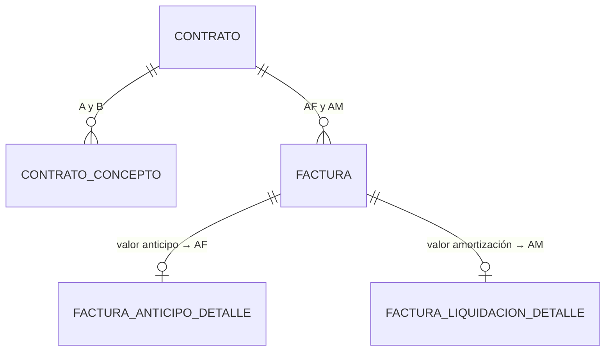

# ADR-0024: Anticipo contractual y amortización

## Estado

**Propuesto.**

El anticipo y su amortización **no existen** en el código ni en el esquema. Este ADR documenta la decisión arquitectónica recomendada para uno de los dos recursos finitos del CORE —el otro es el retenido, en [ADR-0025](0025-retenciones.md)—.

## Fecha

2026-09-10 — versión inicial.

## Contexto

El ciclo del anticipo atraviesa tres ADR:

```text
PACTADO      cada concepto contractual declara su % de anticipo           ADR-0016
     ↓
FACTURADO    facturas de anticipo, con el contrato EN EJECUCIÓN            ADR-0021
     ↓
AMORTIZADO   facturas de liquidación, asociadas al otrosí de liquidación   ADR-0021
             (confirmado), con el contrato EN LIQUIDACIÓN
     ↓
CERRADO      pendiente por amortizar = 0 → condición C2 de liquidación     ADR-0017
```

Regla crítica del alcance:

> *"El porcentaje de anticipo definido en el contrato determina el porcentaje que debe amortizarse en las facturas correspondientes."*

## Problema

1. **Qué es "el porcentaje del contrato" cuando cada concepto pacta el suyo.** [ADR-0016](0016-conceptos-contractuales.md) guarda el porcentaje por concepto. Si el valor inicial pacta 30 % y un otrosí 10 %, el contrato no tiene un único porcentaje.

2. **Contra qué se amortiza.** Si el anticipo pactado fue 32 millones y solo se facturaron 20, amortizar 32 obligaría a descontar al proveedor dinero que nunca recibió.

3. **Almacenar o calcular los saldos.** El alcance pide preferir *"almacenar movimientos y calcular saldos derivados"*, sin imponerlo antes de analizar rendimiento y arquitectura.

4. **Concurrencia.** El escenario del alcance:

   ```text
   Saldo anticipo = 10.000.000
   Usuario A amortiza 7.000.000
   Usuario B amortiza 5.000.000
   ```

5. **Correcciones.** Anular una factura de anticipo ya amortizada, o un otrosí que reduce el anticipo pactado, pueden dejar saldos imposibles.

## Estado actual

**No se encontró evidencia de implementación.**

| Pregunta del alcance (sección 11) | Respuesta |
| --- | --- |
| ¿Dónde se almacena el anticipo? | No se encontró evidencia en la implementación actual |
| ¿Se guarda porcentaje y valor? | No aplica |
| ¿Cómo se calcula el valor? | No aplica |
| ¿Cómo se controla el saldo pendiente? | No aplica |
| ¿Cómo se calcula lo amortizado? | No aplica |
| ¿Qué ocurre con varios conceptos contractuales? | No aplica |
| ¿Qué ocurre con los otrosí? | No aplica |
| ¿Cómo se actualiza el saldo? | No aplica |

Hechos verificados que condicionan la decisión:

| Hecho | Evidencia |
| --- | --- |
| Ningún bloqueo de filas en todo el backend | Sin coincidencias de `FOR UPDATE`, `LOCK IN SHARE MODE`, `SET TRANSACTION` ni `ISOLATION` en `server/` |
| Nivel de aislamiento no configurado: rige `REPEATABLE READ`, el valor por defecto de InnoDB | `server/src/common/configs/db.config.js` crea el pool sin opciones de aislamiento |
| Pool de 10 conexiones | `connectionLimit: 10` en el mismo archivo |
| Sin tratamiento de interbloqueos ni esperas de bloqueo | `error.middleware.js` no contempla `ER_LOCK_DEADLOCK` ni `ER_LOCK_WAIT_TIMEOUT`: caen en el caso por defecto, un 500 "Error desconocido de base de datos" |
| Sin librería de aritmética decimal | `server/package.json`, `client/package.json` |
| El pool no configura `decimalNumbers` | `db.config.js`; con la configuración por defecto de `mysql2`, las columnas `DECIMAL` se reciben como cadena |
| Patrón transaccional correcto en los servicios existentes | `beginTransaction` / `commit` / `rollback` en `users.service.js`, `profiles.service.js`, `permissions.service.js` |

## Decisión

1. **Se definen cinco magnitudes, todas calculadas y ninguna almacenada:**

   ```text
   B   Base vigente del contrato  = Σ conceptos no anulados (base antes de IVA)
   A   Anticipo pactado           = Σ conceptos no anulados (base antes de IVA × % anticipo)
   AF  Anticipo facturado         = Σ valor de facturas ANTICIPO   en estado APROBADA
   AM  Amortizado                 = Σ valor amortización de facturas LIQUIDACION APROBADA

   Anticipo por facturar          = máx(0, A − AF)
   Pendiente por amortizar        = AF − AM
   ```

2. **El saldo de anticipo es único por contrato**, no por concepto. La amortización ocurre en facturas asociadas al otrosí de liquidación y no a cada concepto ([ADR-0021](0021-facturacion-contrato-mayor.md)).

3. **La amortización se mide contra el anticipo facturado, no contra el pactado.** Se amortiza lo que efectivamente se entregó. La condición `C2` de liquidación es `AF − AM = 0` ([ADR-0017](0017-estados-contrato.md)).

4. **Invariantes del anticipo:**

   | ID | Invariante | Se verifica al… |
   | --- | --- | --- |
   | **I1** | `AF ≤ A` | Registrar y aprobar una factura de anticipo |
   | **I2** | `AM ≤ AF` | Registrar y aprobar una factura de liquidación · **anular** una factura de anticipo aprobada |

   I1 **no** se exige retroactivamente. Un otrosí posterior que reduzca `A` por debajo de `AF` —por ejemplo, el de liquidación— es admisible: lo entregado ya se entregó. En ese caso el anticipo por facturar muestra cero y la amortización sigue rigiéndose por `AF`.

5. **Porcentaje por defecto de amortización = porcentaje de anticipo efectivo del contrato:**

   ```text
   % anticipo efectivo = A / B
   ```

   Si todos los conceptos pactan el mismo porcentaje, coincide con él. **Pendiente de validación.**

6. **La base del anticipo pactado y la base de la amortización son de la misma naturaleza: valor antes de IVA.** Si el anticipo se pacta sobre una base y se amortiza sobre otra, el porcentaje efectivo no cierra el saldo. **Pendiente de validación**, en coherencia con [ADR-0026](0026-calculos-facturacion.md).

7. **En la factura de liquidación, la amortización es un movimiento y se almacena su valor:**
   - Valor por defecto: `mín(VALOR × % anticipo efectivo, pendiente por amortizar)`.
   - El usuario puede modificarlo **dentro de `0 ≤ valor ≤ mín(pendiente por amortizar, VALOR de la factura)`**.
   - Apartarse del valor por defecto exige el permiso **`AJUSTAR AMORTIZACIÓN`**. **Pendiente de validación.**
   - Se guardan también, solo como evidencia, el porcentaje por defecto vigente al registrar y el porcentaje aplicado (`valor / VALOR`).

8. **La validación de saldo se hace al registrar y, con carácter definitivo, al aprobar.** Las facturas `REGISTRADA` **no reservan saldo**: dos facturas registradas pueden sumar más que el pendiente, y la segunda aprobación se rechaza.

9. **Protección de concurrencia: bloqueo pesimista de la fila del contrato como primera sentencia de la transacción**, y cálculo de los saldos después del bloqueo ([ADR-0027](0027-integridad-transaccional.md)).

10. **Anulaciones:**
    - Anular una factura de **anticipo** aprobada solo se admite si después se cumple I2: `AF − valor ≥ AM`. Si ya se amortizó, primero debe anularse la amortización.
    - Anular una factura de **liquidación** aprobada reduce `AM` y siempre cumple I2. Queda condicionada por el retenido ([ADR-0025](0025-retenciones.md)) y por el estado del contrato.

11. **Los porcentajes de anticipo de los conceptos quedan inmutables desde la primera factura aprobada del contrato** ([ADR-0016](0016-conceptos-contractuales.md)).

12. **Un proceso de conciliación reporta, sin corregir, cualquier contrato que incumpla I1 o I2**, como defensa ante escrituras fuera del flujo previsto.

## Justificación

- **Amortizar contra lo facturado**: es la corrección que obligó a ajustar la condición `C2` de [ADR-0017](0017-estados-contrato.md). Si se amortizara contra lo pactado, un contrato cuyo anticipo se desembolsó parcialmente nunca podría liquidarse sin descontar dinero no entregado.

- **Porcentaje efectivo `A / B`**: si el anticipo facturado coincide con el pactado y todo el valor del contrato se factura en liquidación, aplicar ese porcentaje a cada factura amortiza exactamente el anticipo. Es el único porcentaje único que cumple la regla del alcance con varios conceptos de porcentajes distintos. Ejemplo:

  ```text
  Valor inicial   base 100.000.000 × 30 %  = 30.000.000
  Otrosí 1        base  20.000.000 × 10 %  =  2.000.000
  ────────────────────────────────────────────────────
  B = 120.000.000     A = 32.000.000     % efectivo = A / B ≈ 26,67 %  (se calcula con la razón exacta A / B, no con el porcentaje redondeado)

  Facturas de anticipo aprobadas: 20.000.000 + 12.000.000 → AF = 32.000.000

  Liquidación 1   VALOR  90.000.000 → amortización 24.000.000 → pendiente 8.000.000
  Liquidación 2   VALOR  30.000.000 → amortización  8.000.000 → pendiente 0
  ```

- **Valor como movimiento**: el pendiente se calcula sumando valores. Si se guardara el porcentaje y se derivara el valor, el redondeo dejaría residuos que impedirían cerrar el saldo en cero y la condición `C2` no se cumpliría. Por eso el tope por defecto usa `mín(…, pendiente)`: la última factura cierra el saldo exacto.

- **Sin reserva de saldo al registrar**: reservar exigiría liberar reservas de facturas abandonadas o anuladas, una segunda fuente de estado sujeta a desincronización. Revalidar al aprobar alcanza la misma garantía sin ese estado.

- **Bloqueo pesimista del contrato**: los invariantes relacionan sumas de muchas filas y no se expresan con `CHECK`. La única forma de que dos transacciones no validen sobre el mismo saldo es serializarlas. El contrato es el punto natural de serialización: todas las facturas que afectan el saldo son suyas.

- **Bloqueo como primera sentencia**: con `REPEATABLE READ`, que rige hoy porque el pool no fija otro nivel, InnoDB fija la instantánea de lectura en la **primera lectura no bloqueante** de la transacción. Si la transacción lee cualquier dato antes de pedir el bloqueo, las sumas posteriores usan una instantánea anterior a la aprobación concurrente y el bloqueo no protege nada. Bloquear primero hace que la instantánea se tome después de que la otra transacción confirmó.

## Alternativas consideradas

### Almacenar o calcular los saldos (sección 28 del alcance)

| | Alternativa | Rendimiento | Integridad | Complejidad | Evaluación |
| --- | --- | --- | --- | --- | --- |
| **A** | Columnas `anticipo_facturado`, `amortizado` y `saldo` en el contrato, actualizadas en cada factura | Lectura inmediata | Se desincroniza ante anulaciones, escrituras fuera de transacción o fallos intermedios; exige el mismo bloqueo | Media | **Descartada** como fuente de verdad |
| **B** | Libro de movimientos de anticipo separado de las facturas | Suma sobre una tabla estrecha | Explícita, pero duplica los hechos ya registrados en las facturas: dos fuentes | Alta | **Descartada** |
| **C** | **Calcular desde facturas aprobadas y conceptos** *(seleccionada)* | Suma sobre decenas de filas por contrato con índice `(contrato, tipo, estado)` | Una sola verdad; las anulaciones se reflejan solas | Baja | **Seleccionada** |
| **D** | C más instantánea materializada solo para el dashboard | Lectura masiva rápida | Instantánea derivada y reconstruible, nunca fuente de validación | Media | Solo si la medición lo justifica |

El análisis de rendimiento que exige el alcance: un contrato tiene del orden de decenas de facturas. Una suma filtrada por contrato con índice compuesto no es un problema de rendimiento. El caso que sí escala es el **dashboard** ([ADR-0002](0002-dashboard.md)), que agrega sobre todos los contratos; para él existe la alternativa D, que no afecta a la validación de saldos.

### Porcentaje por defecto de amortización

| | Alternativa | Evaluación |
| --- | --- | --- |
| **a** | Porcentaje del valor inicial | Simple; ignora los otrosí y no cierra el saldo cuando pactan porcentajes distintos |
| **b** | **Porcentaje efectivo `A / B`** *(seleccionada, pendiente)* | Cierra el saldo si se factura todo el valor; coincide con el pactado cuando es uniforme |
| **c** | Porcentaje del otrosí de liquidación, al que se asocia la factura | Coherente con la asociación, pero el otrosí de liquidación suele ser un ajuste y su porcentaje no representa el anticipo entregado |

### Protección de concurrencia

| | Alternativa | Evaluación |
| --- | --- | --- |
| **A** | **Bloqueo pesimista de la fila del contrato** *(seleccionada)* | Serializa por contrato; simple de razonar; coherente con el resto del CORE |
| **B** | Bloqueo optimista con columna de versión en el contrato y reintento | No bloquea, pero exige reintentos en el cliente o el servidor; hoy no hay mecanismo de reintento |
| **C** | Nivel `SERIALIZABLE` en estas transacciones | Protege sin bloqueo explícito, pero multiplica interbloqueos, que el backend no trata |
| **D** | Restricción en base de datos (`CHECK` o disparador) | Un `CHECK` no expresa sumas entre filas; el esquema no usa disparadores y un disparador no conoce al usuario de la aplicación |

### Valor o porcentaje como dato almacenado de la amortización

| | Alternativa | Evaluación |
| --- | --- | --- |
| **A** | Porcentaje almacenado, valor derivado | Coherente con las tasas tributarias, pero el redondeo impide cerrar el saldo en cero |
| **B** | **Valor almacenado, porcentaje como evidencia** *(seleccionada)* | El saldo se suma sobre el dato almacenado y cierra exacto |

## Modelo arquitectónico

No hay tablas propias. Las magnitudes se calculan sobre tablas de [ADR-0016](0016-conceptos-contractuales.md), [ADR-0020](0020-facturacion.md) y [ADR-0021](0021-facturacion-contrato-mayor.md), **ninguna existente hoy**:



Secuencia del escenario de concurrencia del alcance:

```text
Pendiente por amortizar = 10.000.000

Sin protección (estado actual del backend):
  A: lee 10.000.000 → valida 7.000.000 → aprueba → COMMIT
  B: lee 10.000.000 → valida 5.000.000 → aprueba → COMMIT
  Resultado: 12.000.000 amortizados sobre 10.000.000 facturados    ✗ I2 violado

Con la decisión:
  A: SELECT contrato FOR UPDATE            → obtiene el bloqueo
  B: SELECT contrato FOR UPDATE            → espera
  A: calcula pendiente 10.000.000 · valida 7.000.000 · aprueba · COMMIT
  B: obtiene el bloqueo · calcula pendiente 3.000.000
     5.000.000 > 3.000.000 → rechazo 409 "Pendiente por amortizar: 3.000.000"
```

Flujo de validación de una factura de liquidación:

```text
Abrir formulario
   └── servidor devuelve: pendiente por amortizar, % efectivo, valor por defecto

Registrar (REGISTRADA)
   └── bloqueo del contrato → recalcular → validar tope → guardar  (no reserva)

Aprobar (APROBADA)
   └── bloqueo del contrato → bloqueo de la factura → recalcular → REVALIDAR → aprobar
```

## Reglas de negocio

**No se encontró evidencia en la implementación actual.** Reglas propuestas:

1. El anticipo pactado de un contrato es la suma, por concepto, de la base antes de IVA por el porcentaje de anticipo.
2. El anticipo se factura con facturas de anticipo, solo con el contrato `EN EJECUCIÓN`.
3. La suma de facturas de anticipo aprobadas no supera el anticipo pactado al momento de aprobarlas (I1).
4. El anticipo se amortiza en facturas de liquidación, solo con el contrato `EN LIQUIDACIÓN`.
5. La amortización acumulada no supera el anticipo facturado (I2).
6. El porcentaje por defecto de amortización es el porcentaje de anticipo efectivo del contrato.
7. El valor por defecto nunca supera el pendiente por amortizar.
8. Apartarse del valor por defecto exige permiso propio y queda auditado.
9. La amortización de una factura no supera el valor de esa factura.
10. Solo las facturas aprobadas afectan los saldos.
11. Las facturas registradas no reservan saldo.
12. Una factura de anticipo ya amortizada no puede anularse sin revertir primero la amortización.
13. El contrato no se liquida mientras el pendiente por amortizar sea distinto de cero (condición `C2`).
14. Un otrosí que reduce el anticipo pactado por debajo del facturado es admisible; no genera saldo negativo por facturar.

**Pendiente de validación:** el porcentaje por defecto (efectivo, del valor inicial o del otrosí de liquidación); la base del anticipo y de la amortización (antes o después de IVA); si se permite ajustar la amortización y con qué permiso; si el anticipo se pacta como porcentaje o como valor fijo ([ADR-0016](0016-conceptos-contractuales.md)).

## Seguridad

- **Los saldos se calculan en el servidor en cada validación.** Un pendiente por amortizar enviado por el cliente se ignora.
- **La amortización fuera del valor por defecto requiere permiso propio.** Amortizar de menos traslada el anticipo a facturas futuras; amortizar de más descuenta al proveedor antes de lo pactado. Ambas cosas tienen efecto económico.
- **La revalidación en la aprobación es obligatoria.** Sin ella, la protección de concurrencia no existe.
- **Los porcentajes de anticipo de los conceptos no se modifican tras la primera factura aprobada**: cambiarlos alteraría el porcentaje efectivo y el anticipo pactado sobre los que ya se validaron facturas.
- Hoy **ninguna ruta del backend verifica permisos** ([ADR-0014](0014-autorizacion-permisos.md)).

## Autorización

```text
CONSULTAR INFORMACIÓN FINANCIERA DEL CONTRATO
AJUSTAR AMORTIZACIÓN
```

Más los permisos de facturación de [ADR-0020](0020-facturacion.md).

`AJUSTAR AMORTIZACIÓN` **no** hace falta para aceptar el valor por defecto; solo para modificarlo. **Pendiente de validación.**

**Ninguno de estos permisos existe hoy.**

## Auditoría

**Nivel requerido: auditoría funcional.**

| Evento | Qué se registra |
| --- | --- |
| Aprobación de factura de anticipo | Valor, `A` y `AF` antes y después |
| Aprobación de factura de liquidación | Valor por defecto, valor aplicado, porcentaje efectivo, `AF` y `AM` antes y después |
| **Ajuste de amortización** | Valor por defecto, valor aplicado, usuario, fecha y motivo |
| Rechazo por saldo insuficiente en la aprobación | Valor solicitado y pendiente vigente (útil para diagnosticar concurrencia) |
| Anulación de factura de anticipo o de liquidación | Efecto sobre `AF` o `AM` |
| Incumplimiento detectado por la conciliación | Contrato, invariante y magnitudes |

El autor se toma de `req.user`, no de `req.body` como en todo el backend actual ([ADR-0013](0013-auditoria-trazabilidad.md)).

## Validaciones

| Regla | Frontend | Backend | Base de datos | Clasificación |
| --- | --- | --- | --- | --- |
| Valor anticipo > 0 | Propuesta | Propuesta | `CHECK` | Validación de interfaz |
| I1 `AF ≤ A` | Aviso | **Obligatoria, al registrar y al aprobar, bajo bloqueo** | No expresable | **Regla de negocio** |
| I2 `AM ≤ AF` | Aviso | **Obligatoria, al registrar, aprobar y anular anticipo, bajo bloqueo** | No expresable | **Regla de negocio** |
| Amortización ≤ VALOR de la factura | Propuesta | **Obligatoria** | `CHECK` en el detalle | Regla de negocio |
| Amortización ≥ 0 | Propuesta | Propuesta | `CHECK` | Integridad |
| Ajuste solo con permiso | Bloquea el campo | **Obligatoria** | No aplica | **Seguridad** |
| Saldos recalculados, no recibidos | No aplica | **Obligatoria** | No expresable | **Seguridad** |
| Porcentajes de conceptos inmutables tras la primera factura | Bloquea | **Obligatoria** | No expresable | Regla de negocio |

## Integridad de datos

- Índice `(contrato, tipo, estado)` en el encabezado de factura: resuelve `AF` y `AM`.
- `CHECK` en el detalle de liquidación: `0 ≤ valor amortización ≤ valor`.
- `CHECK` en el detalle de anticipo: `valor > 0`.
- **Decimal exacto** en todas las columnas de importe y porcentaje.
- **Aritmética exacta en la aplicación.** No hay librería decimal en el proyecto; el `Number` de JavaScript es punto flotante binario y `0,1 + 0,2 ≠ 0,3`. Las sumas de saldo deben hacerse en la base de datos con `DECIMAL` o en la aplicación con aritmética exacta. Con la configuración por defecto de `mysql2`, que el pool no cambia, `DECIMAL` llega como cadena y **no debe convertirse con `parseFloat`**.
- I1 e I2 no son expresables en el esquema; se garantizan con el bloqueo y la revalidación, y se verifican por conciliación.

## Transacciones

Rigen las operaciones de [ADR-0027](0027-integridad-transaccional.md). Específico del anticipo:

```text
APROBAR FACTURA DE LIQUIDACIÓN
BEGIN
  SELECT … FROM contrato WHERE id = ? FOR UPDATE   ← 1ª sentencia
  SELECT … FROM factura  WHERE id = ? FOR UPDATE
  verificar factura REGISTRADA · contrato EN LIQUIDACIÓN
  AF ← Σ anticipos aprobados
  AM ← Σ amortizaciones aprobadas
  si valor amortización > AF − AM → ROLLBACK · 409
  UPDATE factura → APROBADA
  INSERT historial · INSERT auditoría (AF, AM antes y después)
  evaluar C1..C8 (ADR-0017)
COMMIT
```

```text
ANULAR FACTURA DE ANTICIPO APROBADA
BEGIN
  SELECT contrato FOR UPDATE · SELECT factura FOR UPDATE
  si (AF − valor) < AM → ROLLBACK · 409 "El anticipo ya fue amortizado"
  UPDATE factura → ANULADA · historial · auditoría
COMMIT
```

## Concurrencia

Además del escenario del alcance, documentado en `Modelo arquitectónico`:

| Escenario | Riesgo sin protección | Protección |
| --- | --- | --- |
| Dos facturas de anticipo aprobadas a la vez | `AF > A` | Bloqueo del contrato + revalidación de I1 |
| Anulación de anticipo mientras se aprueba una liquidación | `AM > AF` | Mismo bloqueo: se serializan |
| Otrosí que cambia `A` mientras se aprueba un anticipo | Validación contra un `A` obsoleto | El otrosí toma el mismo bloqueo ([ADR-0016](0016-conceptos-contractuales.md)) |
| Lectura previa al bloqueo | Instantánea anterior a la aprobación concurrente | Bloqueo como primera sentencia |
| Interbloqueo | 500 genérico, hoy sin tratamiento | Orden fijo contrato → factura; tratamiento de `ER_LOCK_DEADLOCK` ([ADR-0027](0027-integridad-transaccional.md)) |
| Espera larga por el bloqueo | Agotamiento del pool de 10 conexiones | Transacciones cortas, sin operaciones externas dentro |

## Fuente de verdad

| Dato | Almacenado | Calculado | Derivado | Configurable | Fuente de verdad |
| --- | --- | --- | --- | --- | --- |
| % anticipo por concepto | **Sí** | | | | Concepto contractual |
| Base del concepto | | **Sí** | | | Costo directo y AIU del concepto ([ADR-0026](0026-calculos-facturacion.md)) |
| Anticipo pactado `A` | | **Sí** | | | Conceptos |
| % anticipo efectivo | | **Sí** | | | `A / B` |
| Valor factura de anticipo | **Sí** — movimiento | | | | Factura |
| Anticipo facturado `AF` | | **Sí** | | | Facturas de anticipo aprobadas |
| Valor amortización | **Sí** — movimiento | | | | Factura de liquidación |
| Amortización por defecto | | | **Sí** | | `mín(VALOR × % efectivo, pendiente)` |
| Amortizado `AM` | | **Sí** | | | Facturas de liquidación aprobadas |
| Pendiente por amortizar | | **Sí** | | | `AF − AM` |
| Anticipo por facturar | | **Sí** | | | `máx(0, A − AF)` |
| Umbral para ajustar sin permiso | | | | **Pendiente** | — |

## Inmutabilidad

| Momento | Qué queda inmutable |
| --- | --- |
| Primera factura aprobada del contrato | Porcentajes de anticipo y bases de los conceptos existentes ([ADR-0016](0016-conceptos-contractuales.md)) |
| Aprobación de factura de anticipo | Su valor |
| Aprobación de factura de liquidación | Valor de amortización, porcentaje por defecto y porcentaje aplicado registrados |
| `LIQUIDADO` | Todos los movimientos de anticipo del contrato |

**Nunca se edita un movimiento aprobado.** Una amortización incorrecta se corrige anulando la factura de liquidación y registrándola de nuevo, lo que libera y vuelve a consumir saldo dentro del mismo control.

## Consecuencias

### Positivas

- Imposible amortizar más de lo entregado, también bajo concurrencia.
- El saldo cierra en cero exacto y la condición `C2` es alcanzable.
- Una sola verdad: anulaciones y correcciones se reflejan sin mantenimiento de saldos.
- El porcentaje efectivo resuelve varios conceptos con porcentajes distintos.
- Se reutiliza el patrón transaccional ya presente en el proyecto.

### Negativas

- El bloqueo serializa las facturas de un mismo contrato.
- La revalidación puede rechazar al aprobar una factura que era válida al registrarse.
- Anular un anticipo ya amortizado exige anular antes facturas de liquidación.
- Obliga a introducir aritmética decimal exacta, hoy ausente.
- El dashboard necesitará materialización si agrega saldos de muchos contratos.

## Riesgos

| Riesgo | Severidad | Probabilidad sin la decisión | Descripción |
| --- | --- | --- | --- |
| Amortizar más que lo facturado | **Crítico** | **Alta** | Sin bloqueo, dos aprobaciones concurrentes lo producen; hoy no hay ningún bloqueo en el backend |
| Anticipo facturado sobre lo pactado | **Crítico** | **Alta** | Mismo mecanismo |
| Lectura previa al bloqueo | **Alto** | Media | Con `REPEATABLE READ`, el bloqueo tardío no protege |
| Amortizar contra lo pactado | **Alto** | Media | Contratos con anticipo parcial que nunca se liquidan |
| Saldo que no cierra en cero | **Alto** | Alta si se almacena el porcentaje | Redondeo acumulado bloquea `C2` |
| Punto flotante en saldos | **Alto** | **Alta** | No hay librería decimal; `parseFloat` sobre `DECIMAL` |
| Anulación que deja `AM > AF` | **Alto** | Media | Si no se valida I2 al anular |
| Saldos almacenados desincronizados | **Alto** | Alta con la alternativa A | Anulaciones o fallos intermedios |
| Agotamiento del pool por esperas | **Medio** | Baja | Pool de 10 conexiones |
| Interbloqueos sin tratamiento | **Medio** | Baja | Respuesta 500 genérica |

## Impacto técnico

### Frontend

- Panel de información financiera de solo lectura, servido por el backend.
- Campo de amortización precargado con el valor por defecto; editable solo con permiso; si se modifica, mostrar ambos valores.
- Mensaje de rechazo que indique el pendiente vigente, porque puede haber cambiado desde que se abrió el formulario.
- `formatNumber.js` solo para presentar importes. Nunca para calcular.

### Backend

- Servicio único de saldos (`A`, `B`, `AF`, `AM`), usado por el panel, las validaciones y el evaluador de liquidación.
- Bloqueo del contrato como primera sentencia en toda transacción que toque saldos.
- Aritmética decimal exacta, con librería o sumas en `DECIMAL` en la base de datos.
- Tratamiento de `ER_LOCK_DEADLOCK` y `ER_LOCK_WAIT_TIMEOUT` en `error.middleware.js`.

### Base de datos

- Sin tablas propias. Requiere las de conceptos y facturación.
- Índice `(contrato, tipo, estado)` y `CHECK` en los detalles.

### Infraestructura

- El cron existe con la lista de tareas vacía y su arranque comentado en `server.js`. Es el lugar natural del proceso de conciliación de I1 e I2.

## Arquitectura objetivo

| Área | Actual | Objetivo | Brecha |
| --- | --- | --- | --- |
| Anticipo | No existe | Pactado por concepto, saldo único por contrato | **Alta** |
| Saldos | No existen | Calculados desde movimientos | **Alta** |
| Base de amortización | No existe | Anticipo facturado | **Alta** |
| % por defecto | No existe | Efectivo `A / B` (pendiente) | **Media** |
| Movimiento | No existe | Valor almacenado, porcentaje como evidencia | **Alta** |
| Concurrencia | Ningún bloqueo | Bloqueo del contrato como primera sentencia | **Alta** |
| Aritmética | Sin librería decimal | Exacta | **Alta** |
| Conciliación | No existe; cron vacío | Reporte de I1 e I2 | **Media** |

## Brechas identificadas

| # | Brecha | Severidad |
| --- | --- | --- |
| B1 | Anticipo y amortización no existen en ninguna capa | **Alta** |
| B2 | Porcentaje por defecto sin validar | **Media** — decisión de negocio pendiente |
| B3 | Base del anticipo y de la amortización sin validar | **Alta** — decisión de negocio pendiente |
| B4 | Permiso de ajuste de amortización sin validar | **Media** — decisión de negocio pendiente |
| B5 | Ningún bloqueo de filas en el backend | **Alta** |
| B6 | Nivel de aislamiento implícito, sin documentar | **Media** |
| B7 | Sin librería de aritmética decimal | **Alta** |
| B8 | Sin tratamiento de interbloqueos | **Media** |
| B9 | Sin proceso de conciliación; cron vacío | **Media** |
| B10 | Ninguna ruta del backend verifica permisos | **Crítica** |

## Plan de implementación

Recomendación derivada del análisis. **No fue ejecutada.**

**Fase 0 — Decisiones de negocio (B2, B3, B4).**
**Fase 1 — Prerrequisitos (B10):** conceptos, facturación y autorización en backend.
**Fase 2 — Aritmética (B7):** convención decimal exacta en base de datos y aplicación.
**Fase 3 — Servicio de saldos (B1):** cálculo único de `A`, `B`, `AF` y `AM`.
**Fase 4 — Concurrencia (B5, B6, B8):** bloqueo como primera sentencia, revalidación, tratamiento de interbloqueos y nivel de aislamiento documentado.
**Fase 5 — Conciliación (B9):** proceso que reporta incumplimientos de I1 e I2.

## ADR relacionados

- [ADR-0016 — Conceptos contractuales](0016-conceptos-contractuales.md) — anticipo pactado
- [ADR-0021 — Facturación de contrato mayor](0021-facturacion-contrato-mayor.md) — facturas de anticipo y liquidación
- [ADR-0025 — Retenido y devolución](0025-retenciones.md) — el otro recurso finito
- [ADR-0017 — Estados de contrato](0017-estados-contrato.md) — condición `C2`
- [ADR-0026 — Cálculos de facturación](0026-calculos-facturacion.md) — bases de cálculo
- [ADR-0027 — Integridad transaccional del CORE](0027-integridad-transaccional.md)
- [ADR-0002 — Dashboard](0002-dashboard.md) — agregación masiva de saldos

## Referencias

- `docs/prompt_adr_core.md` — secciones 11, 22, 26 y 28
- `server/src/common/configs/db.config.js` — pool sin nivel de aislamiento ni `decimalNumbers`; `connectionLimit: 10`
- `server/src/common/middlewares/error.middleware.js` — sin tratamiento de `ER_LOCK_DEADLOCK` ni `ER_LOCK_WAIT_TIMEOUT`
- `server/src/modules/security/permissions/permissions.service.js` — patrón transaccional existente
- `server/package.json`, `client/package.json` — sin librería decimal
- `server/src/cron/index.js`, `server/server.js` — cron vacío y desactivado
