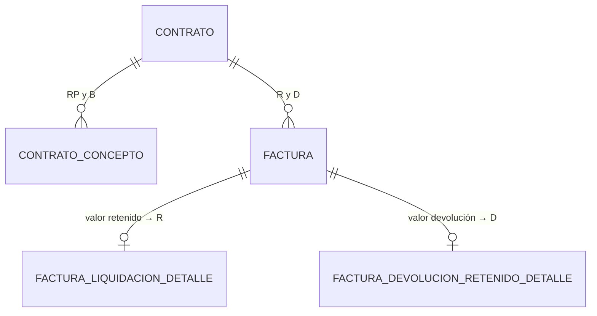

# ADR-0025: Retenido contractual y devolución de retenidos

## Estado

**Propuesto.**

El retenido contractual y su devolución **no existen** en el código ni en el esquema. Este ADR documenta la decisión arquitectónica recomendada.

## Fecha

2026-09-10 — versión inicial.

## Contexto

### Aclaración de términos

En el CORE conviven dos conceptos que el lenguaje cotidiano llama "retención" y que **no deben confundirse**:

| Término | Qué es | Dónde se documenta |
| --- | --- | --- |
| **Retenido contractual** | Parte del pago que el contratante **guarda como garantía** y **devuelve** al proveedor al liquidar. Es un recurso finito con saldo | **Este ADR** |
| **Retenciones tributarias** | Retención en la fuente, retención de IVA y retención de ICA. Son **impuestos anticipados** que se trasladan a la autoridad tributaria y **no se devuelven** al proveedor | [ADR-0026](0026-calculos-facturacion.md) |

El nombre del archivo (`0025-retenciones.md`) corresponde a la estructura que pide el alcance. Su contenido es el **retenido**.

### Ciclo del retenido

```text
PACTADO     cada concepto declara su % de retenido                     ADR-0016
     ↓
ACUMULADO   facturas de liquidación, asociadas al otrosí de            ADR-0021
            liquidación (confirmado), con el contrato EN LIQUIDACIÓN
     ↓
DEVUELTO    facturas de devolución de retenido, EN LIQUIDACIÓN          ADR-0021
     ↓
CERRADO     saldo de retenido = 0 → condición C3 de liquidación         ADR-0017
```

## Problema

1. **Sobre qué base se calcula** y si aplica a todos los conceptos.
2. **Si el porcentaje puede cambiar**, en el concepto y en la factura.
3. **Cómo se acumula y cómo se consulta el saldo.**
4. **Cómo se devuelve** sin exceder lo retenido.
5. **Concurrencia.** El escenario del alcance:

   ```text
   Retenido disponible = 5.000.000
   Usuario A devuelve 4.000.000
   Usuario B devuelve 3.000.000
   ```

6. **Correcciones.** Anular una factura de liquidación cuyo retenido ya se devolvió deja un saldo negativo.

## Estado actual

**No se encontró evidencia de implementación.**

| Pregunta del alcance (secciones 12 y 23) | Respuesta |
| --- | --- |
| ¿Sobre qué base se calcula? | No se encontró evidencia en la implementación actual |
| ¿Aplica a todos los conceptos? | No aplica |
| ¿Puede cambiar? | No aplica |
| ¿Cómo se acumula? | No aplica |
| ¿Cómo se consulta el saldo? | No aplica |
| ¿Cómo se realiza la devolución? | No aplica |
| ¿Valor máximo de devolución? ¿Puede haber varias? ¿Control de saldo? | No aplica |
| ¿Relación con la liquidación y con el estado del contrato? | No aplica |

Hechos verificados que condicionan la decisión, compartidos con [ADR-0024](0024-amortizacion-anticipo.md):

- **Ningún bloqueo de filas** en todo el backend: sin coincidencias de `FOR UPDATE`, `LOCK IN SHARE MODE`, `SET TRANSACTION` ni `ISOLATION` en `server/`.
- **Nivel de aislamiento no configurado** en el pool de `db.config.js`: rige el `REPEATABLE READ` por defecto de InnoDB.
- **Sin tratamiento de `ER_LOCK_DEADLOCK` ni `ER_LOCK_WAIT_TIMEOUT`** en `error.middleware.js`.
- **Sin librería de aritmética decimal** en cliente ni servidor.

## Decisión

1. **Magnitudes del retenido, todas calculadas y ninguna almacenada:**

   ```text
   B   Base vigente del contrato   = Σ conceptos no anulados (base antes de IVA)
   RP  Retenido pactado            = Σ conceptos no anulados (base antes de IVA × % retenido)
   R   Retenido acumulado          = Σ valor retenido de facturas LIQUIDACION APROBADA
   D   Retenido devuelto           = Σ valor de facturas DEVOLUCION_RETENIDO APROBADA

   Saldo de retenido               = R − D
   % retenido efectivo             = RP / B
   ```

2. **El saldo de retenido es único por contrato**, igual que el de anticipo y por la misma razón: el retenido se acumula en facturas asociadas al otrosí de liquidación, no a cada concepto.

3. **El retenido aplica a todos los conceptos** a través del porcentaje efectivo, que pondera el porcentaje pactado de cada uno.

4. **Base de cálculo: valor antes de IVA** —el `VALOR` de la factura de liquidación—, de la misma naturaleza que la base del retenido pactado. **Pendiente de validación**, en coherencia con [ADR-0024](0024-amortizacion-anticipo.md) y [ADR-0026](0026-calculos-facturacion.md).

5. **Invariantes del retenido:**

   | ID | Invariante | Se verifica al… | Estado |
   | --- | --- | --- | --- |
   | **I3** | `D ≤ R` | Registrar y aprobar una devolución · **anular** una factura de liquidación aprobada | Adoptada |
   | **I4** | `R ≤ RP` | Registrar y aprobar una factura de liquidación | **Pendiente de validación** |

   I4 impediría retener más de lo pactado. Se deja pendiente porque, si el negocio admite facturar por encima del valor pactado, retener sobre ese exceso podría ser correcto.

6. **En la factura de liquidación, el retenido es un movimiento y se almacena su valor:**
   - Valor por defecto: `VALOR × % retenido efectivo`.
   - El usuario puede modificarlo dentro de `0 ≤ valor ≤ VALOR de la factura` y, si se adopta I4, sin superar `RP − R`.
   - Apartarse del valor por defecto exige el permiso **`AJUSTAR RETENIDO`**. **Pendiente de validación.**
   - Se guardan, como evidencia, el porcentaje por defecto vigente al registrar y el porcentaje aplicado.

7. **La devolución de retenido:**
   - Se hace con facturas de devolución, solo con el contrato `EN LIQUIDACIÓN` ([ADR-0021](0021-facturacion-contrato-mayor.md)).
   - Valor máximo: el saldo de retenido `R − D`, verificado al registrar y, con carácter definitivo, al aprobar.
   - **Se admiten varias devoluciones** mientras quede saldo. **Pendiente de validación.**
   - Las devoluciones registradas **no reservan saldo**.

8. **Protección de concurrencia: bloqueo pesimista de la fila del contrato como primera sentencia de la transacción**, igual que el anticipo ([ADR-0027](0027-integridad-transaccional.md)).

9. **Anulaciones:**
   - Anular una **devolución** aprobada reduce `D` y siempre cumple I3.
   - Anular una **factura de liquidación** aprobada solo se admite si después se cumple I3: `R − retenido de la factura ≥ D`. Si ese retenido ya se devolvió, primero debe anularse la devolución.
   - Con el contrato `LIQUIDADO` no se anula nada sin reapertura ([ADR-0017](0017-estados-contrato.md)).

10. **Relación con la liquidación:** el contrato no se liquida mientras el saldo de retenido sea distinto de cero (condición `C3`).

11. **Los porcentajes de retenido de los conceptos quedan inmutables desde la primera factura aprobada del contrato** ([ADR-0016](0016-conceptos-contractuales.md)).

12. **El proceso de conciliación de [ADR-0024](0024-amortizacion-anticipo.md) reporta también los incumplimientos de I3 e I4.**

## Justificación

- **Mismo modelo que el anticipo**: anticipo y retenido son recursos finitos con saldo, movimientos que lo aumentan y movimientos que lo consumen. Tratarlos con mecanismos distintos duplicaría el razonamiento sobre concurrencia, anulaciones e inmutabilidad, que es la parte más difícil de acertar. La simetría es deliberada:

  | | Anticipo | Retenido |
  | --- | --- | --- |
  | Lo pactado | `A` | `RP` |
  | Lo que aumenta el saldo | Facturas de anticipo (`AF`) | Retenido de facturas de liquidación (`R`) |
  | Lo que consume el saldo | Amortización de facturas de liquidación (`AM`) | Facturas de devolución (`D`) |
  | Saldo | `AF − AM` | `R − D` |
  | Condición de liquidación | `C2` | `C3` |

- **Valor como movimiento**: por la misma razón que en el anticipo, la devolución final debe cerrar el saldo en cero exacto. Con porcentaje almacenado, el redondeo dejaría residuos que bloquearían `C3`.

- **Varias devoluciones**: devolver el retenido por partes, a medida que se liquidan facturas o se cumplen hitos de garantía, es habitual. El límite de saldo impide el exceso sin restringir la cantidad.

- **I4 pendiente y no adoptada**: adoptar un tope sin evidencia podría bloquear un caso legítimo. Dejarla sin mencionar dejaría un riesgo invisible. Declararla pendiente obliga a decidirla.

- **Separar retenido de retenciones tributarias**: ambos se restan del neto a pagar de la factura de liquidación, pero uno se devuelve y otro no. Si se modelan juntos, el sistema acabaría "devolviendo" retenciones en la fuente o calculando el saldo de retenido con impuestos dentro.

## Alternativas consideradas

### Almacenar o calcular el saldo (sección 28 del alcance)

La evaluación es la de [ADR-0024](0024-amortizacion-anticipo.md), con las mismas conclusiones: **se calcula desde facturas aprobadas**. Un contrato acumula decenas de facturas y la suma indexada por contrato no es un problema de rendimiento. Solo el dashboard justificaría una instantánea materializada, nunca usada para validar.

### Porcentaje por defecto del retenido

| | Alternativa | Evaluación |
| --- | --- | --- |
| **a** | Porcentaje del valor inicial | Ignora los otrosí con porcentaje distinto |
| **b** | **Porcentaje efectivo `RP / B`** *(seleccionada, pendiente)* | Coherente con el anticipo; coincide con el pactado cuando es uniforme |
| **c** | Porcentaje del otrosí de liquidación | Coherente con la asociación, pero no representa lo pactado en el resto del contrato |

### Tope del retenido acumulado

| | Alternativa | Evaluación |
| --- | --- | --- |
| **A** | Sin tope: se retiene lo que diga cada factura | Flexible; nada impide retener por error más de lo pactado |
| **B** | **Tope `R ≤ RP`** *(propuesta, pendiente)* | Protege al proveedor de retenciones excesivas; puede bloquear facturación legítima sobre el valor pactado |
| **C** | Tope por factura: `valor ≤ VALOR × % efectivo` | Impide ajustes al alza incluso con permiso |

### Momento de la devolución

| | Alternativa | Evaluación |
| --- | --- | --- |
| **A** | Solo después de la última factura de liquidación | Evita devolver lo que luego se vuelve a retener; exige saber cuál es la última |
| **B** | **En cualquier momento de `EN LIQUIDACIÓN`, hasta el saldo** *(seleccionada)* | Admite devoluciones parciales; el invariante I3 impide el exceso |
| **C** | También durante la ejecución | Contradice la confirmación del área usuaria: durante la ejecución no se acumula retenido |

## Modelo arquitectónico

No hay tablas propias. Las magnitudes se calculan sobre tablas de [ADR-0016](0016-conceptos-contractuales.md), [ADR-0020](0020-facturacion.md) y [ADR-0021](0021-facturacion-contrato-mayor.md), **ninguna existente hoy**:



Escenario de concurrencia del alcance:

```text
Saldo de retenido = 5.000.000

Sin protección (estado actual del backend):
  A: lee 5.000.000 → valida 4.000.000 → aprueba → COMMIT
  B: lee 5.000.000 → valida 3.000.000 → aprueba → COMMIT
  Resultado: 7.000.000 devueltos sobre 5.000.000 retenidos        ✗ I3 violado

Con la decisión:
  A: SELECT contrato FOR UPDATE            → obtiene el bloqueo
  B: SELECT contrato FOR UPDATE            → espera
  A: calcula saldo 5.000.000 · valida 4.000.000 · aprueba · COMMIT
  B: obtiene el bloqueo · calcula saldo 1.000.000
     3.000.000 > 1.000.000 → rechazo 409 "Saldo de retenido: 1.000.000"
```

Ciclo completo de ejemplo:

```text
B = 120.000.000 · % retenido pactado uniforme 5 % → RP = 6.000.000

                                                  R            D            Saldo R − D
Liquidación 1   VALOR 90.000.000 → retenido 4.500.000     4.500.000            0      4.500.000
Devolución 1                        3.000.000             4.500.000    3.000.000      1.500.000
Liquidación 2   VALOR 30.000.000 → retenido 1.500.000     6.000.000    3.000.000      3.000.000
Devolución 2    se solicitan        4.500.000   → rechazo 409: supera el saldo de 3.000.000
Devolución 2    se registran        3.000.000             6.000.000    6.000.000              0   → C3 ✓
```

## Reglas de negocio

**No se encontró evidencia en la implementación actual.** Reglas propuestas:

1. El retenido pactado es la suma, por concepto, de la base antes de IVA por el porcentaje de retenido.
2. El retenido se acumula en facturas de liquidación, solo con el contrato `EN LIQUIDACIÓN`.
3. El retenido por defecto de una factura de liquidación es su valor por el porcentaje de retenido efectivo.
4. Apartarse del valor por defecto exige permiso propio y queda auditado.
5. El retenido de una factura no supera el valor de esa factura.
6. El retenido se devuelve con facturas de devolución, solo con el contrato `EN LIQUIDACIÓN`.
7. Las devoluciones acumuladas no superan el retenido acumulado (I3).
8. Puede haber varias devoluciones mientras quede saldo.
9. Solo las facturas aprobadas afectan el saldo.
10. Las devoluciones registradas no reservan saldo.
11. Una factura de liquidación cuyo retenido ya se devolvió no puede anularse sin anular antes la devolución.
12. El contrato no se liquida mientras el saldo de retenido sea distinto de cero (condición `C3`).
13. Los porcentajes de retenido de los conceptos son inmutables desde la primera factura aprobada del contrato.

**Pendiente de validación:** el tope I4 (`R ≤ RP`); la base del retenido (antes o después de IVA); el porcentaje por defecto; si se permite ajustar el retenido y con qué permiso; si puede haber varias devoluciones o solo una; si la devolución lleva impuestos o retenciones tributarias.

## Seguridad

- **El saldo de retenido se calcula en el servidor en cada validación.** Un saldo enviado por el cliente se ignora.
- **La devolución es un pago al proveedor.** Devolver por encima del saldo es un pago indebido: la revalidación en la aprobación bajo bloqueo es obligatoria.
- **Ajustar el retenido a la baja reduce la garantía del contratante**; ajustarlo al alza retiene de más al proveedor. Ambos casos requieren permiso propio.
- **Las retenciones tributarias nunca entran en el saldo de retenido**, ni siquiera si la petición las envía en el campo de retenido.
- Hoy **ninguna ruta del backend verifica permisos** ([ADR-0014](0014-autorizacion-permisos.md)).

## Autorización

```text
CONSULTAR INFORMACIÓN FINANCIERA DEL CONTRATO
AJUSTAR RETENIDO
```

Más los permisos de facturación de [ADR-0020](0020-facturacion.md). La aprobación de una devolución usa `APROBAR FACTURA`.

**Pendiente de validación:** si la aprobación de devoluciones de retenido debe tener un permiso separado, por tratarse de un pago de garantía.

**Ninguno de estos permisos existe hoy.**

## Auditoría

**Nivel requerido: auditoría funcional.**

| Evento | Qué se registra |
| --- | --- |
| Aprobación de factura de liquidación | Retenido por defecto, retenido aplicado, porcentaje efectivo, `R` antes y después |
| **Ajuste de retenido** | Valor por defecto, valor aplicado, usuario, fecha y motivo |
| Aprobación de devolución | Valor, `R`, `D` antes y después, saldo resultante |
| Rechazo por saldo insuficiente en la aprobación | Valor solicitado y saldo vigente |
| Anulación de liquidación o devolución | Efecto sobre `R` o `D` |
| Incumplimiento detectado por la conciliación | Contrato, invariante y magnitudes |

El autor se toma de `req.user` ([ADR-0013](0013-auditoria-trazabilidad.md)).

## Validaciones

| Regla | Frontend | Backend | Base de datos | Clasificación |
| --- | --- | --- | --- | --- |
| Valor devolución > 0 | Propuesta | Propuesta | `CHECK` | Validación de interfaz |
| I3 `D ≤ R` | Aviso | **Obligatoria, al registrar, aprobar y anular liquidación, bajo bloqueo** | No expresable | **Regla de negocio** |
| I4 `R ≤ RP` | Aviso | **Pendiente de validación** | No expresable | Regla de negocio |
| Retenido ≤ VALOR de la factura | Propuesta | **Obligatoria** | `CHECK` en el detalle | Regla de negocio |
| Retenido ≥ 0 | Propuesta | Propuesta | `CHECK` | Integridad |
| Ajuste solo con permiso | Bloquea el campo | **Obligatoria** | No aplica | **Seguridad** |
| Saldo recalculado, no recibido | No aplica | **Obligatoria** | No expresable | **Seguridad** |
| Devolución solo `EN LIQUIDACIÓN` | Oculta | **Obligatoria** | No expresable | **Regla de negocio + Seguridad** |

## Integridad de datos

- Índice `(contrato, tipo, estado)` en el encabezado de factura: resuelve `R` y `D`.
- `CHECK` en el detalle de liquidación: `0 ≤ valor retenido ≤ valor`.
- `CHECK` en el detalle de devolución: `valor > 0`.
- **Decimal exacto** para importes y porcentajes, y aritmética exacta en la aplicación. No hay librería decimal en el proyecto y las columnas `DECIMAL` no deben convertirse con `parseFloat`.
- I3 e I4 no son expresables en el esquema: bloqueo, revalidación y conciliación.

## Transacciones

Rigen las operaciones de [ADR-0027](0027-integridad-transaccional.md). Específico del retenido:

```text
APROBAR DEVOLUCIÓN DE RETENIDO
BEGIN
  SELECT … FROM contrato WHERE id = ? FOR UPDATE   ← 1ª sentencia
  SELECT … FROM factura  WHERE id = ? FOR UPDATE
  verificar factura REGISTRADA · contrato EN LIQUIDACIÓN
  R ← Σ retenido de liquidaciones aprobadas
  D ← Σ devoluciones aprobadas
  si valor devolución > R − D → ROLLBACK · 409
  UPDATE factura → APROBADA
  INSERT historial · INSERT auditoría (R, D antes y después)
  evaluar C1..C8 (ADR-0017)
COMMIT
```

```text
ANULAR FACTURA DE LIQUIDACIÓN APROBADA
BEGIN
  SELECT contrato FOR UPDATE · SELECT factura FOR UPDATE
  verificar contrato distinto de LIQUIDADO
  si (R − retenido de la factura) < D → ROLLBACK · 409 "El retenido ya fue devuelto"
  UPDATE factura → ANULADA · historial · auditoría
COMMIT
```

La anulación de una factura de liquidación reduce también la amortización `AM`, lo que siempre cumple I2 ([ADR-0024](0024-amortizacion-anticipo.md)). **Ambas verificaciones ocurren en la misma transacción.**

## Concurrencia

| Escenario | Riesgo sin protección | Protección |
| --- | --- | --- |
| Dos devoluciones aprobadas a la vez (escenario del alcance) | `D > R` | Bloqueo del contrato + revalidación de I3 |
| Anulación de liquidación mientras se aprueba una devolución | `D > R` | Mismo bloqueo: se serializan |
| Dos facturas de liquidación aprobadas a la vez, con I4 adoptada | `R > RP` | Mismo bloqueo |
| Lectura previa al bloqueo | Instantánea anterior a la aprobación concurrente | Bloqueo como primera sentencia |
| Doble envío de la misma devolución | Pago de garantía duplicado | Clave de idempotencia ([ADR-0020](0020-facturacion.md)) |

## Fuente de verdad

| Dato | Almacenado | Calculado | Derivado | Configurable | Fuente de verdad |
| --- | --- | --- | --- | --- | --- |
| % retenido por concepto | **Sí** | | | | Concepto contractual |
| Retenido pactado `RP` | | **Sí** | | | Conceptos |
| % retenido efectivo | | **Sí** | | | `RP / B` |
| Valor retenido de una factura | **Sí** — movimiento | | | | Factura de liquidación |
| Retenido por defecto | | | **Sí** | | `VALOR × % efectivo` |
| Retenido acumulado `R` | | **Sí** | | | Facturas de liquidación aprobadas |
| Valor devolución | **Sí** — movimiento | | | | Factura de devolución |
| Retenido devuelto `D` | | **Sí** | | | Devoluciones aprobadas |
| Saldo de retenido | | **Sí** | | | `R − D` |
| Tope I4 | | | | **Pendiente** | — |

## Inmutabilidad

| Momento | Qué queda inmutable |
| --- | --- |
| Primera factura aprobada del contrato | Porcentajes de retenido de los conceptos existentes |
| Aprobación de factura de liquidación | Valor retenido, porcentaje por defecto y porcentaje aplicado |
| Aprobación de devolución | Su valor |
| `LIQUIDADO` | Todos los movimientos de retenido del contrato |

Un movimiento aprobado no se edita nunca. Se anula, respetando I3, y se registra de nuevo.

## Consecuencias

### Positivas

- Imposible devolver más de lo retenido, también bajo concurrencia.
- El saldo cierra en cero exacto y la condición `C3` es alcanzable.
- Simetría completa con el anticipo: un solo mecanismo para los dos recursos finitos.
- La separación con las retenciones tributarias evita mezclar garantía e impuestos.

### Negativas

- El bloqueo serializa las devoluciones y liquidaciones de un mismo contrato.
- Anular una liquidación cuyo retenido ya se devolvió exige anular antes la devolución.
- I4 queda sin decidir y, mientras tanto, nada impide retener por encima de lo pactado.
- Todo el retenido se concentra en la fase de liquidación, por la confirmación del área usuaria.

## Riesgos

| Riesgo | Severidad | Probabilidad sin la decisión | Descripción |
| --- | --- | --- | --- |
| Devolver más que lo retenido | **Crítico** | **Alta** | Sin bloqueo, dos aprobaciones concurrentes lo producen; hoy no hay ningún bloqueo |
| Confundir retenido con retenciones tributarias | **Alto** | Media | Saldos con impuestos dentro o impuestos "devueltos" |
| Anulación que deja `D > R` | **Alto** | Media | Si no se valida I3 al anular |
| Retener más de lo pactado | **Medio** | Media | Mientras I4 esté pendiente |
| Saldo que no cierra en cero | **Alto** | Alta si se almacena el porcentaje | Bloquea `C3` |
| Punto flotante en saldos | **Alto** | **Alta** | Sin librería decimal |
| Devolución duplicada por reenvío | **Alto** | Alta sin idempotencia | Pago de garantía duplicado |

## Impacto técnico

### Frontend

- Saldo de retenido en el panel financiero, servido por el backend.
- En la factura de liquidación, campo de retenido precargado y editable solo con permiso.
- En la devolución, saldo vigente visible y mensaje de rechazo con el saldo actualizado.
- Presentar el retenido **separado** de las retenciones tributarias en la composición de la factura.

### Backend

- El servicio único de saldos de [ADR-0024](0024-amortizacion-anticipo.md), ampliado con `RP`, `R` y `D`.
- Bloqueo del contrato como primera sentencia; verificación de I2 e I3 en la anulación de liquidaciones.
- Aritmética decimal exacta.

### Base de datos

- Sin tablas propias. Índice `(contrato, tipo, estado)` y `CHECK` en los detalles.

### Infraestructura

- Conciliación de I3 e I4 en el mismo proceso programado que I1 e I2. El cron está vacío y su arranque comentado en `server.js`.

## Arquitectura objetivo

| Área | Actual | Objetivo | Brecha |
| --- | --- | --- | --- |
| Retenido | No existe | Pactado por concepto, saldo único por contrato | **Alta** |
| Devolución | No existe | Varias devoluciones hasta el saldo, en liquidación | **Alta** |
| Saldos | No existen | Calculados desde movimientos | **Alta** |
| Tope de retenido | No existe | I4 pendiente | **Media** |
| Concurrencia | Ningún bloqueo | Bloqueo del contrato como primera sentencia | **Alta** |
| Terminología | No existe | Retenido separado de retenciones tributarias | **Media** |

## Brechas identificadas

| # | Brecha | Severidad |
| --- | --- | --- |
| B1 | Retenido y devolución no existen en ninguna capa | **Alta** |
| B2 | Tope I4 sin decidir | **Media** — decisión de negocio pendiente |
| B3 | Base y porcentaje por defecto del retenido sin validar | **Media** — decisión de negocio pendiente |
| B4 | Cantidad de devoluciones y su tratamiento tributario sin validar | **Media** — decisión de negocio pendiente |
| B5 | Ningún bloqueo de filas en el backend | **Alta** |
| B6 | Sin librería de aritmética decimal | **Alta** |
| B7 | Sin idempotencia en ninguna operación | **Alta** |
| B8 | Sin proceso de conciliación; cron vacío | **Media** |
| B9 | Ninguna ruta del backend verifica permisos | **Crítica** |

## Plan de implementación

Recomendación derivada del análisis. **No fue ejecutada.**

**Fase 0 — Decisiones de negocio (B2, B3, B4).**
**Fase 1 — Prerrequisitos (B9):** conceptos, facturación de contrato y autorización en backend.
**Fase 2 — Servicio de saldos (B1, B6):** ampliar el servicio de ADR-0024 con `RP`, `R` y `D`, con aritmética exacta.
**Fase 3 — Concurrencia e idempotencia (B5, B7):** bloqueo, revalidación, verificación conjunta de I2 e I3 en anulaciones y clave de idempotencia.
**Fase 4 — Conciliación (B8):** reporte de I3 e I4.

## ADR relacionados

- [ADR-0024 — Anticipo y amortización](0024-amortizacion-anticipo.md) — mecanismo simétrico
- [ADR-0021 — Facturación de contrato mayor](0021-facturacion-contrato-mayor.md) — facturas de liquidación y devolución
- [ADR-0016 — Conceptos contractuales](0016-conceptos-contractuales.md) — retenido pactado
- [ADR-0017 — Estados de contrato](0017-estados-contrato.md) — condición `C3`
- [ADR-0026 — Cálculos de facturación](0026-calculos-facturacion.md) — retenciones tributarias
- [ADR-0027 — Integridad transaccional del CORE](0027-integridad-transaccional.md)

## Referencias

- `docs/prompt_adr_core.md` — secciones 12, 22, 23, 26 y 28
- `server/src/common/configs/db.config.js` — pool sin nivel de aislamiento ni `decimalNumbers`
- `server/src/common/middlewares/error.middleware.js` — sin tratamiento de interbloqueos
- `server/package.json`, `client/package.json` — sin librería decimal
- `server/src/cron/index.js` — cron vacío
