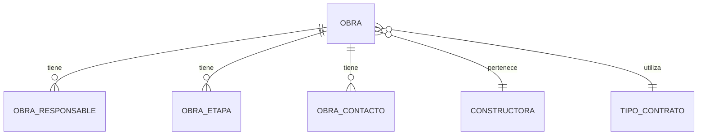

git init# Generación de ADRs — Registro y Control de Procesos Administrativos de Contratos

## 1. Rol

Actúa como **Arquitecto de Software Senior y especialista en Architecture Decision Records (ADR)**.

Tu objetivo es analizar el código fuente actual del sistema y generar una documentación arquitectónica mediante ADRs para los módulos base del proceso de:

> **Registro y Control de Procesos Administrativos de Contratos de Materiales con Proveedores, Contratistas y Subcontratistas.**

No debes asumir que la implementación actual es correcta.

Primero debes **analizar la arquitectura, frontend, backend, base de datos, relaciones, validaciones, permisos, auditoría y reglas de negocio existentes**.

Los ADR deben representar las decisiones arquitectónicas reales encontradas en el código y, cuando existan inconsistencias, documentarlas como hallazgos y proponer la decisión arquitectónica recomendada.

---

# 2. Objetivo

Generar una estructura de ADR completa, consistente y mantenible para los módulos base del sistema.

Los ADR deben permitir responder posteriormente:

* ¿Por qué se diseñó el módulo de esta manera?
* ¿Qué problema resuelve?
* ¿Qué reglas de negocio existen?
* ¿Qué alternativas fueron consideradas?
* ¿Por qué se eligió determinada solución?
* ¿Qué impacto tiene sobre frontend, backend y base de datos?
* ¿Cómo se controla la seguridad?
* ¿Cómo se controla la auditoría?
* ¿Qué acciones requieren permisos?
* ¿Qué relaciones existen entre maestros?
* ¿Qué información puede modificarse?
* ¿Qué información debe conservarse históricamente?
* ¿Qué automatizaciones existen?
* ¿Qué decisiones son reversibles y cuáles no?
* ¿Qué riesgos existen?

---

# 3. Regla fundamental: analizar antes de documentar

NO generes los ADR basándote únicamente en esta descripción funcional.

Antes de crear cualquier ADR debes analizar:

### Frontend

Identificar:

* Componentes.
* Formularios.
* Listados.
* DataTables.
* Modales.
* Rutas.
* Hooks.
* Servicios.
* Validaciones.
* Manejo de estados.
* Manejo de permisos.
* Acciones disponibles.
* Filtros.
* Relaciones entre módulos.
* Mensajes de error.
* Confirmaciones.
* Flujos de creación, edición y consulta.

### Backend

Identificar:

* Controllers.
* Routes.
* Services.
* Repositories.
* Middlewares.
* Validaciones.
* Manejo de errores.
* Autenticación.
* Autorización.
* Permisos.
* Transacciones.
* Queries.
* Procedimientos almacenados.
* Integridad referencial.
* Reglas de negocio.
* Automatizaciones.
* Auditoría.

### Base de datos

Identificar:

* Tablas.
* PK.
* FK.
* Índices.
* Constraints.
* Unique.
* Estados.
* Relaciones.
* Tablas intermedias.
* Campos de auditoría.
* Campos obligatorios.
* Campos nullable.
* Soft delete, si existe.
* Históricos.
* Triggers.
* Procedimientos.
* Funciones.
* Jobs.
* Relaciones 1:N.
* Relaciones N:M.

### Infraestructura

Identificar, si aplica:

* Servicios externos.
* Redis.
* Colas.
* almacenamiento de archivos.
* correo.
* autenticación externa.
* servicios de terceros.

---

# 4. No modificar código

Durante esta tarea:

* NO modificar código.
* NO crear migraciones.
* NO ejecutar cambios sobre la base de datos.
* NO modificar configuraciones.
* NO refactorizar.
* NO corregir bugs.
* NO implementar funcionalidades.

La tarea es exclusivamente:

> **Analizar y documentar decisiones arquitectónicas.**

Si encuentras problemas, documentarlos como hallazgos y recomendaciones dentro del ADR.

---

# 5. Módulos que deben documentarse

Generar un ADR independiente para cada uno de los siguientes módulos.

## ADR 0001 — Seguridad

Incluye:

### Login

Analizar:

* Autenticación.
* Manejo de sesión.
* Tokens.
* Expiración.
* Refresh token si existe.
* Manejo de credenciales.
* Protección contra intentos fallidos.
* Logout.
* Manejo de sesión concurrente.

### Recuperación

Analizar:

* Solicitud de recuperación.
* Validación de identidad.
* Token o mecanismo utilizado.
* Expiración.
* Uso único.
* Protección contra enumeración de usuarios.

### Restauración con OTP previo

Analizar:

* Generación del OTP.
* Expiración.
* Cantidad de intentos.
* Reutilización.
* Validación.
* Bloqueo.
* Protección contra fuerza bruta.

### Registro de usuarios

Analizar:

* Creación.
* Validación.
* Roles.
* Permisos.
* Estado.
* Activación/desactivación.
* Auditoría.

Documentar también la diferencia entre:

* autenticación
* autorización
* roles
* permisos

---

# 6. ADR 0002 — Dashboard

Documentar la arquitectura del dashboard.

Debe analizar:

## Costo de obra ejecutado por tipo de factura

Determinar:

* Fuente de información.
* Relaciones.
* Cálculo.
* Agrupaciones.
* Filtros.
* Periodos.
* Estados considerados.
* Cómo se evita duplicar valores.

## Estado de costos

Determinar:

* Qué representa.
* Fuente de datos.
* Fórmulas.
* Estados.
* Relaciones.

## Pólizas

Documentar los estados:

* Vencidas.
* A vencer.
* Vigentes.
* Sin fecha de vigencia.
* Contratos sin póliza.

Analizar:

* Cómo se calcula cada estado.
* Fecha utilizada.
* Fecha actual utilizada por backend o frontend.
* Qué sucede con fechas nulas.
* Qué sucede con pólizas múltiples.
* Qué sucede con contratos sin póliza.

Documentar además que al seleccionar un estado del dashboard se filtra el listado correspondiente.

Determinar si el filtrado ocurre:

* frontend
* backend
* base de datos

y justificar la decisión.

---

# 7. ADR 0003 — Aseguradoras

Maestro:

* Descripción.
* Estado.

Analizar:

* Unicidad.
* Activación/desactivación.
* Relaciones con pólizas.
* Restricciones para eliminar.
* Auditoría.
* Permisos.
* Impacto sobre contratos existentes.

Determinar si corresponde:

* eliminar físicamente
* desactivar
* mantener histórico

y justificar.

---

# 8. ADR 0004 — Constructoras

Maestro:

* Descripción.
* Estado.

Analizar:

* Unicidad.
* Relación con obras.
* Estado.
* Eliminación/desactivación.
* Auditoría.
* Permisos.

Documentar las reglas que impiden eliminar una constructora cuando existen obras relacionadas, si actualmente existen.

---

# 9. ADR 0005 — Estados de contrato

Estados funcionales:

* Ejecución.
* En liquidación.
* Liquidado.
* Suspendido.

Debe diferenciar:

### Estados automáticos

* En liquidación.
* Liquidado.

### Estado manual

* Suspendido.

Analizar:

* Qué evento genera cada transición.
* Qué proceso calcula los estados.
* Qué usuario puede modificar manualmente un estado.
* Si existen transiciones inválidas.
* Si existe máquina de estados.
* Si existe historial.
* Qué sucede con documentos relacionados.
* Qué sucede con pólizas.
* Qué sucede con órdenes de servicio.
* Qué sucede con facturas.

Documentar las reglas de transición.

Si existe una máquina de estados implícita, identificarla.

---

# 10. ADR 0006 — Tipos de contrato

Campos:

* Nombre.
* Configuración.

La configuración permite definir cuáles campos disponibles de un contrato aplican para determinado tipo de contrato.

Analizar:

* Cómo se almacenan los campos configurables.
* Cómo se determina si un campo es obligatorio.
* Cómo se determina si un campo es visible.
* Cómo se determina si un campo aplica.
* Cómo consume esta configuración el formulario de contrato.
* Qué ocurre cuando se modifica la configuración de un tipo ya utilizado.
* Impacto sobre contratos existentes.

Especial atención a la diferencia entre:

> configuración del tipo de contrato

y

> información de una instancia específica del contrato.

Documentar esta separación arquitectónica.

---

# 11. ADR 0007 — Tipo de interventoría

Campos:

* Nombre.
* Estado.

Analizar:

* Unicidad.
* Estado.
* Relaciones.
* Auditoría.
* Permisos.
* Uso dentro de obras/contratos.

---

# 12. ADR 0008 — Tipo de identificación

Campos:

* Nombre.
* Estado.

Analizar:

* Tipos permitidos.
* Unicidad.
* Uso en proveedores.
* Validación de documentos.
* Estado.
* Auditoría.
* Permisos.

Documentar claramente que el tipo de identificación es un maestro y no debe contener información específica de una persona/proveedor.

---

# 13. ADR 0009 — Tipo de dirección

Campos:

* Nombre.
* Estado.

Analizar:

* Tipos de dirección.
* Uso en contactos.
* Relaciones.
* Estado.
* Auditoría.
* Permisos.

---

# 14. ADR 0010 — Tipo de proveedor

Tipos funcionales:

* Simple.
* Subcontratista.
* Contrato mayor.

Analizar:

* Reglas de cada tipo.
* Diferencias funcionales.
* Impacto en contratos.
* Impacto en obras.
* Impacto en proveedores.
* Validaciones.
* Relaciones.

Determinar si estos tipos representan:

* clasificación
* comportamiento
* jerarquía
* tipo contractual

y documentar la decisión correcta según el código existente.

---

# 15. ADR 0011 — Obras

Este es uno de los ADR más importantes.

Una obra contiene:

* Código.
* Nombre.
* Constructora.
* Tipo de contrato.
* Área total.
* Costo directo.
* Plazo inicial.
* Plazo ampliado.
* Valor inicial.
* Valor ampliado.
* Valor máximo de orden de servicio.

Además:

## Responsables

Debe soportar:

* responsable existente
* nuevo responsable

y:

* 1..N responsables.

Analizar:

* Modelo de relación.
* Tabla intermedia.
* Roles.
* Estado.
* Auditoría.
* Permisos.

## Etapas

Una obra puede tener múltiples etapas:

* Nombre.
* Estado.

Analizar:

* Relación obra-etapa.
* Cardinalidad.
* Estado.
* Orden.
* Historial.
* Auditoría.

## Contactos

Una obra puede tener múltiples registros de contacto:

* Tipo de dirección.
* Dirección.
* Teléfono.
* Celular.
* Fax.
* Email.
* Observaciones.

Analizar:

* Modelo.
* Cardinalidad.
* Validaciones.
* Contacto principal, si existe.
* Auditoría.

Documentar todas las relaciones de la obra.

---

# 16. ADR 0012 — Proveedores

Este ADR debe analizar especialmente la arquitectura de reutilización de proveedores.

Campos:

* Nombre.
* Tipo de identificación.
* Documento.
* Email.
* Estado.
* Tipo de servicio.
* Observación.
* Tipo de proveedor.

Además:

### Información de contacto de la obra

* Tipo de dirección.
* Dirección.
* Teléfono.
* Celular.
* Fax.
* Email.
* Observaciones.

Puede existir uno o múltiples registros.

---

# 17. Regla crítica de proveedores

Existe una decisión funcional importante:

> El proveedor debe evitar duplicarse.

La regla de existencia debe determinarse mediante:

> **NIT/documento de identificación**

Analizar en código y base de datos:

* si existe constraint UNIQUE
* si la validación está solamente en frontend
* si existe validación backend
* si existe validación transaccional
* si existe condición de carrera
* qué sucede si dos usuarios intentan crear simultáneamente el mismo proveedor

La arquitectura recomendada debe garantizar la integridad desde backend/base de datos, no únicamente desde frontend.

---

# 18. Proveedor y obra

El proveedor creado desde una obra se relaciona con esa obra.

Sin embargo, el proveedor debe poder ser reutilizado por otras obras.

El sistema debe permitir:

### Agregar proveedor existente

Seleccionar un proveedor previamente registrado.

### Crear proveedor nuevo

Registrar un nuevo proveedor siempre que no exista otro con el mismo NIT/documento.

Analizar y documentar correctamente la diferencia entre:

```text
PROVEEDOR
    │
    └── entidad maestra
```

y

```text
PROVEEDOR ↔ OBRA
```

como relación de asignación/utilización.

No asumir que la información propia del proveedor debe duplicarse por cada obra.

Determinar qué información pertenece al proveedor y cuál pertenece a la relación proveedor-obra.

---

# 19. ADR 0013 — Auditoría y trazabilidad

Este ADR es transversal a todos los módulos.

Todos los módulos deben contemplar campos de auditoría.

Analizar los campos existentes y documentar:

* created_at
* created_by
* updated_at
* updated_by
* deleted_at
* deleted_by

o los equivalentes realmente utilizados.

NO asumir estos nombres si el sistema utiliza otros.

Determinar:

* quién creó.
* quién modificó.
* cuándo creó.
* cuándo modificó.
* quién eliminó/desactivó.
* cuándo eliminó/desactivó.

Analizar si existe:

* auditoría de cambios.
* historial.
* bitácora.
* logs.
* trazabilidad de estados.

Diferenciar claramente:

### Auditoría técnica

Quién creó/modificó el registro.

### Auditoría funcional

Qué cambio realizó el usuario.

Ejemplo:

```text
Proveedor 105
Campo: estado
Anterior: Activo
Nuevo: Inactivo
Usuario: X
Fecha: YYYY-MM-DD HH:mm:ss
```

Determinar qué nivel existe actualmente y cuál debería utilizarse para información crítica.

---

# 20. ADR 0014 — Autorización basada en permisos

Este ADR debe documentar el modelo de autorización transversal.

Cada módulo debe estar controlado por permisos según el usuario.

Analizar el código actual para determinar cómo se implementan:

* permisos.
* roles.
* acciones.
* módulos.
* recursos.
* endpoints.
* botones.
* rutas.

Como mínimo analizar acciones:

```text
CONSULTAR
CREAR
EDITAR
ELIMINAR
ACTIVAR
DESACTIVAR
EXPORTAR
```

No asumir que todas existen.

Identificar las acciones realmente disponibles.

---

# 21. Regla de seguridad

La autorización NO debe depender únicamente del frontend.

Debe existir control en backend.

Ejemplo conceptual:

```text
Frontend
    ↓
Oculta/deshabilita acción
    ↓
Backend
    ↓
Valida permiso
    ↓
Ejecuta operación
```

Documentar que:

> El frontend proporciona control de experiencia de usuario, pero el backend es la autoridad definitiva para autorizar operaciones.

Analizar también:

* acceso directo a endpoint.
* manipulación de requests.
* escalamiento horizontal de privilegios.
* permisos por módulo.
* permisos por acción.

---

# 22. Auditoría + permisos

Analizar conjuntamente:

```text
Usuario
   │
   ├── Rol
   │     │
   │     └── Permisos
   │
   └── Acción
          │
          ↓
       Backend
          │
          ├── ¿Tiene permiso?
          │
          ├── Ejecuta operación
          │
          └── Registra auditoría
```

Determinar si este patrón existe actualmente.

Si no existe, documentar la arquitectura recomendada como propuesta.

---

# 23. Reglas de integridad

Para cada ADR identificar:

### Validaciones frontend

¿Qué valida el cliente?

### Validaciones backend

¿Qué valida el servidor?

### Integridad de base de datos

¿Qué garantiza la BD?

Clasificar las validaciones:

```text
UX
Regla de negocio
Seguridad
Integridad
```

No considerar una validación de frontend como mecanismo suficiente de integridad.

---

# 24. Transacciones

Para operaciones que involucren múltiples tablas, analizar si se utiliza transacción.

Ejemplo:

```text
Crear obra
    ↓
Crear responsables
    ↓
Crear etapas
    ↓
Crear contactos
```

Determinar qué sucede si:

```text
Obra       → OK
Responsable → OK
Etapa      → ERROR
Contacto   → NO EJECUTADO
```

Documentar si debe existir atomicidad.

---

# 25. Relaciones

Cada ADR debe incluir una sección:

## Modelo conceptual

Utilizar diagramas Mermaid cuando sea útil.

Ejemplo:



No inventar tablas.

Los nombres deben corresponder al código/base de datos existente.

---

# 26. Alternativas

Cada ADR debe incluir como mínimo:

```text
Alternativa A
Alternativa B
Alternativa C
Decisión seleccionada
```

Cuando solamente exista una alternativa realista, explicarlo.

No crear alternativas ficticias únicamente para llenar la sección.

---

# 27. Consecuencias

Separar:

### Positivas

* ...

### Negativas

* ...

### Riesgos

* ...

### Impacto futuro

* ...

---

# 28. Decisiones existentes vs decisiones recomendadas

Esta distinción es OBLIGATORIA.

Cuando encuentres una implementación existente:

```text
Estado actual:
[qué hace actualmente el sistema]
```

Luego:

```text
Decisión arquitectónica:
[qué decisión se considera válida]
```

Y si hay diferencia:

```text
Brecha:
[qué debería cambiar]
```

No ocultar inconsistencias.

---

# 29. No inventar información

Si no encuentras evidencia en el código:

NO afirmar:

> "La aplicación utiliza Redis."

Debes escribir:

> "No se encontró evidencia de utilización de Redis en el flujo analizado."

Si algo no puede determinarse:

```text
Estado: Pendiente de validación
```

Esto es fundamental.

---

# 30. README principal

Crear:

```text
docs/adr/README.md
```

Debe contener:

* Objetivo de los ADR.
* Convención de numeración.
* Estados posibles.
* Cómo crear un nuevo ADR.
* Índice de ADR.
* Relación entre ADR.
* ADR transversales.
* Reglas para modificar/reemplazar ADR.

Incluir una tabla:

| ID   | ADR          | Módulo        | Estado |
| ---- | ------------ | ------------- | ------ |
| 0001 | Seguridad    | Seguridad     | ...    |
| 0002 | Dashboard    | Dashboard     | ...    |
| 0003 | Aseguradoras | Configuración | ...    |
| ...  | ...          | ...           | ...    |
| 0013 | Auditoría    | Transversal   | ...    |
| 0014 | Autorización | Transversal   | ...    |

---

# 31. Relación entre ADR

Identificar dependencias.

Por ejemplo:

```text
ADR-0014 Autorización
        │
        ├── ADR-0001 Seguridad
        ├── ADR-0003 Aseguradoras
        ├── ADR-0004 Constructoras
        ├── ADR-0011 Obras
        └── ADR-0012 Proveedores

ADR-0013 Auditoría
        │
        ├── Todos los maestros
        ├── Obras
        └── Proveedores
```

Cuando corresponda, incluir una sección:

```text
## ADR relacionados

- ADR-0013 — Auditoría y trazabilidad
- ADR-0014 — Autorización basada en permisos
```

---

# 32. Formato obligatorio de cada ADR

Todos los ADR deben utilizar esta estructura:

```markdown
# ADR-XXXX: [Título]

## Estado

## Fecha

## Contexto

## Problema

## Estado actual

## Decisión

## Justificación

## Alternativas consideradas

### Alternativa 1

### Alternativa 2

### Alternativa 3

## Modelo arquitectónico

## Reglas de negocio

## Seguridad

## Autorización

## Auditoría

## Validaciones

## Integridad de datos

## Transacciones

## Consecuencias

### Positivas

### Negativas

## Riesgos

## Impacto técnico

### Frontend

### Backend

### Base de datos

### Infraestructura

## Estado actual vs arquitectura objetivo

## Brechas identificadas

## Plan de implementación

## ADR relacionados

## Referencias
```

No todas las secciones deben tener contenido artificial.

Si una sección no aplica:

```text
No aplica.
```

o:

```text
No se encontró evidencia en la implementación actual.
```

---

# 33. Nivel de detalle

Los ADR deben ser suficientemente detallados para servir como referencia arquitectónica, pero NO convertirse en documentación de código.

No incluir:

* código fuente extenso.
* archivos completos.
* componentes completos.
* queries completas salvo que sean necesarias para explicar una decisión.
* instrucciones paso a paso de implementación.

Sí incluir:

* decisiones.
* relaciones.
* reglas.
* restricciones.
* patrones.
* diagramas.
* consecuencias.
* riesgos.

---

# 34. Resultado esperado

Crear físicamente:

```text
docs/
└── adr/
    ├── README.md
    ├── 0001-seguridad.md
    ├── 0002-dashboard.md
    ├── 0003-aseguradoras.md
    ├── 0004-constructoras.md
    ├── 0005-estados-contrato.md
    ├── 0006-tipos-contrato.md
    ├── 0007-tipos-interventoria.md
    ├── 0008-tipos-identificacion.md
    ├── 0009-tipos-direccion.md
    ├── 0010-tipos-proveedor.md
    ├── 0011-obras.md
    ├── 0012-proveedores.md
    ├── 0013-auditoria-trazabilidad.md
    └── 0014-autorizacion-permisos.md
```

---

# 35. Proceso que debes seguir

Ejecuta el análisis en este orden:

### Fase 1 — Descubrimiento

Analizar estructura del proyecto.

Identificar:

* frontend
* backend
* base de datos
* autenticación
* autorización
* auditoría

### Fase 2 — Análisis por módulo

Para cada módulo:

```text
UI
 ↓
API
 ↓
Reglas de negocio
 ↓
Persistencia
 ↓
Auditoría
 ↓
Permisos
```

### Fase 3 — Relaciones

Identificar dependencias entre maestros.

Especialmente:

```text
Aseguradora
Constructoras
Tipo contrato
Tipo interventoría
Tipo identificación
Tipo dirección
Tipo proveedor
       ↓
      Obras
       ↓
   Proveedores
       ↓
Contratos / procesos
```

No asumir que este diagrama corresponde exactamente a la BD. Validarlo.

### Fase 4 — Identificar decisiones

Separar:

* decisiones existentes.
* decisiones implícitas.
* decisiones faltantes.
* decisiones inconsistentes.

### Fase 5 — Generar ADR

Crear los archivos.

### Fase 6 — Revisión

Verificar que:

* No existan contradicciones entre ADR.
* No se hayan inventado tablas.
* No se hayan inventado permisos.
* No se hayan inventado reglas.
* Las relaciones sean consistentes.
* Los nombres coincidan con el código.
* Las decisiones transversales sean reutilizables.

---

# 36. Resultado final que debes presentar

Al terminar, entregar:

## 1. Resumen arquitectónico

Explicar brevemente la arquitectura encontrada.

## 2. Mapa de módulos

```text
Seguridad
    ↓
Configuración
    ↓
Obras
    ↓
Proveedores
    ↓
Contratos
    ↓
Dashboard
```

Ajustarlo según lo encontrado realmente.

## 3. Índice de ADR

Mostrar todos los ADR generados.

## 4. Hallazgos

Clasificar:

```text
Crítico
Alto
Medio
Bajo
```

## 5. Decisiones recomendadas

Separar las decisiones que requieren cambios futuros.

## 6. Riesgos arquitectónicos

Identificar riesgos relacionados con:

* seguridad
* duplicidad
* integridad
* concurrencia
* auditoría
* permisos
* escalabilidad
* mantenibilidad

## 7. Brechas

Crear una tabla:

| Módulo | Situación actual | Situación objetivo | Brecha | Prioridad |
| ------ | ---------------- | ------------------ | ------ | --------- |

---

# 37. Criterio de calidad

Antes de finalizar, revisa cada ADR utilizando estas preguntas:

* ¿Existe un problema claramente definido?
* ¿La decisión es concreta?
* ¿Está justificada?
* ¿Se evaluaron alternativas?
* ¿Se documentaron consecuencias?
* ¿Se documentaron riesgos?
* ¿Se documentó seguridad?
* ¿Se documentaron permisos?
* ¿Se documentó auditoría?
* ¿Se documentó integridad de datos?
* ¿Se documentaron relaciones?
* ¿Se identificó el impacto frontend/backend/BD?
* ¿Se diferenciaron hechos actuales de decisiones recomendadas?
* ¿Se evitó inventar información?
* ¿El ADR puede ser entendido por otro desarrollador sin hablar con el autor?

Si alguna respuesta es "No", revisar el ADR antes de finalizar.

---

# 38. Regla arquitectónica transversal

Considerar como principio del sistema:

> **Toda operación de negocio debe ser validada en backend, autorizada mediante permisos y registrada mediante mecanismos de auditoría definidos para el nivel de trazabilidad requerido.**

El frontend puede controlar visibilidad y experiencia de usuario, pero **no debe considerarse una frontera de seguridad**.

La base de datos debe garantizar las reglas de integridad que sean necesarias para evitar inconsistencias, duplicidades y condiciones de carrera.

---

# 39. Importante sobre proveedores

Prestar especial atención a esta decisión:

> Un proveedor es una entidad reutilizable entre diferentes obras.

Por lo tanto, analizar si la arquitectura actual separa correctamente:

```text
PROVEEDOR
    │
    ├── Identidad
    ├── NIT/documento
    ├── Tipo proveedor
    ├── Estado
    ├── Email
    └── Información propia
```

de:

```text
PROVEEDOR_OBRA
    │
    ├── proveedor
    ├── obra
    ├── información específica de la relación
    └── estado/metadata de la asignación
```

No duplicar un proveedor por cada obra.

La validación de existencia debe estar respaldada por una restricción de integridad apropiada, especialmente para NIT/documento, si funcionalmente corresponde a una clave única.

---

# 40. Importante sobre campos de auditoría

No asumir que todos los módulos utilizan exactamente los mismos campos.

Primero identificar el estándar existente.

Posteriormente determinar si debe existir un estándar transversal.

La decisión objetivo debe buscar:

> **Consistencia de auditoría en todos los módulos.**

---

# 41. Importante sobre permisos

No limitar el análisis a:

```text
ver
crear
editar
eliminar
```

Identificar las acciones reales del sistema.

Por ejemplo:

```text
Consultar
Crear
Editar
Eliminar
Activar
Desactivar
Cambiar estado
Asignar
Desasignar
Exportar
Configurar
Autorizar
```

Solo incluir aquellas que realmente existan o sean necesarias según el análisis.

---

# 42. No implementar

Una vez finalizado el análisis y creados los ADR:

**DETENTE.**

No implementes ninguna recomendación.

No modifiques código.

No modifiques BD.

No ejecutes migraciones.

No agregues permisos.

No agregues campos.

No realices refactor.

El resultado de esta tarea debe ser exclusivamente:

> **Análisis arquitectónico + ADR + hallazgos + brechas + recomendaciones.**
