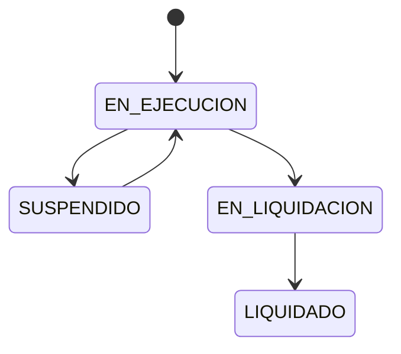
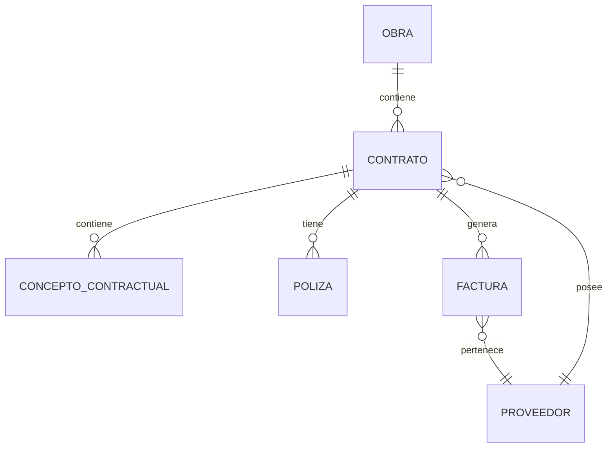

# Generación de ADRs — CORE del sistema de Contratos y Facturación

## 1. Rol

Actúa como:

* Arquitecto de Software Senior.
* Arquitecto de soluciones.
* Especialista en sistemas transaccionales financieros.
* Especialista en Architecture Decision Records (ADR).
* Especialista en integridad de datos, trazabilidad y reglas de negocio.

Debes analizar el código fuente actual del sistema y documentar mediante ADR las decisiones arquitectónicas relacionadas con el **CORE de Contratos, Pólizas y Facturación**.

El sistema corresponde al:

> Registro y Control de Procesos Administrativos de Contratos de Materiales con Proveedores, Contratistas y Subcontratistas.

---

# 2. Objetivo

Generar una carpeta de ADR independiente para los procesos core:

1. Contratos.
2. Conceptos contractuales.
3. Estados y transición de contratos.
4. Pólizas.
5. Tipos de póliza.
6. Facturación.
7. Facturación de contratos mayores.
8. Facturación de subcontratistas.
9. Facturación simple.
10. Anticipos y amortización.
11. Retenciones y devolución de retenidos.
12. Cálculo y composición de valores de factura.
13. Integridad transaccional del CORE.

Sin embargo:

> **NO asumir que necesariamente deben existir 13 ADR.**

Primero analizar el código y determinar qué decisiones son independientes y cuáles deben agruparse.

---

# 3. Regla principal

NO documentar únicamente la funcionalidad descrita.

Primero analizar:

```text
Frontend
    ↓
API
    ↓
Backend
    ↓
Reglas de negocio
    ↓
Base de datos
    ↓
Procesos automáticos
    ↓
Auditoría
    ↓
Permisos
```

El ADR debe representar:

> **La arquitectura actual, las decisiones implícitas existentes, las decisiones recomendadas y las brechas encontradas.**

No inventar información.

---

# 4. No modificar código

Durante esta tarea:

* NO modificar código.
* NO crear migraciones.
* NO alterar base de datos.
* NO ejecutar cambios.
* NO implementar nuevas funcionalidades.
* NO refactorizar.

La tarea es:

> Analizar + documentar + identificar brechas + proponer decisiones arquitectónicas.

---

# 5. Contexto funcional del CORE

El proceso principal del sistema es:

```text
OBRA
  │
  ├── PROVEEDORES
  │
  └── CONTRATOS
          │
          ├── Concepto principal
          │
          ├── Otrosí
          │
          ├── Otrosí de liquidación
          │
          ├── Pólizas
          │
          └── Facturación
                   │
                   ├── Anticipo
                   ├── Facturación
                   ├── Liquidación
                   └── Devolución retenido
```

Analizar si este modelo realmente corresponde a la implementación.

---

# 6. ADR — CONTRATOS

Analizar el proceso de creación y administración de contratos.

Un contrato pertenece a:

* Una obra.
* Un proveedor.
* Una etapa de la obra.
* Un tipo de contrato.

Datos base:

* Nombre.
* Número de contrato.
* Plazo.
* Unidad del plazo.
* Frecuencia:

  * días
  * meses
  * años
* Fecha inicio.
* Fecha fin.
* Fecha de vencimiento.
* Estado.
* Proveedor.
* Etapa.
* Tipo de contrato.

---

# 7. Plazo contractual

Analizar especialmente:

```text
Plazo
Unidad
Frecuencia
Fecha inicio
Fecha fin
Fecha vencimiento
```

Determinar:

* Cómo se calcula la fecha final.
* Si el cálculo se realiza en frontend o backend.
* Si se almacena fecha fin o se calcula.
* Qué sucede al modificar el plazo.
* Qué sucede cuando existe un otrosí.
* Qué sucede cuando el contrato está suspendido.
* Cómo se calcula la fecha de vencimiento.

Documentar cualquier diferencia entre:

> fecha fin contractual

y

> fecha de vencimiento.

Si son conceptualmente iguales en el sistema, documentar la decisión.

Si son conceptos diferentes, explicar la diferencia.

---

# 8. Estados del contrato

Estados:

```text
EN EJECUCIÓN
EN LIQUIDACIÓN
LIQUIDADO
SUSPENDIDO
```

Analizar la máquina de estados.

## En ejecución

Estado inicial del contrato.

## En liquidación

Debe generarse cuando:

> Se crea el otrosí de liquidación.

## Liquidado

Debe generarse cuando:

> El proceso de facturación ha completado las condiciones necesarias de liquidación.

## Suspendido

Estado manual.

Debe solicitar:

* Motivo.
* Fecha de suspensión.
* Fecha de levantamiento si existe.
* Observación.
* Condición para levantar suspensión.
* Si genera informe de interventoría.

Analizar:

* Quién puede cambiar cada estado.
* Qué permisos requiere.
* Qué transiciones son válidas.
* Qué transiciones son inválidas.
* Si existe historial de estados.
* Si el cambio es automático o manual.
* Qué eventos disparan cambios.

Crear diagrama Mermaid si es útil.

Ejemplo conceptual:



NO asumir que este diagrama es definitivo.

Validarlo contra el código.

---

# 9.  Conceptos contractuales — Información del valor del contrato

El contrato contiene un subnivel funcional denominado:

> **Información del valor del contrato**

Este subnivel representa la composición económica del contrato.

NO tratarlo como simples campos del encabezado del contrato.

Debe analizarse como una colección de conceptos económicos pertenecientes al contrato.

La estructura funcional es:

```text
CONTRATO
    │
    └── Información del valor del contrato
            │
            ├── VALOR INICIAL
            │
            ├── OTROSÍ 1
            │
            ├── OTROSÍ 2
            │
            ├── OTROSÍ N
            │
            └── OTROSÍ LIQUIDACIÓN

En la creación:

* Tipo: VALOR INICIAL.
* Fecha inicio.
* Costo directo.
* AIU.
* IVA.
* Anticipo.
* Retenido.

## Otrosí

Debe permitir:

* Prórroga.
* Extensión de fechas.
* Número de otrosí automático.
* Fecha inicio.
* Costo directo.
* AIU.
* IVA.
* Anticipo.
* Retenido.

## Otrosí de liquidación

Debe permitir:

* Fecha inicio.
* Costo directo.
* AIU.
* IVA.
* Anticipo.
* Retenido.

Analizar:

* Cómo se identifican.
* Cómo se numeran.
* Cómo se relacionan con el contrato.
* Si existe una tabla común.
* Si existen tablas separadas.
* Si se permite más de un otrosí.
* Si existe orden cronológico.
* Cómo afectan el valor total del contrato.

Cardinalidad

Debe cumplirse:

Exactamente un VALOR INICIAL.
Cero o múltiples OTROSÍ.
Como máximo un OTROSÍ LIQUIDACIÓN.

VALOR INICIAL       = 1
OTROSÍ              = 0..N
OTROSÍ LIQUIDACIÓN  = 0..1

---

# 10. AIU

Existe una regla especial:

> Si el tipo de contrato es "mayor", debe solicitar AIU.

Pero debe existir la posibilidad de:

> apagar/desactivar la solicitud de AIU.

Analizar:

* Dónde está configurada esta regla.
* Si depende del tipo de contrato.
* Si puede modificarse por contrato.
* Qué porcentaje se almacena.
* Cómo afecta el cálculo.
* Cómo afecta facturación.
* Cómo afecta pólizas.

Documentar claramente:

```text
Configuración
      ↓
Tipo de contrato
      ↓
Contrato
      ↓
AIU
      ↓
Facturación
```

Determinar dónde debe vivir la regla de negocio.

---

# 11. Anticipo contractual

El contrato puede definir:

* Valor anticipo.
* Porcentaje de anticipo.

Existe una regla crítica:

> El porcentaje de anticipo definido en el contrato determina el porcentaje que debe amortizarse en las facturas correspondientes.

Analizar:

* Dónde se almacena.
* Si se guarda porcentaje y valor.
* Cómo se calcula el valor.
* Cómo se controla el saldo pendiente.
* Cómo se calcula lo amortizado.
* Qué ocurre cuando existen varios conceptos contractuales.
* Qué ocurre con otrosíes.
* Cómo se actualiza el saldo.

---

# 12. Retenido contractual

El contrato puede definir:

> porcentaje de retenido.

Analizar:

* Sobre qué base se calcula.
* Si aplica a todos los conceptos.
* Si puede cambiar.
* Cómo se acumula.
* Cómo se consulta el saldo.
* Cómo se realiza la devolución.
* Cómo afecta liquidación.

---

# 13. Pólizas

Analizar la sección de pólizas del contrato.

Campos:

* Fecha de vigencia.
* Tipo de póliza.
* Porcentaje del contrato.
* Concepto sobre el cual aplica.
* Observación.
* Aseguradora.

El concepto puede ser:

```text
VALOR INICIAL
OTROSÍ
OTROSÍ LIQUIDACIÓN
```

Analizar:

* Cómo se relaciona una póliza con el contrato.
* Si puede haber múltiples pólizas.
* Si una póliza aplica a un único concepto.
* Si puede cambiarse.
* Si existe histórico.
* Si puede eliminarse.
* Si se debe conservar evidencia histórica.

---

# 14. Base de cálculo de pólizas

Existe una decisión funcional importante:

> Determinar si la póliza se calcula sobre el valor antes de IVA o sobre el valor total con IVA.

NO asumir la respuesta.

Analizar:

* Código actual.
* Base de datos.
* Fórmulas.
* Configuración.
* Reglas existentes.

Si actualmente no está definido:

> Documentar como decisión pendiente.

Proponer alternativas:

```text
A. Base antes de IVA
B. Base incluido IVA
C. Configurable por tipo de póliza
```

Evaluar ventajas y riesgos de cada alternativa.

---

# 15. Tipos de póliza

Maestro:

* Nombre.
* Aplica sobre subtotal o IVA.

Analizar si la configuración:

```text
SUBTOTAL
IVA
```

es suficiente para representar las reglas actuales.

Determinar si realmente significa:

* subtotal antes de IVA
* valor total
* IVA
* otra base

No cambiar la semántica sin evidencia.

---

# 16. FACTURACIÓN

La facturación tiene tres grandes comportamientos:

```text
FACTURACIÓN
│
├── SIMPLE
├── CONTRATO MAYOR
└── SUBCONTRATISTA
```

Analizar si realmente son:

* tres entidades diferentes
* una entidad con tipos
* una entidad común con diferentes detalles
* una estrategia híbrida

Documentar la decisión arquitectónica.

---

# 17. Facturación simple

Una factura simple:

> No selecciona contrato.

Debe seleccionar:

* Proveedor.

Información general:

* Número de factura.
* Fecha factura.
* Fecha aprobación.
* Número de comprobante.
* Extracto.
* Etapa.
* Valor.
* Retención en la fuente.
* Descuento AI.
* % IVA.
* Retención IVA.
* Retención ICA.
* Flete.
* Descuento pronto pago.
* Observación.

Analizar qué campos son:

* datos ingresados.
* datos calculados.
* datos derivados.
* datos de configuración.

---

# 18. Composición económica de factura simple

Documentar:

```text
VALOR
RTE FUENTE
DCTO AI
SUBTOTAL
IVA
RTE IVA
RTE ICA
FLETE
DCTO PRONTO PAGO
TOTAL
```

Determinar las fórmulas reales.

No inventar fórmulas.

Si las fórmulas están distribuidas entre frontend/backend, documentar esa situación.

Determinar cuál debe ser la fuente de verdad para el cálculo.

---

# 19. Facturación de contrato mayor / subcontratista

Al seleccionar:

```text
Proveedor
Contrato
```

el sistema muestra información contractual:

* Anticipo.
* Retenido.
* Amortizado.
* Pendiente por amortizar.

Analizar:

```text
Contrato
    ↓
Estado financiero
    ├── Anticipo
    ├── Retenido
    ├── Amortizado
    └── Pendiente
```

Determinar si estos valores:

* se almacenan
* se calculan
* se agregan desde facturas
* utilizan tablas auxiliares

Documentar la fuente de verdad.

---

# 20. Tipos de factura de contrato

Existen:

```text
Factura de anticipo
Factura de liquidación
Factura de devolución de retenido
```

Analizar si:

* son tipos de una misma entidad.
* tienen estructuras diferentes.
* comparten encabezado.
* comparten auditoría.
* comparten permisos.
* comparten ciclo de vida.

---

# 21. Factura de anticipo

Campos:

* Número factura.
* Fecha factura.
* Fecha aprobación.
* Número comprobante.
* Extracto.
* Valor anticipo.
* Descripción.

Analizar:

* Validación contra anticipo contractual.
* Si puede existir más de una factura de anticipo.
* Valor máximo permitido.
* Relación con saldo pendiente.
* Qué ocurre cuando ya se consumió el anticipo.

---

# 22. Factura de liquidación

Campos:

* Número factura.
* Fecha factura.
* Fecha aprobación.
* Número comprobante.
* Extracto.
* Valor.
* % Utilidad.
* % IVA.
* % Retención fuente.
* Retención IVA.
* Retención ICA.
* Valor amortización.
* Valor retenido.
* Descuento materiales.
* Descripción.

Reglas:

### Amortización

El porcentaje debe tener por defecto:

> El porcentaje de anticipo definido en el contrato.

Pero analizar si el usuario puede modificarlo.

Determinar:

* límite máximo.
* validación.
* saldo disponible.
* relación entre porcentaje y valor.

### Retenido

El porcentaje debe tener por defecto:

> El porcentaje de retenido definido en el contrato.

Analizar:

* si puede modificarse.
* si puede exceder el saldo.
* cómo se acumula.

---

# 23. Devolución de retenido

Campos:

* Número factura.
* Fecha factura.
* Fecha aprobación.
* Número comprobante.
* Extracto.
* Valor devolución retenido.
* Descripción.

Analizar:

```text
Contrato
   ↓
Retenido acumulado
   ↓
Devolución
   ↓
Saldo retenido
```

Determinar:

* valor máximo permitido.
* si puede existir más de una devolución.
* control de saldo.
* relación con liquidación.
* estado del contrato.

---

# 24. Liquidación del contrato

Existe una relación crítica:

```text
OTROSÍ LIQUIDACIÓN
        ↓
Contrato pasa a
EN LIQUIDACIÓN
        ↓
Facturación de liquidación
        ↓
Devolución retenido
        ↓
Validaciones completas
        ↓
LIQUIDADO
```

Analizar si este flujo realmente existe.

Determinar exactamente cuáles son las condiciones que permiten:

> EN LIQUIDACIÓN → LIQUIDADO

No asumir que pagar una factura automáticamente significa que todas las condiciones están completas.

Identificar todas las condiciones necesarias.

---

# 25. Integridad transaccional

Crear un ADR transversal para las operaciones críticas.

Analizar operaciones como:

### Crear contrato

```text
Contrato
+
Concepto inicial
+
Pólizas
+
Auditoría
```

### Crear otrosí

```text
Otrosí
+
Actualización contractual
+
Pólizas relacionadas
+
Auditoría
```

### Crear liquidación

```text
Otrosí liquidación
+
Cambio estado
+
Auditoría
```

### Registrar factura

```text
Factura
+
Detalle financiero
+
Actualización de saldos
+
Auditoría
```

Determinar dónde deben existir transacciones.

---

# 26. Concurrencia

Analizar escenarios:

```text
Usuario A
    ↓
Registra factura

Usuario B
    ↓
Registra factura simultáneamente
```

Y:

```text
Saldo anticipo = 10.000.000

Usuario A amortiza = 7.000.000
Usuario B amortiza = 5.000.000
```

Determinar cómo se evita:

> amortizar más de lo disponible.

Igualmente:

```text
Retenido disponible = 5.000.000

Usuario A devuelve 4.000.000
Usuario B devuelve 3.000.000
```

Analizar cómo se evita exceder el saldo.

Si actualmente no existe protección contra concurrencia:

> documentar como riesgo arquitectónico.

---

# 27. Fuente de verdad

Para cada dato financiero determinar:

```text
¿Es almacenado?
¿Es calculado?
¿Es derivado?
¿Es configurable?
```

Especialmente:

* Valor contrato.
* Valor inicial.
* Valor otrosí.
* Anticipo.
* Amortización.
* Retenido.
* Devolución retenido.
* Saldo anticipo.
* Saldo retenido.
* IVA.
* Retenciones.
* Total factura.

Identificar cuál es la fuente de verdad.

---

# 28. Regla de no duplicar saldos

Analizar si los siguientes valores deben almacenarse o calcularse:

```text
Total anticipado
Total amortizado
Saldo anticipo

Total retenido
Total devolución
Saldo retenido
```

Preferir, cuando sea viable:

> almacenar movimientos y calcular saldos derivados.

Pero NO imponer esta decisión sin analizar el rendimiento y arquitectura actual.

Documentar la alternativa elegida.

---

# 29. Auditoría

TODOS los módulos core deben tener campos de auditoría.

Analizar el estándar actual.

Como mínimo identificar equivalentes de:

```text
created_at
created_by
updated_at
updated_by
deleted_at
deleted_by
```

No asumir nombres.

Determinar también si se requiere:

```text
Evento
Usuario
Fecha
Entidad
Registro
Campo
Valor anterior
Valor nuevo
```

Para operaciones críticas como:

* cambio de estado.
* modificación de valor contractual.
* creación de otrosí.
* modificación de porcentaje anticipo.
* modificación de retenido.
* aprobación de factura.
* devolución de retenido.

---

# 30. Permisos

TODAS las operaciones deben analizarse desde autorización.

Determinar los permisos existentes para:

## Contratos

```text
Consultar
Crear
Editar
Suspender
Reactivar
Crear otrosí
Liquidar
Gestionar pólizas
```

## Facturación

```text
Consultar
Crear
Editar
Aprobar
Anular
Eliminar
```

## Pólizas

```text
Consultar
Crear
Editar
Eliminar
```

No asumir estos permisos.

Identificar los reales.

---

# 31. Seguridad

Validar que:

```text
Frontend
   ↓
Control visual
   ↓
Backend
   ↓
Validación permiso
   ↓
Regla negocio
   ↓
Persistencia
```

El frontend NO debe considerarse mecanismo de seguridad.

Analizar especialmente:

* acceso directo a endpoints.
* modificación de valores mediante requests manipulados.
* modificación de estados.
* modificación de porcentajes.
* modificación de saldos.
* aprobación sin permiso.
* liquidación sin cumplir condiciones.

---

# 32. Reglas de negocio vs validaciones

Clasificar cada regla:

### Validación de interfaz

Ejemplo:

> Campo obligatorio.

### Regla de negocio

Ejemplo:

> Una factura de liquidación no puede amortizar más que el saldo pendiente.

### Regla de seguridad

Ejemplo:

> Solo usuarios con permiso pueden aprobar una factura.

### Integridad de datos

Ejemplo:

> No pueden existir dos contratos con el mismo número dentro del ámbito definido.

Documentar quién debe garantizar cada regla.

---

# 33. Idempotencia

Analizar operaciones críticas que podrían repetirse:

```text
Crear factura
Aprobar factura
Crear otrosí
Liquidar contrato
Devolver retenido
```

Determinar si existe protección contra:

* doble clic.
* reintentos HTTP.
* timeout.
* reenvío de request.
* doble procesamiento.

Si no existe:

> documentar como riesgo.

---

# 34. Estados de factura

Analizar si las facturas tienen estados.

Determinar:

* creadas.
* aprobadas.
* anuladas.
* rechazadas.
* pagadas.
* etc.

No inventar estados.

Relacionar los estados de factura con los estados contractuales.

---

# 35. Relaciones principales

Crear diagramas Mermaid cuando sea útil.

Ejemplo conceptual:



Validar contra la BD.

No inventar entidades.

---

# 36. Decisiones arquitectónicas importantes

Prestar especial atención a estas decisiones:

1. ¿Contrato y factura son entidades independientes?
2. ¿Factura simple puede existir sin contrato?
3. ¿Factura de contrato mayor requiere contrato obligatorio?
4. ¿Contrato mayor y subcontratista comparten modelo?
5. ¿Los conceptos contractuales deben tener modelo común?
6. ¿Otrosí modifica el valor acumulado del contrato?
7. ¿Cómo se calcula el valor vigente del contrato?
8. ¿Cómo se calcula anticipo disponible?
9. ¿Cómo se calcula retenido disponible?
10. ¿Cómo se determina liquidación?
11. ¿Póliza aplica sobre qué base?
12. ¿AIU pertenece al contrato, concepto o factura?
13. ¿IVA pertenece al contrato, concepto o factura?
14. ¿Los porcentajes contractuales pueden modificarse posteriormente?
15. ¿Los valores históricos deben congelarse?
16. ¿Qué información debe ser inmutable después de aprobar una factura?

Estas preguntas deben ser investigadas en código y BD.

---

# 37. Inmutabilidad de información financiera

Analizar qué información debe quedar protegida después de:

* aprobación.
* contabilización.
* pago.
* liquidación.

Especial atención a:

```text
Valor factura
IVA
Retenciones
Amortización
Retenido
Devolución
Valor contractual
```

Determinar si la edición posterior:

* está permitida.
* requiere anulación.
* requiere reversión.
* requiere un nuevo movimiento.

Esta es una decisión arquitectónica importante.

---

# 38. Campos calculados

Identificar campos como:

```text
Fecha fin
Fecha vencimiento
Valor IVA
Subtotal
Total
Amortización
Saldo anticipo
Saldo retenido
Estado liquidación
```

Para cada uno documentar:

```text
Origen
Fórmula
Responsable del cálculo
Persistencia
Momento de actualización
```

---

# 39. Alternativas

Cada ADR debe documentar las alternativas reales encontradas.

Por ejemplo:

### Para factura

```text
A. Una tabla para todos los tipos
B. Tabla independiente por tipo
C. Encabezado común + detalle especializado
```

Evaluar:

* mantenibilidad.
* integridad.
* consultas.
* extensibilidad.
* duplicación.
* complejidad.

No seleccionar una alternativa sin justificarla.

---

# 40. Estado actual vs arquitectura objetivo

Cada ADR debe contener:

```text
## Estado actual

Qué hace realmente el sistema.

## Arquitectura objetivo

Qué debería hacer según la decisión.

## Brechas

Diferencias entre ambos.
```

Ejemplo:

| Área      | Actual         | Objetivo              | Brecha |
| --------- | -------------- | --------------------- | ------ |
| Permisos  | Frontend       | Backend + frontend    | Alta   |
| Auditoría | Campos básicos | Campos + historial    | Media  |
| Anticipo  | Calculado      | Control transaccional | Alta   |
| Retenido  | ...            | ...                   | ...    |

---

# 41. Estructura estándar

Todos los ADR deben utilizar:

```markdown
# ADR-XXXX: [Título]

## Estado

## Fecha

## Contexto

## Problema

## Estado actual

## Decisión

## Justificación

## Alternativas consideradas

## Modelo arquitectónico

## Reglas de negocio

## Seguridad

## Autorización

## Auditoría

## Validaciones

## Integridad de datos

## Transacciones

## Concurrencia

## Fuente de verdad

## Inmutabilidad

## Consecuencias

### Positivas

### Negativas

## Riesgos

## Impacto técnico

### Frontend

### Backend

### Base de datos

### Infraestructura

## Arquitectura objetivo

## Brechas identificadas

## Plan de implementación

## ADR relacionados

## Referencias
```

Si una sección no aplica:

```text
No aplica.
```

Si no existe evidencia:

```text
No se encontró evidencia en la implementación actual.
```

---

# 42. Estructura de carpetas

Crear:

```text
docs/
└── adr/
    ├── README.md
    │
    ├── 0015-contratos.md
    ├── 0016-conceptos-contractuales.md
    ├── 0017-estados-contrato.md
    ├── 0018-polizas.md
    ├── 0019-tipos-poliza.md
    │
    ├── 0020-facturacion.md
    ├── 0021-facturacion-contrato-mayor.md
    ├── 0022-facturacion-subcontratista.md
    ├── 0023-facturacion-simple.md
    │
    ├── 0024-amortizacion-anticipo.md
    ├── 0025-retenciones.md
    ├── 0026-calculos-facturacion.md
    └── 0027-integridad-transaccional.md
```

Si durante el análisis concluyes que algunos ADR deben fusionarse o dividirse:

> Puedes modificar esta estructura.

Pero debes justificar la decisión en el README.

---

# 43. README

Crear:

```text
docs/adr/README.md
```

Debe contener:

* objetivo.
* convenciones.
* estados.
* índice.
* dependencias.
* ADR transversales.
* relación entre decisiones.

Crear una tabla:

| ID | Decisión | Módulo | Estado | Dependencias |
| -- | -------- | ------ | ------ | ------------ |

---

# 44. Mapa arquitectónico del CORE

El README debe incluir un mapa como:

```text
                         SEGURIDAD
                            │
                            ▼
                       PERMISOS
                            │
                            ▼
┌─────────────────────────────────────────────────┐
│                    OBRA                          │
└──────────────────────┬──────────────────────────┘
                       │
                       ▼
┌─────────────────────────────────────────────────┐
│                  CONTRATO                       │
│                                                 │
│  Valor inicial                                 │
│  Otrosí                                        │
│  Otrosí liquidación                            │
│  AIU                                           │
│  Anticipo                                      │
│  Retenido                                      │
│  Pólizas                                       │
└──────────────────────┬──────────────────────────┘
                       │
              ┌────────┴────────┐
              ▼                 ▼
         FACTURACIÓN          PÓLIZAS
              │
       ┌──────┼─────────┐
       ▼      ▼         ▼
    Simple  Anticipo  Liquidación
                         │
                         ├── Amortización
                         ├── Retenido
                         └── Devolución
                              │
                              ▼
                         LIQUIDADO
```

Validar y ajustar este modelo según el código.

---

# 45. Validación final

Antes de terminar, revisar TODOS los ADR.

Verificar:

* No existen decisiones contradictorias.
* No existen relaciones inventadas.
* No existen reglas inventadas.
* No existen tablas inventadas.
* Los nombres corresponden al código.
* Las fórmulas corresponden al código.
* Los estados corresponden al código.
* Los permisos corresponden al código.
* La auditoría corresponde al código.
* Se identificaron brechas.
* Se identificaron riesgos.
* Se identificaron problemas de concurrencia.
* Se identificaron problemas de integridad.
* Se identificó la fuente de verdad.
* Se identificó qué información debería ser inmutable.
* Se documentaron alternativas.
* Se documentaron consecuencias.

---

# 46. Resultado final

Al finalizar NO implementar ninguna recomendación.

Entregar únicamente:

### 1. Carpeta ADR

Todos los archivos `.md`.

### 2. README

Índice y mapa arquitectónico.

### 3. Resumen ejecutivo

Indicar:

* cantidad de ADR.
* decisiones principales.
* decisiones pendientes.
* riesgos críticos.
* brechas importantes.

### 4. Matriz de riesgos

| ID | Riesgo | Módulo | Severidad | Probabilidad | Recomendación |
| -- | ------ | ------ | --------- | ------------ | ------------- |

### 5. Matriz de decisiones pendientes

| ID | Decisión | Motivo | Impacto | Prioridad |
| -- | -------- | ------ | ------- | --------- |

### 6. Matriz de reglas críticas

| Regla | Frontend | Backend | BD | Auditoría |
| ----- | -------- | ------- | -- | --------- |

### 7. Detenerse

Después de generar la documentación:

**NO modificar código ni base de datos.**

La siguiente fase será definida posteriormente.
