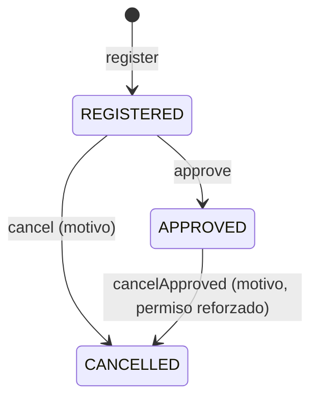

# Spec de workflow: factura (fase A, modelo común)

> Plantilla: [`WORKFLOW_TEMPLATE`](../../engineering/templates/WORKFLOW_TEMPLATE.md). Reglas: [`WORKFLOW_STANDARD`](../../engineering/standards/WORKFLOW_STANDARD.md). Fuente: [ADR-0020](../../engineering/adr/0020-facturacion.md), con [ADR-0017](../../engineering/adr/0017-estados-contrato.md) (efectos del estado del contrato), [ADR-0021](../../engineering/adr/0021-facturacion-contrato-mayor.md) y [ADR-0023](../../engineering/adr/0023-facturacion-simple.md). **Aprobada por el usuario el 2026-10-05 e implementada:** [DEC-042](../../engineering/decisiones/DEC-042-facturas-area-ciclo-vida.md).

## Alcance

**Fase A (esta spec):** encabezado común de la factura, sus cuatro tipos, el ciclo de vida (registrada → aprobada → anulada), los permisos, el historial, la inmutabilidad, la idempotencia y los efectos del estado del contrato sobre qué factura se admite. Pantallas: listado, expediente y formulario en el área nueva `billing/`, y la pestaña Facturas del contrato.

**Fuera de alcance (fase B, bloqueada por decisiones de negocio):** los detalles por tipo con sus importes (DEC-02, DEC-03, DEC-07), la factura de avance (DEC-01), los saldos de anticipo y retenido (DEC-05, DEC-11), el límite de las de liquidación (DEC-08), las hipótesis de subcontratista (DEC-09), el evaluador C1–C8 y la transición a liquidado (DEC-15), y la instantánea de saldos en la aprobación. En la fase A **una factura no tiene importes**: registra el documento y su ciclo de vida.

## Decisiones tomadas por el usuario (2026-10-05)

| Tema | Decisión |
| --- | --- |
| Área (PD-05) | Área nueva **`billing/`**: `/api/billing/invoices`, `server/src/modules/billing/invoices/`, `client/src/views/billing/invoices/` |
| Estados (DEC-16) | Los tres del ADR-0020: registrada, aprobada, anulada |
| Unicidad del número (DEC-17) | Por proveedor; una anulada sigue ocupando su número |
| Alcance | Modelo común ahora; detalles y cálculos cuando se resuelvan las decisiones contables |

## Modelo

`tbl_invoices` (prefijo `inv_`):

| Columna | Tipo | Notas |
| --- | --- | --- |
| `inv_id` | int PK | |
| `inv_type` | varchar(20) | `SIMPLE`, `ADVANCE` (anticipo), `LIQUIDATION`, `RETENTION_REFUND` (devolución de retenido), con `CHECK` |
| `prv_id` | int NOT NULL | FK a proveedores |
| `wrk_id` | int NOT NULL | Obra. En las de contrato, la del contrato (garantizada por FK compuesta) |
| `wks_id` | int NULL | Etapa: obligatoria en `SIMPLE`, nula en las de contrato (la etapa es la del contrato, que hoy es opcional) |
| `ctr_id` | int NULL | Contrato: nulo en `SIMPLE`, obligatorio en los demás |
| `inv_number` | varchar(50) NOT NULL | `UNIQUE (prv_id, inv_number)` |
| `inv_date` | date NOT NULL | Fecha de factura |
| `inv_approval_date` | date NULL | La fija el acto de aprobar |
| `inv_voucher_number` | varchar(50) NULL | Número de comprobante |
| `inv_statement` | varchar(100) NULL | Extracto |
| `inv_description` | varchar(500) NULL | |
| `inv_state` | varchar(20) | `REGISTERED`, `APPROVED`, `CANCELLED`, con `CHECK` |
| `sta_id` | | Columna estándar de visibilidad. **Ningún endpoint elimina facturas** (ADR-0020, decisión 12): se anulan |
| `inv_idempotency_key/_hash` | | `UNIQUE` sobre la clave |
| Seis columnas de autoría | | Con FK a `tbl_users` |

Restricciones en la BD:

- `CHECK` tipo ⇔ contrato ⇔ etapa: `SIMPLE` sin contrato y con etapa; los demás con contrato y sin etapa.
- `CHECK` estado ⇔ fecha de aprobación: aprobada (o anulada después de aprobar) tiene fecha; registrada no. Se expresa como `inv_state <> 'REGISTERED' OR inv_approval_date IS NULL` y `inv_state <> 'APPROVED' OR inv_approval_date IS NOT NULL`. Una anulada conserva la fecha si la tenía.
- `CHECK` `inv_approval_date >= inv_date`.
- FK compuestas, como en contratos (DEC-035): `(wrk_id, prv_id) → tbl_work_providers` (el proveedor está asignado a la obra), `(wks_id, wrk_id) → tbl_work_stages` (la etapa es de la obra) y `(ctr_id, wrk_id, prv_id) → tbl_contracts` (proveedor y obra son los del contrato). La última exige un `UNIQUE (ctr_id, wrk_id, prv_id)` nuevo en `tbl_contracts`.
- Índices por proveedor, contrato, tipo, estado y fecha.
- **Sin columnas de total, neto ni saldo.**

`tbl_invoice_status_history` (prefijo `ish_`): `inv_id`, estado anterior, estado nuevo, origen (`AUTOMATIC`/`MANUAL`), `rea_id` (motivo, nulo salvo en anular), observación, autor, fecha, `ish_idempotency_key/_hash` (`UNIQUE`). Sin edición ni borrado.

Motivos de anulación: el catálogo `tbl_reasons` gana el ámbito `INVOICE_CANCEL` (DEC-039 prevé ampliar el `CHECK` y `REASON_SCOPES`). La pantalla de Motivos lo muestra como un acto más.

## Estados

| Estado | Significado | Inicial / terminal | Qué escrituras admite |
| --- | --- | --- | --- |
| `REGISTERED` | Registrada: no cuenta para nada | Inicial | Editar todo salvo tipo y contrato · aprobar · anular |
| `APPROVED` | Aprobada: la que contará para saldos y liquidación (fase B) | — | Editar solo extracto y descripción · anular (permiso reforzado) |
| `CANCELLED` | Anulada: excluida de todo cálculo, conservada | Terminal | Ninguna |

## Transiciones permitidas

| Acción | Desde | Hacia | Manual / automática | Permiso | Guardas (bajo bloqueo) | Motivo |
| --- | --- | --- | --- | --- | --- | --- |
| `register` | — | `REGISTERED` | Automática (al crear) | Crear factura | Proveedor asignado a la obra · etapa de la obra (`SIMPLE`) · contrato no eliminado y cuyo estado admite el tipo (de contrato) · número libre para el proveedor | No |
| `approve` | `REGISTERED` | `APPROVED` | Manual | Aprobar factura | Fecha de aprobación ≥ fecha de factura y ≤ hoy · el estado del contrato **todavía** admite el tipo | No (observación opcional) |
| `cancel` | `REGISTERED` | `CANCELLED` | Manual | Anular factura | — | Sí: motivo del catálogo + observación |
| `cancelApproved` | `APPROVED` | `CANCELLED` | Manual | Anular factura aprobada | — | Sí: motivo del catálogo + observación |

Qué tipo admite cada estado del contrato (ADR-0017, "Efectos de cada estado"), declarado en `STATE_ALLOWS` de `contractTerms.js`:

| Estado del contrato | Anticipo | Liquidación | Devolución de retenido |
| --- | --- | --- | --- |
| En ejecución | Sí | No | No |
| Suspendido | No | No | No |
| En liquidación | No | Sí | Sí |
| Liquidado | No | No | No |

La factura `SIMPLE` no tiene contrato y no depende de ningún estado.

## Transiciones prohibidas

| Desde → hacia | Por qué |
| --- | --- |
| `APPROVED` → `REGISTERED` | No se desaprueba: se anula y se registra de nuevo (ADR-0020) |
| `CANCELLED` → cualquiera | Terminal |
| Cualquier "PUT del estado" | El estado no es un campo del formulario (WORKFLOW_STANDARD, regla 3) |

## Efectos de cada transición

| Acción | Escrituras en la misma transacción | Después del commit |
| --- | --- | --- |
| `register` | Factura · historial (`null → REGISTERED`) · bitácora `CREAR` | — |
| `approve` | Estado y fecha de aprobación · historial · bitácora `EDITAR` con estado y fecha. En fase B: evaluar C1–C8 si es de liquidación o devolución | — |
| `cancel` / `cancelApproved` | Estado · historial con motivo y observación · bitácora `EDITAR` | — |
| Editar | Campos admitidos por el estado · bitácora `EDITAR` con anterior y nuevo | — |

## Transacción y bloqueos

Orden de `LOCK_ORDER`: OBRA → PROVEEDOR → CONTRATO → FACTURA. `FACTURA` se registra en `LOCKABLE`.

| Acción | Bloquea | Cómo obtiene el id antes del bloqueo |
| --- | --- | --- |
| Crear `SIMPLE` | OBRA → PROVEEDOR | Vienen en la petición |
| Crear de contrato | CONTRATO | Viene en la petición; obra y proveedor se leen del contrato **ya bloqueado** (no se aceptan del cliente) |
| Editar, aprobar, anular | CONTRATO (si tiene) → FACTURA | Se lee `ctr_id` de la factura antes del bloqueo: es inmutable desde la creación (patrón de `updateConcept`) |

Bajo bloqueo se relee la factura y se verifica estado y guardas; nunca con lo leído antes.

## Rollback

Todo en una transacción (`withLockedTransaction`): si falla el historial o la bitácora, no queda ni el estado ni la fecha de aprobación. No hay efectos externos.

## Idempotencia

- Crear: clave en `tbl_invoices` (`runIdempotent`, como contratos). El reenvío devuelve la misma factura.
- Aprobar y anular: clave en `tbl_invoice_status_history`. El reenvío con la misma clave devuelve el resultado de la primera. Sin clave, repetir sobre una factura ya en el estado destino responde 409 con el estado actual.

## Concurrencia

| Escenario | Resultado |
| --- | --- |
| Doble clic al registrar | Misma clave → una sola factura |
| Dos aprobaciones a la vez | La segunda espera el bloqueo, lee `APPROVED` y recibe 409 |
| Aprobar mientras otro anula | El primero gana; el segundo recibe 409 con el estado actual |
| Dos facturas con el mismo número del mismo proveedor | `UNIQUE` → 409 "Ya existe una factura con ese número para el proveedor." |
| Registrar un anticipo mientras se crea el otrosí de liquidación | Ambos bloquean el contrato: el que llega segundo ve el estado nuevo; el anticipo recibe 409 si el contrato ya pasó a liquidación |
| Cambiar el proveedor de un contrato con facturas | 409 del service; la FK compuesta lo garantiza también |

## Invariantes

Nuevas, para `DOMAIN_INVARIANTS.md`: el tipo decide contrato y etapa (`CHECK`); proveedor y obra de una factura con contrato son los del contrato (FK compuesta); el número es único por proveedor (`UNIQUE`); una factura no se elimina; una aprobada no cambia sus datos financieros; `CANCELLED` es terminal; solo el estado del contrato que lo admite recibe cada tipo (service, bajo bloqueo).

## Permisos

Página nueva "Facturas" (pag 19) dentro del grupo nuevo "Facturación" (pag 18).

| Id | Permiso | Uso |
| --- | --- | --- |
| 83 | Ver facturas | Listado, expediente, historial, selectores del formulario |
| 84 | Crear factura | Registrar |
| 85 | Modificar factura | Editar mientras está registrada; extracto y descripción después |
| 86 | Aprobar factura | Separado de crear (segregación) |
| 87 | Anular factura | Solo registradas |
| 88 | Anular factura aprobada | Permiso reforzado |

Si los permisos deben diferenciarse por tipo de factura sigue pendiente (DEC-19); el modelo lo admite sin cambios.

## Auditoría

Entidad nueva `FACTURA` en `AUDIT_ENTITIES`. Crear con todos los campos; editar con anterior y nuevo (número, fechas, comprobante, proveedor, obra y etapa como funcionales; extracto y descripción como técnicos, pero se registran igual); aprobar y anular con estado, fecha, motivo y observación. La instantánea de saldos al aprobar llega con la fase B.

## Notificaciones

Ninguna en la fase A.

## Efectos sobre los módulos existentes

- **Contratos:** `STATE_ALLOWS` declara los tipos de factura por estado. Eliminar un contrato con facturas responde 409 (ADR-0015, decisión 11). Cambiar el proveedor de un contrato con facturas responde 409. El expediente del contrato gana la pestaña **Facturas** (listado de solo lectura con enlace al expediente de la factura y botón de registrar si el estado lo admite).
- **Obras y proveedores:** su expediente gana la pestaña **Facturas** (el mismo listado filtrado por la obra o el proveedor; en la obra, botón de registrar una simple con la obra ya elegida). Eliminar una obra con facturas, desasignar un proveedor de una obra donde tiene facturas y quitar una etapa con facturas responden 409 (las FK compuestas lo garantizan; el service da el mensaje).
- **Motivos:** ámbito nuevo `INVOICE_CANCEL`.

## Pantallas

- `billing/invoices`: listado sobre `MasterPage` con búsqueda (número, proveedor, contrato), pestañas por estado con conteo y columnas tipo, número, proveedor, obra, contrato, fecha, estado.
- `/new`, `/:id`, `/:id/edit` en `RouteDialog` (DEC-034). Formulario: tipo primero; `SIMPLE` pide obra → proveedor asignado → etapa; los de contrato piden el contrato (solo los que admiten el tipo) y muestran obra y proveedor en solo lectura. Expediente: datos, historial de estado y acciones Aprobar y Anular según `allowedActions` y permisos, con diálogo de confirmación (fecha de aprobación; motivo y observación).

## Endpoints (`/api/billing/invoices/…`)

| Método | Acción | Permiso |
| --- | --- | --- |
| GET | `pagination_invoices` | Ver |
| GET | `get_invoice` | Ver |
| GET | `get_invoice_form_options` (etapas y proveedores asignados de una obra) | Ver |
| GET | `select_invoice_contracts` (contratos cuyo estado admite el tipo) | Ver |
| POST | `save_invoice` (crear, `Idempotency-Key`) | Crear |
| PUT | `save_invoice` (editar) | Modificar |
| POST | `approve_invoice` (`Idempotency-Key`) | Aprobar |
| POST | `cancel_invoice` (`Idempotency-Key`) | Anular o anular aprobada, según el estado bajo bloqueo |

## Escenarios de fallo

| Escenario | Resultado esperado |
| --- | --- |
| Transición no permitida desde el estado actual | 409 con el estado actual |
| Usuario sin permiso | 403 |
| Reintento con la misma clave | El resultado de la primera ejecución |
| Dos transiciones concurrentes | La segunda, 409 |
| Contrato en un estado que no admite el tipo | 409 con el estado del contrato |
| Fecha de aprobación anterior a la de factura o futura | 400 |
| Importe, estado o fecha de aprobación enviados en el cuerpo | Se ignoran: el validador no los acepta |
| Fallo después de escribir el estado y antes del historial | Rollback completo |

## Decisiones de negocio pendientes

DEC-01, DEC-02, DEC-03, DEC-05, DEC-07, DEC-08, DEC-09, DEC-11, DEC-15 y DEC-19 (ver `docs/backlog/BACKLOG.md`). Ninguna bloquea la fase A; todas bloquean la fase B.
