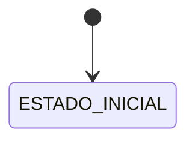

# Spec de workflow: `<entidad>`

> Plantilla para una entidad de nivel 3 o una operación de nivel 4. Incluye todo lo de [`CRUD_TEMPLATE`](CRUD_TEMPLATE.md) más lo siguiente. Reglas: [`WORKFLOW_STANDARD`](../standards/WORKFLOW_STANDARD.md). Requiere aprobación explícita antes de implementar.

## Estados

| Estado | Significado | Inicial / terminal | Qué escrituras admite |
| --- | --- | --- | --- |
| | | | |

## Transiciones permitidas

| Acción | Desde | Hacia | Manual / automática | Permiso | Guardas (bajo bloqueo) | Motivo obligatorio |
| --- | --- | --- | --- | --- | --- | --- |
| | | | | | | |

## Transiciones prohibidas

| Desde → hacia | Por qué |
| --- | --- |
| | |

## Efectos de cada transición

| Acción | Escrituras en la misma transacción | Después del commit |
| --- | --- | --- |
| | Estado · historial · auditoría · … | Notificación · … |

## Transacción y bloqueos

Entidades que bloquea cada acción, en el orden de `LOCK_ORDER`, y cómo se obtiene el id de cada una **sin leer antes del bloqueo**.

## Rollback

Qué pasa si falla cada paso. Qué efectos externos quedan pendientes y cómo se reintentan.

## Idempotencia

Dónde vive la clave (entidad creada o historial) y qué devuelve repetir una transición ya aplicada.

## Concurrencia

Escenarios de dos usuarios a la vez sobre el mismo registro o el mismo saldo, y cómo termina cada uno (quién gana, qué código recibe el otro).

## Invariantes

Las que toca ([`DOMAIN_INVARIANTS`](../invariants/DOMAIN_INVARIANTS.md)) y cómo se revalidan.

## Permisos

Uno por acción. Cuáles son de gestión y cuáles de ver.

## Auditoría

Qué se registra en la bitácora en cada transición, con qué instantánea.

## Notificaciones

Quién se entera de qué, por qué canal.

## Escenarios de fallo

| Escenario | Resultado esperado |
| --- | --- |
| Transición no permitida desde el estado actual | |
| Usuario sin permiso | |
| Reintento con la misma clave | |
| Dos transiciones concurrentes | |
| Guarda de saldo incumplida | |
| Fallo después de escribir el estado y antes del historial | Rollback completo |

## Decisiones de negocio pendientes

Las del backlog (`DEC-xx`) que bloquean este workflow.
